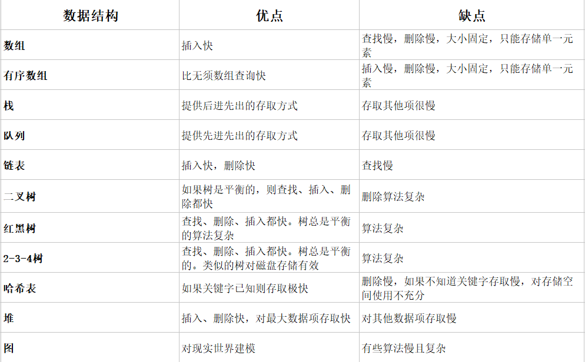

### 数据结构与算法

-----

### 一、数据结构与算法简介

- 学习开始于 [Java技术驿站](http://cmsblogs.com/?p=8047)   
- 可视化学习地址：[数据结构动画版](https://www.cs.usfca.edu/~galles/visualization/Algorithms.html)   

刚开始接触可能大家和我一样有很多疑问：

1. 什么是数据结构与算法？
2. 为什么要学习数据结构与算法？
3. 为什么不能只使用数组和for循环

#### （1）常见的数据结构


​    数据机构的特性如下：

   

- **二分查法** 【对数】找所需的比较次数/

#####  1、 大O表示法

**前情回顾**  

- 无需数组插入：常数   T=K   O(1)
- 线性查找：与n成正比  T= K*N    O(n)
- 二分查找与 log(N) 成正比   T= K* ㏒(N)   O(㏒(N))

```txt
解释：log(N):由于时间T与以2为底N的对数成正比，由于所有的对数都和其他数成比例（从底数2转化为底数为10需要乘以3.322）我们选择将这个常数并入K中
由此不必指定底数：  T=K*log(N)
```

**回到正题：**  

- 大O表示法是省去了常数K, O ≈ "order of" 大约是的意思，那么
  - 线性查找使用了 O(n)级的查找
  - 二分法查找使用了 O(log(n))的时间查找
  - 向一个无需数组中插入一个元素使用 O(1)的时间查找

##### 2、排序算法

> 术语说明  [入口](https://www.cnblogs.com/guoyaohua/p/8600214.html#4264874) 

- **稳定**：如果a原本在b前面，而a=b，排序之后a仍然在b的前面；
- **不稳定**：如果a原本在b的前面，而a=b，排序之后a可能会出现在b的后面；
- **内排序**：所有排序操作都在内存中完成；
- **外排序**：由于数据太大，因此把数据放在磁盘中，而排序通过磁盘和内存的数据传输才能进行；
- **时间复杂度：** 一个算法执行所耗费的时间。
- **空间复杂度**：运行完一个程序所需内存的大小。

> 算法概述


**图片名词解释：**

- n: 数据规模
- k: “桶”的个数
- In-place: 占用常数内存，不占用额外内存
- Out-place: 占用额外内存

**算法分类**


**比较和非比较的区别**

常见的**快速排序、归并排序、堆排序、冒泡排序**等属于**比较排序**。**在排序的最终结果里，元素之间的次序依赖于它们之间的比较。每个数都必须和其他数进行比较，才能确定自己的位置。**
在**冒泡排序**之类的排序中，问题规模为n，又因为需要比较n次，所以平均时间复杂度为O(n²)。在**归并排序、快速排序**之类的排序中，问题规模通过**分治法**消减为logN次，所以时间复杂度平均**O(nlogn)**。
比较排序的优势是，适用于各种规模的数据，也不在乎数据的分布，都能进行排序。可以说，**比较排序适用于一切需要排序的情况。**

**计数排序、基数排序、桶排序**则属于**非比较排序**。非比较排序是通过确定每个元素之前，应该有多少个元素来排序。针对数组arr，计算arr[i]之前有多少个元素，则唯一确定了arr[i]在排序后数组中的位置。
非比较排序只要确定每个元素之前的已有的元素个数即可，所有一次遍历即可解决。算法时间复杂度**O(n)**。
**非比较排序时间复杂度底，但由于非比较排序需要占用空间来确定唯一位置。所以对数据规模和数据分布有一定的要求。**


###### (1) 冒泡排序

> 这个算法的名字由来是因为越小的元素会经由交换慢慢“浮”到数列的顶端。 

   **基本思想**  

1. 比较两个成员
2. 如果左边大于右边的数，则交换位置
3. 向右移动一个位置，比较下面连个成员

 **具体实现**  

```java
 /**
     * 冒泡排序  性能分析：
     *  假设参与比较的数组元素个数为 N，则第一轮排序有 N-1 次比较，第二轮有 N-2 次，如此类推，这种序列的求和公式为：
     * （N-1）+（N-2）+...+1 = N*（N-1）/2   使用大O表示====>  O(n²)
     *
     * @param array
     * @return
     */
    public static int[] sort(int[] array) {
        // for循环表示总共需要比较多少轮
        for (int i = 1; i < array.length; i++) {
            // 设定标记，若为true,则表示此循环没有进行交换，也就是待排序列已有序，排序完成
            boolean flag = true;
            // for循环表示每轮比较参与的元素下标
            // 对当前无序区间array[0......length-i]进行排序
            // j的范围很关键，这个范围是在逐步缩小的,因为每轮比较都会将最大的放在右边
            for (int j = 0; j < array.length - i; j++) {
                if (array[j] > array[j + 1]) {
                    int temp = array[j];
                    array[j] = array[j + 1];
                    array[j + 1] = temp;
                    flag = false;
                }
            }
            if (flag) break;
            System.out.println("排序次数" + i + " = " + Arrays.toString(array));
        }

        return array;
    }
```

**冒泡排序性能分析：**

　　假设参与比较的数组元素个数为 N，则第一轮排序有 N-1 次比较，第二轮有 N-2 次，如此类推，这种序列的求和公式为：

　　（N-1）+（N-2）+...+1 = N*（N-1）/2

　　当 N 的值很大时，算法比较次数约为 N2/2次比较，忽略减1。

　　假设数据是随机的，那么每次比较可能要交换位置，可能不会交换，假设概率为50%，那么交换次数为 N2/4。不过如果是最坏的情况，初始数据是逆序的，那么每次比较都要交换位置。

　　交换和比较次数都和N2 成正比。由于常数不算大 O 表示法中，忽略 2 和 4，那么冒泡排序运行都需要 O(N2) 时间级别。

　　其实无论何时，只要看见一个循环嵌套在另一个循环中，我们都可以怀疑这个算法的运行时间为 O(N2)级，外层循环执行 N 次，内层循环对每一次外层循环都执行N次（或者几分之N次）。这就意味着大约需要执行N2次某个基本操作。

###### (2)  选择排序

　 选择排序是每一次从待排序的数据元素中选出最小的一个元素，存放在序列的起始位置，直到全部待排序的数据元素排完。

> 分析思路

1. 从待排序序列中，找到关键字最小的元素
2. 如果最小元素不是待排序序列的第一个元素，将其和第一个元素互换
3. 从剩下的N-1个元素中，找出关键字最小的元素，重复（1）、（2），直到排序结束


 **具体实现**：

```java
/**
     * 选择排序的实现
     */
    public static int[] choiceSort(int[] array){
        // 总共要经过N-1轮的比较
        for (int i = 0; i < array.length; i++) {
            int min= i;
            // 每轮需要比较的次数
            for (int j = i+1; j < array.length; j++) {
                 if (array[j]<array[min]){
                     min = j; // 记录目前能找到的最小值元素的下标
                 }
            }
            // 将找到的最小值和i位置所在的值交换
            if (i != min){
                int temp = array[i];
                array[i] = array[min];
                array[min] = temp;
            }
            //第 i轮排序的结果为
            System.out.println("第"+(i+1)+"轮排序后的结果为:"+ Arrays.toString(array));
        }

        return array;
    }
```

**选择排序性能分析：**

　　选择排序和冒泡排序执行了相同次数的比较：N*（N-1）/2，但是至多只进行了N次交换。

　　当 N 值很大时，比较次数是主要的，所以和冒泡排序一样，用大O表示是O(N2) 时间级别。但是由于选择排序交换的次数少，所以选择排序无疑是比冒泡排序快的。当 N 值较小时，如果交换时间比选择时间大的多，那么选择排序是相当快的。

###### (3) 插入排序　　

- 直接插入排序基本思想是每一步将一个待排序的记录，插入到前面已经排好序的有序序列中去，直到插完所有元素为止。

- 插入排序还分为直接插入排序、二分插入排序、链表插入排序、希尔排序等等，这里我们只是以直接插入排序讲解，后面讲高级排序的时候会将其他的。


**具体实现** 

```java
public static int[] InsertSort(int[] array) {
        int base;
        // 从下标为1的元素开始选择合适的位置插入，因为下标为0 的只有一个元素，默认是有序的
        for (int i = 1; i < array.length; i++) {
            int tmp = array[i]; //记录要插入的数据
            base = i;

            while (base > 0 && tmp < array[base - 1]) {
                array[base] = array[base - 1];// 向后挪动
                base--;
            }
            array[base] = tmp; // 存在比其小的数，插入
        }
        return array;
    }
```

**插入排序性能分析：**

　　在第一轮排序中，它最多比较一次，第二轮最多比较两次，一次类推，第N轮，最多比较N-1次。因此有 1+2+3+...+N-1 = N*（N-1）/2。

　　假设在每一轮排序发现插入点时，平均只有全体数据项的一半真的进行了比较，我们除以2得到：N*（N-1）/4。用大O表示法大致需要需要 O(N2) 时间级别。

　　复制的次数大致等于比较的次数，但是一次复制与一次交换的时间耗时不同，所以相对于随机数据，插入排序比冒泡快一倍，比选择排序略快。

　　这里需要注意的是，如果要进行逆序排列，那么每次比较和移动都会进行，这时候并不会比冒泡排序快。

###### (4) 快速排序


  **具体实现**

```java
private static void quickSort(int[] arr, int leftIndex, int rightIndex) {
        if (leftIndex >= rightIndex) {
            return;
        }

        int left = leftIndex;
        int right = rightIndex;
        //待排序的第一个元素作为基准值
        int key = arr[left];

        //从左右两边交替扫描，直到left = right
        while (left < right) {
            while (right > left && arr[right] >= key) {
                //从右往左扫描，找到第一个比基准值小的元素
                right--;
            }

            //找到这种元素将arr[right]放入arr[left]中
            arr[left] = arr[right];

            while ( right>left && arr[left] <= key) {
                //从左往右扫描，找到第一个比基准值大的元素
                left++;
            }
            //找到这种元素将arr[left]放入arr[right]中
            arr[right] = arr[left];
        }
        //基准值归位
        arr[left] = key;
        //对基准值左边的元素进行递归排序
        quickSort(arr, leftIndex, left - 1);
        //对基准值右边的元素进行递归排序。
        quickSort(arr, right + 1, rightIndex);
    }
```

##### 3、栈

> 　**栈**（英语：stack）又称为**堆\****栈**或**堆叠，**栈作为一种数据结构，是一种只能在一端进行插入和删除操作的特殊线性表。它按照先进后出的原则存储数据，先进入的数据被压入栈底，最后的数据在栈顶，需要读数据的时候从栈顶开始弹出数据（最后一个数据被第一个读出来）。栈具有记忆作用，对栈的插入与删除操作中，不需要改变栈底指针。


###### （1）具体实例

```java

public class Test {

    public static void main(String[] args) {

        Stack stack = new Stack(5);
        stack.push("曹操");
        stack.push("张翼德");
        stack.push("曹丕");
        stack.push("曹丕");
        stack.push("曹丕");
        System.out.println("stack.pop() = " + stack.pop());
        System.out.println("stack.peek() = " + stack.peek());
        System.out.println("stack.getLen() = " + stack.getLen());

    }
}

@Data
class Stack {

    private int top;
    private int maxSize;
    private Object[] objects;

    public Stack(int maxSize) {
        this.maxSize = maxSize;
        top = 0;
        objects = new Object[maxSize];
    }


    /**
     * 查看栈元素，不删除
     */
    public Object peek() {
        return objects[top - 1];
    }

    /**
     * 出栈元素
     */
    public Object pop() {
        if (isEmpty()) {
            throw new RuntimeException("栈已经为空");
        }
        // 先减是因为数组的长度从0开始
        return objects[--top];
    }

    /**
     * 栈中压入数据
     */

    public void push(Object elem) {
        if (isFull()) {
            throw new RuntimeException("栈已满");
        }
        objects[top++] = elem;
    }

    /**
     * 获取栈数量
     */

    public Integer getLen() {
        return top;
    }

    /**
     * 判断栈是否已满
     */
    public boolean isFull() {
        return top == maxSize;
    }

    /**
     * 判断栈是否为空
     */
    public boolean isEmpty() {
        return top == 0;
    }

    /**
     * 清空栈
     */
    public void clear() {
        while (top != 0) {
            pop();
        }
    }

}

```

###### （2）字符串逆置

```java
//进行字符串反转
@Test
public void testStringReversal(){
    Stack stack = new Stack();
    String str = "how are you";
    char[] cha = str.toCharArray();
    for(char c : cha){
        stack.push(c);
    }
    while(!stack.isEmpty()){
        System.out.print(stack.pop());
    }
}
```

###### （3）括号匹配

```java
 //判断括号是否有效
    public static boolean isValid(String s){
        Stack<Character> stack=new Stack<>();
        for (int i = 0; i < s.length(); i++) {
            char ch=s.charAt(i);
            // 如果左括号，将其放入栈中
            if (ch=='(' || ch=='{' || ch=='['){
                stack.push(ch);
            }else {
                // 如果栈为空，则证明括号不匹配，返回false
               if (stack.isEmpty()){
                   return false;
               }
               char topChar=stack.pop();
               if (ch==')'&&topChar!='('){return false;}
               else if (ch=='}'&&topChar!='{'){return false;}
               else if(ch==']'&&topChar!='['){return false;}
            }
        }
        return stack.isEmpty();
    }
```

##### 4、队列

###### （1）队列的基本概念

​            队列（queue）是一种特殊的线性表，特殊之处在于它只允许在表的前端（front）进行删除操作，而在表的后端（rear）进行插入操作，和栈一样，队列是一种操作受限制的线性表。进行插入操作的端称为队尾，进行删除操作的端称为队头。队列中没有元素时，称为空队列。

　　队列的数据元素又称为队列元素。在队列中插入一个队列元素称为入队，从队列中删除一个队列元素称为出队。因为队列只允许在一端插入，在另一端删除，所以只有最早进入队列的元素才能最先从队列中删除，故队列又称为先进先出（FIFO—first in first out）线性表。

　　比如我们去电影院排队买票，第一个进入排队序列的都是第一个买到票离开队列的人，而最后进入排队序列排队的都是最后买到票的。

　　在比如在计算机操作系统中，有各种队列在安静的工作着，比如打印机在打印列队中等待打印。

　　队列分为：

　　①、单向队列（Queue）：只能在一端插入数据，另一端删除数据。

　　②、双向队列（Deque）：每一端都可以进行插入数据和删除数据操作。

　　这里我们还会介绍一种队列——优先级队列，优先级队列是比栈和队列更专用的数据结构，在优先级队列中，数据项按照关键字进行排序，关键字最小（或者最大）的数据项往往在队列的最前面，而数据项在插入的时候都会插入到合适的位置以确保队列的有序。

###### （2）队列的基本实现

```java
public class SingleQueue {
    public static void main(String[] args) {

        Queue queue = new Queue(3);
        queue.add(2);
        queue.add(3);//queArray数组数据为[2, 3, null]
        System.out.println(queue);
        System.out.println(queue.peekHead()); //1
        // 删除 元素
        queue.remove();//queArray数组数据为[null, 3, null]

        System.out.println(queue);
        System.out.println(queue.peekHead()); //2

        queue.add(4);//queArray数组数据为[4,2,3]
        queue.add(5);//队列已满,queArray数组数据为[4,2,3]
        System.out.println(queue);
    }
}

// 定义一个单向队列
@Data
class Queue {

    // 数组模拟队列
    private Object[] queArr;
    // 队列总大小
    private int maxSize;
    // 队头
    private int front;
    // 队尾
    private int tail;

    // 队列中元素的实际数目
    private int length;

    // 通过构造函数初始化初始容量
    public Queue(int maxSize) {
        this.maxSize = maxSize;
        queArr = new Object[maxSize];
        front = 0;
        tail = -1;
        length = 0;
    }


    //队列中新增数据
    public void add(Object object) {
        if (isFull()) {
            throw new RuntimeException("队列已满");
        } else {
            // 如果队列尾部指向顶了，那么循环回来执行队列的第一个元素
            if (tail == maxSize - 1) {
                tail = -1;
            }
            //队尾指针+1，然后在队尾指针处插入新的数据
            queArr[++tail] = object;
            length++;
        }
    }

    //移除数据
    public Object remove() {
        Object removeValue = null;
        if (!isEmpty()) {
            removeValue = queArr[front];
            queArr[front] = null;
            front++;
            if (front == maxSize) {
                front = 0;
            }
            length--;
            return removeValue;
        }
        return removeValue;
    }

    // 查看对头元素
    public Object peekHead() {
        return queArr[front];
    }

    // 判断队列是否已满
    public boolean isFull() {
        return length == maxSize;
    }

    // 判断队列是否为空
    public boolean isEmpty() {
        return length == 0;
    }

    // 查看队列的大小
    public int getSize() {
        return length;
    }
}
```


