### Docker 技术

---

### 一、Docker 简介

- 官网文档：https://docs.docker.com/v18.09/get-started/
- 学习教程：https://www.runoob.com/docker/windows-docker-install.html
- docker论坛：https://www.docker.org.cn/book/
- docker 镜像加速地址：https://www.runoob.com/docker/docker-mirror-acceleration.html

#### （1）技术定位

- JavaEE   Java     springMVC/springboot/mybatis...
- Docker     go        Swarm/Compose/Machine/mesos/k8s/ --- CI/CD  jenkins 整合

#### （2）Docker是什么

> **1. 为什么会出现Docker** 

​        一款产品从开发到上线，从操作系统，到运行环境，再到应用配置。作为开发+运维之间的协作我们需要关心很多东西，这也是很多互联网公司都不得不面对的问题，特别是各种版本的迭代之后，不同版本环境的兼容，对运维人员都是考验Docker之所以发展如此迅速，也是因为它对此给出了一个标准化的解决方案。环境配置如此麻烦，换一台机器，就要重来一次，费力费时。很多人想到，能不能从根本上解决问题，

- 软件可以带环境安装？

  也就是说，安装的时候，把原始环境一模一样地复制过来。开发人员利用 Docker 可以消除协作编码时“在我的机器上可正常工作”的问题。

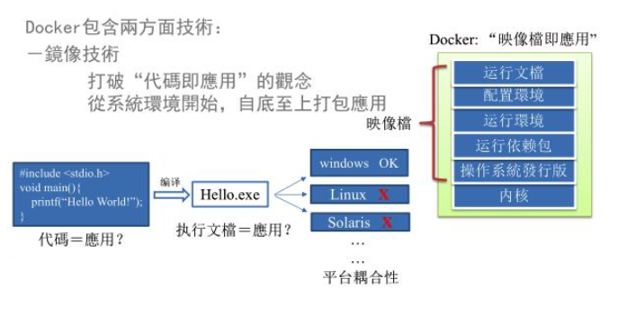

 之前在服务器配置一个应用的运行环境，要安装各种软件，就拿尚硅谷电商项目的环境来说吧，Java/Tomcat/MySQL/JDBC驱动包等。安装和配置这些东西有多麻烦就不说了，它还不能跨平台。假如我们是在 Windows 上安装的这些环境，到了 Linux 又得重新装。况且就算不跨操作系统，换另一台同样操作系统的服务器，要移植应用也是非常麻烦的。

- 传统上认为，软件编码开发/测试结束后，所产出的成果即是程序或是能够编译执行的二进制字节码等(java为例)。而为了让这些程序可以顺利执行，开发团队也得准备完整的部署文件，让维运团队得以部署应用程式，开发需要清楚的告诉运维部署团队，用的全部配置文件+所有软件环境。不过，即便如此，仍然常常发生部署失败的状况。
- Docker镜像的设计，使得Docker得以打破过去「程序即应用」的观念。透过镜像(images)将作业系统核心除外，运作应用程式所需要的系统环境，由下而上打包，达到应用程式跨平台间的无缝接轨运作。

> **2. docker理念**

- Docker是基于Go语言实现的云开源项目。

- Docker的主要目标是“Build，Ship and Run Any App,Anywhere”，也就是通过对应用组件的封装、分发、部署、运行等生命周期的管理，使用户的APP（可以是一个WEB应用或数据库应用等等）及其运行环境能够做到“一次封装，到处运行”。

  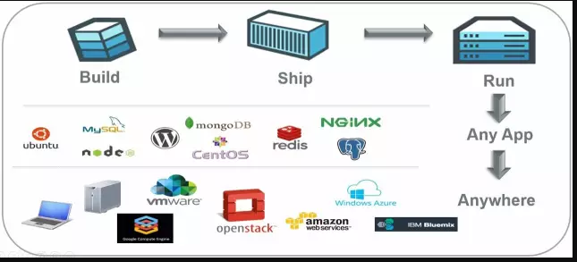

Linux 容器技术的出现就解决了这样一个问题，而 Docker 就是在它的基础上发展过来的。将应用运行在 Docker 容器上面，而 Docker 容器在任何操作系统上都是一致的，这就实现了跨平台、跨服务器。只需要一次配置好环境，换到别的机子上就可以一键部署好，大大简化了操作

> **解决了运行环境和配置问题软件容器，方便做持续集成并有助于整体发布的容器虚拟化技术。**

#### （3）Docker能干嘛

##### 1. 虚拟机技术

> 虚拟机（virtual machine）就是带环境安装的一种解决方案

​        它可以在一种操作系统里面运行另一种操作系统，比如在Windows 系统里面运行Linux 系统。应用程序对此毫无感知，因为虚拟机看上去跟真实系统一模一样，而对于底层系统来说，虚拟机就是一个普通文件，不需要了就删掉，对其他部分毫无影响。这类虚拟机完美的运行了另一套系统，能够使应用程序，操作系统和硬件三者之间的逻辑不变。  

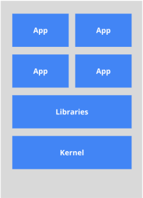

- 虚拟机的缺点：
  1. 资源占用多
  2. 冗余步骤多
  3. 启动慢

##### 2. 容器虚拟化技术

-  由于前面虚拟机存在这些缺点，Linux 发展出了另一种虚拟化技术：Linux 容器（Linux Containers，缩写为 LXC）

> Linux 容器不是模拟一个完整的操作系统，而是对进程进行隔离。有了容器，就可以将软件运行所需的所有资源打包到一个隔离的容器中。容器与虚拟机不同，不需要捆绑一整套操作系统，只需要软件工作所需的库资源和设置。系统因此而变得高效轻量并保证部署在任何环境中的软件都能始终如一地运行。

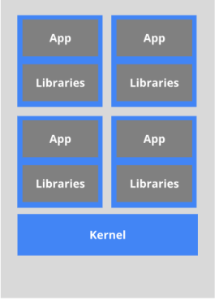

- **比较了 Docker 和传统虚拟化方式的不同之处：**
  1. 传统虚拟机技术是虚拟出一套硬件后，在其上运行一个完整操作系统，在该系统上再运行所需应用进程；
  2. 而容器内的应用进程直接运行于宿主的内核，容器内没有自己的内核，而且也没有进行硬件虚拟。因此容器要比传统虚拟机更为轻便。
  3. 每个容器之间互相隔离，每个容器有自己的文件系统 ，容器之间进程不会相互影响，能区分计算资源。

##### 3. 开发/运维（DevOps）

> **一处构建、随处运行**    DevOps 俗称：开发自运维

**好处：**

- **更快速的应用交付和部署：**  

​        传统的应用开发完成后，需要提供一堆安装程序和配置说明文档，安装部署后需根据配置文档进行繁杂的配置才能正常运行。Docker化之后只需要交付少量容器镜像文件，在正式生产环境加载镜像并运行即可，应用安装配置在镜像里已经内置好，大大节省部署配置和测试验证时间。

- **更便捷的升级和扩缩容：** 

​      随着微服务架构和Docker的发展，大量的应用会通过微服务方式架构，应用的开发构建将变成搭乐高积木一样，每个Docker容器将变成一块“积木”，应用的升级将变得非常容易。当现有的容器不足以支撑业务处理时，可通过镜像运行新的容器进行快速扩容，使应用系统的扩容从原先的天级变成分钟级甚至秒级。

- **更简单的系统运维：** 

​         应用容器化运行后，生产环境运行的应用可与开发、测试环境的应用高度一致，容器会将应用程序相关的环境和状态完全封装起来，不会因为底层基础架构和操作系统的不一致性给应用带来影响，产生新的BUG。当出现程序异常时，也可以通过测试环境的相同容器进行快速定位和修复。

- **更高效的计算资源利用：**  

　Docker是内核级虚拟化，其不像传统的虚拟化技术一样需要额外的Hypervisor支持，所以在一台物理机上可以运行很多个容器实例，可大大提升物理服务器的CPU和内存的利用率。

##### 4. 企业级

- 新浪

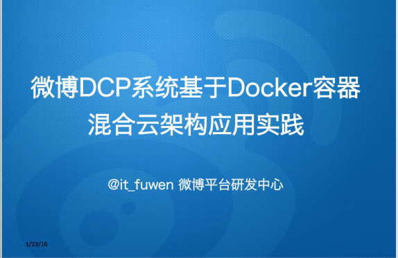

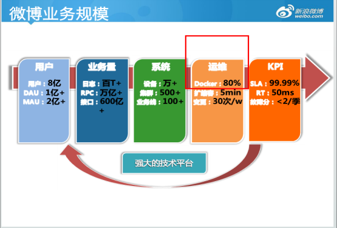

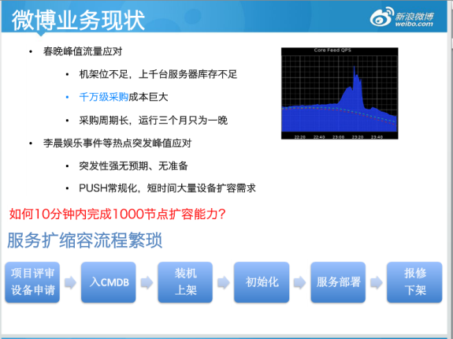

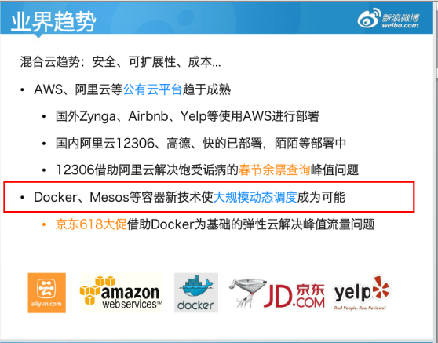

- 美团

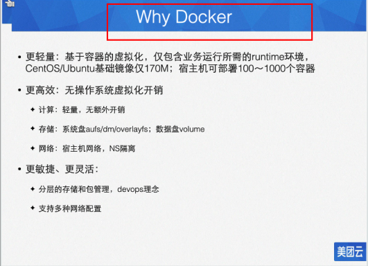

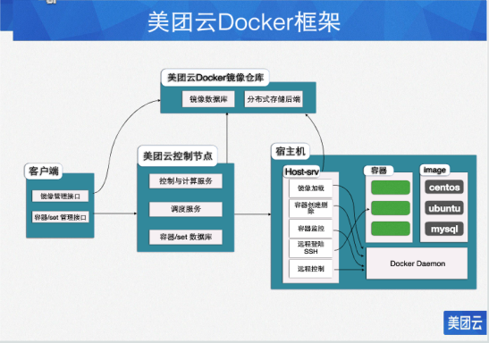

- 蘑菇街

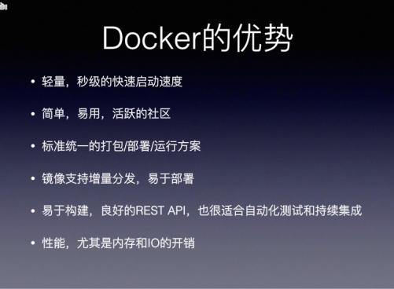

#### （4）Docker去哪下

- docker官网：http://www.docker.com
- docker中文网站：https://www.docker-cn.com
- Docker Hub官网: https://hub.docker.com

> 买书容易看书难，搬家还麻烦

- Docker 容器的三大特征
  - 镜像
  - 容器
  - 仓库

### 二、Docker  入门

#### （1）前提说明

- CentOS Docker 安装
- Docker支持以下的CentOS版本：
  - CentOS 7 (64-bit)
  - CentOS 6.5 (64-bit) 或更高的版本

**前提条件**
目前，CentOS 仅发行版本中的内核支持 Docker。

- Docker 运行在 CentOS 7 上，要求系统为64位、系统内核版本为 3.10 以上。
- Docker 运行在 CentOS-6.5 或更高的版本的 CentOS 上，要求系统为64位、系统内核版本为 2.6.32-431 或者更高版本。
- 查看自己的内核

` uname命令用于打印当前系统相关信息（内核版本号、硬件架构、主机名称和操作系统类型等）。`

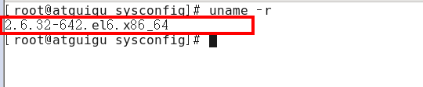

- 查看已安装的CentOS版本信息（CentOS6.8有，CentOS7无该命令）

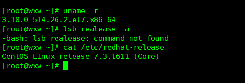

#### （2）Docker 基本组成

##### 1. Docker 架构图

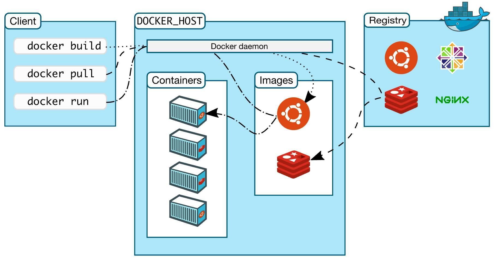

##### 2. Docker 基本组成

- 镜像（image）
- 容器（container）
- 仓库（repository）

**镜像：**

Docker 镜像（Image）就是一个只读的模板。镜像可以用来创建 Docker 容器，一个镜像可以创建很多容器。

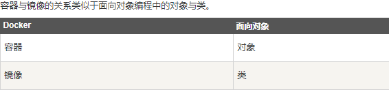

**容器：** 

Docker 利用容器（Container）独立运行的一个或一组应用。容器是用镜像创建的运行实例。

- 它可以被启动、开始、停止、删除。每个容器都是相互隔离的、保证安全的平台。
- 可以把容器看做是一个简易版的 Linux 环境（包括root用户权限、进程空间、用户空间和网络空间等）和运行在其中的应用程序。
- 容器的定义和镜像几乎一模一样，也是一堆层的统一视角，唯一区别在于容器的最上面那一层是可读可写的。

**仓库：** 

仓库（Repository）是集中存放镜像文件的场所。

- 仓库(Repository)和仓库注册服务器（Registry）是有区别的。仓库注册服务器上往往存放着多个仓库，每个仓库中又包含了多个镜像，每个镜像有不同的标签（tag）。
- 仓库分为公开仓库（Public）和私有仓库（Private）两种形式。
- 最大的公开仓库是 Docker Hub(https://hub.docker.com/)，存放了数量庞大的镜像供用户下载。国内的公开仓库包括阿里云 、网易云 等

**正确的理解仓储/镜像/容器这几个概念：**

​       Docker 本身是一个容器运行载体或称之为管理引擎。我们把应用程序和配置依赖打包好形成一个可交付的运行环境，这个打包好的运行环境就似乎 image镜像文件。只有通过这个镜像文件才能生成 Docker 容器。image 文件可以看作是容器的模板。Docker 根据 image 文件生成容器的实例。同一个 image 文件，可以生成多个同时运行的容器实例。

*  image 文件生成的容器实例，本身也是一个文件，称为镜像文件。

*  一个容器运行一种服务，当我们需要的时候，就可以通过docker客户端创建一个对应的运行实例，也就是我们的容器

*  至于仓储，就是放了一堆镜像的地方，我们可以把镜像发布到仓储中，需要的时候从仓储中拉下来就可以了。

##### 3. Docker 安装

- centos 6.5 版本

  1. yum install -y epel-release

     Docker使用EPEL发布，RHEL系的OS首先要确保已经持有EPEL仓库，否则先检查OS的版本，然后安装相应的EPEL包。

     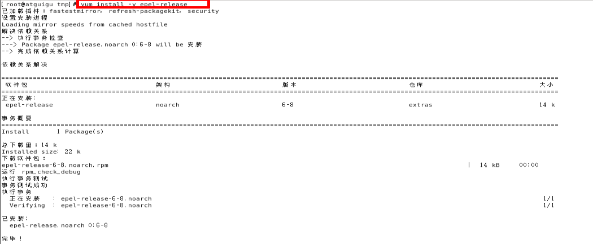

  2. yum install -y docker-io

     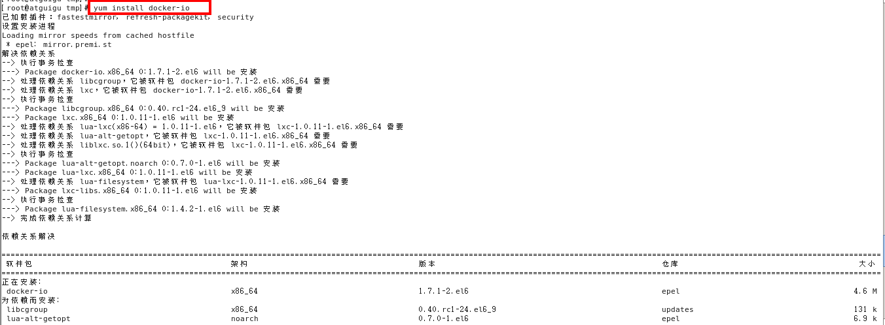

  3. 安装后的配置文件：/etc/sysconfig/docker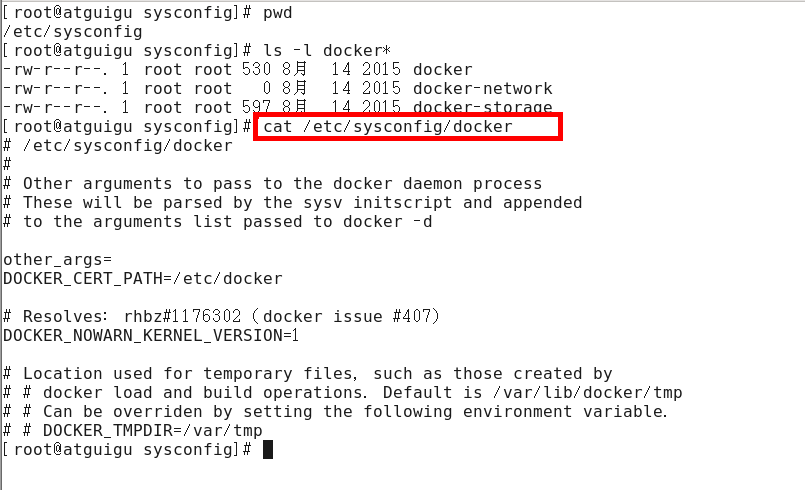


  1. 启动Docker后台服务：service docker start
  2. docker version验证

​            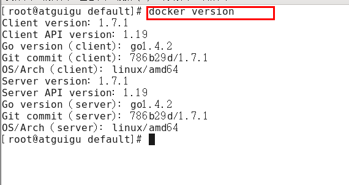

> **centos7版本安装**  

1. 安装地址：https://docs.docker.com/engine/install/centos/
2. 具体安装参考我的博客链接：https://blog.csdn.net/qq_41893274/article/details/107094598

#### （3）永远的 Hello World

- **阿里云镜像加速**  等价于 **Docker Hub **
- 启动Docker后台容器(测试运行 hello-world)


```dockerfile
docker run hello-world
```

- 运行原理

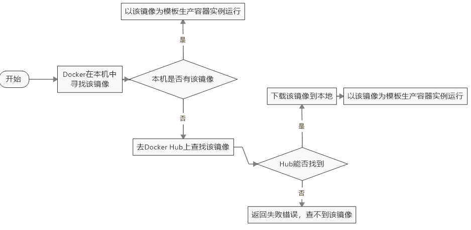

##### 1. Docker 原理

- Docker 是怎么工作的

​      Docker是一个Client-Server结构的系统，Docker守护进程运行在主机上， 然后通过Socket连接从客户端访问，守护进程从客户端接受命令并管理运行在主机上的容器。 **容器，是一个运行时环境，就是我们前面说到的集装箱**。

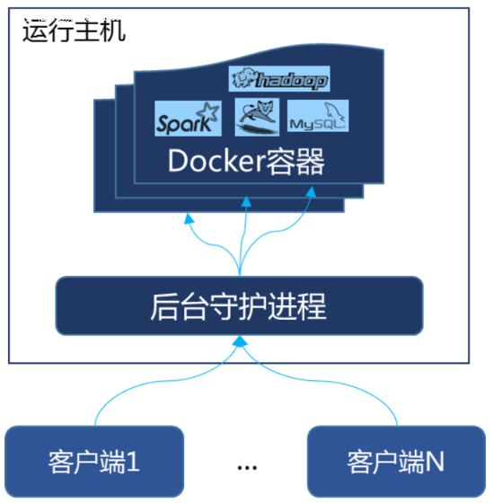

##### 2. 为什么Docker比较比VM快

1. docker有着比虚拟机更少的抽象层。由亍docker不需要Hypervisor实现硬件资源虚拟化,运行在docker容器上的程序直接使用的都是实际物理机的硬件资源。因此在CPU、内存利用率上docker将会在效率上有明显优势。
2. docker利用的是宿主机的内核,而不需要Guest OS。因此,当新建一个容器时,docker不需要和虚拟机一样重新加载一个操作系统内核。仍而避免引寻、加载操作系统内核返个比较费时费资源的过程,当新建一个虚拟机时,虚拟机软件需要加载Guest OS,返个新建过程是分钟级别的。而docker由于直接利用宿主机的操作系统,则省略了返个过程,因此新建一个docker容器只需要几秒钟。

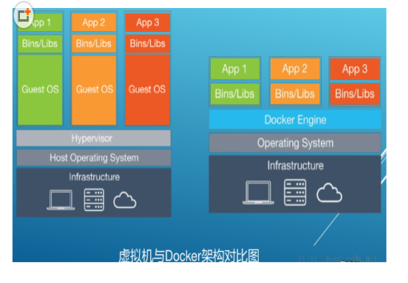

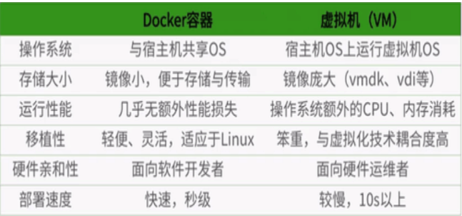

#### （4）Docker 常用命令

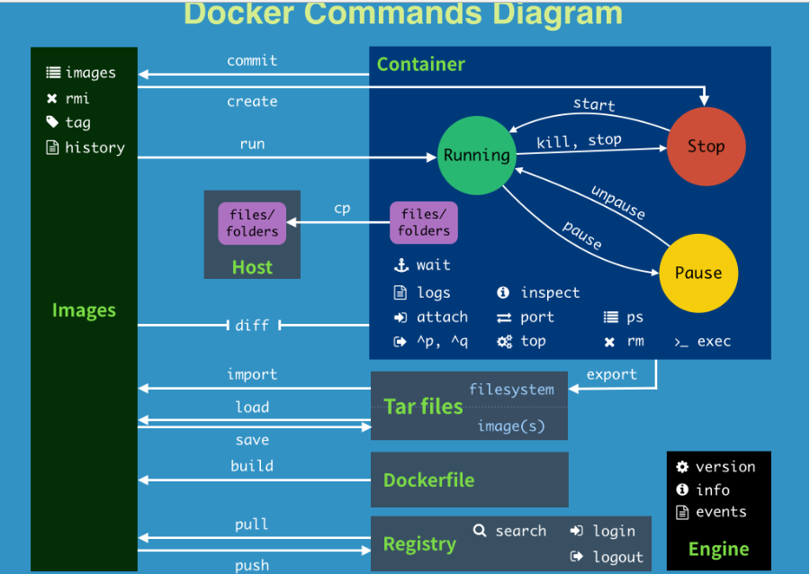

#### （5）Docker 镜像

##### 1. 什么是镜像

> 镜像是一种轻量级、可执行的独立软件包，用来打包软件运行环境和基于运行环境开发的软件，它包含运行某个软件所需的所有内容，包括代码、运行时、库、环境变量和配置文件。

**UnionFS（联合文件系统） **  

 UnionFS（联合文件系统）：Union文件系统（UnionFS）是一种分层、轻量级并且高性能的文件系统，它支持对文件系统的修改作为一次提交来一层层的叠加，同时可以将不同目录挂载到同一个虚拟文件系统下(unite several directories into a single virtual filesystem)。Union 文件系统是 Docker 镜像的基础。镜像可以通过分层来进行继承，基于基础镜像（没有父镜像），可以制作各种具体的应用镜像。

- 特性：一次同时加载多个文件系统，但从外面看起来，只能看到一个文件系统，联合加载会把各层文件系统叠加起来，这样最终的文件系统会包含所有底层的文件和目录

 **Docker镜像加载原理**

   docker的镜像实际上由一层一层的文件系统组成，这种层级的文件系统UnionFS。

- bootfs(boot file system)主要包含bootloader和kernel, bootloader主要是引导加载kernel, Linux刚启动时会加载bootfs文件系统，在Docker镜像的最底层是bootfs。这一层与我们典型的Linux/Unix系统是一样的，包含boot加载器和内核。当boot加载完成之后整个内核就都在内存中了，此时内存的使用权已由bootfs转交给内核，此时系统也会卸载bootfs。
- rootfs (root file system) ，在bootfs之上。包含的就是典型 Linux 系统中的 /dev, /proc, /bin, /etc 等标准目录和文件。rootfs就是各种不同的操作系统发行版，比如Ubuntu，Centos等等。 

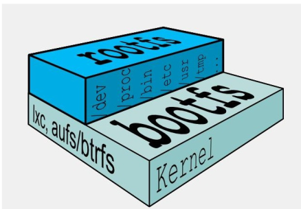

> 平时我们安装进虚拟机的CentOS都是好几个G，为什么docker这里才200M？？

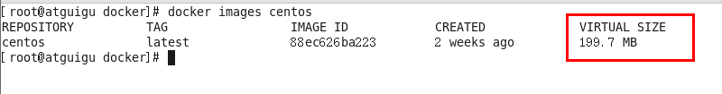

对于一个精简的OS，rootfs可以很小，只需要包括最基本的命令、工具和程序库就可以了，因为底层直接用Host的kernel，自己只需要提供 rootfs 就行了。由此可见对于不同的linux发行版, bootfs基本是一致的, rootfs会有差别, 因此不同的发行版可以公用bootfs。

> 为什么 Docker 镜像要采用这种分层结构呢

- 最大的一个好处就是 - 共享资源

**比如**：有多个镜像都从相同的 base 镜像构建而来，那么宿主机只需在磁盘上保存一份base镜像，
同时内存中也只需加载一份 base 镜像，就可以为所有容器服务了。而且镜像的每一层都可以被共享。

##### 2. 特点

   Docker镜像都是只读的，当容器启动时，一个新的可写层被加载到镜像的顶部。这一层通常被称作“容器层”，“容器层”之下的都叫“镜像层”。

##### 3. [Docker镜像commit](https://blog.csdn.net/qq_41893274/article/details/107194891)

- docker commit提交容器副本使之成为一个新的镜像

  ```dockerfile
  docker commit -m=“提交的描述信息” -a=“作者” 容器ID 要创建的目标镜像名:[标签名
  ```

**案例测试**

1. 从Hub上下载tomcat镜像到本地并成功运行

   ```dockerfile
   docker run -it -p 8080[外部]:8080[内部] tomcat（镜像ID）
   ```

   **说明：** 

   - ` -p `主机端口:docker容器端口（小写）
   - ` -P` 随机分配端口 (大写)
   - ` -i`：交互
   - ` -t` : 终端

   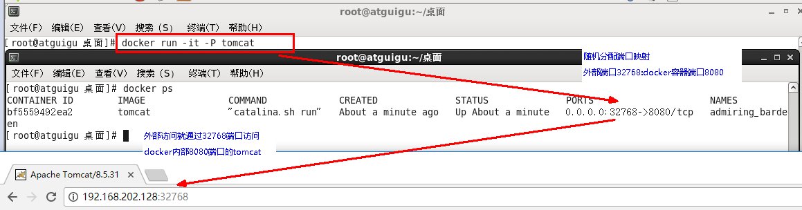

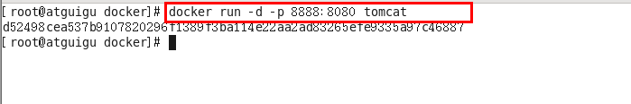

**Docker commit 提交新的镜像**

- docker commit提交容器副本使之成为一个新的镜像

  ```dockerfile
  docker commit -m=“提交的描述信息” -a=“作者” 容器ID 要创建的目标镜像名:[标签名]
  ```

- 案例演示

  1. 从Hub上下载tomcat镜像到本地并成功运行

     ```dockerfile
     docker run -it -p 8080:8080 tomcat
     参数说明：
       -p 主机端口:docker容器端口（小写）
       -P 随机分配端口 （大写）
       i:交互
       t:终端
     ```

  2. 故意删除上一步镜像生产tomcat容器的文档

  3. 也即当前的tomcat运行实例是一个没有文档内容的容器，以它为模板commit一个没有doc的tomcat新镜像wxw/tomcat02

  4. 启动我们的新镜像并和原来的对比

#### （6）Docker 容器数据卷

##### 1. 容器数据卷是什么

> 一句话：有点类似我们Redis里面的rdb和aof文件

**Docker的理念:**

- 将运用与运行的环境打包形成容器运行 ，运行可以伴随着容器，但是我们**对数据的要求希望是持久化**的
- 容器之间希望有可能共享数据

**Docker 容器产生的数据，如果不通过docker commit 生成新的镜像，**使得数据做为镜像的一部分保存下来，那么当容器删除后，数据自然也就没了。

——为了能**保存数据在docker中**我们使用**卷**。

##### 2. 数据卷的作用

- 容器的持久化
- 容器间继承+共享数据

​        卷就是目录或文件，存在于一个或多个容器中，由docker挂载到容器，但不属于联合文件系统，因此能够绕过Union File System 提供一些用于持续存储或共享数据的特性：

​        卷的设计目的：就是数据持久化，完全独立于容器的生命周期，因此Docker不会在容器删除时删除其挂载的数据卷。

**特点：** 

1. 数据卷可在容器之间共享或重用数据
2. 卷中的更改可以直接生效
3. 数据卷的更改不会包含在镜像的更新中
4. 数据卷的生命周期一直持续到没有容器使用它为止

##### 3. 数据卷

容器内添加数据卷的方式

- 直接命令添加
- DockerFile添加

**命令添加数据卷**

```dockerfile
 docker run -it -v /宿主机绝对路径目录:/容器内目录      镜像名
 比如：
 docker run -it -v /宿主机目录:/容器内目录 centos /bin/bash
```

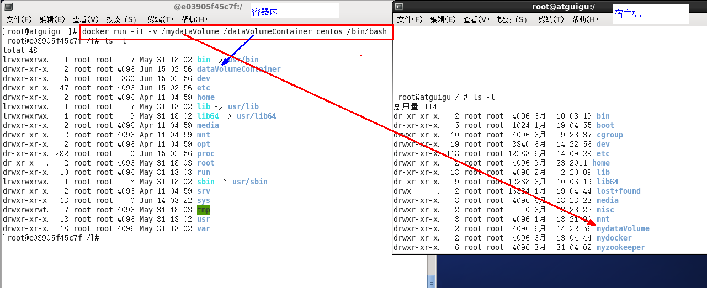

- 查看数据卷是否挂载成功

  ```dockerfile
  docker inspect 容器ID
  ```

  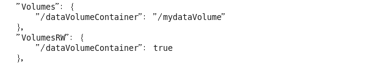


- 容器和宿主机之间数据共享

  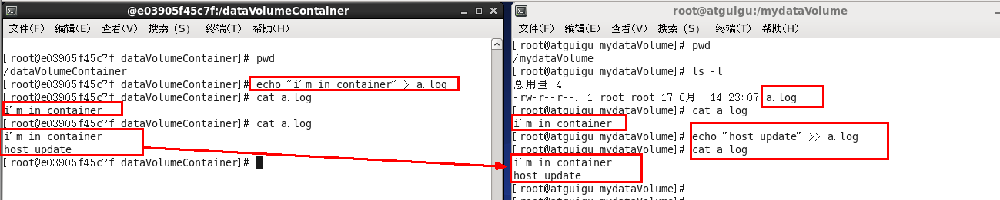

- 容器停止退出后，主机修改后数据是否同步

  - 容器只要还在，启动时会预读文件加载数据并同步（类似于 aof/rdb） 

  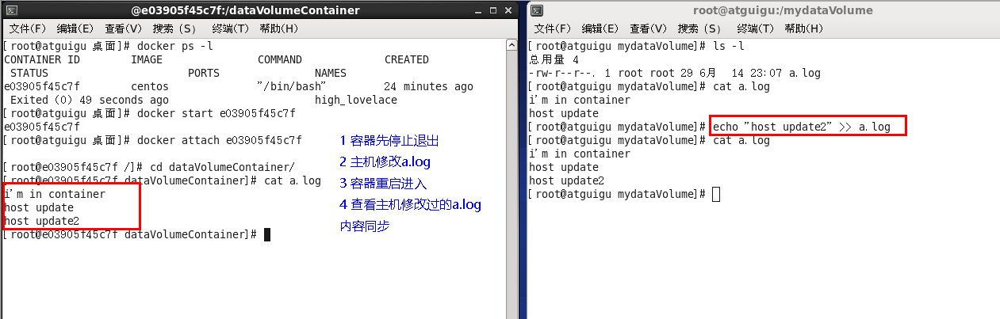

- 命令(带权限)

```dockerfile
 docker run -it -v /宿主机绝对路径目录:/容器内目录:ro 镜像名
```

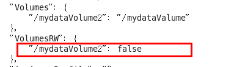

**注意：**

> Docker挂载主机目录Docker访问出现cannot open directory .: Permission denied 
>
> 解决办法：在挂载目录后多加一个--privileged=true参数即可

**DockerFIle 添加数据卷** 


