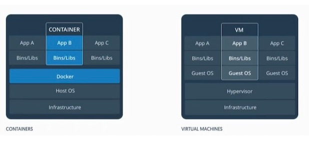

## Docker 技术


## 1. Docker 初识

Docker是软件开发者用容器构建、运行和共享应用程序的平台。一个容器是一个运行在隔离环境中、拥有自己的文件系统上的进程；这个文件系统是使用Docker镜像构建的。镜像文件包括运行应用程序所需的一切（编译后的代码、依赖关系、库等）。

> 学习导读

1. 官网：https://docs.docker.com/compose/reference/
2. Docker中文教程：https://www.orchome.com/docker/index

### 1.1 Docker基础

#### 1.1.1 Docker是什么？

早期，因为现在物理服务器是很强大的，我们如果在一台物理服务器上只跑一个程序就浪费了，而同时跑很多程序他们又会互相影响，比如说某个程序内存泄漏从而把整个服务器的内存都占满了，其他程序都跟着受影响。所以为了让每个程序不互相干扰，让它们只使用自己那部分有限的cpu，内存和磁盘，以及自己依赖的软件包。这个早先是用虚拟机来实现隔离的，但是每个虚拟机都要装自己的操作系统核心，这是对资源是巨大的浪费。于是就有了Docker，一个机器上可以装十几个到几十个docker，他们共享操作系统核心，占用资源少，启动速度快。而且提供了资源（cpu, 内存，磁盘等）的隔离。

#### 1.1.2 docker为什么那么快?

Docker利用的是宿主机的内核，而不需要Guest OS，因此，当新建一个容器时，Docker不需要和虚拟机一样重新加载一个操作系统，避免了引导、加载操作系统内核这个比较费时费资源的过程，当新建一个虚拟机时，虚拟机软件需要加载Guest OS，这个新建过程是分钟级别的，而Docker由于直接利用宿主机的操作系统则省略了这个过程，因此新建一个Docker容器只需要几秒钟。

小就意味着着省钱，小就意味着快。

 

- 虚拟机管理系统（Hypervisor）

利用Hypervisor，可以在主操作系统之上运行多个不同的从操作系统。一种运行在基础物理服务器和操作系统之间的中间软件层，可允许多个操作系统和应用共享硬件。

- Docker守护进程（Docker Daemon）

Docker守护进程取代了Hypervisor，它是运行在操作系统之上的后台进程，负责管理Docker容器

- Docker与虚拟化的区别

| 名称       | Docker容器              | 虚拟机（VM）                |
| ---------- | ----------------------- | --------------------------- |
| 操作系统   | 与宿主机共享OS，        | 宿主机OS上运行宿主机OS      |
| 存储大小   | 镜像小，便于存储与传输  | 镜像庞大（vmdk等）          |
| 运行性能   | 几乎无额外性能损失      | 操作系统额外的cpu、内存消耗 |
| 移植性     | 轻便、灵活、适用于Linux | 笨重、与虚拟化技术耦合度高  |
| 硬件亲和性 | 面向软件开发者          | 面向硬件运维者              |

- 容器化的特点
  - 灵活：即使是最复杂的应用也可以被容器化。
  - 轻量级：容器共享主机内核，使其比虚拟机更高效。
  - 可移植：可在本地编译并在任何地方运行。
  - 松耦合：容器各自是独立封装的，允许一个容器被替换或升级而不影响、中断其他容器。
  - 安全：容器采用积极的限制和隔离策略，不需要用户进行任何配置。

## 2. Docker 环境

### 2.1 centos 安装Docker

> ` CSDN ` : https://blog.csdn.net/qq_41893274/article/details/107094598

1. 较旧的Docker版本称为`docker`或`docker-engine`。如果已安装这些程序，请卸载它们以及相关的依赖项

   ```powershell
   yum remove docker docker-client docker-client-latest  docker-common  docker-latest \
                     docker-latest-logrotate \
                     docker-logrotate \
                     docker-engine
   ```

2. 安装`yum-utils`软件工具包（提供`yum-config-manager` 实用程序）并设置**稳定的**存储库

   ```powershell
   yum install -y yum-utils
   ```

3. 配置远程仓库的地址（根据官网首次安装使用国外的仓库）

   ```bash
   yum-config-manager --add-repo \
       https://download.docker.com/linux/centos/docker-ce.repo
   ```

4. 下面我们开始安装，在安装之前先清理一下缓存

   ```bash
   yum makecache fast
   ```

5. 安装*最新版本*的Docker Engine和容器，指定版本看官网手册（ce社区版免费）

   ```bash
   yum install docker-ce docker-ce-cli containerd.io
   
   ## 如果centos7安装docker显示 No package docker available 原因是yum没有找到docker的包，需要epel第三方软件库，运行下面的命令
   yum install epel-release
   ```

##### 1.1.1 mac 安装Docker

- 菜鸟教程：https://www.runoob.com/docker/macos-docker-install.html

##### 1.1.2  启动并运行Docker

```bash
systemctl start docker    # 启动docker
systemctl enable docker   ## 开机自启docker 
systemctl restart docker  # docker 重启
```

##### 1.1.3 配置镜像加速器

针对Docker客户端版本大于 1.10.0 的用户

您可以通过修改daemon配置文件/etc/docker/daemon.json来使用加速器

```powershell
sudo mkdir -p /etc/docker
sudo tee /etc/docker/daemon.json <<-'EOF'
{
  "registry-mirrors": ["https://8d0knh92.mirror.aliyuncs.com"]
}
EOF
sudo systemctl daemon-reload
sudo systemctl restart docker
```

> 阿里加速地址：https://cr.console.aliyun.com/cn-hangzhou/instances/mirrors

### 2.2 Docker安装My SQL

#### 1. 准备环境

> 资料来源：https://www.runoob.com/docker/docker-install-mysql.html

- 搜索mysql镜像仓库,查看可用镜像

  ```bash
  docker search mysql
  ```

- 拉取镜像到本地

  ```bash
  docker pull mysql
  ```

- 查看并验证拉取的本地镜像

  ```bash
  docker images
  ```

- 通过镜像启动容器

  ```bash
  docker run -itd --name mysql-test -p 3306:3306 -e MYSQL_ROOT_PASSWORD=123456 mysql
  
  参数说明：
     -p 3306:3306 ：映射容器服务的 3306 端口到宿主机的 3306 端口，外部主机可以直接通过 宿主机ip:3306 访问到 MySQL 的服务。
     MYSQL_ROOT_PASSWORD=123456：设置 MySQL 服务 root 用户的密码。
  ```

-  查看正在运行的容器

  ```bash
  docker ps
  ```

- 进入容器

  ```bash
  docker exec -it mysql bash
  ```

- 登录mysql

  ```bash
  #登录mysql
  mysql -u root -p
  ALTER USER 'root'@'localhost' IDENTIFIED BY 'Lzslov123!';
  ```

- 添加远程登录账户

   ```bash
   CREATE USER 'root'@'%' IDENTIFIED WITH mysql_native_password BY '123456';
   GRANT ALL PRIVILEGES ON *.* TO 'root'@'%';
   ```

  

> 控制台演示

  

- 本机可以通过 root 和密码 123456 访问 MySQL 服务。

### 2.3 Docker 安装Ubuntu

#### 1. 准备环境

> 资料来源：https://www.runoob.com/docker/docker-install-ubuntu.html

```bash
## 拉取最新镜像
docker pull ubuntu

## 查看本地镜像
docker images

## 运行容器
docker run -itd --name ubuntu-test ubuntu

## 通过 exec 命令进入 ubuntu 容器
docker exec -it ubuntu-test /bin/bash

## 查看容器的运行信息
docker ps
```

## 3. Docker 语法

> Docker 语法概览


### 3.1 命令大全

> 入门导读

```bash
# 第一次运行 -p [需要暴露的服务端口:docker内部服务端口]
sudo docker run --name myjenkins -p 8088:8080 -p 50000:50000 -d docker.io/jenkinsci/jenkins

# 停止
docker stop  myjenkins

# 启动（是没有问题的）
docker start myjenkins

# 重新commit一个新的
docker ps -a 获取到ff2d09d0ddd8

# 提交一个成为新镜像
docker commit ff2d09d0ddd8 test/jenkins:0.2
```

#### 3.1.1 查看

```bash
# 查看信息
docker info

# 容器运行状态，不想持续的监控，通过 --no-stream 只输出当前的状态： docker stats --no-stream
# 详细说明：https://www.orchome.com/10104
docker stats

# 查看容器中运行的进程信息，支持 ps 命令参数。
docker top [containerId]

# 查看运行中的进程
docker ps

# 查看该容器的详细信息
docker inspect 44fc0f0582d9

# 由其该信息非常多，只截取了其中一部分进行展示。如果要显示该容器第一个进行的PID可以使用如下方式
docker inspect -f {{.State.Pid}} 44fc0f0582d9

# 查看容器ip
docker inspect --format='{{.NetworkSettings.IPAddress}}' mycentos3
```

#### 3.1.2 进入Docker容器

```bash
# 使用该命令进入一个已经在运行的容器
docker ps

## 进入容器
docker exec -it 775c7c9ee1e1 /bin/bash
```

#### 3.1.3 镜像

```bash
# 查看docker镜像
docker images

# 删除镜像
docker rmi [imagesId]

# 构建一个镜像
docker build -t holiday /usr/local/docker/holiday #Re-build docker container

# 打包提交拉取
docker tag kafka-monitor:0.2 10.0.23.11:5000/kafka-monitor:0.2
docker push xxx.xxx.xxx.xxx:5000/kafka-monitor:0.1
docker pull xxx.xxx.xxx.xxx:5000/kafka-monitor:0.1

# 停止所有容器
docker ps |grep holiday |awk '{print $1}' |xargs -i docker stop {}

# 提交一个镜像
docker commit 1a442630f4a9 test/javaweb:0.0

```

#### 3.1.4 日志

```bash
# docker日志查询
docker logs 2f2de065fd05
```

#### 3.1.5 停止与删除

```bash
# 杀死所有正在运行的容器
docker kill $(docker ps -a -q)

# 删除所有已经停止的容器
docker rm $(docker ps -a -q)

# 删除所有未打 dangling 标签的镜像
docker rmi $(docker images -q -f dangling=true)

# 删除所有镜像
docker rmi $(docker images -q)
```

#### 3.1.6 文件相关

- 为文件创建别名

  ```bash
  # 杀死所有正在运行的容器.
  alias dockerkill='docker kill $(docker ps -a -q)'
  # 删除所有已经停止的容器.
  alias dockercleanc='docker rm $(docker ps -a -q)'
  # 删除所有未打标签的镜像.
  alias dockercleani='docker rmi $(docker images -q -f dangling=true)'
  # 删除所有已经停止的容器和未打标签的镜像.
  alias dockerclean='dockercleanc || true && dockercleani'
  
  另附上docker常用命令
  docker version #查看版本
  docker search tutorial#搜索可用docker镜像
  docker pull learn/tutorial #下载镜像
  docker run learn/tutorial echo "hello word"#在docker容器中运行hello world!
  docker run learn/tutorial apt-get install -y ping#在容器中安装新的程序
  ```

#### 3.1.7 运行docker

```bash
# 运行docker镜像
docker run -i -t -v /root/software/:/mnt/software/ --privileged=true index.alauda.cn/alauda/ubuntu /bin/bash

# 运行一个jenkins镜像的例子命令
sudo docker run \
    -d -p 8088:8080 -p 50000:50000 \
    -v /home/docker/jenkins_home/:/var/jenkins_home \
    -v /var/run/docker.sock:/var/run/docker.sock \
    -v $(which docker):/usr/bin/docker \
    -v $(which git):/usr/bin/git \
    -v ~/.ssh:/var/jenkins_home/.ssh \
    --name=jenkins jenkinsci/jenkins

# 运行一个tomcat
docker run --name tomcat-demo -m 1G tomcat:9.0.39-jdk8-openjdk
```

相关文章

1. https://www.orchome.com/619

### 3.2 Dockerfile

Dockerfile是一个文本文件，Docker通过读取`Dockerfile`中的命令来构建一个镜像。每一条指令构建一层，因此每一条指令的内容，就是描述该层应当如何构建。

> 案例分析

```bash
#基于centos镜像
FROM centos

#维护人的信息
MAINTAINER The CentOS Project <xxxxx@www.orchome.com>

#安装httpd软件包
RUN yum -y update
RUN yum -y install httpd

#开启80端口
EXPOSE 80

#复制网站首页文件至镜像中web站点下
ADD index.html /var/www/html/index.html

#复制该脚本至镜像中，并修改其权限
ADD run.sh /run.sh
RUN chmod 775 /run.sh

#当启动容器时执行的脚本文件
CMD ["/run.sh"]
```

由上可知，Dockerfile结构大致分为四个部分：

1. 基础镜像信息
2. 维护者信息
3. 镜像操作指令
4. 容器启动时执行指令。

Dockerfile每行支持一条指令，每条指令可带多个参数，支持使用以`#`号开头的注释。下面会对上面使用到的一些常用指令做一些介绍。

#### 3.2.1 dockerfile 命令

| 指令       | 描述                  |
| ---------- | --------------------- |
| FROM       | 基础镜像              |
| MAINTAINER | 维护者信息            |
| RUN        | 在要运行的命令前加RUN |
| ADD        | 复制文件，会自动解压  |
| WORKDIR    | 设置当前的工作目录    |
| VOLUME     | 设置卷，挂载主机目录  |
| EXPOSE     | 暴露的端口            |
| CMD        | 容器启动后的运行命令  |

- `from` 指明构建的新镜像是来自于哪个基础镜像，

  ```bash
  FROM centos:8
  ```

- ` maintainer  ` 指明镜像维护着及其联系方式（一般是邮箱地址）

    ```bash
    MAINTAINER OrcHome <www.orchome.com>
    ```

- `label` 不过，MAINTAINER并不推荐使用，更推荐使用LABEL来指定镜像作者

  ```bash
  label maintainer="www.orchome.com"
  ```

- `run` 构建镜像时运行的Shell命令

  ```bash
  RUN ["yum", "install", "httpd"]
  RUN yum install httpd
  ```

- `cmd` 启动容器时执行的Shell命令

  ```bash
  CMD ["-C", "/start.sh"] 
  CMD ["/usr/sbin/sshd", "-D"] 
  CMD /usr/sbin/sshd -D
  ```

- `expose` 声明容器运行的服务端口

  ```bash
  EXPOSE 80 443
  ```

- `env` 设置环境内环境变

  ```bash
  ENV MYSQL_ROOT_PASSWORD 123456
  ENV JAVA_HOME /usr/local/jdk1.8.0_45
  ```

- `add` 拷贝文件或目录到镜像中，如果是URL或压缩包，会自动下载或自动解压。

  ```dockerfile
  ADD <src>...<dest>
  ADD html.tar.gz /var/www/html
  ADD https://xxx.com/html.tar.gz /var/www/html
  ```

- `copy` 拷贝文件或目录到镜像中，用法同ADD，只是不支持自动下载和解压

  ```dockerfile
  COPY ./start.sh /start.sh
  ```

- `entrypoint` 启动容器时执行的Shell命令，同CMD类似，只是由ENTRYPOINT启动的程序不会被docker run命令行指定的参数所覆盖，而且，这些命令行参数会被当作参数传递给ENTRYPOINT指定指定的程序，例如：

  ```dockerfile
  ENTRYPOINT ["/bin/bash", "-C", "/start.sh"]
  ENTRYPOINT /bin/bash -C '/start.sh'
  ```

  PS: ：Dockerfile文件中也可以存在多个ENTRYPOINT指令，但仅有最后一个会生效。

- `volume`  指定容器挂载点到宿主机自动生成的目录或其他容器

  ```dockerfile
  VOLUME ["/var/lib/mysql"]
  ```

  PS：一般不会在Dockerfile中用到，更常见的还是在docker run的时候指定-v数据卷

- `user` 为RUN、CMD和ENTRYPOINT执行Shell命令指定运行用户

  ```dockerfile
  USER <user>[:<usergroup>]
  USER <UID>[:<UID>]
  USER edisonzhou
  ```

- `workir` 为RUN、CMD、ENTRYPOINT以及COPY和AND设置工作目录

  ```bash
  WORKDIR /data
  ```

- `healthcheck` 告诉Docker如何测试容器以检查它是否仍在工作，即健康检查

  ```dockerfile
  HEALTHCHECK --interval=5m --timeout=3s --retries=3 \
      CMD curl -f http:/localhost/ || exit 1
  
  ### 其中，一些选项的说明：
    --interval=DURATION (default: 30s)：每隔多长时间探测一次，默认30秒
    -- timeout= DURATION (default: 30s)：服务响应超时时长，默认30秒
    --start-period= DURATION (default: 0s)：服务启动多久后开始探测，默认0秒
    --retries=N (default: 3)：认为检测失败几次为宕机，默认3次
  
  ## 一些返回值的说明：
     0：容器成功是健康的，随时可以使用
     1：不健康的容器无法正常工作
     2：保留不使用此退出代码
  ```

- `arg` 在构建镜像时，指定一些参数

  ```dockerfile
  FROM centos:8
  ARG user # ARG user=root
  USER $user
  ```

  我们在`docker build`时可以带上自定义参数user了

  ```bash
  docker build --build-arg user=test Dockerfile .
  ```

#### 3.2.2 dockerfile 案例

下面是一个Java Web应用的镜像Dockerfile，综合使用到了上述介绍中最常用的几个命令：

```dockerfile
FROM centos:7
MAINTANIER www.orchome.com

ADD jdk-8u45-linux-x64.tar.gz /usr/local
ENV JAVA_HOME /usr/local/jdk1.8.0_45

ADD apache-tomcat-8.0.46.tar.gz /usr/local
COPY server.xml /usr/local/apache-tomcat-8.0.46/conf

RUN rm -f /usr/local/*.tar.gz

WORKDIR /usr/local/apache-tomcat-8.0.46
EXPOSE 8080
ENTRYPOINT ["./bin/catalina.sh", "run"]
```

有了Dockerfile，就可以创建镜像了：

```dockerfile
docker build -t tomcat:v1 .
```

最后，可以通过以下命令创建容器：

```dockerfile
docker run -itd --name=tomcat -p 8080:8080 \
   -v /app/webapps/:/usr/local/apache-tomcat-8.0.46/webapps/ \
    tomcat:v1
    
## 参数说明
-v 指定数据卷，挂载地址
```

相关文章

1. https://www.orchome.com/10068

### 3.3 Docker 磁盘空间清理

#### 3.3.1 使用docker system命令清除

`docker system df`命令，类似于Linux上的df命令，用于查看Docker的磁盘使用情况:

```bash
mac@wxw ~ % docker system df

## 打印结果
TYPE                TOTAL               ACTIVE              SIZE                RECLAIMABLE
Images              147                 36                  7.204GB             3.887GB (53%)
Containers          37                  10                  104.8MB             102.6MB (97%)
Local Volumes       3                   3                   1.421GB             0B (0%)
Build Cache 
```

可以看到，Docker镜像占用了`7.2GB`磁盘，Docker容器占用了`104.8MB`磁盘，Docker数据卷占用了`1.4GB`磁盘。

```bash
## 用于清理磁盘，删除关闭的容器、无用的数据卷和网络，以及dangling镜像(即无tag的镜像)。
docker system prune

## 该命令清理得更加彻底，可以将没有容器使用Docker镜像都删掉。
docker system prune -a
```

**注意**：这两个命令会把你暂时关闭的容器，以及暂时没有用到的Docker镜像都删掉了…所以使用之前一定要想清楚额。

#### 3.3.2 手动清理Docker镜像/容器/数据卷

对于旧版的Docker(版本1.13之前)，是没有`docker system`命令的，因此需要进行手动清理。这里给出几个常用的命令

```bash
# 删除所有关闭的容器
docker ps -a | grep Exit | cut -d ’ ’ -f 1 | xargs docker rm

# 删除所有dangling镜像(即无tag的镜像)：
docker rmi (docker images | grep "^<none>" | awk "{print(docker images | grep "^<none>" | awk "{print3}”) 

# 删除所有dangling数据卷(即无用的volume)：
docker volume rm $(docker volume ls -qf dangling=true)
```

#### 3.3.3 限制容器的日志大小

有一次，当我使用1与2提到的方法清理磁盘之后，发现并没有什么作用，于是，我进行了一系列分析。

在Ubuntu上，Docker的所有相关文件，包括镜像、容器等都保存在`/var/lib/docker/`目录中：

```bash
du -hs /var/lib/docker/ 
97G /var/lib/docker/
```

Docker竟然使用了将近100GB磁盘。使用`du`命令继续查看，可以定位到真正占用这么多磁盘的目录：

```bash
92G /var/lib/docker/containers/a376aa694b22ee497f6fc9f7d15d943de91c853284f8f105ff5ad6c7ddae7a53
```

由docker ps可知，nginx容器的ID恰好为`a376aa694b22`，与上面的目录`/var/lib/docker/containers/a376aa694b22`的前缀一致：

```bash
docker ps
CONTAINER ID        IMAGE                                       COMMAND                  CREATED             STATUS              PORTS               NAMES
a376aa694b22        192.168.59.224:5000/nginx:1.12.1            "nginx -g 'daemon off"   9 weeks ago         Up 10 minutes                           nginx
```

因此，nginx容器竟然占用了92GB的磁盘。进一步分析可知，真正占用磁盘空间的是nginx的日志文件。那么这就不难理解了。我们Fundebug每天的数据请求为百万级别，那么日志数据自然非常大。

使用`truncate`命令，可以将nginx容器的日志文件“清零”：

```bash
truncate -s 0 /var/lib/docker/containers/a376aa694b22ee497f6fc9f7d15d943de91c853284f8f105ff5ad6c7ddae7a53/*-json.log
```

当然，这个命令只是临时有作用，日志文件迟早又会涨回来。要从根本上解决问题，需要限制nginx容器的日志文件大小。这个可以通过配置日志的max-size来实现，下面是nginx容器的docker-compose配置文件：

```bash
nginx: 
image: nginx:1.12.1 
restart: always 
logging: 
driver: “json-file” 
options: 
max-size: “5g”
```

重启nginx容器之后，其日志文件的大小就被限制在5GB，再也不用担心了

#### 3.3.4 重启docker

还有一次，当我清理了镜像、容器以及数据卷之后，发现磁盘空间并没有减少。根据`Docker disk usage`提到过的建议，我重启了Docker，发现磁盘使用率从83%降到了19%。根据高手指点，这应该是与内核3.13相关的BUG，导致Docker无法清理一些无用目录：

相关文章

1. https://www.orchome.com/1555

## 4. Docker 原理 

## 5. Docker 底层


