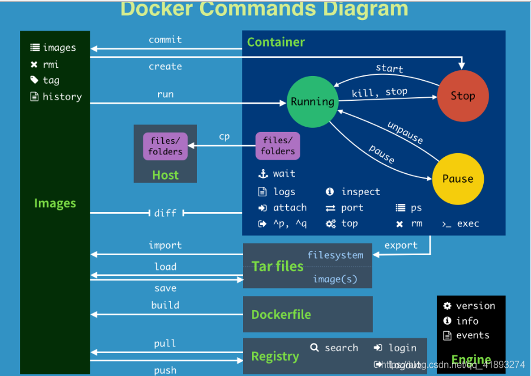

### Docker 技术


### 1. Docker 初识

#### 1.1 Docker 环境准备

> ` CSDN ` : https://blog.csdn.net/qq_41893274/article/details/107094598

1. 较旧的Docker版本称为`docker`或`docker-engine`。如果已安装这些程序，请卸载它们以及相关的依赖项

   ```powershell
   yum remove docker docker-client docker-client-latest  docker-common  docker-latest \
                     docker-latest-logrotate \
                     docker-logrotate \
                     docker-engine
   ```

2. 安装`yum-utils`软件工具包（提供`yum-config-manager` 实用程序）并设置**稳定的**存储库

   ```powershell
   yum install -y yum-utils
   ```

3. 配置远程仓库的地址（根据官网首次安装使用国外的仓库）

   ```bash
   yum-config-manager --add-repo \
       https://download.docker.com/linux/centos/docker-ce.repo
   ```

4. 下面我们开始安装，在安装之前先清理一下缓存

   ```bash
   yum makecache fast
   ```

5. 安装*最新版本*的Docker Engine和容器，指定版本看官网手册（ce社区版免费）

   ```bash
   yum install docker-ce docker-ce-cli containerd.io
   
   ## 如果centos7安装docker显示 No package docker available 原因是yum没有找到docker的包，需要epel第三方软件库，运行下面的命令
   yum install epel-release
   ```

#### 1.2 启动并运行Docker

```bash
systemctl start docker    # 启动docker
systemctl enable docker   ## 开机自启docker 
systemctl restart docker  # docker 重启
```

#### 1.3 配置镜像加速器

针对Docker客户端版本大于 1.10.0 的用户

您可以通过修改daemon配置文件/etc/docker/daemon.json来使用加速器

```powershell
sudo mkdir -p /etc/docker
sudo tee /etc/docker/daemon.json <<-'EOF'
{
  "registry-mirrors": ["https://8d0knh92.mirror.aliyuncs.com"]
}
EOF
sudo systemctl daemon-reload
sudo systemctl restart docker
```

> 阿里加速地址：https://cr.console.aliyun.com/cn-hangzhou/instances/mirrors


### 2. Docker 语法

> Docker 语法概览




### 3. Docker 底层


### 4. Docker 原理 


