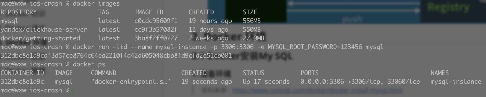

## Docker 技术


## 1. Docker 初识

> 官方资料：

- https://docs.docker.com/compose/reference/

#### 1.1 Docker 环境准备

##### 1.1.1 centos 安装Docker

> ` CSDN ` : https://blog.csdn.net/qq_41893274/article/details/107094598

1. 较旧的Docker版本称为`docker`或`docker-engine`。如果已安装这些程序，请卸载它们以及相关的依赖项

   ```powershell
   yum remove docker docker-client docker-client-latest  docker-common  docker-latest \
                     docker-latest-logrotate \
                     docker-logrotate \
                     docker-engine
   ```

2. 安装`yum-utils`软件工具包（提供`yum-config-manager` 实用程序）并设置**稳定的**存储库

   ```powershell
   yum install -y yum-utils
   ```

3. 配置远程仓库的地址（根据官网首次安装使用国外的仓库）

   ```bash
   yum-config-manager --add-repo \
       https://download.docker.com/linux/centos/docker-ce.repo
   ```

4. 下面我们开始安装，在安装之前先清理一下缓存

   ```bash
   yum makecache fast
   ```

5. 安装*最新版本*的Docker Engine和容器，指定版本看官网手册（ce社区版免费）

   ```bash
   yum install docker-ce docker-ce-cli containerd.io
   
   ## 如果centos7安装docker显示 No package docker available 原因是yum没有找到docker的包，需要epel第三方软件库，运行下面的命令
   yum install epel-release
   ```

##### 1.1.2 mac 安装Docker

- 菜鸟教程：https://www.runoob.com/docker/macos-docker-install.html

#### 1.2 启动并运行Docker

```bash
systemctl start docker    # 启动docker
systemctl enable docker   ## 开机自启docker 
systemctl restart docker  # docker 重启
```

#### 1.3 配置镜像加速器

针对Docker客户端版本大于 1.10.0 的用户

您可以通过修改daemon配置文件/etc/docker/daemon.json来使用加速器

```powershell
sudo mkdir -p /etc/docker
sudo tee /etc/docker/daemon.json <<-'EOF'
{
  "registry-mirrors": ["https://8d0knh92.mirror.aliyuncs.com"]
}
EOF
sudo systemctl daemon-reload
sudo systemctl restart docker
```

> 阿里加速地址：https://cr.console.aliyun.com/cn-hangzhou/instances/mirrors


## 2. Docker 语法

> Docker 语法概览


## 3. Docker 环境

### 3.1 Docker安装My SQL

#### 1. 准备环境

> 资料来源：https://www.runoob.com/docker/docker-install-mysql.html

- 搜索mysql镜像仓库,查看可用镜像

  ```bash
  docker search mysql
  ```

- 拉取镜像到本地

  ```bash
  docker pull mysql
  ```

- 查看并验证拉取的本地镜像

  ```bash
  docker images
  ```

- 通过镜像启动容器

  ```bash
  docker run -itd --name mysql-test -p 3306:3306 -e MYSQL_ROOT_PASSWORD=123456 mysql
  
  参数说明：
     -p 3306:3306 ：映射容器服务的 3306 端口到宿主机的 3306 端口，外部主机可以直接通过 宿主机ip:3306 访问到 MySQL 的服务。
     MYSQL_ROOT_PASSWORD=123456：设置 MySQL 服务 root 用户的密码。
  ```

-  查看正在运行的容器

  ```bash
  docker ps
  ```

- 进入容器

  ```bash
  docker exec -it mysql bash
  ```

- 登录mysql

  ```bash
  #登录mysql
  mysql -u root -p
  ALTER USER 'root'@'localhost' IDENTIFIED BY 'Lzslov123!';
  ```

- 添加远程登录账户

   ```bash
   CREATE USER 'root'@'%' IDENTIFIED WITH mysql_native_password BY '123456';
   GRANT ALL PRIVILEGES ON *.* TO 'root'@'%';
   ```

  

> 控制台演示

  

- 本机可以通过 root 和密码 123456 访问 MySQL 服务。

### 3.2 Docker 安装Ubuntu

#### 1. 准备环境

> 资料来源：https://www.runoob.com/docker/docker-install-ubuntu.html

```bash
## 拉取最新镜像
docker pull ubuntu

## 查看本地镜像
docker images

## 运行容器
docker run -itd --name ubuntu-test ubuntu

## 通过 exec 命令进入 ubuntu 容器
docker exec -it ubuntu-test /bin/bash

## 查看容器的运行信息
docker ps
```

### 3.3 Docker安装IOS

#### 1. 相关资料

- docker容器：https://hub.docker.com/r/sickcodes/docker-osx
- github资源
  - https://github.com/ipwnosx/Docker-OSX

#### 2. 准备环境

```bash
## 拉取镜像
docker pull sickcodes/docker-osx

## 启动容器
docker run -it \
    --device /dev/kvm \
    -p 50922:10022 \
    -v /tmp/.X11-unix:/tmp/.X11-unix \
    -e "DISPLAY=${DISPLAY:-:0.0}" \
    sickcodes/docker-osx:latest
```


## 4. Docker 底层


## 5. Docker 原理 


