## Docker 技术


## 1. Docker 初识

Docker是软件开发者用容器构建、运行和共享应用程序的平台。一个容器是一个运行在隔离环境中、拥有自己的文件系统上的进程；这个文件系统是使用Docker镜像构建的。镜像文件包括运行应用程序所需的一切（编译后的代码、依赖关系、库等）。

> 学习导读

1. 官网：https://docs.docker.com/compose/reference/
2. Docker中文教程：https://www.orchome.com/docker/index
3. CSDN：https://blog.csdn.net/qq_41893274/article/details/108909368 

### 1.1 Docker基础

#### 1.1.1 Docker是什么？

早期，因为现在物理服务器是很强大的，我们如果在一台物理服务器上只跑一个程序就浪费了，而同时跑很多程序他们又会互相影响，比如说某个程序内存泄漏从而把整个服务器的内存都占满了，其他程序都跟着受影响。所以为了让每个程序不互相干扰，让它们只使用自己那部分有限的cpu，内存和磁盘，以及自己依赖的软件包。这个早先是用虚拟机来实现隔离的，但是每个虚拟机都要装自己的操作系统核心，这是对资源是巨大的浪费。于是就有了Docker，一个机器上可以装十几个到几十个docker，他们共享操作系统核心，占用资源少，启动速度快。而且提供了资源（cpu, 内存，磁盘等）的隔离。

#### 1.1.2 docker为什么那么快?

Docker利用的是宿主机的内核，而不需要Guest OS，因此，当新建一个容器时，Docker不需要和虚拟机一样重新加载一个操作系统，避免了引导、加载操作系统内核这个比较费时费资源的过程，当新建一个虚拟机时，虚拟机软件需要加载Guest OS，这个新建过程是分钟级别的，而Docker由于直接利用宿主机的操作系统则省略了这个过程，因此新建一个Docker容器只需要几秒钟。

小就意味着着省钱，小就意味着快。

 

- 虚拟机管理系统（Hypervisor）

利用Hypervisor，可以在主操作系统之上运行多个不同的从操作系统。一种运行在基础物理服务器和操作系统之间的中间软件层，可允许多个操作系统和应用共享硬件。

- Docker守护进程（Docker Daemon）

Docker守护进程取代了Hypervisor，它是运行在操作系统之上的后台进程，负责管理Docker容器

- Docker与虚拟化的区别

| 比对项   | Container（容器）                       | VM（虚拟机）   |
| :------- | :-------------------------------------- | :------------- |
| 启动速度 | 秒级                                    | 分钟级         |
| 运行性能 | 接近原生                                | 有所损失       |
| 磁盘占用 | MB                                      | GB             |
| 数量     | 成百上千                                | 一般几十台     |
| 隔离性   | 进程级别                                | 系统级别       |
| 操作系统 | 只支持Linux                             | 几乎所有       |
| 封装程度 | 只打包项目代码和依赖关系 共享宿主机内核 | 完整的操作系统 |

- 容器化的特点
  - 灵活：即使是最复杂的应用也可以被容器化。
  - 轻量级：容器共享主机内核，使其比虚拟机更高效。
  - 可移植：可在本地编译并在任何地方运行。
  - 松耦合：容器各自是独立封装的，允许一个容器被替换或升级而不影响、中断其他容器。
  - 安全：容器采用积极的限制和隔离策略，不需要用户进行任何配置。

#### 1.1.3 Docker 基本组成

客户端会向服务器端也就是守护进程发送请求，守护进程处理完所有的工作并返回结果，客户端向服务器的访问既可以是本地，也可以是远程。

- Docker Client 客户端
- Docker Daemin 守护进程
- Docker Image 镜像
- Docker Container 容器
- Docker Registry 仓库

  

#### 1.1.4 **镜像（image）**

>  docker构建的打包阶段

镜像实际上由一层一层的文件系统组成, Kernel(第一层) <bootfs（第二层）< rootfs（第三层）

  

- bootfs(boot file system)主要包含 bootloader和 kernel, bootloader主要是引导加载kernel, Linux刚启动时会加载bootfs文件系统，在Docker镜像的最底层是bootfs。这一层与我们典型的Linux/Unix系统是一样的，包含boot加载器和内核。当boot加载完成之后整个内核就都在内存中了，此时内存的使用权已由bootfs转交给内核，此时系统也会卸载bootfs。
- rootfs (root file system) ，在bootfs之上。包含的就是典型 Linux 系统中的 /dev, /proc, /bin, /etc 等标准目录和文件。rootfs就是各种不同的操作系统发行版，比如Ubuntu，Centos等等。

> 镜像的特点

- Docker镜像都是只读的
- 当容器启动时，一个新的可写层被加载到镜像的顶部，这一层通常被称作“容器层”，“容器层”之下的都叫“镜像层”

#### 1.1.5 容器（container）

>   启动和执行阶段

启动的时候docker会在镜像文件系统最顶层加载一个读写文件系统，执行的程序就是在这一层执行，第一次启动一个容器的时候，初始的读写层是空的，当文件系统发生变换的时候都会用到这一层，当修改一个文件的时候，首先将这个只读文件复制到这个可读写层，该文件的只读版本依然存在，但是已经被读写层的父版本隐藏，这就是docker中写时复制(copy on write)技术，每个只读层都是只读的，并且以后都不会变化，创建一个新容器的时候，docker会创建一个镜像栈，栈顶添加读写层

### 1.2 Docker与K8s

**k8s** 的全称是 **kubernetes**，它是基于容器的集群管理平台，是管理应用的全生命周期的一个工具，从创建应用、应用的部署、应用提供服务、弹性伸缩、应用更新、都非常的方便，而且可以做到故障自愈，例如一个服务器挂了，可以自动将这个服务器上的服务调度到另外一个主机上进行运行，无需进行人工干涉。k8s 依托于Google自家的强大实践应用，目前市场占有率已经超过Docker自带的Swarm了。


## 2. Docker 环境

### 2.1 centos 安装Docker

> ` CSDN ` : https://blog.csdn.net/qq_41893274/article/details/107094598

1. 较旧的Docker版本称为`docker`或`docker-engine`。如果已安装这些程序，请卸载它们以及相关的依赖项

   ```powershell
   yum remove docker docker-client docker-client-latest  docker-common  docker-latest \
                     docker-latest-logrotate \
                     docker-logrotate \
                     docker-engine
   ```

2. 安装`yum-utils`软件工具包（提供`yum-config-manager` 实用程序）并设置**稳定的**存储库

   ```powershell
   yum install -y yum-utils
   ```

3. 配置远程仓库的地址（根据官网首次安装使用国外的仓库）

   ```bash
   yum-config-manager --add-repo \
       https://download.docker.com/linux/centos/docker-ce.repo
   ```

4. 下面我们开始安装，在安装之前先清理一下缓存

   ```bash
   yum makecache fast
   ```

5. 安装*最新版本*的Docker Engine和容器，指定版本看官网手册（ce社区版免费）

   ```bash
   yum install docker-ce docker-ce-cli containerd.io
   
   ## 如果centos7安装docker显示 No package docker available 原因是yum没有找到docker的包，需要epel第三方软件库，运行下面的命令
   yum install epel-release
   ```

##### 1.1.1 mac 安装Docker

- 菜鸟教程：https://www.runoob.com/docker/macos-docker-install.html

##### 1.1.2  启动并运行Docker

```bash
systemctl start docker    # 启动docker
systemctl enable docker   ## 开机自启docker 
systemctl restart docker  # docker 重启
```

##### 1.1.3 配置镜像加速器

针对Docker客户端版本大于 1.10.0 的用户

您可以通过修改daemon配置文件/etc/docker/daemon.json来使用加速器

```powershell
sudo mkdir -p /etc/docker
sudo tee /etc/docker/daemon.json <<-'EOF'
{
  "registry-mirrors": ["https://8d0knh92.mirror.aliyuncs.com"]
}
EOF
sudo systemctl daemon-reload
sudo systemctl restart docker
```

> 阿里加速地址：https://cr.console.aliyun.com/cn-hangzhou/instances/mirrors

### 2.2 Docker安装MySQL

> 资料来源：https://www.runoob.com/docker/docker-install-mysql.html

- 搜索mysql镜像仓库,查看可用镜像

  ```bash
  docker search mysql
  ```

- 拉取镜像到本地

  ```bash
  docker pull mysql
  ```

- 查看并验证拉取的本地镜像

  ```bash
  docker images
  ```

- 通过镜像启动容器

  ```bash
  docker run -itd --name mysql-test -p 3306:3306 -e MYSQL_ROOT_PASSWORD=123456 mysql
  
  参数说明：
     -p 3306:3306 ：映射容器服务的 3306 端口到宿主机的 3306 端口，外部主机可以直接通过 宿主机ip:3306 访问到 MySQL 的服务。
     MYSQL_ROOT_PASSWORD=123456：设置 MySQL 服务 root 用户的密码。
  ```

-  查看正在运行的容器

  ```bash
  docker ps
  ```

- 进入容器

  ```bash
  docker exec -it mysql bash
  ```

- 登录mysql

  ```bash
  #登录mysql
  mysql -u root -p
  ALTER USER 'root'@'localhost' IDENTIFIED BY 'Lzslov123!';
  ```

- 添加远程登录账户

   ```bash
   CREATE USER 'root'@'%' IDENTIFIED WITH mysql_native_password BY '123456';
   GRANT ALL PRIVILEGES ON *.* TO 'root'@'%';
   ```

  

> 控制台演示

  

- 本机可以通过 root 和密码 123456 访问 MySQL 服务。

### 2.3 Docker 安装Ubuntu

> 资料来源：https://www.runoob.com/docker/docker-install-ubuntu.html

```bash
## 拉取最新镜像
docker pull ubuntu

## 查看本地镜像
docker images

## 运行容器
docker run -itd --name ubuntu-test ubuntu

## 通过 exec 命令进入 ubuntu 容器
docker exec -it ubuntu-test /bin/bash

## 查看容器的运行信息
docker ps
```

### 2.4 Docker 安装redis

> 导读：https://www.runoob.com/docker/docker-install-redis.html

```bash
## 查看可用版本类型
docker search redis

## 拉取最新镜像
docker pull redis

## 查看本地镜像
docker images

## 运行容器
$ docker run -itd --name redis-test -p 6379:6379 redis
  
  参数说明：
  ------
   -p 6379[服务器]:6379[容器]：映射容器服务的 6379 端口到宿主机的 6379 端口。外部可以直接通过宿主机ip:6379 访问到 Redis 的服务。

## 通过 exec 命令进入 redis 容器
$ docker exec -it redis-test /bin/bash

## 打开redis客户端
$ redis-cli

## 查看容器的运行信息
docker ps
```

### 2.5 Docker 安装kafka

> 导读：https://www.cnblogs.com/angelyan/p/14445710.html

#### 2.5.1  安装 zookeeper

```bash
# 下载zookeeper镜像
docker pull wurstmeister/zookeeper

# 启动zookeeper
docker run -d --name zookeeper --publish 2181:2181 --volume /etc/localtime:/etc/localtime wurstmeister/zookeeper
```

#### 2.5.2 安装 kafka

- kafka默认安装在/opt/kafka

```bash
## 拉去镜像
docker pull wurstmeister/kafka

## 创建kafka容器
docker run -d --name kafka -p 9092:9092 \
-e KAFKA_BROKER_ID=0 \
-e KAFKA_ZOOKEEPER_CONNECT=wxw.plus:2181 \
-e KAFKA_ADVERTISED_LISTENERS=PLAINTEXT://wxw.plus:9092 \
-e KAFKA_LISTENERS=PLAINTEXT://0.0.0.0:9092 \
--volume /etc/localtime:/etc/localtime \
wurstmeister/kafka
```


## 3. Docker 语法

> Docker 语法概览


### 3.1 命令大全

> 入门导读

```bash
# 第一次运行 -p [需要暴露的服务端口:docker内部服务端口]
sudo docker run --name myjenkins -p 8088:8080 -p 50000:50000 -d docker.io/jenkinsci/jenkins

# 停止
docker stop  myjenkins

# 启动（是没有问题的）
docker start myjenkins

# 重新commit一个新的
docker ps -a 获取到ff2d09d0ddd8

# 提交一个成为新镜像
docker commit ff2d09d0ddd8 test/jenkins:0.2
```

#### 3.1.1 查看

```bash
# 查看信息
docker info

# 容器运行状态，不想持续的监控，通过 --no-stream 只输出当前的状态： docker stats --no-stream
# 详细说明：https://www.orchome.com/10104
docker stats

# 查看容器中运行的进程信息，支持 ps 命令参数。
docker top [containerId]

# 查看运行中的进程
docker ps

# 查看该容器的详细信息
docker inspect 44fc0f0582d9

# 由其该信息非常多，只截取了其中一部分进行展示。如果要显示该容器第一个进行的PID可以使用如下方式
docker inspect -f {{.State.Pid}} 44fc0f0582d9

# 查看容器ip
docker inspect --format='{{.NetworkSettings.IPAddress}}' mycentos3
```

#### 3.1.2 进入Docker容器

```bash
# 使用该命令进入一个已经在运行的容器
docker ps

## 进入容器
docker exec -it 775c7c9ee1e1 /bin/bash
```

#### 3.1.3 镜像

```bash
# 查看docker镜像
docker images

# 删除镜像
docker rmi [imagesId]

# 构建一个镜像
docker build -t holiday /usr/local/docker/holiday #Re-build docker container

# 打包提交拉取
docker tag kafka-monitor:0.2 10.0.23.11:5000/kafka-monitor:0.2
docker push xxx.xxx.xxx.xxx:5000/kafka-monitor:0.1
docker pull xxx.xxx.xxx.xxx:5000/kafka-monitor:0.1

# 停止所有容器
docker ps |grep holiday |awk '{print $1}' |xargs -i docker stop {}

# 提交一个镜像
docker commit 1a442630f4a9 test/javaweb:0.0

```

#### 3.1.4 日志

```bash
# docker日志查询
docker logs 2f2de065fd05
```

#### 3.1.5 停止与删除

```bash
# 杀死所有正在运行的容器
docker kill $(docker ps -a -q)

# 删除所有已经停止的容器
docker rm $(docker ps -a -q)

# 删除所有未打 dangling 标签的镜像
docker rmi $(docker images -q -f dangling=true)

# 删除所有镜像
docker rmi $(docker images -q)
```

#### 3.1.6 文件相关

- 为文件创建别名

  ```bash
  # 杀死所有正在运行的容器.
  alias dockerkill='docker kill $(docker ps -a -q)'
  # 删除所有已经停止的容器.
  alias dockercleanc='docker rm $(docker ps -a -q)'
  # 删除所有未打标签的镜像.
  alias dockercleani='docker rmi $(docker images -q -f dangling=true)'
  # 删除所有已经停止的容器和未打标签的镜像.
  alias dockerclean='dockercleanc || true && dockercleani'
  
  另附上docker常用命令
  docker version #查看版本
  docker search tutorial#搜索可用docker镜像
  docker pull learn/tutorial #下载镜像
  docker run learn/tutorial echo "hello word"#在docker容器中运行hello world!
  docker run learn/tutorial apt-get install -y ping#在容器中安装新的程序
  ```

#### 3.1.7 运行docker

```bash
# 运行docker镜像
docker run -i -t -v /root/software/:/mnt/software/ --privileged=true index.alauda.cn/alauda/ubuntu /bin/bash

# 运行一个jenkins镜像的例子命令
sudo docker run \
    -d -p 8088:8080 -p 50000:50000 \
    -v /home/docker/jenkins_home/:/var/jenkins_home \
    -v /var/run/docker.sock:/var/run/docker.sock \
    -v $(which docker):/usr/bin/docker \
    -v $(which git):/usr/bin/git \
    -v ~/.ssh:/var/jenkins_home/.ssh \
    --name=jenkins jenkinsci/jenkins

# 运行一个tomcat
docker run --name tomcat-demo -m 1G tomcat:9.0.39-jdk8-openjdk
```

相关文章

1. https://www.orchome.com/619

#### 3.1.8 仓库

```bash
# 登录dockerhub
docker login

# 退出
$ docker logout

# 用户登录后，可以通过 docker push 命令将自己的镜像推送到 Docker Hub
docker push 

# Usage:  docker tag SOURCE_IMAGE[:TAG] TARGET_IMAGE[:TAG]
# 以下命令中的 username 请替换为你的 Docker 账号用户名
$ docker tag ubuntu:18.04 username/ubuntu:18.04
$ docker image ls

REPOSITORY      TAG        IMAGE ID            CREATED           ...  
ubuntu          18.04      275d79972a86        6 days ago        ...  
username/ubuntu 18.04      275d79972a86        6 days ago        ...  
$ docker push username/ubuntu:18.04
$ docker search username/ubuntu

NAME             DESCRIPTION       STARS         OFFICIAL    AUTOMATED
username/ubuntu
```

### 3.2 Dockerfile

Dockerfile是一个文本文件，Docker通过读取`Dockerfile`中的命令来构建一个镜像。每一条指令构建一层，因此每一条指令的内容，就是描述该层应当如何构建。

> 案例分析

```bash
#基于centos镜像
FROM centos

#维护人的信息
MAINTAINER The CentOS Project <xxxxx@www.orchome.com>

#安装httpd软件包
RUN yum -y update
RUN yum -y install httpd

#开启80端口
EXPOSE 80

#复制网站首页文件至镜像中web站点下
ADD index.html /var/www/html/index.html

#复制该脚本至镜像中，并修改其权限
ADD run.sh /run.sh
RUN chmod 775 /run.sh

#当启动容器时执行的脚本文件
CMD ["/run.sh"]
```

由上可知，Dockerfile结构大致分为四个部分：

1. 基础镜像信息
2. 维护者信息
3. 镜像操作指令
4. 容器启动时执行指令。

Dockerfile每行支持一条指令，每条指令可带多个参数，支持使用以`#`号开头的注释。下面会对上面使用到的一些常用指令做一些介绍。

#### 3.2.1 dockerfile 命令

| 指令       | 描述                  |
| ---------- | --------------------- |
| FROM       | 基础镜像              |
| MAINTAINER | 维护者信息            |
| RUN        | 在要运行的命令前加RUN |
| ADD        | 复制文件，会自动解压  |
| WORKDIR    | 设置当前的工作目录    |
| VOLUME     | 设置卷，挂载主机目录  |
| EXPOSE     | 暴露的端口            |
| CMD        | 容器启动后的运行命令  |

- `from` 指明构建的新镜像是来自于哪个基础镜像，

  ```bash
  FROM centos:8
  ```

- ` maintainer  ` 指明镜像维护着及其联系方式（一般是邮箱地址）

    ```bash
    MAINTAINER OrcHome <www.orchome.com>
    ```

- `label` 不过，MAINTAINER并不推荐使用，更推荐使用LABEL来指定镜像作者

  ```bash
  label maintainer="www.orchome.com"
  ```

- `run` 构建镜像时运行的Shell命令

  ```bash
  RUN ["yum", "install", "httpd"]
  RUN yum install httpd
  ```

- `cmd` 启动容器时执行的Shell命令

  ```bash
  CMD ["-C", "/start.sh"] 
  CMD ["/usr/sbin/sshd", "-D"] 
  CMD /usr/sbin/sshd -D
  ```

- `expose` 声明容器运行的服务端口

  ```bash
  EXPOSE 80 443
  ```

- `env` 设置环境内环境变

  ```bash
  ENV MYSQL_ROOT_PASSWORD 123456
  ENV JAVA_HOME /usr/local/jdk1.8.0_45
  ```

- `add` 拷贝文件或目录到镜像中，如果是URL或压缩包，会自动下载或自动解压。

  ```dockerfile
  ADD <src>...<dest>
  ADD html.tar.gz /var/www/html
  ADD https://xxx.com/html.tar.gz /var/www/html
  ```

- `copy` 拷贝文件或目录到镜像中，用法同ADD，只是不支持自动下载和解压

  ```dockerfile
  COPY ./start.sh /start.sh
  ```

- `entrypoint` 启动容器时执行的Shell命令，同CMD类似，只是由ENTRYPOINT启动的程序不会被docker run命令行指定的参数所覆盖，而且，这些命令行参数会被当作参数传递给ENTRYPOINT指定指定的程序，例如：

  ```dockerfile
  ENTRYPOINT ["/bin/bash", "-C", "/start.sh"]
  ENTRYPOINT /bin/bash -C '/start.sh'
  ```

  PS: ：Dockerfile文件中也可以存在多个ENTRYPOINT指令，但仅有最后一个会生效。

- `volume`  指定容器挂载点到宿主机自动生成的目录或其他容器

  ```dockerfile
  VOLUME ["/var/lib/mysql"]
  ```

  PS：一般不会在Dockerfile中用到，更常见的还是在docker run的时候指定-v数据卷

- `user` 为RUN、CMD和ENTRYPOINT执行Shell命令指定运行用户

  ```dockerfile
  USER <user>[:<usergroup>]
  USER <UID>[:<UID>]
  USER edisonzhou
  ```

- `workir` 为RUN、CMD、ENTRYPOINT以及COPY和AND设置工作目录

  ```bash
  WORKDIR /data
  ```

- `healthcheck` 告诉Docker如何测试容器以检查它是否仍在工作，即健康检查

  ```dockerfile
  HEALTHCHECK --interval=5m --timeout=3s --retries=3 \
      CMD curl -f http:/localhost/ || exit 1
  
  ### 其中，一些选项的说明：
    --interval=DURATION (default: 30s)：每隔多长时间探测一次，默认30秒
    -- timeout= DURATION (default: 30s)：服务响应超时时长，默认30秒
    --start-period= DURATION (default: 0s)：服务启动多久后开始探测，默认0秒
    --retries=N (default: 3)：认为检测失败几次为宕机，默认3次
  
  ## 一些返回值的说明：
     0：容器成功是健康的，随时可以使用
     1：不健康的容器无法正常工作
     2：保留不使用此退出代码
  ```

- `arg` 在构建镜像时，指定一些参数

  ```dockerfile
  FROM centos:8
  ARG user # ARG user=root
  USER $user
  ```

  我们在`docker build`时可以带上自定义参数user了

  ```bash
  docker build --build-arg user=test Dockerfile .
  ```

#### 3.2.2 dockerfile 案例

下面是一个Java Web应用的镜像Dockerfile，综合使用到了上述介绍中最常用的几个命令：

```dockerfile
FROM centos:7
MAINTANIER www.orchome.com

ADD jdk-8u45-linux-x64.tar.gz /usr/local
ENV JAVA_HOME /usr/local/jdk1.8.0_45

ADD apache-tomcat-8.0.46.tar.gz /usr/local
COPY server.xml /usr/local/apache-tomcat-8.0.46/conf

RUN rm -f /usr/local/*.tar.gz

WORKDIR /usr/local/apache-tomcat-8.0.46
EXPOSE 8080
ENTRYPOINT ["./bin/catalina.sh", "run"]
```

有了Dockerfile，就可以创建镜像了：

```dockerfile
docker build -t tomcat:v1 .
```

最后，可以通过以下命令创建容器：

```dockerfile
docker run -itd --name=tomcat -p 8080:8080 \
   -v /app/webapps/:/usr/local/apache-tomcat-8.0.46/webapps/ \
    tomcat:v1
    
## 参数说明
-v 指定数据卷，挂载地址
```

相关文章

1. https://www.orchome.com/10068

### 3.3 Docker 磁盘空间清理

#### 3.3.1 使用docker system命令清除

`docker system df`命令，类似于Linux上的df命令，用于查看Docker的磁盘使用情况:

```bash
mac@wxw ~ % docker system df

## 打印结果
TYPE                TOTAL               ACTIVE              SIZE                RECLAIMABLE
Images              147                 36                  7.204GB             3.887GB (53%)
Containers          37                  10                  104.8MB             102.6MB (97%)
Local Volumes       3                   3                   1.421GB             0B (0%)
Build Cache 
```

可以看到，Docker镜像占用了`7.2GB`磁盘，Docker容器占用了`104.8MB`磁盘，Docker数据卷占用了`1.4GB`磁盘。

```bash
## 用于清理磁盘，删除关闭的容器、无用的数据卷和网络，以及dangling镜像(即无tag的镜像)。
docker system prune

## 该命令清理得更加彻底，可以将没有容器使用Docker镜像都删掉。
docker system prune -a
```

**注意**：这两个命令会把你暂时关闭的容器，以及暂时没有用到的Docker镜像都删掉了…所以使用之前一定要想清楚额。

#### 3.3.2 手动清理Docker镜像/容器/数据卷

对于旧版的Docker(版本1.13之前)，是没有`docker system`命令的，因此需要进行手动清理。这里给出几个常用的命令

```bash
# 删除所有关闭的容器
docker ps -a | grep Exit | cut -d ’ ’ -f 1 | xargs docker rm

# 删除所有dangling镜像(即无tag的镜像)：
docker rmi (docker images | grep "^<none>" | awk "{print(docker images | grep "^<none>" | awk "{print3}”) 

# 删除所有dangling数据卷(即无用的volume)：
docker volume rm $(docker volume ls -qf dangling=true)
```

#### 3.3.3 限制容器的日志大小

有一次，当我使用1与2提到的方法清理磁盘之后，发现并没有什么作用，于是，我进行了一系列分析。

在Ubuntu上，Docker的所有相关文件，包括镜像、容器等都保存在`/var/lib/docker/`目录中：

```bash
du -hs /var/lib/docker/ 
97G /var/lib/docker/
```

Docker竟然使用了将近100GB磁盘。使用`du`命令继续查看，可以定位到真正占用这么多磁盘的目录：

```bash
92G /var/lib/docker/containers/a376aa694b22ee497f6fc9f7d15d943de91c853284f8f105ff5ad6c7ddae7a53
```

由docker ps可知，nginx容器的ID恰好为`a376aa694b22`，与上面的目录`/var/lib/docker/containers/a376aa694b22`的前缀一致：

```bash
docker ps
CONTAINER ID        IMAGE                                       COMMAND                  CREATED             STATUS              PORTS               NAMES
a376aa694b22        192.168.59.224:5000/nginx:1.12.1            "nginx -g 'daemon off"   9 weeks ago         Up 10 minutes                           nginx
```

因此，nginx容器竟然占用了92GB的磁盘。进一步分析可知，真正占用磁盘空间的是nginx的日志文件。那么这就不难理解了。我们Fundebug每天的数据请求为百万级别，那么日志数据自然非常大。

使用`truncate`命令，可以将nginx容器的日志文件“清零”：

```bash
truncate -s 0 /var/lib/docker/containers/a376aa694b22ee497f6fc9f7d15d943de91c853284f8f105ff5ad6c7ddae7a53/*-json.log
```

当然，这个命令只是临时有作用，日志文件迟早又会涨回来。要从根本上解决问题，需要限制nginx容器的日志文件大小。这个可以通过配置日志的max-size来实现，下面是nginx容器的docker-compose配置文件：

```bash
nginx: 
image: nginx:1.12.1 
restart: always 
logging: 
driver: “json-file” 
options: 
max-size: “5g”
```

重启nginx容器之后，其日志文件的大小就被限制在5GB，再也不用担心了

#### 3.3.4 重启docker

还有一次，当我清理了镜像、容器以及数据卷之后，发现磁盘空间并没有减少。根据`Docker disk usage`提到过的建议，我重启了Docker，发现磁盘使用率从83%降到了19%。根据高手指点，这应该是与内核3.13相关的BUG，导致Docker无法清理一些无用目录：

相关文章

1. https://www.orchome.com/1555

### 3.4 Docker 容器连接

> 导读：https://www.runoob.com/docker/docker-container-connection.html


## 4. Docker 原理 

### 4.1 Docker 进程隔离

Docker 只提供一个运行环境，他跟 VM 不一样，是不需要运行一个独立的 OS，容器中的系统内核跟宿主机的内核是**公用**的。**docker容器本质上是宿主机的进程**。对 Docker 项目来说，它最核心的原理实际上就是为待创建的用户进程做如下操作：

1. 启用 **Linux Namespace** 配置。
2. 设置指定的 **Cgroups** 参数。
3. 切换进程的根目录(**Change Root**)，优先使用 **pivot_root** 系统调用，如果系统不支持，才会使用 **chroot**。

> pivot_root和chroot的拓展

- pivot_root主要是把整个系统切换到一个新的root目录，而移除对之前root文件系统的依赖，这样你就能够umount原先的root文件系统
- chroot是针对某个进程，而系统的其它部分依旧运行于老的root目录

#### 4.1.1 NameSpace 进程隔离

Linux Namespaces 机制提供一种`进程资源隔离`方案。PID、IPC、Network 等系统资源不再是全局性的，而是属于某个特定的**Namespace**。每个**namespace**下的资源对于其他 **namespace** 下的资源都是透明，不可见的。系统中可以同时存在两个进程号为0、1、2的进程，由于属于不同的namespace，所以它们之间并不冲突。

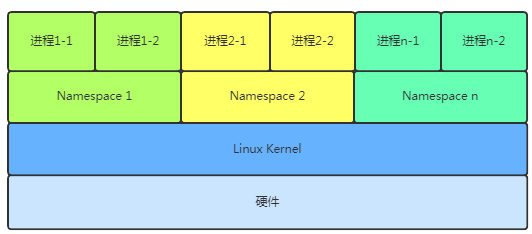 

> **Linux** 内核提拱了6种 **namespace** 隔离的系统调用，如下图所示

| Namespace | 系统调用参数  | 隔离内容                   |
| --------- | ------------- | -------------------------- |
| UTS       | CLONE_NEWUTS  | 主机名与域名               |
| IPC       | CLONE_NEWIPC  | 信号量、消息队列和共享内存 |
| PID       | CLONE_NEWPID  | 进程编号                   |
| Network   | CLONE_NEWNET  | 网络设备、网络栈、端口等等 |
| Mount     | CLONE_NEWNS   | 挂载点（文件系统）         |
| User      | CLONE_NEWUSER | 用户和用户组               |

#### 4.1.2 CGroup 分配资源

Docker 通过 **Cgroup** 来控制容器使用的资源配额，一旦超过这个配额就发出**OOM**。配额主要包括 CPU、内存、磁盘、网络等方面， 基本覆盖了常见的资源配额和使用量控制。

> CGroup 中的三组件

- `cgroup` 是对进程分组管理的一种机制，一个cgroup包含一组进程，并且可以在这个cgroup上增加 linux subsystem的各种参数配置，将一组进程和一组subsystem的系统参数关联起来。
- `subsystem` 是一组资源控制的模块，一般包含如下配置：
  - blkio 谁知对块设备的输入输出访问控制；
  - cpu 设置cgroup中进程的cpu 被调度的策略；
  - cpuacct 可以统计cgroup中进程的cpu占用；
  - cpuset 在多核机器上设置ccgroup中进程可以使用的cpu
  - devices 控制cgroup中进程对设备的访问；
  - freeze 用去刮起和恢复cgroup 中的进程；
  - memory 用于控制cgroup中的进程内存；
  - net_cls 用于将cgroup中进程产生的网络包分类，以便linux的tc（traffic controller） 可以根据分类区分出来自某个cgroup中的包做限流或监控；
  - net_prio 设置cgroup中的进程产生的网络流量优先级；
  - ns  它的作用是使cgroup中的进程在新的namespace中fork新进程（newns）时，创建一个新的cgroup，这个cgroup包含新的namespaace中的进程；
- `hierarchy` 的功能是把一组cgroup串成一个树状结构，便于继承，相当于默认有一个cgroup根结点，其他cgroup都是该cgroup的子节点；

#### 4.1.3 Docker Cgroup

> docker 中使用cgroup

```bash
$ docker run -itd -m 128m ubuntu
#  // 在里面能找到对应的docker 的唯一ID目录同样在 memory.limit_in_bytes 中设置；
$ ls /sys/fs/cgroup/memory/docker/    
```

相关文章：

1. [Linux Cgroup总结](https://juejin.cn/post/6901477931265196039#heading-12)    

### 4.2 联合文件系统（Union File System）

如何实现**rootfs**的高效可重复利用呢？Docker在镜像的设计中引入了层（**layer**）的概念。也就是说用户制作镜像的每一步操作都会生成一个层，也就是一个增量**rootfs**。介绍分层前我们先说个重要知识点，联合文件系统。

#### 4.2.1 什么是 UnionFS

UFS 是一种把其他文件系统联合到一个联合挂载带你的文件系统服务，它使用branch 把不同文件系统的文件和目录“透明地”覆盖，形成一个单一一致的文件系统。这些branch 或者是read-only 的或这的read-write的，所以当这个虚拟后的联合文件系统进行写操作的时候，系统是真整写到一个新的文件中。看起来这个整个系统是可以对任何文件进行操作，但是并没有改变原来这个文件。因为unionfs 用到一个叫写时复制的技术（COW)。 Copy-on-write, 也叫隐式共享；如果一个资源是重复的，在没有任何修改的前提下，是不需要建立一个新的资源，这个资源可以同时被新旧实例共享；当第一次写操作发生时，会对该资源完整的复制并进行修改；

#### 4.2.2 AUFS

AUFS 是 UFS 的一种实现，Docker 选用的第一种存储驱动并沿用至今，还有其他同类型驱动，overlay, overlay2, overlyafs 等；AUFS 需要内核支持

> 查看内核是否支持aufs

```bash
$ cat /proc/filesystems |grep aufs
nodev	aufs
# // 如果不支持可以通过切换到支持aufs的内核
$ cd /etc/yum.repos.d/
$ wget https://yum.spaceduck.org/kernel-ml-aufs/kernel-ml-aufs.repo
$ yum install kernel-ml-aufs 
```

- 内核切换，推荐一个我当时参考: [www.cnblogs.com/xzkzzz/p/96…](https://link.juejin.cn/?target=https%3A%2F%2Fwww.cnblogs.com%2Fxzkzzz%2Fp%2F9627658.html) 

#### 4.2.3 docker 如何使用aufs 

> Docker aufs存储目录

- /var/lib/docker/aufs/diff
  - docker host filesystem 存储在该目录下

- /var/lib/docker/aufs/layers/
  - docker 的镜像主要存储位置

- /var/lib/docker/aufs/mnt；
  - 运行时修改的文件内容

> 操作流程记录

```bash
$ pwd
/data/docker_lab/online/aufs
$ ls
changed-ubuntu cn-l iml1 iml2 iml3 mnt
$ cat cn-l/cn-l.txt
I am cn layer
$ cat iml1/iml1.txt
l1
$ cat iml2/iml2.txt
l2
$ cat iml3/iml3.txt
l3
#  挂载aufs
$ mount -t aufs -o dirs=./cn-l/:./iml3:./iml2:./iml1 none ./mnt  
$ tree mnt/
mnt/
├── cn-l.txt
├── iml1.txt
├── iml2.txt
└── iml3.txt
# 这是一个mnt的挂载点信息， 只有cn-l 是可读写的
$ cat /sys/fs/aufs/si_d3fb24f591e1278f/*   
/data/docker_lab/online/aufs/cn-l=rw
/data/docker_lab/online/aufs/iml3=ro
/data/docker_lab/online/aufs/iml2=ro
/data/docker_lab/online/aufs/iml1=ro
64
65
66
67
/data/docker_lab/online/aufs/cn-l/.aufs.xino
# 追加一个内容试试，看看COW的反应
$ echo "write to mnt's iml1" >> ./mnt/iml3.txt 
#  确实追加成功
$ cat  ./mnt/iml3.txt  
l3
write to mnt's iml1

# 但是 iml3 下的 iml3.txt 并没有增加内容
$ cat iml3/iml3.txt   
l3

# 可以看到iml3.txt 是被复制到读写层进行了修改
$ cat cn-l/iml3.txt   
l3
write to mnt's iml1
# 删除iml1.txt 看看UFS 的操作
$ rm ./mnt/iml1.txt  
#  确实没有了
$ ls ./mnt/  
cn-l.txt iml2.txt iml3.txt
# iml1镜像层的iml1.txt 还存在，下面看看读写层
$ ls iml1/iml1.txt   
iml1/iml1.txt
# 可以看到出现很多 .wh开头的文件其中 .wh.iml1.txt 会被隐藏的文件，但不会实际去删除对应的read-only层文件，wh文件称为 whiteout 文件；
$ ll ./cn-l/ -a 
drwxr-xr-x 4 root root 4096 9月 15 12:46 .
drwxr-xr-x 8 root root 4096 9月 14 01:21 ..
-rw-r--r-- 1 root root 14 9月 15 12:37 cn-l.txt
-rw-r--r-- 1 root root 23 9月 15 12:45 iml3.txt
-r--r--r-- 2 root root 0 9月 15 12:40 .wh.iml1.txt
-r--r--r-- 2 root root 0 9月 15 12:40 .wh..wh.aufs
drwx------ 2 root root 4096 9月 15 12:40 .wh..wh.orph
drwx------ 2 root root 4096 9月 15 12:40 .wh..wh.plnk
```

### 4.3 docker 网络原理

学习Docker，会学习到docker网络，一个网络是一组可以相互联通的端点。Docker在安装时就会创建3个网络

```bash
# 查看网络
mac@wxw / % docker network ls
NETWORK ID     NAME      DRIVER    SCOPE
d0eb3e42d7c3   bridge    bridge    local
737d21d9c298   host      host      local
bb199cfda59f   none      null      local
```

> 在学习 Docker 网络之前，我们有必要先来了解一下这几种网络模式都是什么意思。

| 网络模式  | 简介                                                         |
| --------- | ------------------------------------------------------------ |
| bridge    | 为每一个容器分配、设置 IP 等，并将容器连接到一个 `docker0` 虚拟网桥，默认为该模式。 |
| host      | 容器将不会虚拟出自己的网卡，配置自己的 IP 等，而是使用宿主机的 IP 和端口。 |
| none      | 容器有独立的 Network namespace，但并没有对其进行任何网络设置，如分配 veth pair 和网桥连接，IP 等。 |
| container | 新创建的容器不会创建自己的网卡和配置自己的 IP，而是和一个指定的容器共享 IP、端口范围等。 |

#### 4.3.1 bridge 网络模式

在该模式中，Docker 守护进程创建了一个虚拟以太网桥 `docker0`，新建的容器会自动桥接到这个接口，附加在其上的任何网卡之间都能自动转发数据包。

　默认情况下，守护进程会创建一对对等虚拟设备接口 `veth pair`，将其中一个接口设置为容器的 `eth0` 接口（容器的网卡），另一个接口放置在宿主机的命名空间中，以类似 `vethxxx` 这样的名字命名，从而将宿主机上的所有容器都连接到这个内部网络上。

> 查看网络IP需要的工具

```bash
##  安装ifconfig
apt-get install net-tools 

## 安装ping
apt-get install iputils-ping 

## 安装ip
apt-get install iproute2  
```

> 比如我运行一个基于 `ubuntu` 镜像构建的容器 `ubuntu-test`，查看 `ip addr`：

```bash
[root@docker-test ~]$ docker exec -it ubuntu-test /bin/bash
root@fb928ab53c0a:/# ip addr
1: lo: <LOOPBACK,UP,LOWER_UP> mtu 65536 qdisc noqueue state UNKNOWN group default qlen 1000
    link/loopback 00:00:00:00:00:00 brd 00:00:00:00:00:00
    inet 127.0.0.1/8 scope host lo
       valid_lft forever preferred_lft forever
28: eth0@if29: <BROADCAST,MULTICAST,UP,LOWER_UP> mtu 1500 qdisc noqueue state UP group default
    link/ether 02:42:a9:fe:00:02 brd ff:ff:ff:ff:ff:ff link-netnsid 0
    inet 169.254.0.2/24 brd 169.254.0.255 scope global eth0
       valid_lft forever preferred_lft forever
```

然后宿主机通过 `ip addr` 查看信息如下：

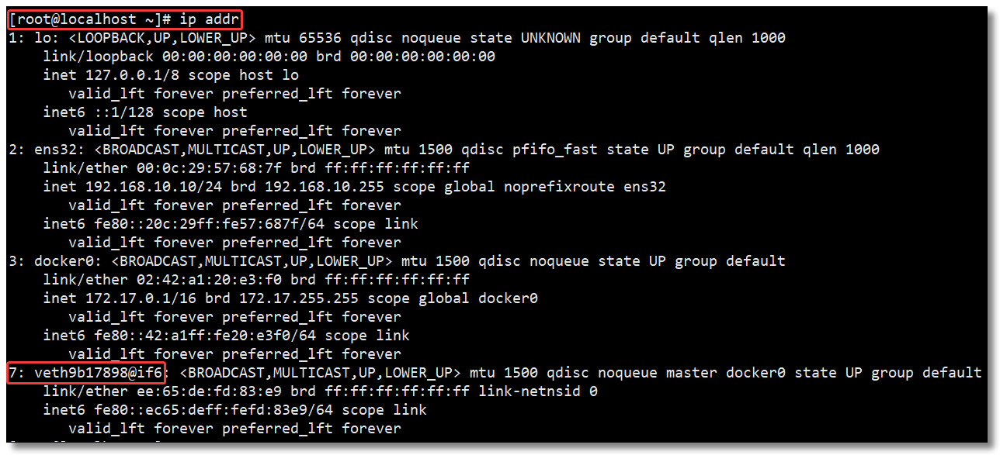  

通过以上的比较可以发现，证实了之前所说的：守护进程会创建一对对等虚拟设备接口 `veth pair`，将其中一个接口设置为容器的 `eth0` 接口（容器的网卡），另一个接口放置在宿主机的命名空间中，以类似 `vethxxx` 这样的名字命名。

同时，守护进程还会从网桥 `docker0` 的私有地址空间中分配一个 IP 地址和子网给该容器，并设置 docker0 的 IP 地址为容器的默认网关。也可以安装 `yum install -y bridge-utils` 以后，通过 `brctl show` 命令查看网桥信息。

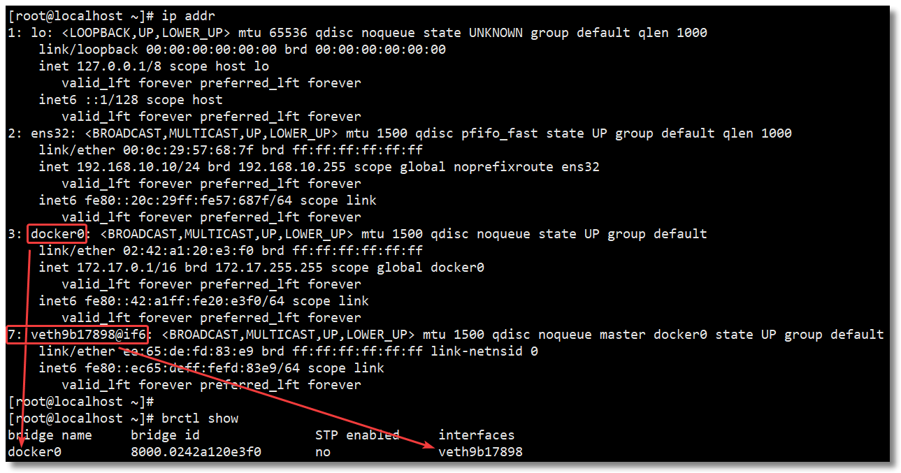 

　对于每个容器的 IP 地址和 Gateway 信息，我们可以通过 `docker inspect 容器名称|ID` 进行查看，在 `NetworkSettings` 节点中可以看到详细信息。

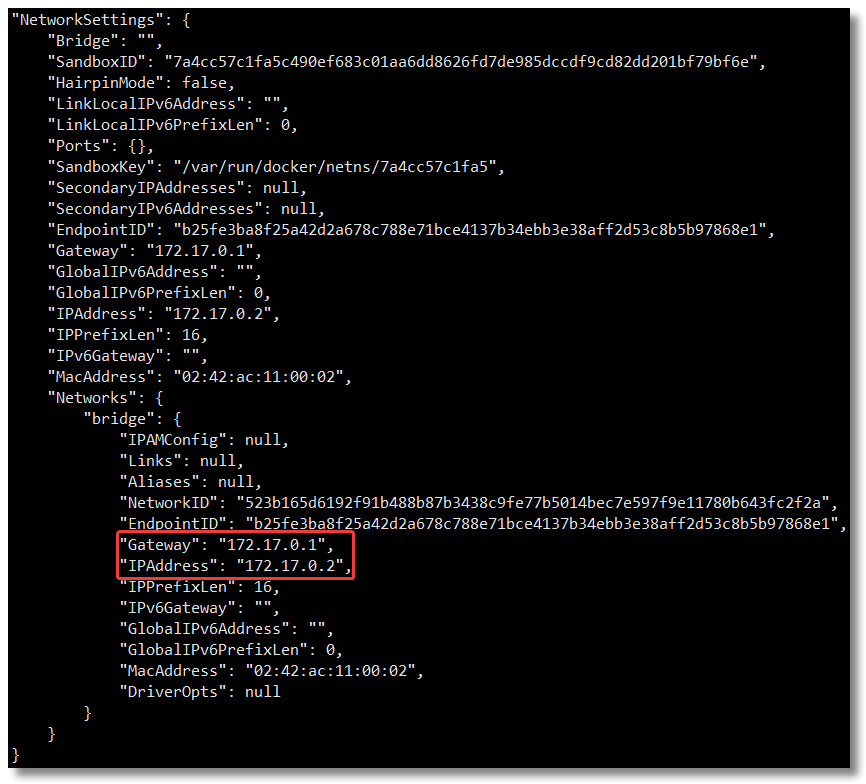  

　我们可以通过 `docker network inspect bridge` 查看所有 `bridge` 网络模式下的容器，在 `Containers` 节点中可以看到容器名称。

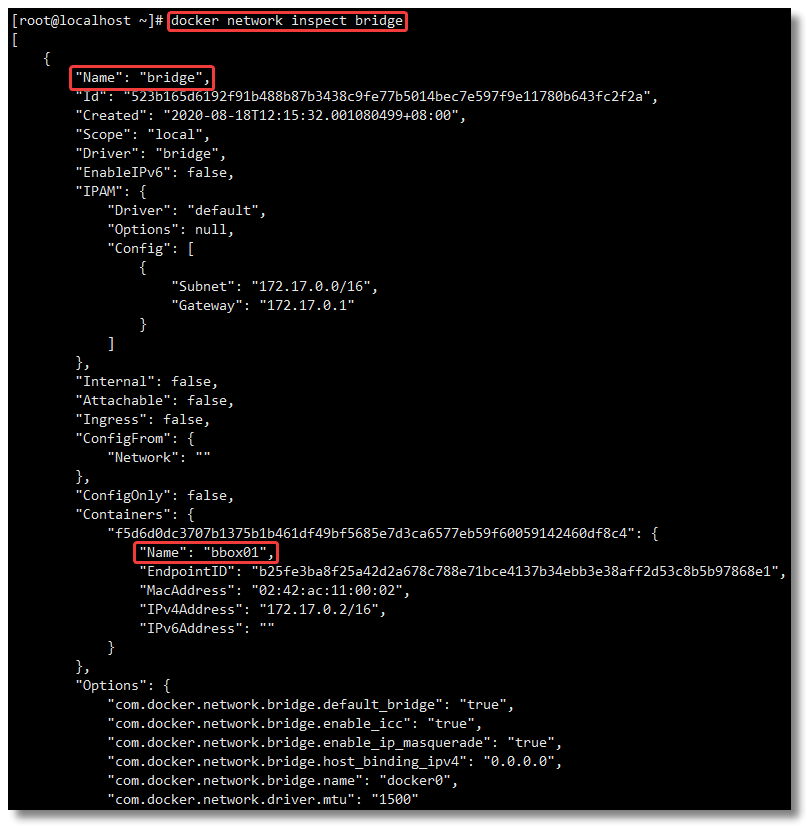 

​       关于 `bridge` 网络模式的使用，只需要在创建容器时通过参数 `--net bridge` 或者 `--network bridge` 指定即可，当然这也是创建容器默认使用的网络模式，也就是说这个参数是可以省略的。

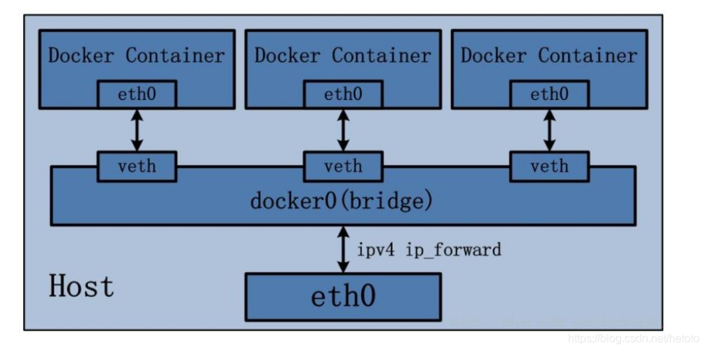 

Bridge 桥接模式的实现步骤主要如下：

- Docker Daemon 利用 veth pair 技术，在宿主机上创建一对对等虚拟网络接口设备，假设为 veth0 和 veth1。而 veth pair 技术的特性可以保证无论哪一个 veth 接收到网络报文，都会将报文传输给另一方。

- Docker Daemon 将 veth0 附加到 Docker Daemon 创建的 docker0 网桥上。保证宿主机的网络报文可以发往 veth0；

- Docker Daemon 将 veth1 添加到 Docker Container 所属的 namespace 下，并被改名为 eth0。如此一来，宿主机的网络报文若发往 veth0，则立即会被 Container 的 eth0 接收，实现宿主机到 Docker Container 网络的联通性；同时，也保证 Docker Container 单独使用 eth0，实现容器网络环境的隔离性。

#### 4.3.2 host 网络模式

- host 网络模式需要在创建容器时通过参数 `--net host` 或者 `--network host` 指定；

- 采用 host 网络模式的 Docker Container，可以直接使用宿主机的 IP 地址与外界进行通信，若宿主机的 eth0 是一个公有 IP，那么容器也拥有这个公有 IP。同时容器内服务的端口也可以使用宿主机的端口，无需额外进行 NAT 转换；

- host 网络模式可以让容器共享宿主机网络栈，这样的好处是外部主机与容器直接通信，但是容器的网络缺少隔离性。

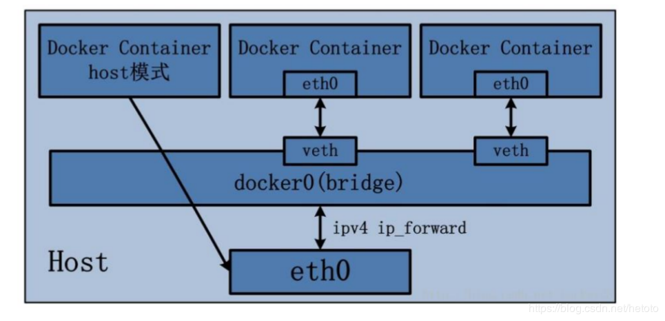 

#### 4.3.3 none 网络模式

- none 网络模式是指禁用网络功能，只有 lo 接口 local 的简写，代表 127.0.0.1，即 localhost 本地环回接口。在创建容器时通过参数 `--net none` 或者 `--network none` 指定；
- none 网络模式即不为 Docker Container 创建任何的网络环境，容器内部就只能使用 loopback 网络设备，不会再有其他的网络资源。可以说 none 模式为 Docke Container 做了极少的网络设定，但是俗话说得好“少即是多”，在没有网络配置的情况下，作为 Docker 开发者，才能在这基础做其他无限多可能的网络定制开发。这也恰巧体现了 Docker 设计理念的开放。

#### 4.3.4 container 网络模式

Container 网络模式是 Docker 中一种较为特别的网络的模式。在创建容器时通过参数 `--net container:已运行的容器名称|ID` 或者 `--network container:已运行的容器名称|ID` 指定；

处于这个模式下的 Docker 容器会共享一个网络栈，这样两个容器之间可以使用 localhost 高效快速通信。

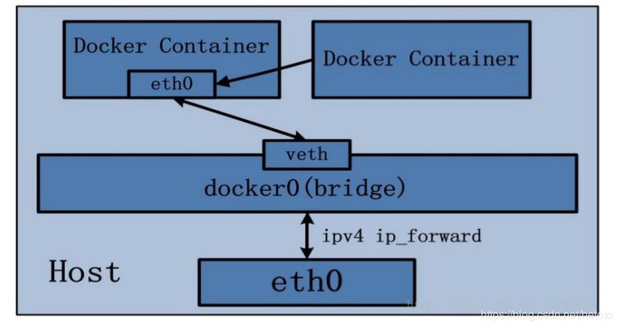 

　**Container 网络模式即新创建的容器不会创建自己的网卡，配置自己的 IP，而是和一个指定的容器共享 IP、端口范围等**。同样两个容器除了网络方面相同之外，其他的如文件系统、进程列表等还是隔离的。

#### 4.3.5 link 网络模式

`docker run --link` 可以用来链接两个容器，使得源容器（被链接的容器）和接收容器（主动去链接的容器）之间可以互相通信，并且接收容器可以获取源容器的一些数据，如源容器的环境变量。

　这种方式**官方已不推荐使用**，并且在未来版本可能会被移除，所以这里不作为重点讲解，感兴趣可自行了解。

> 官网警告信息：[docs.docker.com/network/lin…](https://link.juejin.cn/?target=https%3A%2F%2Fdocs.docker.com%2Fnetwork%2Flinks%2F)

#### 4.3.6 容器之间怎么进行网络通信

- 主机内部，相同网络

Docker基于veth pair技术实现 网卡对，实现相同网络之间的通信，不是直接端对端，是通过bridge间接实现通信。

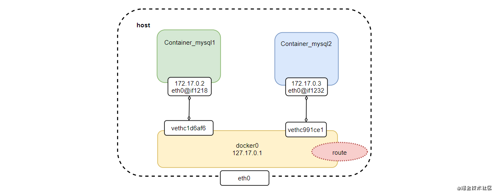 

- 主机内部，不同网络

不同网络之间是不能直接进行通信的，也就是在172.17.0.2容器内部不能ping通172.18.0.4。如下图是连接不通的网络拓扑图：

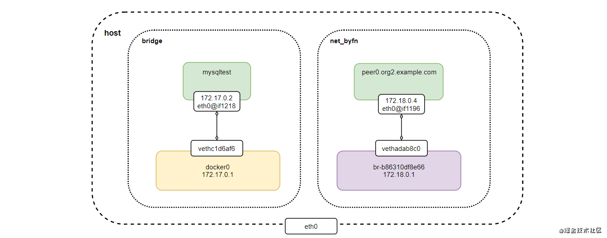  

可以通过以下2种方法实现不同网络直接的通信：

- **把容器加入到另一个网络中，把想要通信的容器放在同一容器**
- **修改底层iptables实现网络的通信** 

#### 4.3.7 外网如何与容器通信

在容器内ping [www.baidu.com](https://link.juejin.cn/?target=http%3A%2F%2Fwww.baidu.com) 是可以通的

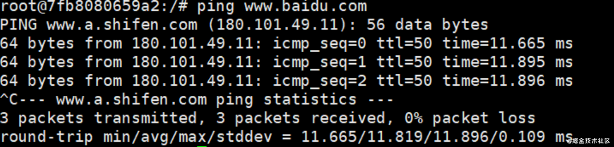 

可见，容器默认就可以访问外网。但是原理是什么呢？

先查一下iptables规则，在NAT表有这么一条规则：

```bash
-A POSTROUTING -s 172.17.0.0/16 ! -o docker0 -j MASQUERADE
```

这条语句表明：网桥docker0收到来自172.17.0.0/16网段的外出包，把它交给MASQUERADE处理。MASQUERADE的处理方式将包的源地址替换成host的地址发送出去，也就是做了一次网络地址转换(NAT)

查看路由表，可以看到默认路由是通过eth0发送出去

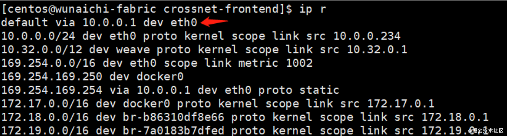 

> 我们使用tcpdump 抓包来看怎么转换的

- 第一步：先让docker0网络的容器ping 百度的网址

  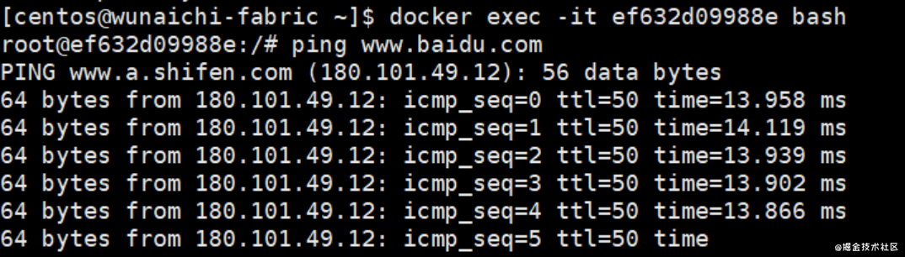 

- 第二步：看到docker0抓包情况

  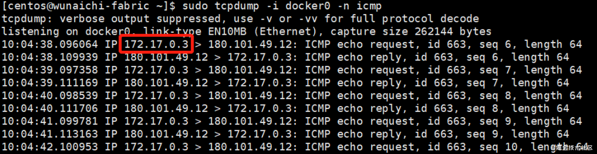 

  docker0收到mysqltest的ping包，源地址为容器的ip 172.17.0.3，然后交给MASQUERADE处理。

- 第三步：看到eth0抓包情况

  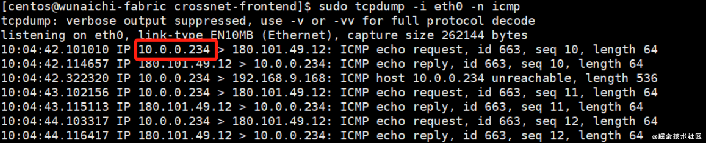 

  在eth0看到把ping包源地址转成10.0.0.234，这就是NAT规则处理的结果，保证数据包到达外网。

> 下图就是以上的流程：

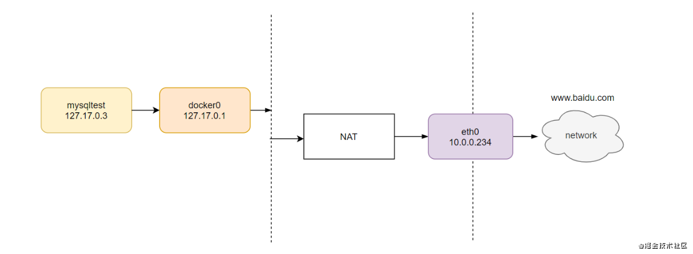 

相关文章

1. [浅析Docker网络原理](https://juejin.cn/post/6904201044390051848) 
2. [Docker 网络模式详解及容器间网络通信](https://juejin.cn/post/6868086876751085581) 

## 5. Docker 底层


## 6. Docker 拓展

### 6.1 Docker Compose

> 导读：https://www.runoob.com/docker/docker-compose.html

### 6.2 Docker Swarm

> 导读：https://www.runoob.com/docker/docker-swarm.html


