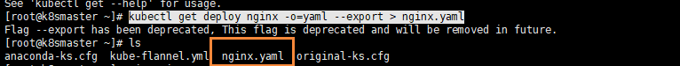
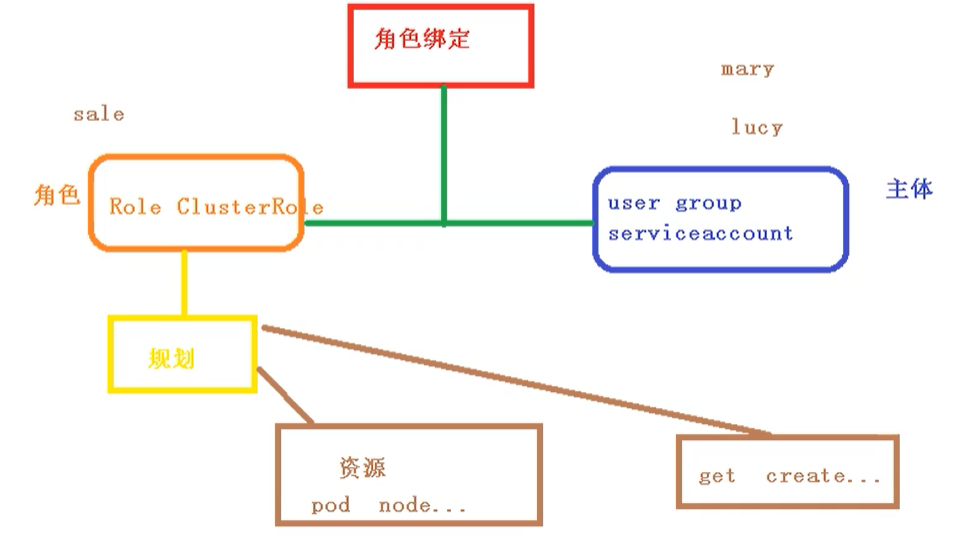
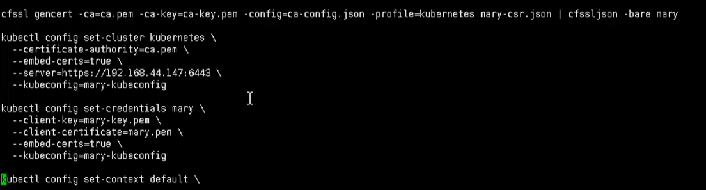
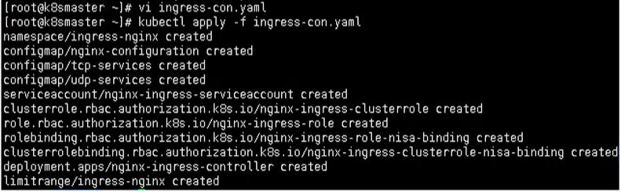
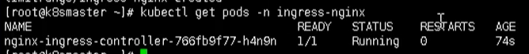
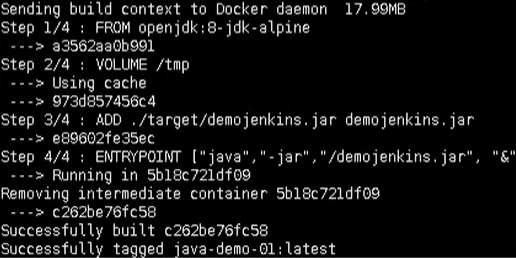
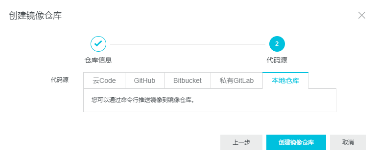

## 前言

K8S主要讲的就是Kubernetes，首先Kubernetes首字母为K，末尾为s，中间一共有8个字母，所以简称K8s

- 官方文章：https://kubernetes.io/zh/docs
- Kuberantes 中文社区：https://www.kubernetes.org.cn/
- 视频资源
  - [k8s由浅入深](https://www.bilibili.com/video/BV1GT4y1A756)    

## K8S基础

### 1. Kubernates初识

#### 1.1 kubernates 概述

Kubernetes是一个开源的，用于管理云平台中多个主机上的容器化的应用，Kubernetes的目标是让部署容器化的应用简单并且高效（powerful），Kubernetes提供了应用部署、规划、更新、维护的一种机制。

在所有的容器编排工具中（类似的还有 docker swarm / mesos等），Kubernetes的生态系统更大、增长更快，有更多的支持、服务和工具可供用户选择。

Kubernetes是Google开源的容器集群管理系统。最初源于谷歌内部的Borg，是Google基于Borg开源的容器编排调度引擎。它构建在Docker技术之上，为跨主机的容器化应用提供资源调度、服务发现、高可用管理和弹性伸缩等一整套功能，它提供完善的管理工具，涵盖开发、部署测试、运维监控等各个环节。

它的目标不仅仅是一个编排系统，而是提供一个规范，可以让你来描述集群的架构，定义服务的最终状态，Kubernetes可以帮你将系统自动的达到和维持在这个状态。

**重点：跨机器、跨平台；协调资源使用** 

#### 1.2 kubernates特性

- 自动化部署：yaml部署到K8S，会根据应用程序计算资源需求，自动分配到node。
- 系统自愈：重启已经停机的容器；替换、kill 那些不满足自定义健康检查条件的容器；在容器就绪之前，避免调用者发现该容器。
- 水平扩展：HPA周期调度RC的副本数量，将用户定义的resource值匹配。
- 服务发现和负载均衡：内置服务发现功能。可以通过 DNS 名称或 IP 地址暴露容器的访问方式；并且可以在同组容器内分发负载以实现负载均衡。
- 存储编排：可以自动挂载指定的存储系统，例如 local stroage/nfs/云存储等。
- 自动更新和回滚：可以在 K8S 中声明你期望应用程序容器应该达到的状态，Kubernetes将以合适的速率调整容器的实际状态，并逐步达到最终期望的结果，不会同时杀掉应用。更新出错，自动恢复到原先状态。

#### 1.3 常用安装工具

> 来源：https://kubernetes.io/zh/docs/tasks/tools/

##### 1.3.1 kubectl 命令行工具

Kubernetes 命令行工具，[kubectl](https://kubernetes.io/docs/reference/kubectl/kubectl/)，使得你可以对 Kubernetes 集群运行命令。 你可以使用 kubectl 来部署应用、监测和管理集群资源以及查看日志。

有关更多信息，包括 kubectl 操作的完整列表，请参见[`kubectl` 参考文件](https://kubernetes.io/zh/docs/reference/kubectl/)

- 命令使用指南：https://kubernetes.io/docs/reference/generated/kubectl/kubectl-commands 

kubectl 可安装在各种 Linux 平台、 macOS 和 Windows 上。 在下面找到你喜欢的操作系统。

- [在 Linux 上安装 kubectl](https://kubernetes.io/zh/docs/tasks/tools/install-kubectl-linux)
- [在 macOS 上安装 kubectl](https://kubernetes.io/zh/docs/tasks/tools/install-kubectl-macos)
- [在 Windows 上安装 kubectl](https://kubernetes.io/zh/docs/tasks/tools/install-kubectl-windows) 

使用指南：

##### 1.3.2 kind 支持本地安装k8s

> [查看 kind 的快速入门指南](https://kind.sigs.k8s.io/docs/user/quick-start/)   

[`kind`](https://kind.sigs.k8s.io/docs/) 让你能够在本地计算机上运行 Kubernetes。 `kind` 要求你安装并配置好 [Docker](https://docs.docker.com/get-docker/)。

kind [快速入门](https://kind.sigs.k8s.io/docs/user/quick-start/)页面展示了 开始使用 `kind` 所需要完成的操作。

##### 1.3.3  minkube 类似kind

> [查看 minikube 快速入门指南](https://minikube.sigs.k8s.io/docs/start/) 

与 `kind` 类似，[`minikube`](https://minikube.sigs.k8s.io/)， 能让你在本地运行 Kubernetes。 `minikube` 在你本地的个人计算机（包括 Windows、macOS 和 Linux PC）运行一个单节点的 Kubernetes 集群，以便你来尝试 Kubernetes 或者开展每天的开发工作。

如果你关注如何安装此工具，可以按官方的 [Get Started!](https://minikube.sigs.k8s.io/docs/start/)指南操作。

当你拥有了可工作的 `minikube` 时，就可以用它来 [运行示例应用](https://kubernetes.io/zh/docs/tutorials/hello-minikube/)了。

##### 1.3.4 kubeadm 管理集群

> [查看 kubeadm 安装指南](https://kubernetes.io/zh/docs/setup/production-environment/tools/kubeadm/install-kubeadm/)  

你可以使用 [kubeadm](https://kubernetes.io/zh/docs/setup/production-environment/tools/kubeadm/) 工具来 创建和管理 Kubernetes 集群。 该工具能够执行必要的动作并用一种用户友好的方式启动一个可用的、安全的集群。

[安装 kubeadm](https://kubernetes.io/zh/docs/setup/production-environment/tools/kubeadm/install-kubeadm/) 展示了如何安装 kubeadm 的过程。 一旦安装了 kubeadm，你就可以使用它来 [创建一个集群](https://kubernetes.io/zh/docs/setup/production-environment/tools/kubeadm/create-cluster-kubeadm/)。

### 2. K8S 环境

- [Centos7.6部署k8s v1.16.4高可用集群(主备模式)](https://www.kubernetes.org.cn/6632.html) 

#### 2.1 centos 安装k8s集群

## K8S设计架构

Kubernetes集群包含有节点代理kubelet和Master组件(APIs, scheduler, etc)，一切都基于分布式的存储系统。下面这张图是Kubernetes的架构图。

 

在这张系统架构图中，我们把服务分为运行在工作节点上的服务和组成集群级别控制板的服务。

Kubernetes节点有运行应用容器必备的服务，而这些都是受Master的控制。

每次个节点上当然都要运行Docker。Docker来负责所有具体的映像下载和容器运行。

**核心组件组成** 

- etcd保存了整个集群的状态；
- apiserver提供了资源操作的唯一入口，并提供认证、授权、访问控制、API注册和发现等机制；
- controller manager负责维护集群的状态，比如故障检测、自动扩展、滚动更新等；
- scheduler负责资源的调度，按照预定的调度策略将Pod调度到相应的机器上；
- kubelet负责维护容器的生命周期，同时也负责Volume（CVI）和网络（CNI）的管理；
- Container runtime负责镜像管理以及Pod和容器的真正运行（CRI）；
- kube-proxy负责为Service提供cluster内部的服务发现和负载均衡；

除了核心组件，还有一些推荐的Add-ons：

- kube-dns负责为整个集群提供DNS服务
- Ingress Controller为服务提供外网入口
- Heapster提供资源监控
- Dashboard提供GUI
- Federation提供跨可用区的集群
- Fluentd-elasticsearch提供集群日志采集、存储与查询

### 1.  节点

#### 1.1  master节点

 

- Master：集群控制节点，负责整个集群的管理和控制。

- API Server：提供接口，资源增删改查入口。并提供认证、授权、访问控制、API注册和发现等机制。

- Controller Manager：所有资源对象的自动化控制中心；负责维护集群的状态，比如故障检测、自动扩展、滚动更新等。

- Scheduler：负责资源调度，按照预定的调度策略将Pod调度到相应的机器上。

- Etcd：保存整个集群的状态。

#### 1.2 Node节点

    

- Node：工作节点，听从master的工作分配

- Kubelet：Pod容器创建、启停、集群管理等任务；同时也负责Volume（CVI）和网络（CNI）的管理。

- Kube-proxy：实现service的通信与负载均衡组件。

- Docker：docker引擎，负责本机容器的创建和管理工作。

### 2. 分层架构

Kubernetes设计理念和功能其实就是一个类似Linux的分层架构，如下图所示

 

- 核心层：Kubernetes最核心的功能，对外提供API构建高层的应用，对内提供插件式应用执行环境
- 应用层：部署（无状态应用、有状态应用、批处理任务、集群应用等）和路由（服务发现、DNS解析等）
- 管理层：系统度量（如基础设施、容器和网络的度量），自动化（如自动扩展、动态Provision等）以及策略管理（RBAC、Quota、PSP、NetworkPolicy等）
- 接口层：kubectl命令行工具、客户端SDK以及集群联邦
- 生态系统：在接口层之上的庞大容器集群管理调度的生态系统，可以划分为两个范畴
  - Kubernetes外部：日志、监控、配置管理、CI、CD、Workflow、FaaS、OTS应用、ChatOps等
  - Kubernetes内部：CRI、CNI、CVI、镜像仓库、Cloud Provider、集群自身的配置和管理等

从K8s的系统架构、技术概念和设计理念，我们可以看到K8s系统最核心的两个设计理念：一个是**容错性**，一个是**易扩展性**。容错性实际是保证K8s系统稳定性和安全性的基础，易扩展性是保证K8s对变更友好，可以快速迭代增加新功能的基础。

### 3. K8S 核心概念

- Pod：最小部署单元、一组容器的集合、共享网络、生命周期短暂
- Controller：确保预期的pod副本数量（有/无状态部署）、确保所有的Node运行同一个Pod/一次性任务/定时任务
- Service：定义一组Pod 的访问规则

## K8S核心技术

### 1.Kubectl 命令行工具

kubectl是Kubernetes集群的命令行工具，通过kubectl能够对集群本身进行管理，并能够在集群上进行容器化应用的安装和部署

```powershell
kubectl [command] [type] [name] [flags]

参数
  - command：指定要对资源执行的操作，例如create、get、describe、delete
  - type：指定资源类型，资源类型是大小写敏感的，开发者能够以单数 、复数 和 缩略的形式
  - name：指定资源的名称，名称也是大小写敏感的，如果省略名称，则会显示所有的资源
  - flags：指定可选的参数，例如，可用 -s 或者 -server参数指定Kubernetes API server的地址和端口
  
例如：
kubectl get pod pod1
kubectl get pods pod1
kubectl get po pod1
```

 

#### 1.1 help 查看帮助信息

```powershell
# 获取kubectl的命令
kubectl --help

# 获取某个命令的介绍和使用
kubectl get --help
```

#### 1.2 常见命令

##### 1.2.1 基础命令

| 命令    | 介绍                                           |
| ------- | ---------------------------------------------- |
| create  | 通过文件名或标准输入创建资源                   |
| expose  | 将一个资源公开为一个新的Service                |
| run     | 在集群中运行一个特定的镜像                     |
| set     | 在对象上设置特定的功能                         |
| get     | 显示一个或多个资源                             |
| explain | 文档参考资料                                   |
| edit    | 使用默认的编辑器编辑一个资源                   |
| delete  | 通过文件名，标准输入，资源名称或标签来删除资源 |

##### 1.2.2 部署命令

| 命令           | 介绍                                               |
| -------------- | -------------------------------------------------- |
| rollout        | 管理资源的发布                                     |
| rolling-update | 对给定的复制控制器滚动更新                         |
| scale          | 扩容或缩容Pod数量，Deployment、ReplicaSet、RC或Job |
| autoscale      | 创建一个自动选择扩容或缩容并设置Pod数量            |

##### 1.2.3 集群管理命令

| 命令         | 介绍                           |
| ------------ | ------------------------------ |
| certificate  | 修改证书资源                   |
| cluster-info | 显示集群信息                   |
| top          | 显示资源(CPU/M)                |
| cordon       | 标记节点不可调度               |
| uncordon     | 标记节点可被调度               |
| drain        | 驱逐节点上的应用，准备下线维护 |
| taint        | 修改节点taint标记              |

##### 1.2.4 故障和调试命令

| 命令         | 介绍                                                         |
| ------------ | ------------------------------------------------------------ |
| describe     | 显示特定资源或资源组的详细信息                               |
| logs         | 在一个Pod中打印一个容器日志，如果Pod只有一个容器，容器名称是可选的 |
| attach       | 附加到一个运行的容器                                         |
| exec         | 执行命令到容器                                               |
| port-forward | 转发一个或多个                                               |
| proxy        | 运行一个proxy到Kubernetes API Server                         |
| cp           | 拷贝文件或目录到容器中                                       |
| auth         | 检查授权                                                     |

##### 1.2.5 其它命令

| 命令         | 介绍                                                |
| ------------ | --------------------------------------------------- |
| apply        | 通过文件名或标准输入对资源应用配置                  |
| patch        | 使用补丁修改、更新资源的字段                        |
| replace      | 通过文件名或标准输入替换一个资源                    |
| convert      | 不同的API版本之间转换配置文件                       |
| label        | 更新资源上的标签                                    |
| annotate     | 更新资源上的注释                                    |
| completion   | 用于实现kubectl工具自动补全                         |
| api-versions | 打印受支持的API版本                                 |
| config       | 修改kubeconfig文件（用于访问API，比如配置认证信息） |
| help         | 所有命令帮助                                        |
| plugin       | 运行一个命令行插件                                  |
| version      | 打印客户端和服务版本信息                            |

#### 1.3 目前使用命令

```bash
# 创建一个nginx镜像
kubectl create deployment nginx --image=nginx

# 对外暴露端口
kubectl expose deployment nginx --port=80 --type=NodePort

# 查看资源
kubectl get pod, svc
```

### 2. 资源编排（YAML文件）

K8S有两种创建资源的方式：kubectl 命令和 yaml 配置文件。

- kubectl命令行：最为简单，一条命令就OK，但缺点也很明显，你并不知道这条命令背后到底做了哪些事!
- yaml配置文件：提供了一种让你知其然更知其所以然的方式。优势如下：
  - 完整性：配置文件描述了一个资源的完整状态，可以很清楚地知道一个资源的创建背后究竟做了哪些事；
  - 灵活性：配置文件可以创建比命令行更复杂的结构；
  - 可维护性：配置文件提供了创建资源对象的模板，能够重复使用；
  - 可扩展性：适合跨环境、规模化的部署。

k8s 集群中对资源管理和资源对象编排部署都可以通过声明样式（YAML）文件来解决，也就是可以把需要对资源对象操作编辑到YAML 格式文件中，我们把这种文件叫做资源清单文件，通过kubectl 命令直接使用资源清单文件就可以实现对大量的资源对象进行编排部署了。一般在我们开发的时候，都是通过配置YAML文件来部署集群的。

YAML文件：就是资源清单文件，用于资源编排

#### 2.1 Y AML基本语法

- 缩进的空格数目不重要，只要相同层级的元素左侧对齐即可
- 低版本缩进时不允许使用Tab 键，只允许使用空格
- 使用#标识注释，从这个字符一直到行尾，都会被解释器忽略
- 使用 --- 表示新的yaml文件开始

#### 2.2 YAML 数据结构

##### 2.2.1 对象

键值对的集合，又称为映射(mapping) / 哈希（hashes） / 字典（dictionary）

```yaml
# 对象类型：对象的一组键值对，使用冒号结构表示
name: Tom
age: 18

# yaml 也允许另一种写法，将所有键值对写成一个行内对象
hash: {name: Tom, age: 18}
```

##### 2.2.2 数组

```yaml
# 数组类型：一组连词线开头的行，构成一个数组
People
- Tom
- Jack

# 数组也可以采用行内表示法
People: [Tom, Jack]
```

#### 2.3 YAML组成部分

主要分为了两部分，一个是控制器的定义 和 被控制的对象

> 字段说明

 

#### 2.4 如何快速编写YAML文件

一般来说，我们很少自己手写YAML文件，因为这里面涉及到了很多内容，我们一般都会借助工具来创建

- 使用kubectl create命令生成YAML文件
- 使用kubectl get命令导出已有的yaml文件

##### 2.4.1  kubectl create命令生成

这种方式一般用于资源没有部署的时候，我们可以直接创建一个YAML配置文件

```bash
# 尝试运行,并不会真正的创建镜像
kubectl create deployment web --image=nginx -o yaml --dry-run

# 或者我们可以输出到一个文件中
kubectl create deployment web --image=nginx -o yaml --dry-run > hello.yaml
```

然后我们就在文件中直接修改即可

##### 2.4.2  kubectl get命令导出

可以首先查看一个目前已经部署的镜像

```bash
kubectl get deploy
```

 

然后我们导出 nginx的配置

```powershell
kubectl get deploy nginx -o=yaml --export > nginx.yaml
```

然后会生成一个 `nginx.yaml` 的配置文件

 

#### 2.5 案例分析

##### 2.5.1 YAML创建pod

```yaml
---
apiVersion: v1
kind: Pod
metadata:
  name: kube100-site
  labels:
    app: web
spec:
  containers:
    - name: front-end
      image: nginx
      ports:
        - containerPort: 80
    - name: flaskapp-demo
      image: jcdemo/flaskapp
      ports:
        - containerPort: 5000
```

上面定义了一个普通的Pod文件，简单分析下文件内容：

- apiVersion：此处值是v1，这个版本号需要根据安装的Kubernetes版本和资源类型进行变化，记住不是写死的。
- kind：此处创建的是Pod，根据实际情况，此处资源类型可以是Deployment、Job、Ingress、Service等。
- metadata：包含Pod的一些meta信息，比如名称、namespace、标签等信息。
- spe：包括一些container，storage，volume以及其他Kubernetes需要的参数，以及诸如是否在容器失败时重新启动容器的属性。可在特定Kubernetes API找到完整的Kubernetes Pod的属性。

### 3. Pod

*Pod* 是可以在 Kubernetes 中创建和管理的、最小的可部署的计算单元。

> 出自：https://kubernetes.io/zh/docs/concepts/workloads/pods/

#### 3.1 Pod 概述

一个[**Pod**](https://www.kubernetes.org.cn/tags/pod)（就像一群鲸鱼，或者一个豌豆夹）相当于一个共享context的配置组，在同一个context下，应用可能还会有独立的cgroup隔离机制，一个Pod是一个容器环境下的“逻辑主机”，它可能包含一个或者多个紧密相连的应用，这些应用可能是在同一个物理主机或虚拟机上。每一个Pod都有一个特殊的被称为 “根容器”的Pause容器。Pause容器对应的镜像属于Kubernetes平台的一部分，除了Pause容器，每个Pod还包含一个或多个紧密相关的用户业务容器。

 

> Pod 存在的意义

- 创建容器使用docker，一个docker 对应一个容器，一个容器有进程，一个容器运行一个应用程序
- Pod是多进程设计，可以运行多个应用程序
  - 一个Pod包含多个容器，每个容器里面可以运行一个应用程序
- Pod 存在可以支持pod内部，两个应用之间的交互和网络频繁调用

#### 3.2 Pod 实现机制

主要有以下两大机制

- 共享网络
- 共享存储

##### 3.2.1 共享网络

容器之间本身是相互隔离的，一般是通过 **namespace** 和 **group** 进行隔离，那么Pod里面的容器如何实现通信？

- 首先需要满足前提条件，也就是容器都在同一个**namespace**之间

关于Pod实现原理，首先会在Pod会创建一个根容器： `pause容器`，然后我们在创建业务容器 【nginx，redis 等】，在我们创建业务容器的时候，会把它添加到 `info容器` 中，而在 `info容器` 中会独立出 ip地址，mac地址，port 等信息，然后实现网络的共享

 

完整步骤如下

- 通过 Pause 容器，把其它业务容器加入到Pause容器里，让所有业务容器在同一个名称空间中，可以实现网络共享

##### 3.2.2 共享存储

Pod持久化数据，专门存储到某个地方中

 

使用 Volumn数据卷进行共享存储，案例如下所示

   

#### 3.3 Pod镜像拉取策略

我们以具体实例来说，拉取策略就是 `imagePullPolicy`

 

> 支持三种ImagePullPolicy

- Always：不管镜像是否存在都会进行一次拉取。
- Never：不管镜像是否存在都不会进行拉取
- IfNotPresent：只有镜像不存在时，才会进行镜像拉取。

注意：

- 默认为`IfNotPresent`，但`:latest`标签的镜像默认为`Always`。
- 拉取镜像时docker会进行校验，如果镜像中的MD5码没有变，则不会拉取镜像数据。
- 生产环境中应该尽量避免使用`:latest`标签，而开发环境中可以借助`:latest`标签自动拉取最新的镜像。

#### 3.4 Pod 资源限制

也就是我们Pod在进行调度的时候，可以对调度的资源进行限制，

例如：我们限制 Pod调度是使用的资源是 2C4G，那么在调度对应的node节点时，只会占用对应的资源，对于不满足资源的节点，将不会进行调度

  

我们在下面的地方 **进行资源的限制**  配置

  

这里分了两个部分

- request：表示调度所需的资源
- limits：表示最大所占用的资源

#### 3.5 Pod 重启机制

因为Pod中包含了很多个容器，假设某个容器出现问题了，那么就会触发Pod重启机制

  

重启策略主要分为以下三种

- Always：当容器终止退出后，总是重启容器，默认策略 【nginx等，需要不断提供服务】
- OnFailure：当容器异常退出（退出状态码非0）时，才重启容器。
- Never：当容器终止退出，从不重启容器 【批量任务】

#### 3.6 Pod 健康检查

通过容器检查，原来我们使用下面的命令来检查

```bash
kubectl get pod
```

但是有的时候，程序可能出现了 **Java** 堆内存溢出，程序还在运行，但是不能对外提供服务了，这个时候就不能通过 容器检查来判断服务是否可用了

这个时候就可以使用应用层面的检查

```bash
# 存活检查，如果检查失败，将杀死容器，根据Pod的restartPolicy【重启策略】来操作
livenessProbe

# 就绪检查，如果检查失败，Kubernetes会把Pod从Service endpoints中剔除
readinessProbe
```

  

Probe支持以下三种检查方式

- http Get：发送HTTP请求，返回200 - 400 范围状态码为成功
- exec：执行Shell命令返回状态码是0为成功
- tcpSocket：发起TCP Socket建立成功

#### 3.7 Pod 调度策略

##### 3.7.1 创建 pod 的流程

- 首先创建一个pod，然后创建一个API Server 和 Etcd【把创建出来的信息存储在etcd中】
- 然后创建 Scheduler，监控API Server是否有新的Pod，如果有的话，会通过调度算法，把pod调度某个node上
- 在node节点，会通过 `kubelet -- apiserver` 读取etcd 拿到分配在当前node节点上的pod，然后通过docker创建容器

   


##### 3.7.2 影响Pod调度的属性

**Pod资源限制对Pod的调度会有影响** 

- 根据request找到足够node节点进行调度

  

**节点选择器标签影响Pod调度** 

   

关于节点选择器，其实就是有两个环境，然后环境之间所用的资源配置不同

  

我们可以通过以下命令，给我们的节点新增标签，然后节点选择器就会进行调度了

```bash
kubectl label node node1 env_role=prod
```

##### 3.7.3 节点亲和性

节点亲和性 **nodeAffinity** 和 之前nodeSelector 基本一样的，根据节点上标签约束来决定Pod调度到哪些节点上

- 硬亲和性：约束条件必须满足
- 软亲和性：尝试满足，不保证

 

- 支持常用操作符：in、NotIn、Exists、Gt、Lt、DoesNotExists

- 反亲和性：就是和亲和性刚刚相反，如 NotIn、DoesNotExists等

#### 3.8 污点和污点容忍

nodeSelector 和 NodeAffinity，都是Prod调度到某些节点上，属于Pod的属性，是在调度的时候实现的。

Taint 污点：节点不做普通分配调度，是节点属性

> 场景

- 专用节点【限制ip】
- 配置特定硬件的节点【固态硬盘】
- 基于Taint驱逐【在node1不放，在node2放】

##### 3.8.1 查看污点情况

```bash
kubectl describe node k8smaster | grep Taint
```

 

污点值有三个

- NoSchedule：一定不被调度
- PreferNoSchedule：尽量不被调度【也有被调度的几率】
- NoExecute：不会调度，并且还会驱逐Node已有Pod

##### 3.8.2 末节点添加污点

```bash
kubectl taint node [node] key=value:污点的三个值

举例
kubectl taint node k8snode1 env_role=yes:NoSchedule
```

##### 3.8.3 删除污点

```bash
kubectl taint node k8snode1 env_role:NoSchedule-
```

 

> 我们现在创建多个Pod，查看最后分配到Node上的情况

```bash
## 首先我们创建一个 nginx 的pod
kubectl create deployment web --image=nginx

## 然后使用命令查看
kubectl get pods -o wide
```

 

我们可以非常明显的看到，这个Pod已经被分配到 k8snode1 节点上了

- 下面我们把pod复制5份，在查看情况pod情况

```bash
kubectl scale deployment web --replicas=5
```

我们可以发现，因为master节点存在污点的情况，所以节点都被分配到了 node1 和 node2节点上

 

我们可以使用下面命令，把刚刚我们创建的pod都删除

```bash
kubectl delete deployment web

## 现在给了更好的演示污点的用法，我们现在给 node1节点打上污点
kubectl taint node k8snode1 env_role=yes:NoSchedule

## 然后我们查看污点是否成功添加
kubectl describe node k8snode1 | grep Taint
```

  

```bash
## 然后我们在创建一个 pod

# 创建nginx pod
kubectl create deployment web --image=nginx
# 复制五次
kubectl scale deployment web --replicas=5

# 然后我们在进行查看
kubectl get pods -o wide
```

我们能够看到现在所有的pod都被分配到了 k8snode2上，因为刚刚我们给node1节点设置了污点

 

```bash
## 最后我们可以删除刚刚添加的污点
kubectl taint node k8snode1 env_role:NoSchedule-
```

#####  3.8.4 污点容忍

污点容忍就是某个节点可能被调度，也可能不被调度

   

### 4. Controller

#### 4.1 什么是controller?

Controller是在集群上管理和运行容器的对象，Controller是实际存在的，Pod是虚拟机的。

#### 4.2 Pod和Controller的关系

- Pod是通过Controller实现应用的运维，比如弹性伸缩，滚动升级等

- Pod 和 Controller之间是通过label标签来建立关系，同时Controller又被称为控制器工作负载

 

#### 4.3 Deployment控制器应用场景

> Deployment过程就是控制器controller在操作

- Deployment 控制器可以部署无状态应用
- 管理Pod和ReplicaSet
- 部署，滚动升级等功能
- 应用场景：web服务，微服务

Deployment表示用户对K8S集群的一次更新操作。Deployment是一个比RS( Replica Set, RS) 应用模型更广的 API 对象，可以是创建一个新的服务，更新一个新的服务，也可以是滚动升级一个服务。滚动升级一个服务，实际是创建一个新的RS，然后逐渐将新 RS 中副本数增加到理想状态，将旧RS中的副本数减少到0的复合操作。

#### 4.4 Deployment 应用部署

之前我们也使用Deployment部署过应用，如下代码所示

```bash
kubectrl create deployment web --image=nginx
```

但是上述代码指令不能很好的进行复用，因为每次我们都需要重新输入代码指令，所以我们都是通过YAML进行配置

但是我们可以尝试使用上面的代码创建一个镜像【只是尝试，不会创建】

```bash
# 使用尝试的方式 先生成 相关的yml文件内容
kubectl create deployment web --image=nginx --dry-run -o yaml > nginx.yaml
```

然后输出一个yaml配置文件 `nginx.yml` ，配置文件如下所示

```yaml
apiVersion: apps/v1
kind: Deployment
metadata:
  creationTimestamp: null
  ## 控制器的label标签
  labels:
    app: web
  name: web
spec:
  replicas: 1
  ## selector 在controller（工作负载）中的选择器
  selector:
    matchLabels:
      app: web
  strategy: {}
  template:
    metadata:
      creationTimestamp: null
      labels:
        app: web
    spec:
      containers:
      - image: nginx
        name: nginx
        resources: {}
status: {}
```

我们看到的 selector 和 label 就是我们Pod 和 Controller之间建立关系的桥梁

> **使用 ` ymal ` 创建pod** 

通过刚刚的代码，我们已经生成了YAML文件，下面我们就可以使用该配置文件快速创建Pod镜像了

```bash
# 创建pod 部署
kubectl apply -f nginx.yaml
```

 

但是因为这个方式创建的，我们只能在集群内部进行访问，所以我们还需要对外暴露端口

```bash
# 对外暴露端口
kubectl expose deployment web --port=80 --type=NodePort --target-port=80 --name=web1

## 关于上述命令，有几个参数
--port：就是我们内部的端口号
--target-port：就是暴露外面访问的端口号
--name：名称
--type：类型
```

同理，我们一样可以导出对应的配置文件

```bash
# 导出对应的配置文件
kubectl expose deployment web --port=80 --type=NodePort --target-port=80 --name=web1 -o yaml > web1.yaml
```

得到的web1.yaml如下所示

```yaml
apiVersion: v1
kind: Service
metadata:
  creationTimestamp: "2020-11-16T02:26:53Z"
  ## 标签
  labels:
    app: web
  managedFields:
  - apiVersion: v1
    fieldsType: FieldsV1
    fieldsV1:
      f:metadata:
        f:labels:
          .: {}
          f:app: {}
      f:spec:
        f:externalTrafficPolicy: {}
        f:ports:
          .: {}
          k:{"port":80,"protocol":"TCP"}:
            .: {}
            f:port: {}
            f:protocol: {}
            f:targetPort: {}
            # 选择器
        f:selector:
          .: {}
          f:app: {}
        f:sessionAffinity: {}
        f:type: {}
    manager: kubectl
    operation: Update
    time: "2020-11-16T02:26:53Z"
  name: web2
  namespace: default
  resourceVersion: "113693"
  selfLink: /api/v1/namespaces/default/services/web2
  uid: d570437d-a6b4-4456-8dfb-950f09534516
spec:
  clusterIP: 10.104.174.145
  externalTrafficPolicy: Cluster
  ports:
  - nodePort: 32639
    port: 80
    protocol: TCP
    targetPort: 80
    # web选择器
  selector:
    app: web
  sessionAffinity: None
  type: NodePort
status:
  loadBalancer: {}

```

然后我们可以通过下面的命令来查看对外暴露的服务

```bash
# 查看对外暴露的服务 svc是service简写
kubectl get pods,svc
```

 

然后我们访问对应的url，即可看到 nginx了 `http://192.168.177.130:32639/`

 

#### 4.6 升级回滚和弹性伸缩

- 升级： 假设从版本为1.14 升级到 1.15 ，这就叫应用的升级【升级可以保证服务不中断】
- 回滚：从版本1.15 变成 1.14，这就叫应用的回滚
- 弹性伸缩：我们根据不同的业务场景，来改变Pod的数量对外提供服务，这就是弹性伸缩

（1）**应用（镜像）升级**   

- **应用升级或者镜像升级过程中不中断应用提供服务**  

> 下面以nginx升级回滚为例

首先我们先创建一个 1.14版本的Pod

```yaml
apiVersion: apps/v1
kind: Deployment
metadata:
  creationTimestamp: null
  labels:
    app: web
  name: web
spec:
  replicas: 1
  selector:
    matchLabels:
      app: web
  strategy: {}
  template:
    metadata:
      creationTimestamp: null
      labels:
        app: web
    spec:
      containers:
      - image: nginx:1.14
        name: nginx
        resources: {}
status: {}
```

我们先指定版本为1.14，然后开始创建我们的Pod

```bash
## 创建我们的Pod
kubectl apply -f nginx.yaml
```

同时，我们使用docker images命令，就能看到我们成功拉取到了一个 1.14版本的镜像

 

**我们使用下面的命令，可以将nginx从 1.14 升级到 1.15** 

```bash
## nginx从 1.14 升级到 1.15
kubectl set image deployment web nginx=nginx:1.15
```

在我们执行完命令后，能看到升级的过程

 

- 首先是开始的nginx 1.14版本的Pod在运行，然后 1.15版本的在创建
- 然后在1.15版本创建完成后，就会暂停1.14版本
- 最后把1.14版本的Pod移除，完成我们的升级

我们在下载 1.15版本，容器就处于ContainerCreating状态，然后下载完成后，就用 1.15版本去替换1.14版本了，这么做的好处就是：升级可以保证服务不中断

  

我们到我们的node2节点上，查看我们的 docker images;

 

能够看到，我们已经成功拉取到了 1.15版本的nginx了

- 查看升级状态

  ```bash
  ## 查看升级状态
  kubectl rollout status deployment web
  ```

   

- 查看历史版本

  ```bash
  ## 查看历史版本 
  kubectl rollout history deployment web
  ```

**（2）应用（镜像）回滚** 

- **应用（镜像）回滚过程中不中断应用提供服务**  

> 下面以nginx回滚为例

我们可以使用下面命令，完成回滚操作，也就是回滚到上一个版本

```bash
## rollout 回滚到上一个版本
kubectl rollout undo deployment web
```

然后我们就可以查看状态

 

**同时我们还可以回滚到指定版本** 

```bash
## 回滚到指定版本
kubectl rollout undo deployment web --to-revision=2
```

**（3）弹性伸缩** 

>  弹性伸缩，也就是我们通过命令一下创建多个副本

```bash
## replicas 副本后面的值代表 副本数
kubectl scale deployment web --replicas=10
```

能够清晰看到，我们一下创建了10个副本，并且正在运行

 

#### 4.7 Controller部署有状态应用

##### 4.7.1 有状态和无状态

- 无状态（controller  deployment应用部署）
  - 认为pod 都是一样的
  - 没有顺序要求
  - 不用考虑在哪个node运行
  - 可以随意进行伸缩和扩展
- 有状态（controller stateful set 应用部署）
  - 上面因素都需要考虑到
  - 每个pod都是独立的，保证pod启动顺序和唯一性
  - pod之间有序性，比如：mysql的主存

##### 4.7.2 部署有状态应用

> 无头Service

```bash
ClusterIP:none
```

- StatefulSet 部署有状态应用

  ```yaml
  ## 创建无状态的Service
  apiVersion: v1
  kind: Service
  metadata:
    name: nginx
    labels:
      app: nginx
  spec:
    ports:
    - port: 80
      name: web
    #表示 无头service
    clusterID: None
    selector:
        app: nginx
        
  -----
  apiVersion: apps/v1
  ## 有状态部署
  kind: StatefulSet
  metadata:
    name: nginx-statefulset
    namespace: default
  spec:
    serviceName: nginx
    replicas: 3
    selector:
      matchLabels:
        app: nginx
    template:
      metadata:
        labels:
          app: nginx
      spec:
        containers:
          name: nginx
        - image: nginx:1.14
          ports:
          - containerPort: 80 
  ```

##### 4.7.3 部署守护进程DaemonSet

在每个node上运行一个pod,新加入的node也同样运行在一个pod里面

##### 4.7.4 Job(一次性任务)和cronJob(定时任务)

> Yaml 脚本

### 5. Service 

#### 5.1 前言

前面我们了解到 Deployment 只是保证了支撑服务的微服务Pod的数量，但是没有解决如何访问这些服务的问题。一个Pod只是一个运行服务的实例，随时可能在一个节点上停止，在另一个节点以一个新的IP启动一个新的Pod，因此不能以确定的IP和端口号提供服务。

要稳定地提供服务需要服务发现和负载均衡能力。服务发现完成的工作，是针对客户端访问的服务，找到对应的后端服务实例。在K8S集群中，客户端需要访问的服务就是Service对象。每个Service会对应一个集群内部有效的虚拟IP，集群内部通过虚拟IP访问一个服务。

在K8S集群中，微服务的负载均衡是由kube-proxy实现的。kube-proxy是k8s集群内部的负载均衡器。它是一个分布式代理服务器，在K8S的每个节点上都有一个；这一设计体现了它的伸缩性优势，需要访问服务的节点越多，提供负载均衡能力的kube-proxy就越多，高可用节点也随之增多。与之相比，我们平时在服务器端使用反向代理作负载均衡，还要进一步解决反向代理的高可用问题。

#### 5.2 Service的作用

##### 5.2.1  服务发现（防止pod失联）

因为Pod每次创建都对应一个IP地址，而这个IP地址是短暂的，每次随着Pod的更新都会变化，假设当我们的前端页面有多个Pod时候，同时后端也多个Pod，这个时候，他们之间的相互访问，就需要通过注册中心，拿到Pod的IP地址，然后去访问对应的Pod

 

##### 5.2.2 负载均衡（定义pod的访问策略）

页面前端的Pod访问到后端的Pod，中间会通过Service一层，而Service在这里还能做负载均衡，负载均衡的策略有很多种实现策略，例如：

- 随机
- 轮询
- 响应比

  

#### 5.3 pod和service的关系

这里Pod 和 Service 之间还是根据 label 和 selector 建立关联的 【和Controller一样】

 

我们在访问service的时候，其实也是需要有一个ip地址，这个ip肯定不是pod的ip地址，而是 虚拟IP `vip`

#### 5.4 Service 常用类型

Service常用类型有三种：

- ClusterIp：集群内部访问
- NodePort：对外访问应用使用
- LoadBalancer：对外访问应用使用，公有云

 

#### 5.5  案例分析

我们可以导出一个文件 包含service的配置信息

```bash
kubectl expose deployment web --port=80 --target-port=80 --dry-run -o yaml > service.yaml
```

service.yaml 如下所示

```yaml
apiVersion: v1
kind: Service
metadata:
  creationTimestamp: null
  labels:
    app: web
  name: web
spec:
  ports:
  - port: 80
    protocol: TCP
    targetPort: 80
  selector:
    app: web
status:
  loadBalancer: {}
```

如果我们没有做设置的话，默认使用的是第一种方式 ClusterIp，也就是只能在集群内部使用，我们可以添加一个type字段，用来设置我们的service类型

```yaml
apiVersion: v1
kind: Service
metadata:
  creationTimestamp: null
  labels:
    app: web
  name: web
spec:
  ports:
  - port: 80
    protocol: TCP
    targetPort: 80
  selector:
    app: web
  type: NodePort
status:
  loadBalancer: {}
```

修改完命令后，我们使用创建一个pod

```bash
kubectl apply -f service.yaml
```

然后能够看到，已经成功修改为 NodePort类型了，最后剩下的一种方式就是LoadBalanced：对外访问应用使用公有云

node一般是在内网进行部署，而外网一般是不能访问到的，那么如何访问的呢？

- 找到一台可以通过外网访问机器，安装nginx，反向代理
- 手动把可以访问的节点添加到nginx中

如果我们使用LoadBalancer，就会有负载均衡的控制器，类似于nginx的功能，就不需要自己添加到nginx上

### 6. 配置管理

#### 6.1 Secret

作用：主要是将加密数据存入Etcd,让pod容器以挂载volume方式访问，比如作为一种凭证

- 创建Secret加密数据

  ```yaml
  apiVersion: v1
  kind: Secret
  metadata:
    name: mysecret
    type: Opaque
    data:
      username:Ymisanis$sd=
      password:MSINAINUSydh
  ```

   

（1）**以变量的形式挂在到pod容器中** 

> secret-val.yaml

```yaml
apiVersion: v1
kind: pod
metadata:
  name: mypod
spec:
  containers:
  - name: nginx
    image: nginx
    env:
     -name: SECRET_USERNAME
     valueFrom:
       secretKeyRef: 
         name: mysecret
         key: username
     -name: SECRET_PASSWORD
      valueFrom:
        secretKeyRef: 
          name: mysecret
          key: password
```

 

- 进入容器查看变量

 

**（2）以volume形式挂载到pod容器中** 

> Secret-vol.yaml

```yaml
apiVersion: v1
kind: pod
metadata:
  name: mypod
spec:
  containers:
  - name: nginx
    image: nginx
    volumeMounts:
     -name: foo
      mountpath: "/etc/foo"
      readOnly: true
    volume:
    - name: foo
      secret:
       secretName: mysecret
```

- 创建Secret-vol.yaml

 

- 进入容器查看

 

#### 6.2 ConfigMap

作用：存储不加密数据到etcd,让pod以变量或者volume挂载到容器中

（1）创建一个配置文件

> ` redis.properties `

```properties
redis.host=127.0.0.1
redis.port=6379
redis.password=123456
```

（2）创建configmap

 

（3）以` volume ` 形式挂载到pod 容器中

> `configmap.yaml` 

```yaml
apiVersion: v1
kind: pod
metadata:
  name: mypod
spec:
  containers:
  - name: busybox
    image: busybox
    command: ["bin/sh","-c","cat /etc/config/redis.properties"]
    volumeMounts:
     -name: config-valume
      mountpath: /etc/config
    volume:
    - name: config-valume
      configMap:
       name: redis-config
    restartPolicy: Never
```

- 创建 configmap.yaml

 

- 查看pod,已完成后无法进入容器查看数据，但是可以根据日志查看

 

- 根据日志查看configmap文件数据

 

### 7. 集群安全机制

#### 7.1 概述

（1）访问k8s集群时，需要经过三步之后，才能访问具体内容

- 第一步：认证
- 第二步： 鉴权（授权）
- 第三步：准入控制

进行访问的时候，需要经过ApiServer,由APiServer 做统一协调；

- 访问过程中需要证书、token或者用户名/密码
- 如果访问pod需要ServiceAccount;

#### 7.2 认证

对外不暴露8080端口，只能内部访问，对外使用的端口6443

客户端身份认证常用方式

- https证书认证，基于ca证书
- http token认证，通过token来识别用户
- http基本认证，用户名 + 密码认证

#### 7.3 鉴权

基于RBAC进行鉴权操作

基于角色访问控制

#### 7.4 准入控制

就是准入控制器的列表，如果列表有请求内容就通过，没有的话 就拒绝

#### 7.5 RBAC访问控制

**基于角色的访问控制**，为某个角色设置访问内容，然后用户分配该角色后，就拥有该角色的访问权限

 

k8s中有默认的几个角色

- role：特定命名空间访问权限
- ClusterRole：所有命名空间的访问权限

角色绑定

- roleBinding：角色绑定到主体
- ClusterRoleBinding：集群角色绑定到主体

主体

- user：用户
- group：用户组
- serviceAccount：服务账号

> RBAC 实现鉴权

- 创建命名空间

```bash
## 首先查看已经存在的命名空间
kubectl get namespace
```

 

```bash
## 创建一个自己的命名空间 roledemo
kubectl create ns roledemo
```

- 命名空间创建Pod

```bash
## 为什么要创建命名空间？因为如果不创建命名空间的话，默认是在default下
kubectl run nginx --image=nginx -n roledemo
```

- 创建角色

通过 rbac-role.yaml进行创建

```yaml
apiVersion: rbac.authorization.k8s.io/v1
kind: Role
metadata:
  namespace: ctnrs
  name: pod-reader
rules:
- apiGroups: [""]
  resources: ["pods"]
  verbs: ["get","watch","list"]
```

> 注意：这个角色只对pod 有 get、list权限

```bash
## 通过 yaml创建我们的role

# 创建
kubectl apply -f rbac-role.yaml
# 查看
kubectl get role -n roledemo
```

 

- 创建角色绑定

我们还是通过 role-rolebinding.yaml 的方式，来创建我们的角色绑定

 

```yaml
# 创建角色绑定
kubectl apply -f rbac-rolebinding.yaml
# 查看角色绑定
kubectl get role, rolebinding -n roledemo
```

 

- 使用证书识别身份

我们首先得有一个 rbac-user.sh 证书脚本

 

 

这里包含了很多证书文件，在TSL目录下，需要复制过来

通过下面命令执行我们的脚本

```
./rbac-user.sh
```

最后我们进行测试

```bash
# 用get命令查看 pod 【有权限】
kubectl get pods -n roledemo
# 用get命令查看svc 【没权限】
kubectl get svc -n roledmeo
```

 

### 8. Ingress

原来我们需要将端口号对外暴露，通过 ip + 端口号就可以进行访问

原来是使用Service中的NodePort来实现

- 在每个节点上都会启动端口
- 在访问的时候通过任何节点，通过ip + 端口号就能实现访问

但是NodePort还存在一些缺陷

- 因为端口不能重复，所以每个端口只能使用一次，一个端口对应一个应用
- 实际访问中都是用域名，根据不同域名跳转到不同端口服务中

#### 8.1 Ingress和pod 的关系

pod 和 ingress 是通过service进行关联的，而ingress作为统一入口，由service关联一组pod中

 

- 首先service就是关联我们的pod
- 然后ingress作为入口，首先需要到service，然后发现一组pod
- 发现pod后，就可以做负载均衡等操作

#### 8.2 Ingress工作流程

在实际的访问中，我们都是需要维护很多域名， a.com 和 b.com

然后不同的域名对应的不同的Service，然后service管理不同的pod

 

需要注意，ingress不是内置的组件，需要我们单独的安装

#### 8.3 使用Ingress

使用步骤如下所示

- 部署ingress Controller【需要下载官方的】
- 创建ingress规则【对哪个Pod、名称空间配置规则】

**（1）创建Nginx pod**

创建一个nginx应用，然后对外暴露端口

```bash
# 创建pod
kubectl create deployment web --image=nginx
# 查看
kubectl get pods

# 对外暴露端口
kubectl expose deployment web --port=80 --target-port=80 --type:NodePort
```

#### 8.4 部署ingress Controller

下面我们来通过yaml的方式，部署我们的ingress，配置文件如下所示

```yaml
apiVersion: v1
kind: Namespace
metadata:
  name: ingress-nginx
  labels:
    app.kubernates.io/name: ingress-nginx
    app.kubernates.io/part-of: ingress-nginx
    
----
apiVersion: v1
kind: ConfigMap
metadata:
  name: nginx-configuration
  namespace: ingress-nginx
  labels:
    app.kubernates.io/name: ingress-nginx
    app.kubernates.io/part-of: ingress-nginx
    
----
apiVersion: v1
kind: ConfigMap
metadata:
  name: tcp-service
  namespace: ingress-nginx
  labels:
    app.kubernates.io/name: ingress-nginx
    app.kubernates.io/part-of: ingress-nginx
```

这个文件里面，需要注意的是 hostNetwork: true，改成ture是为了让后面访问到

```bash
kubectl apply -f ingress-con.yaml

## 通过这种方式，其实我们在外面就能访问，这里还需要在外面添加一层
kubectl apply -f ingress-con.yaml
```

 

最后通过下面命令，查看是否成功部署 ingress

```bash
kubectl get pods -n ingress-nginx
```

 

#### 8.5 创建Ingress规则文件

创建ingress规则文件，ingress-h.yaml

```yaml
apiVersion: networking.k8s.io/v1
kind: Ingress
metadata:
  name: example-ingress
spec:
 rules:
 - host: example.ingressdemo.com. ## 域名
   http: 
     paths:
     - path: /
       backend: 
         serviceName: web
         ervicePort: 80     ##访问的Service端口号
```

- 添加域名访问规则

在windows 的 hosts文件，添加域名访问规则【因为我们没有域名解析，所以只能这样做】

 

最后通过域名就能访问

 

### 9.  Helm

### 10. 持久存储


## K8S集群

### 1. 集群资源监控

### 2. 高可用集群搭建

### 3. 集群项目部署

#### 3.1 k8s 容器交付流程

> ` k8s部署项目流程 ` 

 

> 如何在k8s集群中部署Java项目

#### 3.2 k8s部署java项目流程

  

- 制作镜像【Dockerfile】
- 上传到镜像仓库【Dockerhub、阿里云、网易】
- 控制器部署镜像【Deployment】
- 对外暴露应用【Service、Ingress】
- 运维【监控、升级】

#### 3.3 k8s 部署Java项目

**（1）准备Java项目** 

- 第一步，准备java项目，把java进行打包【jar包或者war包】

 

**（2）依赖环境**

在打包java项目的时候，我们首先需要两个环境

- java环境【JDK】
- maven环境

```bash
## 把java项目打包成jar包
 mvn clean install
```

 

**（3）编写docker file 文件** 

> Dockerfile 内容如下所示

```dockerfile
FROM openjdk:8-jdk-alpine
VOLUME /tmp
ADD ./target/demojenkins.jar demojenkins.jar
ENTRYPOINT ["java","-jar","/demojenkins.jar", "&"]
```

**（4）制作镜像** 

在我们创建好Dockerfile文件后，我们就可以制作镜像了。我们首先将我们的项目，放到我们的服务器上，然后执行下面命令打包镜像

```bash
docker build -t java-demo-01:latest .
```

等待一段后，即可制作完成我们的镜像

 

最后通过下面命令，即可查看我们的镜像了

```bash
## 查看镜像
docker images
```

**（5）启动镜像** 

在我们制作完成镜像后，我们就可以启动我们的镜像了

```bash
## 启动一个镜像的运行容器
docker run -d -p 8111:8111 java-demo-01:latest -t
```

启动完成后，我们通过浏览器进行访问，即可看到我们的java程序

- ```
  http://192.168.177.130:8111/user
  ```

**（6）推送镜像** 

下面我们需要将我们制作好的镜像，上传到镜像服务器中【阿里云、DockerHub】

首先我们需要到 阿里云 [容器镜像服务](https://cr.console.aliyun.com/cn-hangzhou/instances/repositories)，然后开始创建镜像仓库

- 阿里云镜像仓库地址：https://cr.console.aliyun.com/cn-qingdao/instance/source

 

然后选择本地仓库

 


我们点击我们刚刚创建的镜像仓库，就能看到以下的信息

 

**（7）登录 镜像服务** 

```bash
## 使用命令登录,然后输入刚刚我们开放时候的注册的密码
docker login --username=XXXXXXX@163.com registry.cn-shenzhen.aliyuncs.com

## 镜像添加版本号

# 实例
docker tag [ImageId] registry.cn-shenzhen.aliyuncs.com/mogublog/java-project-01:[镜像版本号]

# 举例
docker tag 33f11349c27d registry.cn-shenzhen.aliyuncs.com/mogublog/java-project-01:1.0.0
```

操作完成后

 

**（8）推送镜像服务** 

在我们添加版本号信息后，我们就可以推送我们的镜像到阿里云了

```bash
docker push registry.cn-shenzhen.aliyuncs.com/mogublog/java-project-01:1.0.0
```

 

操作完成后，我们在我们的阿里云镜像服务，就能看到推送上来的镜像了

  

**（8）控制器部署镜像** 

在我们推送镜像到服务器后，就可以通过控制器部署镜像了，首先我们需要根据刚刚的镜像，导出yaml

```bash
# 导出yaml
kubectl create deployment  javademo1 
       --image=registry.cn-shenzhen.aliyuncs.com/mogublog/java-project-01:1.0.0 --dry-run -o yaml > javademo1.yaml
```

导出后的 javademo1.yaml 如下所示

```yaml
apiVersion: apps/v1
kind: Deployment
metadata:
  creationTimestamp: null
  labels:
    app: javademo1
  name: javademo1
spec:
  replicas: 1
  selector:
    matchLabels:
      app: javademo1
  strategy: {}
  template:
    metadata:
      creationTimestamp: null
      labels:
        app: javademo1
    spec:
      containers:
      - image: registry.cn-shenzhen.aliyuncs.com/mogublog/java-project-01:1.0.0
        name: java-project-01
        resources: {}
status: {}
```

然后通过下面命令，通过yaml创建我们的deployment

```bash
# 创建
kubectl apply -f javademo1.yaml
# 查看 pods
```

 

或者我们可以进行扩容，多创建几个副本

```bash
## 扩容，多创建几个副本
kubectl scale deployment javademo1 --replicas=3
```

 

然后我们还需要对外暴露端口【通过service 或者 Ingress】

```bash
# 对外暴露端口
kubectl expose deployment javademo1 --port=8111  --target-port=8111 --type=NodePort
# 查看对外端口号
kubectl get svc
```

 

然后通过下面的地址访问

```bash
# 对内访问
curl http://10.106.103.242:8111/user
# 对外访问
http://192.168.177.130:32190/user
```


