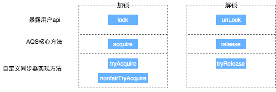
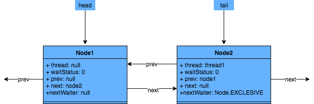

### Java 8 阅读手册

>  java.util.concurrent

### 1. locks

**锁分类**

- 悲观锁：数据库的行锁、表锁、Java关键字synchronized / ReentrantLock
- 乐观锁：MySQL 的MVCC，JUC 原子操作类，Redis的watch/exec

#### 1.1 AbstractQueuedSynchronizer

##### 前言

Java中的大部分同步类（Lock、Semaphore、ReentrantLock等）都是基于AbstractQueuedSynchronizer（简称为AQS）实现的。AQS是一种提供了原子式管理同步状态、阻塞和唤醒线程功能以及队列模型的简单框架。本文会从应用层逐渐深入到原理层，并通过ReentrantLock的基本特性和ReentrantLock与AQS的关联，来深入解读AQS相关独占锁的知识点，同时采取问答的模式来帮助大家理解AQS。由于篇幅原因，本篇文章主要阐述AQS中独占锁的逻辑和Sync Queue，不讲述包含共享锁和Condition Queue的部分（本篇文章核心为AQS原理剖析，只是简单介绍了ReentrantLock，感兴趣同学可以阅读一下ReentrantLock的源码）。

下面列出本篇文章的大纲和思路，以便于大家更好地理解：

 

##### ReentrantLock

> **ReentrantLock 特性**

ReentrantLock意思为可重入锁，指的是一个线程能够对一个临界资源重复加锁。为了帮助大家更好地理解ReentrantLock的特性，我们先将ReentrantLock跟常用的Synchronized进行比较，其特性如下（蓝色部分为本篇文章主要剖析的点）：

 

下面通过伪代码，进行更加直观的比较：

```java
// **************************Synchronized的使用方式**************************
// 1.用于代码块
synchronized (this) {}
// 2.用于对象
synchronized (object) {}
// 3.用于方法
public synchronized void test () {}
// 4.可重入
for (int i = 0; i < 100; i++) {
	synchronized (this) {}
}
// **************************ReentrantLock的使用方式**************************
public void test () throw Exception {
	// 1.初始化选择公平锁、非公平锁
	ReentrantLock lock = new ReentrantLock(true);
	// 2.可用于代码块
	lock.lock();
	try {
		try {
			// 3.支持多种加锁方式，比较灵活; 具有可重入特性
			if(lock.tryLock(100, TimeUnit.MILLISECONDS)){ }
		} finally {
			// 4.手动释放锁
			lock.unlock()
		}
	} finally {
		lock.unlock();
	}
}
```

> ReentrantLock与AQS的关联

通过上文我们已经了解，ReentrantLock支持公平锁和非公平锁（关于公平锁和非公平锁的原理分析，可参考《[不可不说的Java“锁”事](https://mp.weixin.qq.com/s?__biz=MjM5NjQ5MTI5OA==&mid=2651749434&idx=3&sn=5ffa63ad47fe166f2f1a9f604ed10091&chksm=bd12a5778a652c61509d9e718ab086ff27ad8768586ea9b38c3dcf9e017a8e49bcae3df9bcc8&scene=38#wechat_redirect)》），并且ReentrantLock的底层就是由AQS来实现的。那么ReentrantLock是如何通过公平锁和非公平锁与AQS关联起来呢？ 我们着重从这两者的加锁过程来理解一下它们与AQS之间的关系（加锁过程中与AQS的关联比较明显，解锁流程后续会介绍）。

非公平锁源码中的加锁流程如下：

```java
// java.util.concurrent.locks.ReentrantLock#NonfairSync

// 非公平锁
static final class NonfairSync extends Sync {
	...
	final void lock() {
		if (compareAndSetState(0, 1))
			setExclusiveOwnerThread(Thread.currentThread());
		else
			acquire(1);
		}
  ...
}
```

这块代码的含义为：

- 若通过CAS设置变量State（同步状态）成功，也就是获取锁成功，则将当前线程设置为独占线程。
- 若通过CAS设置变量State（同步状态）失败，也就是获取锁失败，则进入Acquire方法进行后续处理。

第一步很好理解，但第二步获取锁失败后，后续的处理策略是怎么样的呢？这块可能会有以下思考：

某个线程获取锁失败的后续流程是什么呢？有以下两种可能：

1. 将当前线程获锁结果设置为失败，获取锁流程结束。这种设计会极大降低系统的并发度，并不满足我们实际的需求。所以就需要下面这种流程，也就是AQS框架的处理流程。
2.  存在某种排队等候机制，线程继续等待，仍然保留获取锁的可能，获取锁流程仍在继续。

再看下公平锁源码中获锁的方式：

```java
// java.util.concurrent.locks.ReentrantLock#FairSync

static final class FairSync extends Sync {
  ...  
	final void lock() {
		acquire(1);
	}
  ...
}
```

看到这块代码，我们可能会存在这种疑问：Lock函数通过Acquire方法进行加锁，但是具体是如何加锁的呢？

结合公平锁和非公平锁的加锁流程，虽然流程上有一定的不同，但是都调用了Acquire方法，而Acquire方法是FairSync和UnfairSync的父类AQS中的核心方法。

对于上边提到的问题，其实在ReentrantLock类源码中都无法解答，而这些问题的答案，都是位于Acquire方法所在的类AbstractQueuedSynchronizer中，也就是本文的核心——AQS。下面我们会对AQS以及ReentrantLock和AQS的关联做详细介绍（相关问题答案会在2.3.5小节中解答）。

##### AQS

首先，我们通过下面的架构图来整体了解一下AQS框架：


- 上图中有颜色的为Method，无颜色的为Attribution。
- 总的来说，AQS框架共分为五层，自上而下由浅入深，从AQS对外暴露的API到底层基础数据。

下面我们会从整体到细节，从流程到方法逐一剖析AQS框架，主要分析过程如下：


> 原理概览

AQS核心思想是，如果被请求的共享资源空闲，那么就将当前请求资源的线程设置为有效的工作线程，将共享资源设置为锁定状态；如果共享资源被占用，就需要一定的阻塞等待唤醒机制来保证锁分配。这个机制主要用的是CLH队列的变体实现的，将暂时获取不到锁的线程加入到队列中。

CLH：Craig、Landin and Hagersten队列，是单向链表，AQS中的队列是CLH变体的虚拟双向队列（FIFO），AQS是通过将每条请求共享资源的线程封装成一个节点来实现锁的分配。

主要原理图如下：

 

AQS使用一个Volatile的int类型的成员变量来表示同步状态，通过内置的FIFO队列来完成资源获取的排队工作，通过CAS完成对State值的修改。

> AQS 数据结构

先来看下AQS中最基本的数据结构——Node，Node即为上面CLH变体队列中的节点。

 

解释一下几个方法和属性值的含义：

| 方法和属性值 | 含义                                                         |
| :----------- | :----------------------------------------------------------- |
| waitStatus   | 当前节点在队列中的状态                                       |
| thread       | 表示处于该节点的线程                                         |
| prev         | 前驱指针                                                     |
| predecessor  | 返回前驱节点，没有的话抛出npe                                |
| nextWaiter   | 指向下一个处于CONDITION状态的节点（由于本篇文章不讲述Condition Queue队列，这个指针不多介绍） |
| next         | 后继指针                                                     |

线程两种锁的模式：

| 模式      | 含义                           |
| :-------- | :----------------------------- |
| SHARED    | 表示线程以共享的模式等待锁     |
| EXCLUSIVE | 表示线程正在以独占的方式等待锁 |

waitStatus有下面几个枚举值：

| 枚举      | 含义                                           |
| :-------- | :--------------------------------------------- |
| 0         | 当一个Node被初始化的时候的默认值               |
| CANCELLED | 为1，表示线程获取锁的请求已经取消了            |
| CONDITION | 为-2，表示节点在等待队列中，节点线程等待唤醒   |
| PROPAGATE | 为-3，当前线程处在SHARED情况下，该字段才会使用 |
| SIGNAL    | 为-1，表示线程已经准备好了，就等资源释放了     |

> **同步状态State** 

在了解数据结构后，接下来了解一下AQS的同步状态——State。AQS中维护了一个名为state的字段，意为同步状态，是由Volatile修饰的，用于展示当前临界资源的获锁情况。

```java
// java.util.concurrent.locks.AbstractQueuedSynchronizer
private volatile int state;
```

下面提供了几个访问这个字段的方法：

| 方法名                                                       | 描述                 |
| :----------------------------------------------------------- | :------------------- |
| protected final int getState()                               | 获取State的值        |
| protected final void setState(int newState)                  | 设置State的值        |
| protected final boolean compareAndSetState(int expect, int update) | 使用CAS方式更新State |

这几个方法都是Final修饰的，说明子类中无法重写它们。我们可以通过修改State字段表示的同步状态来实现多线程的独占模式和共享模式（加锁过程）。

  

对于我们自定义的同步工具，需要自定义获取同步状态和释放状态的方式，也就是AQS架构图中的第一层：API层。

> AQS重要方法与ReentrantLock的关联

从架构图中可以得知，AQS提供了大量用于自定义同步器实现的Protected方法。自定义同步器实现的相关方法也只是为了通过修改State字段来实现多线程的独占模式或者共享模式。自定义同步器需要实现以下方法（ReentrantLock需要实现的方法如下，并不是全部）：


一般来说，自定义同步器要么是独占方式，要么是共享方式，它们也只需实现tryAcquire-tryRelease、tryAcquireShared-tryReleaseShared中的一种即可。AQS也支持自定义同步器同时实现独占和共享两种方式，如ReentrantReadWriteLock。ReentrantLock是独占锁，所以实现了tryAcquire-tryRelease。

以非公平锁为例，这里主要阐述一下非公平锁与AQS之间方法的关联之处，具体每一处核心方法的作用会在文章后面详细进行阐述。

- ReentrantLock加锁解锁时API层核心方法的映射关系。

 

##### 通过ReentrantLock 理解AOS

ReentrantLock中公平锁和非公平锁在底层是相同的，这里以非公平锁为例进行分析。

在非公平锁中，有一段这样的代码：

```java
// java.util.concurrent.locks.ReentrantLock

static final class NonfairSync extends Sync {
	...
	final void lock() {
		if (compareAndSetState(0, 1))
			setExclusiveOwnerThread(Thread.currentThread());
		else
			acquire(1);
	}
  ...
}
```

看一下这个Acquire是怎么写的：

```java
// java.util.concurrent.locks.AbstractQueuedSynchronizer

public final void acquire(int arg) {
	if (!tryAcquire(arg) && acquireQueued(addWaiter(Node.EXCLUSIVE), arg))
		selfInterrupt();
}
```

再看一下tryAcquire方法：

```java
// java.util.concurrent.locks.AbstractQueuedSynchronizer

protected boolean tryAcquire(int arg) {
	throw new UnsupportedOperationException();
}
```

可以看出，这里只是AQS的简单实现，具体获取锁的实现方法是由各自的公平锁和非公平锁单独实现的（以ReentrantLock为例）。如果该方法返回了True，则说明当前线程获取锁成功，就不用往后执行了；如果获取失败，就需要加入到等待队列中。下面会详细解释线程是何时以及怎样被加入进等待队列中的。

> 线程加入等待队列

- 加入等待队列的时机

  当执行Acquire(1)时，会通过tryAcquire获取锁。在这种情况下，如果获取锁失败，就会调用addWaiter（）加入到等待队列中去。

> 如何加入到等待队列

获取锁失败后，会执行addWaiter(Node.EXCLUSIVE)加入等待队列，具体实现方法如下：

```java
// java.util.concurrent.locks.AbstractQueuedSynchronizer

 private Node addWaiter(Node mode) {
        //初始化节点,设置关联线程和模式(mode:独占 or 共享)
        Node node = new Node(Thread.currentThread(), mode);
        // Try the fast path of enq; backup to full enq on failure
        // 获取尾节点引用
        Node pred = tail;
        // 如果队尾节点不为null，则说明队列中已经有线程在等待了，那么直接入队尾
        if (pred != null) {
            node.prev = pred;
            // CAS 形式自旋 放入尾结点 // 设置新节点为尾节点
            if (compareAndSetTail(pred, node)) {
                pred.next = node;
                return node;
            }
        }
        // 尾节点为空,说明队列还未初始化,需要初始化head节点并入队新节点
        enq(node);
        return node;
    }


  private final boolean compareAndSetTail(Node expect, Node update) {
        return unsafe.compareAndSwapObject(this, tailOffset, expect, update);
    }
```

主要的流程如下：

- 通过当前的线程和锁模式新建一个节点。
- Pred指针指向尾节点Tail。
- 将New中Node的Prev指针指向Pred。
- 通过compareAndSetTail方法，完成尾节点的设置。这个方法主要是对tailOffset和Expect进行比较，如果tailOffset的Node和Expect的Node地址是相同的，那么设置Tail的值为Update的值。

```java
 static {
        try {
            stateOffset = unsafe.objectFieldOffset(AbstractQueuedSynchronizer.class.getDeclaredField("state"));
            headOffset = unsafe.objectFieldOffset(AbstractQueuedSynchronizer.class.getDeclaredField("head"));
            tailOffset = unsafe.objectFieldOffset(AbstractQueuedSynchronizer.class.getDeclaredField("tail"));
            waitStatusOffset = unsafe.objectFieldOffset(Node.class.getDeclaredField("waitStatus"));
            nextOffset = unsafe.objectFieldOffset(Node.class.getDeclaredField("next"));
        } catch (Exception ex) { throw new Error(ex); }
    }
```

从AQS的静态代码块可以看出，都是获取一个对象的属性相对于该对象在内存当中的偏移量，这样我们就可以根据这个偏移量在对象内存当中找到这个属性。tailOffset指的是tail对应的偏移量，所以这个时候会将new出来的Node置为当前队列的尾节点。同时，由于是双向链表，也需要将前一个节点指向尾节点。

> 如果Pred指针是Null（说明等待队列中没有元素），或者当前Pred指针和Tail指向的位置不同（说明被别的线程已经修改），就需要看一下Enq的方法。

```java
// java.util.concurrent.locks.AbstractQueuedSynchronizer

 private Node enq(final Node node) {
        for (;;) {
            Node t = tail;
            if (t == null) { // Must initialize
                if (compareAndSetHead(new Node()))
                    tail = head;
            } else {
                node.prev = t;
                if (compareAndSetTail(t, node)) {
                    t.next = node;
                    return t;
                }
            }
        }
    }
```

如果没有被初始化，需要进行初始化一个头结点出来。但请注意，初始化的头结点并不是当前线程节点，而是调用了无参构造函数的节点。如果经历了初始化或者并发导致队列中有元素，则与之前的方法相同。其实，addWaiter就是一个在双端链表添加尾节点的操作，需要注意的是，双端链表的头结点是一个无参构造函数的头结点。

总结一下，线程获取锁的时候，过程大体如下：

1. 当没有线程获取到锁时，线程1获取锁成功。
2. 线程2申请锁，但是锁被线程1占有。

 

(1) 如果再有线程要获取锁，依次在队列中往后排队即可

回到上边的代码，hasQueuedPredecessors是公平锁加锁时判断等待队列中是否存在有效节点的方法。如果返回False，说明当前线程可以争取共享资源；如果返回True，说明队列中存在有效节点，当前线程必须加入到等待队列中,（前驱节点）

```java
// java.util.concurrent.locks.ReentrantLock

public final boolean hasQueuedPredecessors() {
	// The correctness of this depends on head being initialized
	// before tail and on head.next being accurate if the current
	// thread is first in queue.
	Node t = tail; // Read fields in reverse initialization order
	Node h = head;
	Node s;
	return h != t && ((s = h.next) == null || s.thread != Thread.currentThread());
}
```

看到这里，我们理解一下h != t && ((s = h.next) == null || s.thread != Thread.currentThread());为什么要判断的头结点的下一个节点？第一个节点储存的数据是什么？

> 双向链表中，第一个节点为虚节点，其实并不存储任何信息，只是占位。真正的第一个有数据的节点，是在第二个节点开始的。
>
> 1. 当h != t时： 如果(s = h.next) == null，等待队列正在有线程进行初始化，但只是进行到了Tail指向Head，没有将Head指向Tail，此时队列中有元素，需要返回True（这块具体见下边代码分析）。
> 2.  如果(s = h.next) != null，说明此时队列中至少有一个有效节点。
>
> - 如果此时s.thread == Thread.currentThread()，说明等待队列的第一个有效节点中的线程与当前线程相同那么当前线程是可以获取资源的；
> - 如果s.thread != Thread.currentThread()，说明等待队列的第一个有效节点线程与当前线程不同，当前线程必须加入进等待队列

```java
// java.util.concurrent.locks.AbstractQueuedSynchronizer#enq

if (t == null) { // Must initialize
	if (compareAndSetHead(new Node()))
		tail = head;
} else {
	node.prev = t;
	if (compareAndSetTail(t, node)) {
		t.next = node;
		return t;
	}
}
```

节点入队不是原子操作，所以会出现短暂的head != tail，此时Tail指向最后一个节点，而且Tail指向Head。如果Head没有指向Tail（可见5、6、7行），这种情况下也需要将相关线程加入队列中。所以这块代码是为了解决极端情况下的并发问题。

> 等待队列中线程出队列的时机

回到最初的源码：

```java
// java.util.concurrent.locks.AbstractQueuedSynchronizer

public final void acquire(int arg) {
	if (!tryAcquire(arg) && acquireQueued(addWaiter(Node.EXCLUSIVE), arg))
		selfInterrupt();
}
```

上文解释了addWaiter方法，这个方法其实就是把对应的线程以Node的数据结构形式加入到双端队列里，返回的是一个包含该线程的Node。而这个Node会作为参数，进入到acquireQueued方法中。acquireQueued方法可以对排队中的线程进行“获锁”操作。

总的来说，一个线程获取锁失败了，被放入等待队列，acquireQueued会把放入队列中的线程不断去获取锁，直到获取成功或者不再需要获取（中断）。

下面我们从“何时出队列？”和“如何出队列？”两个方向来分析一下acquireQueued源码：

```java
// java.util.concurrent.locks.AbstractQueuedSynchronizer

final boolean acquireQueued(final Node node, int arg) {
	// 标记是否成功拿到资源
	boolean failed = true;
	try {
		// 标记等待过程中是否中断过
		boolean interrupted = false;
		// 开始自旋，要么获取锁，要么中断
		for (;;) {
			// 获取当前节点的前驱节点
			final Node p = node.predecessor();
			// 如果p是头结点，说明当前节点在真实数据队列的首部，就尝试获取锁（别忘了头结点是虚节点）
			if (p == head && tryAcquire(arg)) {
				// 获取锁成功，头指针移动到当前node
				setHead(node);
				p.next = null; // help GC
				failed = false;
				return interrupted;
			}
			// 说明p为头节点且当前没有获取到锁（可能是非公平锁被抢占了）或者是p不为头结点，
            // 这个时候就要判断当前node是否要被阻塞（被阻塞条件：前驱节点的waitStatus为-1），
            // 防止无限循环浪费资源。具体两个方法下面细细分析
			if (shouldParkAfterFailedAcquire(p, node) && parkAndCheckInterrupt())
				interrupted = true;
		}
	} finally {
		if (failed)
			cancelAcquire(node);
	}
}
```

注：setHead方法是把当前节点置为虚节点，但并没有修改waitStatus，因为它是一直需要用的数据。

```java
// java.util.concurrent.locks.AbstractQueuedSynchronizer

private void setHead(Node node) {
	head = node;
	node.thread = null;
	node.prev = null;
}

// java.util.concurrent.locks.AbstractQueuedSynchronizer

// 靠前驱节点判断当前线程是否应该被阻塞
private static boolean shouldParkAfterFailedAcquire(Node pred, Node node) {
	// 获取头结点的节点状态
	int ws = pred.waitStatus;
	// 说明头结点处于唤醒状态
	if (ws == Node.SIGNAL)
		return true; 
	// 通过枚举值我们知道waitStatus>0是取消状态
	if (ws > 0) {
		do {
			// 循环向前查找取消节点，把取消节点从队列中剔除
			node.prev = pred = pred.prev;
		} while (pred.waitStatus > 0);
		pred.next = node;
	} else {
		// 设置前任节点等待状态为SIGNAL
		compareAndSetWaitStatus(pred, ws, Node.SIGNAL);
	}
	return false;
}
```

parkAndCheckInterrupt主要用于挂起当前线程，阻塞调用栈，返回当前线程的中断状态。

```java
// java.util.concurrent.locks.AbstractQueuedSynchronizer

private final boolean parkAndCheckInterrupt() {
    LockSupport.park(this);
    return Thread.interrupted();
}
```

上述方法的流程图如下：

 

从上图可以看出，跳出当前循环的条件是当“前置节点是头结点，且当前线程获取锁成功”。为了防止因死循环导致CPU资源被浪费，我们会判断前置节点的状态来决定是否要将当前线程挂起，具体挂起流程用流程图表示如下（shouldParkAfterFailedAcquire流程）：

 

从队列中释放节点的疑虑打消了，那么又有新问题了：

- shouldParkAfterFailedAcquire中取消节点是怎么生成的呢？什么时候会把一个节点的waitStatus设置为-1？
- 是在什么时间释放节点通知到被挂起的线程呢？

> CANCELLED 状态节点生成

acquireQueued方法中的Finally代码：

```java
// java.util.concurrent.locks.AbstractQueuedSynchronizer

final boolean acquireQueued(final Node node, int arg) {
	boolean failed = true;
	try {
    ...
		for (;;) {
			final Node p = node.predecessor();
			if (p == head && tryAcquire(arg)) {
				...
				failed = false;
        ...
			}
			...
	} finally {
		if (failed)
			cancelAcquire(node);
		}
}
```

通过cancelAcquire方法，将Node的状态标记为CANCELLED。接下来，我们逐行来分析这个方法的原理：

```java
// java.util.concurrent.locks.AbstractQueuedSynchronizer

private void cancelAcquire(Node node) {
  // 将无效节点过滤
	if (node == null)
		return;
  // 设置该节点不关联任何线程，也就是虚节点
	node.thread = null;
	Node pred = node.prev;
  // 通过前驱节点，跳过取消状态的node
	while (pred.waitStatus > 0)
		node.prev = pred = pred.prev;
  // 获取过滤后的前驱节点的后继节点
	Node predNext = pred.next;
  // 把当前node的状态设置为CANCELLED
	node.waitStatus = Node.CANCELLED;
  // 如果当前节点是尾节点，将从后往前的第一个非取消状态的节点设置为尾节点
  // 更新失败的话，则进入else，如果更新成功，将tail的后继节点设置为null
	if (node == tail && compareAndSetTail(node, pred)) {
		compareAndSetNext(pred, predNext, null);
	} else {
		int ws;
    // 如果当前节点不是head的后继节点，1:判断当前节点前驱节点的是否为SIGNAL，2:如果不是，则把前驱节点设置为SINGAL看是否成功
    // 如果1和2中有一个为true，再判断当前节点的线程是否为null
    // 如果上述条件都满足，把当前节点的前驱节点的后继指针指向当前节点的后继节点
		if (pred != head && ((ws = pred.waitStatus) == Node.SIGNAL || (ws <= 0 && compareAndSetWaitStatus(pred, ws, Node.SIGNAL))) && pred.thread != null) {
			Node next = node.next;
			if (next != null && next.waitStatus <= 0)
				compareAndSetNext(pred, predNext, next);
		} else {
      // 如果当前节点是head的后继节点，或者上述条件不满足，那就唤醒当前节点的后继节点
			unparkSuccessor(node);
		}
		node.next = node; // help GC
	}
}
```

当前的流程：

- 获取当前节点的前驱节点，如果前驱节点的状态是CANCELLED，那就一直往前遍历，找到第一个waitStatus <= 0的节点，将找到的Pred节点和当前Node关联，将当前Node设置为CANCELLED。
- 根据当前节点的位置，考虑以下三种情况：

(1) 当前节点是尾节点。

(2) 当前节点是Head的后继节点。

(3) 当前节点不是Head的后继节点，也不是尾节点。

根据上述第二条，我们来分析每一种情况的流程。

当前节点是尾节点。

 

当前节点是Head的后继节点。

 

当前节点不是Head的后继节点，也不是尾节点。

 

通过上面的流程，我们对于CANCELLED节点状态的产生和变化已经有了大致的了解，但是为什么所有的变化都是对Next指针进行了操作，而没有对Prev指针进行操作呢？什么情况下会对Prev指针进行操作？

> 执行cancelAcquire的时候，当前节点的前置节点可能已经从队列中出去了（已经执行过Try代码块中的shouldParkAfterFailedAcquire方法了），如果此时修改Prev指针，有可能会导致Prev指向另一个已经移除队列的Node，因此这块变化Prev指针不安全。 shouldParkAfterFailedAcquire方法中，会执行下面的代码，其实就是在处理Prev指针。shouldParkAfterFailedAcquire是获取锁失败的情况下才会执行，进入该方法后，说明共享资源已被获取，当前节点之前的节点都不会出现变化，因此这个时候变更Prev指针比较安全。
>
> ```java
> do {
> 	node.prev = pred = pred.prev;
> } while (pred.waitStatus > 0);
> ```

**如何解锁** 

我们已经剖析了加锁过程中的基本流程，接下来再对解锁的基本流程进行分析。由于ReentrantLock在解锁的时候，并不区分公平锁和非公平锁，所以我们直接看解锁的源码：

```java
// java.util.concurrent.locks.ReentrantLock

public void unlock() {
	sync.release(1);
}
```

可以看到，本质释放锁的地方，是通过框架来完成的。

```java
// java.util.concurrent.locks.AbstractQueuedSynchronizer

public final boolean release(int arg) {
	if (tryRelease(arg)) {
		Node h = head;
		if (h != null && h.waitStatus != 0)
			unparkSuccessor(h);
		return true;
	}
	return false;
}
```

在ReentrantLock里面的公平锁和非公平锁的父类Sync定义了可重入锁的释放锁机制。

```java
// java.util.concurrent.locks.ReentrantLock.Sync

// 方法返回当前锁是不是没有被线程持有
protected final boolean tryRelease(int releases) {
	// 减少可重入次数
	int c = getState() - releases;
	// 当前线程不是持有锁的线程，抛出异常
	if (Thread.currentThread() != getExclusiveOwnerThread())
		throw new IllegalMonitorStateException();
	boolean free = false;
	// 如果持有线程全部释放，将当前独占锁所有线程设置为null，并更新state
	if (c == 0) {
		free = true;
		setExclusiveOwnerThread(null);
	}
	setState(c);
	return free;
}
```

我们来解释下述源码：

```java
// java.util.concurrent.locks.AbstractQueuedSynchronizer

public final boolean release(int arg) {
	// 上边自定义的tryRelease如果返回true，说明该锁没有被任何线程持有
	if (tryRelease(arg)) {
		// 获取头结点
		Node h = head;
		// 头结点不为空并且头结点的waitStatus不是初始化节点情况，解除线程挂起状态
		if (h != null && h.waitStatus != 0)
			unparkSuccessor(h);
		return true;
	}
	return false;
}
```

这里的判断条件为什么是h != null && h.waitStatus != 0？

- h == null Head还没初始化。初始情况下，head == null，第一个节点入队，Head会被初始化一个虚拟节点。所以说，这里如果还没来得及入队，就会出现head == null 的情况。

- h != null && waitStatus == 0 表明后继节点对应的线程仍在运行中，不需要唤醒。

- h != null && waitStatus < 0 表明后继节点可能被阻塞了，需要唤醒

再看一下unparkSuccessor方法：

```java
// java.util.concurrent.locks.AbstractQueuedSynchronizer

private void unparkSuccessor(Node node) {
	// 获取头结点waitStatus
	int ws = node.waitStatus;
	if (ws < 0)
		compareAndSetWaitStatus(node, ws, 0);
	// 获取当前节点的下一个节点
	Node s = node.next;
	// 如果下个节点是null或者下个节点被cancelled，就找到队列最开始的非cancelled的节点
	if (s == null || s.waitStatus > 0) {
		s = null;
		// 就从尾部节点开始找，到队首，找到队列第一个waitStatus<0的节点。
		for (Node t = tail; t != null && t != node; t = t.prev)
			if (t.waitStatus <= 0)
				s = t;
	}
	// 如果当前节点的下个节点不为空，而且状态<=0，就把当前节点unpark
	if (s != null)
		LockSupport.unpark(s.thread);
}
```

为什么要从后往前找第一个非Cancelled的节点呢？原因如下。

之前的addWaiter方法：

```java
// java.util.concurrent.locks.AbstractQueuedSynchronizer

private Node addWaiter(Node mode) {
	Node node = new Node(Thread.currentThread(), mode);
	// Try the fast path of enq; backup to full enq on failure
	Node pred = tail;
	if (pred != null) {
		node.prev = pred;
		if (compareAndSetTail(pred, node)) {
			pred.next = node;
			return node;
		}
	}
	enq(node);
	return node;
}
```

我们从这里可以看到，节点入队并不是原子操作，也就是说，node.prev = pred; compareAndSetTail(pred, node) 这两个地方可以看作Tail入队的原子操作，但是此时pred.next = node;还没执行，如果这个时候执行了unparkSuccessor方法，就没办法从前往后找了，所以需要从后往前找。还有一点原因，在产生CANCELLED状态节点的时候，先断开的是Next指针，Prev指针并未断开，因此也是必须要从后往前遍历才能够遍历完全部的Node。

综上所述，如果是从前往后找，由于极端情况下入队的非原子操作和CANCELLED节点产生过程中断开Next指针的操作，可能会导致无法遍历所有的节点。所以，唤醒对应的线程后，对应的线程就会继续往下执行。继续执行acquireQueued方法以后，中断如何处理？

> 中断恢复后的执行流程

唤醒后，会执行return Thread.interrupted();，这个函数返回的是当前执行线程的中断状态，并清除。

```java
// java.util.concurrent.locks.AbstractQueuedSynchronizer

private final boolean parkAndCheckInterrupt() {
	LockSupport.park(this);
	return Thread.interrupted();
}
```

再回到acquireQueued代码，当parkAndCheckInterrupt返回True或者False的时候，interrupted的值不同，但都会执行下次循环。如果这个时候获取锁成功，就会把当前interrupted返回。

```java
// java.util.concurrent.locks.AbstractQueuedSynchronizer

final boolean acquireQueued(final Node node, int arg) {
	boolean failed = true;
	try {
		boolean interrupted = false;
		for (;;) {
			final Node p = node.predecessor();
			if (p == head && tryAcquire(arg)) {
				setHead(node);
				p.next = null; // help GC
				failed = false;
				return interrupted;
			}
			if (shouldParkAfterFailedAcquire(p, node) && parkAndCheckInterrupt())
				interrupted = true;
			}
	} finally {
		if (failed)
			cancelAcquire(node);
	}
}
```

如果acquireQueued为True，就会执行selfInterrupt方法。

```java
// java.util.concurrent.locks.AbstractQueuedSynchronizer

static void selfInterrupt() {
	Thread.currentThread().interrupt();
}
```

该方法其实是为了中断线程。但为什么获取了锁以后还要中断线程呢？这部分属于Java提供的协作式中断知识内容，感兴趣同学可以查阅一下。这里简单介绍一下：

1. 当中断线程被唤醒时，并不知道被唤醒的原因，可能是当前线程在等待中被中断，也可能是释放了锁以后被唤醒。因此我们通过Thread.interrupted()方法检查中断标记（该方法返回了当前线程的中断状态，并将当前线程的中断标识设置为False），并记录下来，如果发现该线程被中断过，就再中断一次。
2. 线程在等待资源的过程中被唤醒，唤醒后还是会不断地去尝试获取锁，直到抢到锁为止。也就是说，在整个流程中，并不响应中断，只是记录中断记录。最后抢到锁返回了，那么如果被中断过的话，就需要补充一次中断。

这里的处理方式主要是运用线程池中基本运作单元Worder中的runWorker，通过Thread.interrupted()进行额外的判断处理，感兴趣的同学可以看下ThreadPoolExecutor源码。

##### **小结** 

Q：某个线程获取锁失败的后续流程是什么呢？

A：存在某种排队等候机制，线程继续等待，仍然保留获取锁的可能，获取锁流程仍在继续。

Q：既然说到了排队等候机制，那么就一定会有某种队列形成，这样的队列是什么数据结构呢？

A：是CLH变体的FIFO双端队列。

Q：处于排队等候机制中的线程，什么时候可以有机会获取锁呢？

A：` acquire(1)` 方法

Q：如果处于排队等候机制中的线程一直无法获取锁，需要一直等待么？还是有别的策略来解决这一问题？

A：线程所在节点的状态会变成取消状态，取消状态的节点会从队列中释放，具体可见2.3.2小节。

Q：Lock函数通过Acquire方法进行加锁，但是具体是如何加锁的呢？

A：AQS的Acquire会调用tryAcquire方法，tryAcquire由各个自定义同步器实现，通过tryAcquire完成加锁过程。

#####  AQS 实际应用

**ReentrantLock 的可重入应用** 

ReentrantLock的可重入性是AQS很好的应用之一，在了解完上述知识点以后，我们很容易得知ReentrantLock实现可重入的方法。在ReentrantLock里面，不管是公平锁还是非公平锁，都有一段逻辑。

公平锁：

```java
// java.util.concurrent.locks.ReentrantLock.FairSync#tryAcquire

if (c == 0) {
	if (!hasQueuedPredecessors() && compareAndSetState(0, acquires)) {
		setExclusiveOwnerThread(current);
		return true;
	}
}
else if (current == getExclusiveOwnerThread()) {
	int nextc = c + acquires;
	if (nextc < 0)
		throw new Error("Maximum lock count exceeded");
	setState(nextc);
	return true;
}
```

非公平锁：

```java
// java.util.concurrent.locks.ReentrantLock.Sync#nonfairTryAcquire

if (c == 0) {
	if (compareAndSetState(0, acquires)){
		setExclusiveOwnerThread(current);
		return true;
	}
}
else if (current == getExclusiveOwnerThread()) {
	int nextc = c + acquires;
	if (nextc < 0) // overflow
		throw new Error("Maximum lock count exceeded");
	setState(nextc);
	return true;
}
```

从上面这两段都可以看到，有一个同步状态State来控制整体可重入的情况。State是Volatile修饰的，用于保证一定的可见性和有序性。

```java
// java.util.concurrent.locks.AbstractQueuedSynchronizer

private volatile int state;
```

接下来看State这个字段主要的过程：

1. State初始化的时候为0，表示没有任何线程持有锁。
2. 当有线程持有该锁时，值就会在原来的基础上+1，同一个线程多次获得锁是，就会多次+1，这里就是可重入的概念。
3. 解锁也是对这个字段-1，一直到0，此线程对锁释放。

> JUC 中的应用场景

除了上边ReentrantLock的可重入性的应用，AQS作为并发编程的框架，为很多其他同步工具提供了良好的解决方案。下面列出了JUC中的几种同步工具，大体介绍一下AQS的应用场景：

| 同步工具               | 同步工具与AQS的关联                                          |
| :--------------------- | :----------------------------------------------------------- |
| ReentrantLock          | 使用AQS保存锁重复持有的次数。当一个线程获取锁时，ReentrantLock记录当前获得锁的线程标识，用于检测是否重复获取，以及错误线程试图解锁操作时异常情况的处理。 |
| Semaphore              | 使用AQS同步状态来保存信号量的当前计数。tryRelease会增加计数，acquireShared会减少计数。 |
| CountDownLatch         | 使用AQS同步状态来表示计数。计数为0时，所有的Acquire操作（CountDownLatch的await方法）才可以通过。 |
| ReentrantReadWriteLock | 使用AQS同步状态中的16位保存写锁持有的次数，剩下的16位用于保存读锁的持有次数。 |
| ThreadPoolExecutor     | Worker利用AQS同步状态实现对独占线程变量的设置（tryAcquire和tryRelease）。 |

> 自定义同步工具

了解AQS基本原理以后，按照上面所说的AQS知识点，自己实现一个同步工具。

```java
public class LeeLock {
    private Sync sync = new Sync();
    public void lock() { sync.acquire(1); }
    public void unlock() { sync.release(1); }
    private static class Sync extends AbstractQueuedSynchronizer {
        @Override
        protected boolean tryAcquire(int arg) {
            return compareAndSetState(0, 1);
        }
        @Override
        protected boolean tryRelease(int arg) {
            setState(0);
            return true;
        }
        @Override
        protected boolean isHeldExclusively() { return getState() == 1; }
    }
}
```

通过我们自己定义的Lock完成一定的同步功能。

```java
public class LeeMain {

    static int count = 0;
    static LeeLock leeLock = new LeeLock();

    public static void main (String[] args) throws InterruptedException {

        Runnable runnable = new Runnable() {
            @Override
            public void run () {
                try {
                    leeLock.lock();
                    for (int i = 0; i < 10000; i++) {
                        count++;
                    }
                } catch (Exception e) {
                    e.printStackTrace();
                } finally {
                    leeLock.unlock();
                }

            }
        };
        Thread thread1 = new Thread(runnable);
        Thread thread2 = new Thread(runnable);
        thread1.start();
        thread2.start();
        thread1.join();
        thread2.join();
        System.out.println(count);
    }
}
```

上述代码每次运行结果都会是20000。通过简单的几行代码就能实现同步功能，这就是AQS的强大之处。

**相关文章**

1. [从ReentrantLock的实现看AQS的原理及应用](https://tech.meituan.com/2019/12/05/aqs-theory-and-apply.html) —美团技术团队

#### 1.2 ReentrantLock

##### 前言

Java中的大部分同步类（Lock、Semaphore、ReentrantLock等）都是基于AbstractQueuedSynchronizer（简称为AQS）实现的。在Java5.0之前，在协调对共享对象的访问时可以使用的机制只有synchronized和volatile。Java5.0增加了一种新的机制：ReentrantLock。ReentrantLock并不是一种替代内置加锁的方法，而是作为一种可选择的高级功能。ReentrantLock实现了Lock接口，提供了一种无条件的、可轮询的、定时的以及可中断的锁获取操作，所有加锁和解锁方法都是显式的。

我们基本不会直接使用AQS，AQS是一个构建锁和同步器的框架，许多同步器都可以通过AQS很容易高效的构造出来，基本能够满足绝大多数情况的需求。不仅ReentrantLock，Semaphore、CountDownLatch、ReentrantReadWriteLock、FutureTask也是基于AQS构建的。AQS解决了实现同步器的大量细节，等待线程采用FIFO队列操作顺序；还负责管理同步器类中的状态 ，可以通过getState,setState以及compareAndSetState方法来操作。

##### 文档导读

- ReentrantLock继承树及重要方法
- 非公平锁及公平锁的获取
- tryLock()，lockInterruptibly()
- 释放资源
- ReentrantLock相关面试题
- 总结

##### Reentrantlock 使用实例

```java
public class ReentrantLock01 {
    // ReentrantLock
    public static ReentrantLock reentrantLock = new ReentrantLock();
    public static int count = 0;

    public static void main(String[] args) {
        ReentrantLock01 lock = new ReentrantLock01();
        lock.run();
        System.out.println("计算结果 = " + count);
    }
    public void run() {
        // 加锁
        reentrantLock.lock();
        try {
            for (int i = 0; i < 1000; i++) {
                count++;
            }
        } finally {
            reentrantLock.unlock();
        }
    }
}
```

以上代码通过lock来实现 count++的原子操作

-  reentrantLock.lock() 用来获取锁
-  reentrantLock.unlock()用来释放锁。

更多使用场景：[访问入口](https://blog.csdn.net/black_bird_cn/article/details/81913671) 

那么多线程下，如何保证同步操作？如何释放锁？如何判断没有竞争到锁的线程处于等待状态？什么时候唤醒等待线程？

##### ReentrantLock继承关系概述

（1）**继承关系概述** 

首先看一下继承关系图，对它整体的构造有一个初步的认识。

  

我们发现，ReenTrantLock实现了公平锁和非公平锁，都通过它们的父类 Sync 调度

- **Sync**：是提供AQS实现的工具，类似于适配器，提供了抽象的lock()，便于快速创建非公平锁。
- **FairSync**(公平锁)：线程获取锁的顺序和调用lock()的顺序一样，FIFO。
- **NoFairSync**(非公平锁)：线程获取锁的顺序和调用lock()的顺序无关，抢到CPU的时间片即可调度。

##### ReentrantLock 重要方法

**（1）构造方法**

- 无参构造方法，默认创建非公平锁
- 有参构造方法，当 fair==true时，创建公平锁。

```java
    //维护了一个Sync，对于锁的操作都交给sync来处理
    private final Sync sync;
    public ReentrantLock() { sync = new NonfairSync();}
    public ReentrantLock(boolean fair) {  sync = fair ? new FairSync() : new NonfairSync(); }
```

**（2）获取锁方法：可以看出请求都是交给 Sync 来调度的**

```java
    //请求锁资源，会阻塞且 不处理中断请求，
    //没有调用unLock()，则会一直被阻塞。
    public void lock() {  sync.lock();}
    
    //线程在请求lock并被阻塞时，如果被interrupt，则此线程会被唤醒并被要求处理, 加锁的同时处理中断请求
    public void lockInterruptibly() throws InterruptedException { sync.acquireInterruptibly(1);}
    
    //尝试获取锁，默认获取的是非公平锁，失败后不会阻塞
    //直接返回true或false
    public boolean tryLock() {  return sync.nonfairTryAcquire(1);}
   
    //重载方法，在规定时间内获取锁，获取不到则返回false
    public boolean tryLock(long timeout, TimeUnit unit) throws InterruptedException {
        return sync.tryAcquireNanos(1, unit.toNanos(timeout));
    }
```

**（3）释放锁方法：** 不管是公平还是非公平锁，都会调用AQS.release(1)，给当前线程持有锁的数量-1。

```java
  // 如果是当前线程持有锁，就将持有锁的数量减一，直到持有锁的数量为零时，释放锁
  public void unlock() { sync.release(1); }
```

##### ReentrantLock 深入理解

我们主要看非公平锁与公平锁获取资源的方法，因为释放资源的逻辑是一样的。

**（1）Sync 获取锁**

sync中定义了获取锁的总入口，具体的调用还是看实现类是什么。

```java
abstract void lock();
```

**（2）公平锁获取资源** 

> 与非公平锁的区别是：不能直接通过CAS修改state，而是直接走AQS的 acquire()方法

lock()：是**阻塞的** ，队列中没有锁资源占用时，才进行获取锁，根据判断状态 state值

- 如果state = 0 表示还未持有锁，则set为1表示获取锁成功，并把当前线程设置为锁的持有者；
- 如果state > 0,并且是当前线程占有，则 state+1，表示重入锁
- 如果获取失败，则尝试 通过AQS.acquire() 获取锁，了解到acquire()中使用了模板模式，调用子类的tryAcquire()尝试获取锁，如果tryAcquire()返回false，则进入等待队列自旋获取，再判断前驱的waitStatus，判断是否需要被阻塞等

```java
   abstract boolean initialTryLock();

   // lock() 获取公平锁资源
   @ReservedStackAccess
   final void lock() { 
        if (!initialTryLock())
            // AQS的 acquire() 方法获取
             acquire(1);
      }
    // 公平锁 如果当前有线程在占用 则直接CAS获取或者 设置可重入
    final boolean initialTryLock() {
            Thread current = Thread.currentThread();
            // state = 0 表示当没有锁占用
            int c = getState(); 
            if (c == 0) {
                if (!hasQueuedThreads() && compareAndSetState(0, 1)) {
                    setExclusiveOwnerThread(current);
                    return true;
                }
                // 实现可重入
            } else if (getExclusiveOwnerThread() == current) {
                if (++c < 0) // overflow
                    throw new Error("Maximum lock count exceeded");
                setState(c);
                return true;
            }
            return false;
        }
```

acquire()——>tryAcquire() : 首次等待或者没有线程占用时才会获取到锁

> tryAquire()：与非公平锁类似，AQS.acquire()会调用这个钩子方法。只不过多判断了hasQueuedPredecessors()

- **hasQueuedPredecessors()**：判断当前节点在等待队列中是否有前驱节点，
  - 如果有，则说明有线程比当前线程更早的请求资源，根据公平性，当前线程请求资源失败；
  - 如果当前节点没有前驱节点，才有做后面的逻辑判断的必要性。

```java
 public final void acquire(int arg) {
        if (!tryAcquire(arg))
            acquire(null, arg, false, false, false, 0L);
    }

 protected final boolean tryAcquire(int acquires) {
       //判断等待队列中是否有前驱节点，没有则尝试获取锁
       //hasQueuedPredecessors()返回false，表示没有前驱节点，当前线程就是头节点
        if (getState() == 0 && !hasQueuedPredecessors() &&
                compareAndSetState(0, acquires)) {
                setExclusiveOwnerThread(Thread.currentThread());
                return true;
          }
        return false;
     }
```

**（3）非公平锁获取资源** 

对应公平锁：非公平锁会首先使用CAS 尝试设置状态值，抢占锁

```java
    // jdk 14 部分 已经优化了jdk8 
    final boolean initialTryLock() {
            Thread current = Thread.currentThread();
            // 首先尝试使用CAS 尝试获取锁
            if (compareAndSetState(0, 1)) { // first attempt is unguarded
                setExclusiveOwnerThread(current);
                return true;
                // 设置可重入
            } else if (getExclusiveOwnerThread() == current) {
                int c = getState() + 1;
                if (c < 0) // overflow
                    throw new Error("Maximum lock count exceeded");
                setState(c);
                return true;
            } else
                return false;
        }
```

tryAcquire()：走的是Sync.nofairTryAcquire()。

```java
  // jdk8中非公平锁 
  final void lock() {
       if (compareAndSetState(0, 1))
             setExclusiveOwnerThread(Thread.currentThread());
          else
             acquire(1);
       } 

  protected final boolean tryAcquire(int acquires) {
            return nonfairTryAcquire(acquires);
    }
```

nonfairTryAcquire(int acquires)：如果锁空闲，则用CAS修改state；如果锁被占用，则判断占有者是不是自己，实现可重入。最终没有获取锁到就返回false。

```java
  final boolean nonfairTryAcquire(int acquires) {
            // 获取当前线程
            final Thread current = Thread.currentThread();
            // 获取state的变量值
            int c = getState();
            if (c == 0) { //没有线程占用锁
                if (compareAndSetState(0, acquires)) {
                    //占用锁成功,设置独占线程为当前线程
                    setExclusiveOwnerThread(current);
                    return true;
                }
            }
            else if (current == getExclusiveOwnerThread()) { //当前线程已经占用该锁
                int nextc = c + acquires;
                if (nextc < 0) // overflow
                    throw new Error("Maximum lock count exceeded");
                // 更新state值为新的重入次数
                setState(nextc);
                return true;
            }
            return false;
        }
```

##### 其他获取锁的方法

ReentrantLock有3中获取锁的方法，lock()，tryLock()，lockInterruptibly()。

（1） **tryLock()--尝试获取资源** 

tryLock()：走的还是sync的方法，在指定时间内获取锁，直接返回结果。

```java
  public boolean tryLock(long timeout, TimeUnit unit)
            throws InterruptedException {
        return sync.tryAcquireNanos(1, unit.toNanos(timeout));
    }
```

tryAcquireNanos()：如果调用tryLock的规定时间内尝试方法，就会调用该方法，先判断是否中断，然后尝试获取资源，否则进入AQS.doAcquireNanos()（这个方法在上篇文章有解释）。在规定时间内自旋拿资源，拿不到则挂起再判断是否被中断。

```java
  public final boolean tryAcquireNanos(int arg, long nanosTimeout)
        throws InterruptedException {
        if (!Thread.interrupted()) {
            if (tryAcquire(arg))
                return true;
            if (nanosTimeout <= 0L)
                return false;
            int stat = acquire(null, arg, false, true, true,
                               System.nanoTime() + nanosTimeout);
            if (stat > 0)
                return true;
            if (stat == 0)
                return false;
        }
        throw new InterruptedException();
    }
```

（2） **lockInterruptibly()--获取锁时响应中断** 

lockInterruptibly()：交给了调度者sync执行。

```java
   public void lockInterruptibly() throws InterruptedException {
        sync.lockInterruptibly();
    }
```

lockInterruptibly()：当尝试获取锁失败后，就进行**阻塞可中断**的获取锁的过程。调用AQS.doAcquireInterruptibly()

```java
     final void lockInterruptibly() throws InterruptedException {
            if (Thread.interrupted())
                throw new InterruptedException();
            if (!initialTryLock())
                acquireInterruptibly(1);
      }
```

（4）释放锁

公平锁与非公平锁的释放都是一样的。通过前面的阅读，可以知道，ReentrantLock.release()调用的是sync.release(1)。本质还是进入AQS.release(1)，下面看看其中的tryRelease()这个钩子方法如何实现。

**Sync释放资源** tryRelease()：尝试释放锁，彻底释放后返回true。

```java
        public final boolean release(int arg) {
            // sysc 释放锁
            if (tryRelease(arg)) {
                // 设置后继节点
                signalNext(head);
                return true;
            }
            return false;
        }

        // sync 中释放锁
        // 释放当前线程占用的锁
        protected final boolean tryRelease(int releases) {
            int c = getState() - releases; // 计算释放后state的值
            // 如果不是当前线程占用锁，抛出异常
            if (Thread.currentThread() != getExclusiveOwnerThread())
                throw new IllegalMonitorStateException();
            boolean free = false;
            if (c == 0) {
                // 锁被重入次数为0，表示释放锁成功
                free = true;
                // 清空独占线程
                setExclusiveOwnerThread(null);
            }
            // 跟新state值
            setState(c);
            return free;
        }

```

##### ReentrantLock 相关问题

**（1）ReentrantLock是如何实现可重入的？**

不管是公平锁还是非公平锁，在获取锁时调用的tryAcquire()方法，获取成功后会setExclusiveOwnerThread(current)。将本线程设置为主人，之后每次调用tryAcquire()时，发现当前线程就是主人，直接返回true。

**（2）简述公平锁与非公平锁的区别？**

- 从定义角度：
  获取锁的顺序与请求锁的时间顺序一致就是公平锁，反之则为非公平锁。公平锁每次都是从同步队列中的第一个节点获取到锁，而非公平性锁则不一定，有可能刚释放锁的线程能再次获取到锁。
  公平锁为了保证时间上的绝对顺序，需要频繁的上下文切换，而非公平锁会降低一定的上下文切换，降低性能开销。因此，ReentrantLock默认选择的是非公平锁，则是为了减少一部分上下文切换，保证了系统更大的吞吐量。
- 从源码角度：
  当锁资源已经被占用时，请求每次有请求到达，就在等待队列中排队。此时如果锁资源被释放了，刚好新来一个线程，若是非公平锁则会直接CAS获取锁，成功则返回，不成功则加入到等待队列自旋获取，自旋过程中当前驱是对头，并且tryAcquire成功时则获取成功。
  若是公平锁，则当前线程必须等待，锁必须给等待队列第一个线程，如果第一个线程被阻塞了，唤醒也是需要时间的，醒了才能拿锁。

**（3）AQS中有哪些资源访问模式？区别？**

- 独占模式和共享模式。只有一个线程才能持有这个锁就是独占模式，由Node节点中的nextWait来标识。
- ReentrantLock就是一个独占锁；而WriteAndReadLock的读锁则能由多个线程同时获取，但它的写锁则只能由一个线程持有，因此它使用了两种模式。

**（4）为什么ReentrantLock.lock()方法不能被其他线程中断？**

因为当前线程前面可能还有等待线程，在AQS.acquireQueued()的循环里，线程会再次被阻塞。parkAndCheckInterrupt()返回的是Thread.interrupted()，不仅返回中断状态，还会清除中断状态，保证阻塞线程忽略中断。


**相关文章：**

1. [Java并发包中锁原理剖析](https://blog.csdn.net/qq_41893274/article/details/105554149) 
3. [不可不说的Java“锁”事](https://tech.meituan.com/2018/11/15/java-lock.html) —美团技术团队
4. [ReentrantLock](https://zhuanlan.zhihu.com/p/65727594)  

#### 1.3 synchronized

##### 基本使用

`synchronized`关键字是Java并发编程中线程同步的常用手段之一，其作用有三个:

- **互斥性**：确保线程互斥的访问相同资源，锁自动释放，多个线程操作同个代码块或函数必须排队获得锁；
- **可见性** ：保证共享变量的修改能够及时可见，获得锁的线程操作完毕后会将所数据刷新到共享内存区[1]；
- **有序性**：有效解决重排序问题；

`synchronized`用法有三个:

1. 修饰实例方法
2. 修饰静态方法
3. 修饰代码块

（1）修饰实例方法

`synchronized`关键词作用在方法的前面，用来锁定方法，其实默认锁定的是`this`对象。

```java
public class SynchronizeInstanceMethod implements Runnable {

    public static void main(String[] args) throws InterruptedException {
        SynchronizeInstanceMethod t = new SynchronizeInstanceMethod();
        Thread t1 = new Thread(t);
        Thread t2 = new Thread(t);
        t1.start();
        t2.start();
        t1.join();//主线程等待t1执行完毕
        t2.join();//主线程等待t2执行完毕
        System.out.println(i);
    }

    @Override
    public void run() {
        for (int j = 0; j < 10000; j++) {
            increase();
        }
    }

    //共享资源(临界资源)  volatile 只能保证可见性，不能保证原子性
    static int i = 0;

    //如果没有synchronized关键字，输出小于20000
    public synchronized void increase() {
        i++;
    }

//    public /*synchronized*/ void increase() {
//        i++;
//    }
}
```

（2）修饰静态方法

`synchronized`还是修饰在方法上，不过修饰的是静态方法，等价于锁定的是`Class`对象，

```java
public class SynchronizeStaticMethod {
    //共享资源(临界资源)
    static int i = 0;

    //如果没有synchronized关键字，输出小于20000
    public static synchronized void increase() {
        i++;
    }

    public static void main(String[] args) throws InterruptedException {
        Thread t1 = new Thread(new Runnable() {
            public void run() {
                for (int j = 0; j < 10000; j++) {
                    increase();
                }
            }
        });
        Thread t2 = new Thread(new Runnable() {
            @Override
            public void run() {
                for (int j = 0; j < 10000; j++) {
                    increase();
                }
            }
        });
        t1.start();
        t2.start();
        t1.join();//主线程等待t1执行完毕
        t2.join();//主线程等待t2执行完毕
        System.out.println(i);
    }
}
```

（3）修饰同步块

用法是在函数体内部对于要修改的参数区间用`synchronized`来修饰，相比与锁定函数这个范围更小，可以指定锁定什么对象。

```java
public class SynchronizeBlock implements Runnable {

    //共享资源(临界资源)
    static int i = 0;

    @Override
    public void run() {
        for (int j = 0; j < 10000; j++) {
            //获得了String的类锁
            synchronized (String.class) {
                i++;
            }
        }
    }

    public static void main(String[] args) throws InterruptedException {
        SynchronizeBlock t = new SynchronizeBlock();
        Thread t1 = new Thread(t);
        Thread t2 = new Thread(t);
        t1.start();
        t2.start();
        t1.join();
        t2.join();
        System.out.println(i);
    }
}
```

使用概述：

1. synchronized修饰的实例方法，多线程并发访问时，`只能有一个线程进入`，获得对象内置锁，其他线程阻塞等待，但在此期间线程仍然可以访问其他方法。
2. synchronized修饰的静态方法，多线程并发访问时，只能有一个线程进入，获得类锁，其他线程阻塞等待，但在此期间线程仍然可以访问其他方法。
3. synchronized修饰的代码块，多线程并发访问时，只能有一个线程进入，根据括号中的对象或者是类，获得相应的对象内置锁或者是类锁
4. 每个类都有一个类锁，类的每个对象也有一个内置锁，它们是`互不干扰`的，也就是说一个线程可以同时获得类锁和该类实例化对象的内置锁，当线程访问非synchronzied修饰的方法时，并不需要获得锁，因此不会产生阻塞。

##### 管程（监视器） 

**管程[2]** (英语：Monitors，也称为监视器) 在操作系统中是很重要的概念，管程其实指的是`管理共享变量以及管理共享变量的操作过程`。有点扮演中介的意思，管程管理一堆对象，多个线程同一时候只能有一个线程来访问这些东西。

- 管程可以看做一个软件模块，它是将共享的变量和对于这些共享变量的操作封装起来，形成一个具有一定接口的功能模块，进程可以调用`管程`来实现进程级别的并发控制。
- 进程只能互斥的使用管程，即当一个进程使用管程时，另一个进程必须等待。当一个进程使用完管程后，它必须释放管程并唤醒等待管程的某一个进程。

管程解决互斥问题相对简单，把共享变量以及共享变量的操作都封装在一个类中：

 

当线程A和线程B需要获取共享变量count时，就需要调用get和set方法，而get和set方法则保证互斥性，保证每次只能有一个线程访问。

##### **synchronized 底层原理** 

**对象头解析** 我们知道在Java的JVM内存区域[3]中一个对象在堆区创建，创建后的对象由三部分组成。

 

这三部分功能如下：

1. `填充数据`：由于虚拟机要求对象起始地址必须是8字节的整数倍。填充数据不是必须存在的，仅仅是为了`字节对齐`。
2. `实例变量`：存放类的`属性数据`信息，包括`父类`的属性信息，这部分内存按4字节对齐。
3. `对象头`：主要包括两部分 `Klass Point`跟 `Mark Word` 

**`Klass Point`(类型指针)**：是对象指向它的类元数据的指针，虚拟机通过这个指针来确定这个对象是哪个类的实例。
**`Mark Word`(标记字段)**：这一部分用于储存对象自身的运行时数据，如`哈希码`，`GC`分代年龄，`锁状态标志`，`锁指针`等，这部分数据在32bit和64bit的虚拟机中大小分别为32bit和64bit，考虑到虚拟机的空间效率，Mark Word被设计成一个`非固定`的数据结构以便在极小的空间中存储尽量多的信息，它会根据对象的状态复用自己的存储空间(跟[ConcurrentHashMap](https://link.zhihu.com/?target=https%3A//mp.weixin.qq.com/s%3F__biz%3DMzI4NjI1OTI4Nw%3D%3D%26mid%3D2247487563%26idx%3D1%26sn%3D0a223ae2bba963e3ac40b7ce6d9ecd56%26scene%3D21%23wechat_redirect)里的标志位类似)，详细情况如下图：

`Mark Word`状态表示位如下：

 

`synchronized`不论是修饰方法还是代码块，都是通过持有修饰对象的`锁`来实现同步，`synchronized`锁对象是存在对象头`Mark Word`。其中轻量级锁和偏向锁是`Java6`对`synchronized`锁进行优化后新增加的，这里我们主要分析一下重量级锁也就是通常说synchronized的对象锁，锁标识位为10，其中指针指向的是`monitor`对象（也称为管程或监视器锁）的起始地址。每个对象都存在着一个 monitor[4] 与之关联。

 

##### 反汇编分析

分析对象的`monitor`前我们先通过反汇编看下同步方法跟同步方法块在汇编语言级别是什么样的指令。

```java
public class SynchronizedTest {
    public synchronized void doSth(){
        System.out.println("Hello World");
    }
    public void doSth1(){
        synchronized (SynchronizedTest.class){
            System.out.println("Hello World");
        }
    }
}
```

`javac SynchronizedTest .java` 然后`javap -c SynchronizedTest`反编译后看汇编指令如下：

```java
public synchronized void doSth();
    descriptor: ()V
    flags: ACC_PUBLIC, ACC_SYNCHRONIZED //  这是重点 方法锁
    Code:
      stack=2, locals=1, args_size=1
         0: getstatic     #2                  
         3: ldc           #3    
         5: invokevirtual #4                  
         8: return

  public void doSth1();
    descriptor: ()V
    flags: ACC_PUBLIC
    Code:
      stack=2, locals=3, args_size=1
         0: ldc           #5                 
         2: dup
         3: astore_1
         4: monitorenter  //   进入同步方法
         5: getstatic     #2                  
         8: ldc           #3                  
        10: invokevirtual #4                
        13: aload_1
        14: monitorexit  //正常时 退出同步方法
        15: goto          23
        18: astore_2
        19: aload_1
        20: monitorexit  // 异常时 退出同步方法
        21: aload_2
        22: athrow
        23: return
```

我们可以看到Java编译器为我们生成的字节码。在对于doSth和doSth1的处理上稍有不同。也就是说。JVM对于同步方法和同步代码块的处理方式不同。

- 对于同步方法，JVM采用`ACC_SYNCHRONIZED`标记符来实现同步。
- 对于同步代码块。JVM采用`monitorenter`、`monitorexit`两个指令来实现同步。

**ACC_SYNCHRONIZED** 

方法级的同步是`隐式`的。同步方法的常量池中会有一个`ACC_SYNCHRONIZED`标志。当某个线程要访问某个方法的时候，会检查是否有`ACC_SYNCHRONIZED`，如果有设置，则需要先获得`监视器锁`，然后开始执行方法，方法执行之后再释放监视器锁。这时如果其他线程来请求执行方法，会因为无法获得监视器锁而被阻断住。值得注意的是，如果在方法执行过程中，发生了异常，并且方法内部并没有处理该异常，那么在异常被抛到方法外面之前监视器锁会被自动释放。

**monitorenter跟monitorexit** 

可以把执行`monitorenter`指令理解为加锁，执行`monitorexit`理解为释放锁。每个对象维护着一个记录着被锁次数的计数器。未被锁定的对象的该计数器为0，当一个线程获得锁（执行`monitorenter`）后，该计数器自增变为 1 ，当同一个线程再次获得该对象的锁的时候，计数器再次自增。当同一个线程释放锁（执行`monitorexit`指令）的时候，计数器再自减。当计数器为0的时候。锁将被释放，其他线程便可以获得锁。

**结论**：同步方法和同步代码块底层都是通过`monitor`来实现同步的。两者区别：同步方式是通过方法中的`access_flags`中设置`ACC_SYNCHRONIZED`标志来实现，同步代码块是通过`monitorenter`和`monitorexit`来实现。

##### **monitor解析** 

每个对象都与一个`monitor`相关联，而`monitor`可以被线程拥有或释放，在Java虚拟机(HotSpot)中，`monitor`是由`ObjectMonitor`实现的，其主要数据结构如下（位于HotSpot虚拟机源码ObjectMonitor.hpp文件，C++实现的）。

```java
ObjectMonitor() {
    _count        = 0;      //记录数
    _recursions   = 0;      //锁的重入次数
    _owner        = NULL;   //指向持有ObjectMonitor对象的线程 
    _WaitSet      = NULL;   //调用wait后，线程会被加入到_WaitSet
    _EntryList    = NULL ;  //等待获取锁的线程，会被加入到该列表
}
```

monitor运行图如下：

 

对于一个synchronized修饰的方法(代码块)来说：

1. 当多个线程同时访问该方法，那么这些线程会先被放进`_EntryLis`t队列，此时线程处于`blocked`状态
2. 当一个线程获取到了对象的`monitor`后，那么就可以进入`running`状态，执行方法块，此时，`ObjectMonitor`对象的`_owner`指向当前线程，`_count`加1表示当前对象锁被一个线程获取。
3. 当`running`状态的线程调用`wait()`方法，那么当前线程释放`monitor`对象，进入`waiting`状态，`ObjectMonitor`对象的`_owner变为`null，`_count`减1，同时线程进入`_WaitSet`队列，直到有线程调用`notify()`方法唤醒该线程，则该线程进入`_EntryList`队列，竞争到锁再进入`_owner`区。
4. 如果当前线程执行完毕，那么也释放`monitor`对象，`ObjectMonitor`对象的`_owner`变为null，`_count`减1。

因为监视器锁（monitor）是依赖于底层的操作系统的`Mutex Lock`来实现的，而操作系统实现线程之间的切换时需要从`用户态转换到核心态`(具体可看CXUAN写的OS哦)，这个状态之间的转换需要相对比较长的时间，时间成本相对较高，这也是早期的`synchronized`效率低的原因。庆幸在Java 6之后Java官方对从JVM层面对`synchronized`较大优化最终提升显著，Java 6之后，为了减少获得锁和释放锁所带来的性能消耗，引入了锁升级的概念。

**相关文章** 

1. [逐步深入了解synchronized](https://zhuanlan.zhihu.com/p/325835746) 
2. [synchronized 关键字](https://blog.csdn.net/qq_41893274/article/details/105641685) 
3. [不可不说的Java 锁](https://tech.meituan.com/2018/11/15/java-lock.html) 
4. [Java3y synchronized](https://mp.weixin.qq.com/s/6mIxsXLHPWQVmydhtEOFQg) 

#### 1.4 LockSupport

LockSupport是一个非常基础而重要的类，它为java并发包里的锁和同步类提供了线程阻塞原语。没有它也就没有AQS，更没有上层的各类锁实现（例如ReentrantLock），同步器(例如CountdownLatch)，阻塞队列等。

LockSupport提供的都是静态方法，例如：

```java
public static void park(Object blocker); // 暂停当前线程
public static void parkNanos(Object blocker, long nanos); // 暂停当前线程，不过有超时时间的限制
public static void parkUntil(Object blocker, long deadline); // 暂停当前线程，直到某个时间
public static void park(); // 无期限暂停当前线程
public static void parkNanos(long nanos); // 暂停当前线程，不过有超时时间的限制
public static void parkUntil(long deadline); // 暂停当前线程，直到某个时间
public static void unpark(Thread thread); // 恢复当前线程
public static Object getBlocker(Thread t); // blocker的作用是在dump线程的时候看到阻塞对象的信息
```

LockSupport中最重要的两个就是park和unpark方法，其它的基本上都是park方法的变种。就是这两个方法提供了加锁、解锁的能力。

LockSupport为每个线程都都关联了一个**免阻塞许可证**(permit)，当某线程调用park方法时，如果有免阻塞许可，那么方法会消费掉这个许可证并立即返回；如果没有，那么该线程就会被阻塞。当对某个线程调用unpark方法时，会让许可证重新可用，如果线程阻塞然后会重新激活线程。

**注意** ：的是这个免阻塞许可证只有一个，多次调用park并不会消耗多个免阻塞许可证。同样多次调用unpark也不会颁发多个免阻塞许可证。

（1）**由于虚假唤醒的问题**，park可能会无缘无故的返回，因此类似于Object.wait()，park方法也必须置于循环当中。

```java
// 使用while 循环就是为了防止虚假唤醒
while (条件不满足) {
     LockSupport.park(this);
}
```

关于虚假唤醒后面讲原理的时候会涉及。

（2）**免阻塞许可证（permit）** 

其实这个词是我意会出来的，许多文章把它翻译做许可，虽然没什么问题，但是总感觉词不达意。为什么好好的线程阻塞，激活还要附加一个免阻塞许可证呢？
在原来的并发编程中，我们最常使用的是synchronized关键字配合wait、notify/notifyAll来实现同步。这样的编程有个约束，**wait、notify必须置于synchronize块或者synchronized方法中**。因为线程wait必须先于notify才行，在没有synchronized限定下，如果notify调用的时候线程还没有走到wait，等再到wait的调用的时候，已经错过了notify，就会导致wait的线程永远的错过了唤醒，这就是"lost-wake-up"问题。为了解决这个问题，就只有将wait、notify放入synchronized块或者synchronized方法中。而且由于存在多个线程同时wait的可能，因此一般都是调用notifyAll。

但是现在我们有了免阻塞许可证，对于多次park，仅仅会消耗一张，多次unpark也仅仅会重发一张。对于unpark的先调用，由于发了一张免阻塞许可证，那么即使park在后面调用也不会导致线程阻塞无法唤醒，而仅仅是消耗掉这张免阻塞许可证就立即返回了！从此park、unpark的使用不用再像wait、notify那样被处处制肘。要激活哪个线程，unpark（thread）即可，也不用担心是用notify还是notifyAll。免阻塞许可证就像一个存储通知的容器，未来我们在需要的时候通过它就可以判断是否线程阻塞或者有人激活线程。

（3）**park、unpark原理** 

park、unpark是通过我们的老朋友Unsafe类实现的（可以参考之前的文章[AtomicBoolean原理](https://blog.csdn.net/GAMEloft9/article/details/89888721)）：

```java
public native void unpark(Object var1);
public native void park(boolean var1, long var2);
```

一如既往的，这两个方法是native的并且没有任何注释。想要看底层实现，我们又需要去翻jvm源码（HotSopt-1.6里面Unsafe.cpp）：

```cpp
UNSAFE_ENTRY(void, Unsafe_Park(JNIEnv *env, jobject unsafe, jboolean isAbsolute, jlong time))
  UnsafeWrapper("Unsafe_Park");
#ifndef USDT2
  HS_DTRACE_PROBE3(hotspot, thread__park__begin, thread->parker(), (int) isAbsolute, time);
#else /* USDT2 */
   HOTSPOT_THREAD_PARK_BEGIN(
                             (uintptr_t) thread->parker(), (int) isAbsolute, time);
#endif /* USDT2 */
  JavaThreadParkedState jtps(thread, time != 0);
  thread->parker()->park(isAbsolute != 0, time);
#ifndef USDT2
  HS_DTRACE_PROBE1(hotspot, thread__park__end, thread->parker());
#else /* USDT2 */
  HOTSPOT_THREAD_PARK_END(
                          (uintptr_t) thread->parker());
#endif /* USDT2 */
UNSAFE_END
```

最关键的代码是这一行：

```cpp
thread->parker()->park(isAbsolute != 0, time);
1
```

每个Java线程都有一个Parker的成员，Parker的定义如下（park.hpp、os_linux.hpp）：

```cpp
class Parker : public os::PlatformParker {
private:
  volatile int _counter ;
  Parker * FreeNext ;
  JavaThread * AssociatedWith ; // Current association
  .....
public:
  Parker() : PlatformParker() {
    _counter       = 0 ;
    FreeNext       = NULL ;
    AssociatedWith = NULL ;
  }
public:
  // For simplicity of interface with Java, all forms of park (indefinite,
  // relative, and absolute) are multiplexed into one call.
  void park(bool isAbsolute, jlong time);
  void unpark();
  ......
};

lass PlatformParker : public CHeapObj {
  protected:
    pthread_mutex_t _mutex [1] ;
    pthread_cond_t  _cond  [1] ;

  public:       // TODO-FIXME: make dtor private
    ~PlatformParker() { guarantee (0, "invariant") ; }

  public:
    PlatformParker() {
      int status;
      status = pthread_cond_init (_cond, NULL);
      assert_status(status == 0, status, "cond_init");
      status = pthread_mutex_init (_mutex, NULL);
      assert_status(status == 0, status, "mutex_init");
    }
} ;
 
```

park方法的两个参数

1. 第一个是bool类型，表示后面的时间是否是绝对时间
2. 第二个参数就是阻塞的时长。如果是绝对时间，那么time取值就是1970年以来的毫秒数，如果不是那就是阻塞时长范围。

_counter就是我们前面提到的免阻塞许可证，初始值为0。park、unpark对免阻塞许可证的消耗、颁发就落实到了对_counter的操作。
此外Parker对象还继承了一个互斥变量pthread_mutex_t和条件变量pthread_cond_t，线程的阻塞激活就靠它们俩来完成。具体怎么实现我们来看park和unpark方法的实现：

```cpp
void Parker::park(bool isAbsolute, jlong time) {
  
  // 如果已经有免阻塞许可证，那么消耗之，直接返回。
  if (_counter > 0) {
      _counter = 0 ;
      OrderAccess::fence();// 内存屏障
      return ;
  }

  Thread* thread = Thread::current();
  assert(thread->is_Java_thread(), "Must be JavaThread");
  JavaThread *jt = (JavaThread *)thread;

  // 如果线程被中断，直接返回
  if (Thread::is_interrupted(thread, false)) {
    return;
  }

 // 由于时间可能是相对时间和绝对时间，这里统一处理成绝对时间
  timespec absTime;
  if (time < 0 || (isAbsolute && time == 0) ) { // don't wait at all
    return;
  }
  if (time > 0) {
    unpackTime(&absTime, isAbsolute, time);
  }


  // 进入安全点，后续的操作必须在安全点执行。
  ThreadBlockInVM tbivm(jt);

  // 再次判断线程是否被中断，或者拿不到互斥锁，这时候也直接返回。
  if (Thread::is_interrupted(thread, false) || pthread_mutex_trylock(_mutex) != 0) {
    return;
  }

  int status ;
  if (_counter > 0)  { // 有许可证了，那么没有必要进行阻塞，直接消耗许可证返回。
    _counter = 0;
    status = pthread_mutex_unlock(_mutex);// 释放互斥锁
    assert (status == 0, "invariant") ;
    OrderAccess::fence();
    return;
  }
  ......

  if (time == 0) { // 没有设置时间，直接阻塞线程
    status = pthread_cond_wait (_cond, _mutex) ;
  } else {// 阻塞线程直到超时
    status = os::Linux::safe_cond_timedwait (_cond, _mutex, &absTime) ;
   ......
  }
  ......
  _counter = 0 ;
  status = pthread_mutex_unlock(_mutex) ; // 释放互斥锁
  ......

  OrderAccess::fence();// 内存屏障
}
 
void Parker::unpark() {
  int s, status ;
  status = pthread_mutex_lock(_mutex); // 上锁
  assert (status == 0, "invariant") ;
  s = _counter;
  _counter = 1; // 提供许可证
  if (s < 1) { // 可能有线程阻塞，需要激活
     if (WorkAroundNPTLTimedWaitHang) {
        status = pthread_cond_signal (_cond) ; // 通知条件变量，激活线程
        assert (status == 0, "invariant") ;
        status = pthread_mutex_unlock(_mutex);
        assert (status == 0, "invariant") ;
     } else {
        status = pthread_mutex_unlock(_mutex);
        assert (status == 0, "invariant") ;
        status = pthread_cond_signal (_cond) ;
        assert (status == 0, "invariant") ;
     }
  } else {
    pthread_mutex_unlock(_mutex); // 释放锁
    assert (status == 0, "invariant") ;
  }
}
```

从源码中可以看到，线程的阻塞同步利用了linux系统API，pthread_cond_wait，它必须和一个互斥锁配合（pthread_mutex_lock），以防止多个线程同时请求pthread_cond_wait()。

线程激活条件有两种形式:

- pthread_cond_signal()激活一个等待该条件的线程，存在多个等待线程时按入队顺序激活其中一个；
- 而pthread_cond_broadcast()则激活所有等待线程。关于pthread_cond_wait的更多知识可以参考后面的参考文章pthread_cond_wait笔记。
  由于底层使用了pthread_con_wait，因此Linux的虚假唤醒问题也就同样"感染"到我们的LockSupport了，具体原理请参考参考文章4、5。

在park中，直接将_counter=0，在unpark中直接将_counter=1，所以我们的免阻塞许可证只有一张。多次调用park，只会消耗唯一一个，多次调用unpark也只会生成唯一一个。

**相关文章** 

1. [LockSupport原理](https://blog.csdn.net/GAMEloft9/article/details/89956503) 

### 2. atomic

#### 2.1 AtomicInteger

##### 前言

AtomicInteger 是一个 ` java.util.concurrent.atomic` 包提供的一个原子类。

- **AtomicInteger 原理**：AtomicInteger 类利用 `CAS (Compare and Swap) + volatile + native` 方法来保证原子操作，从而避免 synchronized 的高开销，执行效率大为提升。
- **CAS 的原理：** 是拿期望值和原本的值作比较，如果相同，则更新成新的值。UnSafe 类的 objectFieldOffset() 方法是个native本地方法，这个方法是用来拿“原值”的内存地址，返回值是 valueOffset；另外，**value 是一个 volatile** 变量，因此 JVM 总是可以保证任意时刻的任何线程总能拿到该变量的最新值
- **Unsafe 类：** 可以直接操控内存和线程，是一个比较危险的类。在 Java 里我们是无法直接使用这个类的，得通过反射机制获取

> 为什么要有原子类？

对多线程访问同一变量，我们需要加锁，而锁是比较消耗性能的，jdk1.5之后，新增的原子操作类提供了一种简单、性能高效、线程安全地更新一个变量的方式，这些类同样位于juc包下的atomic包下，发展到jdk1.8，该报共有17个类，囊括了原子更新基本类型、原子更新数组、原子更新新属性、原子更新引用。

### 3. ThreadPoolExecutor 

#### 2.0 前言

随着cpu核数越来越多，不可避免的利用多线程技术以充分利用其计算能力。所以，多线程技术是服务端开发人员必须掌握的技术。线程的创建和销毁，都涉及到系统调用，比较消耗系统资源，所以就引入了线程池技术，避免频繁的线程创建和销毁。

常见问题：

1. 线程池各个参数的作用，简单阐述一下线程池工作流程
2. 常见的线程池有哪些，分别适用于什么场景？
3. 使用无界队列的线程会导致内存飙升吗？

#### 2.1 什么是线程池

线程池（英语：thread pool）：一种线程使用模式。线程过多会带来调度开销，进而影响缓存局部性和整体性能。而线程池维护着多个线程，等待着监督管理者分配可并发执行的任务。这避免了在处理短时间任务时创建与销毁线程的代价。线程池不仅能够保证内核的充分利用，还能防止过分调度。可用线程数量应该取决于可用的并发处理器、处理器内核、内存、网络sockets等的数量。 

#### 2.2 为什么要使用线程池

1. 降低资源消耗：通过池化技术重复利用已创建的线程，降低线程创建和销毁造成的损耗
2. 提高响应速度：任务到达时，无需等待线程创建即可立即执行。
3. 提高线程的可管理性：线程是稀缺资源，如果无限制创建，不仅会消耗系统资源，还会因为线程的不合理分布导致资源调度失衡，降低系统的稳定性。使用线程池可以进行统一的分配、调优和监控。

#### 2.3 如何使用线程池

线程池使用有很多种方式，不过按照《Java 开发手册》描述，尽量还是要使用 `ThreadPoolExecutor` 进行创建。

 

> 代码举例

```java
ExecutorService pool = new ThreadPoolExecutor(5, 5, 0L, TimeUnit.MILLISECONDS,
                new LinkedBlockingQueue<>(1024),
                new ThreadFactoryBuilder().setNameFormat("Thread-pool-%d").build(),
                new ThreadPoolExecutor.AbortPolicy());
```

那创建线程池的这些构造参数有什么含义？线程池的运行原理是什么？下面则开始通过源码及作图一步一步的了解。

#### 2.4 源码分析

> 架构设计图

 

（1）参数介绍

```java
public class ThreadPoolExecutor extends AbstractExecutorService {
    /**
    * ctx 为原子类型的变量, 有两个概念
    * workerCount, 表示有效的线程数
    * runState, 表示线程状态, 是否正在运行, 关闭等
    */
    private final AtomicInteger ctl = new AtomicInteger(ctlOf(RUNNING, 0));
    // 29
    private static final int COUNT_BITS = Integer.SIZE - 3;
    // 容量 2²⁹-1
    private static final int CAPACITY   = (1 << COUNT_BITS) - 1;
    // runState is stored in the high-order bits 线程池的五中状态
    // 即高3位为111, 接受新任务并处理排队任务
    private static final int RUNNING    = -1 << COUNT_BITS;
    // 即高3位为000, 不接受新任务, 但处理排队任务
    private static final int SHUTDOWN   =  0 << COUNT_BITS;
    // 即高3位为001, 不接受新任务, 不处理排队任务, 并中断正在进行的任务
    private static final int STOP       =  1 << COUNT_BITS;
    // 即高3位为010, 所有任务都已终止, 工作线程为0, 线程转换到状态TIDYING, 将运行terminate()钩子方法
    private static final int TIDYING    =  2 << COUNT_BITS;
    // 即高3位为011, 标识terminate（）已经完成
    private static final int TERMINATED =  3 << COUNT_BITS;
    // Packing and unpacking ctl 用来计算线程的方法
    private static int runStateOf(int c)     { return c & ~CAPACITY; }
    private static int workerCountOf(int c)  { return c & CAPACITY; }
    private static int ctlOf(int rs, int wc) { return rs | wc; }
}

```

（2）构造参数与含义

```java
public ThreadPoolExecutor(int corePoolSize,
                          int maximumPoolSize,
                          long keepAliveTime,
                          TimeUnit unit,
                          BlockingQueue<Runnable> workQueue,
                          ThreadFactory threadFactory,
                          RejectedExecutionHandler handler) {
    // 省略
}
```

1. corePoolSize - 核心线程数，提交任务时，如果当前线程池的数量小于 corePoolSize，则创建新线程执行任务。
2. maximumPoolSize - 最大线程数，如果阻塞队列已满，并且线程数小于 maximumPoolSize，则会创建新线程执行任务。
3. keepAliveTime - 当线程数大于核心线程数时，且线程空闲，keepAliveTime 时间后会销毁线程。
4. unit - keepAliveTime 的时间单位。
5. workQueue - 阻塞队列，当线程数大于核心线程数时，用来保存任务。
6. threadFactory - 线程创建的工厂。
7. handler - 线程饱和策略。

（2）线程池创建流程

当提交一个新任务，线程池的处理流程如下：

- 判断线程池中核心线程数是否已达阈值`corePoolSize`,若否，则创建一个新核心线程执行任务
- 若核心线程数已达阈值`corePoolSize`,判断阻塞队列`workQueue`是否已满，若未满，则将新任务添加进阻塞队列
- 若满，再判断，线程池中线程数是否达到阈值`maximumPoolSize`,若否，则新建一个非核心线程执行任务。若达到阈值，则执行**线程池饱和策略**。

>  从流程角度，更形象的图：

 

从结构角度，更形象的图：

 

**（3）execute 源码**

```java
public class ThreadPoolExecutor extends AbstractExecutorService {

    public void execute(Runnable command) {
        // 空则抛出异常
        if (command == null)
            throw new NullPointerException();
        // 获取当前线程池的状态
        int c = ctl.get();
        // 计算工作线程数 并判断是否小于核心线程数
        if (workerCountOf(c) < corePoolSize) {
            // addWorker提交任务, 提交成功则结束
            if (addWorker(command, true))
                return;
            // 提交失败再次获取当前状态
            c = ctl.get();
        }
        // 判断线程状态, 并插入队列, 失败则移除
        if (isRunning(c) && workQueue.offer(command)) {
            // 再次获取状态
            int recheck = ctl.get();
            // 如果状态不是RUNNING, 并移除失败
            if (! isRunning(recheck) && remove(command))
                // 调用拒绝策略
                reject(command);
            // 如果工作线程为0 则调用 addWorker
            else if (workerCountOf(recheck) == 0)
                addWorker(null, false);
        }
        // 提交任务失败 走拒绝策略
        else if (!addWorker(command, false))
            reject(command);
    }
}
```

execute 方法流程和流程图画的相同，值得注意的是：

1. 当前线程数小于核心线程数，则会创建新线程，这里`即使是核心线程数有空闲线程也会创建新线程！`。
2. 而核心线程里面的空闲线程会不断执行阻塞队列里面的任务。

**workQueue阻塞队列：**

1. ArrayBlockingQueue: 是一个基于数组结构的有界阻塞队列，此队列按 FIFO(先进先出) 原则对元素进行排序。
2. LinkedBlockingQueue: 一个基于链表结构的阻塞队列,此队列按 FIFO(先进先出) 排序元素，吞吐量通常要高于ArrayBlockingQueue。静态工厂方法Executors.newFixedThreadPool()使用了这个队列。
3. SynchronousQueue: 一个不存储元素的阻塞队列。每个插入操作必须等到另一个线程调用移除操作。否则插入操作一直处于阻塞状态，吞吐量通常要高于LinkedBlockingQueue，静态工厂方法Executors.newCachedThreadPool使用了这个队列。
4. PriorityBlockingQueue: 一个具有优先级的无限阻塞队列。

**线程工厂：**

```java
// 默认工厂
ThreadFactory threadFactory = Executors.defaultThreadFactory();
// google guava工具提供
ThreadFactory namedThreadFactory = new ThreadFactoryBuilder().setNameFormat("demo-pool-%d").build();
```

一般创建工厂，是为了更好的排查问题，也建议使用工厂指定线程名字。

**Handler 线程拒绝策略：**

当线程池达到最大线程数，并且队列满了，新的线程要采取的处理策略。

1. AbortPolicy 拒绝新任务并抛出RejectedExecutionException异常。
2. CallerRunsPolicy 直接在调用程序的线程中运行。
3. DiscardOldestPolicy 放弃最早的任务, 即队列最前面的任务。
4. DiscardPolicy 丢弃，不处理。

**（4）addWorker 源码** 

```java
public class ThreadPoolExecutor extends AbstractExecutorService {
    /**
     * 检查任务是否可以提交
     *
     */
    private boolean addWorker(Runnable firstTask, boolean core) {
        retry:
        // 外层循环 
        for (;;) {
            // 获取当前状态
            int c = ctl.get();
            int rs = runStateOf(c);

            // 检查线程池是否关闭
            if (rs >= SHUTDOWN &&
                ! (rs == SHUTDOWN &&
                   firstTask == null &&
                   ! workQueue.isEmpty()))
                return false;
            // 内层循环 CAS 增加线程个数
            for (;;) {
                int wc = workerCountOf(c);
                // 工作线程大于容量 或者大于 核心或最大线程数
                if (wc >= CAPACITY ||
                    wc >= (core ? corePoolSize : maximumPoolSize))
                    return false;
                // CAS 线程数增加, 成功则调到外层循环
                if (compareAndIncrementWorkerCount(c))
                    break retry;
                // 失败则再次获取线程状态
                c = ctl.get();  // Re-read ctl
                // 不相等则重新走外层循环
                if (runStateOf(c) != rs)
                    continue retry;
                // 否则内层继续循环
            }
        }
        /**
         * 创建新worker 开始新线程
         * 此时已经 CAS 成功了
         */
        boolean workerStarted = false;
        boolean workerAdded = false;
        Worker w = null;
        try {
            // 创建 Worker
            w = new Worker(firstTask);
            final Thread t = w.thread;
            if (t != null) {
                final ReentrantLock mainLock = this.mainLock;
                // 加锁，防止多线程同时执行线程池的 execute
                mainLock.lock();
                try {
                    // Recheck while holding lock.
                    // Back out on ThreadFactory failure or if
                    // shut down before lock acquired.
                    int rs = runStateOf(ctl.get());

                    if (rs < SHUTDOWN ||
                        (rs == SHUTDOWN && firstTask == null)) {
                        // 判断线程是否存活, 已存活抛出非法异常
                        if (t.isAlive()) // precheck that t is startable
                            throw new IllegalThreadStateException();
                        // 添加任务
                        workers.add(w);
                        int s = workers.size();
                        // 设置池最大大小, 并将 workerAdded设置为 true
                        if (s > largestPoolSize)
                            largestPoolSize = s;
                        workerAdded = true;
                    }
                } finally {
                    // 解锁
                    mainLock.unlock();
                }
                // 添加成功 开始启动线程 并将 workerStarted 设置为 true
                if (workerAdded) {
                    t.start();
                    workerStarted = true;
                }
            }
        } finally {
            // 启动线程失败
            if (! workerStarted)
                addWorkerFailed(w);
        }
        return workerStarted;
    }
    /**
     * 启动线程失败, 加锁
     * 移除线程, 并减少线程总数
     * 转换状态
     */
    private void addWorkerFailed(Worker w) {
        final ReentrantLock mainLock = this.mainLock;
        mainLock.lock();
        try {
            if (w != null)
                workers.remove(w);
            decrementWorkerCount();
            tryTerminate();
        } finally {
            mainLock.unlock();
        }
    }

}
```

addWorker 代码比较长，主要分为两部分：

1. 双重循环，使用 CAS 增加线程数。
2. 创建工作线程 Worker ，并使用独占锁，将其添加到线程池，并启动。

**相关文章** 

1. [ThreadPoolExecutor 源码阅读](https://www.cnblogs.com/FJH1994/p/10362452.html) 
2. [深入了解线程池](https://blog.51cto.com/janephp/2416396) 

#### 2.4 大树老师学习

##### 简单的并发编程面试

1. 用多线程的目的是什么？

   充分利用CPU资源，并发做多件事

2. 单核CPU机器上，适不适合用多线程？

   适合，如果是单线程，线程中需要等待IO时，此时CPU就空闲出来了

3. 线程为什么会让出CPU?

   - 阻塞时，wait、await 等待IO
   - sleep （注意 sleep 让CPU，不让锁）
   - yield
   - 线程结束

4. 线程是什么？

   - 一条代码执行流，完成一组代码的执行
   - 这组代码，我们往往称为一个任务

5. CPU做的是什么工作？

   - 执行代码

     

   创建线程的方式只有一种，实现方式有很多

6. 线程是不是越多越好？

    

    


相关文章

1. [面试官：说一下线程池内部工作原理？](https://mp.weixin.qq.com/s/KJ2qqiNBwfqRwrhGRSSc4w) 

### 4. HashMap

#### 4.1 前言

- [hashmap面试题](https://juejin.cn/post/6899339640730632206#heading-1) 


### 5. ConcurrentHashMap

相信大家在日常开发中都用过 HashMap，HashMap 在并发扩容过程中，在 jdk7 中的实现可能会形成环形链表从而引发死循环，在jdk8中的实现又可能造成数据覆盖的问题。因此不论是 jdk7 还是 jdk8，HashMap 都是线程不安全的，为了解决线程安全问题，对Java 发展影响深远的 **Doug Lea** 编写了 ConcurrentHashMap 供开发者使用。

本文就 ConcurrentHashMap 的实现原理做初步探讨。

#### 4.1 HashMap 存在的问题

1. Jdk7 在多线程并发的情况下，会产生死循环
2. Jdk8 中的数据覆盖问题

任何技术的诞生都是有其独特的诞生背景的，HashMap 诞生于分治思想，而 ConcurrentHashMap 则是为了解决 HashMap 中的线程安全问题而生，接下来我们就一起看一下 HashMap 中存在的线程安全问题。

> 先看下 jdk7 中扩容方法的实现

```java
void resize(int newCapacity) {
    Entry[] oldTable = table;
    int oldCapacity = oldTable.length;
    if (oldCapacity == MAXIMUM_CAPACITY) {
        threshold = Integer.MAX_VALUE;
        return;
    }
    Entry[] newTable = new Entry[newCapacity];
    // 最终会进入transfer方法
    transfer(newTable, initHashSeedAsNeeded(newCapacity));
    table = newTable;
	threshold = (int)Math.min(newCapacity * loadFactor, MAXIMUM_CAPACITY + 1);
}
```

- `resize` 方法会调用 `transfer`方法

```java
void transfer(Entry[] newTable, boolean rehash) {
        int newCapacity = newTable.length;//新数组的长度
        for (Entry<K,V> e : table) {//遍历旧数组
            while(null != e) {//遍历旧数组中的每个链表结点
                Entry<K,V> next = e.next;//next指向当前遍历结点e的下一个结点
                if (rehash) {//再hash
                    e.hash = null == e.key ? 0 : hash(e.key);
                }
                int i = indexFor(e.hash, newCapacity);//重新计算当前元素在新数组中的位置
                /*********关键的 3行代码（头插法移动元素）*********/
                e.next = newTable[i];
                newTable[i] = e;
                e = next;
            }
        }
    }
```

如图所示，该map在插入第四个元素时会触发扩容

> 来源： [HashMap JDK7 扩容和扩容死锁过程分析](https://www.freesion.com/article/20211001233/) 

> jdk8中的数据覆盖问题

```java
final V putVal(int hash, K key, V value, boolean onlyIfAbsent,
                   boolean evict) {
        Node<K,V>[] tab; Node<K,V> p; int n, i;
        if ((tab = table) == null || (n = tab.length) == 0)
            n = (tab = resize()).length;
        if ((p = tab[i = (n - 1) & hash]) == null)
             // 如果没有hash碰撞则直接插入元素
            tab[i] = newNode(hash, key, value, null);
        else {
           //...
        }
        ++modCount;
        if (++size > threshold)
            resize();
        afterNodeInsertion(evict);
        return null;
    }
```

1. 假设两个线程1、2都在进行 put 操作，并且hash函数计算出的插入下标是相同的。

2. 当线程1执行完第六行代码后由于时间片耗尽导致被挂起，而线程2得到时间片后在该下标处插入了元素，完成了正常的插入。

3. 然后线程1获得时间片，由于之前已经进行了 hash 碰撞的判断，所以此时不会再进行判断，而是直接进行插入。

4. 这就导致了线程2插入的数据被线程1覆盖了，从而线程不安全。

#### 4.2 ConcurrrentHashMap 实现原理

ConcurrentHashMap 在 jdk7 升级j到 dk8之 后有较大的改动，jdk7 中主要采用 `Segment` 分段锁的思想，`Segment` 继承自`ReentrantLock` 类，依次来保证线程安全。限于篇幅原因，本文只讨论 jdk8 中的 ConcurrentHashMap 实现原理。有兴趣的同学可以自行研究 jdk7 中的实现。

jdk8 中的 ConcurrentHashMap 数据结构同 jdk8 中的 HashMap 数据结构一样，都是 **数组+链表+红黑树**。摒弃了 jdk7 中的分段锁设计，使用了 `Node` + `CAS` + `Synchronized` 来保证线程安全。

**重要成员变量** 

```java
    /**
     * 控制table的初始化和扩容.
     *  0  : 初始默认值
     * -1 : 有线程正在进行table的初始化
     * >0 : table初始化时使用的容量，或初始化/扩容完成后的threshold
     * -(1 + nThreads) : 记录正在执行扩容任务的线程数
     */
    private transient volatile int sizeCtl;
    // 扩容后的新Node数组，只有在扩容时才非空.
    private transient volatile Node<K,V>[] nextTable;
    // table：默认为 null，初始化发生在第一次插入操作，默认大小为16的数组，用来存储Node节点数据，扩容时大小总是2的幂次方。
    transient volatile Node<K,V>[] table;
    static final int MOVED     = -1; // hash值是-1，表示这是一个forwardNode节点
    static final int TREEBIN   = -2; // hash值是-2  表示这时一个TreeBin节点
```

##### （1）**重要的类节点** 

> ##### Node

**Node**节点一共有5中类型

1. Node节点，是所有节点的父类，可以单独放入桶内，也可以作为链表的头放入桶内。
2. TreeNode节点，继承自Node，是红黑树的节点，此节点不能直接放入桶内，只能是作为红黑树的节点。
3. TreeBin节点，TreeNode的代理节点，可以放入桶内，这个节点下面可以连接红黑树的根节点，所以叫做TreeNode的代理节点。
4. ForwardingNode节点，扩容节点，只是在扩容阶段使用的节点，当前桶扩容完毕后，桶内会放入这个节点，此时查询会跳转到查询扩容后的table，不存储实际数据
5. ReservationNode节点，内部方法使用，暂时可以忽略。

Node是最核心的内部类，它包装了key-value键值对，所有插入ConcurrentHashMap的数据都包装在这里面。它与HashMap中的定义很相似，但是但是有一些差别它对**value和next属性设置了volatile同步锁(与JDK7的Segment相同)，保证并发的可见性**，它不允许调用setValue方法直接改变Node的value域，它增加了find方法辅助map.get()方法。

```java
 static class Node<K,V> implements Map.Entry<K,V> {
        final int hash;
        final K key;
        volatile V val;           // volatile 保证并发可见性 禁止重排序
        volatile Node<K,V> next;  // volatile 保证并发可见性

        Node(int hash, K key, V val, Node<K,V> next) {
            this.hash = hash;
            this.key = key;
            this.val = val;
            this.next = next;
        }

        public final K getKey()       { return key; }
        public final V getValue()     { return val; }
        public final int hashCode()   { return key.hashCode() ^ val.hashCode(); }
        public final String toString(){ return key + "=" + val; }
        // 它不允许调用setValue方法直接改变Node的value域，它增加了find方法辅助map.get()方法
        public final V setValue(V value) {
            throw new UnsupportedOperationException();
        }
     
        public final boolean equals(Object o) {
            Object k, v, u; Map.Entry<?,?> e;
            return ((o instanceof Map.Entry) &&
                    (k = (e = (Map.Entry<?,?>)o).getKey()) != null &&
                    (v = e.getValue()) != null &&
                    (k == key || k.equals(key)) &&
                    (v == (u = val) || v.equals(u)));
        }

        /**
         * 用于map中的get（）方法，子类重写
         * Virtualized support for map.get(); overridden in subclasses.
         */
        Node<K,V> find(int h, Object k) {
            Node<K,V> e = this;
            if (k != null) {
                do {
                    K ek;
                    if (e.hash == h &&
                        ((ek = e.key) == k || (ek != null && k.equals(ek))))
                        return e;
                } while ((e = e.next) != null);
            }
            return null;
        }
     .... 省略一万行代码
 }
```

> ####  ForwardingNode

1. ForwardingNode是一种临时结点，在扩容进行中才会出现，hash值固定为-1，且不存储实际数据。
2. 如果旧table数组的一个hash桶中全部的结点都迁移到了新table中，则在这个桶中放置一个ForwardingNode。
3. 读操作碰到ForwardingNode时，将操作转发到扩容后的新table数组上去执行；写操作碰见它时，则尝试帮助扩容，扩容是支持多线程一起扩容的。
4. 提供了在新的数组nextTable上进行查找的方法find

```java
   /**
     * 插入一个节点时 扩容操作  ForwardingNode：一个特殊的 Node 节点，hash 值为-1，其中存储 nextTable 的引用。只有 table 发生扩容的      * 时候，ForwardingNode 才会发挥作用，作为一个占位符放在 table 中表示当前节点为 null 或则已经被移动。
     * A node inserted at head of bins during transfer operations.
     */
    static final class ForwardingNode<K,V> extends Node<K,V> {
        final Node<K,V>[] nextTable;
        ForwardingNode(Node<K,V>[] tab) {
            super(MOVED, null, null, null);
            this.nextTable = tab;
        }
       // find的方法是从nextTable里进行查询节点，而不是以自身为头节点进行查找
        Node<K,V> find(int h, Object k) {
            // loop to avoid arbitrarily deep recursion on forwarding nodes
            outer: for (Node<K,V>[] tab = nextTable;;) {
                Node<K,V> e; int n;
                if (k == null || tab == null || (n = tab.length) == 0 ||
                    (e = tabAt(tab, (n - 1) & h)) == null)
                    return null;
                for (;;) {
                    int eh; K ek;
                    if ((eh = e.hash) == h &&
                        ((ek = e.key) == k || (ek != null && k.equals(ek))))
                        return e;
                    if (eh < 0) {
                        if (e instanceof ForwardingNode) {
                            tab = ((ForwardingNode<K,V>)e).nextTable;
                            continue outer;
                        }
                        else
                            return e.find(h, k);
                    }
                    if ((e = e.next) == null)
                        return null;
                }
            }
        }
    }
```

> #### ReservationNode节点

1、保留结点.
2、hash值固定为-3， 不保存实际数据
3、只在computeIfAbsent和compute这两个函数式API中充当占位符加锁使用

> Unsafe和CAS

在ConcurrentHashMap中，随处可以看到U, 大量使用了U.compareAndSwapXXX的方法，这个方法是利用一个CAS算法实现无锁化的修改值的操作，他可以大大降低锁代理的性能消耗。这个算法的基本思想就是不断地去比较当前内存中的变量值与你指定的一个变量值是否相等，如果相等，则接受你指定的修改的值，否则拒绝你的操作。因为当前线程中的值已经不是最新的值，你的修改很可能会覆盖掉其他线程修改的结果。这一点与乐观锁，SVN的思想是比较类似的。

- Unsafe

Unsafe 是 jdk 提供的一个直接访问操作系统资源的工具类（底层c++实现），它可以直接分配内存，内存复制，copy，提供 cpu 级别的 CAS 乐观锁等操作。它的目的是为了增强java语言直接操作底层资源的能力。**使用Unsafe类最主要的原因是避免使用高速缓冲区中的过期数据** 。

为了方便理解，举个栗子。类 User 有一个成员变量 name。我们new了一个对象 User 后，就知道了它在内存中的起始值 ,而成员变量 name 在对象中的位置偏移是固定的。这样通过这个起始值和这个偏移量就能够定位到 name 在内存中的具体位置。
Unsafe 提供了相应的方法获取静态成员变量，成员变量偏移量的方法，所以我们可以使用 Unsafe 直接更新内存中 name 的值。

**unsafe静态块** 

unsafe代码块控制了一些属性的修改工作，比如最常用的SIZECTL 。在这一版本的concurrentHashMap中，大量应用来的CAS方法进行变量、属性的修改工作。利用CAS进行无锁操作，可以大大提高性能。

```java
private static final sun.misc.Unsafe U;
    private static final long SIZECTL;
    private static final long TRANSFERINDEX;
    private static final long BASECOUNT;
    private static final long CELLSBUSY;
    private static final long CELLVALUE;
    private static final long ABASE;
    private static final int ASHIFT;

    static {
        try {
            U = sun.misc.Unsafe.getUnsafe();
            Class<?> k = ConcurrentHashMap.class;
            SIZECTL = U.objectFieldOffset
                (k.getDeclaredField("sizeCtl"));
            TRANSFERINDEX = U.objectFieldOffset
                (k.getDeclaredField("transferIndex"));
            BASECOUNT = U.objectFieldOffset
                (k.getDeclaredField("baseCount"));
            CELLSBUSY = U.objectFieldOffset
                (k.getDeclaredField("cellsBusy"));
            Class<?> ck = CounterCell.class;
            CELLVALUE = U.objectFieldOffset
                (ck.getDeclaredField("value"));
            Class<?> ak = Node[].class;
            ABASE = U.arrayBaseOffset(ak);
            int scale = U.arrayIndexScale(ak);
            if ((scale & (scale - 1)) != 0)
                throw new Error("data type scale not a power of two");
            ASHIFT = 31 - Integer.numberOfLeadingZeros(scale);
        } catch (Exception e) {
            throw new Error(e);
        }
    }
```

- CAS

CAS 译为 Compare And Swap，它是乐观锁的一种实现。假设内存值为 v，预期值为 e，想要更新成得值为 u，当且仅当内存值v等于预期值e时，才将v更新为u。CAS 操作不需要加锁，所以比起加锁的方式 CAS 效率更高。【但是有ABA问题：可以加版本号】

**三个核心方法** 

ConcurrentHashMap定义了三个原子操作，用于对指定位置的节点进行操作。正是这些原子操作保证了ConcurrentHashMap的线程安全。

```java
  //获得在i位置上的Node节点
    static final <K,V> Node<K,V> tabAt(Node<K,V>[] tab, int i) {
        return (Node<K,V>)U.getObjectVolatile(tab, ((long)i << ASHIFT) + ABASE);
    }
  //利用CAS算法设置i位置上的Node节点。之所以能实现并发是因为他指定了原来这个节点的值是多少
  //在CAS算法中，会比较内存中的值与你指定的这个值是否相等，如果相等才接受你的修改，否则拒绝你的修改
  //因此当前线程中的值并不是最新的值，这种修改可能会覆盖掉其他线程的修改结果  有点类似于SVN
    static final <K,V> boolean casTabAt(Node<K,V>[] tab, int i,
                                        Node<K,V> c, Node<K,V> v) {
        return U.compareAndSwapObject(tab, ((long)i << ASHIFT) + ABASE, c, v);
    }
  //利用volatile方法设置节点位置的值
    static final <K,V> void setTabAt(Node<K,V>[] tab, int i, Node<K,V> v) {
        U.putObjectVolatile(tab, ((long)i << ASHIFT) + ABASE, v);
    }

```

##### （2）**类和方法分析** 

> ### put() 方法

```java
    /**
     * 插入键值对，<K,V>均不能为null.
     */
    public V put(K key, V value) {
        return putVal(key, value, false);
    }

     // 实际插入操作
     // @param onlyIfAbsent true:仅当key不存在时,才插入
	 final V putVal(K key, V value, boolean onlyIfAbsent) {
        if (key == null || value == null) throw new NullPointerException();
        int hash = spread(key.hashCode()); // 再次计算hash
       /**
         * 使用链表保存时，binCount记录table[i]这个桶中所保存的节点数；
         * 使用红黑树保存时，binCount==2，保证put后更改计数值时能够进行扩容检查，同时不触发红黑树化操作
         */
        int binCount = 0;
        // 自旋插入节点，直到成功
        for (Node<K,V>[] tab = table;;) {
            Node<K,V> f; int n, i, fh;
             // CASE1: 首次初始化table —— 懒加载 tab = initTable();
            if (tab == null || (n = tab.length) == 0)
                tab = initTable();
            // CASE2: table[i]对应的桶为null
            else if ((f = tabAt(tab, i = (n - 1) & hash)) == null) {
            // 注意下上面table[i]的索引i的计算方式：[ key的hash值 & (table.length-1) ]
            // 这也是table容量必须为2的幂次的原因，读者可以自己看下当table.length为2的幂次时，(table.length-1)的二进制形式的特点全是1
            // 配合这种索引计算方式可以实现key的均匀分布，减少hash冲突
                if (casTabAt(tab, i, null,new Node<K,V>(hash, key, value, null)))  // 插入一个链表结点
                    break;                   // no lock when adding to empty bin
            }
            // CASE3: 发现ForwardingNode结点，说明此时table正在扩容，则尝试协助数据迁移
            else if ((fh = f.hash) == MOVED)  
                tab = helpTransfer(tab, f); // // 迁移数据方法
            // CASE4: 出现hash冲突,也就是table[i]桶中已经有了结点
            else {
                V oldVal = null;
                synchronized (f) {  // 锁住table[i]结点
                    if (tabAt(tab, i) == f) {  // 再判断一下table[i]是不是第一个结点, 防止其它线程的写修改
                        // CASE4.1: table[i]是链表结点
                        if (fh >= 0) {
                            binCount = 1;
                            for (Node<K,V> e = f;; ++binCount) {
                                K ek;
                                 // 找到“相等”的结点，判断是否需要更新value值
                                if (e.hash == hash && ((ek = e.key) == key || (ek != null && key.equals(ek)))) {
                                    oldVal = e.val;
                                    if (!onlyIfAbsent)
                                        e.val = value;
                                    break;
                                }
                                Node<K,V> pred = e;
                                if ((e = e.next) == null) {  // “尾插法”插入新结点
                                    pred.next = new Node<K,V>(hash, key,value, null);
                                    break;
                                }
                            }
                        }
                        // CASE4.2: table[i]是红黑树结点
                        else if (f instanceof TreeBin) {
                            Node<K,V> p;
                            binCount = 2;
                            if ((p = ((TreeBin<K,V>)f).putTreeVal(hash, key, value)) != null) {
                                oldVal = p.val;
                                if (!onlyIfAbsent)
                                    p.val = value;
                            }
                        }
                    }
                }
                if (binCount != 0) {
                    // TREEIFY_THRESHOLD = 8
                    if (binCount >= TREEIFY_THRESHOLD)
                        treeifyBin(tab, i); // 链表 -> 红黑树 转换
                    if (oldVal != null)     // 表明本次put操作只是替换了旧值，不用更改计数值
                        return oldVal;
                    break;
                }
            }
        }
        addCount(1L, binCount); // 计数值加1
        return null;
    }
```

**梳理思路** 

- putVal一共有4种情况

(1) 首次插入第一个值，初始化 table

```java
private final Node<K,V>[] initTable() {
        Node<K,V>[] tab; int sc;
        // 自旋直到初始化成功
        while ((tab = table) == null || tab.length == 0) {
            // sizeCtl< -1 说明table已经正在初始化  /   扩容(sizeCtl = -1)
            if ((sc = sizeCtl) < 0) 
                Thread.yield(); // lost initialization race; just spin
            
            // 将sizeCtl更新成-1,表示正在初始化中
            else if (U.compareAndSwapInt(this, SIZECTL, sc, -1)) {
                try {
                    if ((tab = table) == null || tab.length == 0) {
                        int n = (sc > 0) ? sc : DEFAULT_CAPACITY;
                        @SuppressWarnings("unchecked")
                        Node<K,V>[] nt = (Node<K,V>[])new Node<?,?>[n];
                        table = tab = nt;
                        sc = n - (n >>> 2); //  0.75n，负载因子
                    }
                } finally {
                    sizeCtl = sc; // 设置threshold = 0.75 * table.length
                }
                break;
            }
        }
        return tab;
    }
```

(2)  table[i]对应的桶为空，直接占用table[i]

(3)  ForwardingNode结点，说明此时table正在扩容，则尝试协助进行数据迁移

(4)  table[i]桶中已经有了结点，hash冲突了，有2种情况

 4.1 当table[i]的结点类型为Node——链表结点时，就会将新结点以“尾插法”的形式插入链表的尾部。

 4.2 当table[i]的结点类型为TreeBin——红黑树代理结点时，就会将新结点通过红黑树的插入方式插入。

- treeifyBin 尝试 链表转红黑树

```java
/**
 * 尝试进行 链表 -> 红黑树 的转换.
 */
private final void treeifyBin(Node<K, V>[] tab, int index) {
    Node<K, V> b;
    int n, sc;
    if (tab != null) {

        // CASE 1: table的容量 < MIN_TREEIFY_CAPACITY(64)时，直接进行table扩容，不进行红黑树转换
        if ((n = tab.length) < MIN_TREEIFY_CAPACITY)
            tryPresize(n << 1);

            // CASE 2: table的容量 ≥ MIN_TREEIFY_CAPACITY(64)时，进行链表 -> 红黑树的转换
        else if ((b = tabAt(tab, index)) != null && b.hash >= 0) {
            synchronized (b) {
                if (tabAt(tab, index) == b) {
                    TreeNode<K, V> hd = null, tl = null;

                    // 遍历链表，建立红黑树
                    for (Node<K, V> e = b; e != null; e = e.next) {
                        TreeNode<K, V> p = new TreeNode<K, V>(e.hash, e.key, e.val, null, null);
                        if ((p.prev = tl) == null)
                            hd = p;
                        else
                            tl.next = p;
                        tl = p;
                    }
                    // 以TreeBin类型包装，并链接到table[index]中
                    setTabAt(tab, index, new TreeBin<K, V>(hd));
                }
            }
        }
    }
}
```

> ### get方法

```java
/**
 * 根据key查找对应的value值
 *
 * @return 查找不到则返回null
 */
public V get(Object key) {
    Node<K, V>[] tab;
    Node<K, V> e, p;
    int n, eh;
    K ek;
    int h = spread(key.hashCode());     // 重新计算key的hash值
    if ((tab = table) != null && (n = tab.length) > 0 && (e = tabAt(tab, (n - 1) & h)) != null) {
        if ((eh = e.hash) == h) {       // CASE1、table[i]就是待查找的项，直接返回
            if ((ek = e.key) == key || (ek != null && key.equals(ek)))
                return e.val;
        } else if (eh < 0)              //CASE2、hash值<0, 说明遇到非链表结点, 调用对应节点的find方法查找
            return (p = e.find(h, key)) != null ? p.val : null;
        while ((e = e.next) != null) {  //始终可以按照链表方式查找
            if (e.hash == h &&((ek = e.key) == key || (ek != null && key.equals(ek))))
                return e.val;
        }
    }
    return null;
}
```

对于CASE2，重点看一下TreeBin结点的查找

1、TreeBin的查找

ConcurrentHashMap采用了一种类似读写锁的方式：当线程持有写锁（修改红黑树）时，如果读线程需要查找，不会像传统的读写锁那样阻塞等待，而是转而以链表的形式进行查找（TreeBin本身时Node类型的子类，所有拥有Node的所有字段）

```java
/**
 * 从根结点开始遍历查找，找到“相等”的结点就返回它，没找到就返回null
 * 当存在写锁时，以链表方式进行查找
 */
final Node<K, V> find(int h, Object k) {
    if (k != null) {
        for (Node<K, V> e = first; e != null; ) {
            int s;
            K ek;
            /**
             * 两种特殊情况下以链表的方式进行查找:
             * 1. 有线程正持有写锁，这样做能够不阻塞读线程
             * 2. 有线程等待获取写锁，不再继续加读锁，相当于“写优先”模式
             */
            if (((s = lockState) & (WAITER | WRITER)) != 0) {
                if (e.hash == h &&
                    ((ek = e.key) == k || (ek != null && k.equals(ek))))
                    return e;
                e = e.next;     // 链表形式
            }

            // 读线程数量加1，读状态进行累加
            else if (U.compareAndSwapInt(this, LOCKSTATE, s, s + READER)) {
                TreeNode<K, V> r, p;
                try {
                    p = ((r = root) == null ? null :
                        r.findTreeNode(h, k, null));
                } finally {
                    Thread w;
                    // 如果当前线程是最后一个读线程，且有写线程因为读锁而阻塞，则唤醒写线程，尝试获取写锁
                    if (U.getAndAddInt(this, LOCKSTATE, -READER) == (READER | WAITER) && (w = waiter) != null)
                        LockSupport.unpark(w);
                }
                return p;
            }
        }
    }
    return null;
}
```

**阅读** 

1. [concurrentHashMap类和方法分析](https://blog.51cto.com/janephp/2413512) 

##### （4）扩容原理分析

> 扩容一般分为2个步骤

1. table数组的扩容，一般是2倍的扩容，这个是单线程操作的。

2. 数据的迁移，把旧table中的各个槽中的结点重新分配到新table中。

```scss
ConcurrentHashMap在处理rehash的时候，并不会重新计算每个key的hash值，而是利用了一种很巧妙的方法。

1、ConcurrentHashMap内部的table数组的大小必须为2的幂次，原因是让key均匀分布，减少冲突
2、当table数组的大小为2的幂次时，通过key.hash & table.length-1这种方式计算出的索引i，当table扩容后（2倍），新的索引要么在原来的位置i，要么是i+n，n为扩容之前的容量。
3、这种处理方式非常利于扩容时多个线程同时进行的数据迁移操作，因为旧table的各个桶中的结点迁移不会互相影响，将整个table数组划分为很多部分，每一部分包含一定区间的桶，每个数据迁移线程处理各自区间中的结点
```

> 什么时候扩容？

链表的结点数目超过一定阈值，就会触发链表 -> 红黑树的转换，执行treeifyBin方法。

```java
/**
 *  链表 -> 红黑树 的转换.
 */
private final void treeifyBin(Node<K, V>[] tab, int index) {
    Node<K, V> b;
    int n, sc;
    if (tab != null) {

        // CASE 1: table的容量 < MIN_TREEIFY_CAPACITY(64)时，直接table扩容，不红黑树转换
        if ((n = tab.length) < MIN_TREEIFY_CAPACITY)
            tryPresize(n << 1); //左移一位，就是*2，扩容2倍
        
            // CASE 2: table的容量 ≥ MIN_TREEIFY_CAPACITY(64)时，链表 -> 红黑树的转换
        else if ((b = tabAt(tab, index)) != null && b.hash >= 0) {
            synchronized (b) {
                if (tabAt(tab, index) == b) {
                    TreeNode<K, V> hd = null, tl = null;

                    // 遍历链表，建立红黑树
                    for (Node<K, V> e = b; e != null; e = e.next) {
                        TreeNode<K, V> p = new TreeNode<K, V>(e.hash, e.key, e.val, null, null);
                        if ((p.prev = tl) == null)
                            hd = p;
                        else
                            tl.next = p;
                        tl = p;
                    }
                    // 封装TreeBin，并链接到table[index]中
                    setTabAt(tab, index, new TreeBin<K, V>(hd));
                }
            }
        }
    }
}
```

- 扩容函数

```java
private final void tryPresize(int size) {
        //动态调整扩容的大小
        int c = (size >= (MAXIMUM_CAPACITY >>> 1)) ? MAXIMUM_CAPACITY :
                tableSizeFor(size + (size >>> 1) + 1);
        int sc;
        while ((sc = sizeCtl) >= 0) { //大于等于0代表，初始化或者扩容后的（table*负载因子）的桶数量
            Node<K,V>[] tab = table; int n;
            //Case1，table没有初始化，先初始化
            if (tab == null || (n = tab.length) == 0) {
                n = (sc > c) ? sc : c;
                //设置SIZECTL为-1代表，初始化或者扩容进行中
                if (U.compareAndSwapInt(this, SIZECTL, sc, -1)) {
                    try {
                        if (table == tab) {
                            Node<K,V>[] nt = (Node<K,V>[])new Node<?,?>[n];//生成新的table
                            table = nt;
                            sc = n - (n >>> 2); //n-(n/4) = 0.75n,也就是负载因子
                        }
                    } finally {
                        sizeCtl = sc; //设置sizeCtl为扩容后的桶*负载因子
                    }
                }
            }
            //Case2, c<sc说明已经扩容了；n>=MAXIMUM_CAPACITY,说明桶超限了。
            else if (c <= sc || n >= MAXIMUM_CAPACITY)
                break;
            //Case3,开始扩容
            else if (tab == table) {
                int rs = resizeStamp(n);//根据容量n生成一个随机数，唯一标识本次扩容操作
                if (sc < 0) { //sc<0,说明sizeCtl<0,代表有别的线程正在进行扩容
                    Node<K,V>[] nt;
                    //不能协助扩容，退出
                    if ((sc >>> RESIZE_STAMP_SHIFT) != rs || sc == rs + 1 ||
                            sc == rs + MAX_RESIZERS || (nt = nextTable) == null ||
                            transferIndex <= 0)
                        break;
                    //加入扩容的队伍，同时sizeCtl+1，此时sizeCtl代表扩容的线程数量
                    if (U.compareAndSwapInt(this, SIZECTL, sc, sc + 1))
                        transfer(tab, nt);
                }
                //设置sizeCtl为负数，代表自己是第一个扩容的线程，CAS操作保证只有一个线程安全
                else if (U.compareAndSwapInt(this, SIZECTL, sc,
                        (rs << RESIZE_STAMP_SHIFT) + 2))
                    transfer(tab, null); //null代表首次扩容
            }
        }
    }
```

- 数据迁移的方法

```java
/**
     * tab,    旧table
     * nextTAB 扩容后的table
     */
    private final void transfer(Node<K,V>[] tab, Node<K,V>[] nextTab) {
        int n = tab.length, stride;
        //每个线程负责迁移table一个区间段的桶的个数，最少是16个
        if ((stride = (NCPU > 1) ? (n >>> 3) / NCPU : n) < MIN_TRANSFER_STRIDE)
            stride = MIN_TRANSFER_STRIDE; // subdivide range
        //首次扩容
        if (nextTab == null) {            // initiating
            try {
                //创建新的table,默认n*2
                Node<K,V>[] nt = (Node<K,V>[])new Node<?,?>[n << 1];
                nextTab = nt;
            } catch (Throwable ex) {      // try to cope with OOME
                sizeCtl = Integer.MAX_VALUE;
                return;
            }
            nextTable = nextTab;
            transferIndex = n; //要迁移的桶的个数
        }
        int nextn = nextTab.length;
        //创建扩容节点，当某个桶迁移完成后，放入table[i],标记桶扩容完成
        ForwardingNode<K,V> fwd = new ForwardingNode<K,V>(nextTab);
        boolean advance = true; //为true,表示当前桶迁移完成，可以继续处理下一个桶
        boolean finishing = false; // 最后一个数据迁移的线程将该值置为true，进行扩容的收尾工作
        //i桶索引，bound就是线程要处理的另一个区间边界
        for (int i = 0, bound = 0;;) {
            Node<K,V> f; int fh;
            //定位本轮处理区间【transferIndex-1，transferIndex-stride】
            while (advance) {
                int nextIndex, nextBound;
                if (--i >= bound || finishing)
                    advance = false;
                else if ((nextIndex = transferIndex) <= 0) {
                    i = -1;
                    advance = false;
                }
                else if (U.compareAndSwapInt
                        (this, TRANSFERINDEX, nextIndex,
                                nextBound = (nextIndex > stride ?
                                        nextIndex - stride : 0))) {
                    bound = nextBound;
                    i = nextIndex - 1;
                    advance = false;
                }
            }
            //Case1,最后一个迁移线程或者是线程出现了冲突，导致了i<0
            if (i < 0 || i >= n || i + n >= nextn) {
                int sc;
                if (finishing) { //迁移完成
                    nextTable = null;
                    table = nextTab;
                    sizeCtl = (n << 1) - (n >>> 1);
                    return;
                }
                //扩容线程数减1,当前线程任务已执行完成
                if (U.compareAndSwapInt(this, SIZECTL, sc = sizeCtl, sc - 1)) {
                    //判断是否最后一个迁移线程，不是则退出
                    if ((sc - 2) != resizeStamp(n) << RESIZE_STAMP_SHIFT)
                        return;
                    finishing = advance = true;
                    //最后一个线程，还原i值，重新进行检查，是否全部迁移完成，应该所有桶都是ForwardingNode
                    i = n; // recheck before commit
                }
            }
            // CASE2：旧桶本身为null，不用迁移，放一个ForwardingNode
            else if ((f = tabAt(tab, i)) == null)
                advance = casTabAt(tab, i, null, fwd);
            //CASE3：该旧桶已经迁移完成，直接跳过，hash==moved 代表ForwardingNode
            else if ((fh = f.hash) == MOVED)
                advance = true; // already processed
            else {
                // CASE4：该旧桶未迁移完成，进行数据迁移，加锁
                synchronized (f) {
                    if (tabAt(tab, i) == f) {
                        Node<K,V> ln, hn;
                        if (fh >= 0) { //桶是链表，迁移链表

                            /**
                             * 下面的过程会将旧桶中的链表分成两部分：ln链和hn链
                             * ln链会插入到新table的槽i中，hn链会插入到新table的槽i+n中
                             */
                            int runBit = fh & n;
                            Node<K,V> lastRun = f;
                            for (Node<K,V> p = f.next; p != null; p = p.next) {
                                int b = p.hash & n;
                                if (b != runBit) {
                                    runBit = b;
                                    lastRun = p;
                                }
                            }
                            if (runBit == 0) {
                                ln = lastRun;
                                hn = null;
                            }
                            else {
                                hn = lastRun;
                                ln = null;
                            }
                            for (Node<K,V> p = f; p != lastRun; p = p.next) {
                                int ph = p.hash; K pk = p.key; V pv = p.val;
                                if ((ph & n) == 0)
                                    ln = new Node<K,V>(ph, pk, pv, ln);
                                else
                                    hn = new Node<K,V>(ph, pk, pv, hn);
                            }
                            setTabAt(nextTab, i, ln);  // ln链表存入新桶的索引i位置
                            setTabAt(nextTab, i + n, hn); // hn链表存入新桶的索引i+n位置
                            setTabAt(tab, i, fwd); // 设置ForwardingNode占位
                            advance = true; // 表示当前旧桶的结点已迁移完毕
                        }
                        else if (f instanceof TreeBin) { //红黑树迁移
                            TreeBin<K,V> t = (TreeBin<K,V>)f;
                            TreeNode<K,V> lo = null, loTail = null;
                            TreeNode<K,V> hi = null, hiTail = null;
                            /**
                             * 先以链表方式遍历，复制所有结点，然后根据高低位组装成两个链表；
                             * 然后看下是否需要进行红黑树转换，最后放到新table对应的桶中
                             */
                            int lc = 0, hc = 0;
                            for (Node<K,V> e = t.first; e != null; e = e.next) {
                                int h = e.hash;
                                TreeNode<K,V> p = new TreeNode<K,V>
                                        (h, e.key, e.val, null, null);
                                if ((h & n) == 0) {
                                    if ((p.prev = loTail) == null)
                                        lo = p;
                                    else
                                        loTail.next = p;
                                    loTail = p;
                                    ++lc;
                                }
                                else {
                                    if ((p.prev = hiTail) == null)
                                        hi = p;
                                    else
                                        hiTail.next = p;
                                    hiTail = p;
                                    ++hc;
                                }
                            }
                            // 判断是否需要进行 红黑树 <-> 链表 的转换
                            ln = (lc <= UNTREEIFY_THRESHOLD) ? untreeify(lo) :
                                    (hc != 0) ? new TreeBin<K,V>(lo) : t;
                            hn = (hc <= UNTREEIFY_THRESHOLD) ? untreeify(hi) :
                                    (lc != 0) ? new TreeBin<K,V>(hi) : t;
                            setTabAt(nextTab, i, ln);
                            setTabAt(nextTab, i + n, hn);
                            setTabAt(tab, i, fwd);// 设置ForwardingNode占位
                            advance = true; // 表示当前旧桶的结点已迁移完毕
                        }
                    }
                }
            }
        }
    }
```

**相关文章** 

1. [超详细的Java集合总结](https://juejin.cn/post/6900061460236500999#heading-10) 
2. [jdk8 中的 ConcurrentHashMap](https://juejin.cn/post/6896387191828643847) 
3. [多线程ConcurrentHashMap](https://blog.51cto.com/janephp/2412917) —51CTO

#### 4.3 小结

通过以上对 ConcurrentHashMap 的初步探讨，相信读者也会和笔者一样惊叹于 **Doug Lea** 大师的编程水平和技巧。ConcurrentHashMap  类在 jdk8 中源码多达6300 行，其中运用了大量的多线程与高并发的编程技术，如 volatile、synchronized、CAS、Unsafe、Thread 类相关 API，以及许多精巧的算法，如 ConcurrentHashMap 底层数组的长度是2的幂次方以便用位运算计算元素下标 ，同时也方便计算扩容后的元素下标，还有令笔者惊叹的高低链表迁移操作，诸如此类、不再赘述。

感谢 **Doug Lea** 对于 Java 发展做出的贡献，也希望我们可以向大师学习，磨炼自己的编程水平。借用笔者很喜欢的一个程序员大佬的一句话，学习是一条令人时而欣喜若狂、时而郁郁寡欢的道路。共勉！

### 6. CountDownLatch

#### 6.1 前言

> countdownlatch是什么？能做什么？有什么意义？怎么用？

- 一个CountDouwnLatch实例是不能重复使用的，也就是说它是一次性的，锁一经被打开就不能再关闭使用了，如果想重复使用，请考虑使用CyclicBarrier；


#### 6.2 核心方法

>  概览

 

> 基本实现思路

countdownlatch 底层基于 AbstractQueuedSynchronizer 实现，CountDownLatch 构造函数中指定的count直接赋给AQS的state；每次countDown()则都是release(1)减1，最后减到0时unpark阻塞线程；这一步是由最后一个执行countdown方法的线程执行的。而调用await()方法时，当前线程就会判断state属性是否为0，如果为0，则继续往下执行，如果不为0，则使当前线程进入等待状态，直到某个线程将state属性置为0，其就会唤醒在await()方法中等待的线程

##### 6.2.1 CountDownLatch(1)

```java
public CountDownLatch(int count) {
  if (count < 0) throw new IllegalArgumentException("count < 0");
  this.sync = new Sync(count);
}

## AQS 实现同步器 设置初始 state 值
Sync(int count) {
  setState(count);
}
```

##### 6.2.2 countDown()

```java
    public void countDown() {
        sync.releaseShared(1);
    }

##  释放共享模式
      public final boolean releaseShared(int arg) {
        if (tryReleaseShared(arg)) {
            doReleaseShared();
            return true;
        }
        return false;
    }
##  判断是否可以释放
  
          protected boolean tryReleaseShared(int releases) {
            // Decrement count; signal when transition to zero
            // 计数自减，直到最后一个减为0时，返回 true 执行释放锁逻辑
            for (;;) {
                int c = getState();
                if (c == 0)
                    return false;
                int nextc = c-1;
                if (compareAndSetState(c, nextc))
                    return nextc == 0;
            }
        }

## 执行释放逻辑
      private void doReleaseShared() {
        /*
         * Ensure that a release propagates, even if there are other
         * in-progress acquires/releases.  This proceeds in the usual
         * way of trying to unparkSuccessor of head if it needs
         * signal. But if it does not, status is set to PROPAGATE to
         * ensure that upon release, propagation continues.
         * Additionally, we must loop in case a new node is added
         * while we are doing this. Also, unlike other uses of
         * unparkSuccessor, we need to know if CAS to reset status
         * fails, if so rechecking.
         */
        for (;;) {
            Node h = head;
            if (h != null && h != tail) {
                int ws = h.waitStatus;
                if (ws == Node.SIGNAL) {
                    if (!compareAndSetWaitStatus(h, Node.SIGNAL, 0))
                        continue;            // loop to recheck cases
                    unparkSuccessor(h);
                }
                else if (ws == 0 &&
                         !compareAndSetWaitStatus(h, 0, Node.PROPAGATE))
                    continue;                // loop on failed CAS
            }
            if (h == head)                   // loop if head changed
                break;
        }
    }
```

##### 6.2.3 await()

```java
    // 等待
    public void await() throws InterruptedException {
        sync.acquireSharedInterruptibly(1);
    }
    // 中断 
    public final void acquireSharedInterruptibly(int arg)
            throws InterruptedException {
        if (Thread.interrupted())
            throw new InterruptedException();
        if (tryAcquireShared(arg) < 0)
            doAcquireSharedInterruptibly(arg);
    }
    
    // 设置中断
    private void doAcquireSharedInterruptibly(int arg)
        throws InterruptedException {
        final Node node = addWaiter(Node.SHARED);
        boolean failed = true;
        try {
            for (;;) {
                final Node p = node.predecessor();
                if (p == head) {
                    int r = tryAcquireShared(arg);
                    if (r >= 0) {
                        setHeadAndPropagate(node, r);
                        p.next = null; // help GC
                        failed = false;
                        return;
                    }
                }
                if (shouldParkAfterFailedAcquire(p, node) &&
                    parkAndCheckInterrupt())
                    throw new InterruptedException();
            }
        } finally {
            if (failed)
                cancelAcquire(node);
        }
    }
```


#### 6.5 **CountDownLatch与CyclicBarrier比较** 

CountDownLatch和CyclicBarrier都能够实现线程之间的等待，只不过它们侧重点不同：

- 一个CountDouwnLatch实例是不能重复使用的，也就是说它是一次性的，锁一经被打开就不能再关闭使用了，如果想重复使用，请考虑使用CyclicBarrier；
- CountDownLatch一般用于一个或多个线程，等待其他线程执行完任务后，再才执行；
- CyclicBarrier 一般用于一组线程互相等待至某个状态，然后这一组线程再同时执行;，
- CountDownLatch是减计数，计数减为0后不能重用
- CyclicBarrier是加计数，可置0后复用。

### 7. PriorityQueue


