## Java 虚拟机

线上故障主要会包括cpu、磁盘、内存以及网络问题，而大多数故障可能会包含不止一个层面的问题，所以进行排查时候尽量四个方面依次排查一遍。同时例如jstack、jmap等工具也是不囿于一个方面的问题的，基本上出问题就是df、free、top 三连，然后依次jstack、jmap伺候，具体问题具体分析即可。

- oracle官网文档：https://docs.oracle.com/en/
- 官网工具地址：<https://docs.oracle.com/javase/8/docs/technotes/tools/> 
- **故障排除指南** ：https://docs.oracle.com/javase/8/docs/technotes/guides/troubleshoot/index.html 

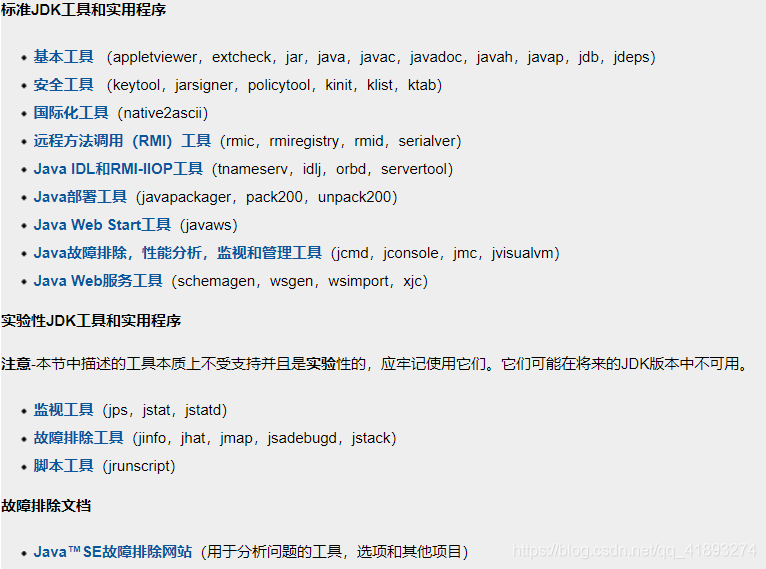 

## JVM基础知识

### 前言

- **内存泄漏memory leak** 

  指程序在申请内存后，无法释放已申请的内存空间，一次内存泄漏似乎不会有大的影响，但内存泄漏堆积后的后果就是内存溢出。

- **内存溢出 out of memory ** 

  指程序申请内存时，没有足够的内存供申请者使用，或者说，给了你一块存储int类型数据的存储空间，但是你却存储long类型的数据，那么结果就是内存不够用，此时就会报错OOM,即所谓的内存溢出。


## 垃圾收集器与内存分配策略


### 1. 内存分配与回收策略

Java技术体系中所提倡的自动内存管理最终可以归结为自动化地解决了两个问题

- 给对象分配内存
- 回收分配给对象的内存。

对象的内仔分配，在大方向上，就是在堆上分配（但也可能经过JIT编译后被拆散为标量类型并间接地在栈上分配)，

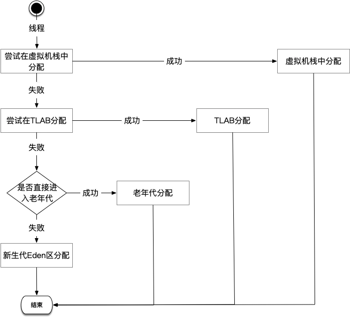 

对象主要分配在新生代的Eden 区上，如果启动了本地线程分配缓冲，将按线程优先在TLAB上分配。少数情况下也可能会直接分配在老年代中，分配的规则并不是百分之百固定的，其细节取决于当前使用的是哪一种垃圾收集器组合，还有虚拟机中与内存相关的参数的设置。

**首先说明一点：** 

- **新生代GC (Minor GC)** ：指发生在新生代的垃圾收集动作，因为Java对象大多都具备朝生夕灭的特性，所以Minor GC 非常频繁，一般回收速度也比较快。
- **老年代GC (Major GC / Full GC)** ：指发生在老年代的GC，出现了Major GC，经常会伴随至少一次的Minor GC(但非绝对的，在ParallelScavenge收集器的收集策略里就有直接进行Major GC的策略选择过程)。MajorGC的速度一般会比Minor GC慢10倍以上。

**JVM 环境配置** 

```c
-verbose:gc
-Xms20M
-Xmx20M
-Xmn10M
-XX:SurvivorRatio=8
-XX:-HandlePromotionFailure
-XX:+UseSerialGC
-XX:+PrintTenuringDistribution
-XX:+PrintGCDetails
```

#### （1）对象优先在Eden分配

大多数情况下，对象在新生代Eden区中分配。当Eden区没有足够的空间进行分配时，虚拟机将发起一次Minor GC.

虚拟机提供了-XX:+PrintGCDetails这个收集器日志参数，告诉虚拟机在发生垃圾收集行为时打印内存回收日志，并且在进程退出的时候输出当前内存各区域的分配情况。在实际应用中，内存回收日志一般是打印到文件后通过日志工具进行分析，不过本实验的日志并不多，直接阅读就能看得很清楚。

> 案例分析

```java
public class TestAllocation {

    private static final int _1MB = 1024 * 1024;

    public static void main(String[] args) {
        testAllocation();
    }
    /**
     * VM参数﹔-verbose:gc -Xms20M -Xmx20M -Xmn10M -XX:SurvivorRatio=8 -XX:+PrintGCDetails
     */
    public static void testAllocation() {
        byte[] allocation1, allocation2, allocation3, allocation4;
        allocation1 = new byte[2 * _1MB];
        allocation2 = new byte[2 * _1MB];
        allocation3 = new byte[2 * _1MB];
        allocation4 = new byte[4 * _1MB]; //出现一次Minor cc
    }
}
```

在testAllocation()方法中，

- 尝试分配3个2MB大小和1个4MB大小的对象，
- 在运行时通过-Xms20M、-Xmx20M和-Xmn10M 这3个参数限制Java堆大小为20MB，且不可扩展，其中10MB分配给新生代，剩下的10MB分配给老年代。
- -XX:SurvivorRatio=8决定了新生代中Eden区与一个Survivor区的空间比例是8比1，

执行testAllocation()中分配allocation4对象的语句时会发生一次Minor GC，这次GC的结果是新生代6651KB变为148KB，而总内存占用量则几乎没有减少(因为allocation1、2、3三个对象都是存活的，虚拟机几乎没有找到可回收的对象)。这次GC发生的原因是给allocation4分配内存的时候，发现Eden已经被占用了6MB，剩余空间已不足以分配 allocation4所需的4MB内存，因此发生Minor GC。GC期间虚拟机又发现已有的3个2MB大小的对象全部无法放入Survivor空间(Survivor空间只有1MB大小)，所以只好通过分配担保机制提前转移到老年代去。

这次GC结束后，4MB的allocation4对象被顺利分配在Eden中。因此程序执行完的结果是Eden占用4MB（被allocation4占用)，Survivor空闲，老年代被占用6MB（被allocation1、2、3占用)。通过GC日志可以证实这一点。

运行结果（GC日志）：

```c#
[GC (Allocation Failure) [DefNew: 7308K->545K(9216K), 0.0050456 secs] 7308K->6689K(19456K), 0.0050930 secs]
Heap
 def new generation   total 9216K, used 4806K [0x05600000, 0x06000000, 0x06000000) ——4MB
  eden space 8192K,  52% used [0x05600000, 0x05a290f8, 0x05e00000)   
  from space 1024K,  53% used [0x05f00000, 0x05f88738, 0x06000000) 
  to   space 1024K,   0% used [0x05e00000, 0x05e00000, 0x05f00000)
 tenured generation   total 10240K, used 6144K [0x06000000, 0x06a00000, 0x06a00000)  ——6MB
   the space 10240K,  60% used [0x06000000, 0x06600030, 0x06600200, 0x06a00000)
 Metaspace       used 129K, capacity 2280K, committed 2368K, reserved 4480K

Process finished with exit code 0
```

从输出的结果也能清晰地看到“eden space 8192K、from space 1024K、to space 1024K”的信息

- 新生代总可用空间为9216KB (Eden 区+1个Survivor区的总容量)。

#### （2）大对象直接进入老年代

所谓大对象就是指，需要大量连续内存空间的Java对象，最典型的大对象就是那种很长的字符串及数组（笔者例子中的byte[]数组就是典型的大对象)。

大对象对虚拟机的内存分配来说就是一个坏消息（替Java虚拟机抱怨一句，比遇到一个大对象更加坏的消息就是遇到一群“朝生夕灭”的“短命大对象”，写程序的时候应当避免)，经常出现大对象容易导致内存还有不少空间时就提前触发垃圾收集以获取足够的连续空间来“安置”它们。
虚拟机提供了一个-XX:PretenureSizeThreshold参数，令大于这个设置值的对象直接在老年代中分配。这样做的目的是避免在Eden 区及两个Survivor区之间发生大量的内存拷贝(复习一下:新生代采用复制算法收集内存)。

**注意事项** 

 PretenureSizeThreshold参数只对Serial和ParNew两款收集器有效，ParallelScavenge收集器不认识这个参数，Parallel Scavenge 收集器一般并不需要设置。如果遇到必须使用此参数的场合，可以考虑ParNew 加CMS的收集器组合。 

**案例分析** 

```java
    /**
     * 触发 Major cc
     * VM参数:-verbose:gc -xms20M -Xmx20M -Xmn10M -XX:SurvivorRatio=8  
     * -XX:+PrintGCDetails
     * -XX:+UseSerialGC  # 新生代串行收集器
     * -XX:PretenureSizeThreshold=3M  # 阈值
     * 其中 PretenureSizeThreshold参数只对Serial和ParNew两款收集器有效，
     * ParallelScavenge收集器不认识这个参数，Parallel Scavenge 收集器一般并不需要设置。
     * 如果遇到必须使用此参数的场合，可以考虑ParNew 加CMS的收集器组合。
     */
    public static void testPretenuresizeThreshold() {
        byte[] allocation;
        allocation = new byte[4 * _1MB]; // 直接分配在老年代中
    }
```

**执行结果：** 

```c
Heap
 def new generation   total 9216K, used 1328K [0x05600000, 0x06000000, 0x06000000)  
  eden space 8192K,  16% used [0x05600000, 0x0574c2e8, 0x05e00000)
  from space 1024K,   0% used [0x05e00000, 0x05e00000, 0x05f00000)
  to   space 1024K,   0% used [0x05f00000, 0x05f00000, 0x06000000)
 tenured generation   total 10240K, used 4096K [0x06000000, 0x06a00000, 0x06a00000)   ——4MB  直接进入老年代
   the space 10240K,  40% used [0x06000000, 0x06400010, 0x06400200, 0x06a00000)
 Metaspace       used 129K, capacity 2280K, committed 2368K, reserved 4480K
```

执行代码testPretenureSizeThreshold()方法后，我们看到Eden空间几乎没有被使用，而老年代10MB的空间被使用了40%，也就是4MB的allocation对象直接就分配在老年代中，这是因为PretenureSizeThreshold被设置为3MB(就是3145728B )，因此超过3MB的对象都会直接在老年代中进行分配。

#### （3）长期存活的对象进入老年代

 虚拟机既然采用了分代收集的思想来管理内存，那内存回收时就必须能识别哪些对象应当放在新生代，哪些对象应放在老年代中。

为了做到这点，虚拟机给每个对象定义了一个对象年龄（Age）计数器。

- 如果对象在Eden 出生并经过第一次Minor GC后仍然存活，并且能被Survivor容纳的话，将被移动到Survivor空间中，并将对象年龄设为1。
- 对象在Survivor区中每熬过一次Minor GC，年龄就增加1岁，当它的年龄增加到一定程度（默认为15岁）时，就会被晋升到老年代中。对象晋升老年代的年龄阈值，可以通过参数-XX:MaxTenuringThreshold来设置。

> 案例分析

分别以-XX:MaxTenuringThreshold=1和-XX:MaxTenuringThreshold=15两种设置来执行代码testTenuringThreshold()方法，此方法中allocation1对象需要256KB= 1/4MB 的内存空间，Survivor空间可以容纳。

- 当MaxTenuringThreshold=1时，allocation1对象在第二次GC发生时进入老年代，新生代已使用的内存GC后会非常干净地变成0KB。
- 当MaxTenuringThreshold=15时，第二次GC发生后，allocation1对象则还留在新生代Survivor空间，这时候新生代仍然有404KB的空间被占用。

代码案例：

```java
    /**
     * GC 分代年龄阈值 MaxTenuringThreshold
     * VM参数:
     * -verbose:gc 
     * -Xms20N -Xmx20M -Xmn10M -xX:SurvivorRatio=8
     * -XX:+PrintGCDetails
     * -XX:MaxTenuringThreshold=1
     * -XX:+PrintTenuringDistribution
     */
    @SuppressWarnings("unused")
    public static void testTenuringThresholdo() {
        byte[] allocation1, allocation2, allocation3;
        allocation1 = new byte[_1MB / 4];
        // 什么时候进入老年代取决于XX:MaxTenuringThreshold设置
        allocation2 = new byte[4 * _1MB];
        allocation3 = new byte[4 * _1MB];
        allocation3 = null;
        allocation3 = new byte[4 * _1MB];
    }
```

- 以MaxTenuringThreshold=1的参数设置来运行的结果:

```c
[GC (Allocation Failure) [DefNew
Desired survivor size 524288 bytes, new threshold 1 (max 1)
- age   1:     821136 bytes,     821136 total: 5516K->801K(9216K), 0.0029251 secs] 5516K->4897K(19456K) ——分代年龄1
Heap
 def new generation   total 9216K, used 5062K [0x04c00000, 0x05600000, 0x05600000)
  eden space 8192K,  52% used [0x04c00000, 0x050290f8, 0x05400000)
  from space 1024K,  78% used [0x05500000, 0x055c8790, 0x05600000) —— 发生一次 MinorGC,下次将进入老年代  
  to   space 1024K,   0% used [0x05400000, 0x05400000, 0x05500000)
 tenured generation   total 10240K, used 4096K [0x05600000, 0x06000000, 0x06000000)
   the space 10240K,  40% used [0x05600000, 0x05a00010, 0x05a00200, 0x06000000)
 Metaspace       used 126K, capacity 2280K, committed 2368K, reserved 4480K
```

- 以MaxTenuringThreshold=15的参数设置来运行的结果:

```c
[GC (Allocation Failure) [DefNew
Desired survivor size 524288 bytes, new threshold 1 (max 15)  —— 分代年龄最大 15
- age   1:     819752 bytes,     819752 total: 5516K->800K(9216K), 0.0032270 secs] 5516K->4896K(19456K) 
[GC (Allocation Failure) [DefNew
Desired survivor size 524288 bytes, new threshold 15 (max 15)
- age   1:       1656 bytes,       1656 total: 4978K->1K(9216K), 0.0009253 secs] 9074K->4894K(19456K) 
Heap
 def new generation   total 9216K, used 4315K [0x05000000, 0x05a00000, 0x05a00000)
  eden space 8192K,  52% used [0x05000000, 0x054368d8, 0x05800000)
  from space 1024K,   0% used [0x05800000, 0x05800678, 0x05900000)  —— majorGC 进入老年代
  to   space 1024K,   0% used [0x05900000, 0x05900000, 0x05a00000)
 tenured generation   total 10240K, used 4893K [0x05a00000, 0x06400000, 0x06400000)
   the space 10240K,  47% used [0x05a00000, 0x05ec7520, 0x05ec7600, 0x06400000)
 Metaspace       used 120K, capacity 2280K, committed 2368K, reserved 4480K

Process finished with exit code 0
```

#### （4）动态对象年龄判断

为了能更好地适应不同程序的内存状况，虚拟机并不总是要求对象的年龄必须达到MaxTenuringThreshold才能晋升老年代

- 如果在Survivor空间中相同年龄所有对象大小的总和大于Survivor空间的一半，年龄大于或等于该年龄的对象就可以直接进入老年代，无须等到MaxTenuringThreshold中要求的年龄。

> 案例分析

```java
	/**
     * survivor区相同年龄对象的占用内存 大于 survivor 空间的一半，则直接进入老年代
     * -verbose:gc
     * -Xms20M
     * -Xmx20M
     * -Xmn10M
     * -XX:SurvivorRatio=8
     * -XX:MaxTenuringThreshold=15
     * -XX:+UseSerialGC
     * -XX:+PrintTenuringDistribution
     * -XX:+PrintGCDetails
     */
    @SuppressWarnings("unused")
    public static void testTenuringThreshold_2() {
        byte[] allocation1, allocation2, allocation3,allocation4;
        allocation1 = new byte[_1MB / 4];
        // allocation1 + allocation2 > survivor 空间的一半，则直接进入老年代
        allocation2 = new byte[_1MB / 4];
        allocation3 = new byte[4 * _1MB];
        allocation4 = new byte[4 * _1MB];
        allocation4 = null;
        allocation4 = new byte[4 * _1MB];
    }
```

运行结果：

```c
[GC (Allocation Failure) [DefNew
Desired survivor size 524288 bytes, new threshold 1 (max 15)
- age   1:    1048576 bytes,    1048576 total: 5772K->1024K(9216K), 0.0037965 secs] 5772K->5154K(19456K) 
[GC (Allocation Failure) [DefNew
Desired survivor size 524288 bytes, new threshold 15 (max 15)
- age   1:        352 bytes,        352 total: 5201K->0K(9216K), 0.0014949 secs] 9332K->5154K(19456K) 
Heap
 def new generation   total 9216K, used 4314K [0x05000000, 0x05a00000, 0x05a00000)
  eden space 8192K,  52% used [0x05000000, 0x054368e0, 0x05800000)
  from space 1024K,   0% used [0x05800000, 0x05800160, 0x05900000)
  to   space 1024K,   0% used [0x05900000, 0x05900000, 0x05a00000)
 tenured generation   total 10240K, used 5154K [0x05a00000, 0x06400000, 0x06400000)
   the space 10240K,  50% used [0x05a00000, 0x05f08848, 0x05f08a00, 0x06400000)   ——老年代的空间占比
 Metaspace       used 129K, capacity 2280K, committed 2368K, reserved 4480K
```

执行代码testTenuringThreshold2()方法，并设置参数-XX:MaxTenuringThreshold=15，会发现运行结果中Survivor的空间占用仍然为0%，而老年代比预期增加了6%，也就是说allocation1、allocation2对象都直接进入了老年代，而没有等到15岁的临界年龄。因为这两个对象加起来已经达到了512KB，并且它们是同年的，满足同年对象达到Survivor空间的一半规则。我们只要注释掉其中一个对象的new操作,计会发现另外二个不会晋升到老年代中去。

#### （5）空间分配担保

在发生Minor GC时，虚拟机会检测之前每次晋升到老年代的平均大小是否大于老年代的剩余空间大小

- 如果大于，则改为直接进行一次Full GC。
- 如果小于，则查看HandlePromotionFailure 设置是否允许担保失败
  - 如果允许，那只会进行Minor GC  【1】
  - 如果不允许，则也要改为进行一次Full GC。

【1】 如果某次MinorGC存活后的对象突增，远远高于平均值的话，依然会导致担保失败(HandlePromotion Failure)。如果出现了HandlePromotionFailure失败，那就只好在失败后重新发起一次Full GC。虽然担保失败时绕的圈子是最大的，但大部分情况下都还是会将HandlePromotionFailure开关打开，避免Full GC过于频繁

> 案例分析

```java
    /**
     * VM参数:
     *  -verbose:gc -xms20M -Xmx20M -Xmn10M -XX:SurvivorRatio=8
     *  -XX:-HandlePromotionFailure
     *  HandlePromotionFailure=false|true
     */
    @SuppressWarnings ("unused")
    public static void testHandlePromotion () {
        byte[] allocation1, allocation2, allocation3, allocation4, allocation5,
                allocation6, allocation7;
        allocation1 = new byte[2 * _1MB];
        allocation2 = new byte[2 * _1MB];
        allocation3 = new byte[2 * _1MB];
        allocation1 = null;
        allocation4 = new byte[2 * _1MB];
        allocation5 = new byte[2 * _1MB];
        allocation6 = new byte[2 * _1MB];
        allocation4 = null;
        allocation5 = null;
        allocation6 = null;
        allocation7 = new byte[2 * _1MB];
    }
```

但是在jdk1.6 update 24之后-XX:-HandlePromotionFailure 不起作用了，只要老年代的连续空间大于新生代对象的总大小或者历次晋升到老年代的对象的平均大小就进行MinorGC，否则FullGC

 

下面指令 PromotionFailureALot  目前只支持在debug环境下使用。


## 性能监控和故障处理

### 背景概述

在了解了虚拟内存分配与回收技术后，相信大家已经建立了一套比较完整的理论基础。而理论总是作为指导实践的工具，能把这些应用到实践工作中，才是我们最终的目的。下面我们将从实践的角度去了解虚拟机内存管理的世界。

给一个系统定位问题的时候，知识、经验是关键基础，数据是依据，工具是运用知识处理数据的手段。这里的数据包括：运行日志、异常堆栈、GC日志、线程快照（threaddump/javacore文件）、堆转储文件（headdump/hprof文件）。经常使用适当的虚拟机监控和分析工具可以加快我们分析数据、定位解决问题的速度。但在学习工具前，也应当意识到工具永远都是知识技能的一层包装，没有什么工具是“秘密武器”，不可能学会了就能包治百病。

 

可以看到这些工具的程序体积都异常小巧。基本都稳定在20K左右。这并非JDK开发团队刻意把他们制作得如此精炼，而是这些命令行工具大多数是JDK/lib/tools.jar类库的一层薄包装而已，它们主要的功能代码是在tools类库中实现的。之所以这样做，是因为当应用程序部署到生产环境后，无论是直接接触物理服务器还是远程Telnet到服务器上都可能会受到限制。借助tools.jar类库里面的接口，我们可以直接在应用程序中实现功能强大的监控分析功能。

### Jdk 命令行工具

|  名称  | 作用                                                         |
| :----: | :----------------------------------------------------------- |
|  jps   | JVM Process Status Tool，显示指定系统内所有的 HotSpot 虚拟机进程 |
| jstat  | JVM statistics Monitoring Tool,用于收集HotSpot虚拟机各方面的运行数据 |
| jinfo  | Configuration Info for Java，显示虚拟机配置信息              |
|  jmap  | Memory Map for Java，生成虚拟机的内存转储快照（heapdump文件） |
|  jhat  | JVM Heap Dump Brower,用于分析heap dump文件，它会建立一个HTTP/HTML服务器，让用户可以在浏览器上查看分析结果 |
| jstack | Stack Trace for Java 显示虚拟机的线程快照                    |


#### :one: JPS:虚拟机进程状况

- Jps 命令手册：https://docs.oracle.com/javase/8/docs/technotes/tools/unix/jps.html

**JPS（JavaVirtual Machine Process Status Tool）**：　JDK的很多小工具的名字都参考了UNIX命令的命名方式，jps名字像UNIX的ps命令之外，也和ps命令类似：可以列出正在运行的虚拟机进程。并显示虚拟机执行主类   (Main Class, main() 函数所在的类)  名称以及这些进程的本地虚拟机唯一ID(Local Virtual Machine Identifier,LVMID)。虽然功能比较单一，但它是使用频率最高的JDK命令行工具，因为其他的JDK工具大多需要输入它查询到的LVMID来确定要监控的是哪一个虚拟机进程。对于本地虚拟机进程来说，LVMID与操作系统的进程ID是一致的。使用Windows的任务管理器或者UNIX的ps命令也可以查询到虚拟机进程的LVMID，但如果同时启动多个虚拟机进程，无法根据进程名称定位时，那只有依赖jps命令显示主类的功能才能区分了。

**命令格式：** ` jps [-q] [-mlvV] [<hostid>]` 

 **[options]选项 ：** 

| 选型 | 作用                                                         |
| :--: | :----------------------------------------------------------- |
|  -q  | 仅输出VM标识符，不包括classname,jar name,arguments in main method |
|  -m  | 输出虚拟机进程启动时传递给主类main()函数的参数               |
|  -l  | 输出主类的全名，如果进程执行的是Jar包，输出Jar路径           |
|  -v  | 输出虚拟机进程启动时JVM参数                                  |

> 案例分析

写一段程序，例子如下：

```java
public class JPSDemo {
    public JPSDemo(){}
    public static void main(String[] args) {
        Scanner sc = new Scanner(System.in);
        sc.next();
    }
}
```

连续运行2次，打开cmd,再用jps查看，如下：

 

##### （1）参数案例

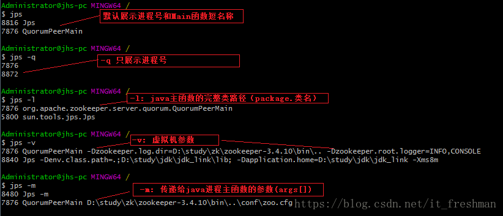 


**相关文章**

1. https://blog.csdn.net/u013132035/article/details/78312226
2. https://www.cnblogs.com/huangjuncong/p/8995333.html
3. [性能监控工具-JDK性能监控](https://www.cnblogs.com/guoximing/articles/6110319.html) 


#### :two: Jstat:虚拟机统计信息监控

- jstat 命令手册：https://docs.oracle.com/javase/8/docs/technotes/tools/windows/jstat.html

jstat (JVM Statistics Monitoring Tool) 用于监视虚拟机各种运行状态信息的命令行工具。它可以显示本地或远程虚拟机进程中类装载、内存、垃圾收集、JIT编译等运行数据，在没有GUI图形界面时，它是运行期定位虚拟机性能问题的首选工具。

**jstat命令格式：** ` 　 jstat -<option> [-t] [-h<lines>] <vmid> [<interval> [<count>]]`  

- outputOptions – 选择需要输出哪些内容
- t – 在第一列输出timestamp,是从目标JVM启动时候开始算起
- h – 选择每隔n行输出列的名字，默认是0，表示只在第一行输出列的名字
- vmid – JVM的pid，可以使用jps来查看
- interval – jstat输出的时间间隔默认单位是毫秒
- count – 表示需要展示多少取样数据，默认是无限制的，表示会一直取样输出，直到JVM停止

> 案例分析

假设要每250毫秒查询一次进程pid = 2764 的垃圾收集情况，一个查询20次，那命令应当是：

```bash
　jstat -gc 2764 250 20
```

 

选项option代表着用户希望查询的虚拟机信息，主要分为3类：类装载，垃圾收集，运行期编译状况，具体选项及作用请参考如下列表：

 

> 案例分析

jstat 监控选项众多，这里仅举一个例子演示如何查看监控结果。继续运行上面的例子如下：

 

其中：CGC和CGCT中的第一个C代表“并发”，所以CGC是“并发垃圾收集”

##### （1）支持选项（options）

使用jstat -options可以看到jstat支持的几个options选项：

```powershell
C:\Users\Dell>jstat -options
-class
-compiler
-gc
-gccapacity
-gccause
-gcmetacapacity
-gcnew
-gcnewcapacity
-gcold
-gcoldcapacity
-gcutil
-printcompilation
```

##### （2）类加载统计（class）

```bash
C:\Users\Administrator>jstat -class 8264
Loaded  Bytes  Unloaded  Bytes     Time
 15756 17355.6        0     0.0      11.29
```

说明：

- Loaded:加载class的数量
- Bytes：所占用空间大小
- Unloaded：未加载数量
- Bytes:未加载占用空间
- Time：时间

##### （3）编译统计（compiler）

```powershell
jstat -compiler 53528 100 5
Compiled Failed Invalid   Time   FailedType FailedMethod
    2675      0       0     5.35          0
    2675      0       0     5.35          0
    2675      0       0     5.35          0
    2675      0       0     5.35          0
    2675      0       0     5.35          0
```

参数说明：

- Compiled – 执行的编译任务的次数
- Failed – 编译任务失败次数
- Invalid – 置位无效的编译任务次数
- Time – 执行编译任务花费的时间
- FailedType – 上一次失败编译的编译类型
- FailedMethod – 上一次编译失败的方法名

##### （4）垃圾回收统计（gc）

> GC统计的是GC heap信息

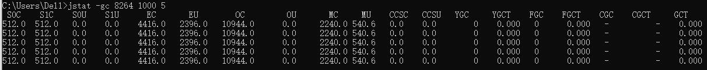 

```powershell
C:\Users\Dell>jstat -gc 8264 1000 5
 S0C    S1C    S0U    S1U      EC       EU        OC         OU       MC     MU    CCSC   CCSU   YGC     YGCT    FGC    FGCT    CGC    CGCT     GCT
512.0  512.0   0.0    0.0    4416.0   2396.0   10944.0      0.0     2240.0 540.6   0.0    0.0        0    0.000   0      0.000   -          -    0.000
512.0  512.0   0.0    0.0    4416.0   2396.0   10944.0      0.0     2240.0 540.6   0.0    0.0        0    0.000   0      0.000   -          -    0.000
512.0  512.0   0.0    0.0    4416.0   2396.0   10944.0      0.0     2240.0 540.6   0.0    0.0        0    0.000   0      0.000   -          -    0.000
512.0  512.0   0.0    0.0    4416.0   2396.0   10944.0      0.0     2240.0 540.6   0.0    0.0        0    0.000   0      0.000   -          -    0.000
512.0  512.0   0.0    0.0    4416.0   2396.0   10944.0      0.0     2240.0 540.6   0.0    0.0        0    0.000   0      0.000   -          -    0.000
```

参数说明：

gc的输出参数比较多，我们一一进行解释，这样大家对于gc的运行内核会有更多的理解：

- S0C – survivor 0区域的容量，以KB为单位
- S1C – survivor 1区域的容量，以KB为单位

*Young Gen被划分为1个Eden Space和2个Suvivor Space。当对象刚刚被创建的时候，是放在Eden space。垃圾回收的时候，会扫描Eden Space和一个Suvivor Space。如果在垃圾回收的时候发现Eden Space中的对象仍然有效，则会将其复制到另外一个Suvivor Space。*
*就这样不断的扫描，最后经过多次扫描发现任然有效的对象会被放入Old Gen表示其生命周期比较长，可以减少垃圾回收时间。*

- S0U – survivor 0区域的使用大小，以KB为单位
- S1U – survivor 1区域的使用大小，以KB为单位
- EC – Eden区域的容量，以KB为单位
- EU – Eden区域的使用，以KB为单位
- OC – old区域的容量，以KB为单位
- OU – old区域的使用，以KB为单位
- MC – Metaspace元数据区的 Committed Size，以KB为单位
- MU – Metaspace元数据区的使用大小，以KB为单位

*在JDK8之前，类定义、字节码和常量等很少会变更的信息是放在持久代Perm Gen中的。不过在JDK8之后，Perm Gen已经被取消了，现在叫做Metaspace。Metaspace并不在java虚拟机中，它使用的是本地内存。Metaspace可以通过-XX:MaxMetaspaceSize来控制。* 

- CCSC – Compressed class的Committed Size（压缩比率后的大小），以KB为单位
- CCSU – Compressed class的使用大小，以KB为单位

*Compressed Class Space，它是和-XX:+UseCompressedOops，-XX:+UseCompressedClassesPointers有关的。实际上是一个指针的压缩，可以使用32bits来表示之前64bits的指针。* 

- YGC – young generation的GC次数
- YGCT – young generation的GC时间
- FGC – full GC的次数
- FGCT – full GC的时间
- GCT – 总的GC时间

##### （5）堆内存统计（gccapacity）

 

```powershell
C:\Users\Dell>jstat -gccapacity 8264 100 5
 NGCMN    NGCMX     NGC     S0C   S1C       EC      OGCMN      OGCMX       OGC         OC       MCMN     MCMX      MC     CCSMN    CCSMX     CCSC    YGC    FGC   CGC
  5440.0  87360.0   5440.0  512.0  512.0   4416.0    10944.0   174784.0    10944.0    10944.0      0.0   4480.0   2240.0      0.0      0.0      0.0      0     0     -
  5440.0  87360.0   5440.0  512.0  512.0   4416.0    10944.0   174784.0    10944.0    10944.0      0.0   4480.0   2240.0      0.0      0.0      0.0      0     0     -
  5440.0  87360.0   5440.0  512.0  512.0   4416.0    10944.0   174784.0    10944.0    10944.0      0.0   4480.0   2240.0      0.0      0.0      0.0      0     0     -
  5440.0  87360.0   5440.0  512.0  512.0   4416.0    10944.0   174784.0    10944.0    10944.0      0.0   4480.0   2240.0      0.0      0.0      0.0      0     0     -
  5440.0  87360.0   5440.0  512.0  512.0   4416.0    10944.0   174784.0    10944.0    10944.0      0.0   4480.0   2240.0      0.0      0.0      0.0      0     0     -
```

参数说明：

- NGCMN：新生代最小容量
- NGCMX：新生代最大容量
- NGC：当前新生代容量
- S0C：第一个幸存区大小
- S1C：第二个幸存区的大小
- EC：伊甸园区的大小
- OGCMN：老年代最小容量
- OGCMX：老年代最大容量
- OGC：当前老年代大小
- OC:当前老年代大小
- MCMN:最小元数据容量
- MCMX：最大元数据容量
- MC：当前元数据空间大小
- CCSMN：最小压缩类空间大小
- CCSMX：最大压缩类空间大小
- CCSC：当前压缩类空间大小
- YGC：年轻代gc次数
- FGC：老年代GC次数

##### （6）新生代垃圾回收统计（gcnew）

> gcnew表示新生代的统计信息

```powershell
 jstat -gcnew 53528 100 5
 S0C    S1C    S0U    S1U   TT MTT  DSS      EC       EU     YGC     YGCT
   0.0 4096.0    0.0 3978.2 15  15 5120.0  56320.0  33792.0      4    0.025
   0.0 4096.0    0.0 3978.2 15  15 5120.0  56320.0  33792.0      4    0.025
   0.0 4096.0    0.0 3978.2 15  15 5120.0  56320.0  33792.0      4    0.025
   0.0 4096.0    0.0 3978.2 15  15 5120.0  56320.0  33792.0      4    0.025
   0.0 4096.0    0.0 3978.2 15  15 5120.0  56320.0  33792.0      4    0.025
```

参数说明：

- S0C – survivor 0区域的容量
- S1C – survivor 1区域的容量
- S0U – survivor 0区域的使用大小，以KB为单位
- S1U – survivor 1区域的使用大小，以KB为单位
- TT – Tenuring threshold（进入老年代的阈值？）
- MTT – 最大的Tenuring threshold
- DSS – 所需的survivor size
- EC – Eden区域的容量
- EU – Eden区域的使用，以KB为单位
- YGC – 新生代GC次数
- YGCT – 新生代GC所需的时间

##### （7）新生代内存统计（gcnewcapacity ）

> gcnewcapacity统计的是新生代的指标，和gccapacity的结果是很类似的：

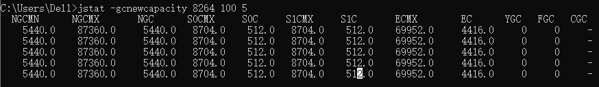 

参数说明：

- NGCMN – 最小的新生代的大小
- NGCMX – 最大的新生代大小
- NGC – 目前新生代的大小
- S0CMX – survivor 0区域容量的最大值
- S0C – survivor 0区域的容量
- S1CMX – survivor 1区域容量的最大值
- S1C – survivor 1区域的容量
- EC – Eden区域的容量
- ECMX – Eden区域容量的最大值
- YGC – young generation的GC次数
- FGC – full GC的次数

##### （8）老年代垃圾回收统计（gcold）

> gcold统计old代的信息

 

参数说明：

结果的几项指标前面已经介绍过了，这里就不再重复了

##### （9）老年代内存统计（gcoldcapacity ） 

> gcoldcapacity表示old代的容量信息

 

##### （10）元空间数据统计（gcmetacapacity ）

> gcmetacapacity统计的是元数据区域的容量信息

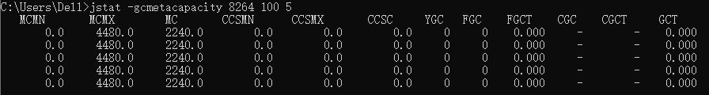 

##### （11）总体垃圾回收统计（gcutil ）

> gcutil统计的是GC总体的情况

 

参数说明：

- S0 – S0区域的使用比例
- S1 – S1区域的使用比例
- E – Eden区域的使用比例
- O – Old区域的使用比例
- M – 元数据区域的使用比例
- CCS – Compressed class空间的使用比例

##### （12）总体垃圾回收（gccause）

gccause和gcutil非常相识，只不过多了下面两列：

- LGCC – 上次GC的原因
- GCC – 当前GC的原因

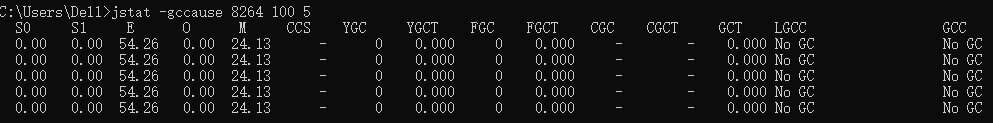 

##### （13）编译方法统计（printcompilation）   

> Java HotSpot VM编译器方法统计信息。

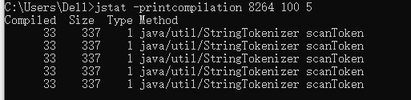 

参数说明：

- `Compiled`：由最近编译的方法执行的编译任务数。
- `Size`：最近编译的方法的字节码的字节数。
- `Type`：最近编译的方法的编译类型。
- `Method`：标识最近编译的方法的类名和方法名。类名使用斜杠（/）代替点（。）作为名称空间分隔符。方法名称是指定类中的方法。这两个字段的格式与HotSpot`-XX:+PrintCompilation`选项一致。

#### :three: Jstatd:jstat的守护进程监控

一些监控工具支持远程计算机的控制（如jps,jstat）,为了开启远程监控，则需要配合使用jstatd工具。
命令jstatd则是一个RMI服务端程序，它的作用相当于对代理服务器，建立本地计算机与远程监控工具的通信。jstatd服务器将本机的java应用程序传递到远程计算机。如图：

- 在线手册：https://docs.oracle.com/javase/8/docs/technotes/tools/windows/jstatd.html

该`jstatd`命令是一个RMI服务器应用程序，它监视已检测的Java HotSpot VM的创建和终止，并提供一个接口，以使远程监视工具能够附加到在本地主机上运行的JVM。

 

该`jstatd`服务器需要本地主机上的RMI注册表。该`jstatd`服务器尝试连接到RMI注册表中的默认端口，或者该端口上您使用指定`-p` `port`的选项。如果未找到RMI注册表，则会在`jstatd`应用程序中创建一个绑定到该`-p` `port`选项指示的端口或`-p` `port`省略该选项时的默认RMI注册表端口的应用程序。您可以通过指定`-nr`选项来停止内部RMI注册表的创建。

**命令格式：** ` jstatd [-nr] [-p port] [-n rminame]`  

**参数说明：** 

- -nr 

  当找不到现有的RMI注册表时，不尝试使用jstatd进程创建一个内部的RMI注册表。

- -p  port

  如果`-nr`未指定该选项，则将在期望的RMI注册表处找到端口号，或者在找不到RMI注册表时创建该端口号。

- -n rminame

  RMI注册表中远程RMI对象绑定到的名称。默认名称是`JStatRemoteHost`。如果`jstatd`在同一主机上启动了多个服务器，则可以通过指定此选项使每个服务器的导出RMI对象的名称唯一。但是，这样做需要将唯一的服务器名称包含在监视客户端`hostid`和`vmid`字符串中。

- -J options

  传递`option`给JVM，其中option是`options`Java应用程序启动器的参考页上描述的选项之一。例如，`-J-Xms48m`将启动内存设置为48 MB

##### （1）直接运行jstatd命令会报错

> 因为没有足够的权限所致。可以使用java的安全策略，为其分配相应的权限，并命名为all.policy

```java
grant codebase "file:${JAVA_HOME}\lib\tools.jar" {
    permission java.security.AllPermission;
};
```

##### （2）使用jsp.jstat命令即可访问远程服务器的信息。

> 使用命令：`jstatd -J-Djava.security.policy=all.policy` 服务即开启,默认端口1099。[jstatd更为详尽的配置](https://docs.oracle.com/javase/1.5.0/docs/tooldocs/share/jstatd.html)  

```java
jps localhost:1099;

jstat -gcutil 460@localhost:1099 //----460为进程号
```

**相关文章** 

1. [JDK工具jstatd用法详解](https://www.cnblogs.com/EasonJim/p/7483739.html) 
2. [jstatd结合Java VisualVM进行远程监控JVM运行情况](https://www.cnblogs.com/guoximing/articles/6110319.html) 

#### :four: Jinfo:Java配置信息

**jinfo(Configuration Info for Java) 的作用** 

实时地查看和调整虚拟机各项参数。

- 使用jps命令的-v参数可以查看虚拟机启动时显式指定的参数列表，但如果想知道未被显式指定的参数的系统默认值
- jinfo的-flag选项进行查询(如果只限于JDK1.6或以上版本的话，使用java -XX:+PrintFlagsFianl查看参数默认值也是一个很好的选择
- jinfo还可以使用-sysprops选项把虚拟机进程的System.getProperties()的内容打印出来。这个命令在JDK1.5时期已经伴随Linux的JDK发布，当时只提供了信息查询的功能，

JDK1.6之后，jinfo在Windows和Linux平台都有提供，并且加入了运行期修改参数的能力，可以使用-flag [+|-] name或者 -flag name=value 修改一部分运行期可写的虚拟机参数值。JDK1.6中，jinfo对于Windows平台功能仍然有很大的限制，只提供了最基本的-flag选项。

**具体用法**  

 

参数说明：

- no option   输出全部的参数和系统属性

- -flag  name  输出对应名称的参数

- -flag [+|-]name  开启或者关闭对应名称的参数

- -flag name=value  设定对应名称的参数

- -flags  输出全部的参数

- -sysprops  输出系统属性

##### （1）参数配置（PrintGCDetails）

 

（2）查看默认配置（UseG1GC）

  

#### :five:Jmap:Java内存映像工具

> 简言之，导出堆中的信息

 jmap（Memory Map for Java）命令用于生成堆转储快照（一般称为headdump或dump文件）,也就是导出堆到dump文件中。如果不使用jmap命令，要想获取Java堆转储快照，可以使用一下方法：

1. 用-XX:+HeapOnOutOfMemoryError参数，可以让虚拟机在OOM异常出现之后自动生成dump文件
2. 通过-XX:+HeapDumpOnCtrlBreak参数则可以使用[ Ctrl ] + [ Break ]键让虚拟机生成dump文件
3. 在Linux系统下通过Kill -3命令发送进程退出信号“吓唬”一下虚拟机，也能拿到dump文件。

 jmap的作用并不仅仅是为了获取dump文件，它可以查询finalize执行队列、Java堆和永久代的信息信息，如空间使用率、当前用的是哪种收集器等。

和jinfo命令一样，jmap有不少功能在Windows平台下都是受限的，除了生成dump文件的-dump选项和用于查看每个类的实例、空间占用统计的-histo选项在所有操作系统都提供之外，其余选项都只能在Linux/Solaris下使用。

**jmap用法** 

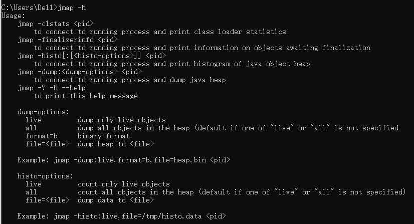 

**option选项有如下：**

- -heap 显示Java堆详细信息，如使用哪种回收器、参数配置、分代状况等。只在Linux/Solaris平台下有效
- -histo[:live] 显示堆中对象的统计信息，如果使用了:live子属性，则只统计“存活”对象，显示堆中对象统计信息，包括类、实例数量、合计容量
- -clstats 打印类加载器的统计信息(取代了在JDK8之前的 -permstat)
- -permstat Java堆内存的永久保存区域的类加载器的统计信息 ----JDK8之后无此选项，只在Linux/Solaris平台下有效
- -finalizerinfo 显示在F-Queue队列等待Finalizer线程执行finalizer方法的对象，只在Linux/Solaris平台下有效
- -dump: 生成堆转储快照
- -F 当-dump没有响应时，强制生成dump快照，只在Linux/Solaris平台下有效
- -J 传递参数给jmap启动的jvm

##### （1）堆中对象的统计信息（histo）

统计5421号进程的存活对象统计信息，并保存到文件：`$ jmap -histo:live 5421 >d:/jmap_dump.txt`，结果如下图：

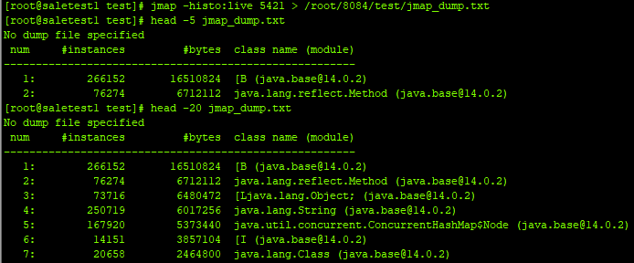 

结果中统计了内存中实例对象数和合计。

##### （2）导出当前堆快照（dump）

- -dump功能得到java程序的当前堆快照：`jmap -dump:format=b,file=d:/heamp.hprof 3076` ,其中b代表以二进制的形式

 

##### （3）系统类加载信息（**-clstats 与 permstat**）

该命令还可以查看系统的classloader信息，以及classloader的父子关系，以及各个classloader内部加载的类的数量和总大小。

- `$ jmap -clstats 7876`

 

##### （4）F-Queue队列信息查看（**finalizerinfo**）

可以观察系统中finalizer队列中的对象，一个不恰当的finalize()方法可能导致对象堆积在finalizer队列里。`$ jmap -finalizerinfo 7876` 

 

上图的finalizer队列长度为0。

#### :six:Jhat:Java堆分析工具

> **注意**  

jhat从JDK9 的时候已经删除了（JEP 241: Remove the jhat Tool）。现在Oracle官方推荐的分析工具是Eclipse Memory Analyzer Tool (MAT) 和 VisualVM。 这两款工具后面有时间再详细讲解。

> **使用** 

Sun JDK提供jhat（JVM heap Analysis Tool）命令与jmap搭配使用，来分析jmap生成的堆转储快照。jhat内置了一个微型的HTTP/HTML服务器，生成dump文件的分析结果后，可以在浏览器中查看。

一般不会直接使用jhat命令来分析dump文件，原因有两点：

1. 一般不会在部署应用程序的服务器上直接分析dump文件，即使这样做，一般也尽量把dump文件复制到其他机器上去分析，因为分析是一个耗时且消耗硬件资源的一个过程，既然都要在其他机器上运行了，就没有必要受到命令行工具的限制了；
2. jhat的分析功能相对来说比较丑陋，有其工具能实现比jhat更强大更专业的分析功能（后面会提到专业的工具VisualVM）。

**用法** ：

1. ` jmap -dump:format=b,file=d:/heamp.hprof 3076` 导出当前堆快照
2. ` jhat d:/heap.hprof` 浏览器查看分析jmap 导出来的堆快照信息

使用jhat工具可以分析java应用程序的堆快照内容：`$ jhat d:/heap.hprof`

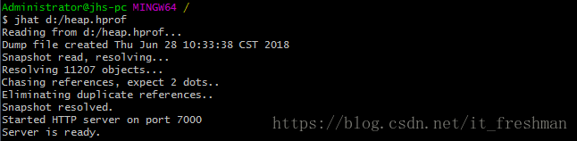 

分析的结果通过浏览器 localhost:7000查看。

 

  分析结果默认是以包为单位进行分组显示，分析内存泄漏问题主要会使用到其中的“Heap Histogram”（与jmap -histo功能一样）与OQL页签的功能，前者可以找到内存中总容量最大的对象，后者是标准的对象查询语言，使用类似SQL的语法对内存中的对象进行查询统计。

#### :seven:Jstack:Java堆栈跟踪工具

 jstack（Stack Trace for Java）命令用于生成虚拟机当前时刻的线程快照（一般称为threaddump或者javacore文件）。线程快照就是当前虚拟机内每一条线程正在执行的方法堆栈的集合。

- **生成线程快照的主要目的** 是定位线程出现长时间停顿的原因，如线程间死锁、死循环、请求外部资源导致的长时间等待都是导致线程长时间停顿的常见原因。

线程出现停顿的时候使用jstack来查看各个线程的调用堆栈，就可以知道没有响应的线程在后台做些什么事情，或者等待着什么资源。

- 在线手册：https://docs.oracle.com/en/java/javase/14/docs/specs/man/jstack.html

**jstack用法** ` jstack [-l][-e] <pid>` 

**参数说明：** 

| 选项 | 作用（jstack工具主要选项）                                   |
| ---- | ------------------------------------------------------------ |
| -F   | 当正常输出的请求不被响应时，强制输出线程堆栈                 |
| -l   | 除堆栈外，显示关于锁的附加信息                               |
| -e   | extended listing. Prints additional information about threads |

##### （1）通过jstack分析一个Java死锁程序

```java
public class JStackDeadLockDemo{
    public static void main(String[] args) {
        /**
         * 死锁是两个或两个以上的进程在执行过程中，因为抢夺资源导致相互等待的现象
         * 若无外力干预，它们将无法推进下去
         */
        String lockA = "lockA";
        String lockB = "lockB";
        new Thread(new HoldLock(lockA,lockB),"Thread-A").start();
        new Thread(new HoldLock(lockB,lockA),"Thread-B").start();
        System.out.println();
        /**
         * 怎么定位死锁问题
         * linux         ps -ef|grep xxx  / ls-l
         * windows下Java程序运行，可以模拟ps命令
         *   1、jps =java ps      jps -l 查看进程号
         *   2、jstack 进程号
         */
    }
}
class HoldLock implements Runnable{
    private String lockA;
    private String lockB;

    public HoldLock(String lockA,String lockB){
        this.lockA = lockA;
        this.lockB = lockB;
    }
    @Override
    public void run() {
        synchronized (lockA){
            System.out.println(Thread.currentThread().getName() + "\t 自己持有：" + lockA + "\t 尝试获取：" + lockB);
            try {
                Thread.sleep(5);
            } catch (InterruptedException e) {
                e.printStackTrace();
            }
            synchronized (lockB){
                System.out.println(Thread.currentThread().getName() + "\t 自己持有：" + lockB + "\t 尝试获取：" + lockA);
            }
        }
    }
}
```

##### （2）怎么定位死锁问题

**1.1 查看正在运行的进程号**

> 使用命令：` jps -l 或者 利用 top 分析` 

```scss
linux         ps -ef|grep xxx  / ls-
windows下Java程序运行，可以模拟ps命令
  1、jps =java ps      jps -l 查看进程号
  2、jstack 进程号
```

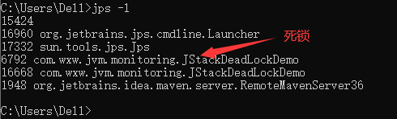 

**1.2 查看死锁的堆栈信息** 

> 使用命令：` jstack 16668` 

打印结果中会有如下部分死锁异常：

```bash
$ jstack 16668
2020-12-17 10:46:36
Full thread dump Java HotSpot(TM) Client VM (25.251-b08 mixed mode):

"DestroyJavaVM" #11 prio=5 os_prio=0 tid=0x0317dc00 nid=0x2e6c waiting on condition [0x00000000]
   java.lang.Thread.State: RUNNABLE

"Thread-B" #10 prio=5 os_prio=0 tid=0x15b75800 nid=0x3c84 waiting for monitor entry [0x1621f000]
   java.lang.Thread.State: BLOCKED (on object monitor)
        at com.wxw.jvm.monitoring.HoldLock.run(JStackDeadLockDemo.java:49)
        - waiting to lock <0x05769a10> (a java.lang.String)
        - locked <0x05769a38> (a java.lang.String)
        at java.lang.Thread.run(Thread.java:748)

"Thread-A" #9 prio=5 os_prio=0 tid=0x15b75400 nid=0x41a0 waiting for monitor entry [0x1618f000]
   java.lang.Thread.State: BLOCKED (on object monitor)
        at com.wxw.jvm.monitoring.HoldLock.run(JStackDeadLockDemo.java:49)
        - waiting to lock <0x05769a38> (a java.lang.String)
        - locked <0x05769a10> (a java.lang.String)
        at java.lang.Thread.run(Thread.java:748)

"Service Thread" #8 daemon prio=9 os_prio=0 tid=0x15b2d000 nid=0x41a8 runnable [0x00000000]
   java.lang.Thread.State: RUNNABLE

"C1 CompilerThread0" #7 daemon prio=9 os_prio=2 tid=0x15b04c00 nid=0x1d64 waiting on condition [0x00000000]
   java.lang.Thread.State: RUNNABLE

"Monitor Ctrl-Break" #6 daemon prio=5 os_prio=0 tid=0x15b0b400 nid=0x1330 runnable [0x15f4f000]
   java.lang.Thread.State: RUNNABLE
        at java.net.SocketInputStream.socketRead0(Native Method)
        at java.net.SocketInputStream.socketRead(SocketInputStream.java:116)
        at java.net.SocketInputStream.read(SocketInputStream.java:171)
        at java.net.SocketInputStream.read(SocketInputStream.java:141)
        at sun.nio.cs.StreamDecoder.readBytes(StreamDecoder.java:284)
        at sun.nio.cs.StreamDecoder.implRead(StreamDecoder.java:326)
        at sun.nio.cs.StreamDecoder.read(StreamDecoder.java:178)
        - locked <0x057ce458> (a java.io.InputStreamReader)
        at java.io.InputStreamReader.read(InputStreamReader.java:184)
        at java.io.BufferedReader.fill(BufferedReader.java:161)
        at java.io.BufferedReader.readLine(BufferedReader.java:324)
        - locked <0x057ce458> (a java.io.InputStreamReader)
        at java.io.BufferedReader.readLine(BufferedReader.java:389)
        at com.intellij.rt.execution.application.AppMainV2$1.run(AppMainV2.java:61)

"Attach Listener" #5 daemon prio=5 os_prio=2 tid=0x15ac3800 nid=0x36ac waiting on condition [0x00000000]
   java.lang.Thread.State: RUNNABLE

"Signal Dispatcher" #4 daemon prio=9 os_prio=2 tid=0x15a98800 nid=0x1874 runnable [0x00000000]
   java.lang.Thread.State: RUNNABLE

"Finalizer" #3 daemon prio=8 os_prio=1 tid=0x15a7b000 nid=0x2268 in Object.wait() [0x15d3f000]
   java.lang.Thread.State: WAITING (on object monitor)
        at java.lang.Object.wait(Native Method)
        - waiting on <0x05607f00> (a java.lang.ref.ReferenceQueue$Lock)
        at java.lang.ref.ReferenceQueue.remove(ReferenceQueue.java:144)
        - locked <0x05607f00> (a java.lang.ref.ReferenceQueue$Lock)
        at java.lang.ref.ReferenceQueue.remove(ReferenceQueue.java:165)
        at java.lang.ref.Finalizer$FinalizerThread.run(Finalizer.java:216)

"Reference Handler" #2 daemon prio=10 os_prio=2 tid=0x15a75000 nid=0x2ea0 in Object.wait() [0x15caf000]
   java.lang.Thread.State: WAITING (on object monitor)
        at java.lang.Object.wait(Native Method)
        - waiting on <0x05605ff8> (a java.lang.ref.Reference$Lock)
        at java.lang.Object.wait(Object.java:502)
        at java.lang.ref.Reference.tryHandlePending(Reference.java:191)
        - locked <0x05605ff8> (a java.lang.ref.Reference$Lock)
        at java.lang.ref.Reference$ReferenceHandler.run(Reference.java:153)

"VM Thread" os_prio=2 tid=0x0342e000 nid=0x2248 runnable

"VM Periodic Task Thread" os_prio=2 tid=0x15b68400 nid=0x3f18 waiting on condition

JNI global references: 12

## 发现一个Java级别的死锁
Found one Java-level deadlock:
=============================
"Thread-B":
  waiting to lock monitor 0x15a77cfc (object 0x05769a10, a java.lang.String),
  which is held by "Thread-A"
"Thread-A":
  waiting to lock monitor 0x15a7981c (object 0x05769a38, a java.lang.String),
  which is held by "Thread-B"
## 以上是监听线程信息
Java stack information for the threads listed above:
=================================================== 
"Thread-B":
        at com.wxw.jvm.monitoring.HoldLock.run(JStackDeadLockDemo.java:49)
        - waiting to lock <0x05769a10> (a java.lang.String)
        - locked <0x05769a38> (a java.lang.String)
        at java.lang.Thread.run(Thread.java:748)
"Thread-A":
        at com.wxw.jvm.monitoring.HoldLock.run(JStackDeadLockDemo.java:49)
        - waiting to lock <0x05769a38> (a java.lang.String)
        - locked <0x05769a10> (a java.lang.String)
        at java.lang.Thread.run(Thread.java:748)

Found 1 deadlock.

```

#### :eight:Jcmd:Java虚拟机诊断

该`jcmd`实用程序用于将诊断命令请求发送到JVM。它必须在运行JVM的同一台计算机上使用，并且必须具有用于启动JVM的相同有效用户和组标识符。每个诊断命令都有其自己的参数集。要显示诊断命令的描述，语法和可用参数列表，请使用命令名称作为参

- 在线手册：https://docs.oracle.com/en/java/javase/14/docs/specs/man/jcmd.html

**命令** ：

```bash
$ jcmd -h
Usage: jcmd <pid | main class> <command ...|PerfCounter.print|-f file>
   or: jcmd -l
   or: jcmd -h

本command必须是一个有效jcmd的选择JVM命令。可jcmd通过运行help命令（jcmd pid help）获得可用命令的列表，其中：
- pid是正在运行的Java进程的进程ID。如果pid为0，则命令将发送到所有Java进程。
- main class参数将用于部分或完全匹配用于启动Java的类。如果未提供任何选项，它将列出正在运行的Java进程标识符，以及用于启动进程的主类和命令行   参数（与using相同-l）
 
  # 打印指定的Java进程公开的性能计数器。
  PerfCounter.print display the counters exposed by this process
  -f  read and execute commands from the file # 从指定的文件filename读取并执行命令。
  -l  list JVM processes on the local machine
      # 显示不在单独的docker进程中运行的Java虚拟机进程标识符的列表，以及用于启动该进程的主类和命令行参数。
      # 如果JVM在docker进程中，则必须使用诸如ps查找PID的工具
      # jcmd不使用参数与使用相同jcmd -l。
  -h  this help #显示jcmd实用程序的命令行帮助
```

**jcmd的常见用法：** 

1. 堆直方图查看：查看系统中类统计信息GC.class_histogram，示例见《[Heap堆分析（堆转储、堆分析）](http://www.cnblogs.com/duanxz/p/8510623.html)》
2. 堆转储：导出堆信息GC.heap_dump，示例见《[Heap堆分析（堆转储、堆分析）](http://www.cnblogs.com/duanxz/p/8510623.html)》
3. 获取系统Properties内容VM.system_properties
4. 获取启动参数VM.flags
5. 获取所有性能相关数据PerfCounter.print
6. 查看原生内存信息：jcmd process_id VM.native_memory summary，示例见《[原生内存（堆外内存）](http://www.cnblogs.com/duanxz/archive/2012/08/09/2630284.html)》
7. 查看CompressedClassSpace大小：jcmd pid GC.heap_info

#####  （1）查看进程中的性能计数器

```powershell
jcmd <pid> PerfCounter.print
```

##### （2）查看可用的诊断命令

```bash
jcmd <pid> help
```

> 案例分析

```powershell
Dell@κСΰ MINGW64 /d/Project
$ jps -l   # 查看当前运行的java进程
15424
16468 jdk.jshell.execution.RemoteExecutionControl
18292 sun.tools.jps.Jps
16856 jdk.jshell/jdk.internal.jshell.tool.JShellToolProvider
6792 com.wxw.jvm.monitoring.JStackDeadLockDemo
8456 org.jetbrains.jps.cmdline.Launcher
1948 org.jetbrains.idea.maven.server.RemoteMavenServer36

Dell@κСΰ MINGW64 /d/Project
$ jcmd 6792 help   #查看当前进程可用的诊断命令          
6792:
The following commands are available:
JFR.stop
JFR.start
JFR.dump
JFR.check
VM.native_memory      # 打印本机内存使用情况
VM.check_commercial_features
VM.unlock_commercial_features
ManagementAgent.stop
ManagementAgent.start_local
ManagementAgent.start
VM.classloader_stats
GC.rotate_log
Thread.print
GC.class_stats      # 供有关Java类元数据的统计信息：性能影响大，不建议使用---取决于Java堆的大小和内容
GC.class_histogram  # 提供有关Java堆使用情况的统计信息
GC.heap_dump        # 生成Java堆的HPROF格式转储。
GC.finalizer_info   # 提供有关Java完成队列的信息
GC.heap_info        # 提供通用的Java堆信息
GC.run_finalization
GC.run
VM.uptime             # 打印虚拟机正常运行时间
VM.dynlibs
VM.flags              # 打印VM标志选项及其当前值
VM.system_properties  # 打印系统属性
VM.command_line
VM.version
help

For more information about a specific command use 'help <command>'.

Dell@κСΰ MINGW64 /d/Project
$ jcmd 6792 VM.flags        # 查看虚拟机配置参数
6792:
-XX:InitialHeapSize=16777216 -XX:MaxHeapSize=268435456 -XX:MaxNewSize=89456640 -XX:MinHeapDeltaBytes=131072 -XX:NewSize=5570560 -XX:OldSize=11206656 -XX:+UseFastUnorderedTimeStamps -XX:-UseLargePagesIndividualAllocation
```

关于诊断命令含义可参考官网：https://docs.oracle.com/en/java/javase/14/docs/specs/man/jcmd.html

#### :nine::JShell:交互式编程工具

Java Shell工具是JDK1.9出现的工具， Java Shell工具（JShell）是一个用于学习Java编程语言和Java代码原型的交互式工具。JShell是一个Read-Evaluate-Print循环（REPL），它在输入时评估声明，语句和表达式，并立即显示结果。该工具从命令行运行。

- 在线手册：https://docs.oracle.com/en/java/javase/14/docs/specs/man/jshell.html

##### （1）为什么使用Jshell

使用JShell，您可以一次输入一个程序元素，立即查看结果，并根据需要进行调整。
Java程序开发通常涉及以下过程：

- 写一个完整的程序。
- 编译它并修复任何错误。
- 运行程序。
- 弄清楚它有什么问题。
- 编辑它。
- 重复这个过程。

Shell可帮助您在开发程序时尝试代码并轻松探索选项。您可以测试单个语句，尝试不同的方法变体，并在JShell会话中试验不熟悉的API。JShell不替换IDE。在开发程序时，将代码粘贴到JShell中进行试用，然后将JShell中的工作代码粘贴到程序编辑器或IDE中。

##### （2）JShell 使用

使用JShell需要配置好java的环境变量、

**启动和退出** 

```powershell
jshell              # 启动
jshell -v           # 要以详细模式启动JShell，请使用以下-v选项
/exit               # 退出
```

**运行代码片段** 

使用详细选项启动JShell以获得最大可用反馈量

```powershell
jshell -v
|  欢迎使用 JShell -- 版本 11.0.2
|  要大致了解该版本, 请键入: /help intro
```

在提示符处输入以下示例语句，并查看显示的输出：

```powershell
jshell> int x = 45
x ==> 45
|  已创建 变量 x : int
```

首先，显示结果。将其读作：变量x的值为45.因为您处于详细模式，所以还会显示所发生情况的描述。

注意：如果未输入分号，则会自动将终止分号添加到完整代码段的末尾。

当输入的表达式没有命名变量时，会创建一个临时变量，以便稍后可以引用该值。以下示例显示表达式和方法结果的临时值。该示例还显示了…> 在代码段需要多行输入完成时使用的continuation prompt（）：

```powershell
jshell> String twice(String s) {
   ...>   return s + s;
   ...> }
|  已创建 方法 twice(String)

jshell> twice("Oecan")
$4 ==> "OecanOecan"
|  已创建暂存变量 $4 : String
```

**查看默认导入和使用自动补全功能** 

默认情况下，JShell提供了一些常用包的导入，我们可以使用 **import** 语句导入必要的包或是从指定的路径的包，来运行我们的代码片段。我们可以输入以下命令列出所有导入的包：

```powershell
jshell> /imports 
|    import java.io.*
|    import java.math.*
|    import java.net.*
|    import java.nio.file.*
|    import java.util.*
|    import java.util.concurrent.*
|    import java.util.function.*
|    import java.util.prefs.*
|    import java.util.regex.*
|    import java.util.stream.*
```

**自动补全的功能** 

当我们想输入System类时，根据前面说的自动补全，只需要输入Sys然后按下 Tab 键，则自动补全， 然后再输入“.o”，则会自动补全方法， 在补全“System.out.”后按下 Tab 键，接下来就会列出当前类的所有的 public 方法的列表：

```powershell
jshell> System
签名:
java.lang.System

<再次按 Tab 可查看文档>

jshell> System.out.
append(        checkError()   close()        equals(        flush()        format(        getClass()     
hashCode()     notify()       notifyAll()    print(         printf(        println(       toString()     
wait(          write(    
```

**列出到目前为止当前 session 里所有有效的代码片段** 

```powershell
jshell> /list 

   2 : 2+2
   4 : twice("Oecan")
   5 : String twice(String s) {
         return "Twice: " + s;
       }
   6 : twice("thing")
   8 : String x;

```

**列出到目前为止当前 session 里所有方法** 

```powershell
jshell> /methods 
|    String twice(String)
```

**使用外部代码编辑器来编写 Java 代码**   

现在，我想对twice方法做一些改动，如果这时有外部代码编辑器的话，做起来会很容易。在 JShell 中可以启用JShell Edit Pad 编辑器，需要输入如下命令，来修改上面的方法：

代码修改完成以后，先点击“Accept”按钮，再点击“Exit”按钮，则退出编辑器，在 JShell 命令行中提示方法已经修改。

**相关文章** 

1. [JShell 工具](https://blog.csdn.net/u010562966/article/details/86693878) || [官网 jdk9](https://docs.oracle.com/javase/9/jshell/) 

### JDK 可视化工具

 JDK中除了提供大量的命令行工具外，还有两个功能强大的可视化工具：JConsole和VisualVM，这两个工具是JDK的正式成员，没有被贴上“unsupported and experimental”的标签。

#### :one:JConsole:监控和管理控制台

- 在线手册：https://docs.oracle.com/en/java/javase/14/docs/specs/man/jconsole.html

 JConsole（Java Monitoring and Management Console）是一种基于JMX的可视化监视、管理工具。它管理部分的功能是针对JMX MBean进行管理，由于MBean可以使用代码、中间服务器的管理控制台或者所有符合JMX规范的软件进行访问。

> 主要作用

1. **内存监控**：“内存”页签相当于可视化的jstat命令，用于监视受收集管理的虚拟机内存（Java堆和永久代）的变化趋势。
2. **线程监控：** “线程”页签的功能相当于可视化的jstack命令，遇到线程停顿时可以使用这个页签进行监控分析。前面讲解jstack命令的时候提到过线程长时间停顿的主要原因主要有：等待外部资源（数据库连接、网络资源、设备资源等）、死循环、锁等待（活锁和死锁）。

##### （2）启动 jconsole

- **图形化启动**： 通过JDK/bin目录下的“jconsole.exe”启动JConsole后，将自动搜索出本机运行的所有虚拟机进程，不需要用户再使用jps来查询了。如下图所示：双击选择其中一个进程即可进行监控，也可以使用下面的“远程进程”功能来连接远程服务器，对远程虚拟机进行监控。
- **命令行启动**：`jconsole`[ `-interval=`*n* ] [ `-notile`] [`-plugin` *路径*] [ `-version`] [*连接*...] [ `-J`*input_arguments* ]  [详细参数配置](https://docs.oracle.com/en/java/javase/14/docs/specs/man/jconsole.html) 

 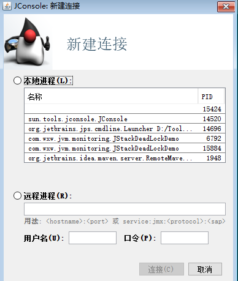 

##### （3）案例：线程死锁监控

- **概览**:以折线图的形式展示了堆内存，线程，类，CPU的使用情况。
- **内存**：不仅展示了堆内存的整体信息，更细化到Eden,Survivor,老年代的使用情况。同事也包括非堆区,Perm的使用情况。还提供了一个“执行GC”按钮，可以强制应用程序执行Full GC.
- **线程**:监视应用程序中线程信息，选中线程还可以跟踪线程的堆栈信息，同时还提供了“检测死锁”功能按钮
- **类**：显示应用程序已加载和已卸载的类信息。
- **VM概述**：展示当前应用程序的运行环境，包括虚拟机类型，版本，虚拟机参数，堆信息等。

具体如下图所示：

  

##### （4）案例：OOM监控

> 代码程序

```java
public class JConsoleMonitorOOMDemo {

    public static void main(String[] args)throws Exception {
        fillHeap(1000);
    }

    static class OOMObject{
        public byte[] placeholder = new byte[64 * 1024];
    }

    public static void fillHeap(int num)throws InterruptedException{
        List<OOMObject> list = new ArrayList<OOMObject>();
        for(int i = 0; i < num; i++){
            //稍作延迟，令监视曲线的变化更加明显
            Thread.sleep(50);
            list.add(new OOMObject());
        }
        System.gc();
    }
}
```

**运行情况监控** 

 

但是监视范围扩大至整个堆后，会发现曲线是一条向上增长的平滑曲线。并且从柱状图可以看出，在1000次循环执行结束，运行了System.gc()后；虽然整个新生代Eden和Survivor区基本都被清空了，但是代表老年代的柱状图仍然保持巅峰值状态，说明被填充进堆中的数据在System.gc()方法执行之后仍然存活。但是有两个问题：

1. 虚拟机启动参数只限制了Java堆为100MB，没有指定-Xmn参数，能否从监控图中估计出新生代有多大？

   上图显示Eden空间为69952KB，因为没有设置-XX：SurvivorRadio参数，所以Eden与Survivor空间比例默认值为8:1，整个新生代空间大约为69952KB*125%=34160KB

2. 为何执行了System.gc()之后，上面的图老年代依然显示巅峰值状态，代码需要做何调整才能让System.gc()回收掉填充到堆中的对象？

   执行完System.gc()之后，空间未能回收是因为List<OOMObject> list对象仍然存活，fillHeap()方法仍然没有退出，因此list对象在System.gc()执行时仍然处于作用域之内，如果把System.gc()移动到fillHeap()方法之外调用就可以回收掉全部内存。

**相关文章** 

1. [可视化工具——JConsole](https://blog.csdn.net/u013132035/article/details/78312226) 

#### :two:JVisualVM:性能监控工具

visual vm是一个功能强大的多合一的故障诊断和性能监控的可视化工具，使用visual vm可以代替jstat,jmap,jhat,jstack甚至替代jconsole

- **使用命令**：`jvisualvm`启动Visual VM. 或者在bin目录下双击

> 通过插件扩展支持，VisualVM可以做到

 

> **生成、浏览堆转储快照** 

 

> 分析程序性能：在profiler 标签，提供了程序运行期间方法级的CPU执行时间分析及内存分析，对程序性能有一定的影响，不建议在生产环境使用

> BTrace 动态日志跟踪：打印调用堆栈、参数、返回值、性能监视、定位连接泄漏、解决多线程竞争问题等

##### （1）连接程序

Visual VM支持多种方式连接应用程序：

- 本地连接： 在本地计算机正在运行的java程序。
- 远程连接： 支持jmx和jstatd方式操作远程连接。具体的配置方式前文都已介绍到。

**（2）监控应用程序** 

选中了应用程序之后，即可看到监控的页面如下图：

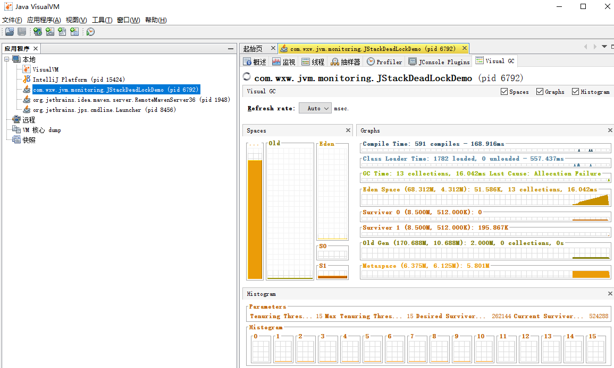 

- **概览**:主要包含了进程ID,MainClass,启动参数;JVM参数和系统属性等信息。
- **监视**：主要包含了CPU,内存（堆，Perm）,类，线程的使用情况折线图。还提供了“执行垃圾回收”和“堆Dump”按钮来强制执行Full GC和生成堆快照文件。
- **线程**：提供线程的详细信息，还可以**检测到死锁**，提供“线程Dump”按钮，相当于执行jstack，导出当前线程的信息

- **抽样器**:它有CPU和内存两个**性能采样器**，用于实时的监控程序信息。根据这个功能可以简单的定位到系统中最消耗资源的函数。
- **profiler** 

> **Visual VM 的 BTrace插件** 

BTrace是一款非常有意思的工具，它可以在不停机的情况下，通过字节码注入动态的监控系统的运行情况，它可以跟踪方法的调用，构造函数调用和系统内存等信息。

## 调优案例分析与实战

### 案例分析

#### :one:高性能硬件上的程序部署策略


### 性能调优

#### 堆内存分析工具

内存问题排查起来相对比CPU麻烦一些，场景也比较多。主要包括OOM、GC问题和堆外内存。一般来讲，我们会先用`free`命令先来检查一发内存的各种情况。

- 内存问题大多还都是堆内内存问题。表象上主要分为OOM和StackOverflow。

#### _OOM

#### _**Stack Overflow** 

**分析过程** ：

1. 关于OOM和StackOverflow的代码排查方面，我们一般使用JMAP`jmap -dump:format=b,file=filename pid`来导出dump文件  
2. 通过mat(Eclipse Memory Analysis Tools)导入dump文件进行分析，内存泄漏问题一般我们直接选Leak Suspects即可，mat给出了内存泄漏的建议。另外也可以选择Top Consumers来查看最大对象报告。和线程相关的问题可以选择thread overview进行分析。除此之外就是选择Histogram类概览来自己慢慢分析，大家可以搜搜mat的相关教程。


- mat
- jmap

> **堆内存OOM分析案例** 

1. [排查堆内存溢出](https://mp.weixin.qq.com/s/7XGD-Z3wrThv5HyoK3B8AQ) 

#### 栈内存分析工具

#### _使用jstack分析cpu问题

**分析过程：** 

1. 先用ps命令找到对应进程的pid(如果你有好几个目标进程，可以先用top看一下哪个占用比较高) 
2. 用`top -H -p pid`来找到cpu使用率比较高的一些线程
3. 将占用最高的pid转换为16进制`printf '%x\n' pid`得到nid 
4. 直接在jstack中找到相应的堆栈信息`jstack pid |grep 'nid' -C5 –color` 
5. `cat jstack.log | grep "java.lang.Thread.State" | sort -nr | uniq -c`来对jstack的状态有一个整体的把握 

> **栈内存分析案例**

1. [**业务逻辑问题(死循环)、频繁gc**以及**上下文切换过多**](https://blog.csdn.net/qq_41893274/article/details/108901595)  
2. [CPU打到100%](https://mp.weixin.qq.com/s/roEMz-5tzBZvGxbjq8NhOQ) 

#### _频繁GC

使用**jstat -gc pid 1000**命令来对gc分代变化情况进行观察

- 1000表示采样间隔(ms)
- S0C/S1C、S0U/S1U、EC/EU、OC/OUMC/MU分别代表两个Survivor区、Eden区、老年代、元数据区的容量和使用
- YGC/YGT、FGC/FGCT、GCT则代表YoungGc、FullGc的耗时和次数以及总耗时

> GC分析案例

1. [排查YGC问题](https://mp.weixin.qq.com/s/LRx9tLtx1tficWPvUWUTuQ) 

#### _上下文切换

- **vmstat** - 内存，进程和分页等的简要信息。
- **iostat** - CPU统计信息，设备和分区的输入/输出统计信息

### 经典问题

#### 1. Java heap space

##### （1）背景介绍

> 案例分析

```java
       /**
         * 创建一个插入对象为一亿，误报率为0.01%的布隆过滤器
         */
        BloomFilter<CharSequence> bloomFilter = 
                                 BloomFilter.create(Funnels.stringFunnel(Charset.forName("utf-8")), 100000000, 0.0001);
        bloomFilter.put("121");
        bloomFilter.put("122");
        bloomFilter.put("123");
        System.out.println(bloomFilter.mightContain("121"));
```

- 异常提示

```java
Exception in thread "main" java.lang.OutOfMemoryError: Java heap space
	at java.util.concurrent.atomic.AtomicLongArray.<init>(AtomicLongArray.java:81)
	at com.google.common.hash.BloomFilterStrategies$LockFreeBitArray.<init>(BloomFilterStrategies.java:158)
	at com.google.common.hash.BloomFilter.create(BloomFilter.java:429)
	at com.google.common.hash.BloomFilter.create(BloomFilter.java:405)
	at com.google.common.hash.BloomFilter.create(BloomFilter.java:379)
	at com.wxw.common.bloomfilter.BloomFilterTools.main(BloomFilterTools.java:19)
```

- 问题分析

 在 JVM 中如果98%的时间是用于 GC(Garbage Collection) 且可用的 Heap size 不足2%的时候将抛出异常信息：

` java.lang.OutOfMemoryError: Java heap space。 ` 所以产生这个异样的原因通常有两种：

1. 程序中出现了死循环
2. 程序占用内存太多，超过了 JVM 堆设置的最大值

##### （2）解决方案与分析

- 对于第一种需要根据jdk分析工具，找对应的代码分析，具体方案可以参考 [文章](https://blog.csdn.net/qq_41893274/article/details/108901595) 
- 第二种问题处理方案：我们手工扩大JVM堆的参数设置

**Jvm 堆的设置**： 是指Java程序运行过程中JVM可以调配使用的内存空间的设置

在 JVM 启动时，JVM 会自动设置 heap size 值。通常情况下，初始空间（-Xms）默认值是物理内存的1/64，最大空间是物理内存的1/4，可以利用JVM 提供的 ` -Xmn、 -Xms 、 -Xmx ` 等选项进行设置。

```xml
-Xms：初始值 
-Xmx：最大值 
-Xmn：最小值 
```

Heap Size 设置不宜太大，也不宜太小。设置太大程序的响应速度就会变慢了，因为GC占用了更多的时间，这样应用分配到的执行时间就会越少，太大也会造成空间的浪费，而且也会影响其它程序的正常运行。

- Heap Size 最大最好不要超过可用物理内存的80%，建议将 ` -Xms 和 -Xmx` 选项设置为相同，而·` -Xmn` 为 1/4的` -Xmx` 值

**设置方法如下：** 

1. 在执行Java类文件时，加上这个参数

   ```java
   java -Xms32m -Xmx800m className 
   ```

   如果是开发测试，则可以设置环境参数：` VM arguments 中输入-Xms32m -Xmx800m这个参数` 

2. 可以在windows 更改系统环境变量加上 ` JAVA_OPTS=-Xms64m -Xmx512` 

3. 如果用的tomcat则windows下的 tomcat目录下catalina.bat 文件设置 ` set JAVA_OPTS=-Xms64m -Xmx256m` 

   位置在: rem Guess CATALINA_HOME if not defined 这行的下面加合适

4. 如果是Linux系统则设置如下

   ```java
   在{tomcat_home}/bin/catalina.sh的前面，加 set JAVA_OPTS='-Xms64 -Xmx512'
   ```

## 高并发

> 为什么需要高并发编程？

1. 基于软件CPU运算速度远远大于基于磁盘I/O、网络通讯和数据库访问内存的速度，为了充分的利用CPU处理能力，降低硬件与软件之间的鸿沟，引入了缓存，但是也带来了新的问题：**缓存一致性** 

### Java 内存模型和线程

基于高速缓存的存储交互很好地解决了处理器与内存的速度矛盾，但是也引入了新的问题:缓存一-致性(CacheCoherence)。在多处理器系统中，每个处理器都有自己的高速缓存，而它们又共享同一主内存(Main Memory)，如图12-1所示。当多个处理器的运算任务都涉及同一块主内存区域时，将可能导致各自的缓存数据不--致的情况，如果真的发生这种情况，那同步回到主内存时以谁的缓存数据为准呢?为了解决-一致性
的问题，需要各个处理器访问缓存时都遵循一.些协议，在读写时要根据协议来进行操作，这类协议有MSI、MESI ( llinois Protocol)、 MOSI、 Synapse、 Firefly 及DragonProtocol，等等。Java虚拟机内存模型中定义的内存访问操作与硬件的缓存访问操作是具有可比性的。

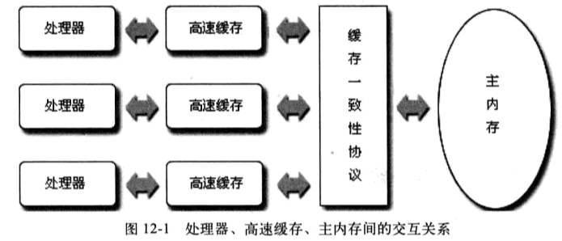 

除此之外，为了使得处理器内部的运算单元能尽量被充分利用，处理器可能会对输入代码进行乱序执行(Out-Of-Order Execution)优化，处理器会在计算之后将乱序执行的结果重组，保证该结果与顺序执行的结果是--致的，但并不保证程序中各个语句计算的先后顺序与输入代码中的顺序--致，因此如果存在一一个计算任务依赖另外一个计算任务的中间结果，那么其顺序性并不能靠代码的先后顺序来保证。与处理器的乱序执行优化类似，Java虚拟机的即时编译器中也有类似的**指令重排序(InstructionReorder)优化**。 

#### 1. Java 内存模型

Java虚拟机规范中试图定义一种Java内存模型”(Java Memory Model, JMM)来屏蔽掉各种硬件和操作系统的内存访问差异，以实现让Java程序在各种平台下都能达到一致的并发效果。

##### （1）主内存与工作内存

**Java内存模型规定**：了所有的变量都存储在主内存(MainMemory)中每条线程还有自己的工作内存( Working Memory,  线程的工作内存中保存了被该线程使用到的变量的主内存副本拷贝，线程对变量的所有操作(读取、赋值等)都必须在工作内存中进行，而不能直接读写主内存中的变量°。不同的线程之间也无法直接访问对方工作内存中的变量，线程间变量值的传递均需要通过主内存来完成，线程、主内存、工作内存三者的交互关系如图12-2所示。

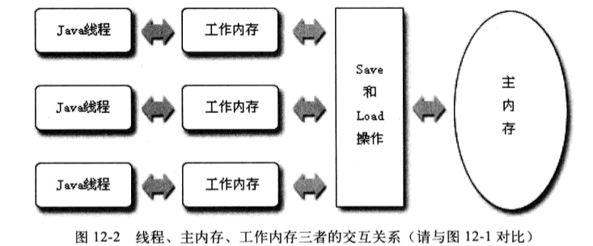 

这里所讲的主内存、工作内存与本书第2章所讲的Java内存区域中的Java堆、栈、方法区等并不是同一个层次的内存划分。如果两者一定要勉强对应起来，那从变量、主内存、工作内存的定义来看，

- **主内存主要对应于Java堆中对象的实例数据部分**”，
- 工作内存则对应于虚拟机栈中的部分区域。

从更低的层次来说

- 主内存就是硬件的内存，而为了获取更好的运行速度，虚拟机及硬件系统可能会让工作内存优先存储于寄存器和高速缓存中。

##### （2）内存间的交互操作

关于王内仔与工作内仔之旧具体的父互协议，即一个变量如何从主内存拷贝到工作内存、如何从工作内存同步回主内存之类的实现细节，Java 内存模型中定义了以下八种操作来完成”:

- lock (锁定):作用于主内存的变量，它把一个变量标识为一条线程独占的状态。
- unlock (解锁):作用于主内存的变量，它把一个处于锁定状态的变量释放出来，释放后的变量才可以被其他线程锁定。
- read(读取):作用于主内存的变量，它把一个变量的值从主内存传输到线程的工作内存中，以便随后的load动作使用。
- load(载入):作用于工作内存的变量，它把read操作从主内存中得到的变量值放入工作内存的变量副本中。
- use (使用):作用于工作内存的变量，它把工作内存中一个变量的值传递给执行引擎，每当虚拟机遇到一个需要使用到变量的值的字节码指令时将会执行这个操作。
- assign(赋值):作用于工作内存的变量，它把一个从执行引擎接收到的值赋值给工作内存的变量，每当虛拟机遇到一个给变量赋值的字节码指令时执行这个操作。
- store (存储):作用于工作内存的变量，它把工作内存中一个变量的值传送到主内存中，以便随后的write操作使用。
- write (写入):作用于主内存的变量，它把store操作从工作内存中得到的变量的值放入主内存的变量中。

如果要把一个变量从主内存复制到工作内存，那就要按顺序地执行read和load操作，如果要把变量从工作内存同步回主内存，就要按顺序地执行store和write操作。注意，Java内存模型只要求上述两个操作必须按顺序执行，而没有保证必须是连续执行。也就是说read与load之间、store与write之间是可插入其他指令的，如对主内存中的变量a、b进行访问时，一种可能出现的顺序是read a、read b、load b、load a。除此之外，Java内存模型还规定了在执行上述八种基本操作时必须满足如下规则:具体参见《Java 虚拟机》

比如：

- 不允许read和load、store和write操作之--单独出现，即不允许一个变量从主内存读取了但工作内存不接受，或者从工作内存发起回写了但主内存不接受的情况出现。

##### （3）Volatile 特殊规则

- 线程之间的可见性
- 不支持原子性
- 有序性，禁止指令重排序

##### （4）先行先发生

**happens-before 原则** 

- 程序次序规则(Program Order Rule):在-一个线程内，按照程序代码顺序，书写在前面的操作先行发生于书写在后面的操作。准确地说应该是控制流顺序而不是程序代码顺序，因为要考虑分支、循环等结构。
- 管程锁定规则(Monitor Lock Rule):一个unlock操作先行发生于后面对同一个锁的lock操作。这里必须强调的是同一个锁，而“后面”是指时间上的先后顺序。
- volatile变量规则( Volatile Variable Rule):对一个volatile 变量的写操作先行发生于后面对这个变量的读操作，这里的“后面”同样是指时间上的先后顺序。
- 线程启动规则(Thread Start Rule) : Thread 对象的start()方法先行发生于此线程的每-一个动作。
- 线程终止规则(Thread Termination Rule) :线程中的所有操作都先行发生于对此线程的终止检测，我们可以通过Thread.join()方法结束、Thread.isAlive() 的返回值等手段检测到线程已经终止执行。
- 线程中断规则(Thread Interruption Rule) :对线程interrupt()方法的调用先行发生于被中断线程的代码检测到中断事件的发生，可以通过Thread.interruptedO方法检测到是否有中断发生。
- 对象终结规则(Finalizer Rule) :一个对象的初始化完成( 构造函数执行结束)先行发生于它的finalize() 方法的开始。
- 传递性(Transitivity) :如果操作A先行发生于操作B，操作B先行发生于操作C那就可以得出操作A先行发生于操作C的结论。

Java语言无须任何同步手段保障就能成立的先行发生规则就只有上面这些了,

#### 2. Java 与线程

实现线程主要有三种方式

- 使用内核线程实现
- 使用用户线程实现
- 使用用户线程加轻量级进程混合实现。

##### （1）线程的状态转换

Java语言定义了5种进程状态，在任意-一个时间点中，一个进程只能有且只有其中的一-种状态，这5种状态分别是:

- **新建(New**):创建后尚未启动的线程处于这种状态。
- **运行(Runable)**:Runable包括了操作系统线程状态中的Running和Ready，也就是处于此状态的线程有可能正在执行，也有可能正在等待着CPU为它分配执行时间。
- **无限期等待(Waiting)**:处于这种状态的进程不会被分配CPU执行时间，它们要等待被其他线程显式地唤醒。以下方法会让线程陷入无限期的等待状态:
  - 没有设置Timeout参数的Object.wait()方法。
  - 没有设置Timeout参数的Thread.join() 方法。
  - LockSupport.park()方法。
- **限期等待(TimedWaitting):**处于这种状态的进程也不会被分配CPU执行时间，不过无须等待被其他线程显式地唤醒，在--定时间之后它们会由系统自动唤醒。以下方法会让线程进入限期等待状态:
  - Thread.sleep()方法。
  - 设置了Timeout参数的Object.wait()方法。
  - 设置了Timeout参数的Thread.join()方法。
  - LockSupport.parkNanos()方法。
  - LockSupport.parkUntil()方法。
- **阻塞(Blocked) :**进程被阻塞了，“阻塞状态”与“等待状态”的区别是:“阻塞状态”在等待着获取到一个排它锁，这个事件将在另外一个线程放弃这个锁的时候发生:而“等待状态”则是在等待一段时间，或者唤醒动作的发生。在程序等待进入同步区域的时候，线程将进入这种状态。
- **结束(Terminated**) :已终止线程的线程状态，线程已经结束执行。

上述5种状态在遇到特定事件发生的时候将会互相转换，它们的转换关系如图12-6,

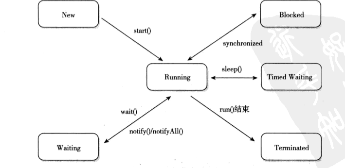 

### 线程安全和锁优化

#### 1. 锁优化

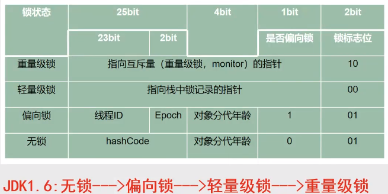

##### （1）偏向锁

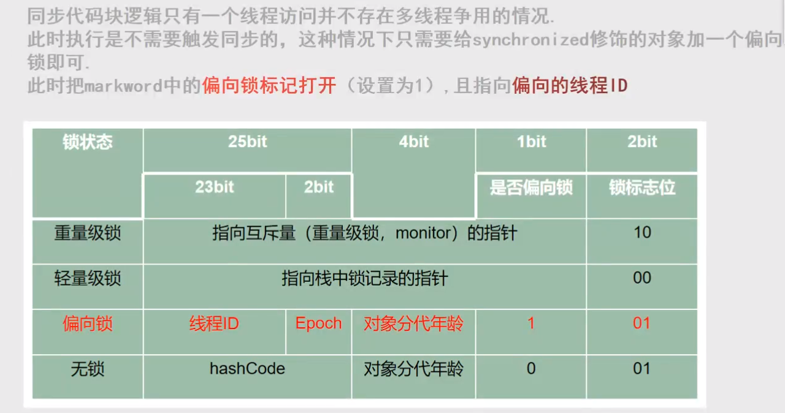 

##### （2）轻量级锁

> **轻量级锁**：并不是用来代替重量级锁的，它的本意是在没有多线程竞争的前提下，减少传统的重量级锁使用操作系统互斥量产生的性能消耗。

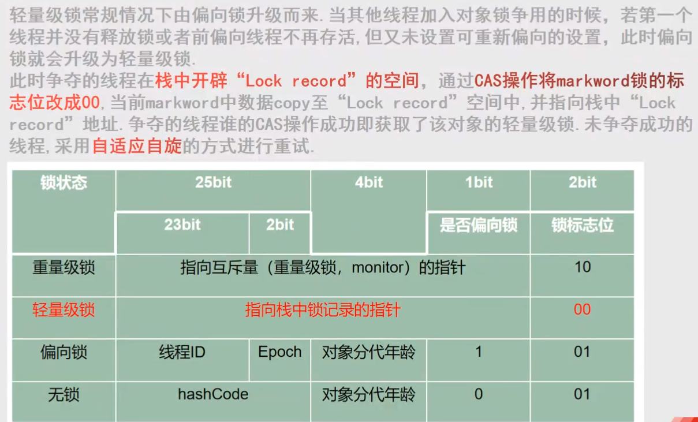 

HotSpot 虚拟机的对象头(ObjectHeader)分为两部分信息

- 第一部分用于存储对象自身的运行时数据，如哈希码(HashCode)、GC分代年龄(Generational GC Age)等，这部分数据的长度在32位和64位的虚拟机中分别为32个和64个Bits，官方称它为“Mark Word”，它是实现轻量级锁和偏向锁的关键。
- 另外一部分用于存储指向方法区对象类型数据的指针，如果是数组 对象的话，还会有一个额外的部分用于存储数组长度，如下图所示：

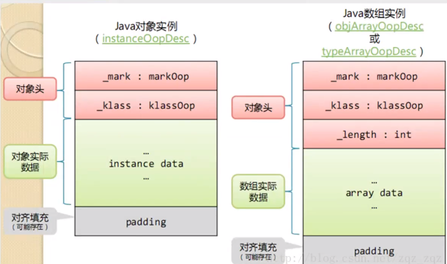 

MarkWord被设计成--个非固定的数据结构以便在极小的空间内存储尽量多的信息，它会根据对象的状态复用自己的存储空间。例如在32位的HotSpot虚拟机中对象未被锁定的状态下，MarkWord的32个Bits空间中的

- 25Bits用于存储对象哈希码(HashCode)，
- 4Bits 用于存储对象分代年龄，
- 2Bits 用于存储锁标志位，
- 1Bit 固定为0，在其他状态(轻量级锁定、重量级锁定、GC标记、可偏向)下对象的存储内容如表

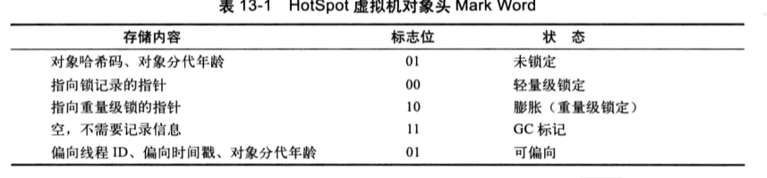 

**偏向锁升级轻量级锁过程**   

1. 在代码进入同步块的时候，如果此同步对象没有被锁定(锁标志位为“01”状态)【没有设置偏向锁标志】，则开始升级为轻量级锁，虚拟机首先将在当前线程的栈帧中建立一个名为锁记录(LockRecord)的空间，用于存储锁对象目前的MarkWord的拷贝(官方把这份拷贝加了一个Displaced前缀，即DisplacedMark Word),这时候线程堆栈与对象头的状态如图13-3 所示。

   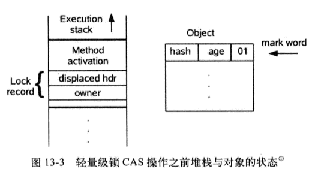 

2. 然后，虚拟机将使用CAS操作尝试将对象的MarkWord更新为指向LockRecord的指针。如果这个更新动作成功了，那么这个线程就拥有了该对象的轻量级锁，并且对象MarkWord的锁标志位(Mark Word的最后两个Bits)将转变为“00”， 即表示此对象处于轻量级锁定的状态，这时候线程堆栈与对象头的状态如图13-4所示。.

   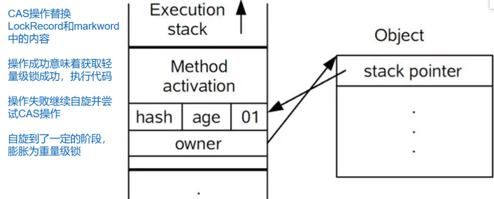 

如果这个更新操作失败了，虚拟机首先会检查对象的MarkWord是否指向当前线程的栈帧，

- 如果是就说明当前线程已经拥有了这个对象的锁，可以直接进入同步块继续执行
- 否则说明这个锁对象已经被其他线程抢占了。

如果有两条以上的线程争用同一个锁，那轻量级锁就不再有效，要膨胀为重量级锁，锁标志的状态值变为“10”，Mark Word中存储的就是指向重量级锁( 互斥量)的指针，后面等待锁的线程也要进人阻塞状态。

 

##### （3）重量级锁

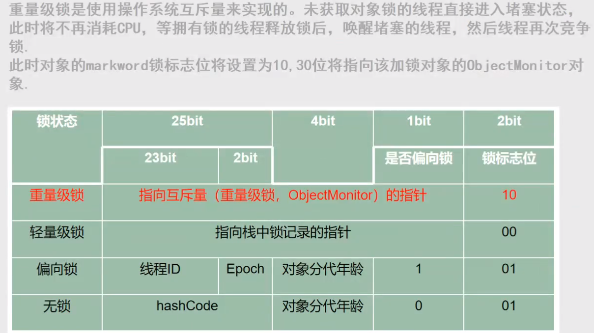 

**ObjectMonitor 对象 实现重量级锁**  

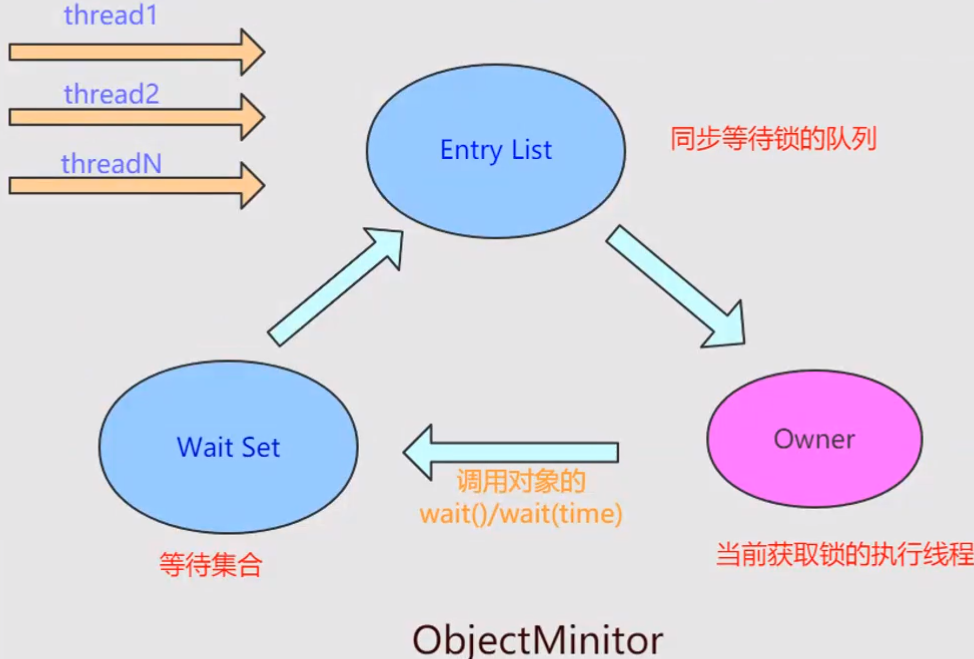 

#### 2. 锁升级流程

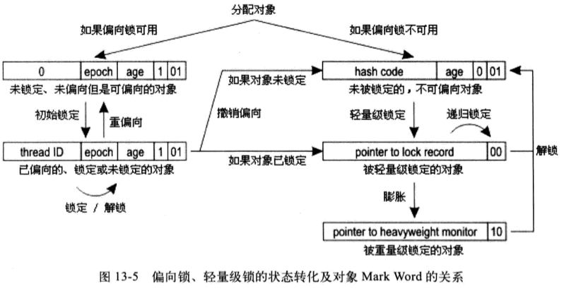 

- 偏向锁打开偏向设置（01）有效，则为偏向锁，否则偏向未设置或者无效，升级为轻量级锁
- 偏向锁使用cas升级轻量级锁失败，则使用自适应性自旋，等超过指定次数后，升级为重量级锁
- 当轻量级锁有两个或两个以上等线程竞争时，cas升级为重量级锁，并且markword中的30位指向objectmonitor互斥量，阻塞执行

## 拓展题目

1. JVM 调优有什么实际意义？


## 优秀文章

1. [程序员那些事](http://www.flydean.com/java-jvm-all-in-one/)  


