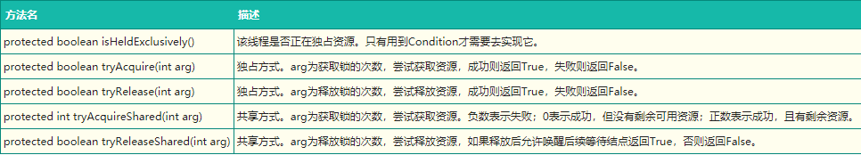
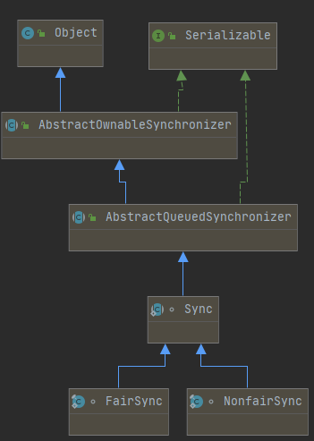
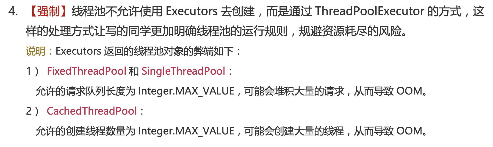
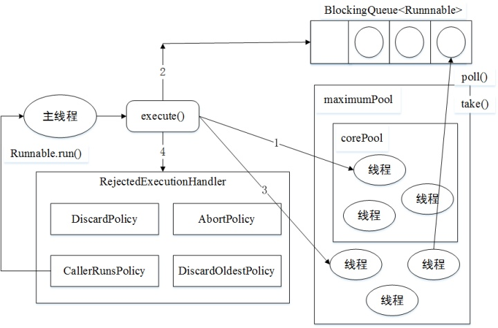

## Java 8 阅读手册


## java.util.concurrent

### 1. locks

#### 1.1 AbstractQueuedSynchronizer

##### 前言

Java中的大部分同步类（Lock、Semaphore、ReentrantLock等）都是基于AbstractQueuedSynchronizer（简称为AQS）实现的。AQS是一种提供了原子式管理同步状态、阻塞和唤醒线程功能以及队列模型的简单框架。本文会从应用层逐渐深入到原理层，并通过ReentrantLock的基本特性和ReentrantLock与AQS的关联，来深入解读AQS相关独占锁的知识点，同时采取问答的模式来帮助大家理解AQS。由于篇幅原因，本篇文章主要阐述AQS中独占锁的逻辑和Sync Queue，不讲述包含共享锁和Condition Queue的部分（本篇文章核心为AQS原理剖析，只是简单介绍了ReentrantLock，感兴趣同学可以阅读一下ReentrantLock的源码）。

下面列出本篇文章的大纲和思路，以便于大家更好地理解：

 

##### ReentrantLock

> **ReentrantLock 特性**

ReentrantLock意思为可重入锁，指的是一个线程能够对一个临界资源重复加锁。为了帮助大家更好地理解ReentrantLock的特性，我们先将ReentrantLock跟常用的Synchronized进行比较，其特性如下（蓝色部分为本篇文章主要剖析的点）：

 

下面通过伪代码，进行更加直观的比较：

```java
// **************************Synchronized的使用方式**************************
// 1.用于代码块
synchronized (this) {}
// 2.用于对象
synchronized (object) {}
// 3.用于方法
public synchronized void test () {}
// 4.可重入
for (int i = 0; i < 100; i++) {
	synchronized (this) {}
}
// **************************ReentrantLock的使用方式**************************
public void test () throw Exception {
	// 1.初始化选择公平锁、非公平锁
	ReentrantLock lock = new ReentrantLock(true);
	// 2.可用于代码块
	lock.lock();
	try {
		try {
			// 3.支持多种加锁方式，比较灵活; 具有可重入特性
			if(lock.tryLock(100, TimeUnit.MILLISECONDS)){ }
		} finally {
			// 4.手动释放锁
			lock.unlock()
		}
	} finally {
		lock.unlock();
	}
}
```

> ReentrantLock与AQS的关联

通过上文我们已经了解，ReentrantLock支持公平锁和非公平锁（关于公平锁和非公平锁的原理分析，可参考《[不可不说的Java“锁”事](https://mp.weixin.qq.com/s?__biz=MjM5NjQ5MTI5OA==&mid=2651749434&idx=3&sn=5ffa63ad47fe166f2f1a9f604ed10091&chksm=bd12a5778a652c61509d9e718ab086ff27ad8768586ea9b38c3dcf9e017a8e49bcae3df9bcc8&scene=38#wechat_redirect)》），并且ReentrantLock的底层就是由AQS来实现的。那么ReentrantLock是如何通过公平锁和非公平锁与AQS关联起来呢？ 我们着重从这两者的加锁过程来理解一下它们与AQS之间的关系（加锁过程中与AQS的关联比较明显，解锁流程后续会介绍）。

非公平锁源码中的加锁流程如下：

```java
// java.util.concurrent.locks.ReentrantLock#NonfairSync

// 非公平锁
static final class NonfairSync extends Sync {
	...
	final void lock() {
		if (compareAndSetState(0, 1))
			setExclusiveOwnerThread(Thread.currentThread());
		else
			acquire(1);
		}
  ...
}
```

这块代码的含义为：

- 若通过CAS设置变量State（同步状态）成功，也就是获取锁成功，则将当前线程设置为独占线程。
- 若通过CAS设置变量State（同步状态）失败，也就是获取锁失败，则进入Acquire方法进行后续处理。

第一步很好理解，但第二步获取锁失败后，后续的处理策略是怎么样的呢？这块可能会有以下思考：

某个线程获取锁失败的后续流程是什么呢？有以下两种可能：

1. 将当前线程获锁结果设置为失败，获取锁流程结束。这种设计会极大降低系统的并发度，并不满足我们实际的需求。所以就需要下面这种流程，也就是AQS框架的处理流程。
2.  存在某种排队等候机制，线程继续等待，仍然保留获取锁的可能，获取锁流程仍在继续。

再看下公平锁源码中获锁的方式：

```java
// java.util.concurrent.locks.ReentrantLock#FairSync

static final class FairSync extends Sync {
  ...  
	final void lock() {
		acquire(1);
	}
  ...
}
```

看到这块代码，我们可能会存在这种疑问：Lock函数通过Acquire方法进行加锁，但是具体是如何加锁的呢？

结合公平锁和非公平锁的加锁流程，虽然流程上有一定的不同，但是都调用了Acquire方法，而Acquire方法是FairSync和UnfairSync的父类AQS中的核心方法。

对于上边提到的问题，其实在ReentrantLock类源码中都无法解答，而这些问题的答案，都是位于Acquire方法所在的类AbstractQueuedSynchronizer中，也就是本文的核心——AQS。下面我们会对AQS以及ReentrantLock和AQS的关联做详细介绍（相关问题答案会在2.3.5小节中解答）。

##### AQS

首先，我们通过下面的架构图来整体了解一下AQS框架：


- 上图中有颜色的为Method，无颜色的为Attribution。
- 总的来说，AQS框架共分为五层，自上而下由浅入深，从AQS对外暴露的API到底层基础数据。

下面我们会从整体到细节，从流程到方法逐一剖析AQS框架，主要分析过程如下：


> 原理概览

AQS核心思想是，如果被请求的共享资源空闲，那么就将当前请求资源的线程设置为有效的工作线程，将共享资源设置为锁定状态；如果共享资源被占用，就需要一定的阻塞等待唤醒机制来保证锁分配。这个机制主要用的是CLH队列的变体实现的，将暂时获取不到锁的线程加入到队列中。

CLH：Craig、Landin and Hagersten队列，是单向链表，AQS中的队列是CLH变体的虚拟双向队列（FIFO），AQS是通过将每条请求共享资源的线程封装成一个节点来实现锁的分配。

主要原理图如下：

 

AQS使用一个Volatile的int类型的成员变量来表示同步状态，通过内置的FIFO队列来完成资源获取的排队工作，通过CAS完成对State值的修改。

> AQS 数据结构

先来看下AQS中最基本的数据结构——Node，Node即为上面CLH变体队列中的节点。

 

解释一下几个方法和属性值的含义：

| 方法和属性值 | 含义                                                         |
| :----------- | :----------------------------------------------------------- |
| waitStatus   | 当前节点在队列中的状态                                       |
| thread       | 表示处于该节点的线程                                         |
| prev         | 前驱指针                                                     |
| predecessor  | 返回前驱节点，没有的话抛出npe                                |
| nextWaiter   | 指向下一个处于CONDITION状态的节点（由于本篇文章不讲述Condition Queue队列，这个指针不多介绍） |
| next         | 后继指针                                                     |

线程两种锁的模式：

| 模式      | 含义                           |
| :-------- | :----------------------------- |
| SHARED    | 表示线程以共享的模式等待锁     |
| EXCLUSIVE | 表示线程正在以独占的方式等待锁 |

waitStatus有下面几个枚举值：

| 枚举      | 含义                                           |
| :-------- | :--------------------------------------------- |
| 0         | 当一个Node被初始化的时候的默认值               |
| CANCELLED | 为1，表示线程获取锁的请求已经取消了            |
| CONDITION | 为-2，表示节点在等待队列中，节点线程等待唤醒   |
| PROPAGATE | 为-3，当前线程处在SHARED情况下，该字段才会使用 |
| SIGNAL    | 为-1，表示线程已经准备好了，就等资源释放了     |

> #### 同步状态State

在了解数据结构后，接下来了解一下AQS的同步状态——State。AQS中维护了一个名为state的字段，意为同步状态，是由Volatile修饰的，用于展示当前临界资源的获锁情况。

```java
// java.util.concurrent.locks.AbstractQueuedSynchronizer
private volatile int state;
```

下面提供了几个访问这个字段的方法：

| 方法名                                                       | 描述                 |
| :----------------------------------------------------------- | :------------------- |
| protected final int getState()                               | 获取State的值        |
| protected final void setState(int newState)                  | 设置State的值        |
| protected final boolean compareAndSetState(int expect, int update) | 使用CAS方式更新State |

这几个方法都是Final修饰的，说明子类中无法重写它们。我们可以通过修改State字段表示的同步状态来实现多线程的独占模式和共享模式（加锁过程）。

  

对于我们自定义的同步工具，需要自定义获取同步状态和释放状态的方式，也就是AQS架构图中的第一层：API层。

> AQS重要方法与ReentrantLock的关联

从架构图中可以得知，AQS提供了大量用于自定义同步器实现的Protected方法。自定义同步器实现的相关方法也只是为了通过修改State字段来实现多线程的独占模式或者共享模式。自定义同步器需要实现以下方法（ReentrantLock需要实现的方法如下，并不是全部）：



一般来说，自定义同步器要么是独占方式，要么是共享方式，它们也只需实现tryAcquire-tryRelease、tryAcquireShared-tryReleaseShared中的一种即可。AQS也支持自定义同步器同时实现独占和共享两种方式，如ReentrantReadWriteLock。ReentrantLock是独占锁，所以实现了tryAcquire-tryRelease。

以非公平锁为例，这里主要阐述一下非公平锁与AQS之间方法的关联之处，具体每一处核心方法的作用会在文章后面详细进行阐述。

- ReentrantLock加锁解锁时API层核心方法的映射关系。

 

##### 通过ReentrantLock 理解AOS

ReentrantLock中公平锁和非公平锁在底层是相同的，这里以非公平锁为例进行分析。

在非公平锁中，有一段这样的代码：

```java
// java.util.concurrent.locks.ReentrantLock

static final class NonfairSync extends Sync {
	...
	final void lock() {
		if (compareAndSetState(0, 1))
			setExclusiveOwnerThread(Thread.currentThread());
		else
			acquire(1);
	}
  ...
}
```

看一下这个Acquire是怎么写的：

```java
// java.util.concurrent.locks.AbstractQueuedSynchronizer

public final void acquire(int arg) {
	if (!tryAcquire(arg) && acquireQueued(addWaiter(Node.EXCLUSIVE), arg))
		selfInterrupt();
}
```

再看一下tryAcquire方法：

```java
// java.util.concurrent.locks.AbstractQueuedSynchronizer

protected boolean tryAcquire(int arg) {
	throw new UnsupportedOperationException();
}
```

可以看出，这里只是AQS的简单实现，具体获取锁的实现方法是由各自的公平锁和非公平锁单独实现的（以ReentrantLock为例）。如果该方法返回了True，则说明当前线程获取锁成功，就不用往后执行了；如果获取失败，就需要加入到等待队列中。下面会详细解释线程是何时以及怎样被加入进等待队列中的。

> 线程加入等待队列

- 加入等待队列的时机

  当执行Acquire(1)时，会通过tryAcquire获取锁。在这种情况下，如果获取锁失败，就会调用addWaiter（）加入到等待队列中去。

> 如何加入到等待队列

获取锁失败后，会执行addWaiter(Node.EXCLUSIVE)加入等待队列，具体实现方法如下：

```java
// java.util.concurrent.locks.AbstractQueuedSynchronizer

 private Node addWaiter(Node mode) {
        //初始化节点,设置关联线程和模式(mode:独占 or 共享)
        Node node = new Node(Thread.currentThread(), mode);
        // Try the fast path of enq; backup to full enq on failure
        // 获取尾节点引用
        Node pred = tail;
        // 如果队尾节点不为null，则说明队列中已经有线程在等待了，那么直接入队尾
        if (pred != null) {
            node.prev = pred;
            // CAS 形式自旋 放入尾结点 // 设置新节点为尾节点
            if (compareAndSetTail(pred, node)) {
                pred.next = node;
                return node;
            }
        }
        // 尾节点为空,说明队列还未初始化,需要初始化head节点并入队新节点
        enq(node);
        return node;
    }


  private final boolean compareAndSetTail(Node expect, Node update) {
        return unsafe.compareAndSwapObject(this, tailOffset, expect, update);
    }
```

主要的流程如下：

- 通过当前的线程和锁模式新建一个节点。
- Pred指针指向尾节点Tail。
- 将New中Node的Prev指针指向Pred。
- 通过compareAndSetTail方法，完成尾节点的设置。这个方法主要是对tailOffset和Expect进行比较，如果tailOffset的Node和Expect的Node地址是相同的，那么设置Tail的值为Update的值。

```java
 static {
        try {
            stateOffset = unsafe.objectFieldOffset(AbstractQueuedSynchronizer.class.getDeclaredField("state"));
            headOffset = unsafe.objectFieldOffset(AbstractQueuedSynchronizer.class.getDeclaredField("head"));
            tailOffset = unsafe.objectFieldOffset(AbstractQueuedSynchronizer.class.getDeclaredField("tail"));
            waitStatusOffset = unsafe.objectFieldOffset(Node.class.getDeclaredField("waitStatus"));
            nextOffset = unsafe.objectFieldOffset(Node.class.getDeclaredField("next"));
        } catch (Exception ex) { throw new Error(ex); }
    }
```

从AQS的静态代码块可以看出，都是获取一个对象的属性相对于该对象在内存当中的偏移量，这样我们就可以根据这个偏移量在对象内存当中找到这个属性。tailOffset指的是tail对应的偏移量，所以这个时候会将new出来的Node置为当前队列的尾节点。同时，由于是双向链表，也需要将前一个节点指向尾节点。

> 如果Pred指针是Null（说明等待队列中没有元素），或者当前Pred指针和Tail指向的位置不同（说明被别的线程已经修改），就需要看一下Enq的方法。

```java
// java.util.concurrent.locks.AbstractQueuedSynchronizer

 private Node enq(final Node node) {
        for (;;) {
            Node t = tail;
            if (t == null) { // Must initialize
                if (compareAndSetHead(new Node()))
                    tail = head;
            } else {
                node.prev = t;
                if (compareAndSetTail(t, node)) {
                    t.next = node;
                    return t;
                }
            }
        }
    }
```

如果没有被初始化，需要进行初始化一个头结点出来。但请注意，初始化的头结点并不是当前线程节点，而是调用了无参构造函数的节点。如果经历了初始化或者并发导致队列中有元素，则与之前的方法相同。其实，addWaiter就是一个在双端链表添加尾节点的操作，需要注意的是，双端链表的头结点是一个无参构造函数的头结点。

总结一下，线程获取锁的时候，过程大体如下：

1. 当没有线程获取到锁时，线程1获取锁成功。
2. 线程2申请锁，但是锁被线程1占有。

 

(1) 如果再有线程要获取锁，依次在队列中往后排队即可

回到上边的代码，hasQueuedPredecessors是公平锁加锁时判断等待队列中是否存在有效节点的方法。如果返回False，说明当前线程可以争取共享资源；如果返回True，说明队列中存在有效节点，当前线程必须加入到等待队列中,（前驱节点）

```java
// java.util.concurrent.locks.ReentrantLock

public final boolean hasQueuedPredecessors() {
	// The correctness of this depends on head being initialized
	// before tail and on head.next being accurate if the current
	// thread is first in queue.
	Node t = tail; // Read fields in reverse initialization order
	Node h = head;
	Node s;
	return h != t && ((s = h.next) == null || s.thread != Thread.currentThread());
}
```

看到这里，我们理解一下h != t && ((s = h.next) == null || s.thread != Thread.currentThread());为什么要判断的头结点的下一个节点？第一个节点储存的数据是什么？

> 双向链表中，第一个节点为虚节点，其实并不存储任何信息，只是占位。真正的第一个有数据的节点，是在第二个节点开始的。
>
> 1. 当h != t时： 如果(s = h.next) == null，等待队列正在有线程进行初始化，但只是进行到了Tail指向Head，没有将Head指向Tail，此时队列中有元素，需要返回True（这块具体见下边代码分析）。
> 2.  如果(s = h.next) != null，说明此时队列中至少有一个有效节点。
>
> - 如果此时s.thread == Thread.currentThread()，说明等待队列的第一个有效节点中的线程与当前线程相同那么当前线程是可以获取资源的；
> - 如果s.thread != Thread.currentThread()，说明等待队列的第一个有效节点线程与当前线程不同，当前线程必须加入进等待队列

```java
// java.util.concurrent.locks.AbstractQueuedSynchronizer#enq

if (t == null) { // Must initialize
	if (compareAndSetHead(new Node()))
		tail = head;
} else {
	node.prev = t;
	if (compareAndSetTail(t, node)) {
		t.next = node;
		return t;
	}
}
```

节点入队不是原子操作，所以会出现短暂的head != tail，此时Tail指向最后一个节点，而且Tail指向Head。如果Head没有指向Tail（可见5、6、7行），这种情况下也需要将相关线程加入队列中。所以这块代码是为了解决极端情况下的并发问题。

> 等待队列中线程出队列的时机

回到最初的源码：

```java
// java.util.concurrent.locks.AbstractQueuedSynchronizer

public final void acquire(int arg) {
	if (!tryAcquire(arg) && acquireQueued(addWaiter(Node.EXCLUSIVE), arg))
		selfInterrupt();
}
```

上文解释了addWaiter方法，这个方法其实就是把对应的线程以Node的数据结构形式加入到双端队列里，返回的是一个包含该线程的Node。而这个Node会作为参数，进入到acquireQueued方法中。acquireQueued方法可以对排队中的线程进行“获锁”操作。

总的来说，一个线程获取锁失败了，被放入等待队列，acquireQueued会把放入队列中的线程不断去获取锁，直到获取成功或者不再需要获取（中断）。

下面我们从“何时出队列？”和“如何出队列？”两个方向来分析一下acquireQueued源码：

```java
// java.util.concurrent.locks.AbstractQueuedSynchronizer

final boolean acquireQueued(final Node node, int arg) {
	// 标记是否成功拿到资源
	boolean failed = true;
	try {
		// 标记等待过程中是否中断过
		boolean interrupted = false;
		// 开始自旋，要么获取锁，要么中断
		for (;;) {
			// 获取当前节点的前驱节点
			final Node p = node.predecessor();
			// 如果p是头结点，说明当前节点在真实数据队列的首部，就尝试获取锁（别忘了头结点是虚节点）
			if (p == head && tryAcquire(arg)) {
				// 获取锁成功，头指针移动到当前node
				setHead(node);
				p.next = null; // help GC
				failed = false;
				return interrupted;
			}
			// 说明p为头节点且当前没有获取到锁（可能是非公平锁被抢占了）或者是p不为头结点，
            // 这个时候就要判断当前node是否要被阻塞（被阻塞条件：前驱节点的waitStatus为-1），
            // 防止无限循环浪费资源。具体两个方法下面细细分析
			if (shouldParkAfterFailedAcquire(p, node) && parkAndCheckInterrupt())
				interrupted = true;
		}
	} finally {
		if (failed)
			cancelAcquire(node);
	}
}
```

注：setHead方法是把当前节点置为虚节点，但并没有修改waitStatus，因为它是一直需要用的数据。

```java
// java.util.concurrent.locks.AbstractQueuedSynchronizer

private void setHead(Node node) {
	head = node;
	node.thread = null;
	node.prev = null;
}

// java.util.concurrent.locks.AbstractQueuedSynchronizer

// 靠前驱节点判断当前线程是否应该被阻塞
private static boolean shouldParkAfterFailedAcquire(Node pred, Node node) {
	// 获取头结点的节点状态
	int ws = pred.waitStatus;
	// 说明头结点处于唤醒状态
	if (ws == Node.SIGNAL)
		return true; 
	// 通过枚举值我们知道waitStatus>0是取消状态
	if (ws > 0) {
		do {
			// 循环向前查找取消节点，把取消节点从队列中剔除
			node.prev = pred = pred.prev;
		} while (pred.waitStatus > 0);
		pred.next = node;
	} else {
		// 设置前任节点等待状态为SIGNAL
		compareAndSetWaitStatus(pred, ws, Node.SIGNAL);
	}
	return false;
}
```

parkAndCheckInterrupt主要用于挂起当前线程，阻塞调用栈，返回当前线程的中断状态。

```java
// java.util.concurrent.locks.AbstractQueuedSynchronizer

private final boolean parkAndCheckInterrupt() {
    LockSupport.park(this);
    return Thread.interrupted();
}
```

上述方法的流程图如下：

 

从上图可以看出，跳出当前循环的条件是当“前置节点是头结点，且当前线程获取锁成功”。为了防止因死循环导致CPU资源被浪费，我们会判断前置节点的状态来决定是否要将当前线程挂起，具体挂起流程用流程图表示如下（shouldParkAfterFailedAcquire流程）：

 

从队列中释放节点的疑虑打消了，那么又有新问题了：

- shouldParkAfterFailedAcquire中取消节点是怎么生成的呢？什么时候会把一个节点的waitStatus设置为-1？
- 是在什么时间释放节点通知到被挂起的线程呢？

> CANCELLED 状态节点生成

acquireQueued方法中的Finally代码：

```java
// java.util.concurrent.locks.AbstractQueuedSynchronizer

final boolean acquireQueued(final Node node, int arg) {
	boolean failed = true;
	try {
    ...
		for (;;) {
			final Node p = node.predecessor();
			if (p == head && tryAcquire(arg)) {
				...
				failed = false;
        ...
			}
			...
	} finally {
		if (failed)
			cancelAcquire(node);
		}
}
```

通过cancelAcquire方法，将Node的状态标记为CANCELLED。接下来，我们逐行来分析这个方法的原理：

```java
// java.util.concurrent.locks.AbstractQueuedSynchronizer

private void cancelAcquire(Node node) {
  // 将无效节点过滤
	if (node == null)
		return;
  // 设置该节点不关联任何线程，也就是虚节点
	node.thread = null;
	Node pred = node.prev;
  // 通过前驱节点，跳过取消状态的node
	while (pred.waitStatus > 0)
		node.prev = pred = pred.prev;
  // 获取过滤后的前驱节点的后继节点
	Node predNext = pred.next;
  // 把当前node的状态设置为CANCELLED
	node.waitStatus = Node.CANCELLED;
  // 如果当前节点是尾节点，将从后往前的第一个非取消状态的节点设置为尾节点
  // 更新失败的话，则进入else，如果更新成功，将tail的后继节点设置为null
	if (node == tail && compareAndSetTail(node, pred)) {
		compareAndSetNext(pred, predNext, null);
	} else {
		int ws;
    // 如果当前节点不是head的后继节点，1:判断当前节点前驱节点的是否为SIGNAL，2:如果不是，则把前驱节点设置为SINGAL看是否成功
    // 如果1和2中有一个为true，再判断当前节点的线程是否为null
    // 如果上述条件都满足，把当前节点的前驱节点的后继指针指向当前节点的后继节点
		if (pred != head && ((ws = pred.waitStatus) == Node.SIGNAL || (ws <= 0 && compareAndSetWaitStatus(pred, ws, Node.SIGNAL))) && pred.thread != null) {
			Node next = node.next;
			if (next != null && next.waitStatus <= 0)
				compareAndSetNext(pred, predNext, next);
		} else {
      // 如果当前节点是head的后继节点，或者上述条件不满足，那就唤醒当前节点的后继节点
			unparkSuccessor(node);
		}
		node.next = node; // help GC
	}
}
```

当前的流程：

- 获取当前节点的前驱节点，如果前驱节点的状态是CANCELLED，那就一直往前遍历，找到第一个waitStatus <= 0的节点，将找到的Pred节点和当前Node关联，将当前Node设置为CANCELLED。
- 根据当前节点的位置，考虑以下三种情况：

(1) 当前节点是尾节点。

(2) 当前节点是Head的后继节点。

(3) 当前节点不是Head的后继节点，也不是尾节点。

根据上述第二条，我们来分析每一种情况的流程。

当前节点是尾节点。

 

当前节点是Head的后继节点。

 

当前节点不是Head的后继节点，也不是尾节点。

 

通过上面的流程，我们对于CANCELLED节点状态的产生和变化已经有了大致的了解，但是为什么所有的变化都是对Next指针进行了操作，而没有对Prev指针进行操作呢？什么情况下会对Prev指针进行操作？

> 执行cancelAcquire的时候，当前节点的前置节点可能已经从队列中出去了（已经执行过Try代码块中的shouldParkAfterFailedAcquire方法了），如果此时修改Prev指针，有可能会导致Prev指向另一个已经移除队列的Node，因此这块变化Prev指针不安全。 shouldParkAfterFailedAcquire方法中，会执行下面的代码，其实就是在处理Prev指针。shouldParkAfterFailedAcquire是获取锁失败的情况下才会执行，进入该方法后，说明共享资源已被获取，当前节点之前的节点都不会出现变化，因此这个时候变更Prev指针比较安全。
>
> ```java
> do {
> 	node.prev = pred = pred.prev;
> } while (pred.waitStatus > 0);
> ```

**如何解锁** 

我们已经剖析了加锁过程中的基本流程，接下来再对解锁的基本流程进行分析。由于ReentrantLock在解锁的时候，并不区分公平锁和非公平锁，所以我们直接看解锁的源码：

```java
// java.util.concurrent.locks.ReentrantLock

public void unlock() {
	sync.release(1);
}
```

可以看到，本质释放锁的地方，是通过框架来完成的。

```java
// java.util.concurrent.locks.AbstractQueuedSynchronizer

public final boolean release(int arg) {
	if (tryRelease(arg)) {
		Node h = head;
		if (h != null && h.waitStatus != 0)
			unparkSuccessor(h);
		return true;
	}
	return false;
}
```

在ReentrantLock里面的公平锁和非公平锁的父类Sync定义了可重入锁的释放锁机制。

```java
// java.util.concurrent.locks.ReentrantLock.Sync

// 方法返回当前锁是不是没有被线程持有
protected final boolean tryRelease(int releases) {
	// 减少可重入次数
	int c = getState() - releases;
	// 当前线程不是持有锁的线程，抛出异常
	if (Thread.currentThread() != getExclusiveOwnerThread())
		throw new IllegalMonitorStateException();
	boolean free = false;
	// 如果持有线程全部释放，将当前独占锁所有线程设置为null，并更新state
	if (c == 0) {
		free = true;
		setExclusiveOwnerThread(null);
	}
	setState(c);
	return free;
}
```

我们来解释下述源码：

```java
// java.util.concurrent.locks.AbstractQueuedSynchronizer

public final boolean release(int arg) {
	// 上边自定义的tryRelease如果返回true，说明该锁没有被任何线程持有
	if (tryRelease(arg)) {
		// 获取头结点
		Node h = head;
		// 头结点不为空并且头结点的waitStatus不是初始化节点情况，解除线程挂起状态
		if (h != null && h.waitStatus != 0)
			unparkSuccessor(h);
		return true;
	}
	return false;
}
```

这里的判断条件为什么是h != null && h.waitStatus != 0？

- h == null Head还没初始化。初始情况下，head == null，第一个节点入队，Head会被初始化一个虚拟节点。所以说，这里如果还没来得及入队，就会出现head == null 的情况。

- h != null && waitStatus == 0 表明后继节点对应的线程仍在运行中，不需要唤醒。

- h != null && waitStatus < 0 表明后继节点可能被阻塞了，需要唤醒

再看一下unparkSuccessor方法：

```java
// java.util.concurrent.locks.AbstractQueuedSynchronizer

private void unparkSuccessor(Node node) {
	// 获取头结点waitStatus
	int ws = node.waitStatus;
	if (ws < 0)
		compareAndSetWaitStatus(node, ws, 0);
	// 获取当前节点的下一个节点
	Node s = node.next;
	// 如果下个节点是null或者下个节点被cancelled，就找到队列最开始的非cancelled的节点
	if (s == null || s.waitStatus > 0) {
		s = null;
		// 就从尾部节点开始找，到队首，找到队列第一个waitStatus<0的节点。
		for (Node t = tail; t != null && t != node; t = t.prev)
			if (t.waitStatus <= 0)
				s = t;
	}
	// 如果当前节点的下个节点不为空，而且状态<=0，就把当前节点unpark
	if (s != null)
		LockSupport.unpark(s.thread);
}
```

为什么要从后往前找第一个非Cancelled的节点呢？原因如下。

之前的addWaiter方法：

```java
// java.util.concurrent.locks.AbstractQueuedSynchronizer

private Node addWaiter(Node mode) {
	Node node = new Node(Thread.currentThread(), mode);
	// Try the fast path of enq; backup to full enq on failure
	Node pred = tail;
	if (pred != null) {
		node.prev = pred;
		if (compareAndSetTail(pred, node)) {
			pred.next = node;
			return node;
		}
	}
	enq(node);
	return node;
}
```

我们从这里可以看到，节点入队并不是原子操作，也就是说，node.prev = pred; compareAndSetTail(pred, node) 这两个地方可以看作Tail入队的原子操作，但是此时pred.next = node;还没执行，如果这个时候执行了unparkSuccessor方法，就没办法从前往后找了，所以需要从后往前找。还有一点原因，在产生CANCELLED状态节点的时候，先断开的是Next指针，Prev指针并未断开，因此也是必须要从后往前遍历才能够遍历完全部的Node。

综上所述，如果是从前往后找，由于极端情况下入队的非原子操作和CANCELLED节点产生过程中断开Next指针的操作，可能会导致无法遍历所有的节点。所以，唤醒对应的线程后，对应的线程就会继续往下执行。继续执行acquireQueued方法以后，中断如何处理？

> 中断恢复后的执行流程

唤醒后，会执行return Thread.interrupted();，这个函数返回的是当前执行线程的中断状态，并清除。

```java
// java.util.concurrent.locks.AbstractQueuedSynchronizer

private final boolean parkAndCheckInterrupt() {
	LockSupport.park(this);
	return Thread.interrupted();
}
```

再回到acquireQueued代码，当parkAndCheckInterrupt返回True或者False的时候，interrupted的值不同，但都会执行下次循环。如果这个时候获取锁成功，就会把当前interrupted返回。

```java
// java.util.concurrent.locks.AbstractQueuedSynchronizer

final boolean acquireQueued(final Node node, int arg) {
	boolean failed = true;
	try {
		boolean interrupted = false;
		for (;;) {
			final Node p = node.predecessor();
			if (p == head && tryAcquire(arg)) {
				setHead(node);
				p.next = null; // help GC
				failed = false;
				return interrupted;
			}
			if (shouldParkAfterFailedAcquire(p, node) && parkAndCheckInterrupt())
				interrupted = true;
			}
	} finally {
		if (failed)
			cancelAcquire(node);
	}
}
```

如果acquireQueued为True，就会执行selfInterrupt方法。

```java
// java.util.concurrent.locks.AbstractQueuedSynchronizer

static void selfInterrupt() {
	Thread.currentThread().interrupt();
}
```

该方法其实是为了中断线程。但为什么获取了锁以后还要中断线程呢？这部分属于Java提供的协作式中断知识内容，感兴趣同学可以查阅一下。这里简单介绍一下：

1. 当中断线程被唤醒时，并不知道被唤醒的原因，可能是当前线程在等待中被中断，也可能是释放了锁以后被唤醒。因此我们通过Thread.interrupted()方法检查中断标记（该方法返回了当前线程的中断状态，并将当前线程的中断标识设置为False），并记录下来，如果发现该线程被中断过，就再中断一次。
2. 线程在等待资源的过程中被唤醒，唤醒后还是会不断地去尝试获取锁，直到抢到锁为止。也就是说，在整个流程中，并不响应中断，只是记录中断记录。最后抢到锁返回了，那么如果被中断过的话，就需要补充一次中断。

这里的处理方式主要是运用线程池中基本运作单元Worder中的runWorker，通过Thread.interrupted()进行额外的判断处理，感兴趣的同学可以看下ThreadPoolExecutor源码。

##### **小结** 

Q：某个线程获取锁失败的后续流程是什么呢？

A：存在某种排队等候机制，线程继续等待，仍然保留获取锁的可能，获取锁流程仍在继续。

Q：既然说到了排队等候机制，那么就一定会有某种队列形成，这样的队列是什么数据结构呢？

A：是CLH变体的FIFO双端队列。

Q：处于排队等候机制中的线程，什么时候可以有机会获取锁呢？

A：` acquire(1)` 方法

Q：如果处于排队等候机制中的线程一直无法获取锁，需要一直等待么？还是有别的策略来解决这一问题？

A：线程所在节点的状态会变成取消状态，取消状态的节点会从队列中释放，具体可见2.3.2小节。

Q：Lock函数通过Acquire方法进行加锁，但是具体是如何加锁的呢？

A：AQS的Acquire会调用tryAcquire方法，tryAcquire由各个自定义同步器实现，通过tryAcquire完成加锁过程。

#####  AQS 实际应用

**ReentrantLock 的可重入应用** 

ReentrantLock的可重入性是AQS很好的应用之一，在了解完上述知识点以后，我们很容易得知ReentrantLock实现可重入的方法。在ReentrantLock里面，不管是公平锁还是非公平锁，都有一段逻辑。

公平锁：

```java
// java.util.concurrent.locks.ReentrantLock.FairSync#tryAcquire

if (c == 0) {
	if (!hasQueuedPredecessors() && compareAndSetState(0, acquires)) {
		setExclusiveOwnerThread(current);
		return true;
	}
}
else if (current == getExclusiveOwnerThread()) {
	int nextc = c + acquires;
	if (nextc < 0)
		throw new Error("Maximum lock count exceeded");
	setState(nextc);
	return true;
}
```

非公平锁：

```java
// java.util.concurrent.locks.ReentrantLock.Sync#nonfairTryAcquire

if (c == 0) {
	if (compareAndSetState(0, acquires)){
		setExclusiveOwnerThread(current);
		return true;
	}
}
else if (current == getExclusiveOwnerThread()) {
	int nextc = c + acquires;
	if (nextc < 0) // overflow
		throw new Error("Maximum lock count exceeded");
	setState(nextc);
	return true;
}
```

从上面这两段都可以看到，有一个同步状态State来控制整体可重入的情况。State是Volatile修饰的，用于保证一定的可见性和有序性。

```java
// java.util.concurrent.locks.AbstractQueuedSynchronizer

private volatile int state;
```

接下来看State这个字段主要的过程：

1. State初始化的时候为0，表示没有任何线程持有锁。
2. 当有线程持有该锁时，值就会在原来的基础上+1，同一个线程多次获得锁是，就会多次+1，这里就是可重入的概念。
3. 解锁也是对这个字段-1，一直到0，此线程对锁释放。

> JUC 中的应用场景

除了上边ReentrantLock的可重入性的应用，AQS作为并发编程的框架，为很多其他同步工具提供了良好的解决方案。下面列出了JUC中的几种同步工具，大体介绍一下AQS的应用场景：

| 同步工具               | 同步工具与AQS的关联                                          |
| :--------------------- | :----------------------------------------------------------- |
| ReentrantLock          | 使用AQS保存锁重复持有的次数。当一个线程获取锁时，ReentrantLock记录当前获得锁的线程标识，用于检测是否重复获取，以及错误线程试图解锁操作时异常情况的处理。 |
| Semaphore              | 使用AQS同步状态来保存信号量的当前计数。tryRelease会增加计数，acquireShared会减少计数。 |
| CountDownLatch         | 使用AQS同步状态来表示计数。计数为0时，所有的Acquire操作（CountDownLatch的await方法）才可以通过。 |
| ReentrantReadWriteLock | 使用AQS同步状态中的16位保存写锁持有的次数，剩下的16位用于保存读锁的持有次数。 |
| ThreadPoolExecutor     | Worker利用AQS同步状态实现对独占线程变量的设置（tryAcquire和tryRelease）。 |

> 自定义同步工具

了解AQS基本原理以后，按照上面所说的AQS知识点，自己实现一个同步工具。

```java
public class LeeLock {
    private Sync sync = new Sync();
    public void lock() { sync.acquire(1); }
    public void unlock() { sync.release(1); }
    private static class Sync extends AbstractQueuedSynchronizer {
        @Override
        protected boolean tryAcquire(int arg) {
            return compareAndSetState(0, 1);
        }
        @Override
        protected boolean tryRelease(int arg) {
            setState(0);
            return true;
        }
        @Override
        protected boolean isHeldExclusively() { return getState() == 1; }
    }
}
```

通过我们自己定义的Lock完成一定的同步功能。

```java
public class LeeMain {

    static int count = 0;
    static LeeLock leeLock = new LeeLock();

    public static void main (String[] args) throws InterruptedException {

        Runnable runnable = new Runnable() {
            @Override
            public void run () {
                try {
                    leeLock.lock();
                    for (int i = 0; i < 10000; i++) {
                        count++;
                    }
                } catch (Exception e) {
                    e.printStackTrace();
                } finally {
                    leeLock.unlock();
                }

            }
        };
        Thread thread1 = new Thread(runnable);
        Thread thread2 = new Thread(runnable);
        thread1.start();
        thread2.start();
        thread1.join();
        thread2.join();
        System.out.println(count);
    }
}
```

上述代码每次运行结果都会是20000。通过简单的几行代码就能实现同步功能，这就是AQS的强大之处。

**相关文章**

1. [从ReentrantLock的实现看AQS的原理及应用](https://tech.meituan.com/2019/12/05/aqs-theory-and-apply.html) —美团技术团队

#### 1.2 ReentrantLock

##### 前言

Java中的大部分同步类（Lock、Semaphore、ReentrantLock等）都是基于AbstractQueuedSynchronizer（简称为AQS）实现的。在Java5.0之前，在协调对共享对象的访问时可以使用的机制只有synchronized和volatile。Java5.0增加了一种新的机制：ReentrantLock。ReentrantLock并不是一种替代内置加锁的方法，而是作为一种可选择的高级功能。ReentrantLock实现了Lock接口，提供了一种无条件的、可轮询的、定时的以及可中断的锁获取操作，所有加锁和解锁方法都是显式的。

我们基本不会直接使用AQS，AQS是一个构建锁和同步器的框架，许多同步器都可以通过AQS很容易高效的构造出来，基本能够满足绝大多数情况的需求。不仅ReentrantLock，Semaphore、CountDownLatch、ReentrantReadWriteLock、FutureTask也是基于AQS构建的。AQS解决了实现同步器的大量细节，等待线程采用FIFO队列操作顺序；还负责管理同步器类中的状态 ，可以通过getState,setState以及compareAndSetState方法来操作。

##### 文档导读

- ReentrantLock继承树及重要方法
- 非公平锁及公平锁的获取
- tryLock()，lockInterruptibly()
- 释放资源
- ReentrantLock相关面试题
- 总结

##### Reentrantlock 使用实例

```java
public class ReentrantLock01 {
    // ReentrantLock
    public static ReentrantLock reentrantLock = new ReentrantLock();
    public static int count = 0;

    public static void main(String[] args) {
        ReentrantLock01 lock = new ReentrantLock01();
        lock.run();
        System.out.println("计算结果 = " + count);
    }
    public void run() {
        // 加锁
        reentrantLock.lock();
        try {
            for (int i = 0; i < 1000; i++) {
                count++;
            }
        } finally {
            reentrantLock.unlock();
        }
    }
}
```

以上代码通过lock来实现 count++的原子操作

-  reentrantLock.lock() 用来获取锁
-  reentrantLock.unlock()用来释放锁。

更多使用场景：[访问入口](https://blog.csdn.net/black_bird_cn/article/details/81913671) 

那么多线程下，如何保证同步操作？如何释放锁？如何判断没有竞争到锁的线程处于等待状态？什么时候唤醒等待线程？

##### ReentrantLock继承关系概述

（1）**继承关系概述** 

首先看一下继承关系图，对它整体的构造有一个初步的认识。

  

我们发现，ReenTrantLock实现了公平锁和非公平锁，都通过它们的父类 Sync 调度

- **Sync**：是提供AQS实现的工具，类似于适配器，提供了抽象的lock()，便于快速创建非公平锁。
- **FairSync**(公平锁)：线程获取锁的顺序和调用lock()的顺序一样，FIFO。
- **NoFairSync**(非公平锁)：线程获取锁的顺序和调用lock()的顺序无关，抢到CPU的时间片即可调度。

##### ReentrantLock 重要方法

**（1）构造方法**

- 无参构造方法，默认创建非公平锁
- 有参构造方法，当 fair==true时，创建公平锁。

```java
    //维护了一个Sync，对于锁的操作都交给sync来处理
    private final Sync sync;
    public ReentrantLock() { sync = new NonfairSync();}
    public ReentrantLock(boolean fair) {  sync = fair ? new FairSync() : new NonfairSync(); }
```

**（2）获取锁方法：可以看出请求都是交给 Sync 来调度的**

```java
    //请求锁资源，会阻塞且 不处理中断请求，
    //没有调用unLock()，则会一直被阻塞。
    public void lock() {  sync.lock();}
    
    //线程在请求lock并被阻塞时，如果被interrupt，则此线程会被唤醒并被要求处理, 加锁的同时处理中断请求
    public void lockInterruptibly() throws InterruptedException { sync.acquireInterruptibly(1);}
    
    //尝试获取锁，默认获取的是非公平锁，失败后不会阻塞
    //直接返回true或false
    public boolean tryLock() {  return sync.nonfairTryAcquire(1);}
   
    //重载方法，在规定时间内获取锁，获取不到则返回false
    public boolean tryLock(long timeout, TimeUnit unit) throws InterruptedException {
        return sync.tryAcquireNanos(1, unit.toNanos(timeout));
    }
```

**（3）释放锁方法：** 不管是公平还是非公平锁，都会调用AQS.release(1)，给当前线程持有锁的数量-1。

```java
  // 如果是当前线程持有锁，就将持有锁的数量减一，直到持有锁的数量为零时，释放锁
  public void unlock() { sync.release(1); }
```

##### ReentrantLock 深入理解

我们主要看非公平锁与公平锁获取资源的方法，因为释放资源的逻辑是一样的。

**（1）Sync 获取锁**

sync中定义了获取锁的总入口，具体的调用还是看实现类是什么。

```java
abstract void lock();
```

**（2）公平锁获取资源** 

> 与非公平锁的区别是：不能直接通过CAS修改state，而是直接走AQS的 acquire()方法

lock()：是**阻塞的** ，队列中没有锁资源占用时，才进行获取锁，根据判断状态 state值

- 如果state = 0 表示还未持有锁，则set为1表示获取锁成功，并把当前线程设置为锁的持有者；
- 如果state > 0,并且是当前线程占有，则 state+1，表示重入锁
- 如果获取失败，则尝试 通过AQS.acquire() 获取锁，了解到acquire()中使用了模板模式，调用子类的tryAcquire()尝试获取锁，如果tryAcquire()返回false，则进入等待队列自旋获取，再判断前驱的waitStatus，判断是否需要被阻塞等

```java
   abstract boolean initialTryLock();

   // lock() 获取公平锁资源
   @ReservedStackAccess
   final void lock() { 
        if (!initialTryLock())
            // AQS的 acquire() 方法获取
             acquire(1);
      }
    // 公平锁 如果当前有线程在占用 则直接CAS获取或者 设置可重入
    final boolean initialTryLock() {
            Thread current = Thread.currentThread();
            // state = 0 表示当没有锁占用
            int c = getState(); 
            if (c == 0) {
                if (!hasQueuedThreads() && compareAndSetState(0, 1)) {
                    setExclusiveOwnerThread(current);
                    return true;
                }
                // 实现可重入
            } else if (getExclusiveOwnerThread() == current) {
                if (++c < 0) // overflow
                    throw new Error("Maximum lock count exceeded");
                setState(c);
                return true;
            }
            return false;
        }
```

acquire()——>tryAcquire() : 首次等待或者没有线程占用时才会获取到锁

> tryAquire()：与非公平锁类似，AQS.acquire()会调用这个钩子方法。只不过多判断了hasQueuedPredecessors()

- **hasQueuedPredecessors()**：判断当前节点在等待队列中是否有前驱节点，
  - 如果有，则说明有线程比当前线程更早的请求资源，根据公平性，当前线程请求资源失败；
  - 如果当前节点没有前驱节点，才有做后面的逻辑判断的必要性。

```java
 public final void acquire(int arg) {
        if (!tryAcquire(arg))
            acquire(null, arg, false, false, false, 0L);
    }

 protected final boolean tryAcquire(int acquires) {
       //判断等待队列中是否有前驱节点，没有则尝试获取锁
       //hasQueuedPredecessors()返回false，表示没有前驱节点，当前线程就是头节点
        if (getState() == 0 && !hasQueuedPredecessors() &&
                compareAndSetState(0, acquires)) {
                setExclusiveOwnerThread(Thread.currentThread());
                return true;
          }
        return false;
     }
```

**（3）非公平锁获取资源** 

对应公平锁：非公平锁会首先使用CAS 尝试设置状态值，抢占锁

```java
    // jdk 14 部分 已经优化了jdk8 
    final boolean initialTryLock() {
            Thread current = Thread.currentThread();
            // 首先尝试使用CAS 尝试获取锁
            if (compareAndSetState(0, 1)) { // first attempt is unguarded
                setExclusiveOwnerThread(current);
                return true;
                // 设置可重入
            } else if (getExclusiveOwnerThread() == current) {
                int c = getState() + 1;
                if (c < 0) // overflow
                    throw new Error("Maximum lock count exceeded");
                setState(c);
                return true;
            } else
                return false;
        }
```

tryAcquire()：走的是Sync.nofairTryAcquire()。

```java
  // jdk8中非公平锁 
  final void lock() {
       if (compareAndSetState(0, 1))
             setExclusiveOwnerThread(Thread.currentThread());
          else
             acquire(1);
       } 

  protected final boolean tryAcquire(int acquires) {
            return nonfairTryAcquire(acquires);
    }
```

nonfairTryAcquire(int acquires)：如果锁空闲，则用CAS修改state；如果锁被占用，则判断占有者是不是自己，实现可重入。最终没有获取锁到就返回false。

```java
  final boolean nonfairTryAcquire(int acquires) {
            // 获取当前线程
            final Thread current = Thread.currentThread();
            // 获取state的变量值
            int c = getState();
            if (c == 0) { //没有线程占用锁
                if (compareAndSetState(0, acquires)) {
                    //占用锁成功,设置独占线程为当前线程
                    setExclusiveOwnerThread(current);
                    return true;
                }
            }
            else if (current == getExclusiveOwnerThread()) { //当前线程已经占用该锁
                int nextc = c + acquires;
                if (nextc < 0) // overflow
                    throw new Error("Maximum lock count exceeded");
                // 更新state值为新的重入次数
                setState(nextc);
                return true;
            }
            return false;
        }
```

##### 其他获取锁的方法

ReentrantLock有3中获取锁的方法，lock()，tryLock()，lockInterruptibly()。

（1） **tryLock()--尝试获取资源** 

tryLock()：走的还是sync的方法，在指定时间内获取锁，直接返回结果。

```java
  public boolean tryLock(long timeout, TimeUnit unit)
            throws InterruptedException {
        return sync.tryAcquireNanos(1, unit.toNanos(timeout));
    }
```

tryAcquireNanos()：如果调用tryLock的规定时间内尝试方法，就会调用该方法，先判断是否中断，然后尝试获取资源，否则进入AQS.doAcquireNanos()（这个方法在上篇文章有解释）。在规定时间内自旋拿资源，拿不到则挂起再判断是否被中断。

```java
  public final boolean tryAcquireNanos(int arg, long nanosTimeout)
        throws InterruptedException {
        if (!Thread.interrupted()) {
            if (tryAcquire(arg))
                return true;
            if (nanosTimeout <= 0L)
                return false;
            int stat = acquire(null, arg, false, true, true,
                               System.nanoTime() + nanosTimeout);
            if (stat > 0)
                return true;
            if (stat == 0)
                return false;
        }
        throw new InterruptedException();
    }
```

（2） **lockInterruptibly()--获取锁时响应中断** 

lockInterruptibly()：交给了调度者sync执行。

```java
   public void lockInterruptibly() throws InterruptedException {
        sync.lockInterruptibly();
    }
```

lockInterruptibly()：当尝试获取锁失败后，就进行**阻塞可中断**的获取锁的过程。调用AQS.doAcquireInterruptibly()

```java
     final void lockInterruptibly() throws InterruptedException {
            if (Thread.interrupted())
                throw new InterruptedException();
            if (!initialTryLock())
                acquireInterruptibly(1);
      }
```

（4）释放锁

公平锁与非公平锁的释放都是一样的。通过前面的阅读，可以知道，ReentrantLock.release()调用的是sync.release(1)。本质还是进入AQS.release(1)，下面看看其中的tryRelease()这个钩子方法如何实现。

**Sync释放资源** tryRelease()：尝试释放锁，彻底释放后返回true。

```java
        public final boolean release(int arg) {
            // sysc 释放锁
            if (tryRelease(arg)) {
                // 设置后继节点
                signalNext(head);
                return true;
            }
            return false;
        }

        // sync 中释放锁
        // 释放当前线程占用的锁
        protected final boolean tryRelease(int releases) {
            int c = getState() - releases; // 计算释放后state的值
            // 如果不是当前线程占用锁，抛出异常
            if (Thread.currentThread() != getExclusiveOwnerThread())
                throw new IllegalMonitorStateException();
            boolean free = false;
            if (c == 0) {
                // 锁被重入次数为0，表示释放锁成功
                free = true;
                // 清空独占线程
                setExclusiveOwnerThread(null);
            }
            // 跟新state值
            setState(c);
            return free;
        }

```

##### ReentrantLock 相关问题

**（1）ReentrantLock是如何实现可重入的？**

不管是公平锁还是非公平锁，在获取锁时调用的tryAcquire()方法，获取成功后会setExclusiveOwnerThread(current)。将本线程设置为主人，之后每次调用tryAcquire()时，发现当前线程就是主人，直接返回true。

**（2）简述公平锁与非公平锁的区别？**

- 从定义角度：
  获取锁的顺序与请求锁的时间顺序一致就是公平锁，反之则为非公平锁。公平锁每次都是从同步队列中的第一个节点获取到锁，而非公平性锁则不一定，有可能刚释放锁的线程能再次获取到锁。
  公平锁为了保证时间上的绝对顺序，需要频繁的上下文切换，而非公平锁会降低一定的上下文切换，降低性能开销。因此，ReentrantLock默认选择的是非公平锁，则是为了减少一部分上下文切换，保证了系统更大的吞吐量。
- 从源码角度：
  当锁资源已经被占用时，请求每次有请求到达，就在等待队列中排队。此时如果锁资源被释放了，刚好新来一个线程，若是非公平锁则会直接CAS获取锁，成功则返回，不成功则加入到等待队列自旋获取，自旋过程中当前驱是对头，并且tryAcquire成功时则获取成功。
  若是公平锁，则当前线程必须等待，锁必须给等待队列第一个线程，如果第一个线程被阻塞了，唤醒也是需要时间的，醒了才能拿锁。

**（3）AQS中有哪些资源访问模式？区别？**

- 独占模式和共享模式。只有一个线程才能持有这个锁就是独占模式，由Node节点中的nextWait来标识。
- ReentrantLock就是一个独占锁；而WriteAndReadLock的读锁则能由多个线程同时获取，但它的写锁则只能由一个线程持有，因此它使用了两种模式。

**（4）为什么ReentrantLock.lock()方法不能被其他线程中断？**

因为当前线程前面可能还有等待线程，在AQS.acquireQueued()的循环里，线程会再次被阻塞。parkAndCheckInterrupt()返回的是Thread.interrupted()，不仅返回中断状态，还会清除中断状态，保证阻塞线程忽略中断。


**相关文章：**

1. [Java并发包中锁原理剖析](https://blog.csdn.net/qq_41893274/article/details/105554149) 
3. [不可不说的Java“锁”事](https://tech.meituan.com/2018/11/15/java-lock.html) —美团技术团队
4. [ReentrantLock](https://zhuanlan.zhihu.com/p/65727594)  

### 2. atomic

#### 2.1 AtomicInteger

##### 前言

AtomicInteger 是一个 ` java.util.concurrent.atomic` 包提供的一个原子类。

- **AtomicInteger 原理**：AtomicInteger 类利用 `CAS (Compare and Swap) + volatile + native` 方法来保证原子操作，从而避免 synchronized 的高开销，执行效率大为提升。
- **CAS 的原理：** 是拿期望值和原本的值作比较，如果相同，则更新成新的值。UnSafe 类的 objectFieldOffset() 方法是个native本地方法，这个方法是用来拿“原值”的内存地址，返回值是 valueOffset；另外，**value 是一个 volatile** 变量，因此 JVM 总是可以保证任意时刻的任何线程总能拿到该变量的最新值
- **Unsafe 类：** 可以直接操控内存和线程，是一个比较危险的类。在 Java 里我们是无法直接使用这个类的，得通过反射机制获取

> 为什么要有原子类？

对多线程访问同一变量，我们需要加锁，而锁是比较消耗性能的，jdk1.5之后，新增的原子操作类提供了一种简单、性能高效、线程安全地更新一个变量的方式，这些类同样位于juc包下的atomic包下，发展到jdk1.8，该报共有17个类，囊括了原子更新基本类型、原子更新数组、原子更新新属性、原子更新引用。

### 3. ThreadPoolExecutor 

#### 2.0 前言

常见问题：

1. 线程池各个参数的作用，简单阐述一下线程池工作流程
2. 常见的线程池有哪些，分别适用于什么场景？
3. 使用无界队列的线程会导致内存飙升吗？

#### 2.1 什么是线程池

线程池（英语：thread pool）：一种线程使用模式。线程过多会带来调度开销，进而影响缓存局部性和整体性能。而线程池维护着多个线程，等待着监督管理者分配可并发执行的任务。这避免了在处理短时间任务时创建与销毁线程的代价。线程池不仅能够保证内核的充分利用，还能防止过分调度。可用线程数量应该取决于可用的并发处理器、处理器内核、内存、网络sockets等的数量。 

#### 2.2 为什么要使用线程池

1. 降低资源消耗：通过池化技术重复利用已创建的线程，降低线程创建和销毁造成的损耗
2. 提高响应速度：任务到达时，无需等待线程创建即可立即执行。
3. 提高线程的可管理性：线程是稀缺资源，如果无限制创建，不仅会消耗系统资源，还会因为线程的不合理分布导致资源调度失衡，降低系统的稳定性。使用线程池可以进行统一的分配、调优和监控。

#### 2.3 如何使用线程池

线程池使用有很多种方式，不过按照《Java 开发手册》描述，尽量还是要使用 `ThreadPoolExecutor` 进行创建。

 

> 代码举例

```java
ExecutorService pool = new ThreadPoolExecutor(5, 5, 0L, TimeUnit.MILLISECONDS,
                new LinkedBlockingQueue<>(1024),
                new ThreadFactoryBuilder().setNameFormat("Thread-pool-%d").build(),
                new ThreadPoolExecutor.AbortPolicy());
```

那创建线程池的这些构造参数有什么含义？线程池的运行原理是什么？下面则开始通过源码及作图一步一步的了解。

#### 2.4 源码分析

> 架构设计图

 

（1）参数介绍

```java
public class ThreadPoolExecutor extends AbstractExecutorService {
    /**
    * ctx 为原子类型的变量, 有两个概念
    * workerCount, 表示有效的线程数
    * runState, 表示线程状态, 是否正在运行, 关闭等
    */
    private final AtomicInteger ctl = new AtomicInteger(ctlOf(RUNNING, 0));
    // 29
    private static final int COUNT_BITS = Integer.SIZE - 3;
    // 容量 2²⁹-1
    private static final int CAPACITY   = (1 << COUNT_BITS) - 1;
    // runState is stored in the high-order bits 线程池的五中状态
    // 即高3位为111, 接受新任务并处理排队任务
    private static final int RUNNING    = -1 << COUNT_BITS;
    // 即高3位为000, 不接受新任务, 但处理排队任务
    private static final int SHUTDOWN   =  0 << COUNT_BITS;
    // 即高3位为001, 不接受新任务, 不处理排队任务, 并中断正在进行的任务
    private static final int STOP       =  1 << COUNT_BITS;
    // 即高3位为010, 所有任务都已终止, 工作线程为0, 线程转换到状态TIDYING, 将运行terminate()钩子方法
    private static final int TIDYING    =  2 << COUNT_BITS;
    // 即高3位为011, 标识terminate（）已经完成
    private static final int TERMINATED =  3 << COUNT_BITS;
    // Packing and unpacking ctl 用来计算线程的方法
    private static int runStateOf(int c)     { return c & ~CAPACITY; }
    private static int workerCountOf(int c)  { return c & CAPACITY; }
    private static int ctlOf(int rs, int wc) { return rs | wc; }
}

```

（2）构造参数与含义

```java
public ThreadPoolExecutor(int corePoolSize,
                          int maximumPoolSize,
                          long keepAliveTime,
                          TimeUnit unit,
                          BlockingQueue<Runnable> workQueue,
                          ThreadFactory threadFactory,
                          RejectedExecutionHandler handler) {
    // 省略
}
```

1. corePoolSize - 核心线程数，提交任务时，如果当前线程池的数量小于 corePoolSize，则创建新线程执行任务。
2. maximumPoolSize - 最大线程数，如果阻塞队列已满，并且线程数小于 maximumPoolSize，则会创建新线程执行任务。
3. keepAliveTime - 当线程数大于核心线程数时，且线程空闲，keepAliveTime 时间后会销毁线程。
4. unit - keepAliveTime 的时间单位。
5. workQueue - 阻塞队列，当线程数大于核心线程数时，用来保存任务。
6. threadFactory - 线程创建的工厂。
7. handler - 线程饱和策略。

（2）线程池创建流程

当提交一个新任务，线程池的处理流程如下：

- 判断线程池中核心线程数是否已达阈值`corePoolSize`,若否，则创建一个新核心线程执行任务
- 若核心线程数已达阈值`corePoolSize`,判断阻塞队列`workQueue`是否已满，若未满，则将新任务添加进阻塞队列
- 若满，再判断，线程池中线程数是否达到阈值`maximumPoolSize`,若否，则新建一个非核心线程执行任务。若达到阈值，则执行**线程池饱和策略**。

>  从流程角度，更形象的图：

 

从结构角度，更形象的图：

 

**（3）execute 源码**

```java
public class ThreadPoolExecutor extends AbstractExecutorService {

    public void execute(Runnable command) {
        // 空则抛出异常
        if (command == null)
            throw new NullPointerException();
        // 获取当前线程池的状态
        int c = ctl.get();
        // 计算工作线程数 并判断是否小于核心线程数
        if (workerCountOf(c) < corePoolSize) {
            // addWorker提交任务, 提交成功则结束
            if (addWorker(command, true))
                return;
            // 提交失败再次获取当前状态
            c = ctl.get();
        }
        // 判断线程状态, 并插入队列, 失败则移除
        if (isRunning(c) && workQueue.offer(command)) {
            // 再次获取状态
            int recheck = ctl.get();
            // 如果状态不是RUNNING, 并移除失败
            if (! isRunning(recheck) && remove(command))
                // 调用拒绝策略
                reject(command);
            // 如果工作线程为0 则调用 addWorker
            else if (workerCountOf(recheck) == 0)
                addWorker(null, false);
        }
        // 提交任务失败 走拒绝策略
        else if (!addWorker(command, false))
            reject(command);
    }
}
```

execute 方法流程和流程图画的相同，值得注意的是：

1. 当前线程数小于核心线程数，则会创建新线程，这里`即使是核心线程数有空闲线程也会创建新线程！`。
2. 而核心线程里面的空闲线程会不断执行阻塞队列里面的任务。

**workQueue阻塞队列：**

1. ArrayBlockingQueue: 是一个基于数组结构的有界阻塞队列，此队列按 FIFO(先进先出) 原则对元素进行排序。
2. LinkedBlockingQueue: 一个基于链表结构的阻塞队列,此队列按 FIFO(先进先出) 排序元素，吞吐量通常要高于ArrayBlockingQueue。静态工厂方法Executors.newFixedThreadPool()使用了这个队列。
3. SynchronousQueue: 一个不存储元素的阻塞队列。每个插入操作必须等到另一个线程调用移除操作。否则插入操作一直处于阻塞状态，吞吐量通常要高于LinkedBlockingQueue，静态工厂方法Executors.newCachedThreadPool使用了这个队列。
4. PriorityBlockingQueue: 一个具有优先级的无限阻塞队列。

**线程工厂：**

```java
// 默认工厂
ThreadFactory threadFactory = Executors.defaultThreadFactory();
// google guava工具提供
ThreadFactory namedThreadFactory = new ThreadFactoryBuilder().setNameFormat("demo-pool-%d").build();
```

一般创建工厂，是为了更好的排查问题，也建议使用工厂指定线程名字。

**Handler 线程拒绝策略：**

当线程池达到最大线程数，并且队列满了，新的线程要采取的处理策略。

1. AbortPolicy 拒绝新任务并抛出RejectedExecutionException异常。
2. CallerRunsPolicy 直接在调用程序的线程中运行。
3. DiscardOldestPolicy 放弃最早的任务, 即队列最前面的任务。
4. DiscardPolicy 丢弃，不处理。

**（4）addWorker 源码**

```java
public class ThreadPoolExecutor extends AbstractExecutorService {
    /**
     * 检查任务是否可以提交
     *
     */
    private boolean addWorker(Runnable firstTask, boolean core) {
        retry:
        // 外层循环 
        for (;;) {
            // 获取当前状态
            int c = ctl.get();
            int rs = runStateOf(c);

            // 检查线程池是否关闭
            if (rs >= SHUTDOWN &&
                ! (rs == SHUTDOWN &&
                   firstTask == null &&
                   ! workQueue.isEmpty()))
                return false;
            // 内层循环 CAS 增加线程个数
            for (;;) {
                int wc = workerCountOf(c);
                // 工作线程大于容量 或者大于 核心或最大线程数
                if (wc >= CAPACITY ||
                    wc >= (core ? corePoolSize : maximumPoolSize))
                    return false;
                // CAS 线程数增加, 成功则调到外层循环
                if (compareAndIncrementWorkerCount(c))
                    break retry;
                // 失败则再次获取线程状态
                c = ctl.get();  // Re-read ctl
                // 不相等则重新走外层循环
                if (runStateOf(c) != rs)
                    continue retry;
                // 否则内层继续循环
            }
        }
        /**
         * 创建新worker 开始新线程
         * 此时已经 CAS 成功了
         */
        boolean workerStarted = false;
        boolean workerAdded = false;
        Worker w = null;
        try {
            // 创建 Worker
            w = new Worker(firstTask);
            final Thread t = w.thread;
            if (t != null) {
                final ReentrantLock mainLock = this.mainLock;
                // 加锁，防止多线程同时执行线程池的 execute
                mainLock.lock();
                try {
                    // Recheck while holding lock.
                    // Back out on ThreadFactory failure or if
                    // shut down before lock acquired.
                    int rs = runStateOf(ctl.get());

                    if (rs < SHUTDOWN ||
                        (rs == SHUTDOWN && firstTask == null)) {
                        // 判断线程是否存活, 已存活抛出非法异常
                        if (t.isAlive()) // precheck that t is startable
                            throw new IllegalThreadStateException();
                        // 添加任务
                        workers.add(w);
                        int s = workers.size();
                        // 设置池最大大小, 并将 workerAdded设置为 true
                        if (s > largestPoolSize)
                            largestPoolSize = s;
                        workerAdded = true;
                    }
                } finally {
                    // 解锁
                    mainLock.unlock();
                }
                // 添加成功 开始启动线程 并将 workerStarted 设置为 true
                if (workerAdded) {
                    t.start();
                    workerStarted = true;
                }
            }
        } finally {
            // 启动线程失败
            if (! workerStarted)
                addWorkerFailed(w);
        }
        return workerStarted;
    }
    /**
     * 启动线程失败, 加锁
     * 移除线程, 并减少线程总数
     * 转换状态
     */
    private void addWorkerFailed(Worker w) {
        final ReentrantLock mainLock = this.mainLock;
        mainLock.lock();
        try {
            if (w != null)
                workers.remove(w);
            decrementWorkerCount();
            tryTerminate();
        } finally {
            mainLock.unlock();
        }
    }

}
```

addWorker 代码比较长，主要分为两部分：

1. 双重循环，使用 CAS 增加线程数。
2. 创建工作线程 Worker ，并使用独占锁，将其添加到线程池，并启动。

**相关文章** 

1. [ThreadPoolExecutor 源码阅读](https://www.cnblogs.com/FJH1994/p/10362452.html) 


