## Java 虚拟机

线上故障主要会包括cpu、磁盘、内存以及网络问题，而大多数故障可能会包含不止一个层面的问题，所以进行排查时候尽量四个方面依次排查一遍。同时例如jstack、jmap等工具也是不囿于一个方面的问题的，基本上出问题就是df、free、top 三连，然后依次jstack、jmap伺候，具体问题具体分析即可。

- 官网工具地址：<https://docs.oracle.com/javase/8/docs/technotes/tools/> 
- **故障排除指南** ：https://docs.oracle.com/javase/8/docs/technotes/guides/troubleshoot/index.html 

 

## JVM基础知识

### 前言

- **内存泄漏memory leak** 

  指程序在申请内存后，无法释放已申请的内存空间，一次内存泄漏似乎不会有大的影响，但内存泄漏堆积后的后果就是内存溢出。

- **内存溢出 out of memory ** 

  指程序申请内存时，没有足够的内存供申请者使用，或者说，给了你一块存储int类型数据的存储空间，但是你却存储long类型的数据，那么结果就是内存不够用，此时就会报错OOM,即所谓的内存溢出。

## 性能监控和故障处理

### 背景概述

在了解了虚拟内存分配与回收技术后，相信大家已经建立了一套比较完整的理论基础。而理论总是作为指导实践的工具，能把这些应用到实践工作中，才是我们最终的目的。下面我们将从实践的角度去了解虚拟机内存管理的世界。

给一个系统定位问题的时候，知识、经验是关键基础，数据是依据，工具是运用知识处理数据的手段。这里的数据包括：运行日志、异常堆栈、GC日志、线程快照（threaddump/javacore文件）、堆转储文件（headdump/hprof文件）。经常使用适当的虚拟机监控和分析工具可以加快我们分析数据、定位解决问题的速度。但在学习工具前，也应当意识到工具永远都是知识技能的一层包装，没有什么工具是“秘密武器”，不可能学会了就能包治百病。

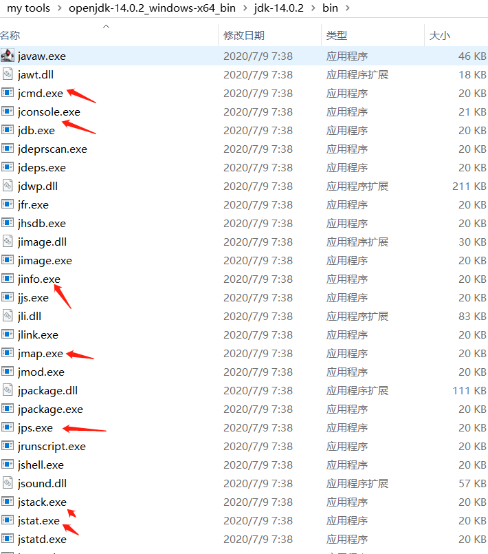 

可以看到这些工具的程序体积都异常小巧。基本都稳定在20K左右。这并非JDK开发团队刻意把他们制作得如此精炼，而是这些命令行工具大多数是JDK/lib/tools.jar类库的一层薄包装而已，它们主要的功能代码是在tools类库中实现的。之所以这样做，是因为当应用程序部署到生产环境后，无论是直接接触物理服务器还是远程Telnet到服务器上都可能会受到限制。借助tools.jar类库里面的接口，我们可以直接在应用程序中实现功能强大的监控分析功能。

### Jdk 命令行工具

|  名称  | 作用                                                         |
| :----: | :----------------------------------------------------------- |
|  jps   | JVM Process Status Tool，显示指定系统内所有的 HotSpot 虚拟机进程 |
| jstat  | JVM statistics Monitoring Tool,用于收集HotSpot虚拟机各方面的运行数据 |
| jinfo  | Configuration Info for Java，显示虚拟机配置信息              |
|  jmap  | Memory Map for Java，生成虚拟机的内存转储快照（heapdump文件） |
|  jhat  | JVM Heap Dump Brower,用于分析heap dump文件，它会建立一个HTTP/HTML服务器，让用户可以在浏览器上查看分析结果 |
| jstack | Stack Trace for Java 显示虚拟机的线程快照                    |


#### :one: JPS:虚拟机进程状况

- Jps 命令手册：https://docs.oracle.com/javase/8/docs/technotes/tools/unix/jps.html

**JPS（JavaVirtual Machine Process Status Tool）**：　JDK的很多小工具的名字都参考了UNIX命令的命名方式，jps名字像UNIX的ps命令之外，也和ps命令类似：可以列出正在运行的虚拟机进程。并显示虚拟机执行主类   (Main Class, main() 函数所在的类)  名称以及这些进程的本地虚拟机唯一ID(Local Virtual Machine Identifier,LVMID)。虽然功能比较单一，但它是使用频率最高的JDK命令行工具，因为其他的JDK工具大多需要输入它查询到的LVMID来确定要监控的是哪一个虚拟机进程。对于本地虚拟机进程来说，LVMID与操作系统的进程ID是一致的。使用Windows的任务管理器或者UNIX的ps命令也可以查询到虚拟机进程的LVMID，但如果同时启动多个虚拟机进程，无法根据进程名称定位时，那只有依赖jps命令显示主类的功能才能区分了。

**命令格式：** ` jps [-q] [-mlvV] [<hostid>]` 

 **[options]选项 ：** 

| 选型 | 作用                                                         |
| :--: | :----------------------------------------------------------- |
|  -q  | 仅输出VM标识符，不包括classname,jar name,arguments in main method |
|  -m  | 输出虚拟机进程启动时传递给主类main()函数的参数               |
|  -l  | 输出主类的全名，如果进程执行的是Jar包，输出Jar路径           |
|  -v  | 输出虚拟机进程启动时JVM参数                                  |

> 案例分析

写一段程序，例子如下：

```java
public class JPSDemo {
    public JPSDemo(){}
    public static void main(String[] args) {
        Scanner sc = new Scanner(System.in);
        sc.next();
    }
}
```

连续运行2次，打开cmd,再用jps查看，如下：

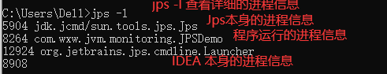 

##### （1）参数案例

 


**相关文章**

1. https://blog.csdn.net/u013132035/article/details/78312226
2. https://www.cnblogs.com/huangjuncong/p/8995333.html
3. [性能监控工具-JDK性能监控](https://www.cnblogs.com/guoximing/articles/6110319.html) 


#### :two: Jstat:虚拟机统计信息监控

- jstat 命令手册：https://docs.oracle.com/javase/8/docs/technotes/tools/windows/jstat.html

jstat (JVM Statistics Monitoring Tool) 用于监视虚拟机各种运行状态信息的命令行工具。它可以显示本地或远程虚拟机进程中类装载、内存、垃圾收集、JIT编译等运行数据，在没有GUI图形界面时，它是运行期定位虚拟机性能问题的首选工具。

**jstat命令格式：** ` 　 jstat -<option> [-t] [-h<lines>] <vmid> [<interval> [<count>]]`  

- outputOptions – 选择需要输出哪些内容
- t – 在第一列输出timestamp,是从目标JVM启动时候开始算起
- h – 选择每隔n行输出列的名字，默认是0，表示只在第一行输出列的名字
- vmid – JVM的pid，可以使用jps来查看
- interval – jstat输出的时间间隔默认单位是毫秒
- count – 表示需要展示多少取样数据，默认是无限制的，表示会一直取样输出，直到JVM停止

> 案例分析

假设要每250毫秒查询一次进程pid = 2764 的垃圾收集情况，一个查询20次，那命令应当是：

```bash
　jstat -gc 2764 250 20
```

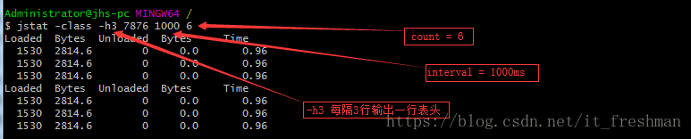 

选项option代表着用户希望查询的虚拟机信息，主要分为3类：类装载，垃圾收集，运行期编译状况，具体选项及作用请参考如下列表：

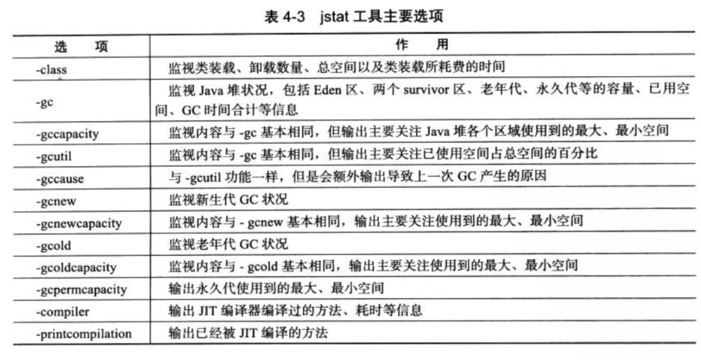 

> 案例分析

jstat 监控选项众多，这里仅举一个例子演示如何查看监控结果。继续运行上面的例子如下：

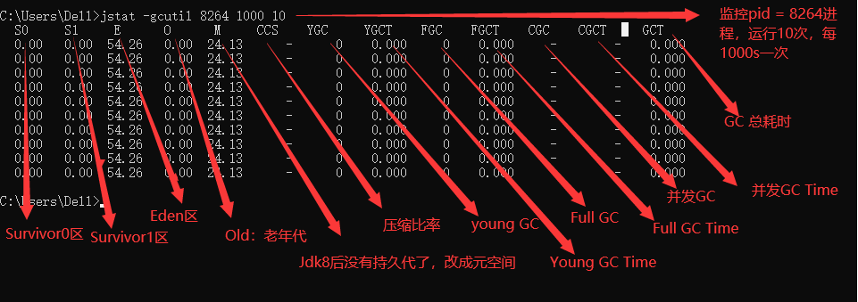 

其中：CGC和CGCT中的第一个C代表“并发”，所以CGC是“并发垃圾收集”

##### （1）支持选项（options）

使用jstat -options可以看到jstat支持的几个options选项：

```powershell
C:\Users\Dell>jstat -options
-class
-compiler
-gc
-gccapacity
-gccause
-gcmetacapacity
-gcnew
-gcnewcapacity
-gcold
-gcoldcapacity
-gcutil
-printcompilation
```

##### （2）类加载统计（class）

```bash
C:\Users\Administrator>jstat -class 8264
Loaded  Bytes  Unloaded  Bytes     Time
 15756 17355.6        0     0.0      11.29
```

说明：

- Loaded:加载class的数量
- Bytes：所占用空间大小
- Unloaded：未加载数量
- Bytes:未加载占用空间
- Time：时间

##### （3）编译统计（compiler）

```powershell
jstat -compiler 53528 100 5
Compiled Failed Invalid   Time   FailedType FailedMethod
    2675      0       0     5.35          0
    2675      0       0     5.35          0
    2675      0       0     5.35          0
    2675      0       0     5.35          0
    2675      0       0     5.35          0
```

参数说明：

- Compiled – 执行的编译任务的次数
- Failed – 编译任务失败次数
- Invalid – 置位无效的编译任务次数
- Time – 执行编译任务花费的时间
- FailedType – 上一次失败编译的编译类型
- FailedMethod – 上一次编译失败的方法名

##### （4）垃圾回收统计（gc）

> GC统计的是GC heap信息

 

```powershell
C:\Users\Dell>jstat -gc 8264 1000 5
 S0C    S1C    S0U    S1U      EC       EU        OC         OU       MC     MU    CCSC   CCSU   YGC     YGCT    FGC    FGCT    CGC    CGCT     GCT
512.0  512.0   0.0    0.0    4416.0   2396.0   10944.0      0.0     2240.0 540.6   0.0    0.0        0    0.000   0      0.000   -          -    0.000
512.0  512.0   0.0    0.0    4416.0   2396.0   10944.0      0.0     2240.0 540.6   0.0    0.0        0    0.000   0      0.000   -          -    0.000
512.0  512.0   0.0    0.0    4416.0   2396.0   10944.0      0.0     2240.0 540.6   0.0    0.0        0    0.000   0      0.000   -          -    0.000
512.0  512.0   0.0    0.0    4416.0   2396.0   10944.0      0.0     2240.0 540.6   0.0    0.0        0    0.000   0      0.000   -          -    0.000
512.0  512.0   0.0    0.0    4416.0   2396.0   10944.0      0.0     2240.0 540.6   0.0    0.0        0    0.000   0      0.000   -          -    0.000
```

参数说明：

gc的输出参数比较多，我们一一进行解释，这样大家对于gc的运行内核会有更多的理解：

- S0C – survivor 0区域的容量，以KB为单位
- S1C – survivor 1区域的容量，以KB为单位

*Young Gen被划分为1个Eden Space和2个Suvivor Space。当对象刚刚被创建的时候，是放在Eden space。垃圾回收的时候，会扫描Eden Space和一个Suvivor Space。如果在垃圾回收的时候发现Eden Space中的对象仍然有效，则会将其复制到另外一个Suvivor Space。*
*就这样不断的扫描，最后经过多次扫描发现任然有效的对象会被放入Old Gen表示其生命周期比较长，可以减少垃圾回收时间。*

- S0U – survivor 0区域的使用大小，以KB为单位
- S1U – survivor 1区域的使用大小，以KB为单位
- EC – Eden区域的容量，以KB为单位
- EU – Eden区域的使用，以KB为单位
- OC – old区域的容量，以KB为单位
- OU – old区域的使用，以KB为单位
- MC – Metaspace元数据区的 Committed Size，以KB为单位
- MU – Metaspace元数据区的使用大小，以KB为单位

*在JDK8之前，类定义、字节码和常量等很少会变更的信息是放在持久代Perm Gen中的。不过在JDK8之后，Perm Gen已经被取消了，现在叫做Metaspace。Metaspace并不在java虚拟机中，它使用的是本地内存。Metaspace可以通过-XX:MaxMetaspaceSize来控制。* 

- CCSC – Compressed class的Committed Size（压缩比率后的大小），以KB为单位
- CCSU – Compressed class的使用大小，以KB为单位

*Compressed Class Space，它是和-XX:+UseCompressedOops，-XX:+UseCompressedClassesPointers有关的。实际上是一个指针的压缩，可以使用32bits来表示之前64bits的指针。* 

- YGC – young generation的GC次数
- YGCT – young generation的GC时间
- FGC – full GC的次数
- FGCT – full GC的时间
- GCT – 总的GC时间

##### （5）堆内存统计（gccapacity）

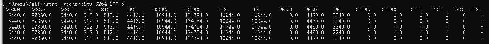 

```powershell
C:\Users\Dell>jstat -gccapacity 8264 100 5
 NGCMN    NGCMX     NGC     S0C   S1C       EC      OGCMN      OGCMX       OGC         OC       MCMN     MCMX      MC     CCSMN    CCSMX     CCSC    YGC    FGC   CGC
  5440.0  87360.0   5440.0  512.0  512.0   4416.0    10944.0   174784.0    10944.0    10944.0      0.0   4480.0   2240.0      0.0      0.0      0.0      0     0     -
  5440.0  87360.0   5440.0  512.0  512.0   4416.0    10944.0   174784.0    10944.0    10944.0      0.0   4480.0   2240.0      0.0      0.0      0.0      0     0     -
  5440.0  87360.0   5440.0  512.0  512.0   4416.0    10944.0   174784.0    10944.0    10944.0      0.0   4480.0   2240.0      0.0      0.0      0.0      0     0     -
  5440.0  87360.0   5440.0  512.0  512.0   4416.0    10944.0   174784.0    10944.0    10944.0      0.0   4480.0   2240.0      0.0      0.0      0.0      0     0     -
  5440.0  87360.0   5440.0  512.0  512.0   4416.0    10944.0   174784.0    10944.0    10944.0      0.0   4480.0   2240.0      0.0      0.0      0.0      0     0     -
```

参数说明：

- NGCMN：新生代最小容量
- NGCMX：新生代最大容量
- NGC：当前新生代容量
- S0C：第一个幸存区大小
- S1C：第二个幸存区的大小
- EC：伊甸园区的大小
- OGCMN：老年代最小容量
- OGCMX：老年代最大容量
- OGC：当前老年代大小
- OC:当前老年代大小
- MCMN:最小元数据容量
- MCMX：最大元数据容量
- MC：当前元数据空间大小
- CCSMN：最小压缩类空间大小
- CCSMX：最大压缩类空间大小
- CCSC：当前压缩类空间大小
- YGC：年轻代gc次数
- FGC：老年代GC次数

##### （6）新生代垃圾回收统计（gcnew）

> gcnew表示新生代的统计信息

```powershell
 jstat -gcnew 53528 100 5
 S0C    S1C    S0U    S1U   TT MTT  DSS      EC       EU     YGC     YGCT
   0.0 4096.0    0.0 3978.2 15  15 5120.0  56320.0  33792.0      4    0.025
   0.0 4096.0    0.0 3978.2 15  15 5120.0  56320.0  33792.0      4    0.025
   0.0 4096.0    0.0 3978.2 15  15 5120.0  56320.0  33792.0      4    0.025
   0.0 4096.0    0.0 3978.2 15  15 5120.0  56320.0  33792.0      4    0.025
   0.0 4096.0    0.0 3978.2 15  15 5120.0  56320.0  33792.0      4    0.025
```

参数说明：

- S0C – survivor 0区域的容量
- S1C – survivor 1区域的容量
- S0U – survivor 0区域的使用大小，以KB为单位
- S1U – survivor 1区域的使用大小，以KB为单位
- TT – Tenuring threshold（进入老年代的阈值？）
- MTT – 最大的Tenuring threshold
- DSS – 所需的survivor size
- EC – Eden区域的容量
- EU – Eden区域的使用，以KB为单位
- YGC – 新生代GC次数
- YGCT – 新生代GC所需的时间

##### （7）新生代内存统计（gcnewcapacity ）

> gcnewcapacity统计的是新生代的指标，和gccapacity的结果是很类似的：

 

参数说明：

- NGCMN – 最小的新生代的大小
- NGCMX – 最大的新生代大小
- NGC – 目前新生代的大小
- S0CMX – survivor 0区域容量的最大值
- S0C – survivor 0区域的容量
- S1CMX – survivor 1区域容量的最大值
- S1C – survivor 1区域的容量
- EC – Eden区域的容量
- ECMX – Eden区域容量的最大值
- YGC – young generation的GC次数
- FGC – full GC的次数

##### （8）老年代垃圾回收统计（gcold）

> gcold统计old代的信息

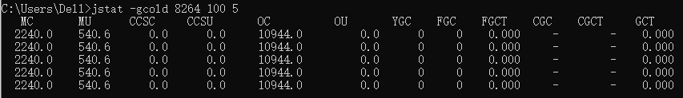 

参数说明：

结果的几项指标前面已经介绍过了，这里就不再重复了

##### （9）老年代内存统计（gcoldcapacity ） 

> gcoldcapacity表示old代的容量信息

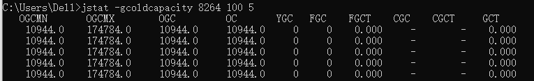 

##### （10）元空间数据统计（gcmetacapacity ）

> gcmetacapacity统计的是元数据区域的容量信息

 

##### （11）总体垃圾回收统计（gcutil ）

> gcutil统计的是GC总体的情况

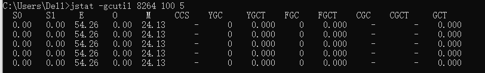 

参数说明：

- S0 – S0区域的使用比例
- S1 – S1区域的使用比例
- E – Eden区域的使用比例
- O – Old区域的使用比例
- M – 元数据区域的使用比例
- CCS – Compressed class空间的使用比例

##### （12）总体垃圾回收（gccause）

gccause和gcutil非常相识，只不过多了下面两列：

- LGCC – 上次GC的原因
- GCC – 当前GC的原因

 

##### （13）编译方法统计（printcompilation）   

> Java HotSpot VM编译器方法统计信息。

 

参数说明：

- `Compiled`：由最近编译的方法执行的编译任务数。
- `Size`：最近编译的方法的字节码的字节数。
- `Type`：最近编译的方法的编译类型。
- `Method`：标识最近编译的方法的类名和方法名。类名使用斜杠（/）代替点（。）作为名称空间分隔符。方法名称是指定类中的方法。这两个字段的格式与HotSpot`-XX:+PrintCompilation`选项一致。

#### :three: Jstatd:jstat的守护进程监控

jstatd，即JVM jstat守护程序-启动RMI服务器应用程序，该应用程序监视已检测到的HotSpot Java虚拟机的创建和终止，并提供一个接口，以允许远程监视工具连接到在本地系统上运行的Java虚拟机。

- 在线手册：https://docs.oracle.com/javase/8/docs/technotes/tools/windows/jstatd.html

该`jstatd`命令是一个RMI服务器应用程序，它监视已检测的Java HotSpot VM的创建和终止，并提供一个接口，以使远程监视工具能够附加到在本地主机上运行的JVM。

该`jstatd`服务器需要本地主机上的RMI注册表。该`jstatd`服务器尝试连接到RMI注册表中的默认端口，或者该端口上您使用指定`-p` `port`的选项。如果未找到RMI注册表，则会在`jstatd`应用程序中创建一个绑定到该`-p` `port`选项指示的端口或`-p` `port`省略该选项时的默认RMI注册表端口的应用程序。您可以通过指定`-nr`选项来停止内部RMI注册表的创建。

**命令格式：** ` jstatd [-nr] [-p port] [-n rminame]`  

**参数说明：** 

- -nr 

  当找不到现有的RMI注册表时，不尝试使用jstatd进程创建一个内部的RMI注册表。

- -p  port

  如果`-nr`未指定该选项，则将在期望的RMI注册表处找到端口号，或者在找不到RMI注册表时创建该端口号。

- -n rminame

  RMI注册表中远程RMI对象绑定到的名称。默认名称是`JStatRemoteHost`。如果`jstatd`在同一主机上启动了多个服务器，则可以通过指定此选项使每个服务器的导出RMI对象的名称唯一。但是，这样做需要将唯一的服务器名称包含在监视客户端`hostid`和`vmid`字符串中。

- -J options

  传递`option`给JVM，其中option是`options`Java应用程序启动器的参考页上描述的选项之一。例如，`-J-Xms48m`将启动内存设置为48 MB

**相关文章** 

1. [JDK工具jstatd用法详解](https://www.cnblogs.com/EasonJim/p/7483739.html) 
2. [jstatd结合Java VisualVM进行远程监控JVM运行情况](https://www.cnblogs.com/guoximing/articles/6110319.html) 

#### :four: Jinfo:Java配置信息

**jinfo(Configuration Info for Java) 的作用** 

实时地查看和调整虚拟机各项参数。

- 使用jps命令的-v参数可以查看虚拟机启动时显式指定的参数列表，但如果想知道未被显式指定的参数的系统默认值
- jinfo的-flag选项进行查询(如果只限于JDK1.6或以上版本的话，使用java -XX:+PrintFlagsFianl查看参数默认值也是一个很好的选择
- jinfo还可以使用-sysprops选项把虚拟机进程的System.getProperties()的内容打印出来。这个命令在JDK1.5时期已经伴随Linux的JDK发布，当时只提供了信息查询的功能，

JDK1.6之后，jinfo在Windows和Linux平台都有提供，并且加入了运行期修改参数的能力，可以使用-flag [+|-] name或者 -flag name=value 修改一部分运行期可写的虚拟机参数值。JDK1.6中，jinfo对于Windows平台功能仍然有很大的限制，只提供了最基本的-flag选项。

**具体用法**  

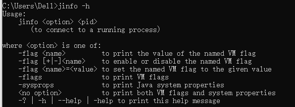 

参数说明：

- no option   输出全部的参数和系统属性

- -flag  name  输出对应名称的参数

- -flag [+|-]name  开启或者关闭对应名称的参数

- -flag name=value  设定对应名称的参数

- -flags  输出全部的参数

- -sysprops  输出系统属性

##### （1）参数配置（PrintGCDetails）

 

（2）查看默认配置（UseG1GC）

 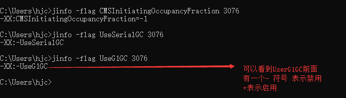 

#### :five:Jmap:Java内存映像工具

> 简言之，导出堆中的信息

 jmap（Memory Map for Java）命令用于生成堆转储快照（一般称为headdump或dump文件）,也就是导出堆到dump文件中。如果不使用jmap命令，要想获取Java堆转储快照，可以使用一下方法：

1. 用-XX:+HeapOnOutOfMemoryError参数，可以让虚拟机在OOM异常出现之后自动生成dump文件
2. 通过-XX:+HeapDumpOnCtrlBreak参数则可以使用[ Ctrl ] + [ Break ]键让虚拟机生成dump文件
3. 在Linux系统下通过Kill -3命令发送进程退出信号“吓唬”一下虚拟机，也能拿到dump文件。

 jmap的作用并不仅仅是为了获取dump文件，它可以查询finalize执行队列、Java堆和永久代的信息信息，如空间使用率、当前用的是哪种收集器等。

和jinfo命令一样，jmap有不少功能在Windows平台下都是受限的，除了生成dump文件的-dump选项和用于查看每个类的实例、空间占用统计的-histo选项在所有操作系统都提供之外，其余选项都只能在Linux/Solaris下使用。

**jmap用法** 

 

**option选项有如下：**

- -heap 显示Java堆详细信息，如使用哪种回收器、参数配置、分代状况等。只在Linux/Solaris平台下有效
- -histo[:live] 显示堆中对象的统计信息，如果使用了:live子属性，则只统计“存活”对象，显示堆中对象统计信息，包括类、实例数量、合计容量
- -clstats 打印类加载器的统计信息(取代了在JDK8之前的 -permstat)
- -permstat Java堆内存的永久保存区域的类加载器的统计信息 ----JDK8之后无此选项，只在Linux/Solaris平台下有效
- -finalizerinfo 显示在F-Queue队列等待Finalizer线程执行finalizer方法的对象，只在Linux/Solaris平台下有效
- -dump: 生成堆转储快照
- -F 当-dump没有响应时，强制生成dump快照，只在Linux/Solaris平台下有效
- -J 传递参数给jmap启动的jvm

##### （1）堆中对象的统计信息（histo）

统计5421号进程的存活对象统计信息，并保存到文件：`$ jmap -histo:live 5421 >d:/jmap_dump.txt`，结果如下图：

 

结果中统计了内存中实例对象数和合计。

##### （2）导出当前堆快照（dump）

- -dump功能得到java程序的当前堆快照：`jmap -dump:format=b,file=d:/heamp.hprof 3076` ,其中b代表以二进制的形式

 

##### （3）系统类加载信息（**-clstats 与 permstat**）

该命令还可以查看系统的classloader信息，以及classloader的父子关系，以及各个classloader内部加载的类的数量和总大小。

- `$ jmap -clstats 7876`

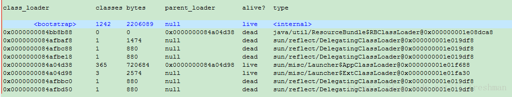 

##### （4）F-Queue队列信息查看（**finalizerinfo**）

可以观察系统中finalizer队列中的对象，一个不恰当的finalize()方法可能导致对象堆积在finalizer队列里。`$ jmap -finalizerinfo 7876` 

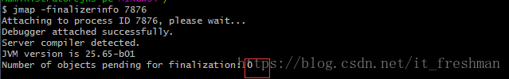 

上图的finalizer队列长度为0。

#### :six:Jhat:堆分析工具

Sun JDK提供jhat（JVM heap Analysis Tool）命令与jmap搭配使用，来分析jmap生成的堆转储快照。jhat内置了一个微型的HTTP/HTML服务器，生成dump文件的分析结果后，可以在浏览器中查看。

一般不会直接使用jhat命令来分析dump文件，原因有两点：

1. 一般不会在部署应用程序的服务器上直接分析dump文件，即使这样做，一般也尽量把dump文件复制到其他机器上去分析，因为分析是一个耗时且消耗硬件资源的一个过程，既然都要在其他机器上运行了，就没有必要受到命令行工具的限制了；
2. jhat的分析功能相对来说比较丑陋，有其工具能实现比jhat更强大更专业的分析功能（后面会提到专业的工具VisualVM）。

**用法** ：

1. ` jmap -dump:format=b,file=d:/heamp.hprof 3076` 导出当前堆快照
2. ` jhat d:/heap.hprof` 浏览器查看分析jmap 导出来的堆快照信息

使用jhat工具可以分析java应用程序的堆快照内容：`$ jhat d:/heap.hprof`

 

分析的结果通过浏览器 localhost:7000查看。

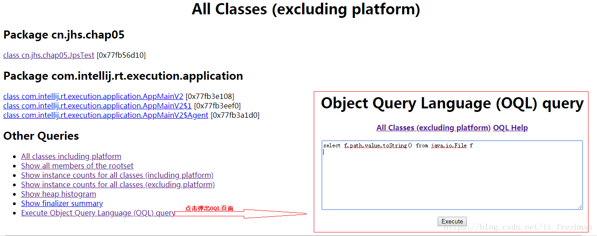 

#### :seven:Jstack:堆栈跟踪工具


## 故障排除工具

### 堆内存分析工具

内存问题排查起来相对比CPU麻烦一些，场景也比较多。主要包括OOM、GC问题和堆外内存。一般来讲，我们会先用`free`命令先来检查一发内存的各种情况。

- 内存问题大多还都是堆内内存问题。表象上主要分为OOM和StackOverflow。

#### _OOM

#### _**Stack Overflow** 

**分析过程** ：

1. 关于OOM和StackOverflow的代码排查方面，我们一般使用JMAP`jmap -dump:format=b,file=filename pid`来导出dump文件  
2. 通过mat(Eclipse Memory Analysis Tools)导入dump文件进行分析，内存泄漏问题一般我们直接选Leak Suspects即可，mat给出了内存泄漏的建议。另外也可以选择Top Consumers来查看最大对象报告。和线程相关的问题可以选择thread overview进行分析。除此之外就是选择Histogram类概览来自己慢慢分析，大家可以搜搜mat的相关教程。


- mat
- jmap

> **堆内存OOM分析案例** 

1. [排查堆内存溢出](https://mp.weixin.qq.com/s/7XGD-Z3wrThv5HyoK3B8AQ) 

### 栈内存分析工具

#### _使用jstack分析cpu问题

**分析过程：** 

1. 先用ps命令找到对应进程的pid(如果你有好几个目标进程，可以先用top看一下哪个占用比较高) 
2. 用`top -H -p pid`来找到cpu使用率比较高的一些线程
3. 将占用最高的pid转换为16进制`printf '%x\n' pid`得到nid 
4. 直接在jstack中找到相应的堆栈信息`jstack pid |grep 'nid' -C5 –color` 
5. `cat jstack.log | grep "java.lang.Thread.State" | sort -nr | uniq -c`来对jstack的状态有一个整体的把握 

> **栈内存分析案例**

1. [**业务逻辑问题(死循环)、频繁gc**以及**上下文切换过多**](https://blog.csdn.net/qq_41893274/article/details/108901595)  
2. [CPU打到100%](https://mp.weixin.qq.com/s/roEMz-5tzBZvGxbjq8NhOQ) 

#### _频繁GC

使用**jstat -gc pid 1000**命令来对gc分代变化情况进行观察

- 1000表示采样间隔(ms)
- S0C/S1C、S0U/S1U、EC/EU、OC/OUMC/MU分别代表两个Survivor区、Eden区、老年代、元数据区的容量和使用
- YGC/YGT、FGC/FGCT、GCT则代表YoungGc、FullGc的耗时和次数以及总耗时

> GC分析案例

1. [排查YGC问题](https://mp.weixin.qq.com/s/LRx9tLtx1tficWPvUWUTuQ) 

#### _上下文切换

- **vmstat** - 内存，进程和分页等的简要信息。
- **iostat** - CPU统计信息，设备和分区的输入/输出统计信息

### 常见经典异常问题

#### 1. Java heap space

##### （1）背景介绍

> 案例分析

```java
       /**
         * 创建一个插入对象为一亿，误报率为0.01%的布隆过滤器
         */
        BloomFilter<CharSequence> bloomFilter = 
                                 BloomFilter.create(Funnels.stringFunnel(Charset.forName("utf-8")), 100000000, 0.0001);
        bloomFilter.put("121");
        bloomFilter.put("122");
        bloomFilter.put("123");
        System.out.println(bloomFilter.mightContain("121"));
```

- 异常提示

```java
Exception in thread "main" java.lang.OutOfMemoryError: Java heap space
	at java.util.concurrent.atomic.AtomicLongArray.<init>(AtomicLongArray.java:81)
	at com.google.common.hash.BloomFilterStrategies$LockFreeBitArray.<init>(BloomFilterStrategies.java:158)
	at com.google.common.hash.BloomFilter.create(BloomFilter.java:429)
	at com.google.common.hash.BloomFilter.create(BloomFilter.java:405)
	at com.google.common.hash.BloomFilter.create(BloomFilter.java:379)
	at com.wxw.common.bloomfilter.BloomFilterTools.main(BloomFilterTools.java:19)
```

- 问题分析

 在 JVM 中如果98%的时间是用于 GC(Garbage Collection) 且可用的 Heap size 不足2%的时候将抛出异常信息：

` java.lang.OutOfMemoryError: Java heap space。 ` 所以产生这个异样的原因通常有两种：

1. 程序中出现了死循环
2. 程序占用内存太多，超过了 JVM 堆设置的最大值

##### （2）解决方案与分析

- 对于第一种需要根据jdk分析工具，找对应的代码分析，具体方案可以参考 [文章](https://blog.csdn.net/qq_41893274/article/details/108901595) 
- 第二种问题处理方案：我们手工扩大JVM堆的参数设置

**Jvm 堆的设置**： 是指Java程序运行过程中JVM可以调配使用的内存空间的设置

在 JVM 启动时，JVM 会自动设置 heap size 值。通常情况下，初始空间（-Xms）默认值是物理内存的1/64，最大空间是物理内存的1/4，可以利用JVM 提供的 ` -Xmn、 -Xms 、 -Xmx ` 等选项进行设置。

```xml
-Xms：初始值 
-Xmx：最大值 
-Xmn：最小值 
```

Heap Size 设置不宜太大，也不宜太小。设置太大程序的响应速度就会变慢了，因为GC占用了更多的时间，这样应用分配到的执行时间就会越少，太大也会造成空间的浪费，而且也会影响其它程序的正常运行。

- Heap Size 最大最好不要超过可用物理内存的80%，建议将 ` -Xms 和 -Xmx` 选项设置为相同，而·` -Xmn` 为 1/4的` -Xmx` 值

**设置方法如下：** 

1. 在执行Java类文件时，加上这个参数

   ```java
   java -Xms32m -Xmx800m className 
   ```

   如果是开发测试，则可以设置环境参数：` VM arguments 中输入-Xms32m -Xmx800m这个参数` 

2. 可以在windows 更改系统环境变量加上 ` JAVA_OPTS=-Xms64m -Xmx512` 

3. 如果用的tomcat则windows下的 tomcat目录下catalina.bat 文件设置 ` set JAVA_OPTS=-Xms64m -Xmx256m` 

   位置在: rem Guess CATALINA_HOME if not defined 这行的下面加合适

4. 如果是Linux系统则设置如下

   ```java
   在{tomcat_home}/bin/catalina.sh的前面，加 set JAVA_OPTS='-Xms64 -Xmx512'
   ```

## 优秀文章

1. [程序员那些事](http://www.flydean.com/java-jvm-all-in-one/)  


