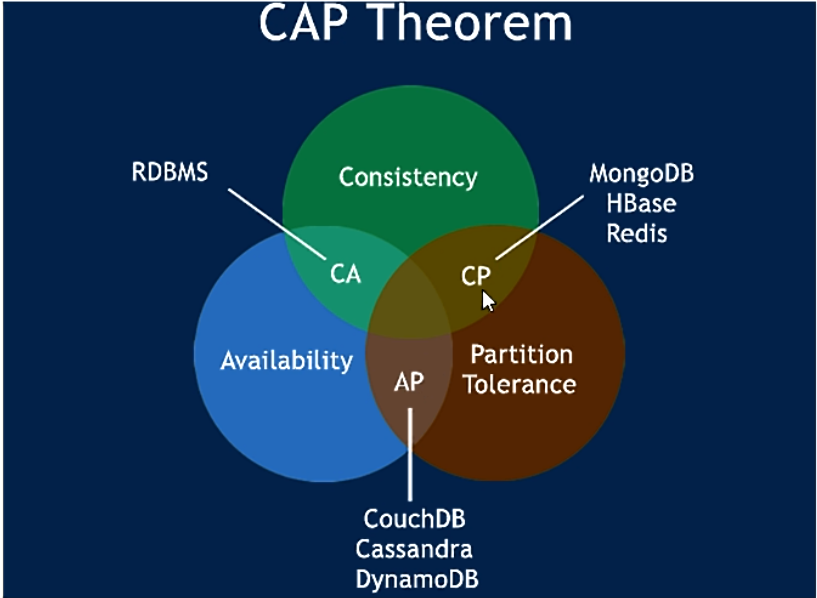
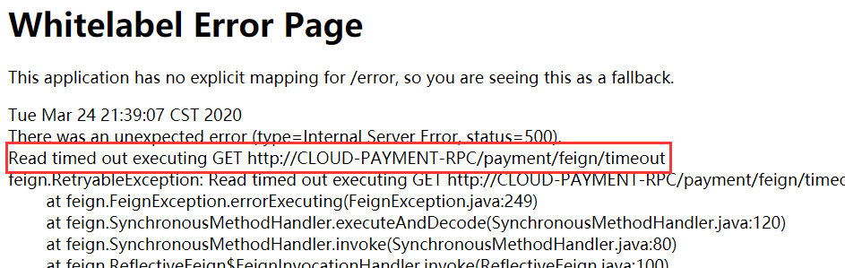
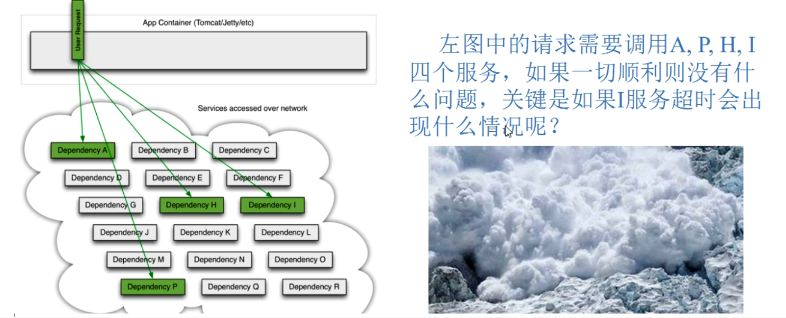

## Spring Cloud  学习

---

## 一、微服务架构理论入门

- SpringBoot2.X版和SpringCloud H版

### （1）版本选择

|       技术类型       |    选择的版本     |
| :------------------: | :---------------: |
|     Spring Cloud     |  **Hoxton.SR3**   |
|     Spring Boot      | **2.2.5.RELEASE** |
| Spring Cloud Alibaba | **2.2.0.RELEASE** |
|         java         |       JAVA8       |
|        maven         |     3.5及以上     |
|        mysql         |     5.7及以上     |

### （2）组件停更/升级/替换

#### 1. 停更不停用

- 被动修复bugs
- 不再接受合并请求
- 不再发布新版本
- 听课不停学

#### 2. 组件版本

 

#### 3. 版本升级

 

### （3）官网资料

- [Spring Cloud官网](https://cloud.spring.io/spring-cloud-static/Hoxton.SR3/reference/html/spring-cloud.html)
- [Spring Cloud 中文文档](https://www.bookstack.cn/read/spring-cloud-docs/docs-project-SpringCloudConfig.md)
- [Spring Boot 官网](https://docs.spring.io/spring-boot/docs/2.2.5.RELEASE/reference/html/)

### （4）Eureka服务注册与发现

- 云端服务发现，一个基于 REST 的服务，用于定位服务，以实现云端中间层服务发现和故障转移。

#### 1. Eureka基础知识

- 什么是服务治理？


- 什么是服务注册?


- Eureka两组件C/S


#### 2. 单机Eureka构建步骤

- 建module
- 改pom文件
- 写yml配置文件
- 主启动
- 业务类

## 二、微服务架构组件

- 约定 > 配置 > 编码

> 1. 什么是服务注册与发现？

服务注册/发现是微服务架构中不可或缺的重要组件，起初服务都是单节点的甚至是单体服务，不保障高可用性，也不考虑服务的压力承载，服务之间调用单纯的通过接口访问（HttpClient/RestTemplate），直到后面出现了多个节点的分布式架构，起初的解决手段是在服务端负载均衡，同时在网关层收束接口，使不同的请求转发到对应不同端口上，这也是前后分离防止前端跨域的手段之一：

  


**缺点：** nginx并不具有服务健康检查的功能，服务调用方在调用一个服务之前是无法知悉服务是否可用的，不考虑这一点分布式的架构高可用的目标就成了一个摆设，解决手段也很简单：对超时或是状态码异常的请求进行重试尝试，请求会被分发到其他可用节点，或者采用服务注册与发现机制察觉健康的服务。

> 2. 服务注册与发现技术选型

注册中心的解决方案很多，zookeeper、Eureka(当时时Eureka2.0已经闭源，不再更新，因此不建议后续项目使用此组件)、etcd、以及consul等。

 

- Eureka是很优秀的服务注册组件，但是Netflix将2.0闭源后，便已不是最优选择，不过现有的项目使用Eureka 1.x功能已足够使用，不必急于更换技术栈。
- zookeeper是一个很强大的k-v组件，功能应是这些技术中最多的，但是我们只需要服务注册的组件，paxos的一致性算法也不如raft高效，保持长连接会对服务造成一定的影响。
- etcd其实只是一个k-v系统，需要额外添加对服务发现的支持。

### 2.1 Eureka 注册中心

#### 1. Eureka  自我保护

- 故障现象
- 导致原因
- 怎么禁止自我保护

#### 2. Eureka 停更说明

- [参见Netflix官网](https://github.com/Netflix/eureka/wiki)

  ```txt
  有关eureka 2.0的现有开源工作已停止。在2.x分支上作为现有工作资料库的一部分发布的代码库和工件被视为使用后果自负。
  
  Eureka 1.x是Netflix服务发现系统的核心部分，仍然是一个活跃的项目。
  ```


### 2.2 Zookeeper注册中心

- zookeeper是一个分布式协调工具，可以实现注册中心功能
- zookeeper服务器取代Eureka服务器，zk作为服务注册中心

#### 1. zookeeper默认端口号

- 代码访问client的端口号： 2181
- leader和flower通信的端口号： 2888
	 选举leader时通信的端口号：	3888	
- 其他服务与监控中心通信端口： 7070

#### 2. zoo.cfg配置文件详解

 

- zookeeper常用命令

```java
./zkServer.sh start 		//启动zookeeper服务端
./zkServer.sh status 		//查看zookeeper状态（model显示状态）	
./zkCli.sh 					//启动zookeeper客户端
quit 						//退出客户端
./zkServer.sh stop			//退出zookeeper服务端
客户端
help   						//显示所有操作指令
ls /						//查看当前znode中所包含的内容
ls2 /						//查看当前节点的详细数据
create /sanguo 				//在此client下创建名称为sanguo的节点  
								后面可指定节点内容  例子：create /sanguo "liubei"
create /sanguo/shuguo "liubei" //创建多级目录
get /sanguo/shuguo			//获取创建节点内的内容
get -w /sanguo/shuguo		//获得节点内容，并且设置监听（设置一次监听一次）(当此节点下内容变化有输出)			
create -e /sanguo/weiguo "caocao"	//-e创建短暂的节点(client重启后节点消失)	
create -s /sanguo/weiguo "caocao"	//-s创建带有序号的节点（序号从总共节点数开始往后排）
set /sanguo/shuguo "diaochan"		//修改节点内的值zhouyu->diaochan
ls -w /sanguo						//监听子节点的变化
delete /sanguo/wuguo2				//删除/sanguo下的wuguo2
deleteall /sanguo/wuguo				//递归删除
```

### 2.3 Consul 注册中心

#### 1. Consul 简介   

- Consul是基于GO语言开发的开源工具，主要面向分布式，服务化的系统提供服务注册、服务发现和配置管理的功能。Consul的功能都很实用，其中包括：服务注册/发现、健康检查、Key/Value存储、多数据中心和分布式一致性保证等特性。Consul本身只是一个二进制的可执行文件，所以安装和部署都非常简单。
- **优点：** 
  - 基于raft协议，比较简洁，支持健康检查
  - 支持HTTP和DNS协议 ，支持夸数据中心的WAN集群，提供图形界面
  - 跨平台，支持Linux、Windows、Mac.

#### 2. Consul 特性

- **服务注册与发现：** 客户端通过Consul提供服务,其他客户端可以使用Consul发现服务的提供者。使用类似DNS或者HTTP的方式发现。

  注意：为什么微服务架构下就需要做服务注册和服务发现呢？

  微服务的目标就是要将原来大一统的系统架构，拆分成细粒度的按功能职责分成的小系统，这样就会出现很多小的系统，部署的节点也会随之增加。试想一下，如果没有一个统一的服务组件来管理各系统间的列表，微服务架构是很难落地实现的。

  **Consul提供的服务注册/发现功能在数据强一致性和分区容错性上都有非常好的保证，但在集群可用性下就会稍微差一些（相比Euerka来说）**  

-  **健康监测：** 支持多种协议，HTTP、TCP、Docker、Shell脚本定制化 监测，Consul可以快速提醒操作员有关群集中的任何问题。与服务发现的集成可防止将流量路由到不正常的主机，并启用服务级别的断路器。

- **Key/Value存储：** Consul支持Key/Value存储功能，可以将Consul作为配置中心使用，可以将一些公共配置信息配置到Consul，然后通过Consul提供的 HTTP API来获取对应Key的Value。

- **多数据中心：**支持多数据中心(Data Center),多个数据中心之间通过Gossip协议进行数据同步。多数据中心的好处是当某个数据中心出现故障时，其他数据中心可以继续提供服务，提升了可用性。

- **可视化Web界面**

#### 3. Consul 的安装

- [Consul官网下载链接](https://www.consul.io/downloads.html)

- 使用方式

  - [windows版本](https://www.cnblogs.com/aixinge/p/9118337.html)：环境变量可以不配置直接在对应的目录打开即可使用  

- 常用命令

  - 查看版本号： `consul --version`


  - cmd 命令窗口执行启动consul：`consul agent -dev` 

  - consul 自带 UI 界面，打开网址：[http://localhost:8500](https://link.zhihu.com/?target=http%3A//localhost%3A8500/) ，可以看到当前注册的服务界面

  - cmd 命令窗口执行: 

    `consul.exe agent -server ui -bootstrap -client 0.0.0.0 -data-dir="E:\consul" -bind X.X.X.X` 

    其中X.X.X.X为服务器ip,即可使用http://X.X.X.X:8500 访问ui而不是只能使用localhost连接

- 基本命令：

```html
1、consul启动
# consul agent -dev # -dev表示开发模式运行，另外还有-server表示服务模式运行

注意：-dev节点的启动不能用于生产环境，因为该模式下不会持久化任何状态，该启动模式仅仅是为了快速便捷的启动单节点consul。

2、查看consul cluster中consul节点的信息
# consul members

说明：
Address：节点地址
Status：alive表示节点健康
Type：server运行状态是server状态
DC：dc1表示该节点属于DataCenter1

注意：members命令的输出是基于gossip协议的，并且是最终一致的，也就是说某一个时刻你去运用该命令查到的consul节点的状态信息可能是有误的。

输入 http://127.0.0.1:8500/ui/ 访问Consul。

3、停止服务（优雅退出）
# CTRL+C
该节点离开后，会通知cluster中的其他节点
```

#### 4. Consul的使用

- [Springcloud consul的官网](https://www.springcloud.cc/spring-cloud-consul.html)

### 2.4 注册中心选型

 

#### 1. CAP理论知识

[CAP理论](https://www.cnblogs.com/mingorun/p/11025538.html)作为分布式系统的基础理论,它描述的是一个分布式系统在以下三个特性中：

- 一致性（**C**onsistency）

- 可用性（**A**vailability）

- 分区容错性（**P**artition tolerance）

   

最多满足其中的两个特性。也就是下图所描述的。分布式系统要么满足CA,要么CP，要么AP。无法同时满足CAP。

**CAP理论关注粒度是数据，而不是整体系统设计的策略**


#### 2. AP(Eureka)

 

 

#### 3. CP(Zookeeper/Consul)

 

  

### 2.5 Ribbon 负载均衡

- 负载均衡服务调用

#### 1. Ribbon简介

**Spring Cloud Ribbon**是基的于Netflix Ribbon实现一个基于HTTP和TCP的客户端负载均衡工具。通过Spring Cloud的封装，可以让我们轻松地将面向服务的REST模板请求自动转换成客户端负载均衡的服务调用。

- 主要功能

Ribbon 提供客户端的软件负载均衡算法和服务调用。

#### 2. 负载均衡理论知识

 

- **集中式LB**

  即在服务的消费方和提供方之间使用独立的LB设施，（可以是硬件：F5,可以是软件：nginx）由该设施负责把访问请求通过某种策略转发至服务器的提供方。

- **进程内LB**

  将LB逻辑集成到消费方，消费方从服务注册中心获知有哪些地址可以用，然后自己再从这些地址中选出合适的服务器。

  **Ribbon就属于进程内的LB**,它只是一个类库，集成于消费方进程，消费方通过它来获取到服务提供方的地址。

> **负载均衡+RestTemplate调用**

#### 3. 负载均衡架构

 

- Ribbon在工作中分为两步：

  1. 选择EurekaServer,优先选择在同一个区域内负载较少的server
  2. 再根据用户指定的策略，在从server取到的服务注册列表中选择一个地址。其中Ribbon提供了多种策略，比如：轮询、随机、根据响应时间加权。

   

**Ribbon其实就是一个软负载均衡的客户端组件，他可以和其他所需请求的客户端结合使用，和eureka结合只是其中的一个实例。**

#### 4. RestTemplate的使用

- [RestTemplate官网](https://docs.spring.io/spring-framework/docs/5.2.2.RELEASE/javadoc-api/org/springframework/web/client/RestTemplate.html)
- [使用方法](https://www.cnblogs.com/f-anything/p/10084215.html)
- [SpringBoot2.2.5 版本去除默认的RestTemplate的bean，需要自定义](https://blog.csdn.net/qq_41893274/article/details/105064993)


> （1）服务调用方式

- RPC：Remote Produce Call远程过程调用，类似的还有RMI。自定义数据格式，基于原生TCP通信，速度快，效率高。早期的webservice，现在热门的dubbo，都是RPC的典型代表
- Http：http其实是一种网络传输协议，基于TCP，规定了数据传输的格式。现在客户端浏览器与服务端通信基本都是采用Http协议，也可以用来进行远程服务调用。缺点是消息封装臃肿，优势是对服务的提供和调用方没有任何技术限定，自由灵活，更符合微服务理念。

> （2）[POST和Get的区别](https://blog.csdn.net/qq_38182125/article/details/89071899?depth_1-utm_source=distribute.pc_relevant.none-task&utm_source=distribute.pc_relevant.none-task)

- Get是不安全的，因为在传输过程，数据被放在请求的URL中；Post的所有操作对用户来说都是不可见的。
- Get传送的数据量较小，这主要是因为受URL长度限制；Post传送的数据量较大，一般被默认为不受限制。
- Get限制Form表单的数据集的值必须为ASCII字符；而Post支持整个ISO10646字符集。
- Get执行效率却比Post方法好。Get是form提交的默认方法。

|     请求方式     |                GET                 |               POST               |
| :--------------: | :--------------------------------: | :------------------------------: |
|     参数位置     |            url的query中            |    一般在content中，query也可    |
|     参数大小     | 受限于浏览器url大小，一般不超过32K |                1G                |
|  服务器数据接收  |              接收1次               |    根据数据大小，可分多次接收    |
| 适用场景（语义） |   从服务器端获取数据，不做增删改   | 向服务器提交数据，如做增删改操作 |
|      安全性      |     参数携带在url中，安全性低      |    相对于GET请求，安全性更高     |

- GET请求中URL的最大长度限制总结
- 浏览器

```java
1、IE
IE浏览器（Microsoft Internet Explorer） 对url长度限制是2083（2K+53），超过这个限制，则自动截断（若是form提交则提交按钮不起作用）。

2、firefox
firefox（火狐浏览器）的url长度限制为 65 536字符，但实际上有效的URL最大长度不少于100,000个字符。

3、chrome
chrome（谷歌）的url长度限制超过8182个字符返回本文开头时列出的错误。

4、Safari
Safari的url长度限制至少为 80 000 字符。

5、Opera
Opera 浏览器的url长度限制为190 000 字符。Opera 9 地址栏中输入190 000字符时依然能正常编辑。
```

- 服务器

```java
1、apache
apache能接受url长度限制为8 192 字符

2、IIS
Microsoft Internet Information Server(IIS)能接受url长度限制为16 384个字符。
这个是可以通过修改的（IIS7）configuration/system.webServer/security/requestFiltering/requestLimits@maxQueryString setting.<requestLimits maxQueryString="length" />

3、Perl HTTP::Daemon
Perl HTTP::Daemon 至少可以接受url长度限制为8000字符。Perl HTTP::Daemon中限制HTTP request headers的总长度不超过16 384字节(不包括post,file uploads等)。但当url超过8000字符时会返回413错误。
这个限制可以被修改，在Daemon.pm查找16×1024并更改成更大的值。

4、ngnix
可以通过修改配置来改变url请求串的url长度限制。

client_header_buffer_size 默认值：client_header_buffer_size 1k

large_client_header_buffers 默认值 ：large_client_header_buffers 4 4k/8k
```

#### 5. Ribbon负载规则

> **IRule:根据特定算法从服务列表中选取一个要访问的服务**

  

1. RoundRobinRule: 轮询

2. RandomRule ：随机

3. RetryRule： 先按照RoundRobinRule的策略获取服务，如果获取服务失败则在指定时间内会进行重试

4. WeightedResponseTimeRule ：

   对RoundRobinRule的扩展，响应速度越快的实例选择权重越大，越容易被选择

5. BestAvailableRule ：

   会先过滤掉由于多次访问故障而处于断路器跳闸状态的服务，然后选择一个并发量最小的服务

6. AvailabilityFilteringRule ：先过滤掉故障实例，再选择并发较小的实例

7. ZoneAvoidanceRule ：默认规则，复合判断server所在区域的性能和server的可用性选择服务器

> **如何替换Ribbon的默认规则**

 

> **Ribbon 负载均衡算法**

- 原理

 

### 2.6 OpenFeign服务调用

#### 1. OpenFeign简介

- 官方文档：<https://cloud.spring.io/spring-cloud-openfeign/2.2.x/reference/html/> 
- 实例代码地址：https://github.com/GitHubWxw/springcloud2020

Feign是一种声明式、模板化的HTTP客户端。它的使用方法是定义一个服务接口然后在上面添加注解。Feign也支 持可拔插式的编码器和解码器。Spring Cloud对Feign进行了封装使其支持了Spring MVC标准注解和HttpMessageConverters。Feign可以与Eureka和Ribbon组合使用以支持负载均衡。

#### 2. OpenFeign特性

前面在使用Ribbon + RestTemplate时，利用RestTemplate对http请求的封装处理, 形成了一套模版化的调用方法。但是在实际开发中，由于对服务依赖的调用可能不止一处,往往一个接口会被多 处调用，所以通常都会针对每个微服务自行封装-些客户端类来包装这些依赖服务的调用。

所以, Feign在此基础上做了进一步封装, 由他来帮助我们定义和实现依赖服务接口的定义。**在Feign的实现下我们只需创建一个接口并使用注解的方式来配置它(以前是Dao接口 上面标注Mapper注解现在是一个微服务接口 上面标注一个Feign注解即可)，即可完成对服务提供方的接口绑定，**简化了使用Spring cloud Ribbon时,自动封装服务调用客户端的开发量。

- openfeign 超时控制
- OpenFeign 日志打印
- OpenFeign loadbalancer 负载均衡
- OpenFeign  histrix 熔断
- OpenFeign  fallback 故障转移
- OpenFeign 重试

> 基本配置参数：https://docs.spring.io/spring-cloud-openfeign/docs/3.0.0-SNAPSHOT/reference/html/appendix.html

#### 3. OpenFeign 配置

> OpenFeign的标注@FeignClient和@EnableFeignClients

- @FeignClient标注用于声明Feign客户端可访问的Web服务。
- @EnableFeignClients标注用于修饰Spring Boot应用的入口类，以通知Spring Boot启动应用时，扫描应用中声明的Feign客户端可访问的Web服务。

##### （1） @FeignClient标注的参数

- name, value (默认””)，两者等价
- qualifier (默认””)
- url (默认””)
- decode404 (默认false)
- configuration (默认FeignClientsConfiguration.class)
- fallback (默认void.class)
- fallbackFactory (默认void.class)
- path (默认””)
- primary (默认true)

##### （2）@FeignClient标注的configuration参数

@FeignClient标注的configuration参数，默认是通过FeignClientsConfiguration类定义的，可以配置Client，Contract，Encoder/Decoder等。

FeignClientsConfiguration类中的配置方法及默认值如下：

- **feignContract**: SpringMvcContract
- **feignDecoder**: ResponseEntityDecoder
- **feignEncoder**: SpringEncoder
- **feignLogger**: Slf4jLogger
- **feignBuilder**: Feign.Builder
- **feignClient**: LoadBalancerFeignClient（开启Ribbon时）或默认的HttpURLConnection

##### （3）定制@FeignClient标注的configuration类

@FeignClient标注的默认配置类为FeignClientsConfiguration，我们可以定义自己的配置类如下：

```java
 @Configuration
    public class MyConfiguration {
        @Bean
        public Contract feignContract(...) {...}

        @Bean
        public Encoder feignEncoder() {...}

        @Bean
        public Decoder feignDecoder() {...}
        ...
    }
```

然后在使用@FeignClient标注时，给出参数如下：

```java
 @FeignClient(name = "myServiceName", configuration = MyConfiguration.class, ...)
    public interface MyService {
        @RequestMapping("/")
        public String getName();

        ...
    }
```

当然，定制@FeignClient标注的configuration类还可以有另一个方法，直接配置**application.yaml**文件即可，示例如下：

```yaml
  feign:
      client:
        config:
          feignName: myServiceName
            connectTimeout: 5000
            readTimeout: 5000
            loggerLevel: full
            encoder: com.example.MyEncoder
            decoder: com.example.MyDecoder
            contract: com.example.MyContract
```

##### （4）@EnableFeignClients标注的参数

- value, basePackages (默认{})
- basePackageClasses (默认{})
- defaultConfiguration (默认{})
- clients (默认{})

> 使用OkHttpClient作为client的Feign客户端

```xml
  <dependency>
      <groupId>com.squareup.okhttp3</groupId>
      <artifactId>okhttp</artifactId>
      <version>3.10.0</version>
    </dependency>
```

- 来源：http://ddrv.cn/a/88268

#### 4. Feign和OpenFeign两者区别 

#### 5. SpringCloud集成OpenFeign

##### （1）测试服务集群和Eureka集群

 

Eureka是服务注册中心就不多说。8081和8082服务是两个功能相同的项目，是一个服务集群，因为OpenFeign代替了Ribbon + RestTemplate的工作，故说明OpenFeign带有Ribbon的依赖可以实现负载均衡。服务集群的功能很简单，就是从数据库中根据id进行查询。

- 修改host文件配置host实例，搭建eureka的集群

  ```c
  127.0.0.1 eureka7001.com
  127.0.0.1 eureka7002.com
  ```

##### （2）cloud-feign-order9001 配置

```yaml
server:
  port: 9001
spring:
  application:
    name: cloud-feign-order9001

# 注册中心配置
eureka:
  client:
    #表示是否将自己注册进EurekaServer,默认为true
    register-with-eureka: true
    #是否从EurekaServer抓取已有的注册信息，默认为true,单节点无所谓，集群必须设置为true,才能配合ribbon使用负载均衡
    fetch-registry: true
    service-url:
      # 单机版
#      defaultZone: http://localhost:7001/eureka
      #集群版
       defaultZone: http://127.0.0.1:7001/eureka,http://127.0.0.1:7002/eureka
  instance:
    #避免显示主机名
    instance-id: cloud-feign-order9001
    #显示IP地址
    prefer-ip-address: true
    #Eureka客户端向服务端发送心跳的时间间隔，单位为秒（默认30秒）
    lease-renewal-interval-in-seconds: 30
    #Eureka服务端在收到最后一次心跳后等待时间上线，单位为秒（默认为90秒），超时将剔除服务
    lease-expiration-duration-in-seconds: 90
#超时控制
feign:
  client:
    config:
      default:
        connectTimeout: 5000
        readTimeout: 5000
# 开启日志
logging:
  level:
    # fegin日志以什么级别监控那个接口
    com.wxw.cloud.rpc.PaymentFeignService: debug
```

##### （3）主启动类

```java
@EnableFeignClients
@SpringBootApplication
public class OrderFeignMain9001 {
    public static void main(String[] args) {
        SpringApplication.run(OrderFeignMain9001.class,args);
    }
}
```

注意@EnableFeignClients注解不能少，这表明在该服务中使用了OpenFeign。

##### （4）Dao层封装Feign 的服务

```java
@Component
@FeignClient(value = "CLOUD-SERVER-PAY8001")
public interface PaymentFeignManager {

    @GetMapping("/payment")
    public Result<Person> getTestObject();

    @GetMapping(value = "/payment/feign/timeout")
    public String paymentFeignTimeout();
}
```

接口中的方法其实就是要调用服务的controller层的类接口的形式。下面是服务层的Service

```java
@Slf4j
@Service
public class OrderFeignService {

    @Resource
    private PaymentFeignManager paymentFeignManager;
    /**
     * 消费端 支付接口
     * @return
     */
    public Result<Person> getTestObject(){
        return paymentFeignManager.getTestObject();
    }

   // 超时控制
    public String paymentFeignTimeout(){
        // 客户端默认等待1秒钟
        return paymentFeignManager.paymentFeignTimeout();
    }

```

下面是服务层的controller

```java
@RestController
@Slf4j
public class OrderFeignController {

    @Resource
    private PaymentFeignService paymentFeignService;
    /**
     * 消费端 支付接口
     * @return
     */
    @GetMapping(value = "/payment/get/{id}")
    public Result<Person> getTestObject(){
        return paymentFeignService.getTestObject();
    }

   // 超时控制
    @GetMapping(value = "/consumer/payment/feign/timeout")
    public String paymentFeignTimeout(){
        // 客户端默认等待1秒钟
        return paymentFeignService.paymentFeignTimeout();
    }
}
```

此处就表明了OpenFeign中的一个特性支持SpringMVC的注解。

要注意的是服务层@GetMapping(value = “/payment/get/{id}”)是controller中url的全拼，此处没在PaymentController类上没加类似@RequestMapping(value = “/xx”)。故conroller中的@GetMapping(value = “/payment/get/{id}”)与service中的相同。

##### （5）测试结果

- 访问<http://localhost/consumer/payment/get/5>

 

 

可以看到负载均衡起作用了。

> 源码地址：https://github.com/GitHubWxw/springcloud2020

#### 6. Open调用关系总结

 

#### 7. OpenFegin 高级功能

##### （1）openfeign超时控制

- OpenFeign默认等待一秒钟，超过后报错

- 调用超时测试接口：<http://localhost:9001/consumer/payment/feign/timeout>会出现  

    

默认Feign客户端只等待一秒钟，但是服务端处理需要超过一秒，导致Feign客户端不想等待了，直接报错，为了避免这种情况，有时候我们需要设置Feign客户端的超时控制。（yml文件开启超时控制）

- YML文件里需要开启OpenFeign客户端超时控制

```yml
feign:
  client:
    config:
      default:
        #指的是建立连接后从服务器读取到可用资源所用的时间
        connectTimeout: 5000
        #指的是建立连接所用的时间，适用于网络状况异常的情况下两端连接所用的时间
        readTimeout: 5000
```

##### （2）OpenFeign日志打印

- Feign 提供了日志打印功能，我们可以通过配置来调整日志打印功能，从而了解Feign中Http请求的细节，简言之就是对Feign接口调用情况进行监控和输出。

- Feign日志级别
  1. `NONE`，不记录（**DEFAULT**）。
  2. `BASIC`，仅记录请求方法和URL以及响应状态代码和执行时间。
  3. `HEADERS`，记录基本信息以及请求和响应标头。
  4. `FULL`，记录请求和响应的标题，正文和元数据。

- 如何启用日志

  - 添加配置类

    ```java
    @Configuration
    public class FeignConfig {
        @Bean
        Logger.Level feignLoggerLevel(){
            return Logger.Level.FULL;
        }
    }
    ```

    注意此处的Logger要使用feign中的。

  - 在yml文件中添加相关配置

    ```yaml
    # 开启日志
    logging:
      level:  # feign日志以什么级别监控哪个接口
        com.wxw.cloud.service.PaymentFeignService: debug  # 指定特定的接口或者类
    ```

> 相关文章

- [Spring Cloud 结合 OpenFeign  深入浅出](https://www.cnblogs.com/wf614/p/12919798.html#Feign_14) 

（3）Openfeign 负载均衡

- http://localhost:9001/consumer/payment/get/5   测试地址
- 具体案例见上面具体案例

##### （4）OpenFeign 断路器

> 版本更新提醒

- openfegin 2.2.5 是Histrix
- openfegin 2.3.0 是CircuitBreaker
- Feign中的后备实现以及Hystrix后备如何工作存在局限性。返回`com.netflix.hystrix.HystrixCommand`的方法目前不支持后备`rx.Observable`。

**使用 ** 

- @FeignClient(name = "hello", fallbackFactory = HystrixClientFallbackFactory.class) ：

  - 需要访问引起回退触发器的原因，则可以使用`fallbackFactory`  
  - 调用路径：http://localhost:9001/consumer/payment/histrix-fallback 

  ```java
  @FeignClient(name = "hello", fallback = HystrixClientFallback.class)
  protected interface HystrixClient {
      @RequestMapping(method = RequestMethod.GET, value = "/hello")
      Hello iFailSometimes();
  }

  static class HystrixClientFallback implements HystrixClient {
      @Override
      public Hello iFailSometimes() {
          return new Hello("fallback");
      }
  }
  ```

- @FeignClient(name = "hello", fallback = HystrixClientFallback.class) ：当它们的电路断开或出现错误时执行的默认代码路径

  ```java
  @FeignClient(name = "hello", fallbackFactory = HystrixClientFallbackFactory.class)
  protected interface HystrixClient {
      @RequestMapping(method = RequestMethod.GET, value = "/hello")
      Hello iFailSometimes();
  }
  
  @Component
  static class HystrixClientFallbackFactory implements FallbackFactory<HystrixClient> {
      @Override
      public HystrixClient create(Throwable cause) {
          return new HystrixClient() {
              @Override
              public Hello iFailSometimes() {
                  return new Hello("fallback; reason was: " + cause.getMessage());
              }
          };
      }
  }
  ```

> OpenFeign 实例代码地址：https://github.com/GitHubWxw/springcloud2020 

### 2.7 Hystrix断路器

- 分布式系统面临的问题

   

- 服务雪崩

   

> 通常当你发现一个模块下的某个实例失败后，这时这个模块依然还会接受流量然后这个有问题的模块还调用了其他的模块，这样就发生了级联故障，或者叫雪崩。

#### 1. Hystrix断路器 概述

 

- 主要功能
  1. 服务降级
  2. 服务熔断
  3. 接近实时的监控

[官网资料](https://github.com/Netflix/Hystrix/wiki/How-To-Use)

> **一、Hystrix官宣，停更进维**

- [验证地址](https://github.com/Netflix/Hystrix)

  ```java
  Hystrix Status
  Hystrix is no longer in active development, and is currently in maintenance mode.
  ```

- 接下来怎么办

  - 被动修复bugs
  - 不再接受合并请求
  - 不再发布新版本

#### 2. Hystrix重要概念

> 1. **服务降级**

- 服务器忙，请稍候再试，不让客户端等待并立刻返回一个友好提示，fallback
- 哪些情况会触发降级
  1. 程序运行异常
  2. 超时
  3. 服务熔断触发服务降级
  4. 线程池/信号量打满也会导致服务降级

> 2. **服务熔断**

- 类比保险丝达到最大服务访问后，直接拒绝访问，拉闸限电，然后调用服务降级的方法并返回友好提示

- 就是保险丝

  服务的降级->进而熔断->恢复调用链路 

> 3. **服务限流**

- 秒杀高并发等操作，严禁一窝蜂的过来拥挤，大家排队，一秒钟N个，有序进行

**正因为有上述故障或不佳表现，才有我们的降级/容错/限流等技术诞生**

> 4. **如何解决？解决的要求**

- 超时导致服务器变慢（转圈）——超时不再等待
- 出错（宕机或程序运行出错）——出错要兜底
- 解决：
  - 对方服务（8001）超时了，调用者（80）不能一直卡死等待，必须有服务降级
  - 对方服务（8001）down机了，调用者（80）不能一直卡死等待，必须有服务降级
  - 对方服务（8001）OK，调用者（80）自己出故障或有自我要求（自己的等待时间小于服务提供者），自己处理降级

#### 3. 服务熔断原理

> 服务降级


> 服务熔断


> 服务限流

###  2.8 Gateway


### 2.9 config


### 2.10 bus

## 三、Spring Cloud Alibaba

### （1） nacos 入门

> 环境配置： [透传入口](https://blog.csdn.net/qq_41893274/article/details/106866901) 

- 原生Linux版: ` /usr/local/software/nacos`
- 自定义mysql-linux版：` /usr/local/software/nacos-mysql`


