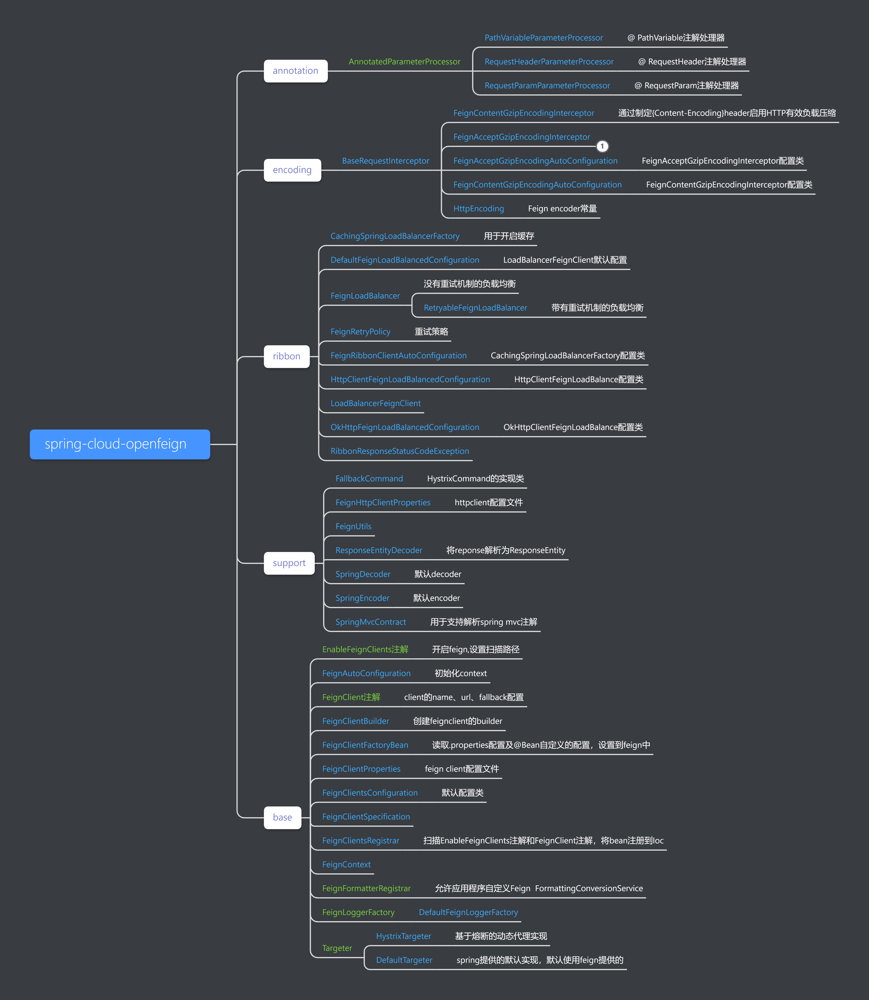

## Spring Boot     <!-- {docsify-ignore} -->


## Spring系列源码

### 1. 容器启动流程

> [AnnotationConfigApplicationContext](https://mp.weixin.qq.com/s/q6zs7xRjpcB4YxLw6w477w) 启动上下文


### 2. 后置处理器

> [ConfigurationClassPostProcessor源码解析](https://zhuanlan.zhihu.com/p/82928873) 


### 3. Spring 事务

> [SpringBoot 与 事务机制](https://blog.csdn.net/qq_41893274/article/details/108713799) 


## SpringCloud系列源码

### 1. spring-cloud-openfeign

> 参考文章：https://blog.csdn.net/sinat_29899265/article/details/86577997

#### 1.1 如何使用spring cloud feign

```java
@SpringBootApplication
@EnableFeignClients
public class WebApplication {

	public static void main(String[] args) {
		SpringApplication.run(WebApplication.class, args);
	}
    
	@FeignClient("name")
	static interface NameService {
		@RequestMapping("/")
		public String getName();
	}
}

```

从官网的例子中，可以看出是通过注解驱动的，所以从注解开始看起。

#### 1.2 spring cloud feign是如何工作

> Feign涉及了两个注解

- @EnableFeignClients，用来开启 Feign

  ```java
  @Retention(RetentionPolicy.RUNTIME)
  @Target(ElementType.TYPE)
  @Documented
  @Import(FeignClientsRegistrar.class)
  public @interface EnableFeignClients {
  
  	String[] value() default {};
  
  	String[] basePackages() default {};
  
  	Class<?>[] basePackageClasses() default {};
  
  	Class<?>[] defaultConfiguration() default {};
  
  	Class<?>[] clients() default {};
  }
  ```

  @FeignClient，用来标记要用 Feign 来拦截的请求接口。

  ```java
  @Target(ElementType.TYPE)
  @Retention(RetentionPolicy.RUNTIME)
  @Documented
  public @interface FeignClient {
  	@AliasFor("name")
  	String value() default "";
  	@Deprecated
  	String serviceId() default "";
  	@AliasFor("value")
  	String name() default "";
  	String qualifier() default "";
  	String url() default "";
  	boolean decode404() default false;
  	Class<?>[] configuration() default {};
  	Class<?> fallback() default void.class;
  	Class<?> fallbackFactory() default void.class;
  	String path() default "";
  	boolean primary() default true;
  }
  ```

  - **@EnableFeignClients** 是关于注解扫描的配置，比如扫描路径，配置等。
  - **@FeignClient** 则是关于对该接口进行代理的时候，一些实现细节的配置，比如访问url是什么， fallback 方法，关于404的请求是抛错误还是正常返回。

#### 1.3 注册客户端

先关注对EnableFeignClients 的处理，可以看出它使用了@Import(FeignClientsRegistrar.class)，看名字可知是一个注册器，通过扫描某个特性的类，将bean注册到IOC中。Spring 通过调用其 `registerBeanDefinitions` 方法来获取其提供的 bean definition。

- **@Import({FeignClientsRegistrar.class})** 

```java
public void registerBeanDefinitions(AnnotationMetadata metadata,BeanDefinitionRegistry registry) {
    //注册configuration
    registerDefaultConfiguration(metadata, registry);
    //注册注解
    registerFeignClients(metadata, registry);
}
```

```java
// 注册配置方法
private void registerDefaultConfiguration(AnnotationMetadata metadata,BeanDefinitionRegistry registry) {
	//获取注解@EnableFeignClients 下设置的属性值
	Map<String, Object> defaultAttrs = metadata.getAnnotationAttributes(EnableFeignClients.class.getName(), true);

	if (defaultAttrs != null && defaultAttrs.containsKey("defaultConfiguration")) {
		String name;
		//判断传入的defaultConfiguration的是不是topClass，所谓topClass就是说此类不是别的类的内部类
		if (metadata.hasEnclosingClass()) {
			name = "default." + metadata.getEnclosingClassName();
		}
		else {
			name = "default." + metadata.getClassName();
		}
		registerClientConfiguration(registry, name,defaultAttrs.get("defaultConfiguration"));
	}
}
```

```java
private void registerClientConfiguration(BeanDefinitionRegistry registry, Object name,Object configuration) {
	//加载FeignClientSpecification bean
	BeanDefinitionBuilder builder = BeanDefinitionBuilder.genericBeanDefinition(FeignClientSpecification.class);
	builder.addConstructorArgValue(name);
	builder.addConstructorArgValue(configuration);
	//注册
	registry.registerBeanDefinition(name + "." + FeignClientSpecification.class.getSimpleName(),builder.getBeanDefinition());
}
```

这里会往 `Registry` 里面添加一个`BeanDefinition`，即 `FeignClientSpecification`，configuration是通过 `EnableFeignClients` 注解的 `defaultConfiguration` 参数传入。

```java
public void registerFeignClients(AnnotationMetadata metadata,BeanDefinitionRegistry registry) {
    ClassPathScanningCandidateComponentProvider scanner = getScanner();
    scanner.setResourceLoader(this.resourceLoader);

    Set<String> basePackages;

    Map<String, Object> attrs = metadata.getAnnotationAttributes(EnableFeignClients.class.getName());
    // 扫描带有FeignClient注解的类
    AnnotationTypeFilter annotationTypeFilter = new AnnotationTypeFilter(FeignClient.class);
    //获取@EnableFeignClients 中clients的值
    final Class<?>[] clients = attrs == null ? null
        : (Class<?>[]) attrs.get("clients");
    if (clients == null || clients.length == 0) {
        //如果没有设置，那么加入要扫描的注解和扫描的包
        scanner.addIncludeFilter(annotationTypeFilter);
        // 确定扫描的包路径列表
        basePackages = getBasePackages(metadata);
    }
    else {
        //如果设置了，最终扫出来的Bean必须是注解中设置的那些
        final Set<String> clientClasses = new HashSet<>();
        basePackages = new HashSet<>();
        for (Class<?> clazz : clients) {
            basePackages.add(ClassUtils.getPackageName(clazz));
            clientClasses.add(clazz.getCanonicalName());
        }
        AbstractClassTestingTypeFilter filter = new AbstractClassTestingTypeFilter() {
            @Override
            protected boolean match(ClassMetadata metadata) {
                String cleaned = metadata.getClassName().replaceAll("\\$", ".");
                return clientClasses.contains(cleaned);
            }
        };
        scanner.addIncludeFilter(
            new AllTypeFilter(Arrays.asList(filter, annotationTypeFilter)));
    }
    //循环扫描，并把根据注解信息，进行相关注册
    for (String basePackage : basePackages) {
        Set<BeanDefinition> candidateComponents = scanner
            .findCandidateComponents(basePackage);
        for (BeanDefinition candidateComponent : candidateComponents) {
            if (candidateComponent instanceof AnnotatedBeanDefinition) {
                // verify annotated class is an interface
                AnnotatedBeanDefinition beanDefinition = (AnnotatedBeanDefinition) candidateComponent;
                AnnotationMetadata annotationMetadata = beanDefinition.getMetadata();
                //必须注解在interface上
                Assert.isTrue(annotationMetadata.isInterface(),
                              "@FeignClient can only be specified on an interface");

                Map<String, Object> attributes = annotationMetadata
                    .getAnnotationAttributes(
                    FeignClient.class.getCanonicalName());

                String name = getClientName(attributes);
                registerClientConfiguration(registry, name,attributes.get("configuration"));

                registerFeignClient(registry, annotationMetadata, attributes);
            }
        }
    }
}

private void registerFeignClient(BeanDefinitionRegistry registry,AnnotationMetadata annotationMetadata, Map<String, Object> attributes) {
    String className = annotationMetadata.getClassName();
    BeanDefinitionBuilder definition = BeanDefinitionBuilder
        .genericBeanDefinition(FeignClientFactoryBean.class);
    validate(attributes);
    //将属性设置到FeignClientFactoryBean 中
    definition.addPropertyValue("url", getUrl(attributes));
    definition.addPropertyValue("path", getPath(attributes));
    String name = getName(attributes);
    definition.addPropertyValue("name", name);
    definition.addPropertyValue("type", className);
    definition.addPropertyValue("decode404", attributes.get("decode404"));
    definition.addPropertyValue("fallback", attributes.get("fallback"));
    definition.addPropertyValue("fallbackFactory", attributes.get("fallbackFactory"));
    //设置Autowire 类型
    definition.setAutowireMode(AbstractBeanDefinition.AUTOWIRE_BY_TYPE);

    String alias = name + "FeignClient";
    AbstractBeanDefinition beanDefinition = definition.getBeanDefinition();

    boolean primary = (Boolean)attributes.get("primary"); // has a default, won't be null

    beanDefinition.setPrimary(primary);

    String qualifier = getQualifier(attributes);
    if (StringUtils.hasText(qualifier)) {
        alias = qualifier;
    }
    //注册bean
    BeanDefinitionHolder holder = new BeanDefinitionHolder(beanDefinition, className,
                                                           new String[] { alias });
    BeanDefinitionReaderUtils.registerBeanDefinition(holder, registry);
}
```

另一个往 Registry 里面添加的 `BeanDefinition`则是`FeignClientFactoryBean`,负责注册FeignClient。

也就是说，Feign的注册一共分为一下几步：

1. 扫描`@EnableFeignClients`注解，如果有`defaultConfiguration`属性配置，则将`configuration`注册到`BeanDefinition`中，如果不指定的话，spring 提供的默认配置是`FeignClientsConfiguration`。
2. 扫描 `basePackage` 下面所有包含了 `@FeignClient` 注解的类
3. 如果`@EnableFeignClients`中配置了clients属性，则扫描出来的bean只有在clients中配置的那些
4. 循环扫描`@FeignClient`注解，如果配置了`configuration`，则将`configuration`按照 **1** 注册打`BeanDefinition`中，也就是说Feign既支持用作统一的默认的Config作为全局配置，也可以分别在`@FeignClient`中单独配置configuration 作为局部配置。
5. 将`@FeignClient`中的其他配置设置到`FeignClientFactoryBean`中。
6. 最后调用`FeignClientFactoryBean#getObject`来创建client实例。

#### 1.4 加载配置项

接下来看下 `FeignClientFactoryBean`，Spring Context 创建 Bean 实例时会调用它的 `getObject` 方法。

```java
public Object getObject() throws Exception {
    return getTarget();
}

/**
* @param <T> the target type of the Feign client
* @return a {@link Feign} client created with the specified data and the context information
*/
<T> T getTarget() {
    FeignContext context = applicationContext.getBean(FeignContext.class);
    Feign.Builder builder = feign(context);//1

    if (!StringUtils.hasText(this.url)) {
        //如果没有指定url,获取name值拼接默认url
        String url;
        if (!this.name.startsWith("http")) {
            url = "http://" + this.name;
        }
        else {
            url = this.name;
        }
        url += cleanPath();
        return (T) loadBalance(builder, context, new HardCodedTarget<>(this.type,
                                                                       this.name, url));
    }
    if (StringUtils.hasText(this.url) && !this.url.startsWith("http")) {
        this.url = "http://" + this.url;
    }
    String url = this.url + cleanPath();
    Client client = getOptional(context, Client.class);
    if (client != null) {
        if (client instanceof LoadBalancerFeignClient) {
            //使用ribbon提供的负载均衡
            // not load balancing because we have a url,
            // but ribbon is on the classpath, so unwrap
            client = ((LoadBalancerFeignClient)client).getDelegate();
        }
        builder.client(client);
    }
    Targeter targeter = get(context, Targeter.class);
    return (T) targeter.target(this, builder, context, new HardCodedTarget<>(
        this.type, this.name, url));
}
```

- 如果未指定url，则根据client的name来拼接url，并开启负载均衡
- 如果指定了URL，没有指定client，那么就根据url来调用，相当于直连，没有负载均衡。如果没有指定client的话，可以使用负载均衡。现在的版本是默认开启负载均衡。

首先在`1`处可以看出通过feign(context)方法初始化了Feign.Builder,所以着重看一下这个方法：

```java
protected Feign.Builder feign(FeignContext context) {
    //获取FeignClientsConfiguration 中注册的bean ，设置到feign中
    FeignLoggerFactory loggerFactory = get(context, FeignLoggerFactory.class);
    Logger logger = loggerFactory.create(this.type);

    // @formatter:off
    Feign.Builder builder = get(context, Feign.Builder.class)
        // required values
        .logger(logger)
        .encoder(get(context, Encoder.class))
        .decoder(get(context, Decoder.class))
        .contract(get(context, Contract.class));
    
    // @formatter:on
    configureFeign(context, builder);

    return builder;
}
```

这里被设置到builder的bean来自于FeignClientsConfiguration在启动时加载到了context中，这是spring的默认配置，

即使在@EnableFeignClients和@FeignClient没有配置configuration也能保证可以使用。

```java
@Configuration
public class FeignClientsConfiguration {
    ...
        @Bean
        @ConditionalOnMissingBean
        public Decoder feignDecoder() {
        return new OptionalDecoder(new ResponseEntityDecoder(new SpringDecoder(this.messageConverters)));
    }

    @Bean
    @ConditionalOnMissingBean
    public Encoder feignEncoder() {
        return new SpringEncoder(this.messageConverters);
    }

    @Bean
    @ConditionalOnMissingBean
    public Contract feignContract(ConversionService feignConversionService) {
        return new SpringMvcContract(this.parameterProcessors, feignConversionService);
    }

    @Bean
    @Scope("prototype")
    @ConditionalOnMissingBean
    public Feign.Builder feignBuilder(Retryer retryer) {
        return Feign.builder().retryer(retryer);
    }
    ...
}

```

那么自定义的configuration在哪里加载呢，可以看到方法`feign(context)`中最后一行调用了`configureFeign(context, builder)`，来看一下这个方法。

```java
protected void configureFeign(FeignContext context, Feign.Builder builder) {
    //获取.properties的属性
    FeignClientProperties properties = applicationContext.getBean(FeignClientProperties.class);
    if (properties != null) {
        if (properties.isDefaultToProperties()) {
            //默认为true
            configureUsingConfiguration(context, builder);
            configureUsingProperties(properties.getConfig().get(properties.getDefaultConfig()), builder);
            configureUsingProperties(properties.getConfig().get(this.name), builder);
        } else {
            configureUsingProperties(properties.getConfig().get(properties.getDefaultConfig()), builder);
            configureUsingProperties(properties.getConfig().get(this.name), builder);
            configureUsingConfiguration(context, builder);
        }
    } else {
        configureUsingConfiguration(context, builder);
    }
}
//获取用户通过configuration @Bean的自定义配置
protected void configureUsingConfiguration(FeignContext context, Feign.Builder builder) {
    Logger.Level level = getOptional(context, Logger.Level.class);
    if (level != null) {
        builder.logLevel(level);
    }
    Retryer retryer = getOptional(context, Retryer.class);
    if (retryer != null) {
        builder.retryer(retryer);
    }
    ErrorDecoder errorDecoder = getOptional(context, ErrorDecoder.class);
    if (errorDecoder != null) {
        builder.errorDecoder(errorDecoder);
    }
    //connectTimeoutMillis和readTimeoutMillis的默认值
    Request.Options options = getOptional(context, Request.Options.class);
    if (options != null) {
        builder.options(options);
    }
    Map<String, RequestInterceptor> requestInterceptors = context.getInstances(
        this.name, RequestInterceptor.class);
    if (requestInterceptors != null) {
        builder.requestInterceptors(requestInterceptors.values());
    }

    if (decode404) {
        builder.decode404();
    }
}


/***
     *
     * @param config 获取.properties中配置的bean
     * @param builder feign
     */
protected void configureUsingProperties(FeignClientProperties.FeignClientConfiguration config, Feign.Builder builder) {
    if (config == null) {
        return;
    }

    if (config.getLoggerLevel() != null) {
        builder.logLevel(config.getLoggerLevel());
    }
    //设置connectTimeoutMillis和readTimeoutMillis的值，这里的属性值来自于.properties配置的
    if (config.getConnectTimeout() != null && config.getReadTimeout() != null) {
        builder.options(new Request.Options(config.getConnectTimeout(), config.getReadTimeout()));
    }

    if (config.getRetryer() != null) {
        Retryer retryer = getOrInstantiate(config.getRetryer());
        builder.retryer(retryer);
    }

    if (config.getErrorDecoder() != null) {
        ErrorDecoder errorDecoder = getOrInstantiate(config.getErrorDecoder());
        builder.errorDecoder(errorDecoder);
    }

    if (config.getRequestInterceptors() != null && !config.getRequestInterceptors().isEmpty()) {
        // this will add request interceptor to builder, not replace existing
        //这里只会往原有的interceptor中添加新的，而不会删掉原有的。
        for (Class<RequestInterceptor> bean : config.getRequestInterceptors()) {
            RequestInterceptor interceptor = getOrInstantiate(bean);
            builder.requestInterceptor(interceptor);
        }
    }

    if (config.getDecode404() != null) {
        if (config.getDecode404()) {
            builder.decode404();
        }
    }

    if (Objects.nonNull(config.getEncoder())) {
        builder.encoder(getOrInstantiate(config.getEncoder()));
    }

    if (Objects.nonNull(config.getDecoder())) {
        builder.decoder(getOrInstantiate(config.getDecoder()));
    }

    if (Objects.nonNull(config.getContract())) {
        builder.contract(getOrInstantiate(config.getContract()));
    }
}
```

把配置文件中的配置项在启动时初始化到FeignClientProperties中。

- 如果配置文件中没有配置，则将FeignClientsConfiguration中的bean作为默认值设置到builder。
- 如果配置文件中有配置，并且用默认加载顺序时，首先加载FeignClientsConfiguration中的bean，然后加载在注解中配置的configuration，最后加载配置文件中的。
- 如果不是默认加载顺序，则首先加载注解中配置的configuration，然后加载配置文件中的配置，最后加载FeignClientsConfiguration中的bean。**\*注意，顺序在后面的配置会覆盖掉前面的***

#### 1.5 创建client实例

配置文件加载完之后，就是最关键的一步，创建实例.因为两种方式都是通过获取 Targeter 来生成动态代理类。这里拿出了负载均衡做例子。

```java
protected <T> T loadBalance(Feign.Builder builder, FeignContext context,
                            HardCodedTarget<T> target) {
    Client client = getOptional(context, Client.class);
    if (client != null) {
        builder.client(client);
        Targeter targeter = get(context, Targeter.class);
        return targeter.target(this, builder, context, target);
    }

    throw new IllegalStateException(
        "No Feign Client for loadBalancing defined. Did you forget to include spring-cloud-starter-netflix-ribbon?");
}

```

在 FeignAutoConfiguration 里面，配置了Target，可以看出这里配置了两种相斥的bean。

```java
@Configuration
@ConditionalOnClass(name = "feign.hystrix.HystrixFeign")
protected static class HystrixFeignTargeterConfiguration {
    @Bean
    @ConditionalOnMissingBean
    public Targeter feignTargeter() {
        return new HystrixTargeter();
    }
}

@Configuration
@ConditionalOnMissingClass("feign.hystrix.HystrixFeign")
protected static class DefaultFeignTargeterConfiguration {
    @Bean
    @ConditionalOnMissingBean
    public Targeter feignTargeter() {
        return new DefaultTargeter();
    }
}


```

如果 feign.hystrix.HystrixFeign`路径不存在，则直接用 FeignBuidler 中DefaultTargeter的 target 方法生成代理。

```java
class HystrixTargeter implements Targeter {
    @Override
    public <T> T target(FeignClientFactoryBean factory,
                        Feign.Builder feign,
                        FeignContext context,
                        Target.HardCodedTarget<T> target) {
        if (!(feign instanceof feign.hystrix.HystrixFeign.Builder)) {
            return feign.target(target);
        }
        feign.hystrix.HystrixFeign.Builder builder = (feign.hystrix.HystrixFeign.Builder) feign;
        SetterFactory setterFactory = getOptional(factory.getName(), context,
                                                  SetterFactory.class);
        if (setterFactory != null) {
            builder.setterFactory(setterFactory);
        }
        Class<?> fallback = factory.getFallback();
        if (fallback != void.class) {
            return targetWithFallback(factory.getName(), context, target, builder, fallback);
        }
        Class<?> fallbackFactory = factory.getFallbackFactory();
        if (fallbackFactory != void.class) {
            return targetWithFallbackFactory(factory.getName(), context, target, builder, fallbackFactory);
        }

        return feign.target(target);
    }
}
```

```java
class DefaultTargeter implements Targeter {

    @Override
    public <T> T target(FeignClientFactoryBean factory,
                        Feign.Builder feign,
                        FeignContext context,
                        Target.HardCodedTarget<T> target) {
        return feign.target(target);
    }
}

```

到这里spring对于创建client实例工作基本完成。接下来主要步骤在feign中。

#### 1.6 Feign是怎么工作的

##### （1）构建接口动态代理

这里会直接调用Feign的target方法：

```java
public <T> T target(Target<T> target) {
    return build().newInstance(target);
}

private InvocationHandlerFactory invocationHandlerFactory =new InvocationHandlerFactory.Default();

private QueryMapEncoder queryMapEncoder = new QueryMapEncoder.Default();

public Feign build() {
    SynchronousMethodHandler.Factory synchronousMethodHandlerFactory =
        new SynchronousMethodHandler.Factory(client, retryer, requestInterceptors, logger,
                                             logLevel, decode404, closeAfterDecode);
    //handlersByName将所有参数进行封装，并提供解析接口方法的逻辑
    ParseHandlersByName handlersByName =
        new ParseHandlersByName(contract, options, encoder, decoder, queryMapEncoder,
                                errorDecoder, synchronousMethodHandlerFactory);
    return new ReflectiveFeign(handlersByName, invocationHandlerFactory, queryMapEncoder);
}

```

`ReflectiveFeign`构造函数有三个参数：

- `ParseHandlersByName` 将builder所有参数进行封装，并提供解析接口方法的逻辑
- `InvocationHandlerFactory` 默认值是`InvocationHandlerFactory.Default`,通过java动态代理的`InvocationHandler`实现
- `QueryMapEncoder` 接口参数注解`@QueryMap`时，参数的编码器，默认值`QueryMapEncoder.Default`

ReflectiveFeign 生成动态代理对象。

`ReflectiveFeign#newInstance`

```java
public <T> T newInstance(Target<T> target) {
    //为每个方法创建一个SynchronousMethodHandler对象，并放在 Map 里面。
    //targetToHandlersByName是构造器传入的ParseHandlersByName对象，根据target对象生成MethodHandler映射
    Map<String, MethodHandler> nameToHandler = targetToHandlersByName.apply(target);
    Map<Method, MethodHandler> methodToHandler = new LinkedHashMap<Method, MethodHandler>();
    List<DefaultMethodHandler> defaultMethodHandlers = new LinkedList<DefaultMethodHandler>();
	//遍历接口所有方法，构建Method->MethodHandler的映射
    for (Method method : target.type().getMethods()) {
      if (method.getDeclaringClass() == Object.class) {
        continue;
      } else if(Util.isDefault(method)) {
        //如果是 default 方法，说明已经有实现了，用 DefaultHandler接口default方法的Handler
        DefaultMethodHandler handler = new DefaultMethodHandler(method);
        defaultMethodHandlers.add(handler);
        methodToHandler.put(method, handler);
      } else {
        //否则就用上面的 SynchronousMethodHandler
        methodToHandler.put(method, nameToHandler.get(Feign.configKey(target.type(), method)));
      }
    }
    // 创建动态代理，factory 是 InvocationHandlerFactory.Default，创建出来的是 ReflectiveFeign.FeignInvocationHanlder
    // 也就是说后续对方法的调用都会进入到该对象的 inovke 方法。
    InvocationHandler handler = factory.create(target, methodToHandler);
    // 创建动态代理对象
    T proxy = (T) Proxy.newProxyInstance(target.type().getClassLoader(), new Class<?>[]{target.type()}, handler);
	//将default方法直接绑定到动态代理上
    for(DefaultMethodHandler defaultMethodHandler : defaultMethodHandlers) {
      defaultMethodHandler.bindTo(proxy);
    }
    return proxy;
  }
```

这段代码主要的逻辑是：

1. 创建MethodHandler的映射，这里创建的是实现类SynchronousMethodHandler
2. 通过InvocationHandlerFatory创建InvocationHandler
3. 绑定接口的default方法，通过DefaultMethodHandler绑定

`SynchronousMethodHandler`和`DefaultMethodHandler`实现了`InvocationHandlerFactory.MethodHandler`接口，动态代理对象调用方法时，如果是`default`方法，会直接调用接口方法，因为这里将接口的`default`方法绑定到动态代理对象上了，其他方法根据方法签名找到`SynchronousMethodHandler`对象，调用其`invoke`方法。

##### （2）创建MethodHandler方法处理器

**ReflectiveFeign#apply** 

```java
public Map<String, MethodHandler> apply(Target key) {
    //通过contract解析接口方法，生成MethodMetadata列表，默认的contract解析Feign自定义的http注解
    List<MethodMetadata> metadata =contract.parseAndValidatateMetadata(key.type());
    Map<String, MethodHandler> result = new LinkedHashMap<String, MethodHandler>();
    for (MethodMetadata md : metadata) {
        //根据目标接口类和方法上的注解信息判断该用哪种 buildTemplate
        //BuildTemplateByResolvingArgs实现RequestTemplate.Factory，RequestTemplate的工厂
        BuildTemplateByResolvingArgs buildTemplate;
        if (!md.formParams().isEmpty() && md.template().bodyTemplate() == null) {
            //如果有formParam，并且bodyTemplate不为空，请求体为x-www-form-urlencoded格式
            //将会解析form参数，填充到bodyTemplate中
            buildTemplate = new BuildFormEncodedTemplateFromArgs(md, encoder);
        } else if (md.bodyIndex() != null) {
            //如果包含请求体，将会用encoder编码请求体对象
            buildTemplate = new BuildEncodedTemplateFromArgs(md, encoder);
        } else {
            //默认的RequestTemplate的工厂，没有请求体，不需要编码器
            buildTemplate = new BuildTemplateByResolvingArgs(md);
        }
        //使用工厂SynchronousMethodHandler.Factory创建SynchronousMethodHandler
        result.put(md.configKey(),
                   factory.create(key, md, buildTemplate, options, decoder, errorDecoder));
    }
    return result;
}
```

这段代码的逻辑是：

1. 通过Contract解析接口方法，生成MethodMetadata，默认的Contract解析Feign自定义的http注解
2. 根据MethodMetadata方法元数据生成特定的RequestTemplate的工厂
3. 使用`SynchronousMethodHandler.Factory`工厂创建`SynchronousMethodHandler`
   这里有两个工厂不要搞混淆了，`SynchronousMethodHandler`工厂和`RequestTemplate`工厂，`SynchronousMethodHandler`的属性包含RequestTemplate工厂

**SynchronousMethodHandlerFactory#create**

```java
public MethodHandler create(Target<?> target, MethodMetadata md,
                            RequestTemplate.Factory buildTemplateFromArgs,
                            Options options, Decoder decoder, ErrorDecoder errorDecoder) {
    //buildTemplateFromArgs--RequestTemplate Facoory
    return new SynchronousMethodHandler(target, client, retryer, requestInterceptors, logger,
                                        logLevel, md, buildTemplateFromArgs, options, decoder,
                                        errorDecoder, decode404);
}
```

##### （3）Contract解析接口方法生成MethodMetadata

这里有两个Contract，一个是feign默认的Contract，另一个是Spring实现的Contract。

###### 3.1 Feign.Contract-Contract.Default

feign默认的解析器是`Contract.Default`继承了`Contract.BaseContract`，解析生成`MethodMetadata`方法入口：

```java
@Override
public List<MethodMetadata> parseAndValidatateMetadata(Class<?> targetType) {

    Map<String, MethodMetadata> result = new LinkedHashMap<String, MethodMetadata>();
    for (Method method : targetType.getMethods()) {
        //...
        MethodMetadata metadata = parseAndValidateMetadata(targetType, method);
        //...
        result.put(metadata.configKey(), metadata);
    }
    return new ArrayList<MethodMetadata>(result.values());
}

protected MethodMetadata parseAndValidateMetadata(Class<?> targetType, Method method) {
    MethodMetadata data = new MethodMetadata();
    data.returnType(Types.resolve(targetType, targetType, method.getGenericReturnType()));
    data.configKey(Feign.configKey(targetType, method));

    if(targetType.getInterfaces().length == 1) {
        processAnnotationOnClass(data, targetType.getInterfaces()[0]);
    }
    //处理Class上的注解
    processAnnotationOnClass(data, targetType);

    for (Annotation methodAnnotation : method.getAnnotations()) {
        //处理方法注解
        processAnnotationOnMethod(data, methodAnnotation, method);
    }
    //...
    Class<?>[] parameterTypes = method.getParameterTypes();
    Type[] genericParameterTypes = method.getGenericParameterTypes();
    
    Annotation[][] parameterAnnotations = method.getParameterAnnotations();
    int count = parameterAnnotations.length;
    for (int i = 0; i < count; i++) {
        boolean isHttpAnnotation = false;
        if (parameterAnnotations[i] != null) {
            //方法参数注解
            isHttpAnnotation = processAnnotationsOnParameter(data, parameterAnnotations[i], i);
        }
        if (parameterTypes[i] == URI.class) {
            //参数类型是URI，后面构造http请求时，使用该URI
            data.urlIndex(i);
        } else if (!isHttpAnnotation) {
            //如果没有被http注解，就是body参数
            //...
            data.bodyIndex(i);
            data.bodyType(Types.resolve(targetType, targetType, genericParameterTypes[i]));
        }
    }

    if (data.headerMapIndex() != null) {
        //@HeaderMap注解的参数必须是Map，key类型必须是String
        checkMapString("HeaderMap", parameterTypes[data.headerMapIndex()], genericParameterTypes[data.headerMapIndex()]);
    }

    if (data.queryMapIndex() != null) {
        if (Map.class.isAssignableFrom(parameterTypes[data.queryMapIndex()])) {
            //@QueryMap注解的参数如果是Map，key类型必须是String
            checkMapKeys("QueryMap", genericParameterTypes[data.queryMapIndex()]);
        }
    }
    return data;
}
```

**1.处理Class上的注解** 

这里主要处理`@Headers`

```java
//处理@Headers注解
protected void processAnnotationOnClass(MethodMetadata data, Class<?> targetType) {
    if (targetType.isAnnotationPresent(Headers.class)) {
        //被Headers注解
        String[] headersOnType = targetType.getAnnotation(Headers.class).value();
        //...
        //header解析成map，加到MethodMetadata中
        Map<String, Collection<String>> headers = toMap(headersOnType);
        headers.putAll(data.template().headers());
        data.template().headers(null); // to clear
        data.template().headers(headers);
    }
}
```

**2.处理方法上的注解**

这里主要处理`@RequestLine`、`@Body`、`@Headers`

```java
//处理方法注解
protected void processAnnotationOnMethod(MethodMetadata data, Annotation methodAnnotation,
                                         Method method) {
    Class<? extends Annotation> annotationType = methodAnnotation.annotationType();
    if (annotationType == RequestLine.class) {
        //@RequestLine注解
        String requestLine = RequestLine.class.cast(methodAnnotation).value();
        //...
        if (requestLine.indexOf(' ') == -1) {
            //...
            data.template().method(requestLine);
            return;
        }
        //http请求方法
        data.template().method(requestLine.substring(0, requestLine.indexOf(' ')));
        if (requestLine.indexOf(' ') == requestLine.lastIndexOf(' ')) {
            // no HTTP version is ok
            data.template().append(requestLine.substring(requestLine.indexOf(' ') + 1));
        } else {
            // skip HTTP version
            data.template().append(
                requestLine.substring(requestLine.indexOf(' ') + 1, requestLine.lastIndexOf(' ')));
        }
        //将'%2F'反转为'/'
        data.template().decodeSlash(RequestLine.class.cast(methodAnnotation).decodeSlash());
        //参数集合格式化方式，默认使用key=value0&key=value1
        data.template().collectionFormat(RequestLine.class.cast(methodAnnotation).collectionFormat());

    } else if (annotationType == Body.class) {
        //@Body注解
        String body = Body.class.cast(methodAnnotation).value();
        //...
        if (body.indexOf('{') == -1) {
            //body中不存在{，直接传入body
            data.template().body(body);
        } else {
            //body中存在{，就是bodyTemplate方式
            data.template().bodyTemplate(body);
        }
    } else if (annotationType == Headers.class) {
        //@Header注解
        String[] headersOnMethod = Headers.class.cast(methodAnnotation).value();
        //...
        data.template().headers(toMap(headersOnMethod));
    }
}
```

**3.处理参数上的注解** 

这里主要处理`@Param`、`@QueryMap`、`@HeaderMap`，只要有这三个注解，则isHttpAnnotation=true。 

```java
//处理参数上的注解
protected boolean processAnnotationsOnParameter(
    MethodMetadata data, 
    Annotation[] annotations,
    int paramIndex) {
    boolean isHttpAnnotation = false;
    for (Annotation annotation : annotations) {
        Class<? extends Annotation> annotationType = annotation.annotationType();
        if (annotationType == Param.class) {
            //@Param注解
            Param paramAnnotation = (Param) annotation;
            String name = paramAnnotation.value();
            //...
            //增加到MethodMetadata中
            nameParam(data, name, paramIndex);
            //@Param注解的expander参数，定义参数的解释器，默认是ToStringExpander，调用参数的toString方法
            Class<? extends Param.Expander> expander = paramAnnotation.expander();
            if (expander != Param.ToStringExpander.class) {
                data.indexToExpanderClass().put(paramIndex, expander);
            }
            //参数是否已经urlEncoded，如果没有，会使用urlEncoded方式编码
            data.indexToEncoded().put(paramIndex, paramAnnotation.encoded());
            isHttpAnnotation = true;
            String varName = '{' + name + '}';
            if (!data.template().url().contains(varName) &&
                !searchMapValuesContainsSubstring(data.template().queries(), varName) &&
                !searchMapValuesContainsSubstring(data.template().headers(), varName)) {
                //如果参数不在path里面，不在query里面，不在header里面，就设置到formParam中
                data.formParams().add(name);
            }
        } else if (annotationType == QueryMap.class) {
            //@QueryMap注解，注解参数对象时，将该参数转换为http请求参数格式发送
            //...
            data.queryMapIndex(paramIndex);
            data.queryMapEncoded(QueryMap.class.cast(annotation).encoded());
            isHttpAnnotation = true;
        } else if (annotationType == HeaderMap.class) {
            //@HeaderMap注解，注解一个Map类型的参数，放入http header中发送
            //...
            data.headerMapIndex(paramIndex);
            isHttpAnnotation = true;
        }
    }
    return isHttpAnnotation;
}
```

###### 3.2 Spring.Contract-SpringMvcContract

feign默认的解析器是`SpringMvcContract`继承了`Contract.BaseContract`，解析生成`MethodMetadata`方法入口: 

```java
@Override
public MethodMetadata parseAndValidateMetadata(Class<?> targetType, Method method) {
    this.processedMethods.put(Feign.configKey(targetType, method), method);
    MethodMetadata md = super.parseAndValidateMetadata(targetType, method);

    RequestMapping classAnnotation = findMergedAnnotation(targetType,
                                                          RequestMapping.class);
    if (classAnnotation != null) {
        // produces - use from class annotation only if method has not specified this
        // 如果Accept为空，则设置@RequestMapping的produces
        if (!md.template().headers().containsKey(ACCEPT)) {
            parseProduces(md, method, classAnnotation);
        }

        // consumes -- use from class annotation only if method has not specified this
        // 如果Content-Type为空，则设置@RequestMapping的consumes
        if (!md.template().headers().containsKey(CONTENT_TYPE)) {
            parseConsumes(md, method, classAnnotation);
        }

        // headers -- class annotation is inherited to methods, always write these if
        // present 设置heerders
        parseHeaders(md, method, classAnnotation);
    }
    return md;
}
```

这里`parseAndValidateMetadata`调用了父类即BaseContract的方法，如上，也会分为3部来处理，这里只分析有区别的部分。解析完成之后，会根据在class上注解的`@RequestMapping`的属性值来设置到MethodMetadata中。

**1. 处理Class上的注解**

这里主要处理`@RequestMapping` 

```java
protected void processAnnotationOnClass(MethodMetadata data, Class<?> clz) {
    if (clz.getInterfaces().length == 0) {
        RequestMapping classAnnotation = findMergedAnnotation(clz,
                                                              RequestMapping.class);
        if (classAnnotation != null) {
            // Prepend path from class annotation if specified
            if (classAnnotation.value().length > 0) {
                String pathValue = emptyToNull(classAnnotation.value()[0]);
                pathValue = resolve(pathValue);
                if (!pathValue.startsWith("/")) {
                    pathValue = "/" + pathValue;
                }
                //插入url
                data.template().insert(0, pathValue);
            }
        }
    }
}
```

**1.2 处理方法上的注解**

这里主要处理`@RequestMapping`，和处理class时差不多

```java
protected void processAnnotationOnMethod(MethodMetadata data,
                                         Annotation methodAnnotation, Method method) {
    if (!RequestMapping.class.isInstance(methodAnnotation) && !methodAnnotation
        .annotationType().isAnnotationPresent(RequestMapping.class)) {
        return;
    }

    RequestMapping methodMapping = findMergedAnnotation(method, RequestMapping.class);
    // 设置HTTP Method
    RequestMethod[] methods = methodMapping.method();
    if (methods.length == 0) {
        methods = new RequestMethod[] { RequestMethod.GET };
    }
    checkOne(method, methods, "method");
    data.template().method(methods[0].name());

    // path
    checkAtMostOne(method, methodMapping.value(), "value");
    if (methodMapping.value().length > 0) {
        String pathValue = emptyToNull(methodMapping.value()[0]);
        if (pathValue != null) {
            pathValue = resolve(pathValue);
            // Append path from @RequestMapping if value is present on method
            if (!pathValue.startsWith("/")
                && !data.template().toString().endsWith("/")) {
                pathValue = "/" + pathValue;
            }
            data.template().append(pathValue);
        }
    }

    // produces
    parseProduces(data, method, methodMapping);

    // consumes
    parseConsumes(data, method, methodMapping);

    // headers
    parseHeaders(data, method, methodMapping);

    data.indexToExpander(new LinkedHashMap<Integer, Param.Expander>());
}
```

**1.3 处理参数上的注解** 

这里主要处理`@Param`、`@QueryMap`、`@HeaderMap` 

```java
protected boolean processAnnotationsOnParameter(
    MethodMetadata data,
    Annotation[] annotations, 
    int paramIndex) {
    boolean isHttpAnnotation = false;

    AnnotatedParameterProcessor.AnnotatedParameterContext context = new SimpleAnnotatedParameterContext(
        data, paramIndex);
    Method method = this.processedMethods.get(data.configKey());
    for (Annotation parameterAnnotation : annotations) {
        AnnotatedParameterProcessor processor = this.annotatedArgumentProcessors
            .get(parameterAnnotation.annotationType());
        if (processor != null) {
            Annotation processParameterAnnotation;
            // synthesize, handling @AliasFor, while falling back to parameter name on
            // missing String #value():
            processParameterAnnotation = synthesizeWithMethodParameterNameAsFallbackValue(
                parameterAnnotation, method, paramIndex);
            //调用不同策略处理不同的注解
            isHttpAnnotation |= processor.processArgument(context,
                                                          processParameterAnnotation, method);
        }
    }
    if (isHttpAnnotation && data.indexToExpander().get(paramIndex) == null
        && this.conversionService.canConvert(
            method.getParameterTypes()[paramIndex], String.class)) {
        data.indexToExpander().put(paramIndex, this.expander);
    }
    return isHttpAnnotation;
}
```

这里spring提供了三种参数上的注解解析

- `RequestHeaderParameterProcessor`：处理`@RequestHeader`
- `PathVariableParameterProcessor`：处理`@PathVariable`
- `RequestParamParameterProcessor`：处理`@RequestParam`

代码稍微有点多，但是逻辑很清晰，先处理类上的注解，再处理方法上注解，最后处理方法参数注解，把所有注解的情况都处理到就可以了。

生成的`MethodMetadata`的结构如下：

```java
public final class MethodMetadata implements Serializable {
    //标识方法的key，接口名加方法签名：GitHub#contributors(String,String)
    private String configKey;
    //方法返回值类型
    private transient Type returnType;
    //uri参数的位置，方法中可以写个uri参数，发请求时直接使用这个参数
    private Integer urlIndex;
    //body参数的位置，只能有一个注解的参数为body，否则报错
    private Integer bodyIndex;
    //headerMap参数的位置
    private Integer headerMapIndex;
    //@QueryMap注解参数位置
    private Integer queryMapIndex;
    //@QueryMap注解里面encode参数，是否已经urlEncode编码过了
    private boolean queryMapEncoded;
    //body的类型
    private transient Type bodyType;
    //RequestTemplate
    private RequestTemplate template = new RequestTemplate();
    //form请求参数
    private List<String> formParams = new ArrayList<String>();
    //方法参数位置和名称的map
    private Map<Integer, Collection<String>> indexToName ;
    //@Param中注解的expander方法，可以指定解析参数类
    private Map<Integer, Class<? extends Expander>> indexToExpanderClass ;
    //参数是否被urlEncode编码过了，@Param中encoded方法
    private Map<Integer, Boolean> indexToEncoded ;
    //自定义的Expander
    private transient Map<Integer, Expander> indexToExpander;

```

##### （4）调用

ReflectiveFeign.FeignInvocationHanlder 的 invoke 方法

```java
public Object invoke(Object proxy, Method method, Object[] args) throws Throwable {
    //通过动态代理实现了几个通用方法，比如 equals、toString、hasCode
    if ("equals".equals(method.getName())) {
        try {
            Object
                otherHandler =
                args.length > 0 && args[0] != null ? Proxy.getInvocationHandler(args[0]) : null;
            return equals(otherHandler);
        } catch (IllegalArgumentException e) {
            return false;
        }
    } else if ("hashCode".equals(method.getName())) {
        return hashCode();
    } else if ("toString".equals(method.getName())) {
        return toString();
    }
    //找到具体的 method 的 Handler，然后调用 invoke 方法。这样就又进入了SynchronousMethodHandler对象的 invoke 方法。
    return dispatch.get(method).invoke(args);
}
```

SynchronousMethodHandler 的 invoke 方法主要是应用 encoder，decoder 以及 retry 等配置， 并执行http请求及返回结果的处理

```java
public Object invoke(Object[] argv) throws Throwable {
    RequestTemplate template = buildTemplateFromArgs.create(argv);
    Retryer retryer = this.retryer.clone();
    while (true) {
        try {
            return executeAndDecode(template);
        } catch (RetryableException e) {
            retryer.continueOrPropagate(e);
            if (logLevel != Logger.Level.NONE) {
                logger.logRetry(metadata.configKey(), logLevel);
            }
            continue;
        }
    }
}

Object executeAndDecode(RequestTemplate template) throws Throwable {
	//通过RequestTemplate生成Request,这里会首先执行RequestInterceptors
    Request request = targetRequest(template);

    if (logLevel != Logger.Level.NONE) {
        logger.logRequest(metadata.configKey(), logLevel, request);
    }

    Response response;
    long start = System.nanoTime();
    try {
        //通过 client 获得请求的返回值
        response = client.execute(request, options);
        // ensure the request is set. TODO: remove in Feign 10
        response.toBuilder().request(request).build();
    } catch (IOException e) {
        if (logLevel != Logger.Level.NONE) {
            logger.logIOException(metadata.configKey(), logLevel, e, elapsedTime(start));
        }
        throw errorExecuting(request, e);
    }
    long elapsedTime = TimeUnit.NANOSECONDS.toMillis(System.nanoTime() - start);

    boolean shouldClose = true;
    try {
        if (logLevel != Logger.Level.NONE) {
            response =
                logger.logAndRebufferResponse(metadata.configKey(), logLevel, response, elapsedTime);
            // ensure the request is set. TODO: remove in Feign 10
            //将request设置到response中
            response.toBuilder().request(request).build();
        }
        if (Response.class == metadata.returnType()) {
            if (response.body() == null) {
                return response;
            }
            if (response.body().length() == null ||
                response.body().length() > MAX_RESPONSE_BUFFER_SIZE) {
                shouldClose = false;
                return response;
            }
            // Ensure the response body is disconnected
            byte[] bodyData = Util.toByteArray(response.body().asInputStream());
            return response.toBuilder().body(bodyData).build();
        }
        if (response.status() >= 200 && response.status() < 300) {
            if (void.class == metadata.returnType()) {
                return null;
            } else {
                //解码
                return decode(response);
            }
        } else if (decode404 && response.status() == 404 && void.class != metadata.returnType()) {
            return decode(response);
        } else {
            throw errorDecoder.decode(metadata.configKey(), response);
        }
    } 
    //...

```

Client也有两种，一种直连，一种负载均衡，这里主要分析直连，负载均衡最后也要调用这里。

**Client.Default#execute**

调用HttpURLConnection进行http请求

```java
public Response execute(Request request, Options options) throws IOException {
    HttpURLConnection connection = convertAndSend(request, options);
    return convertResponse(connection).toBuilder().request(request).build();
}

HttpURLConnection convertAndSend(Request request, Options options) throws IOException {
    final HttpURLConnection
        connection =
        (HttpURLConnection) new URL(request.url()).openConnection();
    if (connection instanceof HttpsURLConnection) {
        HttpsURLConnection sslCon = (HttpsURLConnection) connection;
        if (sslContextFactory != null) {
            sslCon.setSSLSocketFactory(sslContextFactory);
        }
        if (hostnameVerifier != null) {
            sslCon.setHostnameVerifier(hostnameVerifier);
        }
    }
    connection.setConnectTimeout(options.connectTimeoutMillis());
    connection.setReadTimeout(options.readTimeoutMillis());
    connection.setAllowUserInteraction(false);
    connection.setInstanceFollowRedirects(options.isFollowRedirects());
    connection.setRequestMethod(request.method());

    Collection<String> contentEncodingValues = request.headers().get(CONTENT_ENCODING);
    boolean
        gzipEncodedRequest =
        contentEncodingValues != null && contentEncodingValues.contains(ENCODING_GZIP);
    boolean
        deflateEncodedRequest =
        contentEncodingValues != null && contentEncodingValues.contains(ENCODING_DEFLATE);

    boolean hasAcceptHeader = false;
    Integer contentLength = null;
    for (String field : request.headers().keySet()) {
        if (field.equalsIgnoreCase("Accept")) {
            hasAcceptHeader = true;
        }
        for (String value : request.headers().get(field)) {
            if (field.equals(CONTENT_LENGTH)) {
                if (!gzipEncodedRequest && !deflateEncodedRequest) {
                    contentLength = Integer.valueOf(value);
                    connection.addRequestProperty(field, value);
                }
            } else {
                connection.addRequestProperty(field, value);
            }
        }
    }
    // Some servers choke on the default accept string.
    if (!hasAcceptHeader) {
        connection.addRequestProperty("Accept", "*/*");
    }

    if (request.body() != null) {
        if (contentLength != null) {
            connection.setFixedLengthStreamingMode(contentLength);
        } else {
            connection.setChunkedStreamingMode(8196);
        }
        connection.setDoOutput(true);
        OutputStream out = connection.getOutputStream();
        if (gzipEncodedRequest) {
            out = new GZIPOutputStream(out);
        } else if (deflateEncodedRequest) {
            out = new DeflaterOutputStream(out);
        }
        try {
            out.write(request.body());
        } finally {
            try {
                out.close();
            } catch (IOException suppressed) { // NOPMD
            }
        }
    }
    return connection;
}

Response convertResponse(HttpURLConnection connection) throws IOException {
    int status = connection.getResponseCode();
    String reason = connection.getResponseMessage();

    if (status < 0) {
        throw new IOException(format("Invalid status(%s) executing %s %s", status,
                                     connection.getRequestMethod(), connection.getURL()));
    }

    Map<String, Collection<String>> headers = new LinkedHashMap<String, Collection<String>>();
    for (Map.Entry<String, List<String>> field : connection.getHeaderFields().entrySet()) {
        // response message
        if (field.getKey() != null) {
            headers.put(field.getKey(), field.getValue());
        }
    }

    Integer length = connection.getContentLength();
    if (length == -1) {
        length = null;
    }
    InputStream stream;
    if (status >= 400) {
        stream = connection.getErrorStream();
    } else {
        stream = connection.getInputStream();
    }
    return Response.builder()
        .status(status)
        .reason(reason)
        .headers(headers)
        .body(stream, length)
        .build();
}
```

最后放一张读源码时画的脑图

  


