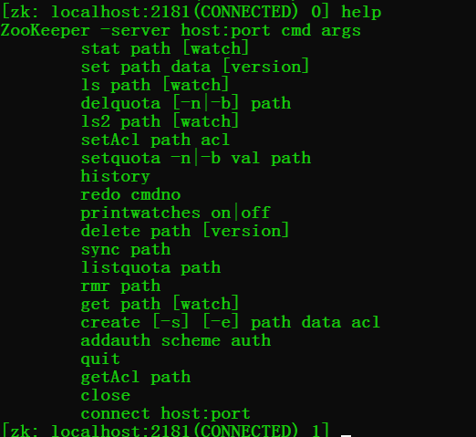
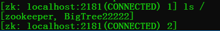
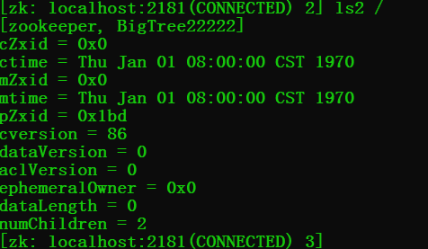
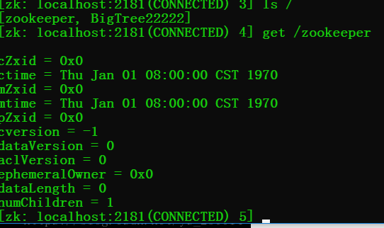
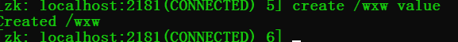
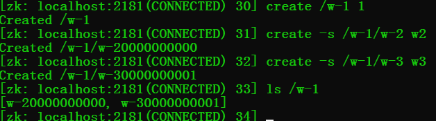
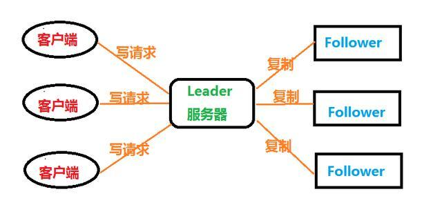
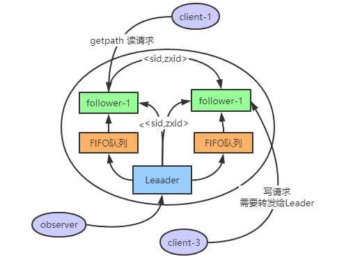
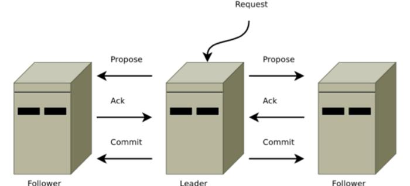
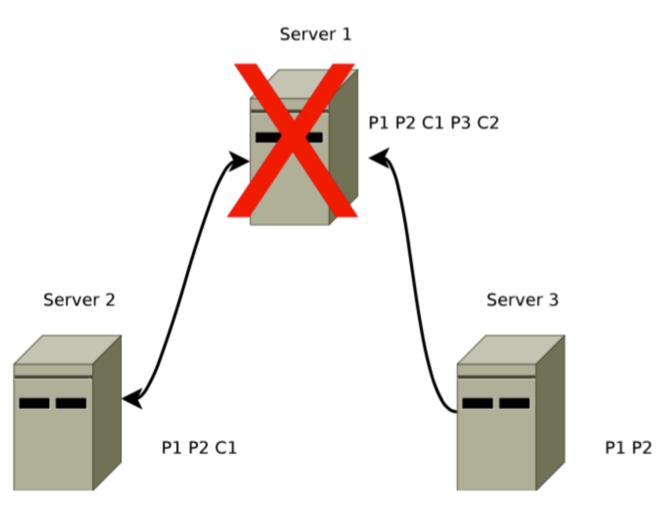

### zookeeper

---

### ZooKeeper 基础

​     `Zookeeper` 是一个分布式服务框架，主要是用来解决分布式应用中遇到的一些数据管理问题如：`统一命名服务`、`状态同步服务`、`集群管理`、`分布式应用配置项的管理`等。

-  [官网文章入口](https://zookeeper.apache.org/doc/r3.3.3/zookeeperOver.html)  
-  [应用实战](https://segmentfault.com/a/1190000017178722#articleHeader20) || [下载](https://downloads.apache.org/) 

- [Zookeeper 基础入门](https://blog.csdn.net/qq_41893274/article/details/110305753) 

####  1. 设计目标

- **高吞吐量和低延迟**：zookeeper允许分布式进程通过共享的分层名称空间相互调用，该名称的组织方式类似于标准的文件系统，名称空间由数据寄存器（在ZooKeeper中称为znodes）组成，它们类似于文件和目录。与文件系统不同的是，ZooKeeper的**数据是基于内存** 。
- **只要大多数服务可用，则zookeeper服务可用**
-  **满足CP** (分区容错性和一致性) ：客户端连接单个zookeeper服务器会维护一个TCP连接，通过发送请求获取响应，获取监视事件，并发送心跳，断开TCP连接时，客户端会连接其它的客户端。

​    

####     2. 数据模型和分层名称空间

- 名称是由斜杠（/）分隔的一系列路径元素。ZooKeeper名称空间中的每个节点都由路径标识


- 节点和短暂节点

​    ZooKeeper命名空间中的每个节点都可以具有与其关联的数据以及子节点，每个节点使用 znode表示，

1. **znode 维护一个统计数据结构（包括数据更改，ACL更改，时间戳版本号）用于缓存验证和协调更新。** znode每次更改时，版本都会更新

2. 临时节点：只要创建znode的会话处于活动状态，这些znode就会存在。会话结束时，将删除znode。（比如实现分布式锁）

#### 3. zookeeper的特性

- 顺序一致性-来自客户端的更新将按照其发送顺序进行应用。

- 原子性-更新成功或失败。没有部分结果。

- 单个系统映像-无论客户端连接到哪个服务器，客户端都将看到相同的服务视图。

- 可靠性-应用更新后，此更新将一直持续到客户端覆盖更新为止。

- 及时性-确保系统的客户视图在特定时间范围内是最新的。


#### 4. 基本功能

1. 创建  在树中的某个位置创建一个节点
2. 删除   删除节点
3. 存在    测试某个位置是否存在节点
4. 获取数据  从节点读取数据
5. 设置数据   将数据写入节点
6. 查找子节点  检索节点的子级列表=
7. 同步   等待数据传播

##### 4.1 zookeeper 客户端命令行操作

> Linux 使用 bin/zkCli.sh   || Windows使用 zkcli.cmd 启动客户端

- help 查看所有命令

   

- 查看当前节点包含的内容：  ` ls /` 

   

- 查看当前节点内容和详细信息: ` ls2 /` 

   

- 获取节点的值:  ` get /节点名` 

   

- 创建普通节点: ` create /wxw value` 

   

- 创建短暂临时节点: ` create -e /wxw-1  value`   使用quit退出客户端后该节点就会被删除

   

- 创建有序节点：

  先创建一个普通的根节点   create /w-1   v1

  然后通过 ·`-s`  创建带序号的节点      create -s  /w-1/w-2    v2      create  -s  /w-1/w-3   val3

  查看创建的节点：` · ls /w-1·  `  

   

- 修改节点数据: ` set  /wxw newvalue` 

- 删除节点 : ` delete  /wxw`

- 递归删除节点:(递归删除所有的节点，包括子节点):  `  rmr /wxw ` 

- 查看节点状态: ` stat /wxw` 

- 监听节点值的变化:  ` get  /wxw/w-1  watch  `   这里只要这个节点值变化，就会得到相应，但是只能有一次响应，即节点值改变一次之后就不会再监听

- 监听节点的子节点变化(路径变化) :  ` ls /path watch`              只要路径变化就会相应，同样的只会响应一次

> [zookeeper客户端命令详解](https://www.cnblogs.com/senlinyang/p/7833669.html)  

#### 5. zookeeper 环境

- windows 环境

    1.  [下载入口](https://zookeeper.apache.org/releases.html)  
       2.  [安装参考](https://blog.csdn.net/qq_43222167/article/details/106096290) 

配置：

- 将conf目录下的zoo_sample.cfg文件，复制一份，重命名为zoo.cfg
- **存数据**修改zoo.cfg配置文件，将dataDir=/tmp/zookeeper修改成zookeeper安装目录所在的data文件夹,需要在安装目录下面新建一个空的data文件夹
- **存日志**需要在安装目录下新建log文件夹，再添加一条添加数据日志的配置 log 

```c
dataDir=D:\install\apache-zookeeper-3.5.7-bin\data
dataLogDir=D:\install\apache-zookeeper-3.5.7-bin\log
```


配置参数说明：

```scss
tickTime：这个时间是作为 Zookeeper 服务器之间或客户端与服务器之间维持心跳的时间间隔，也就是每个 tickTime 时间就会发送一个心跳。
initLimit：这个配置项是用来配置 Zookeeper 接受客户端（这里所说的客户端不是用户连接 Zookeeper 服务器的客户端，而是 Zookeeper 服务器集群中连接到 Leader 的 Follower 服务器）初始化连接时最长能忍受多少个心跳时间间隔数。当已经超过 10 个心跳的时间（也就是 tickTime）长度后 Zookeeper 服务器还没有收到客户端的返回信息，那么表明这个客户端连接失败。总的时间长度就是 5*2000=10 秒
syncLimit：这个配置项标识 Leader 与 Follower 之间发送消息，请求和应答时间长度，最长不能超过多少个 tickTime 的时间长度，总的时间长度就是 2*2000=4 秒
dataDir：顾名思义就是 Zookeeper 保存数据的目录，默认情况下，Zookeeper 将写数据的日志文件也保存在这个目录里。
clientPort：这个端口就是客户端连接 Zookeeper 服务器的端口，Zookeeper 会监听这个端口，接受客户端的访问请求。
```

启动：

​    windows下：使用 zkServer.cmd  // zkCli.cmd的启动

#### 6. Zookeeper 典型应用场景

1. 数据发布订阅（配置中心）
2. 命名服务
3. Master选举
4. 集群管理
5. 分布式队列
6. 分布式锁

### Zookeeper 应用实战


#### 1. Zookeeper 监听机制

> Zookeeper的监听机制很多人都踩过坑，感觉实现了watcher 接口，后面节点的变化都会一一推送过来，然而并非如此。

**Watch机制官方声明**：一个Watch事件是一个一次性的触发器，当被设置了Watch的数据发生了改变的时候，则服务器将这个改变发送给设置了Watch的客户端，以便通知它们。

zookeeper 的 watcher 机制，可以分为四个过程：

- 客户端注册 watcher。
- 服务端处理 watcher。
- 服务端触发 watcher 事件。
- 客户端回调 watcher。

##### **Zookeeper机制的特点**：

**相关文章** 

1. [zookeeper-watcher](https://www.runoob.com/w3cnote/zookeeper-watcher.html) 

#### 2. Zookeeper 一致性协议—ZAB

ZAB 协议是为分布式协调服务ZooKeeper专门设计的一种支持崩溃恢复的一致性协议。基于该协议，ZooKeeper 实现了一种主从模式的系统架构来保持集群中各个副本之间的数据一致性。今天主要看看这个zab协议的工作原理

##### 2.1 什么是ZAB协议？

分布式系统中一般都要使用主从系统架构模型，指的是一台leader服务器负责外部客户端的写请求。然后其他的都是follower服务器。leader服务器将客户端的写操作数据同步到所有的follower节点中。

 

就这样，客户端发送来的写请求，全部给Leader，然后leader再转给Follower。这时候需要解决两个问题：

1. leader服务器是如何把数据更新到所有的Follower的
2. leader 节点崩溃以后，整个集群无法处理写请求，如何快速从其他节点里面选举出新的 leader 呢？
3. leader 节点和各个 follower 节点的数据一致性如何保证？

因此ZAB协议为了解决上面两个问题，设计了两种模式：

- **消息广播模式**：把数据更新到所有的Follower

  当整个集群在启动时，或者当 leader 节点出现网络中断、崩溃等情况时，ZAB 协议就会进入恢复模式并选举产生新的 Leader，当 leader 服务器选举出来后，并且集群中有过半的机器和该 leader 节点完成数据同步后（同步指的是数据同步，用来保证集群中过半的机器能够和 leader 服务器的数据状态保持一致），ZAB 协议就会退出恢复模式。当集群中已经有过半的 Follower 节点完成了和 Leader 状态同步以后，那么整个集群就进入了消息广播模式。这个时候，在 Leader 节点正常工作时，启动一台新的服务器加入到集群，那这个服务器会直接进入数据恢复模式，和leader 节点进行数据同步。同步完成后即可正常对外提供非事务请求的处理。

- **崩溃恢复模式**：Leader发生崩溃时，如何恢复？

**注意**：

leader 节点可以处理事务请求和非事务请求，follower 节点只能处理非事务请求，如果 follower 节点接收到非事务请求，会把这个请求转发给 Leader 服务。

##### 2.2 ZAB 协议的工作原理

 

> **ZAB——消息广播模式：**  

大致流程如下：

1. leader 接收到消息请求后，将消息赋予一个全局唯一的64 位自增 id，叫：zxid，通过 zxid 的大小比较既可以实现因果有序这个特征
2. follower 节点如果是写请求，也就是事务请求，那么follower节点就将请求转发给leader，leader 为每个 follower 准备了一个 FIFO 队列（通过 TCP协议来实现，以实现了全局有序这一个特点）将带有 zxid的消息作为一个提案（proposal）分发给所有的 follower
3. 当 follower 接收到 proposal，先把 proposal 写到磁盘，写入成功以后再向 leader 回复一个 ack
4. 当 leader 接收到合法数量（超过半数节点）的 ACK 后，leader 就会向这些 follower 发送 commit 命令，同时会在本地执行该消息
5. 当 follower 收到消息的 commit 命令以后，会提交该消息

 

这就是整个消息广播模式。下面我们开始看一下，如果这个leader节点崩溃了，怎么办？也就是第二种模式：崩溃回复模式。

**和完整的 2pc 事务不一样的地方：** 在于，zab 协议不能终止事务，follower 节点要么 ACK 给 leader，要么抛弃leader，只需要保证过半数的节点响应这个消息并提交了即可，虽然在某一个时刻 follower 节点和 leader 节点的状态会不一致，但是也是这个特性提升了集群的整体性能。 当然这种数据不一致的问题，zab 协议提供了一种恢复模式来进行数据恢复。

> 注意点：

leader 的投票过程，不需要 Observer 的 ack，也就是Observer 不需要参与投票过程，但是 Observer 必须要同步 Leader 的数据从而在处理请求的时候保证数据的一致性崩溃恢复的实现原理，前面我们已经清楚了 ZAB 协议中的消息广播过程，ZAB 协议的这个基于原子广播协议的消息广播过程，在正常情况下是没有任何问题的，但是一旦 Leader 节点崩溃，或者由于网络问题导致 Leader 服务器失去了过半的 Follower 节点的联系（leader 失去与过半 follower 节点联系，可能是leader 节点和 follower 节点之间产生了网络分区，那么此时的 leader 不再是合法的 leader 了），那么就会进入到崩溃恢复模式。崩溃恢复状态下 zab 协议需要做两件事

- 选举出新的 leader
- 数据同步

前面在讲解消息广播时，知道 ZAB 协议的消息广播机制是简化版本的 2PC 协议，这种协议只需要集群中过半的节点响应提交即可。但是它无法处理 Leader 服务器崩溃带来的数据不一致问题。因此在ZAB 协议中添加了一个“崩溃恢复模式”来解决这个问题。那么 ZAB 协议中的崩溃恢复需要保证，如果一个事务Proposal 在一台机器上被处理成功，那么这个事务应该在所有机器上都被处理成功，哪怕是出现故障。为了达到这个目的，我们先来设想一下，在 zookeeper 中会有哪些场景导致数据不一致性，以及针对这个场景，zab 协议中的崩溃恢复应该怎么处理。已经被处理的消息不能丢当 leader 收到合法数量 follower 的 ACKs 后，就向各个 follower 广播 COMMIT 命令，同时也会在本地执行COMMIT 并向连接的客户端返回「成功」。但是如果在各个 follower 在收到 COMMIT 命令前 leader 就挂了，导致剩下的服务器并没有执行都这条消息。

 


图中的 C2就是一个典型的例子，在集群正常运行过程的某一个时刻，Server1 是leader 服务器，先后广播了消息 P1、P2、C1、P3 和C2.其中当leader 服务器把消息C2(Commit 事 务proposal2)发出后就

立即崩溃退出了，那么针对这种情况，ZAB 协议就需要确保事务Proposal2最终能够在所有的服务器上都能被提交成功，否则将会出现不一致。

> **ZAB——崩溃恢复模式** 

**进入崩溃恢复模式的情况：** 

1. 当服务器启动时
2. 当Leader服务器出现网络中断，崩溃或者重启的情况
3. 当集群中已经不存在过半的服务器与Leader服务器保持正常通信。

**zab协议进入崩溃恢复模式处理流程** 

1. 当leader出现问题，zab协议进入崩溃恢复模式，并且选举出新的leader。当新的leader选举出来以后，如果集群中已经有过半机器完成了leader服务器的状态同（数据同步），退出崩溃恢复，进入消息广播模式。

2. 当新的机器加入到集群中的时候，如果已经存在leader服务器，那么新加入的服务器就会自觉进入崩溃恢复模式，找到leader进行数据同步。

**特殊情况下需要解决的两个问题** 

1. 已经被处理的事务请求（proposal）不能丢【问题一】
2. 没被处理的事务请求（proposal）不能再次出现 【问题二】

##### 2.3 相关问题梳理

> 问题一出现的场景

**（1）什么时候会出现事务请求被丢失呢？**  

当 leader 收到合法数量 follower 的 ACKs 后，就向各个 follower 广播 COMMIT 命令，同时也会在本地执行 COMMIT 并向连接的客户端返回「成功」。但是如果在各个 follower 在收到 COMMIT 命令前 leader 就挂了，导致剩下的服务器并没有执行都这条消息。

**（2）如何解决 已经被处理的事务请求（proposal）不能丢（commit的）呢？** 

1. 选举拥有 proposal 最大值（即 zxid 最大） 的节点作为新的 leader：由于所有提案被 COMMIT 之前必须有合法数量的 follower ACK，即必须有合法数量的服务器的事务日志上有该提案的 proposal，因此，zxid最大也就是数据最新的节点保存了所有被 COMMIT 消息的 proposal 状态。

2. 新的 leader 将自己事务日志中 proposal 但未 COMMIT 的消息处理。
3. 新的 leader 与 follower 建立先进先出的队列， 先将自身有而 follower 没有的 proposal 发送给 follower，再将这些 proposal 的 COMMIT 命令发送给 follower，以保证所有的 follower 都保存了所有的 proposal、所有的 follower 都处理了所有的消息。通过以上策略，能保证已经被处理的消息不会丢。

> 问题二出现的场景

当 leader 接收到消息请求生成 proposal 后就挂了，其他 follower 并没有收到此 proposal，因此经过恢复模式重新选了 leader 后，这条消息是被跳过的。 此时，之前挂了的 leader 重新启动并注册成了 follower，他保留了被跳过消息的 proposal 状态，与整个系统的状态是不一致的，需要将其删除。

**解决方案是：** 

Zab 通过巧妙的设计 zxid 来实现这一目的。一个 zxid 是64位，高 32 是纪元（epoch）编号，每经过一次 leader 选举产生一个新的 leader，新 leader 会将 epoch 号 +1。低 32 位是消息计数器，每接收到一条消息这个值 +1，新 leader 选举后这个值重置为 0。这样设计的好处是旧的 leader 挂了后重启，它不会被选举为 leader，因为此时它的 zxid 肯定小于当前的新 leader。当旧的 leader 作为 follower 接入新的 leader 后，新的 leader 会让它将所有的拥有旧的 epoch 号的未被 COMMIT 的 proposal 清除。

**相关文章** 

1. [ZAB 协议的工作原理](https://blog.csdn.net/weixin_42168940/article/details/105617148) 
2. [Zookeeper 一致性协议—ZAB 实践](https://juejin.cn/post/6882277384112832519) 
3. [zab协议那些事](https://baijiahao.baidu.com/s?id=1666465070459184658&wfr=spider&for=pc)  

#### 3. Zookeeper 选举机制

##### 3.1 zookeeper 选举原理

:do_not_litter: 如果 Zookeeper 是单机部署是不需要选举的，集群模式下才需要选举。 

Leader选举是保证分布式数据一致性的关键所在。当Zookeeper集群中的一台服务器出现以下两种情况之一时，需要进入Leader选举。

1. 服务器初始化启动
2. 服务器运行期间 Leader 故障
3. 当集群中已经不存在过半的服务器与Leader服务器保持正常通信

在分布式计算中，leader election 是很重要的一个功能，选举过程：指派一个进程作为组织者，将任务分发给各节点。在任务开始前，哪个节点都不知道谁是 leader 或者 coordinator。当选举算法开始执行后，每个节点最终会得到一个唯一的节点作为任务 leader。除此之外，选举还经常会发生在 leader 意外宕机的情况下，新的 leader 要被选举出来。Curator 有两种选举 recipe（Leader Latch 和 LeaderElection）。

（1）**Leader Latch** 

参与选举的所有节点，会创建一个顺序节点，其中最小的节点会设置为 master 节点, 没抢到 Leader 的节点都监听前一个节点的删除事件，在前一个节点删除后进行重新抢主，当 master 节点手动调用 close（）方法或者 master节点挂了之后，后续的子节点会抢占 master。其中 spark 使用的就是这种方法。

（2）**LeaderSelector**

LeaderSelector 和 Leader Latch 最的差别在于，leader可以释放领导权以后，还可以继续参与竞争。

#### 4. Zookeeper 数据同步

目前ZAB只能处理集群中过半的节点响应ACK后提交commit,但是它无法解决follower节点ack后，

- 如果Leader在Proposal（提案）生成之前挂了（没被follwer处理的事务请求（proposal）不能再次出现）
- 如果Leader在Proposal（提案）生成之后还没commit 就挂了（已经被处理的事务请求（proposal）不能丢，从Follower节点找最大的zxid）

这对这两个问题，下面进一步分析：

（1）前面在讲解消息广播时，知道 ZAB 协议的消息广播机制是简化版本的 2PC 协议，这种协议只需要集群中过半的节点响应提交即可。**但是它无法处理 Leader 服务器崩溃带来的数据不一致问题**。因此在ZAB 协议中添加了一个“崩溃恢复模式”来解决这个问题。

（2）被丢弃的消息不能再次出现，**当 leader接收到消息请求生成proposal后就挂了，其他follower并没有收到 此proposal** ，因此经过恢复模式重新选了 leader后，这条消息是被跳过的。此时，之前挂了的leader 重新启动并注册成了follower，他保留了被跳过消息 的proposal状态，与整个系统的状态是不一致的，需要将其删除。 

> ZAB 协议需要满足上面两种情况，就必须要设计一个leader 选举算法：能够确保已经被 leader 提交的事务Proposal 能够提交、同时丢弃已经被跳过的事务 Proposal。针对这个要求：

1. 如果 leader 选举算法能够保证新选举出来的 Leader 服务器拥有集群中所有机器最高编号（ZXID 最大）的事务Proposal，那么就可以保证这个新选举出来的 Leader 一定具有已经提交的提案。因为所有提案被 COMMIT 之前必须有超过半数的 follower ACK，即必须有超过半数节点的服务器的事务日志上有该提案的 proposal，因此，只要有合法数量的节点正常工作，就必然有一个节点保存了所有被 COMMIT 消息的 proposal 状态
2. zxid 是 64 位，高 32 位是 epoch 编号，每经过一次 Leader 选举产生一个新的 leader，新的 leader会将 epoch 号+1，低 32 位是消息计数器，每接收到一条消息这个值+1，新 leader 选举后这个值重置为 0.这样设计的好处在于老的 leader 挂了以后重启，它不会被选举为 leader，因此此时它的 zxid 肯定小于当前新的leader。当老的 leader 作为 follower 接入新的 leader后，新的 leader 会让它将所有的拥有旧的 epoch 号的未被 COMMIT 的 proposal 清除关于 ZXID前面一直提到 zxid，也就是事务 id，那么这个 id 具体起什么作用，以及这个 id 是如何生成的，简单给大家解释下为了保证事务的顺序一致性，zookeeper 采用了递增的事务 id 号（zxid）来标识事务。所有的提议（proposal）都在被提出的时候加上了 zxid。实现中 zxid 是一个 64 位的数字，它高 32 位是 epoch（ZAB 协议通过 epoch 编号来区分 Leader 周期变化的策略）用来标识 leader 关系是否改变，每次一个 leader 被选出来，它都会有一个新的epoch=（原来的 epoch+1），标识当前属于那个 leader 的统治时期。低 32 位用于递增计数。

**相关文章** 

1. [zookeeper 选举机制](https://mp.weixin.qq.com/s/VmbQNoG7WH--9_akn1DZXQ) 
2. [zookeeper核心之使用 Zookeeper 实现 leader 选举](https://www.cnblogs.com/47Gamer/p/13624396.html) 
3. [ZooKeeper是强一致的吗？怎么实现的？](https://mp.weixin.qq.com/s/BAZiyIAnUOty2-BdV7GE7g) 


