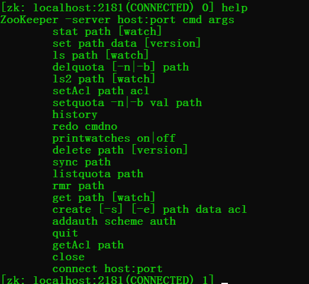
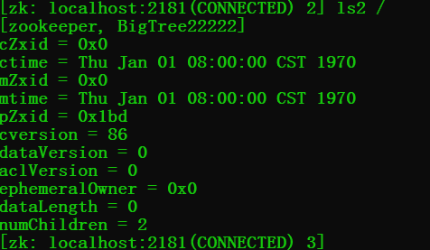
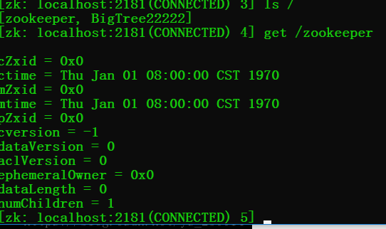
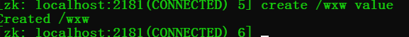
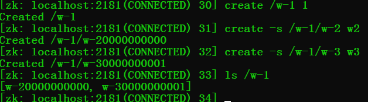

### zookeeper

---

### ZooKeeper 入门

​       Zookeeper 是用于分布式应用程序的分布式高性能协调架构， [官网文章入口](https://zookeeper.apache.org/doc/r3.3.3/zookeeperOver.html)  。  [应用实战](https://segmentfault.com/a/1190000017178722#articleHeader20)) 

- [Zookeeper 基础入门](https://blog.csdn.net/qq_41893274/article/details/110305753) 

####  （1）设计目标

- **高吞吐量和低延迟**：zookeeper允许分布式进程通过共享的分层名称空间相互调用，该名称的组织方式类似于标准的文件系统，名称空间由数据寄存器（在ZooKeeper中称为znodes）组成，它们类似于文件和目录。与文件系统不同的是，ZooKeeper的**数据是基于内存** 。
- **只要大多数服务可用，则zookeeper服务可用**
-  **满足CP** (分区容错性和一致性) ：客户端连接单个zookeeper服务器会维护一个TCP连接，通过发送请求获取响应，获取监视事件，并发送心跳，断开TCP连接时，客户端会连接其它的客户端。

​    

####     （2）数据模型和分层名称空间

- 名称是由斜杠（/）分隔的一系列路径元素。ZooKeeper名称空间中的每个节点都由路径标识


- 节点和短暂节点

​    ZooKeeper命名空间中的每个节点都可以具有与其关联的数据以及子节点，每个节点使用 znode表示，

1. **znode 维护一个统计数据结构（包括数据更改，ACL更改，时间戳版本号）用于缓存验证和协调更新。** znode每次更改时，版本都会更新

2. 临时节点：只要创建znode的会话处于活动状态，这些znode就会存在。会话结束时，将删除znode。（比如实现分布式锁）


#### （3）zookeeper的特性

- 顺序一致性-来自客户端的更新将按照其发送顺序进行应用。

- 原子性-更新成功或失败。没有部分结果。

- 单个系统映像-无论客户端连接到哪个服务器，客户端都将看到相同的服务视图。

- 可靠性-应用更新后，此更新将一直持续到客户端覆盖更新为止。

- 及时性-确保系统的客户视图在特定时间范围内是最新的。


#### （5）基本功能

1. 创建  在树中的某个位置创建一个节点
2. 删除   删除节点
3. 存在    测试某个位置是否存在节点
4. 获取数据  从节点读取数据
5. 设置数据   将数据写入节点
6. 查找子节点  检索节点的子级列表=
7. 同步   等待数据传播

##### 5.1 zookeeper 客户端命令行操作

> Linux 使用 bin/zkCli.sh   || Windows使用 zkcli.cmd 启动客户端

- help 查看所有命令

   

- 查看当前节点包含的内容：  ` ls /` 

   

- 查看当前节点内容和详细信息: ` ls2 /` 

   

- 获取节点的值:  ` get /节点名` 

   

- 创建普通节点: ` create /wxw value` 

   

- 创建短暂临时节点: ` create -e /wxw-1  value`   使用quit退出客户端后该节点就会被删除

   

- 创建有序节点：

  先创建一个普通的根节点   create /w-1   v1

  然后通过 ·`-s`  创建带序号的节点      create -s  /w-1/w-2    v2      create  -s  /w-1/w-3   val3

  查看创建的节点：` · ls /w-1·  `  

   

- 修改节点数据: ` set  /wxw newvalue` 

- 删除节点 : ` delete  /wxw`

- 递归删除节点:(递归删除所有的节点，包括子节点):  `  rmr /wxw ` 

- 查看节点状态: ` stat /wxw` 

- 监听节点值的变化:  ` get  /wxw/w-1  watch  `   这里只要这个节点值变化，就会得到相应，但是只能有一次响应，即节点值改变一次之后就不会再监听

- 监听节点的子节点变化(路径变化) :  ` ls /path watch`              只要路径变化就会相应，同样的只会响应一次

> [zookeeper客户端命令详解](https://www.cnblogs.com/senlinyang/p/7833669.html)  

#### （6）zookeeper 环境

- windows 环境

    1.  [下载入口](https://zookeeper.apache.org/releases.html)  
       2.  [安装参考](https://blog.csdn.net/qq_43222167/article/details/106096290) 

配置：

- 将conf目录下的zoo_sample.cfg文件，复制一份，重命名为zoo.cfg
- **存数据**修改zoo.cfg配置文件，将dataDir=/tmp/zookeeper修改成zookeeper安装目录所在的data文件夹,需要在安装目录下面新建一个空的data文件夹
- **存日志**需要在安装目录下新建log文件夹，再添加一条添加数据日志的配置 log 

配置参数说明：

```scss
tickTime：这个时间是作为 Zookeeper 服务器之间或客户端与服务器之间维持心跳的时间间隔，也就是每个 tickTime 时间就会发送一个心跳。
initLimit：这个配置项是用来配置 Zookeeper 接受客户端（这里所说的客户端不是用户连接 Zookeeper 服务器的客户端，而是 Zookeeper 服务器集群中连接到 Leader 的 Follower 服务器）初始化连接时最长能忍受多少个心跳时间间隔数。当已经超过 10 个心跳的时间（也就是 tickTime）长度后 Zookeeper 服务器还没有收到客户端的返回信息，那么表明这个客户端连接失败。总的时间长度就是 5*2000=10 秒
syncLimit：这个配置项标识 Leader 与 Follower 之间发送消息，请求和应答时间长度，最长不能超过多少个 tickTime 的时间长度，总的时间长度就是 2*2000=4 秒
dataDir：顾名思义就是 Zookeeper 保存数据的目录，默认情况下，Zookeeper 将写数据的日志文件也保存在这个目录里。
clientPort：这个端口就是客户端连接 Zookeeper 服务器的端口，Zookeeper 会监听这个端口，接受客户端的访问请求。
```

启动：

​    windows下：使用 zkServer.cmd  // zkCli.cmd的启动

#### （7）Zookeeper 典型应用场景

1. 数据发布订阅（配置中心）
2. 命名服务
3. Master选举
4. 集群管理
5. 分布式队列
6. 分布式锁


