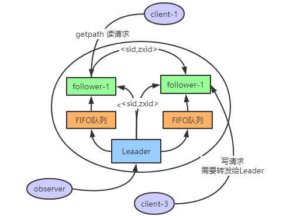

### zookeeper

---

### ZooKeeper 基础

​     `Zookeeper` 是一个分布式服务框架，主要是用来解决分布式应用中遇到的一些数据管理问题如：`统一命名服务`、`状态同步服务`、`集群管理`、`分布式应用配置项的管理`等。

-  [官网文章入口](https://zookeeper.apache.org/doc/r3.3.3/zookeeperOver.html)  
-  [应用实战](https://segmentfault.com/a/1190000017178722#articleHeader20) || [下载](https://downloads.apache.org/) 

- [Zookeeper 基础入门](https://blog.csdn.net/qq_41893274/article/details/110305753) 

####  1. 设计目标

- **高吞吐量和低延迟**：zookeeper允许分布式进程通过共享的分层名称空间相互调用，该名称的组织方式类似于标准的文件系统，名称空间由数据寄存器（在ZooKeeper中称为znodes）组成，它们类似于文件和目录。与文件系统不同的是，ZooKeeper的**数据是基于内存** 。
- **只要大多数服务可用，则zookeeper服务可用**
-  **满足CP** (分区容错性和一致性) ：客户端连接单个zookeeper服务器会维护一个TCP连接，通过发送请求获取响应，获取监视事件，并发送心跳，断开TCP连接时，客户端会连接其它的客户端。

​    

####     2. 数据模型和分层名称空间

- 名称是由斜杠（/）分隔的一系列路径元素。ZooKeeper名称空间中的每个节点都由路径标识


- 节点和短暂节点

​    ZooKeeper命名空间中的每个节点都可以具有与其关联的数据以及子节点，每个节点使用 znode表示，

1. **znode 维护一个统计数据结构（包括数据更改，ACL更改，时间戳版本号）用于缓存验证和协调更新。** znode每次更改时，版本都会更新

2. 临时节点：只要创建znode的会话处于活动状态，这些znode就会存在。会话结束时，将删除znode。（比如实现分布式锁）

#### 3. zookeeper的特性

- 顺序一致性-来自客户端的更新将按照其发送顺序进行应用。

- 原子性-更新成功或失败。没有部分结果。

- 单个系统映像-无论客户端连接到哪个服务器，客户端都将看到相同的服务视图。

- 可靠性-应用更新后，此更新将一直持续到客户端覆盖更新为止。

- 及时性-确保系统的客户视图在特定时间范围内是最新的。


#### 4. 基本功能

1. 创建  在树中的某个位置创建一个节点
2. 删除   删除节点
3. 存在    测试某个位置是否存在节点
4. 获取数据  从节点读取数据
5. 设置数据   将数据写入节点
6. 查找子节点  检索节点的子级列表=
7. 同步   等待数据传播

##### 4.1 zookeeper 客户端命令行操作

> Linux 使用 bin/zkCli.sh   || Windows使用 zkcli.cmd 启动客户端

- help 查看所有命令

   

- 查看当前节点包含的内容：  ` ls /` 

   

- 查看当前节点内容和详细信息: ` ls2 /` 

   

- 获取节点的值:  ` get /节点名` 

   

- 创建普通节点: ` create /wxw value` 

   

- 创建短暂临时节点: ` create -e /wxw-1  value`   使用quit退出客户端后该节点就会被删除

   

- 创建有序节点：

  先创建一个普通的根节点   create /w-1   v1

  然后通过 ·`-s`  创建带序号的节点      create -s  /w-1/w-2    v2      create  -s  /w-1/w-3   val3

  查看创建的节点：` · ls /w-1·  `  

   

- 修改节点数据: ` set  /wxw newvalue` 

- 删除节点 : ` delete  /wxw`

- 递归删除节点:(递归删除所有的节点，包括子节点):  `  rmr /wxw ` 

- 查看节点状态: ` stat /wxw` 

- 监听节点值的变化:  ` get  /wxw/w-1  watch  `   这里只要这个节点值变化，就会得到相应，但是只能有一次响应，即节点值改变一次之后就不会再监听

- 监听节点的子节点变化(路径变化) :  ` ls /path watch`              只要路径变化就会相应，同样的只会响应一次

> [zookeeper客户端命令详解](https://www.cnblogs.com/senlinyang/p/7833669.html)  

#### 5. zookeeper 环境

- windows 环境

    1.  [下载入口](https://zookeeper.apache.org/releases.html)  
       2.  [安装参考](https://blog.csdn.net/qq_43222167/article/details/106096290) 

配置：

- 将conf目录下的zoo_sample.cfg文件，复制一份，重命名为zoo.cfg
- **存数据**修改zoo.cfg配置文件，将dataDir=/tmp/zookeeper修改成zookeeper安装目录所在的data文件夹,需要在安装目录下面新建一个空的data文件夹
- **存日志**需要在安装目录下新建log文件夹，再添加一条添加数据日志的配置 log 

配置参数说明：

```scss
tickTime：这个时间是作为 Zookeeper 服务器之间或客户端与服务器之间维持心跳的时间间隔，也就是每个 tickTime 时间就会发送一个心跳。
initLimit：这个配置项是用来配置 Zookeeper 接受客户端（这里所说的客户端不是用户连接 Zookeeper 服务器的客户端，而是 Zookeeper 服务器集群中连接到 Leader 的 Follower 服务器）初始化连接时最长能忍受多少个心跳时间间隔数。当已经超过 10 个心跳的时间（也就是 tickTime）长度后 Zookeeper 服务器还没有收到客户端的返回信息，那么表明这个客户端连接失败。总的时间长度就是 5*2000=10 秒
syncLimit：这个配置项标识 Leader 与 Follower 之间发送消息，请求和应答时间长度，最长不能超过多少个 tickTime 的时间长度，总的时间长度就是 2*2000=4 秒
dataDir：顾名思义就是 Zookeeper 保存数据的目录，默认情况下，Zookeeper 将写数据的日志文件也保存在这个目录里。
clientPort：这个端口就是客户端连接 Zookeeper 服务器的端口，Zookeeper 会监听这个端口，接受客户端的访问请求。
```

启动：

​    windows下：使用 zkServer.cmd  // zkCli.cmd的启动

#### 6. Zookeeper 典型应用场景

1. 数据发布订阅（配置中心）
2. 命名服务
3. Master选举
4. 集群管理
5. 分布式队列
6. 分布式锁

### Zookeeper 应用实战


#### 1. Zookeeper 监听机制

> Zookeeper的监听机制很多人都踩过坑，感觉实现了watcher 接口，后面节点的变化都会一一推送过来，然而并非如此。

**Watch机制官方声明**：一个Watch事件是一个一次性的触发器，当被设置了Watch的数据发生了改变的时候，则服务器将这个改变发送给设置了Watch的客户端，以便通知它们。

zookeeper 的 watcher 机制，可以分为四个过程：

- 客户端注册 watcher。
- 服务端处理 watcher。
- 服务端触发 watcher 事件。
- 客户端回调 watcher。

##### **Zookeeper机制的特点**：

**相关文章** 

1. [zookeeper-watcher](https://www.runoob.com/w3cnote/zookeeper-watcher.html) 

#### 2. Zookeeper 一致性协议—ZAB

ZAB 协议是为分布式协调服务ZooKeeper专门设计的一种支持崩溃恢复的一致性协议。基于该协议，ZooKeeper 实现了一种主从模式的系统架构来保持集群中各个副本之间的数据一致性。今天主要看看这个zab协议的工作原理

##### 2.1 什么是ZAB协议？

分布式系统中一般都要使用主从系统架构模型，指的是一台leader服务器负责外部客户端的写请求。然后其他的都是follower服务器。leader服务器将客户端的写操作数据同步到所有的follower节点中。

 

就这样，客户端发送来的写请求，全部给Leader，然后leader再转给Follower。这时候需要解决两个问题：

1. leader服务器是如何把数据更新到所有的Follower的
2. Leader服务器突然间失效了，怎么办？

因此ZAB协议为了解决上面两个问题，设计了两种模式：

- **消息广播模式**：把数据更新到所有的Follower

- **崩溃恢复模式**：Leader发生崩溃时，如何恢复？

##### 2.2 ZAB 协议的工作原理

 

> **ZAB——消息广播模式：**  

大致流程如下：

1. 客户端发来一个request给第一个follower节点，如果是读请求，follower节点直接将数据返回。
2. 如果是写请求，也就是事务请求，那么follower节点就将请求转发给leader，leader再为每一个Follower准备了一个FIFO队列，并把Proposal(提议)发送到FIFO队列上。
3. follower节点正常情况下 都会返回一个ack 给 leader ，表示 follower 节点收到 leader的消息了，这里就是所谓的投票。正常情况下都会投票的，没有投票的情况就是 有的follower 节点 挂掉了 投不了票就没投。
4. 当机器中超过半数的服务器 都投票了（leader 自己本身也参与投票），那么 leader就commit 这个事务请求，然后再通过原子广播 通知 集群中其它的 follower 跟 observer节点来同步数据。

这就是整个消息广播模式。下面我们开始看一下，如果这个leader节点崩溃了，怎么办？也就是第二种模式：崩溃回复模式。

> **ZAB——崩溃恢复模式** 

**进入崩溃恢复模式的情况：** 

1. 当服务器启动时
2. 当Leader服务器出现网络中断，崩溃或者重启的情况
3. 当集群中已经不存在过半的服务器与Leader服务器保持正常通信。

**zab协议进入崩溃恢复模式处理流程** 

1. 当leader出现问题，zab协议进入崩溃恢复模式，并且选举出新的leader。当新的leader选举出来以后，如果集群中已经有过半机器完成了leader服务器的状态同（数据同步），退出崩溃恢复，进入消息广播模式。

2. 当新的机器加入到集群中的时候，如果已经存在leader服务器，那么新加入的服务器就会自觉进入崩溃恢复模式，找到leader进行数据同步。


**相关文章** 

1. [ZAB 协议的工作原理](https://blog.csdn.net/weixin_42168940/article/details/105617148) 
2. [Zookeeper 一致性协议—ZAB 实践](https://juejin.cn/post/6882277384112832519) 
3. [zab协议那些事](https://baijiahao.baidu.com/s?id=1666465070459184658&wfr=spider&for=pc)  

#### 3. Zookeeper 选举机制

##### 3.1 zookeeper 选举原理

:do_not_litter: 如果 Zookeeper 是单机部署是不需要选举的，集群模式下才需要选举。 

Leader选举是保证分布式数据一致性的关键所在。当Zookeeper集群中的一台服务器出现以下两种情况之一时，需要进入Leader选举。

1. 服务器初始化启动
2. 服务器运行期间 Leader 故障


 


**相关文章** 

1. [zookeeper 选举机制](https://mp.weixin.qq.com/s/VmbQNoG7WH--9_akn1DZXQ) 


