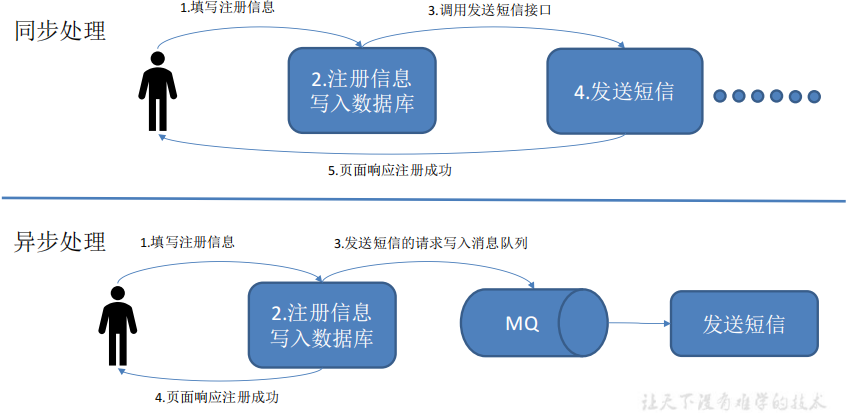
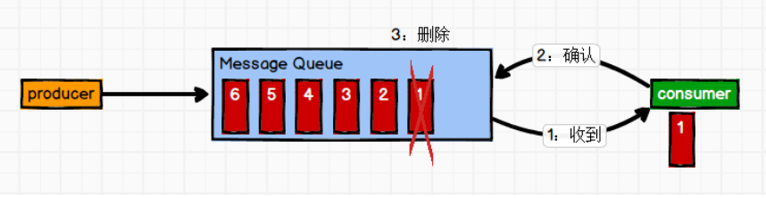
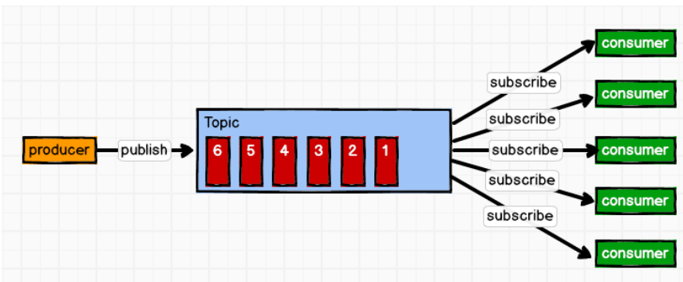
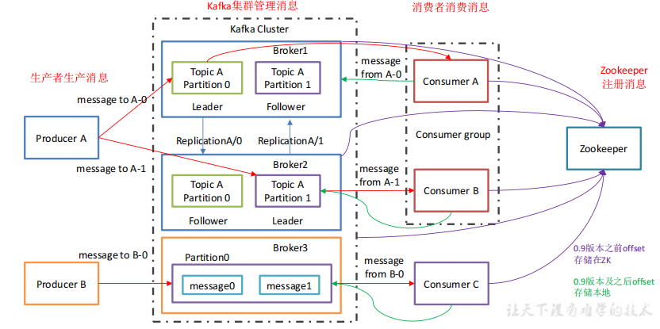
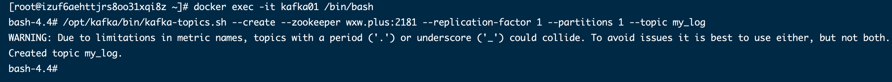
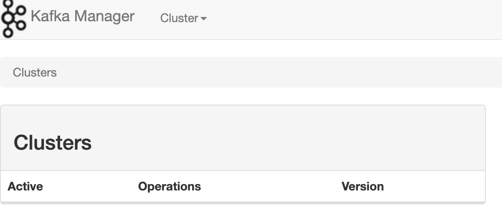
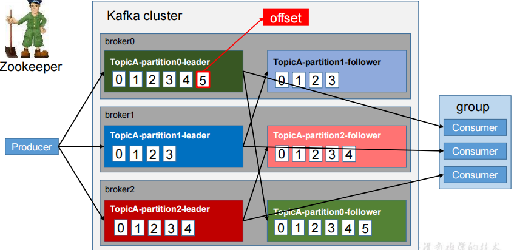
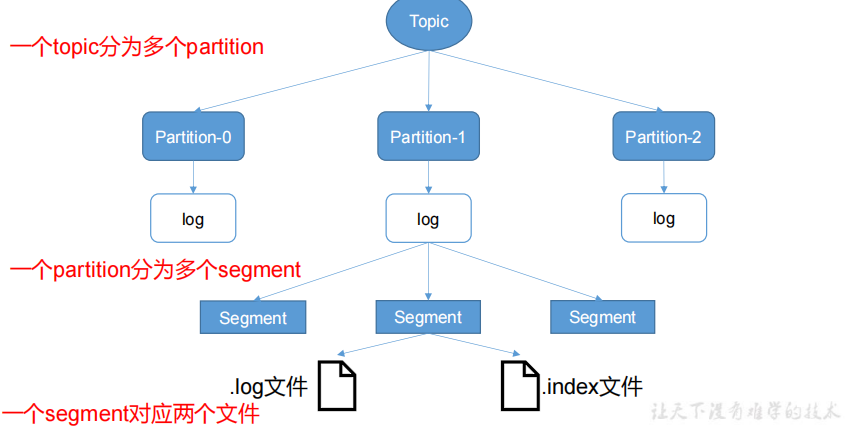
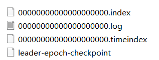
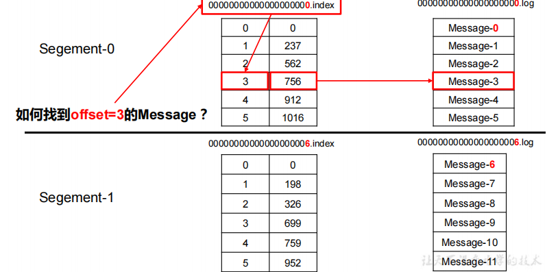

## 消息队列之 Kafka 

在大数据时代飞速发展的当下，Kafka凭借着**其高吞吐低延迟、高压缩性、持久性、可靠性、容错性以及高并发**的优势，解决了“在巨大数据下进行准确收集并分析”的难题，也受到了不少大厂以及工程师的青睐，

但是有大部分的人，在学习以及面试的过程中才发现自己并没有完全掌握其奥义，对于常见问题仍旧一知半解，这**主要是源码阅读的过程中存在问题：**

 （1）源文件太多，不知道重点；

 （2）源码量太大，无数次从开始到放弃；

 （3）方法不对，遇到“技巧性”编码就蒙圈；

 （4）不够体系化，不会将源文件归类阅读。

> 学习来源

- [尚硅谷—kafka 教程](https://www.bilibili.com/video/BV1a4411B7V9) 

## 1. kafka 初识

### 1.1 kafka 概述

kafka 是一个分布式的基于**发布/订阅模式** 的**消息队列**（Message Queue），主要应用于大数据实时处理领域。

#### 1.1.1  消息队列

> 传统消息队列的应用场景

- **异步处理** 



 

**使用消息队列的好处** 

- **解耦** ： 允许你独立的扩展或修改两边的处理过程，只要确保它遵守同样的接口约束。
- **可恢复性** ：系统的一部分组件失效时，不会影响到整个系统。消息队列降低了进程间的耦合度，所以即使一个处理消息的进程挂了，加入队列中的消息任然可以在系统恢复后被处理。
- **缓冲** ： 有助于控制和优化数据经过系统的速度，解决生产消息和消费消息的处理速度不一致的情况。
- **灵活性和峰值处理能力** ： 在访问量剧增的情况下，应用任然要继续发挥作用，但这样的突发流量并不常见。如果以能处理这类峰值访问为标准来投入资源随时待命，这无疑是巨大的浪费。使用消息队列能够使关键组件顶住突发的访问压力，而不会因为突发的超负荷请求而完全崩溃。
- **异步通信**：很多时候用户不想也不需要及时处理消息。消息队列提供了异步处理机制，允许用户把一个消息放入队列，但并不立即处理。想向队列中放入多少消息就放多少，然后在需要的时候再去处理它们。

> 消息队列的两种模式

- **点对点模式** （一对一，消费者主动拉取消息，消息收到后消息清除） 

消息生产者生产消息发送到 Queue中，然后消息消费者从Queue中取出并且消费消息。消息被消费以后，Queue中不再存储，所以消息消费者不可能消费已经被消费的消息，Queue 支持存在多个消费者，但是对一个消息而言，只会有一个消费者可以消费。



- **发布/订阅模式** （一对多，消费者消费数据后不会清除消息）

消息生产者（发布）将消息发布到 Topic中，同时有多个消息消费者（订阅）消费该消息。与点对点不同的是，发布到Topic 的消息会被所有订阅者消费。

 

#### 1.1.2 基础架构



- **Producer** : 消息生产者，就是向 kafka broker 发送消息的客户端。
- **Consumer** : 消息消费者，从 kafka broker 取消息的客户端。
- **ConsumerGroup（CG）** :  消费者组，由多个consumer组成，消费者组内每个消费者负责消费不同分区的数据，一个分区只能由一个组内消费者消费，消费者组之间互不影响，所有消费者都属于某个消费者组，即消费者组是个逻辑上的订阅者。
- **Broker** : 一台kafka 服务器就是一个broker，一个集群由多个Broker组成。一个broker可以容纳多个topic.
- **Topic：** 可以理解为一个队列，生产者和消费者都面向的是一个Topic.
- **Partition：** 为了实现扩展性，一个非常大的Topic 可以分布到多个Broker（服务器）上，一个Topic 可以分为多个partition，每个partition是一个有序队列。
- **Replica：** 副本，为保证集群中某个节点发生故障时，该节点的partition 数据不丢失且kafka任然能够继续工作，kafka提供了副本机制，一个Topic的每个分区都有若干个副本，一个Leader和若干个Follower.
- **Leader：** 每个分区副本的 "主"，生产者发送数据的对象，以及消费者消费消息的对象都是Leader.
- **Follower：** 每个分区多个副本的 “从节点” ，实时从Leader中同步数据，保持和Leader数据的同步。Leader发生故障时，某个Follower会成为新的Leader.

### 1.2 kafka 快速入门

> 来源 CSDN：https://blog.csdn.net/qq_41893274/article/details/115562660

#### 1.2.1 docker 构建 Kafka 环境

**（1）搭建zookeeper环境** 

在centos7中，拉取zookeeper镜像，以及创建zookeeper容器:

```bash
## 拉取镜像
docker pull wurstmeister/zookeeper

## 创建zookeeper容器
docker run -d --name zookeeper -p 2181:2181 -t wurstmeister/zookeeper
```

**（2）搭建kafka环境** 

```bash
## 拉去镜像
docker pull wurstmeister/kafka

## 创建kafka容器
docker run -d --name kafka \
-p 9092:9092 \
-e KAFKA_BROKER_ID=0 \
-e KAFKA_ZOOKEEPER_CONNECT=wxw.plus:2181 \
-e KAFKA_ADVERTISED_LISTENERS=PLAINTEXT://wxw.plus:9092 \
-e KAFKA_LISTENERS=PLAINTEXT://0.0.0.0:9092 wurstmeister/kafka
```

**（3）创建主题** 

```bash
#进入容器
docker exec -it ${CONTAINER ID} /bin/bash
cd opt/bin
#单机方式：创建一个主题
bin/kafka-topics.sh --create --zookeeper zookeeper:2181 --replication-factor 1 --partitions 1 --topic mykafka
#运行一个生产者
bin/kafka-console-producer.sh --broker-list localhost:9092 --topic mykafka
#运行一个消费者
bin/kafka-console-consumer.sh --zookeeper zookeeper:2181 --topic mykafka --from-beginning
```

 

**（4）kafka 设置分区数量** 

```bash
#分区数量的作用：有多少分区就能负载多少个消费者，生产者会自动分配给分区数据，每个消费者只消费自己分区的数据，每个分区有自己独立的offset

#进入kafka容器
vi opt/kafka/config/server.properties
修改run.partitions=2

#退出容器
ctrl+p+q

#重启容器
docker restart kafka

#修改指定topic
./kafka-topics.sh --zookeeper localhost:2181 --alter --partitions 3 --topic topicname
```

**（5）搭建kafka 管理平台** 

- kafka-manager 项目地址：https://github.com/yahoo/kafka-manager

> kafka-manager是目前最受欢迎的kafka集群管理工具，最早由雅虎开源，用户可以在Web界面执行一些简单的集群管理操作。具体支持以下内容：

- 管理多个集群
- 轻松检查群集状态（主题，消费者，偏移，代理，副本分发，分区分发）=
- 运行首选副本选举
- 使用选项生成分区分配以选择要使用的代理
- 运行分区重新分配（基于生成的分配）
- 使用可选主题配置创建主题（0.8.1.1具有与0.8.2+不同的配置）
- 删除主题（仅支持0.8.2+并记住在代理配置中设置delete.topic.enable = true）
- 主题列表现在指示标记为删除的主题（仅支持0.8.2+）
- 批量生成多个主题的分区分配，并可选择要使用的代理
- 批量运行重新分配多个主题的分区
- 将分区添加到现有主题
- 更新现有主题的配置

在centos7 中，执行如下命令拉取镜像，创建对应容器，以及打开防火墙：

```bash
## 拉取Kafka-manager 管理平台镜像
docker pull sheepkiller/kafka-manager

## 启动管理平台容器 ##  注意防火墙端口
docker run -d --name kafka-manager --link zookeeper:zookeeper \
--link kafka01:kafka01 -p 9001:9000 --restart=always \
--env ZK_HOSTS=zookeeper:2181 \
sheepkiller/kafka-manager
```

>  访问Kafka-manager ：http://wxw.plus:9001/

 

> 来源

1. [Docker 搭建Kafka](https://www.cnblogs.com/angelyan/p/14445710.html ) 

#### 1.2.2 server-properties配置

```
broker.id =0
每一个broker在集群中的唯一表示，不能重复，要求是正数。当该服务器的IP地址发生改变时，broker.id没有变化，则不会影响consumers的消息情况
log.dirs=/data/kafka-logs
kafka数据的存放地址，多个地址的话用逗号分割 /data/kafka-logs-1，/data/kafka-logs-2
port =9092
broker server服务端口
message.max.bytes =6525000
表示消息体的最大大小，单位是字节
num.network.threads =4
broker处理消息的最大线程数，一般情况下不需要去修改
num.io.threads =8
broker处理磁盘IO的线程数，数值应该大于你的硬盘数
background.threads =4
一些后台任务处理的线程数，例如过期消息文件的删除等，一般情况下不需要去做修改
queued.max.requests =500
等待IO线程处理的请求队列最大数，若是等待IO的请求超过这个数值，那么会停止接受外部消息，应该是一种自我保护机制。
host.name
broker的主机地址，若是设置了，那么会绑定到这个地址上，若是没有，会绑定到所有的接口上，并将其中之一发送到ZK，一般不设置
socket.send.buffer.bytes=100*1024
socket的发送缓冲区，socket的调优参数SO_SNDBUFF
socket.receive.buffer.bytes =100*1024
socket的接受缓冲区，socket的调优参数SO_RCVBUFF
socket.request.max.bytes =100*1024*1024
socket请求的最大数值，防止serverOOM，message.max.bytes必然要小于socket.request.max.bytes，会被topic创建时的指定参数覆盖
log.segment.bytes =1024*1024*1024
topic的分区是以一堆segment文件存储的，这个控制每个segment的大小，会被topic创建时的指定参数覆盖
log.roll.hours =24*7
这个参数会在日志segment没有达到log.segment.bytes设置的大小，也会强制新建一个segment会被 topic创建时的指定参数覆盖
log.cleanup.policy = delete
日志清理策略选择有：delete和compact主要针对过期数据的处理，或是日志文件达到限制的额度，会被 topic创建时的指定参数覆盖
log.retention.minutes=60*24 # 一天后删除
数据存储的最大时间超过这个时间会根据log.cleanup.policy设置的策略处理数据，也就是消费端能够多久去消费数据
log.retention.bytes和log.retention.minutes任意一个达到要求，都会执行删除，会被topic创建时的指定参数覆盖
log.retention.bytes=-1
topic每个分区的最大文件大小，一个topic的大小限制 = 分区数*log.retention.bytes。-1没有大小限log.retention.bytes和log.retention.minutes任意一个达到要求，都会执行删除，会被topic创建时的指定参数覆盖
log.retention.check.interval.ms=5minutes
文件大小检查的周期时间，是否处罚 log.cleanup.policy中设置的策略
log.cleaner.enable=false
是否开启日志压缩
log.cleaner.threads = 2
日志压缩运行的线程数
log.cleaner.io.max.bytes.per.second=None
日志压缩时候处理的最大大小
log.cleaner.dedupe.buffer.size=500*1024*1024
日志压缩去重时候的缓存空间，在空间允许的情况下，越大越好
log.cleaner.io.buffer.size=512*1024
日志清理时候用到的IO块大小一般不需要修改
log.cleaner.io.buffer.load.factor =0.9
日志清理中hash表的扩大因子一般不需要修改
log.cleaner.backoff.ms =15000
检查是否处罚日志清理的间隔
log.cleaner.min.cleanable.ratio=0.5
日志清理的频率控制，越大意味着更高效的清理，同时会存在一些空间上的浪费，会被topic创建时的指定参数覆盖
log.cleaner.delete.retention.ms =1day
对于压缩的日志保留的最长时间，也是客户端消费消息的最长时间，同log.retention.minutes的区别在于一个控制未压缩数据，一个控制压缩后的数据。会被topic创建时的指定参数覆盖
log.index.size.max.bytes =10*1024*1024
对于segment日志的索引文件大小限制，会被topic创建时的指定参数覆盖
log.index.interval.bytes =4096
当执行一个fetch操作后，需要一定的空间来扫描最近的offset大小，设置越大，代表扫描速度越快，但是也更好内存，一般情况下不需要搭理这个参数
log.flush.interval.messages=None
log文件”sync”到磁盘之前累积的消息条数,因为磁盘IO操作是一个慢操作,但又是一个”数据可靠性"的必要手段,所以此参数的设置,需要在"数据可靠性"与"性能"之间做必要的权衡.如果此值过大,将会导致每次"fsync"的时间较长(IO阻塞),如果此值过小,将会导致"fsync"的次数较多,这也意味着整体的client请求有一定的延迟.物理server故障,将会导致没有fsync的消息丢失.
log.flush.scheduler.interval.ms =3000
检查是否需要固化到硬盘的时间间隔
log.flush.interval.ms = None
仅仅通过interval来控制消息的磁盘写入时机,是不足的.此参数用于控制"fsync"的时间间隔,如果消息量始终没有达到阀值,但是离上一次磁盘同步的时间间隔达到阀值,也将触发.
log.delete.delay.ms =60000
文件在索引中清除后保留的时间一般不需要去修改
log.flush.offset.checkpoint.interval.ms =60000
控制上次固化硬盘的时间点，以便于数据恢复一般不需要去修改
auto.create.topics.enable =true
是否允许自动创建topic，若是false，就需要通过命令创建topic
default.replication.factor =1
是否允许自动创建topic，若是false，就需要通过命令创建topic
num.partitions =1
每个topic的分区个数，若是在topic创建时候没有指定的话会被topic创建时的指定参数覆盖
 
 
以下是kafka中Leader,replicas配置参数
 
controller.socket.timeout.ms =30000
partition leader与replicas之间通讯时,socket的超时时间
controller.message.queue.size=10
partition leader与replicas数据同步时,消息的队列尺寸
replica.lag.time.max.ms =10000
replicas响应partition leader的最长等待时间，若是超过这个时间，就将replicas列入ISR(in-sync replicas)，并认为它是死的，不会再加入管理中
replica.lag.max.messages =4000
如果follower落后与leader太多,将会认为此follower[或者说partition relicas]已经失效
##通常,在follower与leader通讯时,因为网络延迟或者链接断开,总会导致replicas中消息同步滞后
##如果消息之后太多,leader将认为此follower网络延迟较大或者消息吞吐能力有限,将会把此replicas迁移

##到其他follower中.

##在broker数量较少,或者网络不足的环境中,建议提高此值.
replica.socket.timeout.ms=30*1000
follower与leader之间的socket超时时间
replica.socket.receive.buffer.bytes=64*1024
leader复制时候的socket缓存大小
replica.fetch.max.bytes =1024*1024
replicas每次获取数据的最大大小
replica.fetch.wait.max.ms =500
replicas同leader之间通信的最大等待时间，失败了会重试
replica.fetch.min.bytes =1
fetch的最小数据尺寸,如果leader中尚未同步的数据不足此值,将会阻塞,直到满足条件
num.replica.fetchers=1
leader进行复制的线程数，增大这个数值会增加follower的IO
replica.high.watermark.checkpoint.interval.ms =5000
每个replica检查是否将最高水位进行固化的频率
controlled.shutdown.enable =false
是否允许控制器关闭broker ,若是设置为true,会关闭所有在这个broker上的leader，并转移到其他broker
controlled.shutdown.max.retries =3
控制器关闭的尝试次数
controlled.shutdown.retry.backoff.ms =5000
每次关闭尝试的时间间隔
leader.imbalance.per.broker.percentage =10
leader的不平衡比例，若是超过这个数值，会对分区进行重新的平衡
leader.imbalance.check.interval.seconds =300
检查leader是否不平衡的时间间隔
offset.metadata.max.bytes
客户端保留offset信息的最大空间大小

kafka中zookeeper参数配置
 
zookeeper.connect = localhost:2181
zookeeper集群的地址，可以是多个，多个之间用逗号分割 hostname1:port1,hostname2:port2,hostname3:port3
zookeeper.session.timeout.ms=6000
ZooKeeper的最大超时时间，就是心跳的间隔，若是没有反映，那么认为已经死了，不易过大
zookeeper.connection.timeout.ms =6000
ZooKeeper的连接超时时间
zookeeper.sync.time.ms =2000
```

## 2. kafka 核心知识


#### 4.1 kafka 工作流程

 


Kafka 中消息是以 **topic** 进行分类的，生产者生产消息，消费者消费消息，都是面向 Topic 的。

topic 是逻辑上的概念，而partition 是物理上的概念，每个partition 对应一个log文件，该log文件中存储的就是 Producer 生产的数据，Producer 生产的数据会不断的追加到该log 文件的末端，且每条数据都有自己的offset。消费者组中的每个消费者都会实时记录自己消费到了哪个 offset,以便出错恢复时，从上次的位置继续消费。

#### 4.2 kafka 文件存储机制

 

由于生产者生产的消息会不断追加到log文件末尾，为防止log文件过大导致数据定位效率低下，kafka采取了**分片**和**索引**机制，将每个partition 分为多个 Segment。每个segment对应两个文件

- .index文件
- .log 文件

这些文件位于一个文件夹下，该文件夹的命名规则为：topic名称+分区序号。例如：

- wxw_topic_callback_dev-0 中 wxw_topic_callback_dev 是topic, 0 是分区号
- 后面的 .index 和 .log 是文件

    

index和log 是以当前segment的第一条消息的 offset命名，下图是 index和log文件结构示意图：

 

- index 文件存储大量的索引信息，
- .log文件存储大量的数据

索引文件中的元数据指向对应数据文件中 Message 的物理偏移地址。

## 3. 遇到的问题

**3.1 kafka Operation timed out**  


