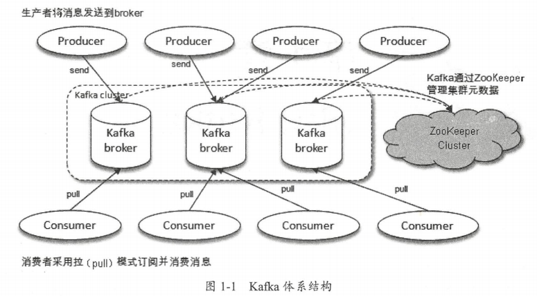
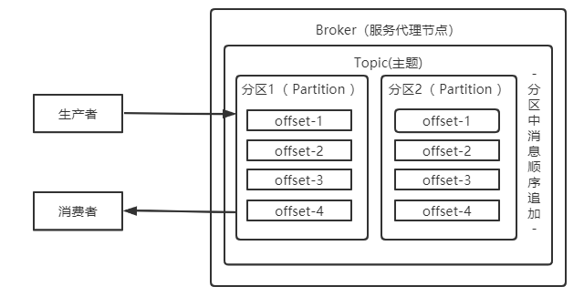
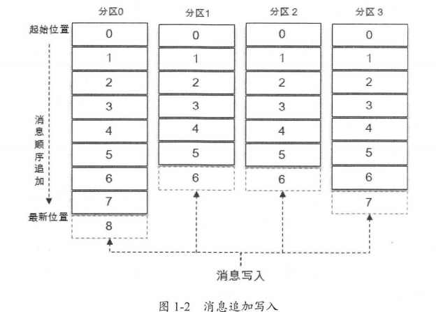
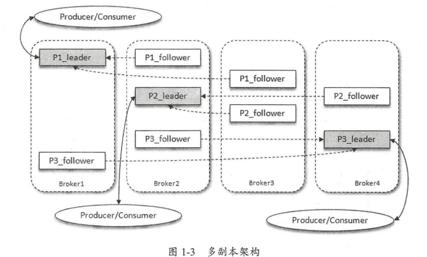

## Kafka 基础

在大数据时代飞速发展的当下，Kafka凭借着**其高吞吐低延迟、高压缩性、持久性、可靠性、容错性以及高并发**的优势，解决了“在巨大数据下进行准确收集并分析”的难题，也受到了不少大厂以及工程师的青睐，

但是有大部分的人，在学习以及面试的过程中才发现自己并没有完全掌握其奥义，对于常见问题仍旧一知半解，这**主要是源码阅读的过程中存在问题：**

 （1）源文件太多，不知道重点；

 （2）源码量太大，无数次从开始到放弃；

 （3）方法不对，遇到“技巧性”编码就蒙圈；

 （4）不够体系化，不会将源文件归类阅读。

### Kafka 初识

Kafka 起初是由 Linkedin 公司采用 Scala 语言开发的 个多分区、多副本且基于 ZooKeeper  协调的分布式消息系统，现己被捐献给 Apache 基金会 目前 Kafka 已经定位为一个分布式流式 处理平台，它以高吞吐、可持久化、可水平扩展、支持流数据处理等多种特性而被广泛使用。 目前越来越多的开源分布式处理系统如 loudera Storm Spark Flink 等都支持与 Kafka 集成 Kafka 之所以受到越来越 睐，与它所“扮 ”的 大角色是分不开的.

- **消息系统**： kafka 和传统的消息系统（也称作消息中间件〉都具备系统解稿、冗余存 储、流量 峰、缓冲、异步通信、扩展性、 可恢复性等功能。与此同时， Kafka 供了大多数消息系统难以实现的消息 序性保障及回溯消费的功能 

- **存储系统**： Kafka 把消息持久化到磁盘，相比于其他基于内存存储的系统而言，有效地降低了数据丢失的风险 也正是得益于 Kafka 的消息持久化功能和多副本机制，我 们可以把 Kafka 作为长期的数据存储系统来使用，只需要把对应的数据保留策略设置 为“永久”或启用主题的日志压缩功能即可 

- **流式处理平台**： Kafka 不仅为每个流行的流式处理框架提供了可靠的数据来源，还提供了一个完整的流式处理类库，比如窗口、连接、变换和聚合等各类操

#### 基本概念

一个典型的 Kafka 体系架构包括若干 Producer、若干 Broker 、若干 Consumer ，以及 ZooKeeper 集群，如图 所示 其中 ZooKeeper Kafka 用来负责集群元数据的管理、控制器 的选举 操作的 Producer 将消息发送到 Broker, Broker 负责将收到的消息存储到磁盘中，而Consumer 负责从 Broker 订阅并消 费消息。

 

整个 Kafka 体系结构中引入了以下几个术语。 

- **Producer 生产者**，也就是发送消息的一方。生产者负责创建消息 然后将其投递到 Kafka 

- **Consumer 消费者**，也就是接收消息的一方。消费者连接到 Kafka 上并接收消息，进而进行相应的业务逻辑处理 

- **Broker ：服务代理节点**。对于 Kafka 而言， Broke 可以简单地看作一个独立的 Kafka 服务节点或 Kafka 服务实例。大多数情况下也可以将 Broker 看作一台 Kafk 服务器，前提是这 台服务器上只部署了一个 Kafka 实例。一个或多个 Broker 组成了 一个 Kafka 集群。一般而言， 我们更习惯使用首字母小写的 broker 来表示服务代理节点 

Kafka 中还有两个特别重要的概念 一**主题（ Topic ）**与**分区（ Partition ）**。 Kafka 中的消息以主题为单位进行归类，生产者负责将消息发送到特定的主题（发送到 Kafka 集群中的每一条消息都要指定一个主题），而消费者负责订阅主题并进行消费。 

 

主题是一个逻辑上的概念，它还可以细分为多个分区，一个分区只属于单个主题，很多时候也会把分区称为主题分区（ Topic-Partition ）。同一主题下的不同分区包含的消息是不同的， 分区在存储层面可以看作一个可追加的日志（ Log ）文件，消息在被追加到分区日志、文件的时 候都会分配一个特定的偏移量（ offset ）。 offset 是消息在分区中的唯一标识， Kafka 通过它来保 证消息在分区内的顺序性，不过 offset 并不跨越分区，也就是说， Kafka 保证的是分区有序而不 是主题有序。

主题中有2个分区，消息被顺序追加到每个分区日志文件的尾部。 Kafka 中的分区可以分布在不同的服务器 broker ）上，也就是说，一个主题可以横跨多个 broker ，以 此来提供比单个 broker 更强大的性能

每一条消息被发送到 broker 之前，会根据分区规则选择存储到哪个具体的分区 如果分区 规则设定得合理，所有的消息都可以均匀地分配到不同的分区中 **如果一个主题只对应一个文 件，那么这个文件所在的机器 将会成为这个主题的性能瓶颈**，而**分区解决了这个问题** 创建主题的时候可以通过指定的参数来设置分区的个数，当然也可以在主题创建完成之后去修改分区的数量，通过增加分区的数量可以实现水平扩展。 

Kafka 为分区引入了**多副本 Replica 机制**， 通过增加副本数量可以提升容灾能力。同一 分区的不同副本中保存的是相同的消息（在同一时刻，副本之间并非完全 样），自1J 本之间是 一主多从”的关系，其中 leader 副本负 处理读写请求 follower 副本只负责与 lead er 副本的 消息同步。副本处于不同的 broker ，当 leader 副本出现故障时，从 fo llow er 副本中重新选举 新的 leader 本对外提供服务。 Kafka 通过多副本机制实现了故障的自动转移，当 Kafka 集群中 某个 broker 失效时仍然能保证服务可用。

Kafka 集群中有 broker ，某个主题中有 个分区，且副本因子（即副本 个数〉也为 ，如此每个分区便有 leader 副本和 follower 副本。生产者和消费者只与 leader 副本进行交互，而 follow 副本只负责消息的同步，很多时候 follower 副本中的消息相对 leader 副本而言会有一定的滞后。

 

Kafka 消费端也具备 容灾能力。 Consumer 使用拉 Pull ）模式从服务端拉取消息， 并且保存消费 位置 当消费者看机后恢复上线时可以根据之前保存的消费位置重新拉取 需要的消息进行消 ，这样就不会造成消息丢失

### Kafka 日志存储

#### 1.  磁盘存储

##### （1）页缓存

##### （2）磁盘I/O流程

##### （3）零拷贝

## Kafka 高级应用

### Kafka 延迟队列

### kafka 死信队列和重试队列

#### 1. Kafka 死信队列

**（1）死信队列触发条件** 

- 消费者主动拒绝消费消息
- 消息堆积至队列长度大于最大长度
- 消息过期

#### 2. Kafka 重试队列

重试队列其实可以看作 种回退队列， 具体指消 费端消费消息失败时，为了防止消息无故 丢失而重新将消息回该到 broker 中。与回退队列不同的是 重试队列 般分成多个重试等级， 每个重试等级一般也会设置重新投递延时，重试次数越多投递延时就越大 举个例子：消息 一次消费失败入重试队列 Ql, Ql 重新投递延时为 5s, 5s 过后重新投递该消息；如果消息再 次消费失败则入重试队列 Q2, Q2 重新投递延时为 10s, 10s 过后再次投递该消息。以此类推， 重试越多次重新投递的时间就越久，为此还需要设置一个上限，超过投递次数就进入死信队列 重试队列与延时队列有相同的地方，都需要设置延时级别。它们的区别是：延时队列动作由内 部触发， 重试队列动作由外部消费端触发：延时队列作用 次，而重试队列的作用范围会向后传递。

### Kafka 消息路由

Kafka 默认按照主题进行路由，也就是说，消息发往主题之后会被订阅的消费者全盘接收， 这里没有类似消息路由的功能来将消息进行 级路由，这一点从逻辑概念上来说并无任何问题 从业务应用上 如果不同的业务流程复用相同的主题，就会出现消息接收时的混乱，这种问题可 以从设计上进行屏蔽，如果需要消息路由，那么完全可以通过细粒度化切分主题来实现除了设计缺陷，还有一些历史遗留的 题迫使我们期望 Kafka 具备一个消息路由的功能

