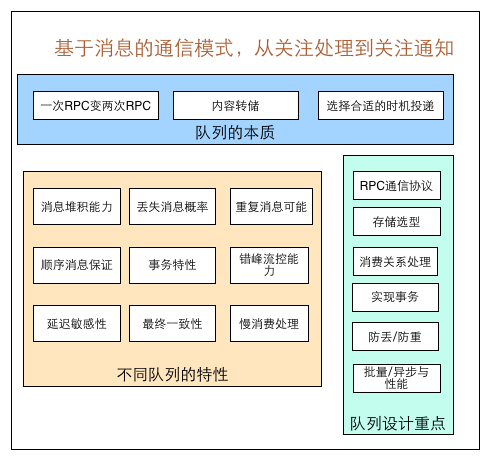
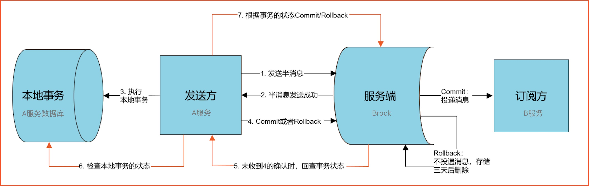

### 消息队列设计精要

 

### 消息队列总结

1. [消息队列设计精要](https://zhuanlan.zhihu.com/p/21649950) ——来自《美团技术团队》 
2. [消息队列梳理](https://www.cnblogs.com/qdhxhz/category/1221076.html) ——来自《博客园》 

### 场景分析

1. [基于RocketMQ实现分布式事务](https://www.cnblogs.com/qdhxhz/p/11191399.html)   

    

   - 半消息一致未确认，消息回查（1. 先查看当前事务;  2. 再查看本地事务）
   - 消费失败则重试，重试失败则可能是bug，需要人工干预

   

