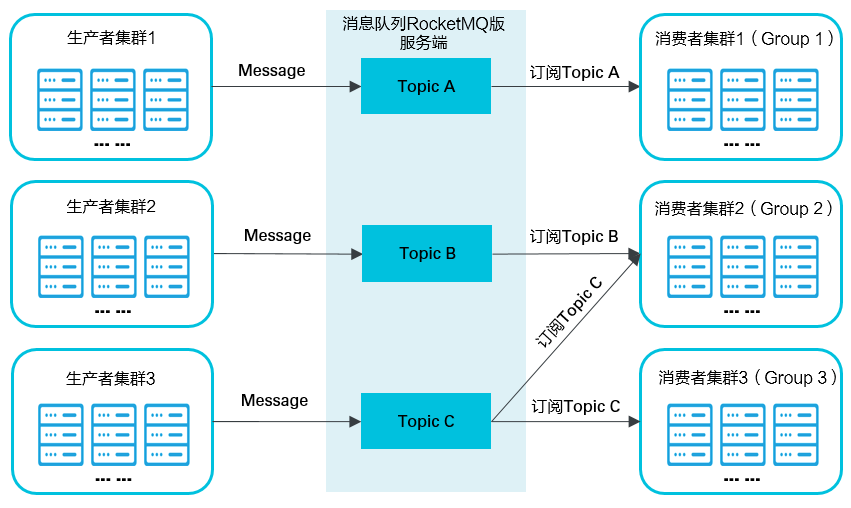
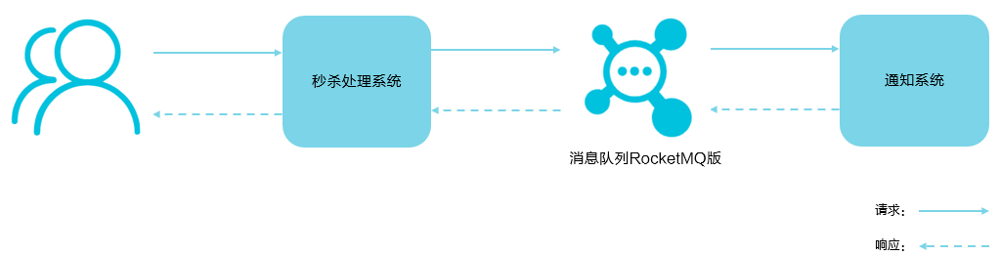

## RocketMQ 基础

消息队列RocketMQ版是阿里云基于Apache RocketMQ构建的低延迟、高并发、高可用、高可靠的分布式消息中间件。消息队列RocketMQ版既可为分布式应用系统提供异步解耦和削峰填谷的能力，同时也具备互联网应用所需的海量消息堆积、高吞吐、可靠重试等特性。

- [阿里云 RocketMQ版](https://help.aliyun.com/document_detail/29532.html?spm=5176.234368.1277512.1.4483db25Wv9fV5) 
- [Apache RocketMQ版](https://github.com/apache/rocketmq/tree/master/docs/cn) 

## RocketMQ 简介

### 1. 核心概念

- **Topic** : 消息主题，一级消息类型，生产者向其发送消息；
- **生产者：**也称为消息发布者，负责生产并发送消息至Topic； 
- **消费者：** 也称为消息订阅者，负责从Topic 接受并消费消息；
- **消息：** 生产者向Topic发送并最终传送给消费者的数据和（可选）属性的组合
- **消息属性：** 生产者可以为消息定义的属性，包含Message Key和Tag ；
- **Group**：一类生产者或消费者，这类生产者或消费者通常生产或消费同一类消息，且消息发布或订阅的逻辑一致。

消息队列RocketMQ版涉及的概念的详细解释，请参见[名词解释](https://help.aliyun.com/document_detail/29533.html#concept2655) 

### 2. 消息收发模型

消息队列RocketMQ版支持发布和订阅模型：通信可以是一对多（扇出）、多对一（扇入）和多对多；

- 消息生产者应用创建Topic并将消息发送到Topic。
- 消费者应用创建对Topic的订阅以便从其接收消息。

 

- **生产者集群**：用来表示发送消息应用，一个生产者集群下包含多个生产者实例，可以是多台机器，也可以是一台机器的多个进程，或者一个进程的多个生产者对象。

  一个生产者集群可以发送多个Topic消息。发送分布式事务消息时，如果生产者中途意外宕机，消息队列RocketMQ版服务端会主动回调生产者集群的任意一台机器来确认事务状态。

- **消费者集群**：用来表示消费消息应用，一个消费者集群下包含多个消费者实例，可以是多台机器，也可以是多个进程，或者是一个进程的多个消费者对象。

  一个消费者集群下的多个消费者以均摊方式消费消息。如果设置的是广播方式，那么这个消费者集群下的每个实例都消费全量数据。

> 一个消费者集群对应一个Group ID，一个Group ID可以订阅多个Topic，Group和Topic的订阅关系可以通过直接在程序中设置即可；

### 3. 应用场景

> 案例分析

针对一家互联网电商企业，其业务涉及广泛，如注册、订单、库存、物流等；同时，也会涉及许多业务峰值时刻，如秒杀活动、周年庆、定期特惠等。这些活动都对分布性系统中的各项微服务应用的处理性能带来很大的挑战。

消息队列RocketMQ版作为分布式系统中的重要组件，可用于应对这些挑战，例如解决应用的异步解耦。

下文先以用户注册为场景说明消息队列RocketMQ版如何实现以下功能：

- 异步解耦
- 分布式事务的数据一致性
- 消息的顺序收发

最后，再以电商的秒杀场景和价格同步场景分别说明消息队列RocketMQ版所实现的削峰填谷和大规模机器的缓存同步。

#### 3.1 异步解耦

用户只需在注册页面等待注册数据写入注册系统和消息队列RocketMQ版的时间，即等待55 ms即可登录。

**异步解耦**是消息队列RocketMQ版的主要特点，

- 主要目的是减少请求响应时间和解耦

主要的适用场景就是将比较耗时而且不需要即时（同步）返回结果的操作作为消息放入消息队列。同时，由于使用了消息队列RocketMQ版，只要保证消息格式不变，消息的发送方和接收方并不需要彼此联系，也不需要受对方的影响，即解耦。

#### 3.2 分布式事务的数据一致性

- [查看事务消息](https://help.aliyun.com/document_detail/43348.html?spm=a2c4g.11186623.2.22.285325f7QINydk#concept-2047067) 

#### 3.3 消息顺序收发

- [查看消息顺序收发](https://help.aliyun.com/document_detail/49319.html?spm=a2c4g.11186623.2.23.73db25f7vKxcJW#concept-2047066) 

#### 3.4 削峰填谷

> 场景分析

在秒杀或团队抢购活动中，由于用户请求量较大，导致流量暴增，秒杀的应用在处理如此大量的访问流量后，下游的通知系统无法承载海量的调用量，甚至会导致系统崩溃等问题而发生漏通知的情况。为解决这些问题，可在应用和下游通知系统之间加入消息队列RocketMQ版

 

秒杀处理流程如下所述：

1. 用户发起海量秒杀请求到秒杀业务处理系统。
2. 秒杀处理系统按照秒杀处理逻辑将满足秒杀条件的请求发送至消息队列RocketMQ版。
3. 下游的通知系统订阅消息队列RocketMQ版的秒杀相关消息，再将秒杀成功的消息发送到相应用户。
4. 用户收到秒杀成功的通知。

#### 3.5 大规模机器的缓存同步

双十一大促时，各个分会场会有玲琅满目的商品，每件商品的价格都会实时变化。使用缓存技术也无法满足对商品价格的访问需求，缓存服务器网卡满载。访问较多次商品价格查询影响会场页面的打开速度。

此时需要提供一种广播机制，一条消息本来只可以被集群的一台机器消费，如果使用消息队列RocketMQ版的广播消费模式，那么这条消息会被所有节点消费一次，相当于把价格信息同步到需要的每台机器上，取代缓存的作用。

### 4. 消息类型

- [普通消息](https://help.aliyun.com/document_detail/96359.html#concept-2047064)：消息队列RocketMQ版中无特性的消息，区别于有特性的定时和延时消息、顺序消息和事务消息。
- [事务消息](https://help.aliyun.com/document_detail/43348.html#concept-2047067)：实现类似X/Open XA的分布事务功能，以达到事务最终一致性状态。
- [定时和延时消息](https://help.aliyun.com/document_detail/43349.html#concept-2047065)：允许消息生产者对指定消息进行定时（延时）投递，最长支持40天。
- [顺序消息](https://help.aliyun.com/document_detail/49319.html#concept-2047066)：允许消息消费者按照消息发送的顺序对消息进行消费。

#### 4.1 普通消息

消息队列 RocketMQ 版提供三种方式来发送普通消息：

- **同步（Sync）**发送：适用于重要通知邮件、报名短信通知、营销短信系统等
- **异步（Async）**发送：异步发送一般用于链路耗时较长，对响应时间较为敏感的业务场景，例如用户视频上传后通知启动转码服务，转码完成后通知推送转码结果等
- **单向（Oneway）发送**：适用于某些耗时非常短，但对可靠性要求并不高的场景，例如日志收集

本文介绍了每种发送方式的原理、应用场景、示例代码，以及三种发送方式的对比

> 来源：[普通消息](https://help.aliyun.com/document_detail/96359.html?spm=a2c4g.11186623.2.18.54cb1f90AvVCYp) 

下表概括了三者的特点和主要区别。

| 发送方式 | 发送 TPS | 发送结果反馈 | 可靠性   |
| :------- | :------- | :----------- | :------- |
| 同步发送 | 快       | 有           | 不丢失   |
| 异步发送 | 快       | 有           | 不丢失   |
| 单向发送 | 最快     | 无           | 可能丢失 |

#### 4.2 定时和延迟消息

