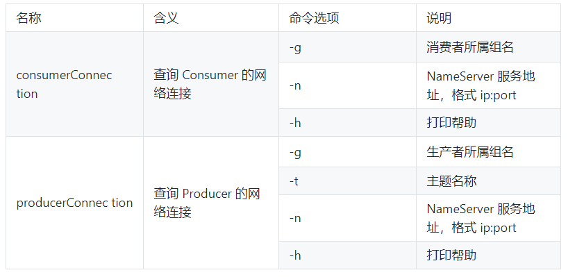
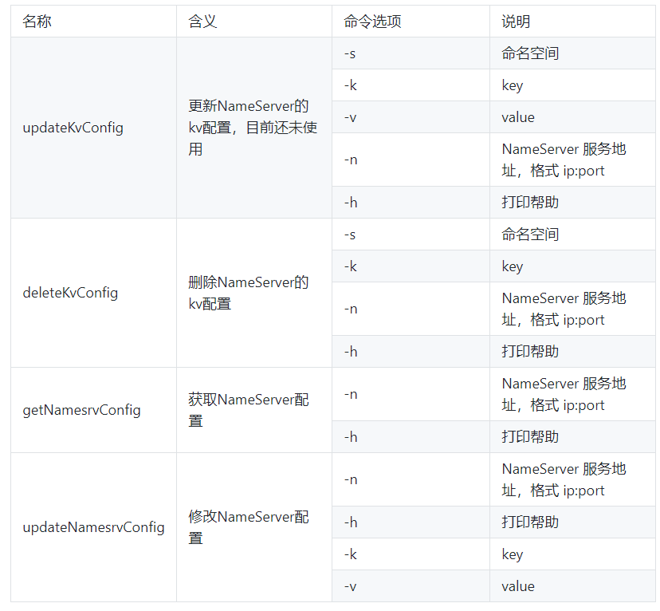
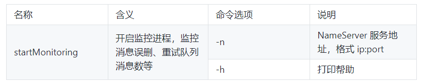

# 1. MQ介绍

##1.1 为什么要用MQ

消息队列是一种“先进先出”的数据结构


其应用场景主要包含以下3个方面

* **应用异步解耦**  

系统的耦合性越高，容错性就越低。以电商应用为例，用户创建订单后，如果耦合调用库存系统、物流系统、支付系统，任何一个子系统出了故障或者因为升级等原因暂时不可用，都会造成下单操作异常，影响用户使用体验。


使用消息队列解耦合，系统的耦合性就会提高了。比如物流系统发生故障，需要几分钟才能来修复，在这段时间内，物流系统要处理的数据被缓存到消息队列中，用户的下单操作正常完成。当物流系统回复后，补充处理存在消息队列中的订单消息即可，终端系统感知不到物流系统发生过几分钟故障。


* **流量削峰限流**  


应用系统如果遇到系统请求流量的瞬间猛增，有可能会将系统压垮。有了消息队列可以将大量请求缓存起来，分散到很长一段时间处理，这样可以大大提到系统的稳定性和用户体验。


一般情况，为了保证系统的稳定性，如果系统负载超过阈值，就会阻止用户请求，这会影响用户体验，而如果使用消息队列将请求缓存起来，等待系统处理完毕后通知用户下单完毕，这样总比不能下单体验要好。

<u>处于经济考量目的：</u> 

业务系统正常时段的QPS如果是1000，流量最高峰是10000，为了应对流量高峰配置高性能的服务器显然不划算，这时可以使用消息队列对峰值流量削峰

* **数据分发** 


通过消息队列可以让数据在多个系统更加之间进行流通。数据的产生方不需要关心谁来使用数据，只需要将数据发送到消息队列，数据使用方直接在消息队列中直接获取数据即可


## 1.2 MQ的优点和缺点

优点：解耦、削峰、数据分发

缺点包含以下几点：

* 系统可用性降低

  系统引入的外部依赖越多，系统稳定性越差。一旦MQ宕机，就会对业务造成影响。

  如何保证MQ的高可用？

* 系统复杂度提高

  MQ的加入大大增加了系统的复杂度，以前系统间是同步的远程调用，现在是通过MQ进行异步调用。

  如何保证消息没有被重复消费？怎么处理消息丢失情况？那么保证消息传递的顺序性？

* 一致性问题

  A系统处理完业务，通过MQ给B、C、D三个系统发消息数据，如果B系统、C系统处理成功，D系统处理失败。

  如何保证消息数据处理的一致性？

## 1.3 各种MQ产品的比较

常见的MQ产品包括Kafka、ActiveMQ、RabbitMQ、RocketMQ。 


# 2. RocketMQ快速入门

RocketMQ是阿里巴巴2016年MQ中间件，使用Java语言开发，在阿里内部，RocketMQ承接了例如“双11”等高并发场景的消息流转，能够处理万亿级别的消息。

## 2.1 准备工作

### 2.1.1 下载RocketMQ

RocketMQ最新版本：4.7.1

[下载地址](https://www.apache.org/dyn/closer.cgi?path=rocketmq/4.5.1/rocketmq-all-4.5.1-bin-release.zip) 

### 2.2.2 环境要求

* Linux64位系统

* JDK1.8(64位)

* 源码安装需要安装Maven 3.2.x

## 2.2 安装RocketMQ

### 2.2.1 安装步骤

本教程以二进制包方式安装

1. 解压安装包
2. 进入安装目录

### 2.2.2 目录介绍

* bin：启动脚本，包括shell脚本和CMD脚本
* conf：实例配置文件 ，包括broker配置文件、logback配置文件等
* lib：依赖jar包，包括Netty、commons-lang、FastJSON等

## 2.3 启动RocketMQ

1. 启动NameServer

```shell
# 1.启动NameServer
nohup sh bin/mqnamesrv &
# 2.查看启动日志
tail -f ~/logs/rocketmqlogs/namesrv.log
```

2. 启动Broker

```shell
# 1.启动Broker
nohup sh bin/mqbroker -n localhost:9876 &
# 2.查看启动日志
tail -f ~/logs/rocketmqlogs/broker.log 
```

* 问题描述：

  RocketMQ默认的虚拟机内存较大，启动Broker如果因为内存不足失败，需要编辑如下两个配置文件，修改JVM内存大小

```shell
# 编辑runbroker.sh和runserver.sh修改默认JVM大小
vi runbroker.sh
vi runserver.sh
```

* 参考设置：

```JAVA_OPT="${JAVA_OPT} -server -Xms256m -Xmx256m -Xmn128m -XX:MetaspaceSize=128m  -XX:MaxMetaspaceSize=320m"```

## 2.4 测试RocketMQ

### 2.4.1 发送消息

```sh
# 1.设置环境变量
export NAMESRV_ADDR=localhost:9876
# 2.使用安装包的Demo发送消息
sh bin/tools.sh org.apache.rocketmq.example.quickstart.Producer
```

### 2.4.2 接收消息

```shell
# 1.设置环境变量
export NAMESRV_ADDR=localhost:9876
# 2.接收消息
sh bin/tools.sh org.apache.rocketmq.example.quickstart.Consumer
```

## 2.5 关闭RocketMQ

```shell
# 1.关闭NameServer
sh bin/mqshutdown namesrv
# 2.关闭Broker
sh bin/mqshutdown broker
```

# 3. RocketMQ集群搭建

## 3.1 各角色介绍

* Producer：消息的发送者；举例：发信者
* Consumer：消息接收者；举例：收信者
* Broker：暂存和传输消息；举例：邮局
* NameServer：管理Broker（注册中心）；举例：各个邮局的管理机构
* Topic：区分消息的种类；一个发送者可以发送消息给一个或者多个Topic；一个消息的接收者可以订阅一个或者多个Topic消息
* Message Queue：相当于是Topic的分区；用于并行发送和接收消息


## 3.2 集群搭建方式

### 3.2.1 集群特点

- NameServer是一个几乎无状态节点，可集群部署，节点之间无任何信息同步。

- Broker部署相对复杂，Broker分为Master与Slave，一个Master可以对应多个Slave，但是一个Slave只能对应一个Master，Master与Slave的对应关系通过指定相同的BrokerName，不同的BrokerId来定义，BrokerId为0表示Master，非0表示Slave。Master也可以部署多个。每个Broker与NameServer集群中的所有节点建立长连接，定时注册Topic信息到所有NameServer。
- Producer与NameServer集群中的其中一个节点（随机选择）建立长连接，定期从NameServer取Topic路由信息，并向提供Topic服务的Master建立长连接，且定时向Master发送心跳。Producer完全无状态，可集群部署。
- Consumer与NameServer集群中的其中一个节点（随机选择）建立长连接，定期从NameServer取Topic路由信息，并向提供Topic服务的Master、Slave建立长连接，且定时向Master、Slave发送心跳。Consumer既可以从Master订阅消息，也可以从Slave订阅消息，订阅规则由Broker配置决定。

### 3.2.3 集群模式

#### 1）单Master模式

这种方式风险较大，一旦Broker重启或者宕机时，会导致整个服务不可用。不建议线上环境使用,可以用于本地测试。

#### 2）多Master模式

一个集群无Slave，全是Master，例如2个Master或者3个Master，这种模式的优缺点如下：

- 优点：配置简单，单个Master宕机或重启维护对应用无影响，在磁盘配置为RAID10时，即使机器宕机不可恢复情况下，由于RAID10磁盘非常可靠，消息也不会丢（异步刷盘丢失少量消息，同步刷盘一条不丢），性能最高；
- 缺点：单台机器宕机期间，这台机器上未被消费的消息在机器恢复之前不可订阅，消息实时性会受到影响。

#### 3）多Master多Slave模式（异步）

每个Master配置一个Slave，有多对Master-Slave，HA采用异步复制方式，主备有短暂消息延迟（毫秒级），这种模式的优缺点如下：

- 优点：即使磁盘损坏，消息丢失的非常少，且消息实时性不会受影响，同时Master宕机后，消费者仍然可以从Slave消费，而且此过程对应用透明，不需要人工干预，性能同多Master模式几乎一样；
- 缺点：Master宕机，磁盘损坏情况下会丢失少量消息。

#### 4）多Master多Slave模式（同步）

每个Master配置一个Slave，有多对Master-Slave，HA采用同步双写方式，即只有主备都写成功，才向应用返回成功，这种模式的优缺点如下：

- 优点：数据与服务都无单点故障，Master宕机情况下，消息无延迟，服务可用性与数据可用性都非常高；
- 缺点：性能比异步复制模式略低（大约低10%左右），发送单个消息的RT会略高，且目前版本在主节点宕机后，备机不能自动切换为主机。

## 3.3 双主双从集群搭建

### 3.3.1 总体架构

消息高可用采用2m-2s（同步双写）方式


### 3.3.2 集群工作流程

1. 启动NameServer，NameServer起来后监听端口，等待Broker、Producer、Consumer连上来，相当于一个路由控制中心。
2. Broker启动，跟所有的NameServer保持长连接，定时发送心跳包。心跳包中包含当前Broker信息(IP+端口等)以及存储所有Topic信息。注册成功后，NameServer集群中就有Topic跟Broker的映射关系。
3. 收发消息前，先创建Topic，创建Topic时需要指定该Topic要存储在哪些Broker上，也可以在发送消息时自动创建Topic。
4. Producer发送消息，启动时先跟NameServer集群中的其中一台建立长连接，并从NameServer中获取当前发送的Topic存在哪些Broker上，轮询从队列列表中选择一个队列，然后与队列所在的Broker建立长连接从而向Broker发消息。
5. Consumer跟Producer类似，跟其中一台NameServer建立长连接，获取当前订阅Topic存在哪些Broker上，然后直接跟Broker建立连接通道，开始消费消息。

### 3.3.3 服务器环境

| **序号** | **IP**         | **角色**                 | **架构模式**    |
| -------- | -------------- | ------------------------ | --------------- |
| 1        | 192.168.25.135 | nameserver、brokerserver | Master1、Slave2 |
| 2        | 192.168.25.138 | nameserver、brokerserver | Master2、Slave1 |

### 3.3.4 Host添加信息

```bash
vim /etc/hosts
```

配置如下:

```bash
# nameserver
192.168.25.135 rocketmq-nameserver1
192.168.25.138 rocketmq-nameserver2
# broker
192.168.25.135 rocketmq-master1
192.168.25.135 rocketmq-slave2
192.168.25.138 rocketmq-master2
192.168.25.138 rocketmq-slave1
```

配置完成后, 重启网卡

```bash
systemctl restart network
```

### 3.3.5 防火墙配置

宿主机需要远程访问虚拟机的rocketmq服务和web服务，需要开放相关的端口号，简单粗暴的方式是直接关闭防火墙

```bash
# 关闭防火墙
systemctl stop firewalld.service 
# 查看防火墙的状态
firewall-cmd --state 
# 禁止firewall开机启动
systemctl disable firewalld.service
```

或者为了安全，只开放特定的端口号，RocketMQ默认使用3个端口：9876 、10911 、11011 。如果防火墙没有关闭的话，那么防火墙就必须开放这些端口：

* `nameserver` 默认使用 9876 端口
* `master` 默认使用 10911 端口
* `slave` 默认使用11011 端口

执行以下命令：

```bash
# 开放name server默认端口
firewall-cmd --remove-port=9876/tcp --permanent
# 开放master默认端口
firewall-cmd --remove-port=10911/tcp --permanent
# 开放slave默认端口 (当前集群模式可不开启)
firewall-cmd --remove-port=11011/tcp --permanent 
# 重启防火墙
firewall-cmd --reload
```

### 3.3.6 环境变量配置

```bash
vim /etc/profile
```

在profile文件的末尾加入如下命令

```bash
#set rocketmq
ROCKETMQ_HOME=/usr/local/rocketmq/rocketmq-all-4.4.0-bin-release
PATH=$PATH:$ROCKETMQ_HOME/bin
export ROCKETMQ_HOME PATH
```

输入:wq! 保存并退出， 并使得配置立刻生效：

```bash
source /etc/profile
```

### 3.3.7 创建消息存储路径

```bash
mkdir /usr/local/rocketmq/store     
mkdir /usr/local/rocketmq/store/commitlog             // 提交日志
mkdir /usr/local/rocketmq/store/consumequeue          // 消费队列
mkdir /usr/local/rocketmq/store/index                 // 索引
```

### 3.3.8 broker配置文件

#### 1）master1

服务器：192.168.25.135

```sh
vi /usr/soft/rocketmq/conf/2m-2s-sync/broker-a.properties
```

修改配置如下：

```bash
#所属集群名字
brokerClusterName=rocketmq-cluster
#broker名字，注意此处不同的配置文件填写的不一样
brokerName=broker-a
#0 表示 Master，>0 表示 Slave
brokerId=0
#nameServer地址，分号分割
namesrvAddr=rocketmq-nameserver1:9876;rocketmq-nameserver2:9876
#在发送消息时，自动创建服务器不存在的topic，默认创建的队列数
defaultTopicQueueNums=4
#是否允许 Broker 自动创建Topic，建议线下开启，线上关闭
autoCreateTopicEnable=true
#是否允许 Broker 自动创建订阅组，建议线下开启，线上关闭
autoCreateSubscriptionGroup=true
#Broker 对外服务的监听端口
listenPort=10911
#删除文件时间点，默认凌晨 4点
deleteWhen=04
#文件保留时间，默认 48 小时
fileReservedTime=120
#commitLog每个文件的大小默认1G
mapedFileSizeCommitLog=1073741824
#ConsumeQueue每个文件默认存30W条，根据业务情况调整
mapedFileSizeConsumeQueue=300000
#destroyMapedFileIntervalForcibly=120000
#redeleteHangedFileInterval=120000
#检测物理文件磁盘空间
diskMaxUsedSpaceRatio=88
#存储路径
storePathRootDir=/usr/local/rocketmq/store
#commitLog 存储路径
storePathCommitLog=/usr/local/rocketmq/store/commitlog
#消费队列存储路径存储路径
storePathConsumeQueue=/usr/local/rocketmq/store/consumequeue
#消息索引存储路径
storePathIndex=/usr/local/rocketmq/store/index
#checkpoint 文件存储路径
storeCheckpoint=/usr/local/rocketmq/store/checkpoint
#abort 文件存储路径
abortFile=/usr/local/rocketmq/store/abort
#限制的消息大小
maxMessageSize=65536
#flushCommitLogLeastPages=4
#flushConsumeQueueLeastPages=2
#flushCommitLogThoroughInterval=10000
#flushConsumeQueueThoroughInterval=60000
#Broker 的角色
#- ASYNC_MASTER 异步复制Master
#- SYNC_MASTER 同步双写Master
#- SLAVE
brokerRole=SYNC_MASTER
#刷盘方式
#- ASYNC_FLUSH 异步刷盘
#- SYNC_FLUSH 同步刷盘
flushDiskType=SYNC_FLUSH
#checkTransactionMessageEnable=false
#发消息线程池数量
#sendMessageThreadPoolNums=128
#拉消息线程池数量
#pullMessageThreadPoolNums=128
```

#### 2）slave2

服务器：192.168.25.135

```sh
vi /usr/soft/rocketmq/conf/2m-2s-sync/broker-b-s.properties
```

修改配置如下：

```bash
#所属集群名字
brokerClusterName=rocketmq-cluster
#broker名字，注意此处不同的配置文件填写的不一样
brokerName=broker-b
#0 表示 Master，>0 表示 Slave
brokerId=1
#nameServer地址，分号分割
namesrvAddr=rocketmq-nameserver1:9876;rocketmq-nameserver2:9876
#在发送消息时，自动创建服务器不存在的topic，默认创建的队列数
defaultTopicQueueNums=4
#是否允许 Broker 自动创建Topic，建议线下开启，线上关闭
autoCreateTopicEnable=true
#是否允许 Broker 自动创建订阅组，建议线下开启，线上关闭
autoCreateSubscriptionGroup=true
#Broker 对外服务的监听端口
listenPort=11011
#删除文件时间点，默认凌晨 4点
deleteWhen=04
#文件保留时间，默认 48 小时
fileReservedTime=120
#commitLog每个文件的大小默认1G
mapedFileSizeCommitLog=1073741824
#ConsumeQueue每个文件默认存30W条，根据业务情况调整
mapedFileSizeConsumeQueue=300000
#destroyMapedFileIntervalForcibly=120000
#redeleteHangedFileInterval=120000
#检测物理文件磁盘空间
diskMaxUsedSpaceRatio=88
#存储路径
storePathRootDir=/usr/local/rocketmq/store
#commitLog 存储路径
storePathCommitLog=/usr/local/rocketmq/store/commitlog
#消费队列存储路径存储路径
storePathConsumeQueue=/usr/local/rocketmq/store/consumequeue
#消息索引存储路径
storePathIndex=/usr/local/rocketmq/store/index
#checkpoint 文件存储路径
storeCheckpoint=/usr/local/rocketmq/store/checkpoint
#abort 文件存储路径
abortFile=/usr/local/rocketmq/store/abort
#限制的消息大小
maxMessageSize=65536
#flushCommitLogLeastPages=4
#flushConsumeQueueLeastPages=2
#flushCommitLogThoroughInterval=10000
#flushConsumeQueueThoroughInterval=60000
#Broker 的角色
#- ASYNC_MASTER 异步复制Master
#- SYNC_MASTER 同步双写Master
#- SLAVE
brokerRole=SLAVE
#刷盘方式
#- ASYNC_FLUSH 异步刷盘
#- SYNC_FLUSH 同步刷盘
flushDiskType=ASYNC_FLUSH
#checkTransactionMessageEnable=false
#发消息线程池数量
#sendMessageThreadPoolNums=128
#拉消息线程池数量
#pullMessageThreadPoolNums=128
```

#### 3）master2

服务器：192.168.25.138

```sh
vi /usr/soft/rocketmq/conf/2m-2s-sync/broker-b.properties
```

修改配置如下：

```bash
#所属集群名字
brokerClusterName=rocketmq-cluster
#broker名字，注意此处不同的配置文件填写的不一样
brokerName=broker-b
#0 表示 Master，>0 表示 Slave
brokerId=0
#nameServer地址，分号分割
namesrvAddr=rocketmq-nameserver1:9876;rocketmq-nameserver2:9876
#在发送消息时，自动创建服务器不存在的topic，默认创建的队列数
defaultTopicQueueNums=4
#是否允许 Broker 自动创建Topic，建议线下开启，线上关闭
autoCreateTopicEnable=true
#是否允许 Broker 自动创建订阅组，建议线下开启，线上关闭
autoCreateSubscriptionGroup=true
#Broker 对外服务的监听端口
listenPort=10911
#删除文件时间点，默认凌晨 4点
deleteWhen=04
#文件保留时间，默认 48 小时
fileReservedTime=120
#commitLog每个文件的大小默认1G
mapedFileSizeCommitLog=1073741824
#ConsumeQueue每个文件默认存30W条，根据业务情况调整
mapedFileSizeConsumeQueue=300000
#destroyMapedFileIntervalForcibly=120000
#redeleteHangedFileInterval=120000
#检测物理文件磁盘空间
diskMaxUsedSpaceRatio=88
#存储路径
storePathRootDir=/usr/local/rocketmq/store
#commitLog 存储路径
storePathCommitLog=/usr/local/rocketmq/store/commitlog
#消费队列存储路径存储路径
storePathConsumeQueue=/usr/local/rocketmq/store/consumequeue
#消息索引存储路径
storePathIndex=/usr/local/rocketmq/store/index
#checkpoint 文件存储路径
storeCheckpoint=/usr/local/rocketmq/store/checkpoint
#abort 文件存储路径
abortFile=/usr/local/rocketmq/store/abort
#限制的消息大小
maxMessageSize=65536
#flushCommitLogLeastPages=4
#flushConsumeQueueLeastPages=2
#flushCommitLogThoroughInterval=10000
#flushConsumeQueueThoroughInterval=60000
#Broker 的角色
#- ASYNC_MASTER 异步复制Master
#- SYNC_MASTER 同步双写Master
#- SLAVE
brokerRole=SYNC_MASTER
#刷盘方式
#- ASYNC_FLUSH 异步刷盘
#- SYNC_FLUSH 同步刷盘
flushDiskType=SYNC_FLUSH
#checkTransactionMessageEnable=false
#发消息线程池数量
#sendMessageThreadPoolNums=128
#拉消息线程池数量
#pullMessageThreadPoolNums=128
```

#### 4）slave1

服务器：192.168.25.138

```sh
vi /usr/soft/rocketmq/conf/2m-2s-sync/broker-a-s.properties
```

修改配置如下：

```bash
#所属集群名字
brokerClusterName=rocketmq-cluster
#broker名字，注意此处不同的配置文件填写的不一样
brokerName=broker-a
#0 表示 Master，>0 表示 Slave
brokerId=1
#nameServer地址，分号分割
namesrvAddr=rocketmq-nameserver1:9876;rocketmq-nameserver2:9876
#在发送消息时，自动创建服务器不存在的topic，默认创建的队列数
defaultTopicQueueNums=4
#是否允许 Broker 自动创建Topic，建议线下开启，线上关闭
autoCreateTopicEnable=true
#是否允许 Broker 自动创建订阅组，建议线下开启，线上关闭
autoCreateSubscriptionGroup=true
#Broker 对外服务的监听端口
listenPort=11011
#删除文件时间点，默认凌晨 4点
deleteWhen=04
#文件保留时间，默认 48 小时
fileReservedTime=120
#commitLog每个文件的大小默认1G
mapedFileSizeCommitLog=1073741824
#ConsumeQueue每个文件默认存30W条，根据业务情况调整
mapedFileSizeConsumeQueue=300000
#destroyMapedFileIntervalForcibly=120000
#redeleteHangedFileInterval=120000
#检测物理文件磁盘空间
diskMaxUsedSpaceRatio=88
#存储路径
storePathRootDir=/usr/local/rocketmq/store
#commitLog 存储路径
storePathCommitLog=/usr/local/rocketmq/store/commitlog
#消费队列存储路径存储路径
storePathConsumeQueue=/usr/local/rocketmq/store/consumequeue
#消息索引存储路径
storePathIndex=/usr/local/rocketmq/store/index
#checkpoint 文件存储路径
storeCheckpoint=/usr/local/rocketmq/store/checkpoint
#abort 文件存储路径
abortFile=/usr/local/rocketmq/store/abort
#限制的消息大小
maxMessageSize=65536
#flushCommitLogLeastPages=4
#flushConsumeQueueLeastPages=2
#flushCommitLogThoroughInterval=10000
#flushConsumeQueueThoroughInterval=60000
#Broker 的角色
#- ASYNC_MASTER 异步复制Master
#- SYNC_MASTER 同步双写Master
#- SLAVE
brokerRole=SLAVE
#刷盘方式
#- ASYNC_FLUSH 异步刷盘
#- SYNC_FLUSH 同步刷盘
flushDiskType=ASYNC_FLUSH
#checkTransactionMessageEnable=false
#发消息线程池数量
#sendMessageThreadPoolNums=128
#拉消息线程池数量
#pullMessageThreadPoolNums=128
```

### 3.3.9 修改启动脚本文件

#### 1）runbroker.sh

```sh
vi /usr/local/rocketmq/bin/runbroker.sh
```

需要根据内存大小进行适当的对JVM参数进行调整：

```bash
#===================================================
# 开发环境配置 JVM Configuration
JAVA_OPT="${JAVA_OPT} -server -Xms256m -Xmx256m -Xmn128m"
```

####2）runserver.sh

```sh
vim /usr/local/rocketmq/bin/runserver.sh
```

```bash
JAVA_OPT="${JAVA_OPT} -server -Xms256m -Xmx256m -Xmn128m -XX:MetaspaceSize=128m -XX:MaxMetaspaceSize=320m"
```

### 3.3.10 服务启动

#### 1）启动NameServe集群

分别在192.168.25.135和192.168.25.138启动NameServer

```bash
cd /usr/local/rocketmq/bin
nohup sh mqnamesrv &
```

#### 2）启动Broker集群

* 在192.168.25.135上启动master1和slave2

master1：

```bash
cd /usr/local/rocketmq/bin
nohup sh mqbroker -c /usr/local/rocketmq/conf/2m-2s-syncbroker-a.properties &
```

slave2：

```sh
cd /usr/local/rocketmq/bin
nohup sh mqbroker -c /usr/local/rocketmq/conf/2m-2s-sync/broker-b-s.properties &
```

* 在192.168.25.138上启动master2和slave2

master2

```sh
cd /usr/local/rocketmq/bin
nohup sh mqbroker -c /usr/local/rocketmq/conf/2m-2s-sync/broker-b.properties &
```

slave1

```sh
cd /usr/local/rocketmq/bin
nohup sh mqbroker -c /usr/local/rocketmq/conf/2m-2s-sync/broker-a-s.properties &
```

### 3.3.11 查看进程状态

启动后通过JPS查看启动进程


### 3.3.12 查看日志

```sh
# 查看nameServer日志
tail -500f ~/logs/rocketmqlogs/namesrv.log
# 查看broker日志
tail -500f ~/logs/rocketmqlogs/broker.log
```

## 3.4 mqadmin管理工具

### 3.4.1 使用方式

进入RocketMQ安装位置，在bin目录下执行```./mqadmin {command} {args}``` 

###3.4.2 命令介绍

####1）Topic相关

 

| 名称             | 含义                                                         | 命令选项 | 说明                                                         |
| ---------------- | ------------------------------------------------------------ | -------- | ------------------------------------------------------------ |
| updateTopic      | 创建更新Topic配置                                            | -b       | Broker 地址，表示 topic 所在 Broker，只支持单台Broker，地址为ip:port |
| -c               | cluster 名称，表示 topic 所在集群（集群可通过 clusterList 查询） |          |                                                              |
| -h-              | 打印帮助                                                     |          |                                                              |
| -n               | NameServer服务地址，格式 ip:port                             |          |                                                              |
| -p               | 指定新topic的读写权限( W=2\|R=4\|WR=6 )                      |          |                                                              |
| -r               | 可读队列数（默认为 8）                                       |          |                                                              |
| -w               | 可写队列数（默认为 8）                                       |          |                                                              |
| -t               | topic 名称（名称只能使用字符 ^[a-zA-Z0-9_-]+$ ）             |          |                                                              |
| deleteTopic      | 删除Topic                                                    | -c       | cluster 名称，表示删除某集群下的某个 topic （集群 可通过 clusterList 查询） |
| -h               | 打印帮助                                                     |          |                                                              |
| -n               | NameServer 服务地址，格式 ip:port                            |          |                                                              |
| -t               | topic 名称（名称只能使用字符 ^[a-zA-Z0-9_-]+$ ）             |          |                                                              |
| topicList        | 查看 Topic 列表信息                                          | -h       | 打印帮助                                                     |
| -c               | 不配置-c只返回topic列表，增加-c返回clusterName, topic, consumerGroup信息，即topic的所属集群和订阅关系，没有参数 |          |                                                              |
| -n               | NameServer 服务地址，格式 ip:port                            |          |                                                              |
| topicRoute       | 查看 Topic 路由信息                                          | -t       | topic 名称                                                   |
| -h               | 打印帮助                                                     |          |                                                              |
| -n               | NameServer 服务地址，格式 ip:port                            |          |                                                              |
| topicStatus      | 查看 Topic 消息队列offset                                    | -t       | topic 名称                                                   |
| -h               | 打印帮助                                                     |          |                                                              |
| -n               | NameServer 服务地址，格式 ip:port                            |          |                                                              |
| topicClusterList | 查看 Topic 所在集群列表                                      | -t       | topic 名称                                                   |
| -h               | 打印帮助                                                     |          |                                                              |
| -n               | NameServer 服务地址，格式 ip:port                            |          |                                                              |
| updateTopicPerm  | 更新 Topic 读写权限                                          | -t       | topic 名称                                                   |
| -h               | 打印帮助                                                     |          |                                                              |
| -n               | NameServer 服务地址，格式 ip:port                            |          |                                                              |
| -b               | Broker 地址，表示 topic 所在 Broker，只支持单台Broker，地址为ip:port |          |                                                              |
| -p               | 指定新 topic 的读写权限( W=2\|R=4\|WR=6 )                    |          |                                                              |
| -c               | cluster 名称，表示 topic 所在集群（集群可通过 clusterList 查询），-b优先，如果没有-b，则对集群中所有Broker执行命令 |          |                                                              |
| updateOrderConf  | 从NameServer上创建、删除、获取特定命名空间的kv配置，目前还未启用 | -h       | 打印帮助                                                     |
| -n               | NameServer 服务地址，格式 ip:port                            |          |                                                              |
| -t               | topic，键                                                    |          |                                                              |
| -v               | orderConf，值                                                |          |                                                              |
| -m               | method，可选get、put、delete                                 |          |                                                              |
| allocateMQ       | 以平均负载算法计算消费者列表负载消息队列的负载结果           | -t       | topic 名称                                                   |
| -h               | 打印帮助                                                     |          |                                                              |
| -n               | NameServer 服务地址，格式 ip:port                            |          |                                                              |
| -i               | ipList，用逗号分隔，计算这些ip去负载Topic的消息队列          |          |                                                              |
| statsAll         | 打印Topic订阅关系、TPS、积累量、24h读写总量等信息            | -h       | 打印帮助                                                     |
| -n               | NameServer 服务地址，格式 ip:port                            |          |                                                              |
| -a               | 是否只打印活跃topic                                          |          |                                                              |
| -t               | 指定topic                                                    |          |                                                              |

####2）集群相关

| 名称        | 含义                                                       | 命令选项 | 说明                                                         |
| ----------- | ---------------------------------------------------------- | -------- | ------------------------------------------------------------ |
| clusterList | 查看集群信息，集群、BrokerName、BrokerId、TPS等信息        | -m       | 打印更多信息 (增加打印出如下信息 #InTotalYest, #OutTotalYest, #InTotalToday ,#OutTotalToday) |
| -h          | 打印帮助                                                   |          |                                                              |
| -n          | NameServer 服务地址，格式 ip:port                          |          |                                                              |
| -i          | 打印间隔，单位秒                                           |          |                                                              |
| clusterRT   | 发送消息检测集群各Broker RT。消息发往${BrokerName} Topic。 | -a       | amount，每次探测的总数，RT = 总时间 / amount                 |
| -s          | 消息大小，单位B                                            |          |                                                              |
| -c          | 探测哪个集群                                               |          |                                                              |
| -p          | 是否打印格式化日志，以\|分割，默认不打印                   |          |                                                              |
| -h          | 打印帮助                                                   |          |                                                              |
| -m          | 所属机房，打印使用                                         |          |                                                              |
| -i          | 发送间隔，单位秒                                           |          |                                                              |
| -n          | NameServer 服务地址，格式 ip:port                          |          |                                                              |

#### 3）Broker相关

| 名称               | 含义                                                         | 命令选项 | 说明                              |
| ------------------ | ------------------------------------------------------------ | -------- | --------------------------------- |
| updateBrokerConfig | 更新 Broker 配置文件，会修改Broker.conf                      | -b       | Broker 地址，格式为ip:port        |
| -c                 | cluster 名称                                                 |          |                                   |
| -k                 | key 值                                                       |          |                                   |
| -v                 | value 值                                                     |          |                                   |
| -h                 | 打印帮助                                                     |          |                                   |
| -n                 | NameServer 服务地址，格式 ip:port                            |          |                                   |
| brokerStatus       | 查看 Broker 统计信息、运行状态（你想要的信息几乎都在里面）   | -b       | Broker 地址，地址为ip:port        |
| -h                 | 打印帮助                                                     |          |                                   |
| -n                 | NameServer 服务地址，格式 ip:port                            |          |                                   |
| brokerConsumeStats | Broker中各个消费者的消费情况，按Message Queue维度返回Consume Offset，Broker Offset，Diff，TImestamp等信息 | -b       | Broker 地址，地址为ip:port        |
| -t                 | 请求超时时间                                                 |          |                                   |
| -l                 | diff阈值，超过阈值才打印                                     |          |                                   |
| -o                 | 是否为顺序topic，一般为false                                 |          |                                   |
| -h                 | 打印帮助                                                     |          |                                   |
| -n                 | NameServer 服务地址，格式 ip:port                            |          |                                   |
| getBrokerConfig    | 获取Broker配置                                               | -b       | Broker 地址，地址为ip:port        |
| -n                 | NameServer 服务地址，格式 ip:port                            |          |                                   |
| wipeWritePerm      | 从NameServer上清除 Broker写权限                              | -b       | Broker 地址，地址为ip:port        |
| -n                 | NameServer 服务地址，格式 ip:port                            |          |                                   |
| -h                 | 打印帮助                                                     |          |                                   |
| cleanExpiredCQ     | 清理Broker上过期的Consume Queue，如果手动减少对列数可能产生过期队列 | -n       | NameServer 服务地址，格式 ip:port |
| -h                 | 打印帮助                                                     |          |                                   |
| -b                 | Broker 地址，地址为ip:port                                   |          |                                   |
| -c                 | 集群名称                                                     |          |                                   |
| cleanUnusedTopic   | 清理Broker上不使用的Topic，从内存中释放Topic的Consume Queue，如果手动删除Topic会产生不使用的Topic | -n       | NameServer 服务地址，格式 ip:port |
| -h                 | 打印帮助                                                     |          |                                   |
| -b                 | Broker 地址，地址为ip:port                                   |          |                                   |
| -c                 | 集群名称                                                     |          |                                   |
| sendMsgStatus      | 向Broker发消息，返回发送状态和RT                             | -n       | NameServer 服务地址，格式 ip:port |
| -h                 | 打印帮助                                                     |          |                                   |
| -b                 | BrokerName，注意不同于Broker地址                             |          |                                   |
| -s                 | 消息大小，单位B                                              |          |                                   |
| -c                 | 发送次数                                                     |          |                                   |

#### 4）消息相关

| 名称                | 含义                                                         | 命令选项 | 说明                                                         |
| ------------------- | ------------------------------------------------------------ | -------- | ------------------------------------------------------------ |
| queryMsgById        | 根据offsetMsgId查询msg，如果使用开源控制台，应使用offsetMsgId，此命令还有其他参数，具体作用请阅读QueryMsgByIdSubCommand。 | -i       | msgId                                                        |
| -h                  | 打印帮助                                                     |          |                                                              |
| -n                  | NameServer 服务地址，格式 ip:port                            |          |                                                              |
| queryMsgByKey       | 根据消息 Key 查询消息                                        | -k       | msgKey                                                       |
| -t                  | Topic 名称                                                   |          |                                                              |
| -h                  | 打印帮助                                                     |          |                                                              |
| -n                  | NameServer 服务地址，格式 ip:port                            |          |                                                              |
| queryMsgByOffset    | 根据 Offset 查询消息                                         | -b       | Broker 名称，（这里需要注意 填写的是 Broker 的名称，不是 Broker 的地址，Broker 名称可以在 clusterList 查到） |
| -i                  | query 队列 id                                                |          |                                                              |
| -o                  | offset 值                                                    |          |                                                              |
| -t                  | topic 名称                                                   |          |                                                              |
| -h                  | 打印帮助                                                     |          |                                                              |
| -n                  | NameServer 服务地址，格式 ip:port                            |          |                                                              |
| queryMsgByUniqueKey | 根据msgId查询，msgId不同于offsetMsgId，区别详见常见运维问题。-g，-d配合使用，查到消息后尝试让特定的消费者消费消息并返回消费结果 | -h       | 打印帮助                                                     |
| -n                  | NameServer 服务地址，格式 ip:port                            |          |                                                              |
| -i                  | uniqe msg id                                                 |          |                                                              |
| -g                  | consumerGroup                                                |          |                                                              |
| -d                  | clientId                                                     |          |                                                              |
| -t                  | topic名称                                                    |          |                                                              |
| checkMsgSendRT      | 检测向topic发消息的RT，功能类似clusterRT                     | -h       | 打印帮助                                                     |
| -n                  | NameServer 服务地址，格式 ip:port                            |          |                                                              |
| -t                  | topic名称                                                    |          |                                                              |
| -a                  | 探测次数                                                     |          |                                                              |
| -s                  | 消息大小                                                     |          |                                                              |
| sendMessage         | 发送一条消息，可以根据配置发往特定Message Queue，或普通发送。 | -h       | 打印帮助                                                     |
| -n                  | NameServer 服务地址，格式 ip:port                            |          |                                                              |
| -t                  | topic名称                                                    |          |                                                              |
| -p                  | body，消息体                                                 |          |                                                              |
| -k                  | keys                                                         |          |                                                              |
| -c                  | tags                                                         |          |                                                              |
| -b                  | BrokerName                                                   |          |                                                              |
| -i                  | queueId                                                      |          |                                                              |
| consumeMessage      | 消费消息。可以根据offset、开始&结束时间戳、消息队列消费消息，配置不同执行不同消费逻辑，详见ConsumeMessageCommand。 | -h       | 打印帮助                                                     |
| -n                  | NameServer 服务地址，格式 ip:port                            |          |                                                              |
| -t                  | topic名称                                                    |          |                                                              |
| -b                  | BrokerName                                                   |          |                                                              |
| -o                  | 从offset开始消费                                             |          |                                                              |
| -i                  | queueId                                                      |          |                                                              |
| -g                  | 消费者分组                                                   |          |                                                              |
| -s                  | 开始时间戳，格式详见-h                                       |          |                                                              |
| -d                  | 结束时间戳                                                   |          |                                                              |
| -c                  | 消费多少条消息                                               |          |                                                              |
| printMsg            | 从Broker消费消息并打印，可选时间段                           | -h       | 打印帮助                                                     |
| -n                  | NameServer 服务地址，格式 ip:port                            |          |                                                              |
| -t                  | topic名称                                                    |          |                                                              |
| -c                  | 字符集，例如UTF-8                                            |          |                                                              |
| -s                  | subExpress，过滤表达式                                       |          |                                                              |
| -b                  | 开始时间戳，格式参见-h                                       |          |                                                              |
| -e                  | 结束时间戳                                                   |          |                                                              |
| -d                  | 是否打印消息体                                               |          |                                                              |
| printMsgByQueue     | 类似printMsg，但指定Message Queue                            | -h       | 打印帮助                                                     |
| -n                  | NameServer 服务地址，格式 ip:port                            |          |                                                              |
| -t                  | topic名称                                                    |          |                                                              |
| -i                  | queueId                                                      |          |                                                              |
| -a                  | BrokerName                                                   |          |                                                              |
| -c                  | 字符集，例如UTF-8                                            |          |                                                              |
| -s                  | subExpress，过滤表达式                                       |          |                                                              |
| -b                  | 开始时间戳，格式参见-h                                       |          |                                                              |
| -e                  | 结束时间戳                                                   |          |                                                              |
| -p                  | 是否打印消息                                                 |          |                                                              |
| -d                  | 是否打印消息体                                               |          |                                                              |
| -f                  | 是否统计tag数量并打印                                        |          |                                                              |
| resetOffsetByTime   | 按时间戳重置offset，Broker和consumer都会重置                 | -h       | 打印帮助                                                     |
| -n                  | NameServer 服务地址，格式 ip:port                            |          |                                                              |
| -g                  | 消费者分组                                                   |          |                                                              |
| -t                  | topic名称                                                    |          |                                                              |
| -s                  | 重置为此时间戳对应的offset                                   |          |                                                              |
| -f                  | 是否强制重置，如果false，只支持回溯offset，如果true，不管时间戳对应offset与consumeOffset关系 |          |                                                              |
| -c                  | 是否重置c++客户端offset                                      |          |                                                              |

#### 5）消费者、消费组相关

| 名称              | 含义                                                         | 命令选项 | 说明                              |
| ----------------- | ------------------------------------------------------------ | -------- | --------------------------------- |
| consumerProgress  | 查看订阅组消费状态，可以查看具体的client IP的消息积累量      | -g       | 消费者所属组名                    |
| -s                | 是否打印client IP                                            |          |                                   |
| -h                | 打印帮助                                                     |          |                                   |
| -n                | NameServer 服务地址，格式 ip:port                            |          |                                   |
| consumerStatus    | 查看消费者状态，包括同一个分组中是否都是相同的订阅，分析Process Queue是否堆积，返回消费者jstack结果，内容较多，使用者参见ConsumerStatusSubCommand | -h       | 打印帮助                          |
| -n                | NameServer 服务地址，格式 ip:port                            |          |                                   |
| -g                | consumer group                                               |          |                                   |
| -i                | clientId                                                     |          |                                   |
| -s                | 是否执行jstack                                               |          |                                   |
| getConsumerStatus | 获取 Consumer 消费进度                                       | -g       | 消费者所属组名                    |
| -t                | 查询主题                                                     |          |                                   |
| -i                | Consumer 客户端 ip                                           |          |                                   |
| -n                | NameServer 服务地址，格式 ip:port                            |          |                                   |
| -h                | 打印帮助                                                     |          |                                   |
| updateSubGroup    | 更新或创建订阅关系                                           | -n       | NameServer 服务地址，格式 ip:port |
| -h                | 打印帮助                                                     |          |                                   |
| -b                | Broker地址                                                   |          |                                   |
| -c                | 集群名称                                                     |          |                                   |
| -g                | 消费者分组名称                                               |          |                                   |
| -s                | 分组是否允许消费                                             |          |                                   |
| -m                | 是否从最小offset开始消费                                     |          |                                   |
| -d                | 是否是广播模式                                               |          |                                   |
| -q                | 重试队列数量                                                 |          |                                   |
| -r                | 最大重试次数                                                 |          |                                   |
| -i                | 当slaveReadEnable开启时有效，且还未达到从slave消费时建议从哪个BrokerId消费，可以配置备机id，主动从备机消费 |          |                                   |
| -w                | 如果Broker建议从slave消费，配置决定从哪个slave消费，配置BrokerId，例如1 |          |                                   |
| -a                | 当消费者数量变化时是否通知其他消费者负载均衡                 |          |                                   |
| deleteSubGroup    | 从Broker删除订阅关系                                         | -n       | NameServer 服务地址，格式 ip:port |
| -h                | 打印帮助                                                     |          |                                   |
| -b                | Broker地址                                                   |          |                                   |
| -c                | 集群名称                                                     |          |                                   |
| -g                | 消费者分组名称                                               |          |                                   |
| cloneGroupOffset  | 在目标群组中使用源群组的offset                               | -n       | NameServer 服务地址，格式 ip:port |
| -h                | 打印帮助                                                     |          |                                   |
| -s                | 源消费者组                                                   |          |                                   |
| -d                | 目标消费者组                                                 |          |                                   |
| -t                | topic名称                                                    |          |                                   |
| -o                | 暂未使用                                                     |          |                                   |

#### 6）连接相关



####  7）NameServer相关

 

#### 8）其他

 

### 3.4.3 注意事项

* 几乎所有命令都需要配置-n表示NameServer地址，格式为ip:port
* 几乎所有命令都可以通过-h获取帮助
* 如果既有Broker地址（-b）配置项又有clusterName（-c）配置项，则优先以Broker地址执行命令；如果不配置Broker地址，则对集群中所有主机执行命令

## 3.5 集群监控平台搭建

### 3.5.1 概述

`RocketMQ`有一个对其扩展的开源项目[incubator-rocketmq-externals](https://github.com/apache/rocketmq-externals)，这个项目中有一个子模块叫`rocketmq-console`，这个便是管理控制台项目了，先将[incubator-rocketmq-externals](https://github.com/apache/rocketmq-externals)拉到本地，因为我们需要自己对`rocketmq-console`进行编译打包运行。


### 3.5.2 下载并编译打包

```sh
git clone https://github.com/apache/rocketmq-externals
cd rocketmq-console
mvn clean package -Dmaven.test.skip=true
```

注意：打包前在```rocketmq-console```中配置```namesrv```集群地址：

```sh
rocketmq.config.namesrvAddr=192.168.25.135:9876;192.168.25.138:9876
```

启动rocketmq-console：

```sh
java -jar rocketmq-console-ng-1.0.0.jar
```

启动成功后，我们就可以通过浏览器访问`http://localhost:8080`进入控制台界面了，如下图：


集群状态：


# 4. 消息发送样例

* 导入MQ客户端依赖

```xml
<dependency>
    <groupId>org.apache.rocketmq</groupId>
    <artifactId>rocketmq-client</artifactId>
    <version>4.4.0</version>
</dependency>
```

* 消息发送者步骤分析r

```tex
1.创建消息生产者producer，并制定生产者组名
2.指定Nameserver地址
3.启动producer
4.创建消息对象，指定主题Topic、Tag和消息体
5.发送消息
6.关闭生产者producer
```

* 消息消费者步骤分析

```tex
1.创建消费者Consumer，制定消费者组名
2.指定Nameserver地址
3.订阅主题Topic和Tag
4.设置回调函数，处理消息
5.启动消费者consumer
```

## 4.1 基本样例

### 4.1.1 消息发送

#### 1）发送同步消息

这种可靠性同步地发送方式使用的比较广泛，比如：重要的消息通知，短信通知。

```java
public class SyncProducer {
	public static void main(String[] args) throws Exception {
    	// 实例化消息生产者Producer
        DefaultMQProducer producer = new DefaultMQProducer("please_rename_unique_group_name");
    	// 设置NameServer的地址
    	producer.setNamesrvAddr("localhost:9876");
    	// 启动Producer实例
        producer.start();
    	for (int i = 0; i < 100; i++) {
    	    // 创建消息，并指定Topic，Tag和消息体
    	    Message msg = new Message("TopicTest" /* Topic */,
        	"TagA" /* Tag */,
        	("Hello RocketMQ " + i).getBytes(RemotingHelper.DEFAULT_CHARSET) /* Message body */
        	);
        	// 发送消息到一个Broker
            SendResult sendResult = producer.send(msg);
            // 通过sendResult返回消息是否成功送达
            System.out.printf("%s%n", sendResult);
    	}
    	// 如果不再发送消息，关闭Producer实例。
    	producer.shutdown();
    }
}
```

#### 2）发送异步消息

异步消息通常用在对响应时间敏感的业务场景，即发送端不能容忍长时间地等待Broker的响应。

```java
public class AsyncProducer {
	public static void main(String[] args) throws Exception {
    	// 实例化消息生产者Producer
        DefaultMQProducer producer = new DefaultMQProducer("please_rename_unique_group_name");
    	// 设置NameServer的地址
        producer.setNamesrvAddr("localhost:9876");
    	// 启动Producer实例
        producer.start();
        producer.setRetryTimesWhenSendAsyncFailed(0);
    	for (int i = 0; i < 100; i++) {
                final int index = i;
            	// 创建消息，并指定Topic，Tag和消息体
                Message msg = new Message("TopicTest",
                    "TagA",
                    "OrderID188",
                    "Hello world".getBytes(RemotingHelper.DEFAULT_CHARSET));
                // SendCallback接收异步返回结果的回调
                producer.send(msg, new SendCallback() {
                    @Override
                    public void onSuccess(SendResult sendResult) {
                        System.out.printf("%-10d OK %s %n", index,
                            sendResult.getMsgId());
                    }
                    @Override
                    public void onException(Throwable e) {
      	              System.out.printf("%-10d Exception %s %n", index, e);
      	              e.printStackTrace();
                    }
            	});
    	}
    	// 如果不再发送消息，关闭Producer实例。
    	producer.shutdown();
    }
}
```

#### 3）单向发送消息

这种方式主要用在不特别关心发送结果的场景，例如日志发送。

```java
public class OnewayProducer {
	public static void main(String[] args) throws Exception{
    	// 实例化消息生产者Producer
        DefaultMQProducer producer = new DefaultMQProducer("please_rename_unique_group_name");
    	// 设置NameServer的地址
        producer.setNamesrvAddr("localhost:9876");
    	// 启动Producer实例
        producer.start();
    	for (int i = 0; i < 100; i++) {
        	// 创建消息，并指定Topic，Tag和消息体
        	Message msg = new Message("TopicTest" /* Topic */,
                "TagA" /* Tag */,
                ("Hello RocketMQ " + i).getBytes(RemotingHelper.DEFAULT_CHARSET) /* Message body */
        	);
        	// 发送单向消息，没有任何返回结果
        	producer.sendOneway(msg);

    	}
    	// 如果不再发送消息，关闭Producer实例。
    	producer.shutdown();
    }
}
```

### 4.1.2 消费消息

#### 1）负载均衡模式

消费者采用负载均衡方式消费消息，多个消费者共同消费队列消息，每个消费者处理的消息不同

```java
public static void main(String[] args) throws Exception {
    // 实例化消息生产者,指定组名
    DefaultMQPushConsumer consumer = new DefaultMQPushConsumer("group1");
    // 指定Namesrv地址信息.
    consumer.setNamesrvAddr("localhost:9876");
    // 订阅Topic
    consumer.subscribe("Test", "*");
    //负载均衡模式消费
    consumer.setMessageModel(MessageModel.CLUSTERING);
    // 注册回调函数，处理消息
    consumer.registerMessageListener(new MessageListenerConcurrently() {
        @Override
        public ConsumeConcurrentlyStatus consumeMessage(List<MessageExt> msgs,
                                                        ConsumeConcurrentlyContext context) {
            System.out.printf("%s Receive New Messages: %s %n", 
                              Thread.currentThread().getName(), msgs);
            return ConsumeConcurrentlyStatus.CONSUME_SUCCESS;
        }
    });
    //启动消息者
    consumer.start();
    System.out.printf("Consumer Started.%n");
}
```

#### 2）广播模式

消费者采用广播的方式消费消息，每个消费者消费的消息都是相同的

```java
public static void main(String[] args) throws Exception {
    // 实例化消息生产者,指定组名
    DefaultMQPushConsumer consumer = new DefaultMQPushConsumer("group1");
    // 指定Namesrv地址信息.
    consumer.setNamesrvAddr("localhost:9876");
    // 订阅Topic
    consumer.subscribe("Test", "*");
    //广播模式消费
    consumer.setMessageModel(MessageModel.BROADCASTING);
    // 注册回调函数，处理消息
    consumer.registerMessageListener(new MessageListenerConcurrently() {
        @Override
        public ConsumeConcurrentlyStatus consumeMessage(List<MessageExt> msgs,
                                                        ConsumeConcurrentlyContext context) {
            System.out.printf("%s Receive New Messages: %s %n", 
                              Thread.currentThread().getName(), msgs);
            return ConsumeConcurrentlyStatus.CONSUME_SUCCESS;
        }
    });
    //启动消息者
    consumer.start();
    System.out.printf("Consumer Started.%n");
}
```

## 4.2 顺序消息

消息有序指的是可以按照消息的发送顺序来消费(FIFO)。RocketMQ可以严格的保证消息有序，可以分为分区有序或者全局有序。

顺序消费的原理解析，在默认的情况下消息发送会采取Round Robin轮询方式把消息发送到不同的queue(分区队列)；而消费消息的时候从多个queue上拉取消息，这种情况发送和消费是不能保证顺序。但是如果控制发送的顺序消息只依次发送到同一个queue中，消费的时候只从这个queue上依次拉取，则就保证了顺序。当发送和消费参与的queue只有一个，则是全局有序；如果多个queue参与，则为分区有序，即相对每个queue，消息都是有序的。

下面用订单进行分区有序的示例。一个订单的顺序流程是：创建、付款、推送、完成。订单号相同的消息会被先后发送到同一个队列中，消费时，同一个OrderId获取到的肯定是同一个队列。

### 4.2.1 顺序消息生产

```java
/**
* Producer，发送顺序消息
*/
public class Producer {

   public static void main(String[] args) throws Exception {
       DefaultMQProducer producer = new DefaultMQProducer("please_rename_unique_group_name");

       producer.setNamesrvAddr("127.0.0.1:9876");

       producer.start();

       String[] tags = new String[]{"TagA", "TagC", "TagD"};

       // 订单列表
       List<OrderStep> orderList = new Producer().buildOrders();

       Date date = new Date();
       SimpleDateFormat sdf = new SimpleDateFormat("yyyy-MM-dd HH:mm:ss");
       String dateStr = sdf.format(date);
       for (int i = 0; i < 10; i++) {
           // 加个时间前缀
           String body = dateStr + " Hello RocketMQ " + orderList.get(i);
           Message msg = new Message("TopicTest", tags[i % tags.length], "KEY" + i, body.getBytes());

           SendResult sendResult = producer.send(msg, new MessageQueueSelector() {
               @Override
               public MessageQueue select(List<MessageQueue> mqs, Message msg, Object arg) {
                   Long id = (Long) arg;  //根据订单id选择发送queue
                   long index = id % mqs.size();
                   return mqs.get((int) index);
               }
           }, orderList.get(i).getOrderId());//订单id

           System.out.println(String.format("SendResult status:%s, queueId:%d, body:%s",
               sendResult.getSendStatus(),
               sendResult.getMessageQueue().getQueueId(),
               body));
       }

       producer.shutdown();
   }

   /**
    * 订单的步骤
    */
   private static class OrderStep {
       private long orderId;
       private String desc;

       public long getOrderId() {
           return orderId;
       }

       public void setOrderId(long orderId) {
           this.orderId = orderId;
       }

       public String getDesc() {
           return desc;
       }

       public void setDesc(String desc) {
           this.desc = desc;
       }

       @Override
       public String toString() {
           return "OrderStep{" +
               "orderId=" + orderId +
               ", desc='" + desc + '\'' +
               '}';
       }
   }

   /**
    * 生成模拟订单数据
    */
   private List<OrderStep> buildOrders() {
       List<OrderStep> orderList = new ArrayList<OrderStep>();

       OrderStep orderDemo = new OrderStep();
       orderDemo.setOrderId(15103111039L);
       orderDemo.setDesc("创建");
       orderList.add(orderDemo);

       orderDemo = new OrderStep();
       orderDemo.setOrderId(15103111065L);
       orderDemo.setDesc("创建");
       orderList.add(orderDemo);

       orderDemo = new OrderStep();
       orderDemo.setOrderId(15103111039L);
       orderDemo.setDesc("付款");
       orderList.add(orderDemo);

       orderDemo = new OrderStep();
       orderDemo.setOrderId(15103117235L);
       orderDemo.setDesc("创建");
       orderList.add(orderDemo);

       orderDemo = new OrderStep();
       orderDemo.setOrderId(15103111065L);
       orderDemo.setDesc("付款");
       orderList.add(orderDemo);

       orderDemo = new OrderStep();
       orderDemo.setOrderId(15103117235L);
       orderDemo.setDesc("付款");
       orderList.add(orderDemo);

       orderDemo = new OrderStep();
       orderDemo.setOrderId(15103111065L);
       orderDemo.setDesc("完成");
       orderList.add(orderDemo);

       orderDemo = new OrderStep();
       orderDemo.setOrderId(15103111039L);
       orderDemo.setDesc("推送");
       orderList.add(orderDemo);

       orderDemo = new OrderStep();
       orderDemo.setOrderId(15103117235L);
       orderDemo.setDesc("完成");
       orderList.add(orderDemo);

       orderDemo = new OrderStep();
       orderDemo.setOrderId(15103111039L);
       orderDemo.setDesc("完成");
       orderList.add(orderDemo);

       return orderList;
   }
}
```

### 4.2.2 顺序消费消息

```java
/**
* 顺序消息消费，带事务方式（应用可控制Offset什么时候提交）
*/
public class ConsumerInOrder {

   public static void main(String[] args) throws Exception {
       DefaultMQPushConsumer consumer = new 
           DefaultMQPushConsumer("please_rename_unique_group_name_3");
       consumer.setNamesrvAddr("127.0.0.1:9876");
       /**
        * 设置Consumer第一次启动是从队列头部开始消费还是队列尾部开始消费<br>
        * 如果非第一次启动，那么按照上次消费的位置继续消费
        */
       consumer.setConsumeFromWhere(ConsumeFromWhere.CONSUME_FROM_FIRST_OFFSET);

       consumer.subscribe("TopicTest", "TagA || TagC || TagD");

       consumer.registerMessageListener(new MessageListenerOrderly() {

           Random random = new Random();

           @Override
           public ConsumeOrderlyStatus consumeMessage(List<MessageExt> msgs, ConsumeOrderlyContext context) {
               context.setAutoCommit(true);
               for (MessageExt msg : msgs) {
                   // 可以看到每个queue有唯一的consume线程来消费, 订单对每个queue(分区)有序
                   System.out.println("consumeThread=" + Thread.currentThread().getName() + "queueId=" + msg.getQueueId() + ", content:" + new String(msg.getBody()));
               }

               try {
                   //模拟业务逻辑处理中...
                   TimeUnit.SECONDS.sleep(random.nextInt(10));
               } catch (Exception e) {
                   e.printStackTrace();
               }
               return ConsumeOrderlyStatus.SUCCESS;
           }
       });

       consumer.start();

       System.out.println("Consumer Started.");
   }
}
```

## 4.3 延时消息

### 4.3.1 启动消息消费者

```java
public class ScheduledMessageConsumer {
   public static void main(String[] args) throws Exception {
      // 实例化消费者
      DefaultMQPushConsumer consumer = new DefaultMQPushConsumer("ExampleConsumer");
      // 订阅Topics
      consumer.subscribe("TestTopic", "*");
      // 注册消息监听者
      consumer.registerMessageListener(new MessageListenerConcurrently() {
          @Override
          public ConsumeConcurrentlyStatus consumeMessage(List<MessageExt> messages, ConsumeConcurrentlyContext context) {
              for (MessageExt message : messages) {
                  // Print approximate delay time period
                  System.out.println("Receive message[msgId=" + message.getMsgId() + "] " + (System.currentTimeMillis() - message.getStoreTimestamp()) + "ms later");
              }
              return ConsumeConcurrentlyStatus.CONSUME_SUCCESS;
          }
      });
      // 启动消费者
      consumer.start();
  }
}
```

### 4.3.2 发送延时消息

```java
public class ScheduledMessageProducer {
   public static void main(String[] args) throws Exception {
      // 实例化一个生产者来产生延时消息
      DefaultMQProducer producer = new DefaultMQProducer("ExampleProducerGroup");
      // 启动生产者
      producer.start();
      int totalMessagesToSend = 100;
      for (int i = 0; i < totalMessagesToSend; i++) {
          Message message = new Message("TestTopic", ("Hello scheduled message " + i).getBytes());
          // 设置延时等级3,这个消息将在10s之后发送(现在只支持固定的几个时间,详看delayTimeLevel)
          message.setDelayTimeLevel(3);
          // 发送消息
          producer.send(message);
      }
       // 关闭生产者
      producer.shutdown();
  }
}
```

###4.3.3 验证

您将会看到消息的消费比存储时间晚10秒

### 4.3.4 使用限制

```java
// org/apache/rocketmq/store/config/MessageStoreConfig.java
private String messageDelayLevel = "1s 5s 10s 30s 1m 2m 3m 4m 5m 6m 7m 8m 9m 10m 20m 30m 1h 2h";
```

现在RocketMq并不支持任意时间的延时，需要设置几个固定的延时等级，从1s到2h分别对应着等级1到18

## 4.4 批量消息

批量发送消息能显著提高传递小消息的性能。限制是这些批量消息应该有相同的topic，相同的waitStoreMsgOK，而且不能是延时消息。此外，这一批消息的总大小不应超过4MB。

### 4.4.1 发送批量消息

如果您每次只发送不超过4MB的消息，则很容易使用批处理，样例如下：

```java
String topic = "BatchTest";
List<Message> messages = new ArrayList<>();
messages.add(new Message(topic, "TagA", "OrderID001", "Hello world 0".getBytes()));
messages.add(new Message(topic, "TagA", "OrderID002", "Hello world 1".getBytes()));
messages.add(new Message(topic, "TagA", "OrderID003", "Hello world 2".getBytes()));
try {
   producer.send(messages);
} catch (Exception e) {
   e.printStackTrace();
   //处理error
}
```

如果消息的总长度可能大于4MB时，这时候最好把消息进行分割

```java
public class ListSplitter implements Iterator<List<Message>> {
   private final int SIZE_LIMIT = 1024 * 1024 * 4;
   private final List<Message> messages;
   private int currIndex;
   public ListSplitter(List<Message> messages) {
           this.messages = messages;
   }
    @Override 
    public boolean hasNext() {
       return currIndex < messages.size();
   }
   	@Override 
    public List<Message> next() {
       int nextIndex = currIndex;
       int totalSize = 0;
       for (; nextIndex < messages.size(); nextIndex++) {
           Message message = messages.get(nextIndex);
           int tmpSize = message.getTopic().length() + message.getBody().length;
           Map<String, String> properties = message.getProperties();
           for (Map.Entry<String, String> entry : properties.entrySet()) {
               tmpSize += entry.getKey().length() + entry.getValue().length();
           }
           tmpSize = tmpSize + 20; // 增加日志的开销20字节
           if (tmpSize > SIZE_LIMIT) {
               //单个消息超过了最大的限制
               //忽略,否则会阻塞分裂的进程
               if (nextIndex - currIndex == 0) {
                  //假如下一个子列表没有元素,则添加这个子列表然后退出循环,否则只是退出循环
                  nextIndex++;
               }
               break;
           }
           if (tmpSize + totalSize > SIZE_LIMIT) {
               break;
           } else {
               totalSize += tmpSize;
           }

       }
       List<Message> subList = messages.subList(currIndex, nextIndex);
       currIndex = nextIndex;
       return subList;
   }
}
//把大的消息分裂成若干个小的消息
ListSplitter splitter = new ListSplitter(messages);
while (splitter.hasNext()) {
  try {
      List<Message>  listItem = splitter.next();
      producer.send(listItem);
  } catch (Exception e) {
      e.printStackTrace();
      //处理error
  }
}
```

## 4.5 过滤消息

在大多数情况下，TAG是一个简单而有用的设计，其可以来选择您想要的消息。例如：

```java
DefaultMQPushConsumer consumer = new DefaultMQPushConsumer("CID_EXAMPLE");
consumer.subscribe("TOPIC", "TAGA || TAGB || TAGC");
```

消费者将接收包含TAGA或TAGB或TAGC的消息。但是限制是一个消息只能有一个标签，这对于复杂的场景可能不起作用。在这种情况下，可以使用SQL表达式筛选消息。SQL特性可以通过发送消息时的属性来进行计算。在RocketMQ定义的语法下，可以实现一些简单的逻辑。下面是一个例子：

```te
------------
| message  |
|----------|  a > 5 AND b = 'abc'
| a = 10   |  --------------------> Gotten
| b = 'abc'|
| c = true |
------------
------------
| message  |
|----------|   a > 5 AND b = 'abc'
| a = 1    |  --------------------> Missed
| b = 'abc'|
| c = true |
------------
```

### 4.5.1 SQL基本语法

RocketMQ只定义了一些基本语法来支持这个特性。你也可以很容易地扩展它。

* 数值比较，比如：**>，>=，<，<=，BETWEEN，=；**
* 字符比较，比如：**=，<>，IN；**
* **IS NULL** 或者 **IS NOT NULL；**
* 逻辑符号 **AND，OR，NOT；**

常量支持类型为：

* 数值，比如：**123，3.1415；**
* 字符，比如：**'abc'，必须用单引号包裹起来；**
* **NULL**，特殊的常量
* 布尔值，**TRUE** 或 **FALSE**

只有使用push模式的消费者才能用使用SQL92标准的sql语句，接口如下：

```java
public void subscribe(finalString topic, final MessageSelector messageSelector)
```

### 4.5.2 消息生产者

发送消息时，你能通过`putUserProperty`来设置消息的属性

```java
DefaultMQProducer producer = new DefaultMQProducer("please_rename_unique_group_name");
producer.start();
Message msg = new Message("TopicTest",tag,("Hello RocketMQ " + i).getBytes(RemotingHelper.DEFAULT_CHARSET));
// 设置一些属性
msg.putUserProperty("a", String.valueOf(i));
SendResult sendResult = producer.send(msg);
producer.shutdown();
```

### 4.5.3 消息消费者

用MessageSelector.bySql来使用sql筛选消息

```java
DefaultMQPushConsumer consumer = new DefaultMQPushConsumer("please_rename_unique_group_name_4");
// 只有订阅的消息有这个属性a, a >=0 and a <= 3
consumer.subscribe("TopicTest", MessageSelector.bySql("a between 0 and 3");
consumer.registerMessageListener(new MessageListenerConcurrently() {
   @Override
   public ConsumeConcurrentlyStatus consumeMessage(List<MessageExt> msgs, ConsumeConcurrentlyContext context) {
       return ConsumeConcurrentlyStatus.CONSUME_SUCCESS;
   }
});
consumer.start();
```

## 4.6 事务消息

###4.6.1 流程分析


上图说明了事务消息的大致方案，其中分为两个流程：正常事务消息的发送及提交、事务消息的补偿流程。
####1）事务消息发送及提交

(1) 发送消息（half消息）。

(2) 服务端响应消息写入结果。

(3) 根据发送结果执行本地事务（如果写入失败，此时half消息对业务不可见，本地逻辑不执行）。

(4) 根据本地事务状态执行Commit或者Rollback（Commit操作生成消息索引，消息对消费者可见）

#### 2）事务补偿

(1) 对没有Commit/Rollback的事务消息（pending状态的消息），从服务端发起一次“回查”

(2) Producer收到回查消息，检查回查消息对应的本地事务的状态

(3) 根据本地事务状态，重新Commit或者Rollback

其中，补偿阶段用于解决消息Commit或者Rollback发生超时或者失败的情况。

#### 3）事务消息状态

事务消息共有三种状态，提交状态、回滚状态、中间状态：

* TransactionStatus.CommitTransaction: 提交事务，它允许消费者消费此消息。
* TransactionStatus.RollbackTransaction: 回滚事务，它代表该消息将被删除，不允许被消费。
* TransactionStatus.Unknown: 中间状态，它代表需要检查消息队列来确定状态。

###4.6.1 发送事务消息

#### 1) 创建事务性生产者

使用 `TransactionMQProducer`类创建生产者，并指定唯一的 `ProducerGroup`，就可以设置自定义线程池来处理这些检查请求。执行本地事务后、需要根据执行结果对消息队列进行回复。回传的事务状态在请参考前一节。

```java
public class Producer {
    public static void main(String[] args) throws MQClientException, InterruptedException {
        //创建事务监听器
        TransactionListener transactionListener = new TransactionListenerImpl();
        //创建消息生产者
        TransactionMQProducer producer = new TransactionMQProducer("group6");
        producer.setNamesrvAddr("192.168.25.135:9876;192.168.25.138:9876");
        //生产者这是监听器
        producer.setTransactionListener(transactionListener);
        //启动消息生产者
        producer.start();
        String[] tags = new String[]{"TagA", "TagB", "TagC"};
        for (int i = 0; i < 3; i++) {
            try {
                Message msg = new Message("TransactionTopic", tags[i % tags.length], "KEY" + i,
                        ("Hello RocketMQ " + i).getBytes(RemotingHelper.DEFAULT_CHARSET));
                SendResult sendResult = producer.sendMessageInTransaction(msg, null);
                System.out.printf("%s%n", sendResult);
                TimeUnit.SECONDS.sleep(1);
            } catch (MQClientException | UnsupportedEncodingException e) {
                e.printStackTrace();
            }
        }
        //producer.shutdown();
    }
}
```

#### 2）实现事务的监听接口

当发送半消息成功时，我们使用 `executeLocalTransaction` 方法来执行本地事务。它返回前一节中提到的三个事务状态之一。`checkLocalTranscation` 方法用于检查本地事务状态，并回应消息队列的检查请求。它也是返回前一节中提到的三个事务状态之一。

```java
/**
 * 事务监听器
 **/
public class TransactionListenerImpl implements TransactionListener {

    // 执行本地事务
    @Override
    public LocalTransactionState executeLocalTransaction(Message msg, Object arg) {
        System.out.println("执行本地事务");
        if (StringUtils.equals("TagA", msg.getTags())) {
            return LocalTransactionState.COMMIT_MESSAGE;
        } else if (StringUtils.equals("TagB", msg.getTags())) {
            return LocalTransactionState.ROLLBACK_MESSAGE;
        } else {
            return LocalTransactionState.UNKNOW;
        }

    }
    // MQ进行消息事务回查
    @Override
    public LocalTransactionState checkLocalTransaction(MessageExt msg) {
        System.out.println("MQ检查消息Tag【"+msg.getTags()+"】的本地事务执行结果");
        return LocalTransactionState.COMMIT_MESSAGE;
    }
}
```

### 4.6.2 使用限制

1. 事务消息不支持延时消息和批量消息。
2. 为了避免单个消息被检查太多次而导致半队列消息累积，我们默认将单个消息的检查次数限制为 15 次，但是用户可以通过 Broker 配置文件的 `transactionCheckMax`参数来修改此限制。如果已经检查某条消息超过 N 次的话（ N = `transactionCheckMax` ） 则 Broker 将丢弃此消息，并在默认情况下同时打印错误日志。用户可以通过重写 `AbstractTransactionCheckListener` 类来修改这个行为。
3. 事务消息将在 Broker 配置文件中的参数 transactionMsgTimeout 这样的特定时间长度之后被检查。当发送事务消息时，用户还可以通过设置用户属性 CHECK_IMMUNITY_TIME_IN_SECONDS 来改变这个限制，该参数优先于 `transactionMsgTimeout` 参数。
4. 事务性消息可能不止一次被检查或消费。
5. 提交给用户的目标主题消息可能会失败，目前这依日志的记录而定。它的高可用性通过 RocketMQ 本身的高可用性机制来保证，如果希望确保事务消息不丢失、并且事务完整性得到保证，建议使用同步的双重写入机制。
6. 事务消息的生产者 ID 不能与其他类型消息的生产者 ID 共享。与其他类型的消息不同，事务消息允许反向查询、MQ服务器能通过它们的生产者 ID 查询到消费者。

# 5. 案例分析

## 5.1 案例介绍

### 5.1.1 业务分析

模拟电商网站购物场景中的【下单】和【支付】业务

#### 1）下单


1. 用户请求订单系统下单
2. 订单系统通过RPC调用订单服务下单
3. 订单服务调用优惠券服务，扣减优惠券
4. 订单服务调用调用库存服务，校验并扣减库存
5. 订单服务调用用户服务，扣减用户余额
6. 订单服务完成确认订单

------

#### 2）支付


1. 用户请求支付系统
2. 支付系统调用第三方支付平台API进行发起支付流程
3. 用户通过第三方支付平台支付成功后，第三方支付平台回调通知支付系统
4. 支付系统调用订单服务修改订单状态
5. 支付系统调用积分服务添加积分
6. 支付系统调用日志服务记录日志

### 5.1.2 问题分析

#### 问题1

用户提交订单后，扣减库存成功、扣减优惠券成功、使用余额成功，但是在确认订单操作失败，需要对库存、库存、余额进行回退。

如何保证数据的完整性？


<u>使用MQ保证在下单失败后系统数据的完整性</u> 

.png)

#### 问题2

用户通过第三方支付平台（支付宝、微信）支付成功后，第三方支付平台要通过回调API异步通知商家支付系统用户支付结果，支付系统根据支付结果修改订单状态、记录支付日志和给用户增加积分。

商家支付系统如何保证在收到第三方支付平台的异步通知时，如何快速给第三方支付凭条做出回应？


<u>通过MQ进行数据分发，提高系统处理性能</u>


## 5.2 技术分析

### 5.2.1 技术选型

- SpringBoot
- Dubbo
- Zookeeper
- RocketMQ
- Mysql


### 5.2.2 SpringBoot整合RocketMQ

下载[rocketmq-spring](https://github.com/apache/rocketmq-spring.git)项目

将rocketmq-spring安装到本地仓库

```shell
mvn install -Dmaven.skip.test=true
```

#### 5.2.2.1 消息生产者

##### 1）添加依赖

```xml
<parent>
    <groupId>org.springframework.boot</groupId>
    <artifactId>spring-boot-starter-parent</artifactId>
    <version>2.0.1.RELEASE</version>
</parent>

<properties>
    <rocketmq-spring-boot-starter-version>2.0.3</rocketmq-spring-boot-starter-version>
</properties>

<dependencies>
    <dependency>
        <groupId>org.apache.rocketmq</groupId>
        <artifactId>rocketmq-spring-boot-starter</artifactId>
        <version>${rocketmq-spring-boot-starter-version}</version>
    </dependency>
    <dependency>
        <groupId>org.projectlombok</groupId>
        <artifactId>lombok</artifactId>
        <version>1.18.6</version>
    </dependency>
    <dependency>
        <groupId>org.springframework.boot</groupId>
        <artifactId>spring-boot-starter-test</artifactId>
        <scope>test</scope>
    </dependency>

</dependencies>
```

##### 2）配置文件

```properties
# application.properties
rocketmq.name-server=192.168.25.135:9876;192.168.25.138:9876
rocketmq.producer.group=my-group
```

##### 3）启动类

```java
@SpringBootApplication
public class MQProducerApplication {
    public static void main(String[] args) {
        SpringApplication.run(MQSpringBootApplication.class);
    }
}
```

##### 4）测试类

```java
@RunWith(SpringRunner.class)
@SpringBootTest(classes = {MQSpringBootApplication.class})
public class ProducerTest {

    @Autowired
    private RocketMQTemplate rocketMQTemplate;

    @Test
    public void test1(){
        rocketMQTemplate.convertAndSend("springboot-mq","hello springboot rocketmq");
    }
}
```

#### 5.2.2.2 消息消费者

##### 1）添加依赖

同消息生产者

##### 2）配置文件

同消息生产者

##### 3）启动类

```java
@SpringBootApplication
public class MQConsumerApplication {
    public static void main(String[] args) {
        SpringApplication.run(MQSpringBootApplication.class);
    }
}
```

##### 4）消息监听器

```java
@Slf4j
@Component
@RocketMQMessageListener(topic = "springboot-mq",consumerGroup = "springboot-mq-consumer-1")
public class Consumer implements RocketMQListener<String> {

    @Override
    public void onMessage(String message) {
        log.info("Receive message："+message);
    }
}
```

### 5.2.3 SpringBoot整合Dubbo

下载[dubbo-spring-boot-starter](https://github.com/alibaba/dubbo-spring-boot-starter.git)依赖包

将```dubbo-spring-boot-starter```安装到本地仓库

```shell
mvn install -Dmaven.skip.test=true
```


#### 5.2.3.1 搭建Zookeeper集群

##### 1）准备工作

1. 安装JDK
2. 将Zookeeper上传到服务器
3. 解压Zookeeper，并创建data目录，将conf下的zoo_sample.cfg文件改名为zoo.cfg
4. 建立```/user/local/zookeeper-cluster```,将解压后的Zookeeper复制到以下三个目录

```sh
/usr/local/zookeeper-cluster/zookeeper-1
/usr/local/zookeeper-cluster/zookeeper-2
/usr/local/zookeeper-cluster/zookeeper-3
```

1. 配置每一个 Zookeeper 的 dataDir（zoo.cfg） clientPort 分别为 2181 2182 2183

   修改```/usr/local/zookeeper-cluster/zookeeper-1/conf/zoo.cfg```

```shell
clientPort=2181
dataDir=/usr/local/zookeeper-cluster/zookeeper-1/data
```

​	修改/usr/local/zookeeper-cluster/zookeeper-2/conf/zoo.cfg

```shell
clientPort=2182
dataDir=/usr/local/zookeeper-cluster/zookeeper-2/data
```

​	修改/usr/local/zookeeper-cluster/zookeeper-3/conf/zoo.cfg

```shell
clientPort=2183
dataDir=/usr/local/zookeeper-cluster/zookeeper-3/data
```

##### 2）配置集群

1. 在每个 zookeeper 的 data 目录下创建一个 myid 文件，内容分别是 1、2、3 。这个文件就是记录每个服务器的 ID

2. 在每一个 zookeeper 的 zoo.cfg 配置客户端访问端口（clientPort）和集群服务器 IP 列表。

   集群服务器 IP 列表如下

```shell
server.1=192.168.25.140:2881:3881
server.2=192.168.25.140:2882:3882
server.3=192.168.25.140:2883:3883
```

解释：server.服务器 ID=服务器 IP 地址：服务器之间通信端口：服务器之间投票选举端口

##### 3）启动集群

启动集群就是分别启动每个实例。


##### 2.3.2 RPC服务接口

```java
public interface IUserService {
    public String sayHello(String name);
}
```

#### 5.2.3.2 服务提供者

##### 1）添加依赖

```xml
<parent>
    <groupId>org.springframework.boot</groupId>
    <artifactId>spring-boot-starter-parent</artifactId>
    <version>2.0.1.RELEASE</version>
</parent>

<dependencies>
    <!--dubbo-->
    <dependency>
        <groupId>com.alibaba.spring.boot</groupId>
        <artifactId>dubbo-spring-boot-starter</artifactId>
        <version>2.0.0</version>
    </dependency>
	<!--spring-boot-stater-->
    <dependency>
        <groupId>org.springframework.boot</groupId>
        <artifactId>spring-boot-starter</artifactId>
        <exclusions>
            <exclusion>
                <artifactId>log4j-to-slf4j</artifactId>
                <groupId>org.apache.logging.log4j</groupId>
            </exclusion>
        </exclusions>
    </dependency>
	<!--zookeeper-->
    <dependency>
        <groupId>org.apache.zookeeper</groupId>
        <artifactId>zookeeper</artifactId>
        <version>3.4.10</version>
        <exclusions>
            <exclusion>
                <groupId>org.slf4j</groupId>
                <artifactId>slf4j-log4j12</artifactId>
            </exclusion>
            <exclusion>
                <groupId>log4j</groupId>
                <artifactId>log4j</artifactId>
            </exclusion>
        </exclusions>
    </dependency>

    <dependency>
        <groupId>com.101tec</groupId>
        <artifactId>zkclient</artifactId>
        <version>0.9</version>
        <exclusions>
            <exclusion>
                <artifactId>slf4j-log4j12</artifactId>
                <groupId>org.slf4j</groupId>
            </exclusion>
        </exclusions>
    </dependency>
	<!--API-->
    <dependency>
        <groupId>com.itheima.demo</groupId>
        <artifactId>dubbo-api</artifactId>
        <version>1.0-SNAPSHOT</version>
    </dependency>

</dependencies>
```

##### 2）配置文件

```properties
# application.properties
spring.application.name=dubbo-demo-provider
spring.dubbo.application.id=dubbo-demo-provider
spring.dubbo.application.name=dubbo-demo-provider
spring.dubbo.registry.address=zookeeper://192.168.25.140:2181;zookeeper://192.168.25.140:2182;zookeeper://192.168.25.140:2183
spring.dubbo.server=true
spring.dubbo.protocol.name=dubbo
spring.dubbo.protocol.port=20880
```

##### 3）启动类

```java
@EnableDubboConfiguration
@SpringBootApplication
public class ProviderBootstrap {

    public static void main(String[] args) throws IOException {
        SpringApplication.run(ProviderBootstrap.class,args);
    }

}
```

##### 4）服务实现

```java
@Component
@Service(interfaceClass = IUserService.class)
public class UserServiceImpl implements IUserService{
    @Override
    public String sayHello(String name) {
        return "hello:"+name;
    }
}
```

#### 5.2.3.3 服务消费者

##### 1）添加依赖

```xml
<parent>
        <groupId>org.springframework.boot</groupId>
        <artifactId>spring-boot-starter-parent</artifactId>
        <version>2.0.1.RELEASE</version>
    </parent>

<dependencies>

    <dependency>
        <groupId>org.springframework.boot</groupId>
        <artifactId>spring-boot-starter-web</artifactId>
    </dependency>

    <!--dubbo-->
    <dependency>
        <groupId>com.alibaba.spring.boot</groupId>
        <artifactId>dubbo-spring-boot-starter</artifactId>
        <version>2.0.0</version>
    </dependency>

    <dependency>
        <groupId>org.springframework.boot</groupId>
        <artifactId>spring-boot-starter</artifactId>
        <exclusions>
            <exclusion>
                <artifactId>log4j-to-slf4j</artifactId>
                <groupId>org.apache.logging.log4j</groupId>
            </exclusion>
        </exclusions>
    </dependency>

    <!--zookeeper-->
    <dependency>
        <groupId>org.apache.zookeeper</groupId>
        <artifactId>zookeeper</artifactId>
        <version>3.4.10</version>
        <exclusions>
            <exclusion>
                <groupId>org.slf4j</groupId>
                <artifactId>slf4j-log4j12</artifactId>
            </exclusion>
            <exclusion>
                <groupId>log4j</groupId>
                <artifactId>log4j</artifactId>
            </exclusion>
        </exclusions>
    </dependency>

    <dependency>
        <groupId>com.101tec</groupId>
        <artifactId>zkclient</artifactId>
        <version>0.9</version>
        <exclusions>
            <exclusion>
                <artifactId>slf4j-log4j12</artifactId>
                <groupId>org.slf4j</groupId>
            </exclusion>
        </exclusions>
    </dependency>

    <!--API-->
    <dependency>
        <groupId>com.itheima.demo</groupId>
        <artifactId>dubbo-api</artifactId>
        <version>1.0-SNAPSHOT</version>
    </dependency>

</dependencies>
```

##### 2）配置文件

```properties
# application.properties
spring.application.name=dubbo-demo-consumer
spring.dubbo.application.name=dubbo-demo-consumer
spring.dubbo.application.id=dubbo-demo-consumer
    spring.dubbo.registry.address=zookeeper://192.168.25.140:2181;zookeeper://192.168.25.140:2182;zookeeper://192.168.25.140:2183
```

##### 3）启动类

```java
@EnableDubboConfiguration
@SpringBootApplication
public class ConsumerBootstrap {
    public static void main(String[] args) {
        SpringApplication.run(ConsumerBootstrap.class);
    }
}
```

##### 4）Controller

```java
@RestController
@RequestMapping("/user")
public class UserController {

    @Reference
    private IUserService userService;

    @RequestMapping("/sayHello")
    public String sayHello(String name){
        return userService.sayHello(name);
    }

}
```

## 5.3 环境搭建

### 5.3.1 数据库

#### 1）优惠券表

| Field        | Type                | Comment                  |
| ------------ | ------------------- | ------------------------ |
| coupon_id    | bigint(50) NOT NULL | 优惠券ID                 |
| coupon_price | decimal(10,2) NULL  | 优惠券金额               |
| user_id      | bigint(50) NULL     | 用户ID                   |
| order_id     | bigint(32) NULL     | 订单ID                   |
| is_used      | int(1) NULL         | 是否使用 0未使用 1已使用 |
| used_time    | timestamp NULL      | 使用时间                 |

#### 2）商品表

| Field        | Type                | Comment  |
| ------------ | ------------------- | -------- |
| goods_id     | bigint(50) NOT NULL | 主键     |
| goods_name   | varchar(255) NULL   | 商品名称 |
| goods_number | int(11) NULL        | 商品库存 |
| goods_price  | decimal(10,2) NULL  | 商品价格 |
| goods_desc   | varchar(255) NULL   | 商品描述 |
| add_time     | timestamp NULL      | 添加时间 |

#### 3）订单表

| Field           | Type                | Comment                                      |
| --------------- | ------------------- | -------------------------------------------- |
| order_id        | bigint(50) NOT NULL | 订单ID                                       |
| user_id         | bigint(50) NULL     | 用户ID                                       |
| order_status    | int(1) NULL         | 订单状态 0未确认 1已确认 2已取消 3无效 4退款 |
| pay_status      | int(1) NULL         | 支付状态 0未支付 1支付中 2已支付             |
| shipping_status | int(1) NULL         | 发货状态 0未发货 1已发货 2已退货             |
| address         | varchar(255) NULL   | 收货地址                                     |
| consignee       | varchar(255) NULL   | 收货人                                       |
| goods_id        | bigint(50) NULL     | 商品ID                                       |
| goods_number    | int(11) NULL        | 商品数量                                     |
| goods_price     | decimal(10,2) NULL  | 商品价格                                     |
| goods_amount    | decimal(10,0) NULL  | 商品总价                                     |
| shipping_fee    | decimal(10,2) NULL  | 运费                                         |
| order_amount    | decimal(10,2) NULL  | 订单价格                                     |
| coupon_id       | bigint(50) NULL     | 优惠券ID                                     |
| coupon_paid     | decimal(10,2) NULL  | 优惠券                                       |
| money_paid      | decimal(10,2) NULL  | 已付金额                                     |
| pay_amount      | decimal(10,2) NULL  | 支付金额                                     |
| add_time        | timestamp NULL      | 创建时间                                     |
| confirm_time    | timestamp NULL      | 订单确认时间                                 |
| pay_time        | timestamp NULL      | 支付时间                                     |

#### 4）订单商品日志表

| Field        | Type                 | Comment  |
| ------------ | -------------------- | -------- |
| goods_id     | int(11) NOT NULL     | 商品ID   |
| order_id     | varchar(32) NOT NULL | 订单ID   |
| goods_number | int(11) NULL         | 库存数量 |
| log_time     | datetime NULL        | 记录时间 |

#### 5）用户表

| Field         | Type                | Comment  |
| ------------- | ------------------- | -------- |
| user_id       | bigint(50) NOT NULL | 用户ID   |
| user_name     | varchar(255) NULL   | 用户姓名 |
| user_password | varchar(255) NULL   | 用户密码 |
| user_mobile   | varchar(255) NULL   | 手机号   |
| user_score    | int(11) NULL        | 积分     |
| user_reg_time | timestamp NULL      | 注册时间 |
| user_money    | decimal(10,0) NULL  | 用户余额 |

#### 6）用户余额日志表

| Field          | Type                | Comment                       |
| -------------- | ------------------- | ----------------------------- |
| user_id        | bigint(50) NOT NULL | 用户ID                        |
| order_id       | bigint(50) NOT NULL | 订单ID                        |
| money_log_type | int(1) NOT NULL     | 日志类型 1订单付款 2 订单退款 |
| use_money      | decimal(10,2) NULL  | 操作金额                      |
| create_time    | timestamp NULL      | 日志时间                      |

##### 7）订单支付表

| Field      | Type                | Comment            |
| ---------- | ------------------- | ------------------ |
| pay_id     | bigint(50) NOT NULL | 支付编号           |
| order_id   | bigint(50) NULL     | 订单编号           |
| pay_amount | decimal(10,2) NULL  | 支付金额           |
| is_paid    | int(1) NULL         | 是否已支付 1否 2是 |

#### 8）MQ消息生产表

| Field       | Type                  | Comment             |
| ----------- | --------------------- | ------------------- |
| id          | varchar(100) NOT NULL | 主键                |
| group_name  | varchar(100) NULL     | 生产者组名          |
| msg_topic   | varchar(100) NULL     | 消息主题            |
| msg_tag     | varchar(100) NULL     | Tag                 |
| msg_key     | varchar(100) NULL     | Key                 |
| msg_body    | varchar(500) NULL     | 消息内容            |
| msg_status  | int(1) NULL           | 0:未处理;1:已经处理 |
| create_time | timestamp NOT NULL    | 记录时间            |

#### 9）MQ消息消费表

| Field              | Type                  | Comment                          |
| ------------------ | --------------------- | -------------------------------- |
| msg_id             | varchar(50) NULL      | 消息ID                           |
| group_name         | varchar(100) NOT NULL | 消费者组名                       |
| msg_tag            | varchar(100) NOT NULL | Tag                              |
| msg_key            | varchar(100) NOT NULL | Key                              |
| msg_body           | varchar(500) NULL     | 消息体                           |
| consumer_status    | int(1) NULL           | 0:正在处理;1:处理成功;2:处理失败 |
| consumer_times     | int(1) NULL           | 消费次数                         |
| consumer_timestamp | timestamp NULL        | 消费时间                         |
| remark             | varchar(500) NULL     | 备注                             |

### 5.3.2 项目初始化

shop系统基于Maven进行项目管理

#### 5.3.2.1 工程浏览


- 父工程：shop-parent
- 订单系统：shop-order-web
- 支付系统：shop-pay-web
- 优惠券服务：shop-coupon-service
- 订单服务：shop-order-service
- 支付服务：shop-pay-service
- 商品服务：shop-goods-service
- 用户服务：shop-user-service
- 实体类：shop-pojo
- 持久层：shop-dao
- 接口层：shop-api
- 工具工程：shop-common

共12个系统

#### 5.3.2.2 工程关系


### 5.3.3 Mybatis逆向工程

#### 1）代码生成

使用Mybatis逆向工程针对数据表生成CURD持久层代码

#### 2）代码导入

- 将实体类导入到shop-pojo工程
- 在服务层工程中导入对应的Mapper类和对应配置文件

#### 3.4 公共类介绍

- ID生成器

  IDWorker：Twitter雪花算法

- 异常处理类

  CustomerException：自定义异常类

  CastException：异常抛出类

- 常量类

  ShopCode：系统状态类

- 响应实体类

  Result：封装响应状态和响应信息

## 5.4 下单业务

.png)

#### 5.4.1 下单基本流程

##### 1）接口定义

- IOrderService

```java
public interface IOrderService {
    /**
     * 确认订单
     * @param order
     * @return Result
     */
    Result confirmOrder(TradeOrder order);
}
```

##### 2）业务类实现

```java
@Slf4j
@Component
@Service(interfaceClass = IOrderService.class)
public class OrderServiceImpl implements IOrderService {

    @Override
    public Result confirmOrder(TradeOrder order) {
        //1.校验订单
       
        //2.生成预订单
       
        try {
            //3.扣减库存
            
            //4.扣减优惠券
           
            //5.使用余额
           
            //6.确认订单
            
            //7.返回成功状态
           
        } catch (Exception e) {
            //1.确认订单失败,发送消息
            
            //2.返回失败状态
        }

    }
}
```

##### 3）校验订单

.png)

```java
private void checkOrder(TradeOrder order) {
        //1.校验订单是否存在
        if(order==null){
            CastException.cast(ShopCode.SHOP_ORDER_INVALID);
        }
        //2.校验订单中的商品是否存在
        TradeGoods goods = goodsService.findOne(order.getGoodsId());
        if(goods==null){
            CastException.cast(ShopCode.SHOP_GOODS_NO_EXIST);
        }
        //3.校验下单用户是否存在
        TradeUser user = userService.findOne(order.getUserId());
        if(user==null){
            CastException.cast(ShopCode.SHOP_USER_NO_EXIST);
        }
        //4.校验商品单价是否合法
        if(order.getGoodsPrice().compareTo(goods.getGoodsPrice())!=0){
            CastException.cast(ShopCode.SHOP_GOODS_PRICE_INVALID);
        }
        //5.校验订单商品数量是否合法
        if(order.getGoodsNumber()>=goods.getGoodsNumber()){
            CastException.cast(ShopCode.SHOP_GOODS_NUM_NOT_ENOUGH);
        }

        log.info("校验订单通过");
}
```

##### 4）生成预订单


```java
private Long savePreOrder(TradeOrder order) {
        //1.设置订单状态为不可见
        order.setOrderStatus(ShopCode.SHOP_ORDER_NO_CONFIRM.getCode());
        //2.订单ID
        order.setOrderId(idWorker.nextId());
        //核算运费是否正确
        BigDecimal shippingFee = calculateShippingFee(order.getOrderAmount());
        if (order.getShippingFee().compareTo(shippingFee) != 0) {
            CastException.cast(ShopCode.SHOP_ORDER_SHIPPINGFEE_INVALID);
        }
        //3.计算订单总价格是否正确
        BigDecimal orderAmount = order.getGoodsPrice().multiply(new BigDecimal(order.getGoodsNumber()));
        orderAmount.add(shippingFee);
        if (orderAmount.compareTo(order.getOrderAmount()) != 0) {
            CastException.cast(ShopCode.SHOP_ORDERAMOUNT_INVALID);
        }

        //4.判断优惠券信息是否合法
        Long couponId = order.getCouponId();
        if (couponId != null) {
            TradeCoupon coupon = couponService.findOne(couponId);
            //优惠券不存在
            if (coupon == null) {
                CastException.cast(ShopCode.SHOP_COUPON_NO_EXIST);
            }
            //优惠券已经使用
            if ((ShopCode.SHOP_COUPON_ISUSED.getCode().toString())
                .equals(coupon.getIsUsed().toString())) {
                CastException.cast(ShopCode.SHOP_COUPON_INVALIED);
            }
            order.setCouponPaid(coupon.getCouponPrice());
        } else {
            order.setCouponPaid(BigDecimal.ZERO);
        }

        //5.判断余额是否正确
        BigDecimal moneyPaid = order.getMoneyPaid();
        if (moneyPaid != null) {
            //比较余额是否大于0
            int r = order.getMoneyPaid().compareTo(BigDecimal.ZERO);
            //余额小于0
            if (r == -1) {
                CastException.cast(ShopCode.SHOP_MONEY_PAID_LESS_ZERO);
            }
            //余额大于0
            if (r == 1) {
                //查询用户信息
                TradeUser user = userService.findOne(order.getUserId());
                if (user == null) {
                    CastException.cast(ShopCode.SHOP_USER_NO_EXIST);
                }
            //比较余额是否大于用户账户余额
            if (user.getUserMoney().compareTo(order.getMoneyPaid().longValue()) == -1) {
                CastException.cast(ShopCode.SHOP_MONEY_PAID_INVALID);
            }
            order.setMoneyPaid(order.getMoneyPaid());
        }
    } else {
        order.setMoneyPaid(BigDecimal.ZERO);
    }
    //计算订单支付总价
    order.setPayAmount(orderAmount.subtract(order.getCouponPaid())
                       .subtract(order.getMoneyPaid()));
    //设置订单添加时间
    order.setAddTime(new Date());

    //保存预订单
    int r = orderMapper.insert(order);
    if (ShopCode.SHOP_SUCCESS.getCode() != r) {
        CastException.cast(ShopCode.SHOP_ORDER_SAVE_ERROR);
    }
    log.info("订单:["+order.getOrderId()+"]预订单生成成功");
    return order.getOrderId();
}
```

##### 5）扣减库存

- 通过dubbo调用商品服务完成扣减库存

```java
private void reduceGoodsNum(TradeOrder order) {
        TradeGoodsNumberLog goodsNumberLog = new TradeGoodsNumberLog();
        goodsNumberLog.setGoodsId(order.getGoodsId());
        goodsNumberLog.setOrderId(order.getOrderId());
        goodsNumberLog.setGoodsNumber(order.getGoodsNumber());
        Result result = goodsService.reduceGoodsNum(goodsNumberLog);
        if (result.getSuccess().equals(ShopCode.SHOP_FAIL.getSuccess())) {
            CastException.cast(ShopCode.SHOP_REDUCE_GOODS_NUM_FAIL);
        }
        log.info("订单:["+order.getOrderId()+"]扣减库存["+order.getGoodsNumber()+"个]成功");
    }
```

- 商品服务GoodsService扣减库存

```java
@Override
public Result reduceGoodsNum(TradeGoodsNumberLog goodsNumberLog) {
    if (goodsNumberLog == null ||
            goodsNumberLog.getGoodsNumber() == null ||
            goodsNumberLog.getOrderId() == null ||
            goodsNumberLog.getGoodsNumber() == null ||
            goodsNumberLog.getGoodsNumber().intValue() <= 0) {
        CastException.cast(ShopCode.SHOP_REQUEST_PARAMETER_VALID);
    }
    TradeGoods goods = goodsMapper.selectByPrimaryKey(goodsNumberLog.getGoodsId());
    if(goods.getGoodsNumber()<goodsNumberLog.getGoodsNumber()){
        //库存不足
        CastException.cast(ShopCode.SHOP_GOODS_NUM_NOT_ENOUGH);
    }
    //减库存
    goods.setGoodsNumber(goods.getGoodsNumber()-goodsNumberLog.getGoodsNumber());
    goodsMapper.updateByPrimaryKey(goods);


    //记录库存操作日志
    goodsNumberLog.setGoodsNumber(-(goodsNumberLog.getGoodsNumber()));
    goodsNumberLog.setLogTime(new Date());
    goodsNumberLogMapper.insert(goodsNumberLog);

    return new Result(ShopCode.SHOP_SUCCESS.getSuccess(),ShopCode.SHOP_SUCCESS.getMessage());
}
```

##### 6）扣减优惠券

- 通过dubbo完成扣减优惠券

```java
private void changeCoponStatus(TradeOrder order) {
    //判断用户是否使用优惠券
    if (!StringUtils.isEmpty(order.getCouponId())) {
        //封装优惠券对象
        TradeCoupon coupon = couponService.findOne(order.getCouponId());
        coupon.setIsUsed(ShopCode.SHOP_COUPON_ISUSED.getCode());
        coupon.setUsedTime(new Date());
        coupon.setOrderId(order.getOrderId());
        Result result = couponService.changeCouponStatus(coupon);
        //判断执行结果
        if (result.getSuccess().equals(ShopCode.SHOP_FAIL.getSuccess())) {
            //优惠券使用失败
            CastException.cast(ShopCode.SHOP_COUPON_USE_FAIL);
        }
        log.info("订单:["+order.getOrderId()+"]使用扣减优惠券["+coupon.getCouponPrice()+"元]成功");
    }

}
```

- 优惠券服务CouponService更改优惠券状态

```java
@Override
public Result changeCouponStatus(TradeCoupon coupon) {
    try {
        //判断请求参数是否合法
        if (coupon == null || StringUtils.isEmpty(coupon.getCouponId())) {
            CastException.cast(ShopCode.SHOP_REQUEST_PARAMETER_VALID);
        }
		//更新优惠券状态为已使用
        couponMapper.updateByPrimaryKey(coupon);
        return new Result(ShopCode.SHOP_SUCCESS.getSuccess(), ShopCode.SHOP_SUCCESS.getMessage());
    } catch (Exception e) {
        return new Result(ShopCode.SHOP_FAIL.getSuccess(), ShopCode.SHOP_FAIL.getMessage());
    }
}
```

##### 7）扣减用户余额

- 通过用户服务完成扣减余额

```java
private void reduceMoneyPaid(TradeOrder order) {
    //判断订单中使用的余额是否合法
    if (order.getMoneyPaid() != null && order.getMoneyPaid().compareTo(BigDecimal.ZERO) == 1) {
        TradeUserMoneyLog userMoneyLog = new TradeUserMoneyLog();
        userMoneyLog.setOrderId(order.getOrderId());
        userMoneyLog.setUserId(order.getUserId());
        userMoneyLog.setUseMoney(order.getMoneyPaid());
        userMoneyLog.setMoneyLogType(ShopCode.SHOP_USER_MONEY_PAID.getCode());
        //扣减余额
        Result result = userService.changeUserMoney(userMoneyLog);
        if (result.getSuccess().equals(ShopCode.SHOP_FAIL.getSuccess())) {
            CastException.cast(ShopCode.SHOP_USER_MONEY_REDUCE_FAIL);
        }
        log.info("订单:["+order.getOrderId()+"扣减余额["+order.getMoneyPaid()+"元]成功]");
    }
}
```

- 用户服务UserService,更新余额


```java
@Override
public Result changeUserMoney(TradeUserMoneyLog userMoneyLog) {
    //判断请求参数是否合法
    if (userMoneyLog == null
            || userMoneyLog.getUserId() == null
            || userMoneyLog.getUseMoney() == null
            || userMoneyLog.getOrderId() == null
            || userMoneyLog.getUseMoney().compareTo(BigDecimal.ZERO) <= 0) {
        CastException.cast(ShopCode.SHOP_REQUEST_PARAMETER_VALID);
    }

    //查询该订单是否存在付款记录
    TradeUserMoneyLogExample userMoneyLogExample = new TradeUserMoneyLogExample();
    userMoneyLogExample.createCriteria()
            .andUserIdEqualTo(userMoneyLog.getUserId())
            .andOrderIdEqualTo(userMoneyLog.getOrderId());
   int count = userMoneyLogMapper.countByExample(userMoneyLogExample);
   TradeUser tradeUser = new TradeUser();
   tradeUser.setUserId(userMoneyLog.getUserId());
   tradeUser.setUserMoney(userMoneyLog.getUseMoney().longValue());
   //判断余额操作行为
   //【付款操作】
   if (userMoneyLog.getMoneyLogType().equals(ShopCode.SHOP_USER_MONEY_PAID.getCode())) {
           //订单已经付款，则抛异常
           if (count > 0) {
                CastException.cast(ShopCode.SHOP_ORDER_PAY_STATUS_IS_PAY);
            }
       	   //用户账户扣减余额
           userMapper.reduceUserMoney(tradeUser);
       }
    //【退款操作】
    if (userMoneyLog.getMoneyLogType().equals(ShopCode.SHOP_USER_MONEY_REFUND.getCode())) {
         //如果订单未付款,则不能退款,抛异常
         if (count == 0) {
         CastException.cast(ShopCode.SHOP_ORDER_PAY_STATUS_NO_PAY);
     }
     //防止多次退款
     userMoneyLogExample = new TradeUserMoneyLogExample();
     userMoneyLogExample.createCriteria()
             .andUserIdEqualTo(userMoneyLog.getUserId())
                .andOrderIdEqualTo(userMoneyLog.getOrderId())
                .andMoneyLogTypeEqualTo(ShopCode.SHOP_USER_MONEY_REFUND.getCode());
     count = userMoneyLogMapper.countByExample(userMoneyLogExample);
     if (count > 0) {
         CastException.cast(ShopCode.SHOP_USER_MONEY_REFUND_ALREADY);
     }
     	//用户账户添加余额
        userMapper.addUserMoney(tradeUser);
    }


    //记录用户使用余额日志
    userMoneyLog.setCreateTime(new Date());
    userMoneyLogMapper.insert(userMoneyLog);
    return new Result(ShopCode.SHOP_SUCCESS.getSuccess(),ShopCode.SHOP_SUCCESS.getMessage());
}
```

##### 8）确认订单

```java
private void updateOrderStatus(TradeOrder order) {
    order.setOrderStatus(ShopCode.SHOP_ORDER_CONFIRM.getCode());
    order.setPayStatus(ShopCode.SHOP_ORDER_PAY_STATUS_NO_PAY.getCode());
    order.setConfirmTime(new Date());
    int r = orderMapper.updateByPrimaryKey(order);
    if (r <= 0) {
        CastException.cast(ShopCode.SHOP_ORDER_CONFIRM_FAIL);
    }
    log.info("订单:["+order.getOrderId()+"]状态修改成功");
}
```

##### 9）小结

```java
@Override
public Result confirmOrder(TradeOrder order) {
    //1.校验订单
    checkOrder(order);
    //2.生成预订单
    Long orderId = savePreOrder(order);
    order.setOrderId(orderId);
    try {
        //3.扣减库存
        reduceGoodsNum(order);
        //4.扣减优惠券
        changeCoponStatus(order);
        //5.使用余额
        reduceMoneyPaid(order);
        //6.确认订单
        updateOrderStatus(order);
        log.info("订单:["+orderId+"]确认成功");
        return new Result(ShopCode.SHOP_SUCCESS.getSuccess(), ShopCode.SHOP_SUCCESS.getMessage());
    } catch (Exception e) {
        //确认订单失败,发送消息
        ...
        return new Result(ShopCode.SHOP_FAIL.getSuccess(), ShopCode.SHOP_FAIL.getMessage());
    }
}
```

#### 5.4.2 失败补偿机制

##### 5.4.2.1 消息发送方

- 配置RocketMQ属性值

```properties
rocketmq.name-server=192.168.25.135:9876;192.168.25.138:9876
rocketmq.producer.group=orderProducerGroup

mq.order.consumer.group.name=order_orderTopic_cancel_group
mq.order.topic=orderTopic
mq.order.tag.confirm=order_confirm
mq.order.tag.cancel=order_cancel
```

- 注入模板类和属性值信息

```java
 @Autowired
 private RocketMQTemplate rocketMQTemplate;

 @Value("${mq.order.topic}")
 private String topic;

 @Value("${mq.order.tag.cancel}")
 private String cancelTag;
```

- 发送下单失败消息

```java
@Override
public Result confirmOrder(TradeOrder order) {
    //1.校验订单
    //2.生成预订
    try {
        //3.扣减库存
        //4.扣减优惠券
        //5.使用余额
        //6.确认订单
    } catch (Exception e) {
        //确认订单失败,发送消息
        CancelOrderMQ cancelOrderMQ = new CancelOrderMQ();
        cancelOrderMQ.setOrderId(order.getOrderId());
        cancelOrderMQ.setCouponId(order.getCouponId());
        cancelOrderMQ.setGoodsId(order.getGoodsId());
        cancelOrderMQ.setGoodsNumber(order.getGoodsNumber());
        cancelOrderMQ.setUserId(order.getUserId());
        cancelOrderMQ.setUserMoney(order.getMoneyPaid());
        try {
            sendMessage(topic, 
                        cancelTag, 
                        cancelOrderMQ.getOrderId().toString(), 
                    JSON.toJSONString(cancelOrderMQ));
    } catch (Exception e1) {
        e1.printStackTrace();
            CastException.cast(ShopCode.SHOP_MQ_SEND_MESSAGE_FAIL);
        }
        return new Result(ShopCode.SHOP_FAIL.getSuccess(), ShopCode.SHOP_FAIL.getMessage());
    }
}
```

```java
private void sendMessage(String topic, String tags, String keys, String body) throws Exception {
    //判断Topic是否为空
    if (StringUtils.isEmpty(topic)) {
        CastException.cast(ShopCode.SHOP_MQ_TOPIC_IS_EMPTY);
    }
    //判断消息内容是否为空
    if (StringUtils.isEmpty(body)) {
        CastException.cast(ShopCode.SHOP_MQ_MESSAGE_BODY_IS_EMPTY);
    }
    //消息体
    Message message = new Message(topic, tags, keys, body.getBytes());
    //发送消息
    rocketMQTemplate.getProducer().send(message);
}
```

##### 5.4.2.2 消费接收方

- 配置RocketMQ属性值

```properties
rocketmq.name-server=192.168.25.135:9876;192.168.25.138:9876
mq.order.consumer.group.name=order_orderTopic_cancel_group
mq.order.topic=orderTopic
```

- 创建监听类，消费消息

```java
@Slf4j
@Component
@RocketMQMessageListener(topic = "${mq.order.topic}", 
                         consumerGroup = "${mq.order.consumer.group.name}",
                         messageModel = MessageModel.BROADCASTING)
public class CancelOrderConsumer implements RocketMQListener<MessageExt>{

    @Override
    public void onMessage(MessageExt messageExt) {
        ...
    }
}
```

###### 1）回退库存

- 流程分析


- 消息消费者

```java
@Slf4j
@Component
@RocketMQMessageListener(topic = "${mq.order.topic}",consumerGroup = "${mq.order.consumer.group.name}",messageModel = MessageModel.BROADCASTING )
public class CancelMQListener implements RocketMQListener<MessageExt>{


    @Value("${mq.order.consumer.group.name}")
    private String groupName;

    @Autowired
    private TradeGoodsMapper goodsMapper;

    @Autowired
    private TradeMqConsumerLogMapper mqConsumerLogMapper;

    @Autowired
    private TradeGoodsNumberLogMapper goodsNumberLogMapper;

    @Override
    public void onMessage(MessageExt messageExt) {
        String msgId=null;
        String tags=null;
        String keys=null;
        String body=null;
        try {
            //1. 解析消息内容
            msgId = messageExt.getMsgId();
            tags= messageExt.getTags();
            keys= messageExt.getKeys();
            body= new String(messageExt.getBody(),"UTF-8");

            log.info("接受消息成功");

            //2. 查询消息消费记录
            TradeMqConsumerLogKey primaryKey = new TradeMqConsumerLogKey();
            primaryKey.setMsgTag(tags);
            primaryKey.setMsgKey(keys);
            primaryKey.setGroupName(groupName);
            TradeMqConsumerLog mqConsumerLog = mqConsumerLogMapper.selectByPrimaryKey(primaryKey);

            if(mqConsumerLog!=null){
                //3. 判断如果消费过...
                //3.1 获得消息处理状态
                Integer status = mqConsumerLog.getConsumerStatus();
                //处理过...返回
                if(ShopCode.SHOP_MQ_MESSAGE_STATUS_SUCCESS.getCode().intValue()==status.intValue()){
                    log.info("消息:"+msgId+",已经处理过");
                    return;
                }

                //正在处理...返回
                if(ShopCode.SHOP_MQ_MESSAGE_STATUS_PROCESSING.getCode().intValue()==status.intValue()){
                    log.info("消息:"+msgId+",正在处理");
                    return;
                }

                //处理失败
                if(ShopCode.SHOP_MQ_MESSAGE_STATUS_FAIL.getCode().intValue()==status.intValue()){
                    //获得消息处理次数
                    Integer times = mqConsumerLog.getConsumerTimes();
                    if(times>3){
                        log.info("消息:"+msgId+",消息处理超过3次,不能再进行处理了");
                        return;
                    }
                    mqConsumerLog.setConsumerStatus(ShopCode.SHOP_MQ_MESSAGE_STATUS_PROCESSING.getCode());

                    //使用数据库乐观锁更新
                    TradeMqConsumerLogExample example = new TradeMqConsumerLogExample();
                    TradeMqConsumerLogExample.Criteria criteria = example.createCriteria();
                    criteria.andMsgTagEqualTo(mqConsumerLog.getMsgTag());
                    criteria.andMsgKeyEqualTo(mqConsumerLog.getMsgKey());
                    criteria.andGroupNameEqualTo(groupName);
                    criteria.andConsumerTimesEqualTo(mqConsumerLog.getConsumerTimes());
                    int r = mqConsumerLogMapper.updateByExampleSelective(mqConsumerLog, example);
                    if(r<=0){
                        //未修改成功,其他线程并发修改
                        log.info("并发修改,稍后处理");
                    }
                }

            }else{
                //4. 判断如果没有消费过...
                mqConsumerLog = new TradeMqConsumerLog();
                mqConsumerLog.setMsgTag(tags);
                mqConsumerLog.setMsgKey(keys);
                mqConsumerLog.setConsumerStatus(ShopCode.SHOP_MQ_MESSAGE_STATUS_PROCESSING.getCode());
                mqConsumerLog.setMsgBody(body);
                mqConsumerLog.setMsgId(msgId);
                mqConsumerLog.setConsumerTimes(0);

                //将消息处理信息添加到数据库
                mqConsumerLogMapper.insert(mqConsumerLog);
            }
            //5. 回退库存
            MQEntity mqEntity = JSON.parseObject(body, MQEntity.class);
            Long goodsId = mqEntity.getGoodsId();
            TradeGoods goods = goodsMapper.selectByPrimaryKey(goodsId);
            goods.setGoodsNumber(goods.getGoodsNumber()+mqEntity.getGoodsNum());
            goodsMapper.updateByPrimaryKey(goods);

            //记录库存操作日志
            TradeGoodsNumberLog goodsNumberLog = new TradeGoodsNumberLog();
            goodsNumberLog.setOrderId(mqEntity.getOrderId());
            goodsNumberLog.setGoodsId(goodsId);
            goodsNumberLog.setGoodsNumber(mqEntity.getGoodsNum());
            goodsNumberLog.setLogTime(new Date());
            goodsNumberLogMapper.insert(goodsNumberLog);

            //6. 将消息的处理状态改为成功
            mqConsumerLog.setConsumerStatus(ShopCode.SHOP_MQ_MESSAGE_STATUS_SUCCESS.getCode());
            mqConsumerLog.setConsumerTimestamp(new Date());
            mqConsumerLogMapper.updateByPrimaryKey(mqConsumerLog);
            log.info("回退库存成功");
        } catch (Exception e) {
            e.printStackTrace();
            TradeMqConsumerLogKey primaryKey = new TradeMqConsumerLogKey();
            primaryKey.setMsgTag(tags);
            primaryKey.setMsgKey(keys);
            primaryKey.setGroupName(groupName);
            TradeMqConsumerLog mqConsumerLog = mqConsumerLogMapper.selectByPrimaryKey(primaryKey);
            if(mqConsumerLog==null){
                //数据库未有记录
                mqConsumerLog = new TradeMqConsumerLog();
                mqConsumerLog.setMsgTag(tags);
                mqConsumerLog.setMsgKey(keys);
                mqConsumerLog.setConsumerStatus(ShopCode.SHOP_MQ_MESSAGE_STATUS_FAIL.getCode());
                mqConsumerLog.setMsgBody(body);
                mqConsumerLog.setMsgId(msgId);
                mqConsumerLog.setConsumerTimes(1);
                mqConsumerLogMapper.insert(mqConsumerLog);
            }else{
                mqConsumerLog.setConsumerTimes(mqConsumerLog.getConsumerTimes()+1);
                mqConsumerLogMapper.updateByPrimaryKeySelective(mqConsumerLog);
            }
        }

    }
}
```

###### 2）回退优惠券

```java
@Slf4j
@Component
@RocketMQMessageListener(topic = "${mq.order.topic}",consumerGroup = "${mq.order.consumer.group.name}",messageModel = MessageModel.BROADCASTING )
public class CancelMQListener implements RocketMQListener<MessageExt>{


    @Autowired
    private TradeCouponMapper couponMapper;

    @Override
    public void onMessage(MessageExt message) {

        try {
            //1. 解析消息内容
            String body = new String(message.getBody(), "UTF-8");
            MQEntity mqEntity = JSON.parseObject(body, MQEntity.class);
            log.info("接收到消息");
            //2. 查询优惠券信息
            TradeCoupon coupon = couponMapper.selectByPrimaryKey(mqEntity.getCouponId());
            //3.更改优惠券状态
            coupon.setUsedTime(null);
            coupon.setIsUsed(ShopCode.SHOP_COUPON_UNUSED.getCode());
            coupon.setOrderId(null);
            couponMapper.updateByPrimaryKey(coupon);
            log.info("回退优惠券成功");
        } catch (UnsupportedEncodingException e) {
            e.printStackTrace();
            log.error("回退优惠券失败");
        }

    }
}
```

###### 3）回退余额

```java
@Slf4j
@Component
@RocketMQMessageListener(topic = "${mq.order.topic}",consumerGroup = "${mq.order.consumer.group.name}",messageModel = MessageModel.BROADCASTING )
public class CancelMQListener implements RocketMQListener<MessageExt>{


    @Autowired
    private IUserService userService;

    @Override
    public void onMessage(MessageExt messageExt) {

        try {
            //1.解析消息
            String body = new String(messageExt.getBody(), "UTF-8");
            MQEntity mqEntity = JSON.parseObject(body, MQEntity.class);
            log.info("接收到消息");
            if(mqEntity.getUserMoney()!=null && mqEntity.getUserMoney().compareTo(BigDecimal.ZERO)>0){
                //2.调用业务层,进行余额修改
                TradeUserMoneyLog userMoneyLog = new TradeUserMoneyLog();
                userMoneyLog.setUseMoney(mqEntity.getUserMoney());
                userMoneyLog.setMoneyLogType(ShopCode.SHOP_USER_MONEY_REFUND.getCode());
                userMoneyLog.setUserId(mqEntity.getUserId());
                userMoneyLog.setOrderId(mqEntity.getOrderId());
                userService.updateMoneyPaid(userMoneyLog);
                log.info("余额回退成功");
            }
        } catch (UnsupportedEncodingException e) {
            e.printStackTrace();
            log.error("余额回退失败");
        }

    }
}
```

###### 4）取消订单

```java
@Override
    public void onMessage(MessageExt messageExt) {
        String body = new String(messageExt.getBody(), "UTF-8");
        String msgId = messageExt.getMsgId();
        String tags = messageExt.getTags();
        String keys = messageExt.getKeys();
        log.info("CancelOrderProcessor receive message:"+messageExt);
        CancelOrderMQ cancelOrderMQ = JSON.parseObject(body, CancelOrderMQ.class);
        TradeOrder order = orderService.findOne(cancelOrderMQ.getOrderId());
		order.setOrderStatus(ShopCode.SHOP_ORDER_CANCEL.getCode());
        orderService.changeOrderStatus(order);
        log.info("订单:["+order.getOrderId()+"]状态设置为取消");
        return order;
    }
```

#### 5.4.3 测试

##### 1）准备测试环境

```java
@RunWith(SpringRunner.class)
@SpringBootTest(classes = ShopOrderServiceApplication.class)
public class OrderTest {

    @Autowired
    private IOrderService orderService;
}
```

##### 2）准备测试数据

- 用户数据
- 商品数据
- 优惠券数据

##### 3）测试下单成功流程

```java
@Test    
public void add(){
    Long goodsId=XXXL;
    Long userId=XXXL;
    Long couponId=XXXL;

    TradeOrder order = new TradeOrder();
    order.setGoodsId(goodsId);
    order.setUserId(userId);
    order.setGoodsNumber(1);
    order.setAddress("北京");
    order.setGoodsPrice(new BigDecimal("5000"));
    order.setOrderAmount(new BigDecimal("5000"));
    order.setMoneyPaid(new BigDecimal("100"));
    order.setCouponId(couponId);
    order.setShippingFee(new BigDecimal(0));
    orderService.confirmOrder(order);
}
```

执行完毕后,查看数据库中用户的余额、优惠券数据，及订单的状态数据

##### 4）测试下单失败流程

代码同上。

执行完毕后，查看用户的余额、优惠券数据是否发生更改，订单的状态是否为取消。

## 5.5 支付业务

### 5.5.1 创建支付订单


```java
public Result createPayment(TradePay tradePay) {
    //查询订单支付状态
    try {
        TradePayExample payExample = new TradePayExample();
        TradePayExample.Criteria criteria = payExample.createCriteria();
        criteria.andOrderIdEqualTo(tradePay.getOrderId());
        criteria.andIsPaidEqualTo(ShopCode.SHOP_ORDER_PAY_STATUS_IS_PAY.getCode());
        int count = tradePayMapper.countByExample(payExample);
        if (count > 0) {
            CastException.cast(ShopCode.SHOP_ORDER_PAY_STATUS_IS_PAY);
        }

        long payId = idWorker.nextId();
        tradePay.setPayId(payId);
        tradePay.setIsPaid(ShopCode.SHOP_ORDER_PAY_STATUS_NO_PAY.getCode());
        tradePayMapper.insert(tradePay);
        log.info("创建支付订单成功:" + payId);
    } catch (Exception e) {
        return new Result(ShopCode.SHOP_FAIL.getSuccess(), ShopCode.SHOP_FAIL.getMessage());
    }
    return new Result(ShopCode.SHOP_SUCCESS.getSuccess(), ShopCode.SHOP_SUCCESS.getMessage());
}
```

### 5.5.2 支付回调

#### 5.5.2.1 流程分析


#### 5.5.2.2 代码实现

```java
public Result callbackPayment(TradePay tradePay) {

    if (tradePay.getIsPaid().equals(ShopCode.SHOP_ORDER_PAY_STATUS_IS_PAY.getCode())) {
        tradePay = tradePayMapper.selectByPrimaryKey(tradePay.getPayId());
        if (tradePay == null) {
            CastException.cast(ShopCode.SHOP_PAYMENT_NOT_FOUND);
        }
        tradePay.setIsPaid(ShopCode.SHOP_ORDER_PAY_STATUS_IS_PAY.getCode());
        int i = tradePayMapper.updateByPrimaryKeySelective(tradePay);
        //更新成功代表支付成功
        if (i == 1) {
            TradeMqProducerTemp mqProducerTemp = new TradeMqProducerTemp();
            mqProducerTemp.setId(String.valueOf(idWorker.nextId()));
            mqProducerTemp.setGroupName("payProducerGroup");
            mqProducerTemp.setMsgKey(String.valueOf(tradePay.getPayId()));
            mqProducerTemp.setMsgTag(topic);
            mqProducerTemp.setMsgBody(JSON.toJSONString(tradePay));
            mqProducerTemp.setCreateTime(new Date());
            mqProducerTempMapper.insert(mqProducerTemp);
            TradePay finalTradePay = tradePay;
            executorService.submit(new Runnable() {
                @Override
                public void run() {
                    try {
                        SendResult sendResult = sendMessage(topic, 
                                                            tag, 
                                                            finalTradePay.getPayId(), 
                                                            JSON.toJSONString(finalTradePay));
                        log.info(JSON.toJSONString(sendResult));
                        if (SendStatus.SEND_OK.equals(sendResult.getSendStatus())) {
                            mqProducerTempMapper.deleteByPrimaryKey(mqProducerTemp.getId());
                            System.out.println("删除消息表成功");
                        }
                    } catch (Exception e) {
                        e.printStackTrace();
                    }
                }
            });
        } else {
            CastException.cast(ShopCode.SHOP_PAYMENT_IS_PAID);
        }
    }
    return new Result(ShopCode.SHOP_SUCCESS.getSuccess(), ShopCode.SHOP_SUCCESS.getMessage());
}
```

#### 5.5.2.3 线程池优化消息发送逻辑

- 创建线程池对象

```java
@Bean
public ThreadPoolTaskExecutor getThreadPool() {

    ThreadPoolTaskExecutor executor = new ThreadPoolTaskExecutor();

    executor.setCorePoolSize(4);

    executor.setMaxPoolSize(8);

    executor.setQueueCapacity(100);

    executor.setKeepAliveSeconds(60);

    executor.setThreadNamePrefix("Pool-A");

    executor.setRejectedExecutionHandler(new ThreadPoolExecutor.CallerRunsPolicy());

    executor.initialize();

    return executor;

}
```

- 使用线程池

```java
@Autowired
private ThreadPoolTaskExecutor executorService;

executorService.submit(new Runnable() {
    @Override
    public void run() {
        try {
            SendResult sendResult = sendMessage(topic, tag, finalTradePay.getPayId(), JSON.toJSONString(finalTradePay));
            log.info(JSON.toJSONString(sendResult));
            if (SendStatus.SEND_OK.equals(sendResult.getSendStatus())) {
                mqProducerTempMapper.deleteByPrimaryKey(mqProducerTemp.getId());
                System.out.println("删除消息表成功");
            }
        } catch (Exception e) {
            e.printStackTrace();
        }
    }
});
```

#### 5.5.2.4 处理消息

支付成功后，支付服务payService发送MQ消息，订单服务、用户服务、日志服务需要订阅消息进行处理

1. 订单服务修改订单状态为已支付
2. 日志服务记录支付日志
3. 用户服务负责给用户增加积分

以下用订单服务为例说明消息的处理情况

##### 1）配置RocketMQ属性值

```properties
mq.pay.topic=payTopic
mq.pay.consumer.group.name=pay_payTopic_group
```

##### 2）消费消息

- 在订单服务中，配置公共的消息处理类

```java
public class BaseConsumer {

    public TradeOrder handleMessage(IOrderService 
                                    orderService, 
                                    MessageExt messageExt,Integer code) throws Exception {
        //解析消息内容
        String body = new String(messageExt.getBody(), "UTF-8");
        String msgId = messageExt.getMsgId();
        String tags = messageExt.getTags();
        String keys = messageExt.getKeys();
        OrderMQ orderMq = JSON.parseObject(body, OrderMQ.class);
        
        //查询
        TradeOrder order = orderService.findOne(orderMq.getOrderId());

        if(ShopCode.SHOP_ORDER_MESSAGE_STATUS_CANCEL.getCode().equals(code)){
            order.setOrderStatus(ShopCode.SHOP_ORDER_CANCEL.getCode());
        }

        if(ShopCode.SHOP_ORDER_MESSAGE_STATUS_ISPAID.getCode().equals(code)){
            order.setPayStatus(ShopCode.SHOP_ORDER_PAY_STATUS_IS_PAY.getCode());
        }
        orderService.changeOrderStatus(order);
        return order;
    }

}
```

- 接受订单支付成功消息

```java
@Slf4j
@Component
@RocketMQMessageListener(topic = "${mq.pay.topic}", 
                         consumerGroup = "${mq.pay.consumer.group.name}")
public class PayConsumer extends BaseConsumer implements RocketMQListener<MessageExt> {

    @Autowired
    private IOrderService orderService;

    @Override
    public void onMessage(MessageExt messageExt) {
        try {
            log.info("CancelOrderProcessor receive message:"+messageExt);
            TradeOrder order = handleMessage(orderService, 
                                             messageExt, 
                                             ShopCode.SHOP_ORDER_MESSAGE_STATUS_ISPAID.getCode());
            log.info("订单:["+order.getOrderId()+"]支付成功");
        } catch (Exception e) {
            e.printStackTrace();
            log.error("订单支付失败");
        }
    }
}
```

## 5.6 整体联调

通过Rest客户端请求shop-order-web和shop-pay-web完成下单和支付操作

### 5.6.1 准备工作

#### 1）配置RestTemplate类

```java
@Configuration
public class RestTemplateConfig {

    @Bean
    @ConditionalOnMissingBean({ RestOperations.class, RestTemplate.class })
    public RestTemplate restTemplate(ClientHttpRequestFactory factory) {

        RestTemplate restTemplate = new RestTemplate(factory);

        // 使用 utf-8 编码集的 conver 替换默认的 conver（默认的 string conver 的编码集为"ISO-8859-1"）
        List<HttpMessageConverter<?>> messageConverters = restTemplate.getMessageConverters();
        Iterator<HttpMessageConverter<?>> iterator = messageConverters.iterator();
        while (iterator.hasNext()) {
            HttpMessageConverter<?> converter = iterator.next();
            if (converter instanceof StringHttpMessageConverter) {
                iterator.remove();
            }
        }
        messageConverters.add(new StringHttpMessageConverter(Charset.forName("UTF-8")));

        return restTemplate;
    }

    @Bean
    @ConditionalOnMissingBean({ClientHttpRequestFactory.class})
    public ClientHttpRequestFactory simpleClientHttpRequestFactory() {
        SimpleClientHttpRequestFactory factory = new SimpleClientHttpRequestFactory();
        // ms
        factory.setReadTimeout(15000);
        // ms
        factory.setConnectTimeout(15000);
        return factory;
    }
}
```

#### 2）配置请求地址

- 订单系统

```properties
server.host=http://localhost
server.servlet.path=/order-web
server.port=8080
shop.order.baseURI=${server.host}:${server.port}${server.servlet.path}
shop.order.confirm=/order/confirm
```

- 支付系统

```properties
server.host=http://localhost
server.servlet.path=/pay-web
server.port=9090
shop.pay.baseURI=${server.host}:${server.port}${server.servlet.path}
shop.pay.createPayment=/pay/createPayment
shop.pay.callbackPayment=/pay/callbackPayment
```

### 5.6.2 下单测试

```java
@RunWith(SpringRunner.class)
@ContextConfiguration(classes = ShopOrderWebApplication.class)
@TestPropertySource("classpath:application.properties")
public class OrderTest {

    @Autowired
    private RestTemplate restTemplate;

    @Value("${shop.order.baseURI}")
    private String baseURI;

    @Value("${shop.order.confirm}")
    private String confirmOrderPath;

    @Autowired
    private IDWorker idWorker;
   
   /**
     * 下单
     */
    @Test
    public void confirmOrder(){
        Long goodsId=XXXL;
        Long userId=XXXL;
        Long couponId=XXXL;

        TradeOrder order = new TradeOrder();
        order.setGoodsId(goodsId);
        order.setUserId(userId);
        order.setGoodsNumber(1);
        order.setAddress("北京");
        order.setGoodsPrice(new BigDecimal("5000"));
        order.setOrderAmount(new BigDecimal("5000"));
        order.setMoneyPaid(new BigDecimal("100"));
        order.setCouponId(couponId);
        order.setShippingFee(new BigDecimal(0));

        Result result = restTemplate.postForEntity(baseURI + confirmOrderPath, order, Result.class).getBody();
        System.out.println(result);
    }

}
```

### 5.6.3 支付测试

```java
@RunWith(SpringRunner.class)
@ContextConfiguration(classes = ShopPayWebApplication.class)
@TestPropertySource("classpath:application.properties")
public class PayTest {

    @Autowired
    private RestTemplate restTemplate;

    @Value("${shop.pay.baseURI}")
    private String baseURI;

    @Value("${shop.pay.createPayment}")
    private String createPaymentPath;

    @Value("${shop.pay.callbackPayment}")
    private String callbackPaymentPath;

    @Autowired
    private IDWorker idWorker;

   /**
     * 创建支付订单
     */
    @Test
    public void createPayment(){

        Long orderId = 346321587315814400L;
        TradePay pay = new TradePay();
        pay.setOrderId(orderId);
        pay.setPayAmount(new BigDecimal(4800));

        Result result = restTemplate.postForEntity(baseURI + createPaymentPath, pay, Result.class).getBody();
        System.out.println(result);
    }
   
    /**
     * 支付回调
     */
    @Test
    public void callbackPayment(){
        Long payId = 346321891507720192L;
        TradePay pay = new TradePay();
        pay.setPayId(payId);
        pay.setIsPaid(ShopCode.SHOP_ORDER_PAY_STATUS_IS_PAY.getCode());
        Result result = restTemplate.postForEntity(baseURI + callbackPaymentPath, pay, Result.class).getBody();
        System.out.println(result);

    }

}
```


# 6. RocketMQ底层原理

## 6.1 高级功能

### 6.1.1 消息存储

分布式队列因为有高可靠性的要求，所以数据要进行持久化存储。


1. 消息生成者发送消息
2. MQ收到消息，将消息进行持久化，在存储中新增一条记录
3. 返回ACK给生产者
4. MQ push 消息给对应的消费者，然后等待消费者返回ACK
5. 如果消息消费者在指定时间内成功返回ack，那么MQ认为消息消费成功，在存储中删除消息，即执行第6步；如果MQ在指定时间内没有收到ACK，则认为消息消费失败，会尝试重新push消息,重复执行4、5、6步骤
6. MQ删除消息

#### （1）存储介质

- 关系型数据库DB

Apache下开源的另外一款MQ—ActiveMQ（默认采用的KahaDB做消息存储）可选用JDBC的方式来做消息持久化，通过简单的xml配置信息即可实现JDBC消息存储。由于，普通关系型数据库（如Mysql）在单表数据量达到千万级别的情况下，其IO读写性能往往会出现瓶颈。在可靠性方面，该种方案非常依赖DB，如果一旦DB出现故障，则MQ的消息就无法落盘存储会导致线上故障


- 文件系统

目前业界较为常用的几款产品（RocketMQ/Kafka/RabbitMQ）均采用的是消息刷盘至所部署虚拟机/物理机的文件系统来做持久化（刷盘一般可以分为异步刷盘和同步刷盘两种模式）。消息刷盘为消息存储提供了一种高效率、高可靠性和高性能的数据持久化方式。除非部署MQ机器本身或是本地磁盘挂了，否则一般是不会出现无法持久化的故障问题。


#### （2）性能对比

> 文件系统>关系型数据库DB

#### （3）消息的存储与发送

> 消息的存储

磁盘如果使用得当，磁盘的速度完全可以匹配上网络 的数据传输速度。目前的高性能磁盘，顺序写速度可以达到600MB/s， 超过了一般网卡的传输速度。但是磁盘随机写的速度只有大概100KB/s，和顺序写的性能相差6000倍！因为有如此巨大的速度差别，好的消息队列系统会比普通的消息队列系统速度快多个数量级。RocketMQ的消息用顺序写,保证了消息存储的速度。

> 消息的发送

Linux操作系统分为【用户态】和【内核态】，文件操作、网络操作需要涉及这两种形态的切换，免不了进行数据复制。

一台服务器 把本机磁盘文件的内容发送到客户端，一般分为两个步骤：

1）read；读取本地文件内容； 

2）write；将读取的内容通过网络发送出去。

这两个看似简单的操作，实际进行了4 次数据复制，分别是：

1. 从磁盘复制数据到内核态内存；
2. 从内核态内存复 制到用户态内存；
3. 然后从用户态 内存复制到网络驱动的内核态内存；
4. 最后是从网络驱动的内核态内存复 制到网卡中进行传输。


通过使用mmap的方式，可以省去向用户态的内存复制，提高速度。这种机制在Java中是通过MappedByteBuffer实现的

RocketMQ充分利用了上述特性，也就是所谓的“零拷贝”技术，提高消息存盘和网络发送的速度。

> 这里需要注意的是，采用MappedByteBuffer这种内存映射的方式有几个限制，其中之一是一次只能映射1.5~2G 的文件至用户态的虚拟内存，这也是为何RocketMQ默认设置单个CommitLog日志数据文件为1G的原因了

（4）消息的存储结构

RocketMQ消息的存储是由ConsumeQueue和CommitLog配合完成 的，消息真正的物理存储文件是CommitLog，ConsumeQueue是消息的逻辑队列，类似数据库的索引文件，存储的是指向物理存储的地址。每 个Topic下的每个Message Queue都有一个对应的ConsumeQueue文件。


- CommitLog：存储消息的元数据
- ConsumerQueue：存储消息在CommitLog的索引
- IndexFile：为了消息查询提供了一种通过key或时间区间来查询消息的方法，这种通过IndexFile来查找消息的方法不影响发送与消费消息的主流程

#### （4）刷盘机制

RocketMQ的消息是存储到磁盘上的，这样既能保证断电后恢复， 又可以让存储的消息量超出内存的限制。RocketMQ为了提高性能，会尽可能地保证磁盘的顺序写。消息在通过Producer写入RocketMQ的时 候，有两种写磁盘方式，分布式同步刷盘和异步刷盘。


> 同步刷盘

在返回写成功状态时，消息已经被写入磁盘。具体流程是，消息写入内存的PAGECACHE后，立刻通知刷盘线程刷盘， 然后等待刷盘完成，刷盘线程执行完成后唤醒等待的线程，返回消息写 成功的状态。

> 异步刷盘

在返回写成功状态时，消息可能只是被写入了内存的PAGECACHE，写操作的返回快，吞吐量大；当内存里的消息量积累到一定程度时，统一触发写磁盘动作，快速写入。

> 配置

同步刷盘还是异步刷盘，都是通过Broker配置文件里的flushDiskType 参数设置的，这个参数被配置成SYNC_FLUSH、ASYNC_FLUSH中的 一个。

### 6.1.2 高可用性机制


RocketMQ分布式集群是通过Master和Slave的配合达到高可用性的。

**Master和Slave的区别**：在Broker的配置文件中，参数 brokerId的值为0表明这个Broker是Master，大于0表明这个Broker是 Slave，同时brokerRole参数也会说明这个Broker是Master还是Slave。

Master角色的Broker支持读和写，Slave角色的Broker仅支持读，也就是 Producer只能和Master角色的Broker连接写入消息；Consumer可以连接 Master角色的Broker，也可以连接Slave角色的Broker来读取消息。

#### （1）消息消费高可用

在Consumer的配置文件中，并不需要设置是从Master读还是从Slave 读，当Master不可用或者繁忙的时候，Consumer会被自动切换到从Slave 读。有了自动切换Consumer这种机制，当一个Master角色的机器出现故障后，Consumer仍然可以从Slave读取消息，不影响Consumer程序。这就达到了消费端的高可用性。

#### （2）消息发送高可用

在创建Topic的时候，把Topic的多个Message Queue创建在多个Broker组上（相同Broker名称，不同 brokerId的机器组成一个Broker组），这样当一个Broker组的Master不可 用后，其他组的Master仍然可用，Producer仍然可以发送消息。 RocketMQ目前还不支持把Slave自动转成Master，如果机器资源不足， 需要把Slave转成Master，则要手动停止Slave角色的Broker，更改配置文 件，用新的配置文件启动Broker。


#### （3）消息的主存复制

如果一个Broker组有Master和Slave，消息需要从Master复制到Slave 上，有同步和异步两种复制方式。

> 同步复制

同步复制方式是等Master和Slave均写 成功后才反馈给客户端写成功状态；

在同步复制方式下，如果Master出故障， Slave上有全部的备份数据，容易恢复，但是同步复制会增大数据写入 延迟，降低系统吞吐量。

> 异步复制

异步复制方式是只要Master写成功 即可反馈给客户端写成功状态。

在异步复制方式下，系统拥有较低的延迟和较高的吞吐量，但是如果Master出了故障，有些数据因为没有被写 入Slave，有可能会丢失；

> 配置

同步复制和异步复制是通过Broker配置文件里的brokerRole参数进行设置的，这个参数可以被设置成ASYNC_MASTER、 SYNC_MASTER、SLAVE三个值中的一个。

#### （4）小总结


实际应用中要结合业务场景，合理设置刷盘方式和主从复制方式， 尤其是SYNC_FLUSH方式，由于频繁地触发磁盘写动作，会明显降低 性能。通常情况下，应该把Master和Save配置成ASYNC_FLUSH的刷盘 方式，主从之间配置成SYNC_MASTER的复制方式，这样即使有一台 机器出故障，仍然能保证数据不丢，是个不错的选择。

### 6.1.3 负载均衡

#### （1）Producer 负载均衡

Producer端，每个实例在发消息的时候，默认会轮询所有的message queue发送，以达到让消息平均落在不同的queue上。而由于queue可以散落在不同的broker，所以消息就发送到不同的broker下，如下图：


图中箭头线条上的标号代表顺序，发布方会把第一条消息发送至 Queue 0，然后第二条消息发送至 Queue 1，以此类推。

#### （2）Consumer 负载均衡

> 集群模式

在集群消费模式下，每条消息只需要投递到订阅这个topic的Consumer Group下的一个实例即可。RocketMQ采用主动拉取的方式拉取并消费消息，在拉取的时候需要明确指定拉取哪一条message queue。

而每当实例的数量有变更，都会触发一次所有实例的负载均衡，这时候会按照queue的数量和实例的数量平均分配queue给每个实例。

默认的分配算法是AllocateMessageQueueAveragely，如下图：

 

还有另外一种平均的算法是AllocateMessageQueueAveragelyByCircle，也是平均分摊每一条queue，只是以环状轮流分queue的形式，如下图：

 

需要注意的是，集群模式下，queue都是只允许分配只一个实例，这是由于如果多个实例同时消费一个queue的消息，由于拉取哪些消息是consumer主动控制的，那样会导致同一个消息在不同的实例下被消费多次，所以算法上都是一个queue只分给一个consumer实例，一个consumer实例可以允许同时分到不同的queue。

通过增加consumer实例去分摊queue的消费，可以起到水平扩展的消费能力的作用。而有实例下线的时候，会重新触发负载均衡，这时候原来分配到的queue将分配到其他实例上继续消费。

但是如果consumer实例的数量比message queue的总数量还多的话，多出来的consumer实例将无法分到queue，也就无法消费到消息，也就无法起到分摊负载的作用了。所以需要控制让queue的总数量大于等于consumer的数量。

> 广播模式

由于广播模式下要求一条消息需要投递到一个消费组下面所有的消费者实例，所以也就没有消息被分摊消费的说法。

在实现上，其中一个不同就是在consumer分配queue的时候，所有consumer都分到所有的queue。


### 6.1.4 消息重试

#### （1）顺序消息的重试

对于顺序消息，当消费者消费消息失败后，消息队列 RocketMQ 会自动不断进行消息重试（每次间隔时间为 1 秒），这时，应用会出现消息消费被阻塞的情况。因此，在使用顺序消息时，务必保证应用能够及时监控并处理消费失败的情况，避免阻塞现象的发生。

#### （2）无序消息的重试

对于无序消息（普通、定时、延时、事务消息），当消费者消费消息失败时，您可以通过设置返回状态达到消息重试的结果。

无序消息的重试只针对集群消费方式生效；广播方式不提供失败重试特性，即消费失败后，失败消息不再重试，继续消费新的消息。

> 重试次数

 消息队列 RocketMQ 默认允许每条消息最多重试 16 次，每次重试的间隔时间如下：

| 第几次重试 | 与上次重试的间隔时间 | 第几次重试 | 与上次重试的间隔时间 |
| :--------: | :------------------: | :--------: | :------------------: |
|     1      |        10 秒         |     9      |        7 分钟        |
|     2      |        30 秒         |     10     |        8 分钟        |
|     3      |        1 分钟        |     11     |        9 分钟        |
|     4      |        2 分钟        |     12     |       10 分钟        |
|     5      |        3 分钟        |     13     |       20 分钟        |
|     6      |        4 分钟        |     14     |       30 分钟        |
|     7      |        5 分钟        |     15     |        1 小时        |
|     8      |        6 分钟        |     16     |        2 小时        |

如果消息重试 16 次后仍然失败，消息将不再投递。如果严格按照上述重试时间间隔计算，某条消息在一直消费失败的前提下，将会在接下来的 4 小时 46 分钟之内进行 16 次重试，超过这个时间范围消息将不再重试投递。

**注意：** 一条消息无论重试多少次，这些重试消息的 Message ID 不会改变。

> 配置方式

**消费失败后，重试配置方式** 

集群消费方式下，消息消费失败后期望消息重试，需要在消息监听器接口的实现中明确进行配置（三种方式任选一种）：

- 返回 Action.ReconsumeLater （推荐）
- 返回 Null
- 抛出异常

```java
public class MessageListenerImpl implements MessageListener {
    @Override
    public Action consume(Message message, ConsumeContext context) {
        //处理消息
        doConsumeMessage(message);
        //方式1：返回 Action.ReconsumeLater，消息将重试
        return Action.ReconsumeLater;
        //方式2：返回 null，消息将重试
        return null;
        //方式3：直接抛出异常， 消息将重试
        throw new RuntimeException("Consumer Message exceotion");
    }
}
```

**消费失败后，不重试配置方式**

集群消费方式下，消息失败后期望消息不重试，需要捕获消费逻辑中可能抛出的异常，最终返回 Action.CommitMessage，此后这条消息将不会再重试。

```java
public class MessageListenerImpl implements MessageListener {
    @Override
    public Action consume(Message message, ConsumeContext context) {
        try {
            doConsumeMessage(message);
        } catch (Throwable e) {
            //捕获消费逻辑中的所有异常，并返回 Action.CommitMessage;
            return Action.CommitMessage;
        }
        //消息处理正常，直接返回 Action.CommitMessage;
        return Action.CommitMessage;
    }
}
```

**自定义消息最大重试次数**

消息队列 RocketMQ 允许 Consumer 启动的时候设置最大重试次数，重试时间间隔将按照如下策略：

- 最大重试次数小于等于 16 次，则重试时间间隔同上表描述。
- 最大重试次数大于 16 次，超过 16 次的重试时间间隔均为每次 2 小时。

```java
Properties properties = new Properties();
//配置对应 Group ID 的最大消息重试次数为 20 次
properties.put(PropertyKeyConst.MaxReconsumeTimes,"20");
Consumer consumer =ONSFactory.createConsumer(properties);
```

> 注意：

- 消息最大重试次数的设置对相同 Group ID 下的所有 Consumer 实例有效。
- 如果只对相同 Group ID 下两个 Consumer 实例中的其中一个设置了 MaxReconsumeTimes，那么该配置对两个 Consumer 实例均生效。
- 配置采用覆盖的方式生效，即最后启动的 Consumer 实例会覆盖之前的启动实例的配置

**获取消息重试次数**

消费者收到消息后，可按照如下方式获取消息的重试次数：

```java
public class MessageListenerImpl implements MessageListener {
    @Override
    public Action consume(Message message, ConsumeContext context) {
        //获取消息的重试次数
        System.out.println(message.getReconsumeTimes());
        return Action.CommitMessage;
    }
}
```

### 6.1.5 死信队列

当一条消息初次消费失败，消息队列 RocketMQ 会自动进行消息重试；达到最大重试次数后，若消费依然失败，则表明消费者在正常情况下无法正确地消费该消息，此时，消息队列 RocketMQ 不会立刻将消息丢弃，而是将其发送到该消费者对应的特殊队列中。

在消息队列 RocketMQ 中，这种正常情况下无法被消费的消息称为死信消息（Dead-Letter Message），存储死信消息的特殊队列称为死信队列（Dead-Letter Queue）。

#### （1）死信特性

死信消息具有以下特性

- 不会再被消费者正常消费。
- 有效期与正常消息相同，均为 3 天，3 天后会被自动删除。因此，请在死信消息产生后的 3 天内及时处理。

死信队列具有以下特性：

- 一个死信队列对应一个 Group ID， 而不是对应单个消费者实例。
- 如果一个 Group ID 未产生死信消息，消息队列 RocketMQ 不会为其创建相应的死信队列。
- 一个死信队列包含了对应 Group ID 产生的所有死信消息，不论该消息属于哪个 Topic。

#### （2）查看死信信息

1. 在控制台查询出现死信队列的主题信息


2. 在消息界面根据主题查询死信消息

3. 选择重新发送消息

一条消息进入死信队列，意味着某些因素导致消费者无法正常消费该消息，因此，通常需要您对其进行特殊处理。排查可疑因素并解决问题后，可以在消息队列 RocketMQ 控制台重新发送该消息，让消费者重新消费一次。

### 6.1.6 消息消费幂等

消息队列 RocketMQ 消费者在接收到消息以后，有必要根据业务上的唯一 Key 对消息做幂等处理的必要性。

#### （1）消费幂等的必要性

在互联网应用中，尤其在网络不稳定的情况下，消息队列 RocketMQ 的消息有可能会出现重复，这个重复简单可以概括为以下情况：

- 发送时消息重复

  当一条消息已被成功发送到服务端并完成持久化，此时出现了网络闪断或者客户端宕机，导致服务端对客户端应答失败。 如果此时生产者意识到消息发送失败并尝试再次发送消息，消费者后续会收到两条内容相同并且 Message ID 也相同的消息。

- 投递时消息重复

  消息消费的场景下，消息已投递到消费者并完成业务处理，当客户端给服务端反馈应答的时候网络闪断。 为了保证消息至少被消费一次，消息队列 RocketMQ 的服务端将在网络恢复后再次尝试投递之前已被处理过的消息，消费者后续会收到两条内容相同并且 Message ID 也相同的消息。

- 负载均衡时消息重复（包括但不限于网络抖动、Broker 重启以及订阅方应用重启）

  当消息队列 RocketMQ 的 Broker 或客户端重启、扩容或缩容时，会触发 Rebalance，此时消费者可能会收到重复消息。

#### （2）处理方式

因为 Message ID 有可能出现冲突（重复）的情况，所以真正安全的幂等处理，不建议以 Message ID 作为处理依据。 最好的方式是以业务唯一标识作为幂等处理的关键依据，而业务的唯一标识可以通过消息 Key 进行设置：

```java
Message message = new Message();
message.setKey("ORDERID_100");
SendResult sendResult = producer.send(message);
```

订阅方收到消息时可以根据消息的 Key 进行幂等处理：

```java
consumer.subscribe("ons_test", "*", new MessageListener() {
    public Action consume(Message message, ConsumeContext context) {
        String key = message.getKey()
        // 根据业务唯一标识的 key 做幂等处理
    }
});
```


## 6.2 RocketMQ 源码分析

### 6.2.1 环境搭建

依赖工具

- JDK ：1.8+
- Maven
- IntelliJ IDEA

#### （1）源码拉取

从官方仓库 <https://github.com/apache/rocketmq> `clone`或者`download`源码。


**源码目录结构：**

- broker: broker 模块（broke 启动进程） 
- client ：消息客户端，包含消息生产者、消息消费者相关类 
- common ：公共包 
- dev ：开发者信息（非源代码） 
- distribution ：部署实例文件夹（非源代码） 
- example: RocketMQ 例代码 
- filter ：消息过滤相关基础类
- filtersrv：消息过滤服务器实现相关类（Filter启动进程）
- logappender：日志实现相关类
- namesrv：NameServer实现相关类（NameServer启动进程）
- openmessageing：消息开放标准
- remoting：远程通信模块，给予Netty
- srcutil：服务工具类
- store：消息存储实现相关类
- style：checkstyle相关实现
- test：测试相关类
- tools：工具类，监控命令相关实现类

相关文章

1. [【消息队列】搭建RocketMQ源码环境](https://blog.csdn.net/qq_41893274/article/details/112506613) 


