## RocketMQ 基础


消息队列RocketMQ版是阿里云基于Apache RocketMQ构建的低延迟、高并发、高可用、高可靠的分布式消息中间件。消息队列RocketMQ版既可为分布式应用系统提供异步解耦和削峰填谷的能力，同时也具备互联网应用所需的海量消息堆积、高吞吐、可靠重试等特性。

- [阿里云 RocketMQ版](https://help.aliyun.com/document_detail/29532.html?spm=5176.234368.1277512.1.4483db25Wv9fV5) 
- [Apache RocketMQ版](https://github.com/apache/rocketmq/tree/master/docs/cn) 
- [官网中文文档](https://github.com/apache/rocketmq/tree/master/docs/cn) 

## 消息队列的概念和使用场景

**声明**：本文转自：[MQ入门总结（一）消息队列概念和使用场景](https://www.cnblogs.com/qdhxhz/p/9071863.html) 

写的很好，都不用自己在整理了，非常感谢该作者的用心。

### 1. 什么是消息队列

  **消息**即是信息的载体。为了让消息发送者和消息接收者都能够明白消息所承载的信息（消息发送者需要知道如何构造消息；消息接收者需要知道如何解析消息），它们就需要按照一种统一的格式描述消息，这种统一的格式称之为**消息协议(JMS)**。所以，有效的消息一定具有某一种格式；而没有格式的消息是没有意义的。

​     而消息从发送者到接收者的方式也有两种。一种我们可以称为**即时消息通讯**，也就是说消息从一端发出后（消息发送者）立即就可以达到另一端（消息接收者），这种方式的具体实现就是**RPC**（当然单纯的http通讯也满足这个定义）；另一种方式称为**延迟消息通讯**，即消息从某一端发出后，首先进入一个**容器**进行临时存储，当达到某种条件后，再由这个容器发送给**另一端**。 这个容器的一种具体实现就是**消息队列**。

### 2. 消息队列的应用场景

以下介绍消息队列在实际应用中常用的使用场景。**异步处理**，**应用解耦**，**流量削锋**和**消息通讯**四个场景。

#### 2.1 异步处理

 场景说明：用户注册后，需要发注册邮件和注册短信。传统的做法有两种：1.**串行的方式**；2.**并行方式**。

（1）**串行方式**：将注册信息写入数据库成功后，发送注册邮件，再发送注册短信。以上三个任务全部完成后，返回给客户端。

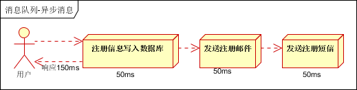 

（2）**并行方式**：将注册信息写入数据库成功后，发送注册邮件的同时，发送注册短信。以上三个任务完成后，返回给客户端。与串行的差别是，并行的方式可以提高处理的时间。

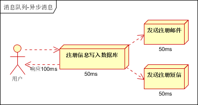 

 假设三个业务节点每个使用50毫秒钟，不考虑网络等其他开销，则串行方式的时间是150毫秒，并行的时间可能是100毫秒。

因为CPU在单位时间内处理的请求数是一定的，假设CPU1秒内吞吐量是100次。则串行方式1秒内CPU可处理的请求量是7次（1000/150）。并行方式处理的请求量是10次（1000/100）。

**小结**：如以上案例描述，传统的方式系统的性能（并发量，吞吐量，响应时间）会有瓶颈。如何解决这个问题呢？

> 引入消息队列，将不是必须的业务逻辑，异步处理。改造后的架构如下：

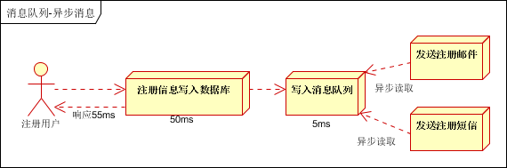 

按照以上约定，用户的响应时间相当于是注册信息写入数据库的时间，也就是50毫秒。注册邮件，发送短信写入消息队列后，直接返回，因此写入消息队列的速度很快，基本可以忽略，因此用户的响应时间可能是50毫秒。因此架构改变后，系统的吞吐量提高到每秒20 QPS。比串行提高了3倍，比并行提高了两倍。

#### 2.2 应用解耦

 场景说明：用户下单后，订单系统需要通知库存系统。传统的做法是，订单系统调用库存系统的接口。如下图：

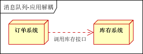 

传统模式的缺点：

1. 库存系统无法访问，则订单减库存将失败，从而导致订单失败；
2.  订单系统与库存系统耦合；

如何解决以上问题呢？引入应用消息队列后的方案，如下图：

 

> 图片来源：https://www.cnblogs.com/itfly8/p/5155983.html

- 订单系统：用户下单后，订单系统完成持久化处理，将消息写入消息队列，返回用户订单下单成功。
- 库存系统：订阅下单的消息，采用拉/推的方式，获取下单信息，库存系统根据下单信息，进行库存操作。
- 假如：在下单时库存系统不能正常使用。也不影响正常下单，因为下单后，订单系统写入消息队列就不再关心其他的后续操作了。实现订单系统与库存系统的应用解耦。

#### 2.3 流量削峰

   流量削锋也是消息队列中的常用场景，一般在秒杀或团抢活动中使用广泛。

​    应用场景：秒杀活动，一般会因为流量过大，导致流量暴增，应用挂掉。为解决这个问题，一般需要在应用前端加入消息队列。

1. 可以控制活动的人数；
2. 可以缓解短时间内高流量压垮应用；

 

1. 用户的请求，服务器接收后，首先写入消息队列。假如消息队列长度超过最大数量，则直接抛弃用户请求或跳转到错误页面；
2. 秒杀业务根据消息队列中的请求信息，再做后续处理。

#### 2.4 日志处理

日志处理是指将消息队列用在日志处理中，比如Kafka的应用，解决大量日志传输的问题。架构简化如下：

 

- 日志采集客户端，负责日志数据采集，定时写受写入Kafka队列；
- Kafka消息队列，负责日志数据的接收，存储和转发；
- 日志处理应用：订阅并消费kafka队列中的日志数据；

以下是新浪kafka日志处理应用案例：转自（http://cloud.51cto.com/art/201507/484338.htm）

 

**(1)Kafka**：接收用户日志的消息队列。

**(2)Logstash**：做日志解析，统一成JSON输出给Elasticsearch。

**(3)Elasticsearch**：实时日志分析服务的核心技术，一个schemaless，实时的数据存储服务，通过index组织数据，兼具强大的搜索和统计功能。

**(4)Kibana**：基于Elasticsearch的数据可视化组件，超强的数据可视化能力是众多公司选择ELK stack的重要原因。

#### 2.5 消息通讯

点对点通讯：

 

客户端A和客户端B使用同一队列，进行消息通讯。

聊天室通讯：

 

客户端A，客户端B，客户端N订阅同一主题，进行消息发布和接收。实现类似聊天室效果。

以上实际是消息队列的两种消息模式，点对点或发布订阅模式。模型为示意图，供参考。

### 3. 消息模式

  它有两种消息模式：**点对点模式**和**发布订阅模式 ** 

#### 3.1 点对点模式

点对点模式包含三个角色：**消息队列（Queue）**，**发送者(Sender)**，**接收者(Receiver)**。每个消息都被发送到一个特定的队列，接收者从队列中获取消息。队列保留着消息，直到他们被消费或超时。

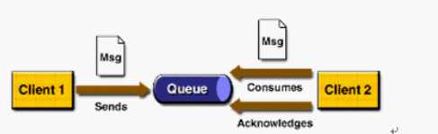 

点对点的特点

1. 每个消息只有一个消费者（Consumer）(即一旦被消费，消息就不再在消息队列中)
2. 发送者和接收者之间在时间上没有依赖性，也就是说当发送者发送了消息之后，不管接收者有没有正在运行，它不会影响到消息被发送到队列
3. 接收者在成功接收消息之后需向队列应答成功

 如果希望发送的每个消息都会被成功处理的话，那么需要P2P模式。

#### 3.2 发布订阅模式

包含三个角色：**主题（Topic）**，**发布者（Publisher）**，**订阅者（Subscriber）** 。多个发布者将消息发送到Topic,系统将这些消息传递给多个订阅者。

 

Pub/Sub的特点

1. 每个消息可以有多个消费者
2. 发布者和订阅者之间有时间上的依赖性。针对某个主题（Topic）的订阅者，它必须创建一个订阅者之后，才能消费发布者的消息。
3. 为了消费消息，订阅者必须保持运行的状态。

​     为了缓和这样严格的时间相关性，JMS允许订阅者创建一个可持久化的订阅。这样，即使订阅者没有被激活（运行），它也能接收到发布者的消息。
如果希望发送的消息可以不被做任何处理、或者只被一个消息者处理、或者可以被多个消费者处理的话，那么可以采用Pub/Sub模型。

### 4. 消息中间件案例

#### 4.1 电商系统

 

消息队列采用高可用，可持久化的消息中间件。比如Active MQ，Rabbit MQ，Rocket Mq。 

（1）应用将主干逻辑处理完成后，写入消息队列。消息发送是否成功可以开启消息的确认模式。（消息队列返回消息接收成功状态后，应用再返回，这样保障消息的完整性）

（2）扩展流程（发短信，配送处理）订阅队列消息。采用推或拉的方式获取消息并处理。

（3）消息将应用解耦的同时，带来了数据一致性问题，可以采用最终一致性方式解决。比如主数据写入数据库，扩展应用根据消息队列，并结合数据库方式实现基于消息队列的后续处理。

#### 4.2 日志收集系统

 

分为Zookeeper注册中心，日志收集客户端，Kafka集群和Storm集群（OtherApp）四部分组成。

- Zookeeper注册中心，提出负载均衡和地址查找服务；
- 日志收集客户端，用于采集应用系统的日志，并将数据推送到kafka队列；
- Kafka集群：接收，路由，存储，转发等消息处理；
- Storm集群：与OtherApp处于同一级别，采用拉的方式消费队列中的数据；

>   **想太多，做太少，中间的落差就是烦恼。想没有烦恼，要么别想，要么多做**   ——《[消息队列基础](https://www.cnblogs.com/itfly8/p/5155983.html)》 

### 5. 理解 JMS

#### 5.1 什么是JMS?

**JMS**即**Java消息服务**（Java Message Service）应用程序**接口**，API是一个**消息服务的标准或者说是规范**，允许应用程序组件基于JavaEE平台创建、发送、接收和读取消息。它使分布式通信耦合度更低，消息服务更加可靠以及异步性。我们可以简单的理解：两个应用程序之间需要进行通信，我们使用一个JMS服务，进行中间的转发，通过JMS 的使用，我们可以解除两个程序之间的耦合。

**JMS**不是消息队列，更不是某种消息队列协议。JMS是**Java消息服务接口**，是一套规范的**JAVA API 接口**。这套规范接口由SUN提出，并在2002年发布JMS规范的Version 1.1版本。JMS和消息中间件厂商无关，既然是一套接口规范，就代表这它需要各个厂商进行实现。好消息是，大部分消息中间件产品都支持JMS 接口规范。也就是说，您可以使用JMS API来连接Stomp协议的产品（例如ActiveMQ）。就像您可以使用JDBC API来连接ORACLE或者MYSQL一样。

- **JMS消息模型：** （**点对点**）和（**发布/订阅模式**）

#### 5.2 JMS 中消息的产生与消费

 在JMS中，消息的产生和消息是异步的。对于消费来说，JMS的消息者可以通过两种方式来消费消息。 

- **同步** ：订阅者或接收者调用**receive**方法来接收消息，**receive**方法在能够接收到消息之前（或超时之前）将一直阻塞 
- **异步** ：订阅者或接收者可以注册为一个消息监听器。当消息到 达之后，系统自动调用监听器的**onMessage**方法。

####  5.3 对象模型

1.  **ConnectionFactory** 

   创建**Connection**对象的工厂，针对两种不同的jms消息模型，分别有**QueueConnectionFactory**和**TopicConnectionFactory**两种。可以通过JNDI来查找ConnectionFactory对象。

2. **Destination** 

   Destination 的意思是消息生产者的消息发送目标或者说消息消费者的消息来源。对于**消息生产者**来说，它的Destination是某个队列（Queue）或某个主题（Topic）;对于**消息消费者**来说，它的Destination也是某个队列或主题（即消息来源）。所以，Destination实际上就是两种类型的对象：Queue、Topic。可以通过JNDI来查找Destination。

3. **Connection** 

   Connection表示在客户端和JMS系统之间建立的链接（对TCP/IP socket的包装）。Connection可以产生一个或多个Session。跟ConnectionFactory一样，Connection也有两种类型：**QueueConnection**和**TopicConnection**。

4.  **Session** 

   Session是我们操作消息的接口。可以通过session创建生产者、消费者、消息等。Session提供了事务的功能。当我们需要使用session发送/接收多个消息时，可以将这些发送/接收动作放到一个事务中。同样，也分**QueueSession**和**TopicSession**。

5.  **消息的生产者**
   消息生产者由Session创建，并用于将消息发送到Destination。同样，消息生产者分两种类型：**QueueSender**和**TopicPublisher**。可以调用消息生产者的方法（send或publish方法）发送消息。

6.  **消息消费者**
   消息消费者由Session创建，用于接收被发送到Destination的消息。两种类型：**QueueReceiver**和**TopicSubscriber**。可分别通过session的createReceiver(Queue)或createSubscriber(Topic)来创建。当然，也可以session的creatDurableSubscriber方法来创建持久化的订阅者。

7.  **MessageListener**
   消息监听器。如果注册了消息监听器，一旦消息到达，将自动调用监听器的onMessage方法。EJB中的MDB（Message-Driven Bean）就是一种MessageListener。

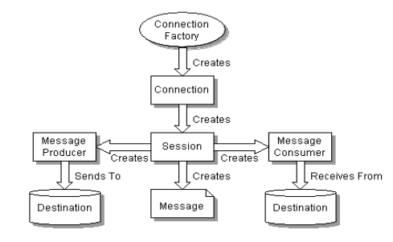 

#### 5.4 消息的组成

 Message主要由三部分组成，分别是**Header**,**Properties**和**Body**, 解释如下：

1. Header: 消息头，所有类型的这部分格式都是一样的
2. Properties: 属性，按类型可以分为应用设置的属性，标准属性和消息中间件定义的属性
3. Body: 消息正文，指我们具体需要消息传输的内容。

（1）**消息头** 

| 序号 | 属性名称         | 说明                                                         | 设置者   |
| ---- | ---------------- | ------------------------------------------------------------ | -------- |
| 1    | JMSDestination   | 消息发送的目的地，是一个Topic或Queue                         | send     |
| 2    | JMSDeliveryMode  | 消息的发送模式，分为NON_PERSISTENT和PERSISTENT，即持久化的和非持久化的 | send     |
| 3    | JMSMessageID     | 消息ID，需要以ID:开头                                        | send     |
| 4    | JMSTimestamp     | 消息发送时的时间，也可以理解为调用send()方法时的时间，而不是该消息发送完成的时间 | send     |
| 5    | JMSCorrelationID | 关联的消息ID，这个通常用在需要回传消息的时候                 | client   |
| 6    | JMSReplyTo       | 消息回复的目的地，其值为一个Topic或Queue, 这个由发送者设置，但是接收者可以决定是否响应 | client   |
| 7    | JMSRedelivered   | 消息是否重复发送过，如果该消息之前发送过，那么这个属性的值需要被设置为true, 客户端可以根据这个属性的值来确认这个消息是否重复发送过，以避免重复处理。 | Provider |
| 8    | JMSType          | 由消息发送者设置的个消息类型，代表消息的结构，有的消息中间件可能会用到这个，但这个并不是是批消息的种类，比如TextMessage之类的 | client   |
| 9    | JMSExpiration    | 消息的过期时间，以毫秒为单位，根据定义，它应该是timeToLive的值再加上发送时的GMT时间，也就是说这个指的是过期时间，而不是有效期 | send     |
| 10   | JMSPriority      | 消息的优先级,0-4为普通的优化级，而5-9为高优先级，通常情况下，高优化级的消息需要优先发送 | send     |

 （2）**消息属性** 

​       **消息属性** 的主要作用是可以对头信息进行一个额外的补充，毕竟消息头信息一是有限，二是很多不能由应用程序设定。通常，消息属性可以用在消息选择器的表达式里，结合起来实现对消息的过滤。消息属性的值只能是基本的类型，或者这些基本类型对应的包装类型。也就是说，不能将一个自定义的对象作为属性值。通常情况下，如果能够放在body里的内容，就不必放在消息属性里。

 （3）**消息体** 

​       为了适应不同场景下的消息，提高消息存储的灵活性，JMS定义了几种具体类型的消息，不同的子类型的消息体也不一样，需要注意的是，Message接口并没有提供一个统一的getBody之类的方法。消息子接口定义如下。

- **TextMessage**: 最简单的消息接口，用于发送文本类的消息，设置/获取其body的方法定义如下setText()/getText().
- **StreamMessage**: 流式消息接口，里面定义了一系列的对基本类型的set/get方法，消息发送者可以通过这些方法写入基本类型的数据，消息接收者需要按发送者的写入顺序来读取相应的数据。
- **MapMessage**：把消息内容存储在Map里，本接口定义了一系列对基本类型的的set/get方法，与StreamMessage不同的是，每个值都对应了一个相应的key，所以消息接收者不必按顺序去读取数据。
- **ObjectMessage**: 将对象作为消息的接口，提供了一个set/get 对象的方法，需要注意的是只能设置一个对象，这个对象可以是一个Collection，但必须是序列化的。
- **BytesMessage**:以字节的形式来传递消息的接口，除了提供了对基本类型的set/get，还提供了按字节方式进行set/get。 

#### 5.5 常用的消息中间件

（1）**RabbitMQ** 

RabbitMQ是流行的开源消息队列系统，用erlang语言开发。RabbitMQ是AMQP（高级消息队列协议）的标准实现。支持多种客户端，如：Python、Ruby、.NET、Java、JMS、C、PHP、ActionScript、XMPP、STOMP等，支持AJAX，持久化。用于在分布式系统中存储转发消息，在易用性、扩展性、高可用性等方面表现不俗。 

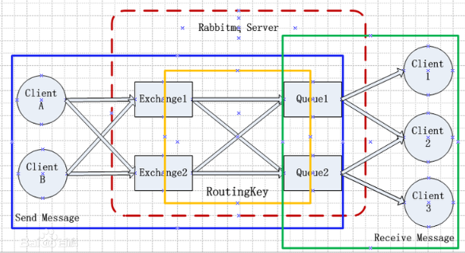 

几个重要概念：

- Exchange：消息交换机，它指定消息按什么规则，路由到哪个队列。　　
- Queue：消息队列载体，每个消息都会被投入到一个或多个队列。
- Binding：绑定，它的作用就是把exchange和queue按照路由规则绑定起来。
- Routing Key：路由关键字，exchange根据这个关键字进行消息投递。
- vhost：虚拟主机，一个broker里可以开设多个vhost，用作不同用户的权限分离。
- producer：消息生产者，就是投递消息的程序。
- consumer：消息消费者，就是接受消息的程序。
- channel：消息通道，在客户端的每个连接里，可建立多个channel，每个channel代表一个会话任务。

消息队列的使用过程，如下：

（1）客户端连接到消息队列服务器，打开一个channel。

（2）客户端声明一个exchange，并设置相关属性。

（3）客户端声明一个queue，并设置相关属性。

（4）客户端使用routing key，在exchange和queue之间建立好绑定关系。

（5）客户端投递消息到exchange。

exchange接收到消息后，就根据消息的key和已经设置的binding，进行消息路由，将消息投递到一个或多个队列里。

（2）**Kafka** 

Kafka是一种高吞吐量的分布式发布订阅消息系统，它可以处理消费者规模的网站中的所有动作流数据。 这种动作（网页浏览，搜索和其他用户的行动）是在现代网络上的许多社会功能的一个关键因素。 这些数据通常是由于吞吐量的要求而通过处理日志和日志聚合来解决。 对于像Hadoop的一样的日志数据和离线分析系统，但又要求实时处理的限制，这是一个可行的解决方案。Kafka的目的是通过Hadoop的并行加载机制来统一线上和离线的消息处理，也是为了通过集群机来提供实时的消费。

Kafka是一种高吞吐量的分布式发布订阅消息系统，有如下特性：

- 通过O(1)的磁盘数据结构提供消息的持久化，这种结构对于即使数以TB的消息存储也能够保持长时间的稳定性能。（文件追加的方式写入数据，过期的数据定期删除）
- 高吞吐量：即使是非常普通的硬件Kafka也可以支持每秒数百万的消息。
- 支持通过Kafka服务器和消费机集群来分区消息。
- 支持Hadoop并行数据加载。

Kafka相关概念

- Broker：Kafka集群包含一个或多个服务器，这种服务器被称为broker[5]

- Topic：每条发布到Kafka集群的消息都有一个类别，这个类别被称为Topic。（物理上不同Topic的消息分开存储，逻辑上一个Topic的消息虽然保存于一个或多个broker上但用户只需指定消息的Topic即可生产或消费数据而不必关心数据存于何处）

- Partition：Parition是物理上的概念，每个Topic包含一个或多个Partition.

- Producer：负责发布消息到Kafka broker

- Consumer：消息消费者，向Kafka broker读取消息的客户端。

- Consumer Group：每个Consumer属于一个特定的Consumer Group（可为每个Consumer指定group name，若不指定group name则属于默认的group）。

一般应用在大数据日志处理或对实时性（少量延迟），可靠性（少量丢数据）要求稍低的场景使用。


> 主要讲解了消息队列概述，常用消息队列应用场景（异步处理，应用解耦，流量削锋，日志处理和消息通讯），JMS Java消息服务——[itfly8分享](https://www.cnblogs.com/itfly8/p/5156155.html) 

## RocketMQ 基本配置

- [rocketmq-window启动rocketmq](https://github.com/apache/rocketmq/blob/master/docs/cn/best_practice.md) 
- [Linux安装RocketMQ](https://www.linuxidc.com/Linux/2020-02/162358.htm) 

RocketMQ的核心配置在broker.conf配置文件里，下面我们来分析下它。

### 1. broker.conf配置

#### 1.1 broker.conf核心配置讲解

```bash
# nameServer地址，如果nameserver是多台集群的话，就用分号分割
namesrvAddr=172.1.21.29:9876;143.13.262.43:9876
# 所属集群名字(同一主从下:Master和slave名称要一致)
brokerClusterName=rocketmq-cluster
# broker名字，注意此处不同的配置文件填写的不一样  例如：在a.properties 文件中写 broker-a  在b.properties 文件中写 broker-b
brokerName=broker-a
# 0 表示 Master，>0 表示 Slave
brokerId=0
# Broker 对外服务的监听端口
listenPort=10911
# 在发送消息时，自动创建服务器不存在的topic，默认创建的队列数。由于是4个broker节点，所以设置为4
# defaultTopicQueueNums=4
# 是否允许 Broker 自动创建Topic，建议线下开启，线上关闭
autoCreateTopicEnable=true
# 是否允许 Broker 自动创建订阅组，建议线下开启，线上关闭
autoCreateSubscriptionGroup=true
# commitLog每个文件的大小默认1G
mapedFileSizeCommitLog=1073741824
# ConsumeQueue每个文件默认存30W条，根据业务情况调整
mapedFileSizeConsumeQueue=300000
# 检测可用的磁盘空间大小,当磁盘被占用超过90%，消息写入会直接报错                    
diskMaxUsedSpaceRatio=90
# Broker 的角色: ASYNC_MASTER 异步复制Master ; SYNC_MASTER 同步双写Master; SLAVE
brokerRole=SYNC_MASTER
# 刷盘方式 ASYNC_FLUSH 异步刷盘; SYNC_FLUSH 同步刷盘
flushDiskType=ASYNC_FLUSH
```

#### 1.2 同步刷盘和异步刷盘

同步刷盘和异步刷盘指的是 **内存和磁盘** 的关系。

RocketMQ的消息最终是是存储到磁盘上的，这样既能保证断电后恢复，又可以让存储的消息量超出内存的限制。

从客户端发送消息，一开始先写到内存，再写到磁盘上。如下图所示

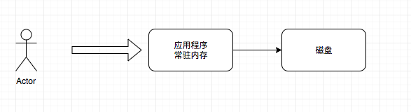 

**两种策略**

- `同步刷盘`：当数据成功写到内存中之后立刻刷盘(同步)，在保证消息写到磁盘也成功的前提下返回写成功状态。

- `异步刷盘` ：数据写入内存后，直接返回成功状态。异步将内存中的数据持久化到磁盘上。

**同步刷盘和异步输盘的优劣** 

**同步刷盘**

- `优点`：保证了数据的可靠性,保证数据不会丢失。

- `缺点`：同步刷盘效率较低,因为需要内存将消息写入磁盘后才返回成功状态。

**异步刷盘** 

- `优点`：异步刷盘可以提高系统的吞吐量。因为它仅仅是写入内存成功后，就返回成功状态。

- `缺点`：异步刷盘不能保证数据的可靠性。因为写入内存成功，但写入磁盘的时候因为某种原因写入失败，那就会丢失该条消息。

#### 1.3 同步复制和异步复制

同步复制和异步复制指的是 **Master节点和slave节点** 的关系。

如果一个Broker组有Master和Slave，消息需要从Master复制到Slave上

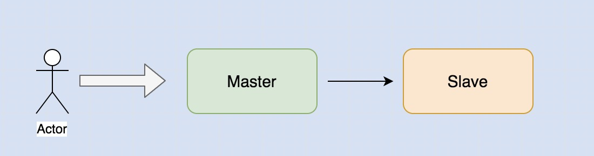 

**两种策略**

- `同步复制`: 当数据成功写到内存中Master节点之后立刻同步到Slave中，当Slave也成功的前提下返回写成功状态。

- `异步复制`: 当数据成功写到内存中Master节点之后,直接返回成功状态，异步将Master数据存入Slave节点。

**同步复制和异步复制的优劣:**

- `同步复制` : 数据安全性高,性能低一点。

- `异步复制` : 数据可能丢失，性能高一点。

> `建议` **线上采用 同步复制 + 异步刷盘;**

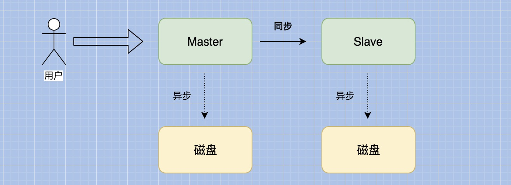 

> 来源：只要自己变优秀了，其他的事情才会跟着好起来——《[RocketMQ配置](https://www.cnblogs.com/qdhxhz/p/11116197.html)》

## 消息队列特性

### 1.1 RocketMQ 重试机制

消息重试分为两种：**Producer发送消息的重试**和 **Consumer消息消费的重试**。

#### **（1）Producer端重试** 

Producer端重试是指: Producer往MQ上发消息没有发送成功，比如网络原因导致生产者发送消息到MQ失败。

看一下代码：

```java
@Slf4j
public class RocketMQTest {
    /**
     * 生产者组
     */
    private static String PRODUCE_RGROUP = "test_producer";
  
    public static void main(String[] args) throws Exception {
        //1、创建生产者对象
        DefaultMQProducer producer = new DefaultMQProducer(PRODUCE_RGROUP);
        //设置重试次数(默认2次）
        producer.setRetryTimesWhenSendFailed(3000);
        //绑定name server
        producer.setNamesrvAddr("74.49.203.55:9876");
        producer.start();
        //创建消息
        Message message = new Message("topic_family", ("小小今年3岁" ).getBytes());
        //发送 这里填写超时时间是5毫秒 所以每次都会发送失败
        SendResult sendResult = producer.send(message,5);
        log.info("输出生产者信息={}",sendResult);
    }
}
```

- `超时重试` 针对网上说的超时异常会重试的说法都是错误的，想想都觉得可怕，我查的所以文章都说超时异常都会重试，难道这么多人都没有去测试一下 或者去看个源码。

我发现这个问题，是因为我上面超时时间设置为5毫秒 ，按照正常肯定会报超时异常，但我设置1次重试和3000次的重试，虽然最终都会报下面异常，但输出错误时间报

显然不应该是一个级别。但测试发现无论我设置的多少次的重试次数，报异常的时间都差不多。

```java
org.apache.rocketmq.remoting.exception.RemotingTooMuchRequestException: sendDefaultImpl call timeout
```

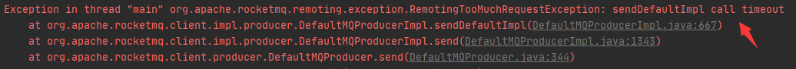 

针对这个疑惑，我去看了源码之后，才恍然大悟。

```java
 	/**
     * 说明 抽取部分代码
     */
    private SendResult sendDefaultImpl(Message msg,
                                       final CommunicationMode communicationMode, 
                                       final SendCallback sendCallback, final long timeout) {
        
        //1、获取当前时间
        long beginTimestampFirst = System.currentTimeMillis();
        long beginTimestampPrev ;
        //2、去服务器看下有没有主题消息
        TopicPublishInfo topicPublishInfo = this.tryToFindTopicPublishInfo(msg.getTopic());
        if (topicPublishInfo != null && topicPublishInfo.ok()) {
            boolean callTimeout = false;
            //3、通过这里可以很明显看出 如果不是同步发送消息 那么消息重试只有1次
            int timesTotal = communicationMode ==
                        CommunicationMode.SYNC ? 1 + this.defaultMQProducer.getRetryTimesWhenSendFailed() : 1;
            //4、根据设置的重试次数，循环再去获取服务器主题消息
            for (times = 0; times < timesTotal; times++) {
                MessageQueue mqSelected = this.selectOneMessageQueue(topicPublishInfo, lastBrokerName);
                beginTimestampPrev = System.currentTimeMillis();
                long costTime = beginTimestampPrev - beginTimestampFirst;
                //5、前后时间对比 如果前后时间差 大于 设置的等待时间 那么直接跳出for循环了 这就说明连接超时是不进行多次连接重试的
                if (timeout < costTime) {
                    callTimeout = true;
                    break;

                }
                //6、如果超时直接报错
                if (callTimeout) {
                    throw new RemotingTooMuchRequestException("sendDefaultImpl call timeout");
                }
        }
    }
```

通过这段源码很明显可以看出以下几点

1. 如果是`异步发送` 那么重试次数只有1次
2. 对于同步而言，`超时异常也是不会再去重试`。
3. 如果发生重试是在一个for 循环里去重试，所以它是立即重试而不是隔一段时间去重试。

真是实践出真知！！！

#### （2）Consumer端重试

消费端比较有意思，而且在实际开发过程中，我们也更应该考虑的是消费端的重试。

- 消费者端的失败主要分为2种情况，`Exception` 和 `Timeout`。

##### Exception

> 代码执行异常的情况下重试

```java
@Slf4j
@Component
public class Consumer {
    /**
     * 消费者实体对象
     */
    private DefaultMQPushConsumer consumer;
    /**
     * 消费者组
     */
    public static final String CONSUMER_GROUP = "test_consumer";
    /**
     * 通过构造函数 实例化对象
     */
    public Consumer() throws MQClientException {
        consumer = new DefaultMQPushConsumer(CONSUMER_GROUP);
        consumer.setNamesrvAddr("47.99.203.55:9876;47.99.203.55:9877");
        //订阅topic和 tags（ * 代表所有标签)下信息
        consumer.subscribe("topic_family", "*");
        //注册消费的监听 并在此监听中消费信息，并返回消费的状态信息
        consumer.registerMessageListener((MessageListenerConcurrently) (msgs, context) -> {
            //1、获取消息
            Message msg = msgs.get(0);
            try {
                //2、消费者获取消息
                String body = new String(msg.getBody(), "utf-8");
                //3、获取重试次数
                int count = ((MessageExt) msg).getReconsumeTimes();
                log.info("当前消费重试次数为 = {}", count);
                //4、这里设置重试大于3次 那么通过保存数据库 人工来兜底
                if (count >= 2) {
                    log.info("该消息已经重试3次,保存数据库。topic={},keys={},msg={}", msg.getTopic(), msg.getKeys(), body);
                    return ConsumeConcurrentlyStatus.CONSUME_SUCCESS;
                }
                //直接抛出异常
                throw new Exception("=======这里出错了============");
                //return ConsumeConcurrentlyStatus.CONSUME_SUCCESS;
            } catch (Exception e) {
                e.printStackTrace();
                return ConsumeConcurrentlyStatus.RECONSUME_LATER;
            }
        });
        //启动监听
        consumer.start();
    }
}
```

这里的代码意思很明显: 主动抛出一个异常，然后如果超过3次，那么就不继续重试下去，而是将该条记录保存到数据库由人工来兜底。

看下运行结果

 

`注意` 消费者和生产者的重试还是有区别的，主要有两点

1. 默认重试次数：**Product默认是2次，而Consumer默认是16次**。

2. 重试时间间隔：**Product是立刻重试，而Consumer是有一定时间间隔的**。它照`1S,5S,10S,30S,1M,2M····2H`进行重试。
3. Product在**异步**情况重试失效，而对于Consumer在**广播**情况下重试失效。

##### Timeout

> 问题说明 

这里的超时异常并非真正意义上的超时，它指的是在获取消息后，因为某种原因没有给RocketMQ返回消费的状态，即没有`return ConsumeConcurrentlyStatus.CONSUME_SUCCESS` 或 `return ConsumeConcurrentlyStatus.RECONSUME_LATER`。

那么 **RocketMQ会认为该消息没有发送，会一直发送**。因为它会认为该消息根本就没有发送给消费者,所以肯定没消费。

做这个测试很简单。

```java
	    //1、消费者获得消息
        String body = new String(msg.getBody(), "utf-8");
        //2、获取重试次数
        int count = ((MessageExt) msg).getReconsumeTimes();
        log.info("当前消费重试次数为 = {}", count);
        //3、这里睡眠60秒
        Thread.sleep(60000);
       log.info("休眠60秒 看还能不能走到这里。topic={},keys={},msg={}", msg.getTopic(), msg.getKeys(), body);
        //返回成功
        return ConsumeConcurrentlyStatus.CONSUME_SUCCESS;
```

当获得 **当前消费重试次数为 = 0** 后 , **关掉该进程**。再重新启动该进程，那么依然能够获取该条消息

```properties
consumer消费者  当前消费重试次数为 = 0
休眠60秒 看还能不能走到这里。topic=topic_family,keys=1a2b3c4d5f,msg=小小今年3岁
```

> 来源：[RocketMQ重试机制](https://www.cnblogs.com/qdhxhz/p/11117379.html) 

### 1.2 消息3种发送方式

RocketMQ 发送普通消息有三种实现方式：`可靠同步发送`、`可靠异步发送`、`单向（Oneway）发送`。

`注意` ：**顺序消息只支持可靠同步发送**。

#### （1）可靠同步发送

- **同步发送** ：是指消息发送方发出数据后，会在收到接收方发回响应之后才发下一个数据包的通讯方式。

  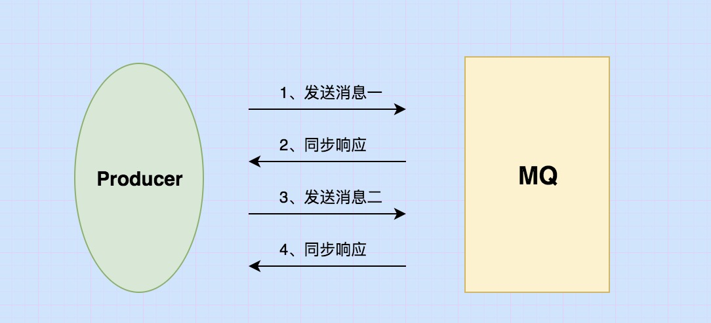 

  **应用场景：**此种方式应用场景非常广泛，例如重要通知邮件、报名短信通知、营销短信系统等。

#### （2）可靠异步发送

- **异步发送** ：是指发送方发出数据后，不等接收方发回响应，接着发送下个数据包的通讯方式。 消息队列 RocketMQ 的异步发送，需要用户实现异步发送回调接口（SendCallback）

  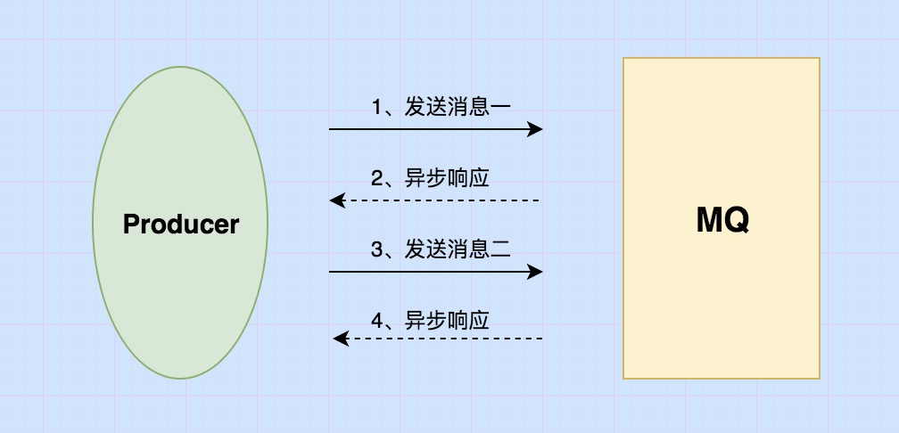 

  **应用场景：**异步发送一般用于链路耗时较长，对 RT 响应时间较为敏感的业务场景，例如批量发货等操作。

#### （3）单向（Oneway）发送

- **单向（Oneway）发送** ：特点为发送方只负责发送消息，不等待服务器回应且没有回调函数触发，即只发送请求不等待应答。 此方式发送消息的过程耗时非常短，一般在微秒级别。

   

  **应用场景：**适用于某些耗时非常短，但对可靠性要求并不高的场景，例如日志收集。

#### （4）三种比较

下表概括了三者的特点和主要区别。

| 发送方式 | 发送 TPS | 发送结果反馈 |  可靠性  |
| :------: | :------: | :----------: | :------: |
| 同步发送 |    快    |      有      |  不丢失  |
| 异步发送 |    快    |      有      |  不丢失  |
| 单向发送 |   最快   |      无      | 可能丢失 |

#### （5）代码示例

```java
@Slf4j
@RestController
public class Controller {
    /**
     * 生产者组
     */
    private static String PRODUCE_RGROUP = "test_producer";
    /**
     * 创建生产者对象
     */
    private static DefaultMQProducer producer = null;

    static {
        producer = new DefaultMQProducer(PRODUCE_RGROUP);
        //不开启vip通道 开通口端口会减2
        producer.setVipChannelEnabled(false);
        //绑定name server
        producer.setNamesrvAddr("47.99.03.25:9876");
        try {
            producer.start();
        } catch (MQClientException e) {
            e.printStackTrace();
        }

    }

    @GetMapping("/message")
    public  void  message() throws Exception {
        //1、同步
        sync();
        //2、异步
        async();
        //3、单项发送
        oneWay();
    }
    /**
     * 1、同步发送消息
     */
    private  void sync() throws Exception {
        //创建消息
        Message message = new Message("topic_family", ("  同步发送  ").getBytes());
        //同步发送消息
        SendResult sendResult = producer.send(message);
        log.info("Product-同步发送-Product信息={}", sendResult);
    }
    /**
     * 2、异步发送消息
     */
    private  void async() throws Exception {
        //创建消息
        Message message = new Message("topic_family", ("  异步发送  ").getBytes());
        //异步发送消息
        producer.send(message, new SendCallback() {
            @Override
            public void onSuccess(SendResult sendResult) {
                log.info("Product-异步发送-输出信息={}", sendResult);
            }
            @Override
            public void onException(Throwable e) {
                e.printStackTrace();
                //补偿机制，根据业务情况进行使用，看是否进行重试
            }
        });
    }
    /**
     * 3、单项发送消息
     */
    private  void oneWay() throws Exception {
        //创建消息
        Message message = new Message("topic_family", (" 单项发送 ").getBytes());
        //同步发送消息
        producer.sendOneway(message);
    }
}
```

> 测试结果

这里消费者代码就不贴出来了。

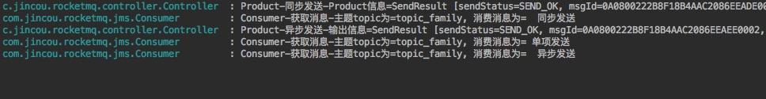

通过这个很明显可以看出三种方式都被 **Consumer** 消费了。只不过对于 **Product** 同步和异步发送是有返回信息的，单项发送是没有返回信息的。 

#### （6）SendStatus状态

当Product发送消息的时候，会返回SendResult对象，该对象又包含了一个SendStatus对象。

```java
package org.apache.rocketmq.client.producer;

public enum SendStatus {
    SEND_OK,
    FLUSH_DISK_TIMEOUT,
    FLUSH_SLAVE_TIMEOUT,
    SLAVE_NOT_AVAILABLE;

    private SendStatus() {
    }
}
```

下面对这几种状态进行说明

- **SEND_OK** : 代表发送成功！但并不保证它是可靠的。要确保不会丢失任何消息，还应启用SYNC_MASTER或SYNC_FLUSH。
- **SLAVE_NOT_AVAILABLE** ：如果Broker的角色是SYNC_MASTER（同步复制）(默认为异步），但没有配置Slave Broker，将获得此状态。
- **FLUSH_DISK_TIMEOUT** ：如果Broker设置为 SYNC_FLUSH(同步刷盘）（默认为ASYNC_FLUSH），并且Broker的syncFlushTimeout（默认为5秒）内完成刷新磁盘，将获得此状态。
- **FLUSH_SLAVE_TIMEOUT** ：如果Broker的角色是SYNC_MASTER(同步复制）（默认为ASYNC_MASTER），并且从属Broker的syncFlushTimeout（默认为5秒）内完成与主服务器的同步，将获得此状态。 

> 相关文章：

1. [RocketMQ-发送普通消息（同步、异步、单项发送）三种方式](https://www.cnblogs.com/qdhxhz/p/11121981.html) 
2. [RocketMQ 阿里云官网文档](https://help.aliyun.com/document_detail/29547.html?spm=a2c4g.11186623.6.572.44e73829KSY1dI) 

### 1.3 RocketMQ 顺序消费

如果要保证顺序消费，那么他的核心点就是：`生产者有序存储`、`消费者有序消费`。

#### （1）基础知识

- **无序消息** 

  指普通的消息，Producer 只管发送消息，Consumer 只管接收消息，至于消息和消息之间的顺序并没有保证。

  **举例**：Producer 依次发送 orderId 为 1、2、3 的消息，Consumer 接到的消息顺序有可能是 1、2、3，也有可能是 2、1、3 等情况，这就是普通消息。

- **全局顺序** 

  对于指定的一个 Topic，所有消息按照严格的先入先出（FIFO）的顺序进行发布和消费。

  **举例**：比如 **Producer** 发送orderId 1,3,2 的消息, 那么 **Consumer** 也必须要按照 1,3,2 的顺序进行消费。

  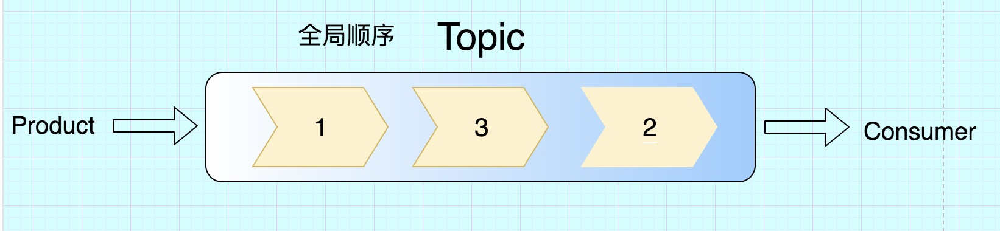 

- **局部顺序** 

  在实际开发有些场景中，我并不需要消息完全按照全局的先进先出，而是某些消息保证先进先出就可以了。

  就好比一个订单涉及 `订单生成`，`订单支付`、`订单完成`。我不用管其它的订单，只保证`同样订单ID能保证这个顺序`就可以了。

  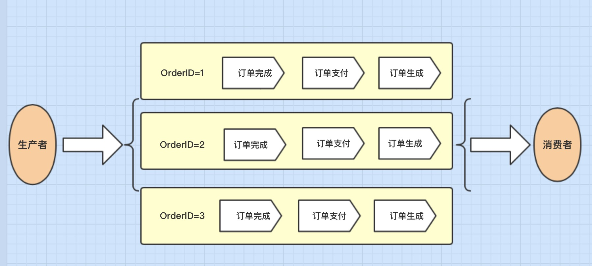 

#### （2）实现原理

我们知道 **生产的message最终会存放在Queue中**，如果一个Topic关联了16个Queue,如果我们不指定消息往哪个队列里放，那么默认是平均分配消息到16个queue，

好比有100条消息，那么这100条消息会平均分配在这16个Queue上，那么每个Queue大概放5～6个左右。这里有一点很重的是:

- **同一个queue，存储在里面的message 是按照先进先出的原则** 

这个时候思路就来了，好比有orderId=1的3条消息，分别是 **订单生产**、**订单付款**、**订单完成**。只要保证它们放到同一个Queue那就保证消费者先进先出了。

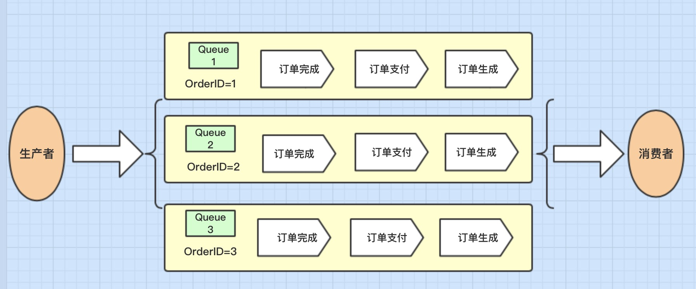 

这就保证局部顺序了，即同一订单按照先后顺序放到同一Queue,那么取消息的时候就可以保证先进先取出。

> 那么全局消息呢？

这个就简单啦，你把所有消息都放在一个Queue里,这样不就保证全局消息了。

> 就这么简单?

当然不是，这里还有很关键的一点，好比在一个消费者集群的情况下，消费者1先去Queue拿消息，它拿到了 **订单生成**，它拿完后，消费者2去queue拿到的是 **订单支付**。

**拿的顺序是没毛病了，但关键是先拿到不代表先消费完它**。会存在虽然你消费者1先拿到**订单生成**，但由于网络等原因，消费者2比你真正的先消费消息。这是不是很尴尬了。订单付款还是可能会比订单生成更早消费的情况。那怎么办。

> 分布式锁来了？

**Rocker采用的是分段锁，它不是锁整个Broker而是锁里面的单个Queue**，因为只要锁单个Queue就可以保证局部顺序消费了。

> 所以最终的消费者这边的逻辑就是:

消费者1去Queue拿 **订单生成**，它就锁住了整个Queue，只有它消费完成并返回成功后，这个锁才会释放。

然后下一个消费者去拿到 **订单支付** 同样锁住当前Queue,这样的一个过程来真正保证对同一个Queue能够真正意义上的顺序消费，而不仅仅是顺序取出。

**全局顺序与分区顺序对比** 

**消息类型对比**
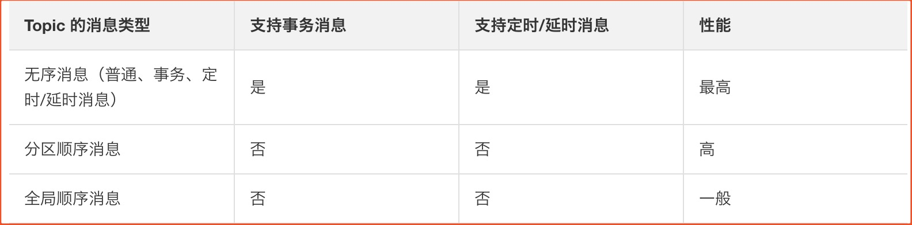 

**发送方式对比**

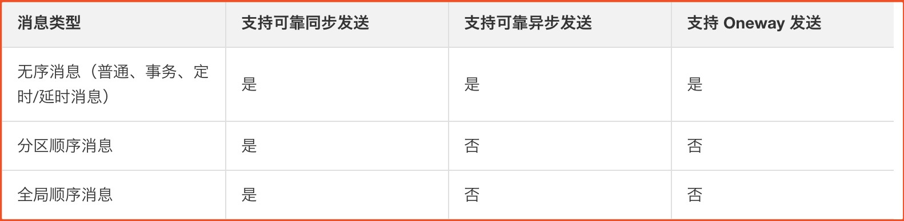 

> 其它的注意事项

1. 顺序消息暂不支持广播模式。
2. 顺序消息不支持异步发送方式，否则将无法严格保证顺序。
3. 建议同一个 Group ID 只对应一种类型的 Topic，即不同时用于顺序消息和无序消息的收发。
4. 对于全局顺序消息，建议创建实例个数 >=2。

#### （3）代码实践

> 这里保证两点

1. 生产端 同一orderID的订单放到同一个queue。
2. 消费端 同一个queue取出消息的时候锁住整个queue,直到消费后再解锁。

**3.1 ProductOrder实体** 

```java
@AllArgsConstructor
@Data
@ToString
public class ProductOrder {
    /**
     * 订单编号
     */
    private String orderId;

    /**
     * 订单类型(订单创建、订单付款、订单完成）
     */
    private String type;
}
```

**3.2 Product（生产者）**

生产者和之前发送普通消息最大的区别，就是针对每一个**message**都手动通过`MessageQueueSelector`选择好queue。

```java
@RestController
public class Product {
    private static List<ProductOrder> orderList = null;
    private static String producerGroup = "test_producer";
    /**
     * 模拟数据
     */
    static {
        orderList = new ArrayList<>();
        orderList.add(new ProductOrder("XXX001", "订单创建"));
        orderList.add(new ProductOrder("XXX001", "订单付款"));
        orderList.add(new ProductOrder("XXX001", "订单完成"));
        orderList.add(new ProductOrder("XXX002", "订单创建"));
        orderList.add(new ProductOrder("XXX002", "订单付款"));
        orderList.add(new ProductOrder("XXX002", "订单完成"));
        orderList.add(new ProductOrder("XXX003", "订单创建"));
        orderList.add(new ProductOrder("XXX003", "订单付款"));
        orderList.add(new ProductOrder("XXX003", "订单完成"));
    }

    @GetMapping("message")
    public  void sendMessage() throws Exception {
        //示例生产者
        DefaultMQProducer producer = new DefaultMQProducer(producerGroup);
        //不开启vip通道 开通口端口会减2
        producer.setVipChannelEnabled(false);
        //绑定name server
        producer.setNamesrvAddr("IP:9876");
        producer.start();
        for (ProductOrder order : orderList) {
            //1、生成消息
            Message message = new Message(JmsConfig.TOPIC, "", order.getOrderId(), order.toString().getBytes());
            //2、发送消息是 针对每条消息选择对应的队列
            SendResult sendResult = producer.send(message, new MessageQueueSelector() {
                @Override
                public MessageQueue select(List<MessageQueue> mqs, Message msg, Object arg) {
                    //3、arg的值其实就是下面传入 orderId
                    String orderid = (String) arg;
                    //4、因为订单是String类型，所以通过hashCode转成int类型
                    int hashCode = orderid.hashCode();
                    //5、因为hashCode可能为负数 所以取绝对值
                    hashCode = Math.abs(hashCode);
                    //6、保证同一个订单号 一定分配在同一个queue上
                    long index = hashCode % mqs.size();
                    return mqs.get((int) index);
                }
            }, order.getOrderId(),50000);

            System.out.printf("Product：发送状态=%s, 存储queue=%s ,orderid=%s, type=%s\n", sendResult.getSendStatus(), 
                                      sendResult.getMessageQueue().getQueueId(), order.getOrderId(), order.getType());
        }
        producer.shutdown();
    }
}
```

看看生产者有没有把相同订单指定到同一个queue:

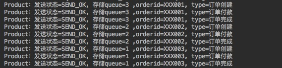 

通过测试结果可以看出：`相同订单已经存到同一queue中了`。

**3.3 Consumer（消费者）** 

上面说过，消费者真正要达到消费顺序，需要分布式锁，所以这里需要将`MessageListenerOrderly`替换之前的**MessageListenerConcurrently**，因为它里面实现了分布式锁。

```java
@Slf4j
@Component
public class Consumer {
    
    /**
     * 消费者实体对象
     */
    private DefaultMQPushConsumer consumer;
    /**
     * 消费者组
     */
    public static final String CONSUMER_GROUP = "consumer_group";
    /**
     * 通过构造函数 实例化对象
     */
    public Consumer() throws MQClientException {
        consumer = new DefaultMQPushConsumer(CONSUMER_GROUP);
        consumer.setNamesrvAddr("IP:9876");
        //TODO 这里真的是个坑,我product设置VipChannelEnabled(false)，但消费者并没有设置这个参数，
        //之前发送普通消息的时候也没有问题。能正常消费。
        //TODO 但在顺序消息时，consumer一直不消费消息了，找了好久都没有找到原因，直到我这里也设置为VipChannelEnabled(false)，
        //竟然才可以消费消息。
        consumer.setVipChannelEnabled(false);
        //订阅主题和 标签（ * 代表所有标签)下信息
        consumer.subscribe(JmsConfig.TOPIC, "*");
            //注册消费的监听 这里注意顺序消费为MessageListenerOrderly 之前并发为ConsumeConcurrentlyContext
        consumer.registerMessageListener((MessageListenerOrderly) (msgs, context) -> {
            //获取消息
            MessageExt msg = msgs.get(0);
            //消费者获取消息 这里只输出 不做后面逻辑处理
            log.info("Consumer-线程名称={},消息={}", Thread.currentThread().getName(), new String(msg.getBody()));
            return ConsumeOrderlyStatus.SUCCESS;
        });
        consumer.start();
    }
}
```

看看消费结果是不是我们需要的结果

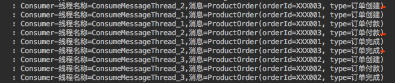 

通过测试结果我们看出

1. 消费消息的顺序并没有完全按照之前的先进先出，即没有满足全局顺序。
2. 同一订单来讲,订单的 订单生成、订单支付、订单完成 消费顺序是保证的。

这是局部保证顺序消费就已经满足我们当前实际开发中的需求了。

有关消费端选择`MessageListenerOrderly`后，consumer.start()启动相关的源码可以参考博客：[RocketMQ顺序消息消费端源码](https://www.jianshu.com/p/931e9bc25c21) 


> 相关文章：

1. [RocketMQ(7)---顺序消费](https://www.cnblogs.com/qdhxhz/p/11134903.html)  

### 1.4 RocketMQ 分布式事务


> 相关文章：

1. [RocketMQ实现分布式事务原理](https://www.cnblogs.com/qdhxhz/p/11191399.html) 

## 消息队列项目

### 1.最佳实践

#### 1.1 概念和特性

- [概念(Concept)](https://github.com/apache/rocketmq/blob/master/docs/cn/concept.md)：介绍RocketMQ的基本概念模型。
- [特性(Features)](https://github.com/apache/rocketmq/blob/master/docs/cn/features.md)：介绍RocketMQ实现的功能特性。

#### 1.2 架构设计

- [架构(Architecture)](https://github.com/apache/rocketmq/blob/master/docs/cn/architecture.md)：介绍RocketMQ部署架构和技术架构。
- [设计(Design)](https://github.com/apache/rocketmq/blob/master/docs/cn/design.md)：介绍RocketMQ关键机制的设计原理，主要包括消息存储、通信机制、消息过滤、负载均衡、事务消息等。

#### 1.3 样例

- [样例(Example)](https://github.com/apache/rocketmq/blob/master/docs/cn/RocketMQ_Example.md) ：介绍RocketMQ的常见用法，包括基本样例、顺序消息样例、延时消息样例、批量消息样例、过滤消息样例、事务消息样例等。

#### 1.4 最佳实践

- [最佳实践（Best Practice）](https://github.com/apache/rocketmq/blob/master/docs/cn/best_practice.md)：介绍RocketMQ的最佳实践，包括生产者、消费者、Broker以及NameServer的最佳实践，客户端的配置方式以及JVM和linux的最佳参数配置。
- [消息轨迹指南(Message Trace)](https://github.com/apache/rocketmq/blob/master/docs/cn/msg_trace/user_guide.md)：介绍RocketMQ消息轨迹的使用方法。
- [权限管理(Auth Management)](https://github.com/apache/rocketmq/blob/master/docs/cn/acl/user_guide.md)：介绍如何快速部署和使用支持权限控制特性的RocketMQ集群。
- [Dledger快速搭建(Quick Start)](https://github.com/apache/rocketmq/blob/master/docs/cn/dledger/quick_start.md)：介绍Dledger的快速搭建方法。
- [集群部署(Cluster Deployment)](https://github.com/apache/rocketmq/blob/master/docs/cn/dledger/deploy_guide.md)：介绍Dledger的集群部署方式。

##### 1.5 运维管理

- [集群部署(Operation)](https://github.com/apache/rocketmq/blob/master/docs/cn/operation.md)：介绍单Master模式、多Master模式、多Master多slave模式等RocketMQ集群各种形式的部署方法以及运维工具mqadmin的使用方式。

> 来源：[RocketMQ官网](https://rocketmq.apache.org/docs/simple-example/) 

### 2. Docker部署RocketMQ集群


**相关文章** 

1. [docker部署RocketMQ集群](https://www.cnblogs.com/qdhxhz/p/11096682.html)(非常感谢) 


### 3. SpringBoot整合RocketMQ


**相关文章** 

1. [SpringBoot整合RocketMQ](https://www.cnblogs.com/qdhxhz/p/11109696.html)(非常感谢)  


