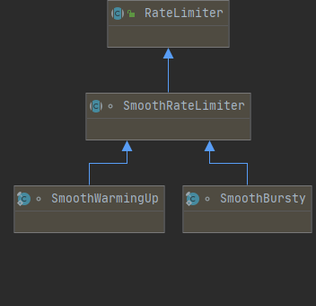
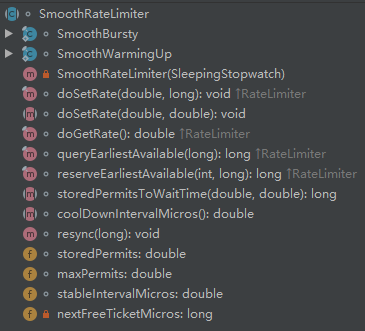

## 谷歌 Guava 限流工具

- [在线Guava 源码](https://github.com/google/guava) 

- [官方文档——限流 RateLimiter](http://ifeve.com/guava-ratelimiter/) 

## 限流 RateLimiter

### 1. 限流概览

RateLimiter 有两种限流模式：

- 稳定模式（` SmoothBursty` ：令牌生成速度恒定）
- 渐进模式（` SmoothWarmingUp` : 令牌生成速度缓慢提升，直到维持在一个稳定值） 

主流架构图如下所示：

  

### 2. 核心思想

> 核心思想：响应本次请求之后，**动态计算下一次可以服务的时间，如果下一次请求在这个时间之前则需要进行等待**

#### 2.1 RateLimiter 核心类


#### 2.2 SmoothRateLimiter 抽象类

```java
abstract class SmoothRateLimiter extends RateLimiter {
    double storedPermits;              // 当前持有的令牌数
    double maxPermits;                 // 令牌数上限
    double stableIntervalMicros;       // 生成令牌桶需要的时间，即可 1/QPS
    private long nextFreeTicketMicros; // 下一次请求能获取令牌的时间
```


#### 2.3 SmoothBursty 稳定模式

> 主要实现源码：

```java
static final class SmoothBursty extends SmoothRateLimiter {
        final double maxBurstSeconds;

        SmoothBursty(SleepingStopwatch stopwatch, double maxBurstSeconds) {
            super(stopwatch, null);
            this.maxBurstSeconds = maxBurstSeconds;
        }

        void doSetRate(double permitsPerSecond, double stableIntervalMicros) {
            double oldMaxPermits = this.maxPermits;
            this.maxPermits = this.maxBurstSeconds * permitsPerSecond;
            if (oldMaxPermits == 1.0D / 0.0) {
                this.storedPermits = this.maxPermits;
            } else {
                this.storedPermits = oldMaxPermits == 
                    0.0D ? 0.0D : this.storedPermits * this.maxPermits / oldMaxPermits;
            }

        }

        long storedPermitsToWaitTime(double storedPermits, double permitsToTake) {
            return 0L;
        }

        double coolDownIntervalMicros() {
            return this.stableIntervalMicros;
        }
    }
```


#### 2.4 SmoothWarmingUp 预热模式

> 主要实现源码：

```java
static final class SmoothWarmingUp extends SmoothRateLimiter {
        private final long warmupPeriodMicros;
        private double slope;
        private double thresholdPermits;
        private double coldFactor;

        SmoothWarmingUp(SleepingStopwatch stopwatch, long warmupPeriod, TimeUnit timeUnit, double coldFactor) {
            super(stopwatch, null);
            this.warmupPeriodMicros = timeUnit.toMicros(warmupPeriod);
            this.coldFactor = coldFactor;
        }

        void doSetRate(double permitsPerSecond, double stableIntervalMicros) {
            double oldMaxPermits = this.maxPermits;
            double coldIntervalMicros = stableIntervalMicros * this.coldFactor;
            this.thresholdPermits = 0.5D * (double)this.warmupPeriodMicros / stableIntervalMicros;
            this.maxPermits = this.thresholdPermits +
                    2.0D * (double)this.warmupPeriodMicros / (stableIntervalMicros + coldIntervalMicros);
            this.slope = (coldIntervalMicros - stableIntervalMicros) / (this.maxPermits - this.thresholdPermits);
            if (oldMaxPermits == 1.0D / 0.0) {
                this.storedPermits = 0.0D;
            } else {
                this.storedPermits = 
                    oldMaxPermits == 0.0D ? this.maxPermits : this.storedPermits * this.maxPermits / oldMaxPermits;
            }

        }

        long storedPermitsToWaitTime(double storedPermits, double permitsToTake) {
            double availablePermitsAboveThreshold = storedPermits - this.thresholdPermits;
            long micros = 0L;
            if (availablePermitsAboveThreshold > 0.0D) {
                double permitsAboveThresholdToTake = Math.min(availablePermitsAboveThreshold, permitsToTake);
                double length = this.permitsToTime(availablePermitsAboveThreshold)
                         + this.permitsToTime(availablePermitsAboveThreshold - permitsAboveThresholdToTake);
                micros = (long)(permitsAboveThresholdToTake * length / 2.0D);
                permitsToTake -= permitsAboveThresholdToTake;
            }

            micros += (long)(this.stableIntervalMicros * permitsToTake);
            return micros;
        }

        private double permitsToTime(double permits) {
            return this.stableIntervalMicros + permits * this.slope;
        }

        double coolDownIntervalMicros() {
            return (double)this.warmupPeriodMicros / this.maxPermits;
        }
    }
```


- 相关文章：
  1. [常见的限流算法解密](https://segmentfault.com/a/1190000020272200?utm_source=tag-newest) 
  2. [谷歌Guava限流工具 RateLimiter](https://segmentfault.com/a/1190000020272200?utm_source=tag-newest) 