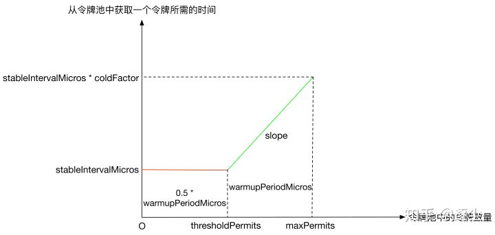

## 谷歌 Guava 限流工具

- [在线Guava 源码](https://github.com/google/guava) 

- [官方文档——限流 RateLimiter](http://ifeve.com/guava-ratelimiter/) 

## 限流 RateLimiter

- **Semaphore** 用来控制同时访问某个资源的并发数量 （ 强调并发数量）
- **RateLimiter** 是用来控制访问资源的速率（rate）（强调并发速率）

### 1. 限流概览

RateLimiter 有两种限流模式：

- 稳定模式（` SmoothBursty` ：令牌生成速度恒定）
- 渐进模式（` SmoothWarmingUp` : 令牌生成速度缓慢提升，直到维持在一个稳定值） 

主流架构图如下所示：

  

### 2. 核心思想

> 核心思想：响应本次请求之后，**动态计算下一次可以服务的时间，如果下一次请求在这个时间之前则需要进行等待**

#### 2.1 RateLimiter 核心类

- RateLimiter的一个重要设计原则——透支未来令牌

如果说令牌池中的令牌数量为x，某个请求需要获取的令牌数量是y，只要x>0，即使y>x，该请求也能立即获取令牌成功。但是当前请求会对下一个请求产生影响，即会透支未来的令牌，使得下一个请求需要等待额外的时间。

> 案例分析

假设一个RateLimiter的QPS设定值是1，如果某个请求一次性获取10个令牌，该请求能够立即获取令牌成功，但是下一个请求获取令牌时，就需要额外等待10s时间。

```java
RateLimiter rateLimiter = RateLimiter.create(1);
System.out.println(String.format("Get 10 tokens spend %f s", rateLimiter.acquire(10)));
System.out.println(String.format("Get 1 token spend %f s", rateLimiter.acquire(1)));
```

输出结果：

```java
获取10个令牌需要消耗时间：0.0 s
获取1个令牌需要消耗时间：9.993272 s
```

- 抽象类 RateLimiter的两个属性

  ```java
  private final SleepingStopwatch stopwatch;     // 是一个SleepingStopwatch类型的对象
  private volatile Object mutexDoNotUseDirectly; // 是一个锁对象，用于线程同步
  ```

> SleepingStopwatch 静态内部类

```java
abstract static class SleepingStopwatch {
        protected SleepingStopwatch() {
        }
        protected abstract long readMicros();
        protected abstract void sleepMicrosUninterruptibly(long var1);
        public static RateLimiter.SleepingStopwatch createFromSystemTimer() {
            return new RateLimiter.SleepingStopwatch() {
                final Stopwatch stopwatch = Stopwatch.createStarted();
                protected long readMicros() {
                    return this.stopwatch.elapsed(TimeUnit.MICROSECONDS);
                }
                protected void sleepMicrosUninterruptibly(long micros) {
                    if (micros > 0L) {
                        Uninterruptibles.sleepUninterruptibly(micros, TimeUnit.MICROSECONDS);
                    }
                }
            };
        }
}
```

我们知道，java.lang.System提供了一个native方法nanoTime返回以纳秒为单位的时间戳：

```java
public static native long nanoTime();
```

事实上，单个nanoTime方法的返回值是没有什么使用价值的，两个nanoTime方法返回值的差值才是有使用价值的，可以用于统计某段代码的执行时间，用法如下：

```java
long startTime = System.nanoTime();
// ... the code being measured ...
long estimatedTime = System.nanoTime() - startTime;
```

而StopWatch的作用就是对nanoTime方法的一层抽象封装，只提供计算时间相对值（相对于StopWatch对象被创建时刻的时间）的功能，其用法如下：

```java
Stopwatch stopwatch = Stopwatch.createStarted();
doSomething();
stopwatch.stop(); // optional
Duration duration = stopwatch.elapsed();
log.info("time: " + stopwatch); // formatted string like "12.3 ms"
```

综上所述：SleepingStopwatch可以简单理解为一个计时器，其记录的值是相对于RateLimiter被创建时刻的时间戳，单位是毫秒。同时，由方法sleepMicrosUninterruptibly可以看到，SleepingStopwatch还提供了不响应InterruptedException的sleep功能。

**设置QPS的方法** 

doSetRate是定义在RateLimiter里的一个抽象方法，由子类SmoothRateLimiter来实现

```java
/**
 * 该方法只是更新了 storedPermits、stableIntervalMicros 和 nextFreeTicketMicros 这
 * 三个参数，真正的实现在子类 SmoothBursty 和 SmoothWarmingUp 的 doSetRate 方法中
 */
final void doSetRate(double permitsPerSecond, long nowMicros) {
    // 根据当前时间戳更新 storedPermits 和 nextFreeTicketMicros
    resync(nowMicros);
    // 根据传入的 QPS 值计算 stableIntervalMicros
    double stableIntervalMicros = SECONDS.toMicros(1L) / permitsPerSecond;
    this.stableIntervalMicros = stableIntervalMicros;
    doSetRate(permitsPerSecond, stableIntervalMicros);
}

/**
 * 根据当前时间戳 nowMicros 更新 storedPermits 和 nextFreeTicketMicros
 */
void resync(long nowMicros) {
    if (nowMicros > nextFreeTicketMicros) {
        // 如果是从 doSetRate 方法里调用的，对于 SmoothBursty 而言，stableIntervalMicros 还
        // 没有被初始化，因此返回的结果是 0.0，此时 newPermits 值为无穷大，下一行代码会将 storedPermits 
        // 设置成 maxPermits。
        double newPermits = (nowMicros - nextFreeTicketMicros) / coolDownIntervalMicros();
        storedPermits = min(maxPermits, storedPermits + newPermits);
        nextFreeTicketMicros = nowMicros;
    }
}

/**
 * 在子类 SmoothWarmingUp 和 SmoothBursty 中实现。
 * 对于 SmoothBursty 而言，返回结果是 stableIntervalMicros。
 * 对于 SmoothWarmingUp 而言，返回的结果是 warmupPeriodMicros / maxPermits，
 * 根据 coldFactor 和 前文 SmoothWarmingUp 的那张分析图可知，该值和 stableIntervalMicros 相同。
 * 
 * 为什么该方法名里有 coolDown 呢？
 * 在 SmoothWarmingUp 中有预热的概念，随着令牌池中的令牌数目减少，令牌池越来越热。
 * 看一下 coolDownIntervalMicros 的调用点：resync 方法，可以看到 coolDownIntervalMicros
 * 用于计算在某一段时间内令牌池中新增的令牌数量。
 * 既然令牌池中令牌数量减少叫预热，那令牌池中令牌数量增多叫降温就不足为奇了。
 */
abstract double coolDownIntervalMicros();

/**
 * 在子类 SmoothWarmingUp 和 SmoothBursty 中实现。
 */
abstract void doSetRate(double permitsPerSecond, double stableIntervalMicros);
```

**reserveEarliestAvailable和queryEarliestAvailable方法** 

这两个方法在前文acquire和tryAcquire的实现里有用到

- reserveEarliestAvailable返回能获得 permits 个令牌的时间戳
- queryEarliestAvailable用于记录前一个请求由于透支令牌对当前请求的影响

```java
final long reserveEarliestAvailable(int requiredPermits, long nowMicros) {
    resync(nowMicros);
    // 返回值是 nextFreeTicketMicros
    long returnValue = nextFreeTicketMicros;
    // 从令牌缓存池中获取到的令牌数量
    double storedPermitsToSpend = min(requiredPermits, this.storedPermits);
    // 除了令牌缓存池中的令牌外，还需额外生产的令牌数量（即透支的令牌数量）
    double freshPermits = requiredPermits - storedPermitsToSpend;
    // waitMicros = 从令牌缓存池中获取 storedPermitsToSpend 个令牌所需花费的时间 + 生产 freshPermits 个新令牌所需的时间
    long waitMicros = storedPermitsToWaitTime(this.storedPermits, storedPermitsToSpend) + (long) (freshPermits * stableIntervalMicros);
    // 更新 nextFreeTicketMicros
    this.nextFreeTicketMicros = LongMath.saturatedAdd(nextFreeTicketMicros, waitMicros);
    // 更新 storedPermits
    this.storedPermits -= storedPermitsToSpend;
    return returnValue;
}

/**
 * 在子类 SmoothWarmingUp 和 SmoothBursty 中实现。特别地，对于 SmoothBursty，从令牌池中获取令牌不需要等待时间，因此返回值是 0。
 */
abstract long storedPermitsToWaitTime(double storedPermits, double permitsToTake);

final long queryEarliestAvailable(long nowMicros) {
    return nextFreeTicketMicros;
}
```

#### 2.2 SmoothRateLimiter 抽象类

```java
abstract class SmoothRateLimiter extends RateLimiter {
    double storedPermits;              // 当前持有的令牌数
    double maxPermits;                 // 令牌数上限
    double stableIntervalMicros;       // 生成令牌桶需要的时间，即可 1/QPS
    private long nextFreeTicketMicros; // 下一次请求能获取令牌的时间
```

SmoothBursty和SmoothWarmingUp是定义在SmoothRateLimiter里的两个静态内部类，是SmoothRateLimiter的真正实现类。

**SmoothBursty和SmoothWarmingUp的区别** 

- SmoothBursty初始化的时候令牌池中的令牌数量为0，而SmoothWarmingUp初始化的时候令牌数量为maxPermits 

- SmoothBursty从令牌池中获取令牌不需要等待，而SmoothWarmingUp从令牌池中获取令牌需要等待一段时间，该时间长短和令牌池中的令牌数量有关系，具体如下图所示：

  - **横坐标**：令牌池中的令牌数量
  - **纵坐标**：从令牌池中获取一个令牌所需的时间
  - 红色实线对应的矩形面积、绿色实线对应的梯形面积的单位都是时间

   

  上图中slope表示绿色实线的斜率，其计算方式如下：

  ` slope = (stableIntervalMicros * coldFactor - stableIntervalMicros) / (maxPermits - thresholdPermits)` 

**预热时间warmupPeriodMicros的定义如下（梯形面积）：** 从满状态的令牌池中取出(maxPermits - thresholdPermits)个令牌所需花费的时间

> 为什么SmoothWarmingUp需要这样设计

SmoothWarmingUp适用于资源需要预热的场景。假设业务在稳定状态下，可以承受的最大QPS是1000。如果线程池是冷的，让系统立即达到1000QPS会拖垮系统，需要有一个预热升温的过程。表现在SmoothWarmingUp中，从令牌池中获取令牌是需要等待时间的，该等待时间随着越来越多的令牌被消耗会逐渐缩短，直至一个稳定的等待时间.

> 小总结

（1）RareLimiter中的令牌来源有两个：

1. 令牌池，SmoothBursty从令牌池中获取令牌是不需要额外等待时间的，而SmoothWarmingUp从令牌池中获取令牌是需要额外等待时间的
2. 透支未来令牌。这一点，SmoothBursty和SmoothWarmingUp均相同

（2）当前请求的额外等待时间由下一个请求来承担

> **获取令牌的方法** 

RateLimiter提供了两个方法用以获取令牌：acquire方法和tryAcquire方法都可以传入需要获取的令牌数量，如果不传，默认需要获取的令牌数量为1

- acquire的返回值是获取令牌成功需要等待的时间
- tryAcquire的返回值是获取令牌是否成功

> acquire() 方法

```java
    public double acquire() {
        return this.acquire(1);
    }
    public double acquire(int permits) {
        // reserve 方法的返回值表示何时能获取令牌
        long microsToWait = this.reserve(permits);
        // sleep 一段时间，直到能够获取令牌，因此如果不能获取到令牌，acquire 方法会阻塞当前线程
        this.stopwatch.sleepMicrosUninterruptibly(microsToWait);
        return 1.0D * (double)microsToWait / (double)TimeUnit.SECONDS.toMicros(1L);
    }
    final long reserve(int permits) {
        // permits 必须大于 0
        checkPermits(permits);
         // synchronized 同步锁，用于解决并发问题
        synchronized(this.mutex()) {
            return this.reserveAndGetWaitLength(permits, this.stopwatch.readMicros());
        }
    }
    final long reserveAndGetWaitLength(int permits, long nowMicros) {
        long momentAvailable = reserveEarliestAvailable(permits, nowMicros);
        // 如果当前时间已经大于等于了能获取到令牌的时间，需要等待的时间为0
        return max(momentAvailable - nowMicros, 0);
    }

    /**
     * 这是一个抽象方法，在 SmoothRateLimiter 中实现，返回能获得 permits 个令牌的时间戳。
     * 对于 SmoothBursty 而言，只需考虑前一个请求透支令牌的影响。
     * 对于 SmoothWarmingUp 而言，还需考虑获取令牌的等待时间。
     */
    abstract long reserveEarliestAvailable(int permits, long nowMicros);
```

> 再来看看tryAcquire方法的实现：

```java
public boolean tryAcquire() {
    // 默认传入的超时时间是 0
    return tryAcquire(1, 0, MICROSECONDS);
}

public boolean tryAcquire(int permits, long timeout, TimeUnit unit) {
    long timeoutMicros = max(unit.toMicros(timeout), 0);
    checkPermits(permits);
    long microsToWait;
    synchronized (mutex()) {
        long nowMicros = stopwatch.readMicros();
        // 由于传入的超时时间 timeoutMicros 是 0，所以不会阻塞
        if (!canAcquire(nowMicros, timeoutMicros)) {
            return false;
        } else {
            // 和 acquire 共用的是同一个方法
            microsToWait = reserveAndGetWaitLength(permits, nowMicros);
        }
    }
    stopwatch.sleepMicrosUninterruptibly(microsToWait);
    return true;
}

private boolean canAcquire(long nowMicros, long timeoutMicros) {
    return queryEarliestAvailable(nowMicros) - timeoutMicros <= nowMicros;
}

/**
 * 这是一个抽象方法，在 SmoothRateLimiter 中实现，用于记录前一个请求由于透支令牌对当前请求的影响。
 * 即只有在当前时间戳大于该方法的返回值时，才能够消除前一个请求对当前请求的影响，才能正常获取令牌。
 */
abstract long queryEarliestAvailable(long nowMicros);
```

#### 2.3 SmoothBursty 稳定模式

> 主要实现源码：

```java
static final class SmoothBursty extends SmoothRateLimiter {
        final double maxBurstSeconds;

        SmoothBursty(SleepingStopwatch stopwatch, double maxBurstSeconds) {
            super(stopwatch, null);
            this.maxBurstSeconds = maxBurstSeconds;
        }
        
        void doSetRate(double permitsPerSecond, double stableIntervalMicros) {
            double oldMaxPermits = this.maxPermits;
            this.maxPermits = this.maxBurstSeconds * permitsPerSecond;
             // 如果原先的最大令牌数目 oldMaxPermits 是无穷大，不按比例变化，而是直接将令牌缓存池中的令牌数置为 maxPermits
            if (oldMaxPermits == 1.0D / 0.0) {
                this.storedPermits = this.maxPermits;
            } else {
        // 如果原先的最大令牌数目 oldMaxPermits 是 0，即首次设置 QPS 值时，此时无需等比例放大，直接将 storedPermits 置 0。
        // 否则，由于产生令牌的速率发生了改变导致了令牌缓存池中能够缓存的最大令牌数量发生了变化，
        // 需要对令牌缓存池中已缓存的令牌数量进行等比例的缩放。
        // 可以看到，初始化时，SmoothBursty 中的 storedPermits 为 0.0，令牌池中没有任何令牌。
                this.storedPermits = oldMaxPermits == 
                    0.0D ? 0.0D : this.storedPermits * this.maxPermits / oldMaxPermits;
            }

        }
        // 从令牌池中获取一个令牌所需的时间在storedPermitsToWaitTime方法中计算。
        // SmoothBursty，从令牌池中获取令牌不需要等待时间，因此返回值是 0：
        long storedPermitsToWaitTime(double storedPermits, double permitsToTake) {
            return 0L;
        }
        // 生产令牌的时间间隔在coolDownIntervalMicros方法中计算
        double coolDownIntervalMicros() {
            return this.stableIntervalMicros;
        }
    }
```

#### 2.4 SmoothWarmingUp 预热模式

> 主要实现源码：

```java
static final class SmoothWarmingUp extends SmoothRateLimiter {
        private final long warmupPeriodMicros;
        private double slope;
        private double thresholdPermits;
        private double coldFactor;

        SmoothWarmingUp(SleepingStopwatch stopwatch, long warmupPeriod, TimeUnit timeUnit, double coldFactor) {
            super(stopwatch, null);
            this.warmupPeriodMicros = timeUnit.toMicros(warmupPeriod);
            this.coldFactor = coldFactor;
        }
        
        void doSetRate(double permitsPerSecond, double stableIntervalMicros) {
            double oldMaxPermits = this.maxPermits;
            double coldIntervalMicros = stableIntervalMicros * this.coldFactor;
            this.thresholdPermits = 0.5D * (double)this.warmupPeriodMicros / stableIntervalMicros;
            this.maxPermits = this.thresholdPermits +
                    2.0D * (double)this.warmupPeriodMicros / (stableIntervalMicros + coldIntervalMicros);
            this.slope = (coldIntervalMicros - stableIntervalMicros) / (this.maxPermits - this.thresholdPermits);
            if (oldMaxPermits == 1.0D / 0.0) {
                this.storedPermits = 0.0D;
            } else {
                // 可以看到，初始化时，SmoothWarmingUp 中的令牌数量就是 masPermits
                this.storedPermits = 
                    oldMaxPermits == 0.0D ? this.maxPermits : this.storedPermits * this.maxPermits / oldMaxPermits;
            }

        }

        long storedPermitsToWaitTime(double storedPermits, double permitsToTake) {
            double availablePermitsAboveThreshold = storedPermits - this.thresholdPermits;
            long micros = 0L;
            if (availablePermitsAboveThreshold > 0.0D) {
                double permitsAboveThresholdToTake = Math.min(availablePermitsAboveThreshold, permitsToTake);
                double length = this.permitsToTime(availablePermitsAboveThreshold)
                         + this.permitsToTime(availablePermitsAboveThreshold - permitsAboveThresholdToTake);
                micros = (long)(permitsAboveThresholdToTake * length / 2.0D);
                permitsToTake -= permitsAboveThresholdToTake;
            }

            micros += (long)(this.stableIntervalMicros * permitsToTake);
            return micros;
        }
        
       // 根据令牌池中的令牌数 permits 计算获取一个令牌所需的时间
        private double permitsToTime(double permits) {
            return this.stableIntervalMicros + permits * this.slope;
        }
       // warmupPeriodMicros / maxPermits = stableIntervalMicros，即生产令牌的时间间隔
        double coolDownIntervalMicros() {
            return (double)this.warmupPeriodMicros / this.maxPermits;
        }
    }
```


- 相关文章：
  1. [常见的限流算法解密](https://segmentfault.com/a/1190000020272200?utm_source=tag-newest) 
  2. [谷歌Guava限流工具 RateLimiter](https://segmentfault.com/a/1190000020272200?utm_source=tag-newest) 

### 3. 令牌桶VS漏桶

#### 3.1 漏桶

**漏桶**的出水速度是恒定的，那么意味着如果瞬时大流量的话，将有大部分请求被丢弃掉（也就是所谓的溢出）。

#### 3.2 令牌桶

生成令牌的速度是恒定的，而请求去拿令牌是没有速度限制的。这意味，面对瞬时大流量，该算法可以在短时间内请求拿到大量令牌，而且拿令牌的过程并不是消耗很大的事情。

最后，不论是对于令牌桶拿不到令牌被拒绝，还是漏桶的水满了溢出，都是为了保证大部分流量的正常使用，而牺牲掉了少部分流量，这是合理的，如果因为极少部分流量需要保证的话，那么就可能导致系统达到极限而挂掉，得不偿失。

### 4. 思考和总结

这是单机（单进程）的限流，是JVM级别的的限流，所有的令牌生成都是在内存中，在分布式环境下不能直接这么用。

如果我们能把permit放到Redis中就可以在分布式环境中用了。