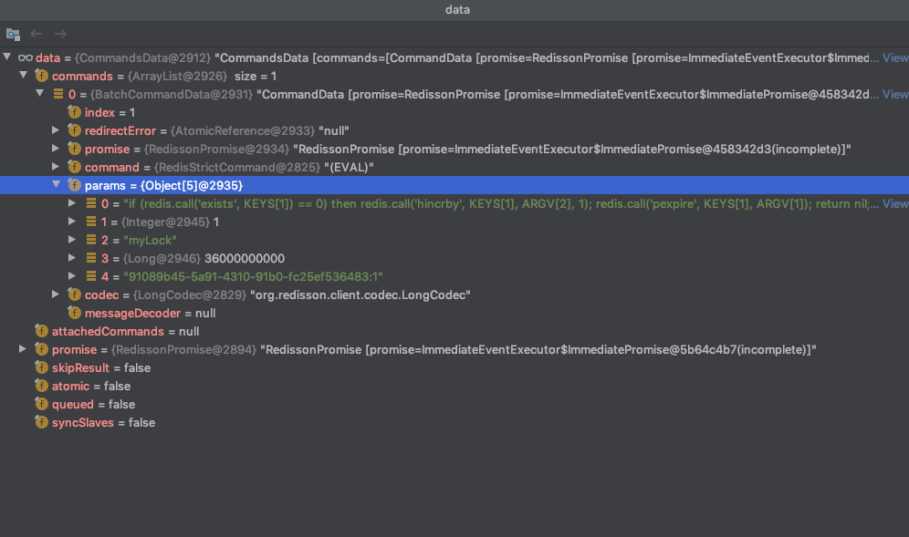
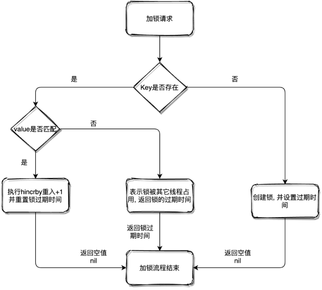
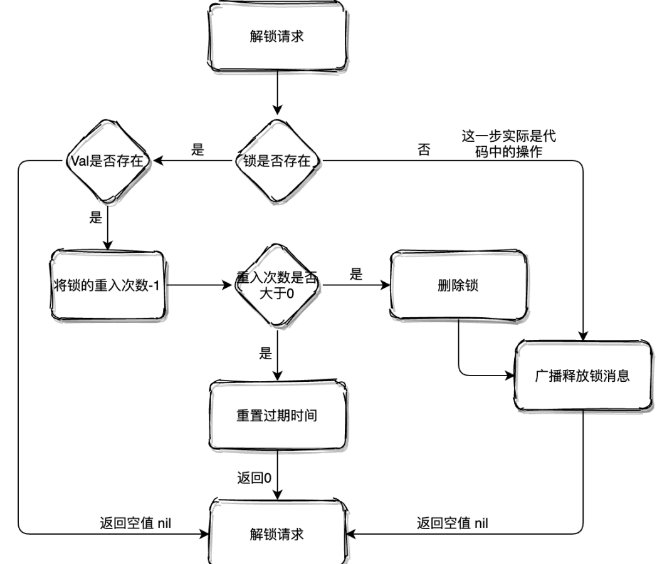
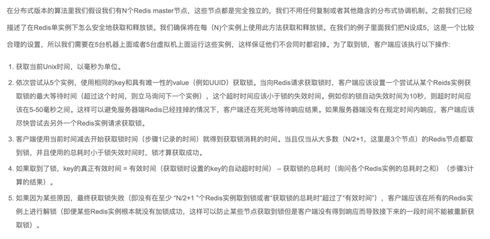

## Redission 分布式技术


 

## 前言

在说 Redisson 之前我们先来说一下 **JDK 可重入锁: ReentrantLock** ，ReentrantLock 保证了 **JVM 共享资源同一时刻只允许单个线程进行操作** 

**实现思路** 

ReentrantLock 内部公平锁与非公平锁继承了 **AQS[AbstractQueuedSynchronizer]**

1. AQS 内部通过 volatile 修饰的 int 类型变量 state **控制并发情况下线程安全问题及锁重入**

2. 将未竞争到锁的线程放入 AQS 的队列中通过 **LockSupport#park、unPark 挂起唤醒**

## Redission 概述

Redisson 是架设在 **Redis 基础上的一个 Java 驻内存数据网格框架**, 充分利用 Redis 键值数据库提供的一系列优势, **基于 Java 实用工具包中常用接口**, 为使用者提供了 **一系列具有分布式特性的常用工具类**

**Redission 优势** 

 使得原本作为协调单机多线程并发程序的工具包 **获得了协调分布式多机多线程并发系统的能力**, 大大降低了设计和研发大规模分布式系统的难度

同时结合各富特色的分布式服务, 更进一步 **简化了分布式环境中程序相互之间的协作**

## Redission 基础

### 1. Redisson 重入锁

 由于 Redisson 太过于复杂, 设计的 API 调用大多和Netty 相关, 所以这里只对 **如何加锁、如何实现重入锁进行分析以及如何锁续时进行分析** 

#### （1）获取锁

下面这个简单的程序, 就是使用 Redisson 创建了一个非公平的可重入锁，

- lock() 方法加锁成功 **默认过期时间 30 秒, 并且支持 "看门狗" 续时功能** 

  ```java
  public static void main(String[] args) {
      Config config = new Config();
      config.useSingleServer()
              .setPassword("123456")
              .setAddress("redis://127.0.0.1:6379");
      RedissonClient redisson = Redisson.create(config);
      RLock lock = redisson.getLock("myLock");
      try {
          lock.lock();
          // 业务逻辑
      } finally {
          lock.unlock();
      }
  }
  ```

> **RLock 接口的声明** 

```java
public interface RLock extends Lock, RLockAsync {}
```

- RLock 继承了 JDK 源码 JUC 包下的 Lock 接口, 同时也继承了 RLockAsync
- RLockAsync 从字面意思看是 **支持异步的锁**, 证明获取锁时可以异步获取

:smile: 看了 Redisson 的源码会知道, 注释比黄金贵 

由于获取锁的 API 较多, 我们这里以 lock() 做源码讲解, 看接口定义相当简单

```java
/**
 * lock 并没有指定锁过期时间, 默认 30 秒
 * 如果获取到锁, 会对锁进行续时
 */
void lock();
```

> **获取锁实例**  

```java
RLock lock = redisson.getLock("myLock");

// name 就是锁名称
public RLock getLock(String name) {
   // 默认创建的同步执行器, (存在异步执行器, 因为锁的获取和释放是有强一致性要求, 默认同步)
    return new RedissonLock(connectionManager.getCommandExecutor(), name);
}
```

Redisson 中所有 Redis 命令都是通过 ...Executor 执行的，获取到默认的同步执行器后, 就要初始化 RedissonLock

```java
public RedissonLock(CommandAsyncExecutor commandExecutor, String name) {
    super(commandExecutor, name);
    this.commandExecutor = commandExecutor;
   // 唯一ID
    this.id = commandExecutor.getConnectionManager().getId();
   // 等待获取锁时间
    this.internalLockLeaseTime = commandExecutor.getConnectionManager().getCfg().getLockWatchdogTimeout();
   // ID + 锁名称
    this.entryName = id + ":" + name;
   // 发布订阅, 后面关于加、解锁流程会用到
    this.pubSub = commandExecutor.getConnectionManager().getSubscribeService().getLockPubSub();
}
```

> **尝试获取锁** 

我们来看一下 **RLock#lock()**  底层是如何获取锁的

```java
    public void lock() {
        try {
            this.lock(-1L, (TimeUnit)null, false);
        } catch (InterruptedException var2) {
            throw new IllegalStateException();
        }
    }
```

- **leaseTime:** 加锁到期时间, -1 使用默认值 30 秒

- **unit:** 时间单位, 毫秒、秒、分钟、小时...

- **interruptibly:** 是否可被中断标识

```java
private void lock(long leaseTime, TimeUnit unit, boolean interruptibly) throws InterruptedException {
    // 获取当前线程ID
    long threadId = Thread.currentThread().getId();
    // 尝试获取锁, 下面重点分析
    Long ttl = tryAcquire(-1, leaseTime, unit, threadId);
    // 成功获取锁, 过期时间为空
    if (ttl == null) {
        return;
    }

    // 订阅分布式锁, 解锁时进行通知
    RFuture<RedissonLockEntry> future = subscribe(threadId);
    if (interruptibly) {
        commandExecutor.syncSubscriptionInterrupted(future);
    } else {
        commandExecutor.syncSubscription(future);
    }

    try {
        while (true) {
            // 再次尝试获取锁
            ttl = tryAcquire(-1, leaseTime, unit, threadId);
            // 成功获取锁, 过期时间为空, 成功返回
            if (ttl == null) {
                break;
            }
            // 锁过期时间如果大于零, 则进行带过期时间的阻塞获取
            if (ttl >= 0) {
                try {
                    // 获取不到锁会在这里进行阻塞, Semaphore, 解锁时释放信号量通知
                    future.getNow().getLatch().tryAcquire(ttl, TimeUnit.MILLISECONDS);
                } catch (InterruptedException e) {
                    if (interruptibly) {
                        throw e;
                    }
                    future.getNow().getLatch().tryAcquire(ttl, TimeUnit.MILLISECONDS);
                }
                // 锁过期时间小于零, 则死等, 区分可中断及不可中断
            } else {
                if (interruptibly) {
                    future.getNow().getLatch().acquire();
                } else {
                    future.getNow().getLatch().acquireUninterruptibly();
                }
            }
        }
    } finally {
        // 取消订阅
        unsubscribe(future, threadId);
    }
}
```

这一段代码是用来执行加锁, 继续看下方法实现

```java
Long ttl = tryAcquire(-1, leaseTime, unit, threadId);

private Long tryAcquire(long waitTime, long leaseTime, TimeUnit unit, long threadId) {
    return get(tryAcquireAsync(waitTime, leaseTime, unit, threadId));
}
```

lock() 以及 tryLock(...) 方法最终都会调用此方法, 分为两个流程分支

1. tryLock(...) API 异步加锁返回

2. lock() & tryLock() API 异步加锁并进行锁续时

```java
private <T> RFuture<Long> tryAcquireAsync(long waitTime, long leaseTime, TimeUnit unit, long threadId) {
    // 执行 tryLock(...) 才会进入
    if (leaseTime != -1) {
        // 进行异步获取锁
        return tryLockInnerAsync(waitTime, leaseTime, unit, threadId, RedisCommands.EVAL_LONG);
    }
    // 尝试异步获取锁, 获取锁成功返回空, 否则返回锁剩余过期时间
    RFuture<Long> ttlRemainingFuture = tryLockInnerAsync(waitTime,
            commandExecutor.getConnectionManager().getCfg().getLockWatchdogTimeout(),
            TimeUnit.MILLISECONDS, threadId, RedisCommands.EVAL_LONG);
    // ttlRemainingFuture 执行完成后触发此操作
    ttlRemainingFuture.onComplete((ttlRemaining, e) -> {
        if (e != null) {
            return;
        }
       // ttlRemaining == null 代表获取了锁
        // 获取到锁后执行续时操作
        if (ttlRemaining == null) {
            scheduleExpirationRenewal(threadId);
        }
    });
    return ttlRemainingFuture;
}
```

继续看一下 tryLockInnerAsync(...) 详细的加锁流程, 内部采用的 Lua 脚本形式, 保证了原子性操作

到这一步大家就很明了了, 将 Lua 脚本被 Redisoon 包装最后通过 Netty 进行传输;

```java
<T> RFuture<T> tryLockInnerAsync(long waitTime, long leaseTime, TimeUnit unit, 
                                  long threadId, RedisStrictCommand<T> command) {
    internalLockLeaseTime = unit.toMillis(leaseTime);

    return evalWriteAsync(getName(), LongCodec.INSTANCE, command,
            "if (redis.call('exists', KEYS[1]) == 0) then " +
                    "redis.call('hincrby', KEYS[1], ARGV[2], 1); " +
                    "redis.call('pexpire', KEYS[1], ARGV[1]); " +
                    "return nil; " +
                    "end; " +
                    "if (redis.call('hexists', KEYS[1], ARGV[2]) == 1) then " +
                    "redis.call('hincrby', KEYS[1], ARGV[2], 1); " +
                    "redis.call('pexpire', KEYS[1], ARGV[1]); " +
                    "return nil; " +
                    "end; " +
                    "return redis.call('pttl', KEYS[1]);",
         Collections.singletonList(getName()), internalLockLeaseTime, getLockName(threadId));
}
```

- evalWriteAsync(...) 是对 Eval 命令的封装以及 Netty 的应用就不继续跟进了

#### （2）加锁 Lua

执行 Redis 加锁的 Lua 脚本, 截个图让大家看一下参数以及具体含义

 

- KEYS[1]: myLock

- ARGV[1]: 36000... 这个是过期时间, 自己测试的, 单位毫秒

- ARGV[2]: UUID + 线程 ID

```powershell
# KEYS[1] 代表上面的 myLock
# 判断 KEYS[1] 是否存在, 存在返回 1, 不存在返回 0
if (redis.call('exists', KEYS[1]) == 0) then
  # 当 KEYS[1] == 0 时代表当前没有锁
  # 使用 hincrby 命令发现 KEYS[1] 不存在并新建一个 hash
  # ARGV[2] 就作为 hash 的第一个key, val 为 1
  # 相当于执行了 hincrby myLock 91089b45... 1
 redis.call('hincrby', KEYS[1], ARGV[2], 1);
  # 设置 KEYS[1] 过期时间, 单位毫秒
 redis.call('pexpire', KEYS[1], ARGV[1]);
 return nil;
end;
# 查找 KEYS[1] 中 key ARGV[2] 是否存在, 存在回返回 1
if (redis.call('hexists', KEYS[1], ARGV[2]) == 1) then
  # 同上, ARGV[2] 为 key 的 val +1
 redis.call('hincrby', KEYS[1], ARGV[2], 1);
  # 同上
 redis.call('pexpire', KEYS[1], ARGV[1]);
return nil;
end;
# 返回 KEYS[1] 过期时间, 单位毫秒
return redis.call('pttl', KEYS[1]);
```

整个 Lua 脚本加锁的流程画图如下:

 

现在回过头看一下获取到锁之后, 是如何为锁进行延期操作的

#### （3）锁续时

"watch"（看门狗）实现锁续时：

1. 获取到锁之后执行 "看门狗" 流程

2. 使用 Netty 的 Timeout 实现定时延时

3. 比如锁过期 30 秒, 每过 1/3 时间也就是 10 秒会检查锁是否存在, 存在则更新锁的超时时间

> **如果检查返回存在, 设置锁过期时刚好锁被释放了怎么办?** 

其实不用担心，因为**Redisson 中使用的 Lua 脚本做的检查及设置过期时间操作**, 本身是原子性的不会出现上面情况；

:timer_clock: 如果不想要引用 Netty 的包, 使用延时队列等包工具也是可以完成 "看门狗" 

- **RedissonLock#tryAcquireAsync(...)**  ，调用自身的1/3

#### （4）解锁

解锁时的操作相对加锁还是比较简单的

```java
@Override
public void unlock() {
    try {
        get(unlockAsync(Thread.currentThread().getId()));
    } catch (RedisException e) {
        if (e.getCause() instanceof IllegalMonitorStateException) {
            throw (IllegalMonitorStateException) e.getCause();
        } else {
            throw e;
        }
    }
}
```

解锁成功后会将之前的"看门狗" Timeout 续时取消, 并返回成功 

```java
@Override
public RFuture<Void> unlockAsync(long threadId) {
    RPromise<Void> result = new RedissonPromise<Void>();
    RFuture<Boolean> future = unlockInnerAsync(threadId);

    future.onComplete((opStatus, e) -> {
       // 取消自动续时功能
        cancelExpirationRenewal(threadId);

        if (e != null) {
           // 失败
            result.tryFailure(e);
            return;
        }
        if (opStatus == null) {
            IllegalMonitorStateException cause = 
                new IllegalMonitorStateException(
                "attempt to unlock lock, not locked by current thread by node id: "
                    + id + " thread-id: " + threadId);
            result.tryFailure(cause);
            return;
        }
    // 解锁成功
        result.trySuccess(null);
    });

    return result;
}
```

又是一个精髓点, 解锁的 Lua 脚本定义 

```java
protected RFuture<Boolean> unlockInnerAsync(long threadId) {
    return evalWriteAsync(getName(), LongCodec.INSTANCE, RedisCommands.EVAL_BOOLEAN,
            "if (redis.call('hexists', KEYS[1], ARGV[3]) == 0) then " +
                    "return nil;" +
                    "end; " +
                    "local counter = redis.call('hincrby', KEYS[1], ARGV[3], -1); " +
                    "if (counter > 0) then " +
                    "redis.call('pexpire', KEYS[1], ARGV[2]); " +
                    "return 0; " +
                    "else " +
                    "redis.call('del', KEYS[1]); " +
                    "redis.call('publish', KEYS[2], ARGV[1]); " +
                    "return 1; " +
                    "end; " +
                    "return nil;",
                          Arrays.asList(getName(), getChannelName()), 
                          LockPubSub.UNLOCK_MESSAGE, 
                          internalLockLeaseTime, 
                          getLockName(threadId));
}
```

还是来张图理解哈, Lua 脚本会详细分析

 

#### （5）解锁 Lua

 

- KEYS[1]: myLock

- KEYS[2]: redisson_lock_channel:{myLock}

- ARGV[1]: 0

- ARGV[2]: 360000... (过期时间)

- ARGV[3]: 7f0c54e2...(Hash 中的锁 Key)

```powershell
# 判断 KEYS[1] 中是否存在 ARGV[3]
if (redis.call('hexists', KEYS[1], ARGV[3]) == 0) then
return nil;
end;
# 将 KEYS[1] 中 ARGV[3] Val - 1
local counter = redis.call('hincrby', KEYS[1], ARGV[3], -1);
# 如果返回大于0 证明是一把重入锁
if (counter > 0) then
  # 重制过期时间
 redis.call('pexpire', KEYS[1], ARGV[2]);
return 0;
else
  # 删除 KEYS[1]
 redis.call('del', KEYS[1]);
  # 通知阻塞等待线程或进程资源可用
 redis.call('publish', KEYS[2], ARGV[1]);
return 1;
end;
return nil;
```

### 2. Redlock 算法

不可否认, Redisson 设计的分布式锁真的很 NB, 但是还是没有解决 **主从节点下异步同步数据导致锁丢失问题** 

所以 Redis 作者 Antirez 推出 **红锁算法**, 

这个算法的精髓就是: **没有从节点, 如果部署多台 Redis, 各实例之间相互独立, 不存在主从复制或者其他集群协调机制** 

 

####  （1）基本使用

创建多个 Redisson Node, 由这些无关联的 Node 组成一个完整的分布式锁

```java
public static void main(String[] args) {
    String lockKey = "myLock";
    Config config = new Config();
    config.useSingleServer().setPassword("123456").setAddress("redis://127.0.0.1:6379");
    Config config2 = new Config();
    config.useSingleServer().setPassword("123456").setAddress("redis://127.0.0.1:6380");
    Config config3 = new Config();
    config.useSingleServer().setPassword("123456").setAddress("redis://127.0.0.1:6381");

    RLock lock = Redisson.create(config).getLock(lockKey);
    RLock lock2 = Redisson.create(config2).getLock(lockKey);
    RLock lock3 = Redisson.create(config3).getLock(lockKey);

    RedissonRedLock redLock = new RedissonRedLock(lock, lock2, lock3);

    try {
        redLock.lock();
    } finally {
        redLock.unlock();
    }
}
```

当然, 对于 Redlock 算法不是没有质疑声, 大家可以去 Redis 官网查看Martin Kleppmann 与 Redis 作者Antirez 的辩论

### 3. CAP 原则之间的取舍

CAP 原则又称 CAP 定理, 指的是在一个分布式系统中,  Consistency（一致性）、 Availability（可用性）、Partition tolerance（分区容错性）, **三者不可得兼** 

- **一致性(C) :** 在分布式系统中的所有数据备份, 在同一时刻是否同样的值(等同于所有节点访问同一份最新的数据副本)

- **可用性(A):** 在集群中一部分节点故障后, 集群整体是否还能响应客户端的读写请求(对数据更新具备高可用性)

- **分区容忍性(P):** 以实际效果而言, 分区相当于对通信的时限要求. 系统如果不能在时限内达成数据一致性, 就意味着发生了分区的情况, 必须就当前操作在 C 和 A 之间做出选择

#### （1）分布式锁选型

- 如果要满足上述分布式锁之间的强一致性, 可以采用 Zookeeper 的分布式锁, **因为它底层的 ZAB协议(原子广播协议), 天然满足 CP**

但是这也意味着性能的下降, 所以不站在具体数据下看 Redis 和 Zookeeper, 代表着性能和一致性的取舍

- 如果项目没有强依赖 ZK, 使用 Redis 就好了, 因为现在 Redis 用途很广, 大部分项目中都引用了 Redis

没必要对此再引入一个新的组件, 如果业务场景对于 Redis 异步方式的同步数据造成锁丢失无法忍受, 在业务层处理就好了

**相关文章** 

1. [Redisson 分布式锁原理—中华石杉](https://mp.weixin.qq.com/s/95N8mKRreeOwaXLttYCbcQ)  


