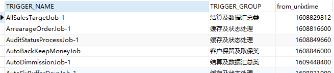
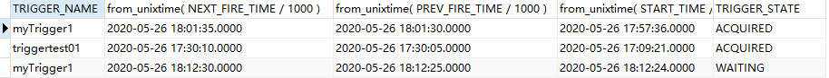

## 定时任务解密

### Shell 定时任务

#### 1. crontab 介绍

linux内置的cron进程能帮我们实现这些需求，cron搭配shell脚本，非常复杂的指令也没有问题。

我们经常使用的是crontab命令是cron table的简写，它是cron的配置文件，也可以叫它作业列表，我们可以在以下文件夹内找到相关配置文件。

- /var/spool/cron/ 目录下存放的是每个用户包括root的crontab任务，每个任务以创建者的名字命名
- /etc/crontab 这个文件负责调度各种管理和维护任务。
- /etc/cron.d/ 这个目录用来存放任何要执行的crontab文件或脚本。

我们还可以把脚本放在/etc/cron.hourly、/etc/cron.daily、/etc/cron.weekly、/etc/cron.monthly目录中，让它每小时/天/星期、月执行一次。

#### 2. 案例分析

在/root下建立一个hello.sh文件

 ```scss
#!/bin/sh
echo ‘hello’
 ```

然后进入etc下

```powershell
#vi crontab
*/1 * * * * /root/hello.sh >> /root/hello.txt(存入的名字和位置自选)(一定要绝对路径)
#给.sh文件足够的权限
```

保存退出后执行 ` service cron restart` ，过一分钟后你就会在/root下看到Hello.txt文件。

- cron表达式案例：在上午8点到11点的第3和第15分钟执行

  ```bash
  3,15 8-11 * * * myCommand.sh   与上面的步骤同上
  ```

**相关文章** 

1. [shell定时任务](https://blog.csdn.net/jerryDzan/article/details/88967535) 

### Quartz 定时任务

#### 1. 定时任务执行原理

##### （1）原理分析

在java中常见的定时调度方案有：ScheduledExecutorService和quartz两种方案。其本质上都是通过native的wait方法来实现的.

- quartz定时调度是通过Object.wait方式（native方法）实现的，其本质是通过操作系统的时钟来实现的。Quartz主要的执行类和执行方法。
  其主要流程如下：

```java
public class QuartzSchedulerThread extends Thread {
     public void run() {
        int acquiresFailed = 0;

        label228:
        while(!this.halted.get()) {
            try {
                synchronized(this.sigLock) {
                    for(; this.paused && !this.halted.get(); acquiresFailed = 0) {
                        try {
                            this.sigLock.wait(1000L);
                        } catch (InterruptedException var24) {
                        }
                    }

                    if (this.halted.get()) {
                        break;
                    }
                }

                if (acquiresFailed > 1) {
                    try {
                        long delay = computeDelayForRepeatedErrors(this.qsRsrcs.getJobStore(), acquiresFailed);
                        Thread.sleep(delay);
                    } catch (Exception var23) {
                    }
                }

                int availThreadCount = this.qsRsrcs.getThreadPool().blockForAvailableThreads();
                if (availThreadCount > 0) {
                    long now = System.currentTimeMillis();
                    this.clearSignaledSchedulingChange();

                    List triggers;
                    try {
                        triggers = this.qsRsrcs.getJobStore().
                            acquireNextTriggers(now + this.idleWaitTime, 
                            Math.min(availThreadCount, this.qsRsrcs.getMaxBatchSize()), 
                            this.qsRsrcs.getBatchTimeWindow());
                        acquiresFailed = 0;
                        if (this.log.isDebugEnabled()) {
                            this.log.debug("batch acquisition of " + (triggers == null ? 0 : 
                                                                      triggers.size()) + " triggers");
                        }
                    } catch (JobPersistenceException var26) {
                        if (acquiresFailed == 0) {
                            this.qs.notifySchedulerListenersError("An error occurred while scanning for 
                                                                  the next triggers to fire.", var26);
                        }

                        if (acquiresFailed < 2147483647) {
                            ++acquiresFailed;
                        }
                        continue;
                    } catch (RuntimeException var27) {
                        if (acquiresFailed == 0) {
                            this.getLog().error("quartzSchedulerThreadLoop: RuntimeException " +
                                                var27.getMessage(), var27);
                        }

                        if (acquiresFailed < 2147483647) {
                            ++acquiresFailed;
                        }
                        continue;
                    }

                    if (triggers != null && !triggers.isEmpty()) {
                        now = System.currentTimeMillis();
                        long triggerTime = ((OperableTrigger)triggers.get(0)).getNextFireTime().getTime();

                        for(long timeUntilTrigger = triggerTime - now; timeUntilTrigger > 2L; 
                                                    timeUntilTrigger = triggerTime - now) {
                            synchronized(this.sigLock) {
                                if (this.halted.get()) {
                                    break;
                                }

                                if (!this.isCandidateNewTimeEarlierWithinReason(triggerTime, false)) {
                                    try {
                                        now = System.currentTimeMillis();
                                        timeUntilTrigger = triggerTime - now;
                                        if (timeUntilTrigger >= 1L) {
                                            this.sigLock.wait(timeUntilTrigger);
                                        }
                                    } catch (InterruptedException var22) {
                                    }
                                }
                            }

                            if (this.releaseIfScheduleChangedSignificantly(triggers, triggerTime)) {
                                break;
                            }

                            now = System.currentTimeMillis();
                        }

                        if (!triggers.isEmpty()) {
                            List<TriggerFiredResult> bndles = new ArrayList();
                            boolean goAhead = true;
                            synchronized(this.sigLock) {
                                goAhead = !this.halted.get();
                            }

                            if (goAhead) {
                                try {
                                    List<TriggerFiredResult> res = this.qsRsrcs.getJobStore().triggersFired(triggers);
                                    if (res != null) {
                                        bndles = res;
                                    }
                                } catch (SchedulerException var25) {
                                    this.qs.notifySchedulerListenersError("An error occurred while firing triggers '" +
                                                                          triggers + "'", var25);
                                    int i = 0;

                                    while(true) {
                                        if (i >= triggers.size()) {
                                            continue label228;
                                        }
                                     this.qsRsrcs.getJobStore().
                                         releaseAcquiredTrigger((OperableTrigger)triggers.get(i));
                                        ++i;
                                    }
                                }
                            }

                            for(int i = 0; i < ((List)bndles).size(); ++i) {
                                TriggerFiredResult result = (TriggerFiredResult)((List)bndles).get(i);
                                TriggerFiredBundle bndle = result.getTriggerFiredBundle();
                                Exception exception = result.getException();
                                if (exception instanceof RuntimeException) {
                                    this.getLog().error("RuntimeException while firing trigger " + 
                                                                triggers.get(i), exception);
                                    this.qsRsrcs.getJobStore().
                                        releaseAcquiredTrigger((OperableTrigger)triggers.get(i));
                                } else if (bndle == null) {
                                    this.qsRsrcs.getJobStore().
                                        releaseAcquiredTrigger((OperableTrigger)triggers.get(i));
                                } else {
                                    JobRunShell shell = null;

                                    try {
                                        shell = this.qsRsrcs.getJobRunShellFactory().createJobRunShell(bndle);
                                        shell.initialize(this.qs);
                                    } catch (SchedulerException var28) {
                                        this.qsRsrcs.getJobStore().
                                            triggeredJobComplete((OperableTrigger)triggers.get(i), 
                                                                 bndle.getJobDetail(), 
                                                             CompletedExecutionInstruction.SET_ALL_JOB_TRIGGERS_ERROR);
                                        continue;
                                    }

                                    if (!this.qsRsrcs.getThreadPool().runInThread(shell)) {
                                        this.getLog().error("ThreadPool.runInThread() return false!");
                                        this.qsRsrcs.getJobStore().
                                            triggeredJobComplete((OperableTrigger)triggers.get(i), 
                                                                 bndle.getJobDetail(), 
                                                             CompletedExecutionInstruction.SET_ALL_JOB_TRIGGERS_ERROR);
                                    }
                                }
                            }
                        }
                    } else {
                        long now = System.currentTimeMillis();
                        long waitTime = now + this.getRandomizedIdleWaitTime();
                        long timeUntilContinue = waitTime - now;
                        synchronized(this.sigLock) {
                            try {
                                if (!this.halted.get() && !this.isScheduleChanged()) {
                                    this.sigLock.wait(timeUntilContinue);
                                }
                            } catch (InterruptedException var19) {
                            }
                        }
                    }
                }
            } catch (RuntimeException var31) {
                this.getLog().error("Runtime error occurred in main trigger firing loop.", var31);
            }
        }

        this.qs = null;
        this.qsRsrcs = null;
    }   
}
```

- 获取最近需要执行的任务列表（30s内的将要执行的任务）。然后根据执行时间进行排序，然后计算出需要wait()的时间。当调度时间来临，欢迎主线程，将任务交给一个线程池进行执行。

```java
triggers = qsRsrcs.getJobStore().acquireNextTriggers(
                             now + idleWaitTime,          // 触发时间 = 当前时间+可等待时间（默认等待时长：30s）
                             Math.min(availThreadCount,   // 可获得的线程数
                             qsRsrcs.getMaxBatchSize()),  // 最大触发器个数，默认是1
                             qsRsrcs.getBatchTimeWindow());
```

- 30秒内没有需要执行的任务，则等待一个随机时间。getRandomizedIdleWaitTime产生一个30秒内随机等待时间。

```java
} else {
    long now = System.currentTimeMillis();
    long waitTime = now + this.getRandomizedIdleWaitTime();
    long timeUntilContinue = waitTime - now;
    synchronized(this.sigLock) {
        try {
            if (!this.halted.get() && !this.isScheduleChanged()) {
                this.sigLock.wait(timeUntilContinue);
            }
        } catch (InterruptedException var19) {
        }
    }
}
```

#### 2. quartz-db定时执行过程分析

##### （1）执行流程

在QuartzSchedulerThread主线程中，首先会从QRTZ_TRIGGERS表中取出最近30秒内将要执行的任务，然后等待executeTime-now时间，然后在等待唤醒时交给线程池处理。当任务执行完成时，会通过事件机制，更新QRTZ_TRIGGERS中的nextFireTime。在每次获取QRTZ_TRIGGERS最近30秒的Trigger时，都会先对QRTZ_LOCKS表中的Trigger行进行加锁，从而保证了一个任务只会在分布式环境中的一台机器上执行。

##### （2）结合db 分析执行过程

- QRTZ_TRIGGERS：用于存储接下来需要进行调度的triiger.

```sql
SELECT
	TRIGGER_NAME,
	TRIGGER_GROUP,
	NEXT_FIRE_TIME,
	PRIORITY 
FROM
	QRTZ_TRIGGERS 
WHERE
	SCHED_NAME = 'quartzScheduler' 
	AND TRIGGER_STATE = 'WAITING' 
	AND NEXT_FIRE_TIME <= 1506322290680 
	AND ( MISFIRE_INSTR = - 1 OR ( MISFIRE_INSTR != - 1 AND NEXT_FIRE_TIME >= 1506322375502 ) ) 
ORDER BY
	NEXT_FIRE_TIME ASC,
	PRIORITY DESC
```

例如：因为机器重启被中断的trigger(该trigger是在机器启动时从QRTZ_FIRED_TRIGGER扫描到的记录，都会加入到QRTZ_TRIGGERS等待进一步调用，其NEXT_FIRE_TIME为空，表示优先级最高)

```mysql
SELECT
	TRIGGER_NAME,
	TRIGGER_GROUP,
	from_unixtime = ( NEXT_FIRE_TIME / 1000 ) 
FROM
	QRTZ_TRIGGERS;
```

- **FROM_UNIXTIME(unix_timestamp,format)** ：将MYSQL中以INT(11)存储的时间以"YYYY-MM-DD"格式来显示   [小提示](https://www.cnblogs.com/changpuyi/p/11160944.html) 

  ```mysql
  SELECT FROM_UNIXTIME(1234567890, '%Y-%m-%d %H:%i:%S')
  ```

上面SQL执行结果如下,用来查询触发器以及下一次触发时间

 

2.1 **QRTZ_FIRED_TRIGGERS: 记录正在进行调度的TRIIGER** 

```sql
INSERT INTO QRTZ_FIRED_TRIGGERS 
( SCHED_NAME, ENTRY_ID, TRIGGER_NAME, TRIGGER_GROUP,
  INSTANCE_NAME, FIRED_TIME, SCHED_TIME, STATE, JOB_NAME, 
	JOB_GROUP, IS_NONCONCURRENT, REQUESTS_RECOVERY, PRIORITY )
VALUES
	( 'quartzScheduler', ?, ?, ?, ?, ?, ?, ?, ?, ?, ?, ?, ? )
```

```bash
mysql> select TRIGGER_NAME,TRIGGER_GROUP,TRIGGER_STATE from QRTZ_TRIGGERS;
+----------------------------------------------------------------+-----------------+---------------+
| TRIGGER_NAME                                                   | TRIGGER_GROUP   | TRIGGER_STATE |
+----------------------------------------------------------------+-----------------+---------------+
| recover_caowenyideMacBook-Pro.local1506316013536_1506322246054 | RECOVERING_JOBS | ACQUIRED      |
| sampleJobCronTrigger                                           | DEFAULT         | WAITING       |
+----------------------------------------------------------------+-----------------+---------------+
 
mysql> select TRIGGER_NAME,TRIGGER_GROUP from QRTZ_FIRED_TRIGGERS;
+----------------------------------------------------------------+-----------------+
| TRIGGER_NAME                                                   | TRIGGER_GROUP   |
+----------------------------------------------------------------+-----------------+
| recover_caowenyideMacBook-Pro.local1506316013536_1506322246054 | RECOVERING_JOBS |
+----------------------------------------------------------------+-----------------+
```

```sql
SELECT
	* 
FROM
	QRTZ_LOCKS 
WHERE
	SCHED_NAME = 'quartzScheduler'
	AND LOCK_NAME = ? FOR UPDATE INSERT INTO QRTZ_LOCKS ( SCHED_NAME, LOCK_NAME )
VALUES
	( ‘ quartzScheduler’, ? )
```

**2.2 获取锁失败直接抛异常，保证了只会有一个任务会获得锁** 

```bash
mysql> select * from QRTZ_LOCKS;
+-----------------+----------------+
| SCHED_NAME      | LOCK_NAME      |
+-----------------+----------------+
| quartzScheduler | STATE_ACCESS   |
| quartzScheduler | TRIGGER_ACCESS |
+-----------------+----------------+
```

- 执行任务

  ```java
  job = sched.getJobFactory().newJob(firedTriggerBundle, scheduler);
  ```

- 任务执行完成（事件机制）

  ```sql
  DELETE FROM QRTZ_TRIGGERS WHERE SCHED_NAME = ‘quartzScheduler’ AND TRIGGER_NAME = ? AND TRIGGER_GROUP = ?
  DELETE FROM QRTZ_FIRED_TRIGGERS WHERE SCHED_NAME = ‘quartzScheduler’ AND ENTRY_ID = ?
  ```

- 并且更新下次要调度的trigger时间

  ```sql
  UPDATE QRTZ_TRIGGERS 
  SET JOB_NAME = ?,
  JOB_GROUP = ?,
  DESCRIPTION = ?,
  NEXT_FIRE_TIME = ?,
  PREV_FIRE_TIME = ?,
  TRIGGER_STATE = ?,
  TRIGGER_TYPE = ?,
  START_TIME = ?,
  END_TIME = ?,
  CALENDAR_NAME = ?,
  MISFIRE_INSTR = ?,
  PRIORITY = ?,
  JOB_DATA = ? 
  WHERE
  	SCHED_NAME = ' quartzScheduler'
  	AND TRIGGER_NAME = ? 
  	AND TRIGGER_GROUP = ?
  ```

- 验证SQL

  ```sql
  SELECT
  	TRIGGER_NAME,
  	from_unixtime( NEXT_FIRE_TIME / 1000 ),
  	from_unixtime( PREV_FIRE_TIME / 1000 ),
  	from_unixtime( START_TIME / 1000 ),
  	TRIGGER_STATE 
  FROM
  	QRTZ_TRIGGERS
  ```

   

**2.3 QRTZ_TRIGGERS每一个任务对应一条记录** 

```sql
SELECT
	TRIGGER_NAME,
	from_unixtime( NEXT_FIRE_TIME / 1000 ),
	from_unixtime( PREV_FIRE_TIME / 1000 ),
	from_unixtime( START_TIME / 1000 ),
	TRIGGER_STATE 
FROM
	QRTZ_TRIGGERS
```

> 案例分析

提问：线上有个任务有问题，立即kill掉jvm，但是机器重启后任务还是会执行，怎么解决？ 

**回答**：在机器重启前删除掉QRTZ_FIRED_TRIGGERS中对应的记录

数据库 SQL 验证步骤如下：

```sql
select * from QRTZ_FIRED_TRIGGERS;;
```

```sql
SELECT
	TRIGGER_NAME,
	from_unixtime( NEXT_FIRE_TIME / 1000 ),
	from_unixtime( PREV_FIRE_TIME / 1000 ),
	from_unixtime( START_TIME / 1000 ),
	TRIGGER_STATE 
FROM
	QRTZ_TRIGGERS;
```


**相关文章** 

- [Quartz是如何到期触发定时任务的](https://blog.csdn.net/GAMEloft9/article/details/89309040) 

- [Quartz Job是如何执行的](https://blog.csdn.net/GAMEloft9/article/details/89330394) 

- [Quartz  job同表不同环境](https://blog.csdn.net/GAMEloft9/article/details/89244584) 


#### 3. 常见问题及解决办法

1. quartz job 同表不同环境处理

2. 线上有个任务有问题，立即kill掉jvm，但是机器重启后任务还是会执行，怎么解决？ 

   **回答**：在机器重启前删除掉QRTZ_FIRED_TRIGGERS中对应的记录

### 

