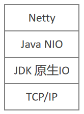
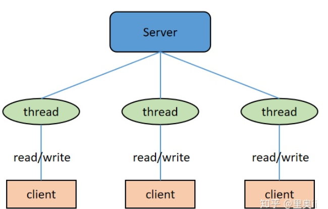
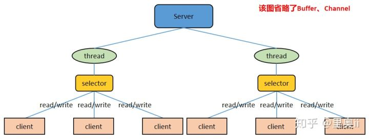
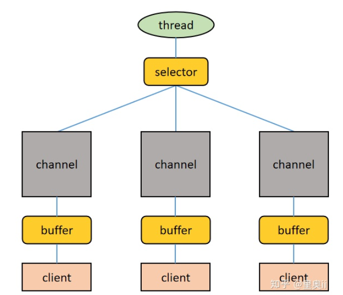
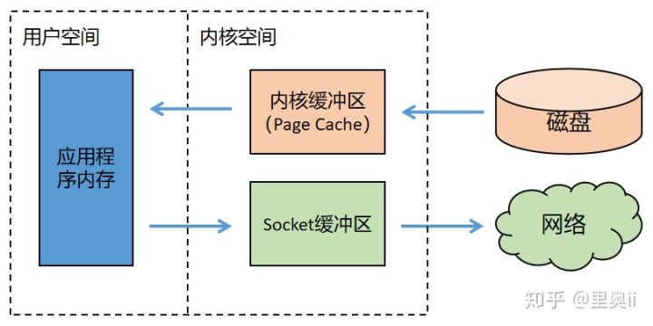
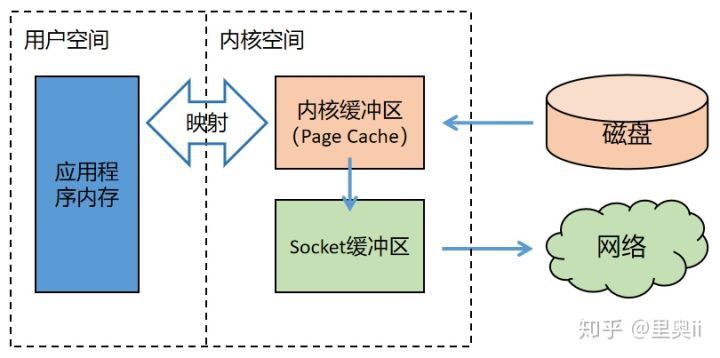
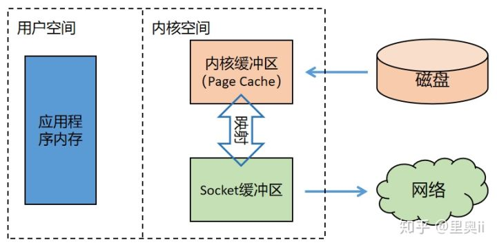
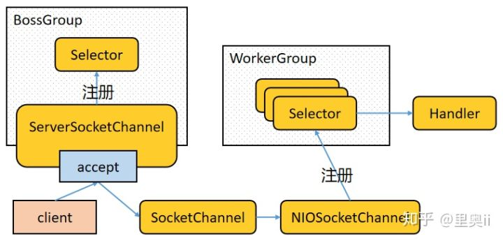

### Netty文档 

- Netty源码：https://github.com/netty/netty
- Netty官方文档：<https://netty.io/> 


### 前言

Netty 作为当前流行的 NIO 框架，在游戏、大数据通讯，云计算、物联网等领域都有广泛的应用，大家熟知的 Dubbo，底层用的就是 Netty。尤其在高并发、高性能 RPC 方面，Netty 更是必不可少。因此在很多技术面试中，Netty 多被问及。

然而，想要将 Netty 真正掌握并精通难度却不小。一些学习者可能会遇到这些问题：

- 多线程编程、Socket 通信、TCP/IP 协议栈等知识掌握不扎实，学习过程比较吃力；
- 学习了不少理论知识，但真正跟具体项目结合在一起解决实际问题时，又感觉比较棘手；
- 调用过程中遇到问题，不会定位，基本靠网上搜索，效率很低。

因此，如果**没有一个好的学习方法，抓不住重点，只靠阅读源码，既耗时又很难吃透，很容易半途而废** 

Netty 编程中的设计难点，比如：

- TCP 的拆包与粘包
- 读写空闲检测、心跳机制、WebSocket 长连接
- Netty源码剖析
- RPC底层通信原理
- 手写聊天室、 Tomcat

读者在阅读本文前最好有 Java 的 IO 编程经验（知道 Java 的各种 IO 流），以及 Java 网络编程经验（用 ServerSocket 和 Socket 写过 demo），并对 Java NIO 有基本的认识（至少知道 Channel、Buffer、Selector 中的核心属性和方法，以及三者如何配合使用的），以及 JUC 编程经验（至少知道其中的 Future 异步处理机制），没有也没关系，文中多数会介绍，不影响整体的理解。

文中对于 Reactor 的讲解使用了几张来自网络上的深灰色背景的示意图，但未找到原始出处，文中已标注“图片来源于网络”。

Netty 的设计复杂，接口和类体系庞大，因此我会从不同的层次对有些 Netty 中的重要组件反复描述，以帮助读者理解。

### Netty 基础

基础好的同学，如果已经掌握了 Java NIO 并对 IO 多路复用的概念有一定的认知，可以跳过本章。

#### 1.1 Netty 是什么

（1）Netty 是 JBoss 开源项目，是异步的、基于事件驱动的网络应用框架，它以高性能、高并发著称。所谓基于事件驱动，说得简单点就是 Netty 会根据客户端事件（连接、读、写等）做出响应，关于这点，随着文章的论述的展开，读者自然会明白。

（2）Netty 主要用于开发基于 TCP 协议的网络 IO 程序（TCP/IP 是网络通信的基石，当然也是 Netty 的基石，Netty 并没有去改变这些底层的网络基础设施，而是在这之上提供更高层的网络基础设施），例如高性能服务器段/客户端、P2P 程序等。

（3）Netty 是基于 Java NIO 构建出来的，Java NIO 又是基于 Linux 提供的高性能 IO 接口/系统调用构建出来的。关于 Netty 在网络中的地位，下图可以很好地表达出来：

 

#### 1.2 Netty 的应用场景

在互联网领域，Netty 作为异步高并发的网络组件，常常用于构建高性能 RPC 框架，以提升分布式服务群之间调用或者数据传输的并发度和速度。例如 Dubbo 的网络层就可以（但并非一定）使用 Netty。

一些大数据基础设施，比如 Hadoop，在处理海量数据的时候，数据在多个计算节点之中传输，为了提高传输性能，也采用 Netty 构建性能更高的网络 IO 层。

在游戏行业，Netty 被用于构建高性能的游戏交互服务器，Netty 提供了 TCP/UDP、HTTP 协议栈，方便开发者基于 Netty 进行私有协议的开发。

……

Netty 作为成熟的高性能异步通信框架，无论是应用在互联网分布式应用开发中，还是在大数据基础设施构建中，亦或是用于实现应用层基于公私协议的服务器等等，都有出色的表现，是一个极好的轮子。

#### 1.3 Java中网络IO模型

Java 中的网络 IO 模型有三种：BIO、NIO、AIO。

##### （1）BIO

BIO：同步的、阻塞式 IO。在这种模型中，服务器上一个线程处理一次连接，即客户端每发起一个请求，服务端都要开启一个线程专门处理该请求。这种模型对线程量的耗费极大，且线程利用率低，难以承受请求的高并发。BIO 虽然可以使用线程池+等待队列进行优化，避免使用过多的线程，但是依然无法解决线程利用率低的问题。

 

使用 BIO 构建 C/S 系统的 Java 编程组件是 ServerSocket 和 Socket。服务端示例代码为：

```java
public class SocketTransport {
    public static void main(String[] args) throws IOException {

        Thread server = new Thread(new Runnable() {
            @Override
            public void run() {
                try {
                    //1.服务端
                    ServerSocket server = new ServerSocket(8080);
                    Socket socket;
                    while ((socket = server.accept()) != null) {
                        try (final ObjectInputStream objectInputStream = 
                                                                 new ObjectInputStream(socket.getInputStream());
                             final ObjectOutputStream objectOutputStream =
                                                                 new ObjectOutputStream(socket.getOutputStream())) {
                            // 3，通过输入流读取客户端发送的请求信息
                            Message message = (Message) objectInputStream.readObject();
                            System.out.println("服务端：server receive message = " + message.getContent());
                            message.setContent("服务端真正响应的数据");
                            //4.通过输出流向客户端发送响应信息
                            objectOutputStream.writeObject(message);
                            objectOutputStream.flush();
                        } catch (IOException | ClassNotFoundException e) {
                            System.out.println("occur exception:" + e);
                        }
                    }

                } catch (IOException e) {
                    e.printStackTrace();
                }
            }
        });
        
        Thread client = new Thread(new Runnable() {
            @Override
            public void run() {
                try {
                    //1.客户端
                    Socket socket = new Socket("127.0.0.1", 8080);
                    Message message = new Message("客户端向服务端发的数据");
                    ObjectOutputStream objectOutputStream = new ObjectOutputStream(socket.getOutputStream());
                    //2.通过输出流向服务器端发送请求信息
                    objectOutputStream.writeObject(message);
                    //3.通过输入流获取服务器响应的信息
                    ObjectInputStream objectInputStream = new ObjectInputStream(socket.getInputStream());
                    System.out.println("客户端：server send message = " + objectInputStream.readObject());
                } catch (IOException e) {
                    e.printStackTrace();
                } catch (ClassNotFoundException e) {
                    e.printStackTrace();
                }
            }
        });
        server.start();
        try { Thread.sleep(5000); } catch (InterruptedException e) { e.printStackTrace(); }
        client.start();
    }
}
```

输出结果：

```tct
服务端：server receive message = 客户端向服务端发的数据
客户端：server send message = Message(content=服务端真正响应的数据)
```

##### （2）NIO

NIO：同步的、非阻塞式 IO。在这种模型中，服务器上一个线程处理多个连接，即多个客户端请求都会被注册到多路复用器（后文要讲的 Selector）上，多路复用器会轮训这些连接，轮训到连接上有 IO 活动就进行处理。NIO 降低了线程的需求量，提高了线程的利用率。Netty 就是基于 NIO 的（这里有一个问题：前文大力宣扬 Netty 是一个异步高性能网络应用框架，为何这里又说 Netty 是基于同步的 NIO 的？请读者跟着文章的描述找寻答案）。



NIO 是面向缓冲区编程的，从缓冲区读取数据的时候游标在缓冲区中是可以前后移动的，这就增加了数据处理的灵活性。这和面向流的 BIO 只能顺序读取流中数据有很大的不同。

Java NIO 的非阻塞模式，使得一个线程从某个通道读取数据的时候，若当前有可用数据，则该线程进行处理，若当前无可用数据，则该线程不会保持阻塞等待状态，而是可以去处理其他工作（比如处理其他通道的读写）；同样，一个线程向某个通道写入数据的时候，一旦开始写入，该线程无需等待写完即可去处理其他工作（比如处理其他通道的读写）。这种特性使得一个线程能够处理多个客户端请求，而不是像 BIO 那样，一个线程只能处理一个请求。

使用 NIO 构建 C/S 系统的 Java 编程组件是 Channel、Buffer、Selector。服务端示例代码为：

```java
public class NIO_Server {

    public static void main(String[] args) throws IOException {
        NIO_Server nioServer = new NIO_Server();
        nioServer.start();
    }

    /**
     * 创建服务端的链接
     */
    public  void start() throws IOException {
        //1.创建selector
        Selector selector = Selector.open();
        //2.通过serverSocketChannel创建channel通道
        ServerSocketChannel serverSocketChannel = ServerSocketChannel.open();
        //3.为channel通道绑定监听地址
        serverSocketChannel.bind(new InetSocketAddress(8080));
        //4.设置channel为非阻塞模式
        serverSocketChannel.configureBlocking(false);
        //5.将channel注册到selector上，监听链接事件
        serverSocketChannel.register(selector, SelectionKey.OP_ACCEPT);
        //6.循环等待新链接的接入
        while (true){
            //获取selector的数量
            int readyChannels = selector.select();

            //如果这个数量等于0表示没有准备好的，则继续循环，不执行下面的代码
            if (readyChannels == 0) continue;

            //如果有可用的数量，selector会将所有的channel放入到slectionKey的set集合中，从中获取
            Set<SelectionKey> selectionKeys = selector.selectedKeys();

            //然后通过迭代器的方式将每个链接展示出来
            Iterator iterator = selectionKeys.iterator();
            //如果存在，则继续
            while (iterator.hasNext()){
                //获取selectionKey实例
                SelectionKey selectionKey = (SelectionKey) iterator.next();

                //移除selectionKey
                iterator.remove();

                //7.根据不同的就绪状态，去处理不同的业务逻辑

                //如果是接入事件
                if(selectionKey.isAcceptable()){
                    acceptHandler(serverSocketChannel,selector);
                }
                //如果是可读事件
                if(selectionKey.isReadable()){
                    readHandler(selectionKey,selector);
                }
            }
        }
    }

    /**
     * 接入事件
     */
    private  void acceptHandler(ServerSocketChannel serverSocketChannel,Selector selector) throws IOException {
        //如果是接入事件，创建socketChannel
        SocketChannel socketChannel = serverSocketChannel.accept();
        //将socketChannel设置为非阻塞模式
        socketChannel.configureBlocking(false);
        //将channel注册到selector上，监听可读事件
        socketChannel.register(selector,SelectionKey.OP_READ);

        //回复客户端信息
        socketChannel.write(Charset.forName("UTF-8").encode("您与聊天室其他人都不是朋友关系，请注意隐私安全"));
    }

    /**
     * 可读事件
     */
    private void readHandler(SelectionKey selectionKey,Selector selector) throws IOException {
        //要从selectionKey中获取到已经就绪的channel
        SocketChannel socketChannel = (SocketChannel) selectionKey.channel();
        //创建buffer
        ByteBuffer byteBuffer = ByteBuffer.allocate(1024);

        //循环读取客户端信息
        String request = "";
        while (socketChannel.read(byteBuffer) > 0){
            //将bufer转成读模式
            byteBuffer.flip();
            //读取buffer中的内容
            request += Charset.forName("UTF-8").decode(byteBuffer);
        }
        /**
         * 将channel再次注册到selector 上，监听他的可读事件
         */
        socketChannel.register(selector,SelectionKey.OP_READ);
        //将消息广播给其他变量
        if(request.length() > 0){
            System.out.println(request);
        }
    }
}
```

##### （3）AIO

AIO：异步非阻塞式 IO。在这种模型中，由操作系统完成与客户端之间的 read/write，之后再由操作系统主动通知服务器线程去处理后面的工作，在这个过程中服务器线程不必同步等待 read/write 完成。由于不同的操作系统对 AIO 的支持程度不同，AIO 目前未得到广泛应用。因此本文对 AIO 不做过多描述。

- 使用 Java NIO 构建的 IO 程序，它的工作模式是：主动轮训 IO 事件，IO 事件发生后程序的线程主动处理 IO 工作，这种模式也叫做 Reactor 模式。

- 使用 Java AIO 构建的 IO 程序，它的工作模式是：将 IO 事件的处理托管给操作系统，操作系统完成 IO 工作之后会通知程序的线程去处理后面的工作，这种模式也叫做 Proactor 模式。

##### （4）小结

本节最后，讨论一下网路 IO 中阻塞、非阻塞、异步、同步这几个术语的含义和关系：

- **阻塞**：如果线程调用 read/write 过程，但 read/write 过程没有就绪或没有完成，则调用 read/write 过程的线程会一直等待，这个过程叫做阻塞式读写。
- 非阻塞：如果线程调用 read/write 过程，但 read/write 过程没有就绪或没有完成，调用 read/write 过程的线程并不会一直等待，而是去处理其他工作，等到 read/write 过程就绪或完成后再回来处理，这个过程叫做阻塞式读写。
- 异步：read/write 过程托管给操作系统来完成，完成后操作系统会通知（通过回调或者事件）应用网络 IO 程序（其中的线程）来进行后续的处理。
- 同步：read/write 过程由网络 IO 程序（其中的线程）来完成。

基于以上含义，可以看出：异步 IO 一定是非阻塞 IO；同步 IO 既可以是阻塞 IO、也可以是非阻塞 IO。

#### 1.4 Java NIO API的简单回顾

- BIO 以流的方式处理数据，而 NIO 以缓冲区（也被叫做块）的方式处理数据，块 IO 效率比流 IO 效率高很多。
- BIO 基于字符流或者字节流进行操作，而 NIO 基于 Channel 和 Buffer 进行操作，数据总是从通道读取到缓冲区或者从缓冲区写入到通道。Selector 用于监听多个通道上的事件（比如收到连接请求、数据达到等等），因此使用单个线程就可以监听多个客户端通道。



关于上图，再进行几点说明：

- 一个 Selector 对应一个处理线程
- 一个 Selector 上可以注册多个 Channel
- 每个 Channel 都会对应一个 Buffer（有时候一个 Channel 可以使用多个 Buffer，这时候程序要进行多个 Buffer 的分散和聚集操作），Buffer 的本质是一个内存块，底层是一个数组
- Selector 会根据不同的事件在各个 Channel 上切换
- Buffer 是双向的，既可以读也可以写，切换读写方向要调用 Buffer 的 flip()方法
- 同样，Channel 也是双向的，数据既可以流入也可以流出

##### （1）**缓冲区（Buffer）** 

缓冲区（Buffer）本质上是一个可读可写的内存块，可以理解成一个容器对象，Channel 读写文件或者网络都要经由 Buffer。在 Java NIO 中，Buffer 是一个顶层抽象类，它的常用子类有（前缀表示该 Buffer 可以存储哪种类型的数据）：

- ByteBuffer
- CharBuffer
- ShortBuffer
- IntBuffer
- LongBuffer
- DoubleBuffer
- FloatBuffer

涵盖了 Java 中除 boolean 之外的所有的基本数据类型。其中 ByteBuffer 支持类型化的数据存取，即可以往 ByteBuffer 中放 byte 类型数据、也可以放 char、int、long、double 等类型的数据，但读取的时候要做好类型匹配处理，否则会抛出 BufferUnderflowException。

另外，Buffer 体系中还有一个重要的 MappedByteBuffer（ByteBuffer 的子类），可以让文件内容直接在堆外内存中被修改，而如何同步到文件由 NIO 来完成。本文重点不在于此，有兴趣的可以去探究一下 MappedByteBuffer 的底层原理。

##### （2）**通道（Channel）** 

通道（Channel）是双向的，可读可写。在 Java NIO 中，Buffer 是一个顶层接口，它的常用子类有：

- FileChannel：用于文件读写
- DatagramChannel：用于 UDP 数据包收发
- ServerSocketChannel：用于服务端 TCP 数据包收发
- SocketChannel：用于客户端 TCP 数据包收发

##### （3）**选择器（Selector）** 

选择器（Selector）是实现 IO 多路复用的关键，多个 Channel 注册到某个 Selector 上，当 Channel 上有事件发生时，Selector 就会取得事件然后调用线程去处理事件。也就是说只有当连接上真正有读写等事件发生时，线程才会去进行读写等操作，这就不必为每个连接都创建一个线程，一个线程可以应对多个连接。这就是 IO 多路复用的要义。

Netty 的 IO 线程 NioEventLoop 聚合了 Selector，可以同时并发处理成百上千的客户端连接，后文会展开描述。

在 Java NIO 中，Selector 是一个抽象类，它的常用方法有：

```java
public abstract class Selector implements Closeable {
    ......
    
    /**
     * 得到一个选择器对象
     */
    public static Selector open() throws IOException {
        return SelectorProvider.provider().openSelector();
    }
    ......

    /**
     * 返回所有发生事件的 Channel 对应的 SelectionKey 的集合，通过
     * SelectionKey 可以找到对应的 Channel
     */
    public abstract Set<SelectionKey> selectedKeys();
    ......
    
    /**
     * 返回所有 Channel 对应的 SelectionKey 的集合，通过 SelectionKey
     * 可以找到对应的 Channel
     */
    public abstract Set<SelectionKey> keys();
    ......
    
    /**
     * 监控所有注册的 Channel，当其中的 Channel 有 IO 操作可以进行时，
     * 将这些 Channel 对应的 SelectionKey 找到。参数用于设置超时时间
     */
    public abstract int select(long timeout) throws IOException;
    
    /**
    * 无超时时间的 select 过程，一直等待，直到发现有 Channel 可以进行
    * IO 操作
    */
    public abstract int select() throws IOException;
    
    /**
    * 立即返回的 select 过程
    */
    public abstract int selectNow() throws IOException;
    ......
    
    /**
    * 唤醒 Selector，对无超时时间的 select 过程起作用，终止其等待
    */
    public abstract Selector wakeup();
    ......
}
```

在上文的使用 Java NIO 编写的服务端示例代码中，服务端的工作流程为：

1）当客户端发起连接时，会通过 ServerSocketChannel 创建对应的 SocketChannel。

2）调用 SocketChannel 的注册方法将 SocketChannel 注册到 Selector 上，注册方法返回一个 SelectionKey，该 SelectionKey 会被放入 Selector 内部的 SelectionKey 集合中。该 SelectionKey 和 Selector 关联（即通过 SelectionKey 可以找到对应的 Selector），也和 SocketChannel 关联（即通过 SelectionKey 可以找到对应的 SocketChannel）。

4）Selector 会调用 select()/select(timeout)/selectNow()方法对内部的 SelectionKey 集合关联的 SocketChannel 集合进行监听，找到有事件发生的 SocketChannel 对应的 SelectionKey。

5）通过 SelectionKey 找到有事件发生的 SocketChannel，完成数据处理。

以上过程的相关源码为：

```java
/**
* SocketChannel 继承 AbstractSelectableChannel
*/
public abstract class SocketChannel
    extends AbstractSelectableChannel
    implements ByteChannel, 
               ScatteringByteChannel, 
               GatheringByteChannel, 
               NetworkChannel
{
    ......
}

public abstract class AbstractSelectableChannel
    extends SelectableChannel
{
    ......
    /**
     * AbstractSelectableChannel 中包含注册方法，SocketChannel 实例
     * 借助该注册方法注册到 Selector 实例上去，该方法返回 SelectionKey
     */
    public final SelectionKey register(
        // 指明注册到哪个 Selector 实例
        Selector sel, 
        // ops 是事件代码，告诉 Selector 应该关注该通道的什么事件
        int ops,
        // 附加信息 attachment
        Object att) throws ClosedChannelException {
        ......
    }
    ......
}

public abstract class SelectionKey {
    ......

    /**
     * 获取该 SelectionKey 对应的 Channel
     */
    public abstract SelectableChannel channel();

    /**
     * 获取该 SelectionKey 对应的 Selector
     */
    public abstract Selector selector();
    ......
    
    /**
     * 事件代码，上面的 ops 参数取这里的值
     */
    public static final int OP_READ = 1 << 0;
    public static final int OP_WRITE = 1 << 2;
    public static final int OP_CONNECT = 1 << 3;
    public static final int OP_ACCEPT = 1 << 4;
    ......
    
    /**
     * 检查该 SelectionKey 对应的 Channel 是否可读
     */
    public final boolean isReadable() {
        return (readyOps() & OP_READ) != 0;
    }

    /**
     * 检查该 SelectionKey 对应的 Channel 是否可写
     */
    public final boolean isWritable() {
        return (readyOps() & OP_WRITE) != 0;
    }

    /**
     * 检查该 SelectionKey 对应的 Channel 是否已经建立起 socket 连接
     */
    public final boolean isConnectable() {
        return (readyOps() & OP_CONNECT) != 0;
    }

    /**
     * 检查该 SelectionKey 对应的 Channel 是否准备好接受一个新的 socket 连接
     */
    public final boolean isAcceptable() {
        return (readyOps() & OP_ACCEPT) != 0;
    }

    /**
     * 添加附件（例如 Buffer）
     */
    public final Object attach(Object ob) {
        return attachmentUpdater.getAndSet(this, ob);
    }

    /**
     * 获取附件
     */
    public final Object attachment() {
        return attachment;
    }
    ......
}
```

下图用于辅助读者理解上面的过程和源码：

 

首先说明，本文以 Linux 系统为对象来研究文件 IO 模型和网络 IO 模型。

#### 1.5 零拷贝技术

注：本节讨论的是 Linux 系统下的 IO 过程。并且对于零拷贝技术的讲解采用了一种浅显易懂但能触及其本质的方式，因为这个话题，展开来讲实在是有太多的细节要关注。

在“将本地磁盘中文件发送到网络中”这一场景中，零拷贝技术是提升 IO 效率的一个利器，为了对比出零拷贝技术的优越性，下面依次给出使用直接 IO 技术、内存映射文件技术、零拷贝技术实现将本地磁盘文件发送到网络中的过程。

##### （1）直接IO 技术

使用直接 IO 技术实现文件传输的过程

 

上图中，内核缓冲区是 Linux 系统的 Page Cahe。为了加快磁盘的 IO，Linux 系统会把磁盘上的数据以 Page 为单位缓存在操作系统的内存里，这里的 Page 是 Linux 系统定义的一个逻辑概念，一个 Page 一般为 4K。

直接 IO 过程使用的 Linux 系统 API 为：

```c
ssize_t read(int filedes, void *buf, size_t nbytes);
ssize_t write(int filedes, void *buf, size_t nbytes);
```

##### （2）内存映射文件技术

使用内存映射文件技术实现文件传输的过程

 

可以看出，整个过程有三次数据拷贝，不再经过应用程序内存，直接在内核空间中从内核缓冲区拷贝到 Socket 缓冲区。

内存映射文件过程使用的 Linux 系统 API 为：

```c
void *mmap(void *addr, size_t length, int prot, int flags, int fd, off_t offset);
```

##### （3）零拷贝技术

使用零拷贝技术，连内核缓冲区到 Socket 缓冲区的拷贝也省略了；

 

内核缓冲区到 Socket 缓冲区之间并没有做数据的拷贝，只是一个地址的映射。底层的网卡驱动程序要读取数据并发送到网络上的时候，看似读取的是 Socket 的缓冲区中的数据，其实直接读的是内核缓冲区中的数据。

零拷贝中所谓的“零”指的是内存中数据拷贝的次数为 0。

```c
ssize_t sendfile(int out_fd, int in_fd, off_t *offset, size_t count);
```

在 JDK 中，提供的：

```java
FileChannel.transderTo(long position, long count, WritableByteChannel target);
```

方法实现了零拷贝过程，其中的第三个参数可以传入 SocketChannel 实例。例如客户端使用以上的零拷贝接口向服务器传输文件的代码为：

```java
public static void main(String[] args) throws IOException {
    SocketChannel socketChannel = SocketChannel.open();
    socketChannel.connect(new InetSocketAddress("127.0.0.1", 8080));
    String fileName = "test.zip";

    // 得到一个文件 channel
    FileChannel fileChannel = new FileInputStream(fileName).getChannel();
    
    // 使用零拷贝 IO 技术发送
    long transferSize = fileChannel.transferTo(0, fileChannel.size(), socketChannel);
    System.out.println("file transfer done, size: " + transferSize);
    fileChannel.close();
}
```

以上部分为第一章，学习 Netty 需要的基础知识。

### Netty的架构与原理

#### 2.1 为什么制造 Netty

既然 Java 提供了 NIO，为什么还要制造一个 Netty，主要原因是 Java NIO 有以下几个缺点：

1. Java NIO 的类库和 API 庞大繁杂，使用起来很麻烦，开发工作量大。
2. 使用 Java NIO，程序员需要具备高超的 Java 多线程编码技能，以及非常熟悉网络编程，比如要处理断连重连、网络闪断、半包读写、失败缓存、网络拥塞和异常流处理等一系列棘手的工作。
3. Java NIO 存在 Bug，例如 Epoll Bug 会导致 Selector 空轮训，极大耗费 CPU 资源。

Netty 对于 JDK 自带的 NIO 的 API 进行了封装，解决了上述问题，提高了 IO 程序的开发效率和可靠性，同时 Netty：

- 设计优雅，提供阻塞和非阻塞的 Socket；提供灵活可拓展的事件模型；提供高度可定制的线程模型。
- 具备更高的性能和更大的吞吐量，使用零拷贝技术最小化不必要的内存复制，减少资源的消耗。
- 提供安全传输特性。
- 支持多种主流协议；预置多种编解码功能，支持用户开发私有协议。

> **注：所谓支持 TCP、UDP、HTTP、WebSocket 等协议，就是说 Netty 提供了相关的编程类和接口，因此本文后面主要对基于 Netty 的 TCP Server/Client 开发案例进行讲解，以展示 Netty 的核心原理，对于其他协议 Server/Client 开发不再给出示例，帮助读者提升内力而非教授花招是我写作的出发点 :-) **  

下图为 Netty 官网给出的 Netty 架构图。

 

我们从其中的几个关键词就能看出 Netty 的强大之处：零拷贝、可拓展事件模型；支持 TCP、UDP、HTTP、WebSocket 等协议；提供安全传输、压缩、大文件传输、编解码支持等等。

#### 2.2 **几种 Reactor 线程模式** 

**传统的 BIO 服务端编程**采用“每线程每连接”的处理模型，弊端很明显，就是面对大量的客户端并发连接时，服务端的资源压力很大；并且线程的利用率很低，如果当前线程没有数据可读，它会阻塞在 read 操作上。这个模型的基本形态如下图所示（图片来源于网络）

 

BIO 服务端编程采用的是 Reactor 模式（也叫做 Dispatcher 模式，分派模式），Reactor 模式有两个要义：

- 基于 IO 多路复用技术，多个连接共用一个多路复用器，应用程序的线程无需阻塞等待所有连接，只需阻塞等待多路复用器即可。当某个连接上有新数据可以处理时，应用程序的线程从阻塞状态返回，开始处理这个连接上的业务。

- 基于线程池技术复用线程资源，不必为每个连接创建专用的线程，应用程序将连接上的业务处理任务分配给线程池中的线程进行处理，一个线程可以处理多个连接的业务。

下图反应了 **Reactor 模式** 的基本形态

 

Reactor 模式有两个核心组成部分：

- Reactor（图中的 ServiceHandler）：Reactor 在一个单独的线程中运行，负责监听和分发事件，分发给适当的处理线程来对 IO 事件做出反应。

- Handlers（图中的 EventHandler）：处理线程执行处理方法来响应 I/O 事件，处理线程执行的是非阻塞操作。

Reactor 模式就是实现网络 IO 程序高并发特性的关键。它又可以分为单 Reactor 单线程模式、单 Reactor 多线程模式、主从 Reactor 多线程模式。

#### 2.3 Netty 架构原理

Netty 的设计主要基于主从 Reactor 多线程模式，并做了一定的改进。本节将使用一种渐进式的描述方式展示 Netty 的模样，即先给出 Netty 的简单版本，然后逐渐丰富其细节，直至展示出 Netty 的全貌。

简单版本的 Netty 的模样如下：

 

关于这张图，作以下几点说明：

1. BossGroup 线程维护 Selector，ServerSocketChannel 注册到这个 Selector 上，只关注连接建立请求事件（相当于主 Reactor）。
2. 当接收到来自客户端的连接建立请求事件的时候，通过 ServerSocketChannel.accept 方法获得对应的 SocketChannel，并封装成 NioSocketChannel 注册到 WorkerGroup 线程中的 Selector，每个 Selector 运行在一个线程中（相当于从 Reactor）。
3. 当 WorkerGroup 线程中的 Selector 监听到自己感兴趣的 IO 事件后，就调用 Handler 进行处理。

我们给这简单版的 Netty 添加一些细节：

 

关于这张图，作以下几点说明：

1）有两组线程池：BossGroup 和 WorkerGroup，BossGroup 中的线程（可以有多个，图中只画了一个）专门负责和客户端建立连接，WorkerGroup 中的线程专门负责处理连接上的读写。

2）BossGroup 和 WorkerGroup 含有多个不断循环的执行事件处理的线程，每个线程都包含一个 Selector，用于监听注册在其上的 Channel。

3）每个 BossGroup 中的线程循环执行以下三个步骤：

3.1）轮训注册在其上的 ServerSocketChannel 的 accept 事件（OP_ACCEPT 事件）

3.2）处理 accept 事件，与客户端建立连接，生成一个 NioSocketChannel，并将其注册到 WorkerGroup 中某个线程上的 Selector 上

3.3）再去以此循环处理任务队列中的下一个事件

4）每个 WorkerGroup 中的线程循环执行以下三个步骤：

4.1）轮训注册在其上的 NioSocketChannel 的 read/write 事件（OP_READ/OP_WRITE 事件）

4.2）在对应的 NioSocketChannel 上处理 read/write 事件

4.3）再去以此循环处理任务队列中的下一个事件

我们再来看下终极版的 Netty 的模样，如下图所示（图片来源于网络）：

 

关于这张图，作以下几点说明：

1）Netty 抽象出两组线程池：BossGroup 和 WorkerGroup，也可以叫做 BossNioEventLoopGroup 和 WorkerNioEventLoopGroup。每个线程池中都有 NioEventLoop 线程。BossGroup 中的线程专门负责和客户端建立连接，WorkerGroup 中的线程专门负责处理连接上的读写。BossGroup 和 WorkerGroup 的类型都是 NioEventLoopGroup。

2）NioEventLoopGroup 相当于一个事件循环组，这个组中含有多个事件循环，每个事件循环就是一个 NioEventLoop。

3）NioEventLoop 表示一个不断循环的执行事件处理的线程，每个 NioEventLoop 都包含一个 Selector，用于监听注册在其上的 Socket 网络连接（Channel）。

4）NioEventLoopGroup 可以含有多个线程，即可以含有多个 NioEventLoop。

5）每个 BossNioEventLoop 中循环执行以下三个步骤：

5.1）**select**：轮训注册在其上的 ServerSocketChannel 的 accept 事件（OP_ACCEPT 事件）

5.2）**processSelectedKeys**：处理 accept 事件，与客户端建立连接，生成一个 NioSocketChannel，并将其注册到某个 WorkerNioEventLoop 上的 Selector 上

5.3）**runAllTasks**：再去以此循环处理任务队列中的其他任务

6）每个 WorkerNioEventLoop 中循环执行以下三个步骤：

6.1）**select**：轮训注册在其上的 NioSocketChannel 的 read/write 事件（OP_READ/OP_WRITE 事件）

6.2）**processSelectedKeys**：在对应的 NioSocketChannel 上处理 read/write 事件

6.3）**runAllTasks**：再去以此循环处理任务队列中的其他任务

7）在以上两个**processSelectedKeys**步骤中，会使用 Pipeline（管道），Pipeline 中引用了 Channel，即通过 Pipeline 可以获取到对应的 Channel，Pipeline 中维护了很多的处理器（拦截处理器、过滤处理器、自定义处理器等）。这里暂时不详细展开讲解 Pipeline。

#### 2.4 **基于 Netty 的 TCP Server/Client 案例** 

下面我们写点代码来加深理解 Netty 的模样。下面两段代码分别是基于 Netty 的 TCP Server 和 TCP Client。

1. 引入pom文件

   ```xml
   		<!--高性能异步IO Netty-->
           <dependency>
               <groupId>io.netty</groupId>
               <artifactId>netty-all</artifactId>
           </dependency>
   ```

> 源码地址：[Github快速访问](https://github.com/GitHubWxw/SpringBoot/tree/master/spring-netty) 

什么？你觉得使用 Netty 编程难度和工作量更大了？不会吧不会吧，你要知道，你通过这么两段简短的代码得到了一个基于主从 Reactor 多线程模式的服务器，一个高吞吐量和并发量的服务器，一个异步处理服务器……你还要怎样？


#### 2.5 Netty 的handler组件

#### 2.6. Netty 的 Pipeline 组件

#### 2.7. Netty 的 EventLoopGroup 组件

#### 2.8. Netty 的 TaskQueue

#### 2.9. Netty 的 Future 和 Promise

**相关文章** 

1. [Netty架构及原理](https://zhuanlan.zhihu.com/p/312951153) 

### Netty 常见问题

#### 3.1 Netty 的粘包拆包解决方案

粘包和拆包是TCP网络编程中不可避免的，无论是服务端还是客户端，当我们读取或者发送消息的时候，都需要考虑TCP底层的粘包/拆包机制。


相关文章：

1. [Netty中粘包和拆包的解决方案](https://www.cnblogs.com/coding-diary/p/11650686.html)  


