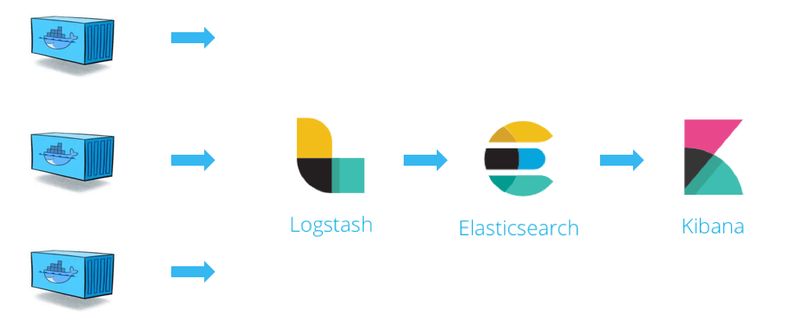
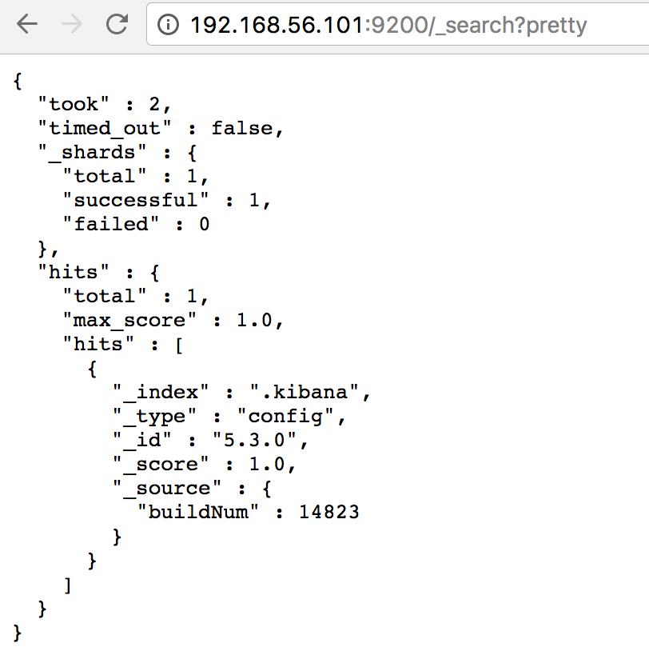

## ElasticStack  <!-- {docsify-ignore} -->


## 前言

在排查线上异常的过程中，查询日志总是必不可缺的一部分。现今大多采用的微服务架构，日志被分散在不同的机器上，使得日志的查询变得异常困难。工欲善其事，必先利其器。如果此时有一个统一的实时日志分析平台，那可谓是雪中送碳，必定能够提高我们排查线上问题的效率。

### 1. ELK 初识

ELK 是一个开源的实时日志分析平台，它主要由 Elasticsearch、Logstash 和 Kiabana 三部分组成。随着Beats的加入，原来的ELK体系变成了ElasticStack，即 ElasticStack =  ElasticSearch + Logstash + Kibana + Beats；

- 官网文档：https://www.elastic.co/cn/elasticsearch/features

#### 1.1 Logstash

Logstash 主要用于收集服务器日志，它是一个开源数据收集引擎，具有实时管道功能。Logstash 可以动态地将来自不同数据源的数据统一起来，并将数据标准化到您所选择的目的地。

Logstash 收集数据的过程主要分为以下三个部分：

- 输入：数据（包含但不限于日志）往往都是以不同的形式、格式存储在不同的系统中，而 Logstash 支持从多种数据源中收集数据（File、Syslog、MySQL、消息中间件等等）。
- 过滤器：实时解析和转换数据，识别已命名的字段以构建结构，并将它们转换成通用格式。
- 输出：Elasticsearch 并非存储的唯一选择，Logstash 提供很多输出选择。


#### 1.2 Elasticsearch

Elasticsearch （ES）是一个分布式的 Restful 风格的搜索和数据分析引擎，它具有以下特点：

- 查询：允许执行和合并多种类型的搜索 — 结构化、非结构化、地理位置、度量指标 — 搜索方式随心而变。
- 分析：Elasticsearch 聚合让您能够从大处着眼，探索数据的趋势和模式。
- 速度：很快，可以做到亿万级的数据，毫秒级返回。
- 可扩展性：可以在笔记本电脑上运行，也可以在承载了 PB 级数据的成百上千台服务器上运行。
- 弹性：运行在一个分布式的环境中，从设计之初就考虑到了这一点。
- 灵活性：具备多个案例场景。支持数字、文本、地理位置、结构化、非结构化，所有的数据类型都欢迎。


#### 1.3 Kibana

一个基于 JavaScript 的 Web 图形界面程序，专门用于可视化 Elasticsearch 的数据，Kibana 能够查询 Elasticsearch 并通过丰富的图表展示结果。用户可以创建 Dashboard 来监控系统的日志。

对于以上三个组件在 《ELK 协议栈介绍及体系结构》 一文中有具体介绍，这里不再赘述。

### 2. 日志处理流程

下图展示了 Docker 部署环境下典型的 ELK 日志处理流程：

1. 由 Logstash 从各个服务中采集日志并存放至 Elasticsearch 中
2. 然后再由 Kiabana 从 Elasticsearch 中查询日志并展示给终端用户。

> ELK  大致工作流程：

 

###  3. 环境准备

#### 3.1 docker通过ELK套件启动ELK

ELK 的部署方案可以非常灵活，在规模较大的生产系统中，ELK 有自己的集群，实现了高可用和负载均衡。我们的目标是在最短的时间内学习并实践 ELK，因此将采用最小部署方案：在容器中搭建 ELK。

```bash
## 用docker 直接启 打包好的镜像
docker run -p 5601:5601 -p 9200:9200 -p 5044:5044 -it --name elk sebp/elk
```

我们使用的是 `sebp/elk` 这个现成的 image，里面已经包含了整个 ELK stack。容器启动后 ELK 各组件将分别监听如下端口：

- 5601 - Kibana web 接口
- 9200 - Elasticsearch JSON 接口
- 5044 - Logstash 日志接收接口

> 先访问一下 Kibana http://[Host IP]:5601/ 看看效果。

  

当前 Kibana 没有可显示的数据，因为当前 Elasticsearch 还没有任何日志数据。

> 访问一下 Elasticsearch 的 JSON 接口 http://[Host IP]:9200/_search?pretty

 

确实，目前 Elasticsearch 没有与日志相关的 `index`。

接下来的工作就是将 Docker 的日志导入 ELK，我们下一节完成。

## ELK 实践

### 1. 实现方案

   

整个 ELK 的运行流程如下：

1. 在微服务（产生日志的服务）上部署一个 Logstash，作为 Shipper 角色，主要负责对所在机器上的服务产生的日志文件进行数据采集，并将消息推送到 Redis 消息队列。
2. 另用一台服务器部署一个 Indexer 角色的 Logstash，主要负责从 Redis 消息队列中读取数据，并在 Logstash 管道中经过 Filter 的解析和处理后输出到 Elasticsearch 集群中存储。
3. Elasticsearch 主副节点之间数据同步。
4. 单独一台服务器部署 Kibana 读取 Elasticsearch 中的日志数据并展示在 Web 页面。


相关文档

1. Bilibili黑马程序员的视频：[Elastic Stack（ELK）从入门到实践](https://www.bilibili.com/video/BV1iJ411c7Az)
2. [ELK 处理 Spring Boot 日志，妙！](https://mp.weixin.qq.com/s/i1qgONtrtaqHo0o0TcRFGA) 
3. [初探 ELK - 每天5分钟玩转 Docker 容器技术（89）](https://developer.aliyun.com/article/311394) 

