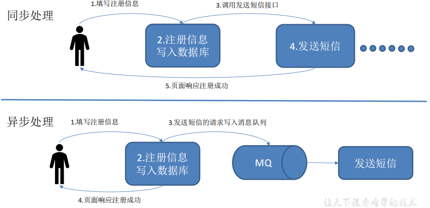
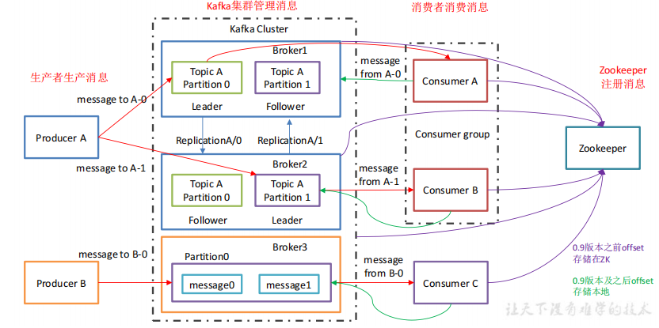
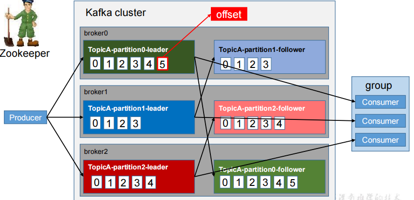
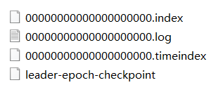
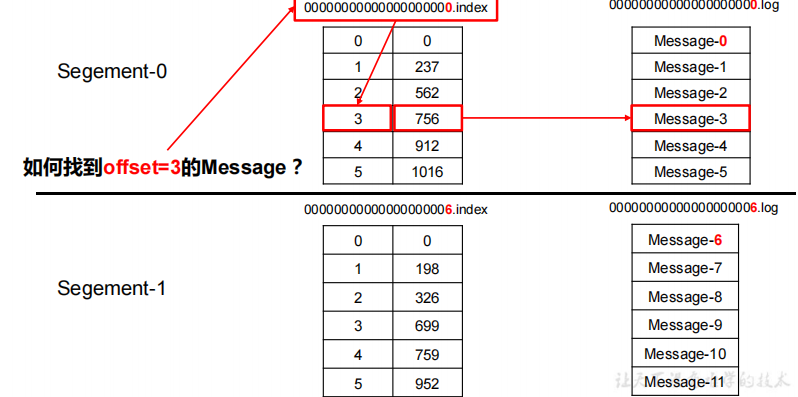

## 消息队列之 Kafka 

在大数据时代飞速发展的当下，Kafka凭借着**其高吞吐低延迟、高压缩性、持久性、可靠性、容错性以及高并发**的优势，解决了“在巨大数据下进行准确收集并分析”的难题，也受到了不少大厂以及工程师的青睐，

但是有大部分的人，在学习以及面试的过程中才发现自己并没有完全掌握其奥义，对于常见问题仍旧一知半解，这**主要是源码阅读的过程中存在问题：**

 （1）源文件太多，不知道重点；

 （2）源码量太大，无数次从开始到放弃；

 （3）方法不对，遇到“技巧性”编码就蒙圈；

 （4）不够体系化，不会将源文件归类阅读。

> 学习来源

- 文档
  - kafka官网：http://kafka.apache.org/documentation

- 视频
  - [尚硅谷—kafka 教程](https://www.bilibili.com/video/BV1a4411B7V9) 

## 1. kafka 初识

### 1.1 kafka 概述

kafka 是一个分布式的基于**发布/订阅模式** 的**消息队列**（Message Queue），主要应用于大数据实时处理领域。

#### 1.1.1  消息队列

> 传统消息队列的应用场景

- **异步处理** 



 

**使用消息队列的好处** 

- **解耦** ： 允许你独立的扩展或修改两边的处理过程，只要确保它遵守同样的接口约束。
- **可恢复性** ：系统的一部分组件失效时，不会影响到整个系统。消息队列降低了进程间的耦合度，所以即使一个处理消息的进程挂了，加入队列中的消息任然可以在系统恢复后被处理。
- **缓冲** ： 有助于控制和优化数据经过系统的速度，解决生产消息和消费消息的处理速度不一致的情况。
- **灵活性和峰值处理能力** ： 在访问量剧增的情况下，应用任然要继续发挥作用，但这样的突发流量并不常见。如果以能处理这类峰值访问为标准来投入资源随时待命，这无疑是巨大的浪费。使用消息队列能够使关键组件顶住突发的访问压力，而不会因为突发的超负荷请求而完全崩溃。
- **异步通信**：很多时候用户不想也不需要及时处理消息。消息队列提供了异步处理机制，允许用户把一个消息放入队列，但并不立即处理。想向队列中放入多少消息就放多少，然后在需要的时候再去处理它们。

> 消息队列的两种模式

- **点对点模式** （一对一，消费者主动拉取消息，消息收到后消息清除） 

消息生产者生产消息发送到 Queue中，然后消息消费者从Queue中取出并且消费消息。消息被消费以后，Queue中不再存储，所以消息消费者不可能消费已经被消费的消息，Queue 支持存在多个消费者，但是对一个消息而言，只会有一个消费者可以消费。


- **发布/订阅模式** （一对多，消费者消费数据后不会清除消息）

消息生产者（发布）将消息发布到 Topic中，同时有多个消息消费者（订阅）消费该消息。与点对点不同的是，发布到Topic 的消息会被所有订阅者消费。

 

#### 1.1.2 基础架构



- **Producer** : 消息生产者，就是向 kafka broker 发送消息的客户端。
- **Consumer** : 消息消费者，从 kafka broker 取消息的客户端。
- **ConsumerGroup（CG）** :  消费者组，由多个consumer组成，消费者组内每个消费者负责消费不同分区的数据，一个分区只能由一个组内消费者消费，消费者组之间互不影响，所有消费者都属于某个消费者组，即消费者组是个逻辑上的订阅者。
- **Broker** : 一台kafka 服务器就是一个broker，一个集群由多个Broker组成。一个broker可以容纳多个topic.
- **Topic：** 可以理解为一个队列，生产者和消费者都面向的是一个Topic.
- **Partition：** 为了实现扩展性，一个非常大的Topic 可以分布到多个Broker（服务器）上，一个Topic 可以分为多个partition，每个partition是一个有序队列。
- **Replica：** 副本，为保证集群中某个节点发生故障时，该节点的partition 数据不丢失且kafka任然能够继续工作，kafka提供了副本机制，一个Topic的每个分区都有若干个副本，一个Leader和若干个Follower.
- **Leader：** 每个分区副本的 "主"，生产者发送数据的对象，以及消费者消费消息的对象都是Leader.
- **Follower：** 每个分区多个副本的 “从节点” ，实时从Leader中同步数据，保持和Leader数据的同步。Leader发生故障时，某个Follower会成为新的Leader.

#### 1.1.3 Consumer

根据 KafkaConsumer 类上的注释上来看 KafkaConsumer 具有如下特征：

- 在 Kafka 中 KafkaConsumer 是线程不安全的。

- 消息偏移量与消费偏移量(消息消费进度)

  Kafka 为分区中的每一条消息维护一个偏移量，即消息偏移量。这个偏移量充当该分区内记录的唯一标识符。消费偏移量(消息消费进度)存储的是消费组当前的处理进度。消息消费进度的提交在 kafka 中可以定时自动提交也可以手动提交。手动提交可以调用 commitSync() 或 commitAsync 方法。

- 消费组 与 订阅关系

  多个消费者可以同属于一个消费组，消费组内的所有消费者共同消费主题下的所有消息。一个消费组可以订阅多个主题。

- 队列负载机制

  既然同一个消费组内的消费者共同承担主题下所有队列的消费，那他们如何进行分工呢？默认情况下采取平均分配，例如一个消费组有两个消费者c1、c2，一个 topic 的分区数为6，那 c1 会负责3个分区的消费，同样 c2 会负责另外3个分区的分配。

  那如果其中一个消费者宕机或新增一个消费者，那队列能动态调整吗？答案是会重新再次平衡，例如如果新增一个消费者 c3，则c1,c2,c3都会负责2个分区的消息消费。

- 消费者故障检测机制

  当通过 subscribe 方法订阅某些主题时，此时该消费者还未真正加入到订阅组，只有当 consumeer#poll 方法被调用后，并且会向 broker 定时发送心跳包，如果 broker 在 session.timeout.ms 时间内未收到心跳包，则 broker 会任务该消费者已宕机，会将其剔除，并触发消费端的分区重平衡。

  消费者也有可能遇到“活体锁”的情况，即它继续发送心跳，但没有任何进展。在这种情况下，为了防止消费者无限期地占用它的分区，可以使用max.poll.interval.ms 设置提供了一个活性检测机制。基本上，如果您调用轮询的频率低于配置的最大间隔，那么客户机将主动离开组，以便另一个消费者可以接管它的分区。当这种情况发生时,您可能会看到一个偏移提交失败(由调用{@link #commitSync()}抛出的{@link CommitFailedException}表示)。

- kafka 对 poll loop 行为的控制参数

  Kafka 提供了如下两个参数来控制 poll 的行为：

  ```bash
  ## 允许 两次调用 poll 方法的最大间隔，即设置每一批任务最大的处理时间。
  max.poll.interval.ms
  
  ## 每一次 poll 最大拉取的消息条数。
  max.poll.records
  ```

  对于消息处理时间不可预测的情况下上述两个参数可能不够用，那将如何是好呢？

  通常的建议将消息拉取与消息消费分开，一个线程负责 poll 消息，处理这些消息使用另外的线程，这里就需要手动提交消费进度。为了控制消息拉起的过快，您可能会需要用到 Consumer#pause(Collection) 方法，暂时停止向该分区拉起消息。RocketMQ 的推模式就是采用了这种策略。

#### 1.1.4 ConsumerGroup（CG）

> 导读：http://kafka.apache.org/documentation/#basic_ops_consumer_group

- RocketMQ：不同的消费组消费同一个Topic，可以同时收到消息

  位于不同consumerGroup组的 consumer端，可以同时消费相同topic的消息。若是消费组相同，则相当于负载，每条消息只能一个consumer端消费！


相关文章

1. [初始 Kafka Consumer 消费者](https://mp.weixin.qq.com/s/DaUcyjTqHIRhyWXb2v2ryg) 

### 1.2 kafka 快速入门

> 来源 CSDN：https://blog.csdn.net/qq_41893274/article/details/115562660

#### 1.2.1 docker 构建 Kafka 环境

**（1）搭建zookeeper环境** 

在centos7中，拉取zookeeper镜像，以及创建zookeeper容器:

```bash
## 拉取镜像
docker pull wurstmeister/zookeeper

## 创建zookeeper容器
docker run -d --name zookeeper -p 2181:2181 -t wurstmeister/zookeeper
```

**（2）搭建kafka环境** 

```bash
## 拉去镜像
docker pull wurstmeister/kafka

## 创建kafka容器
docker run -d --name kafka \
-p 9092:9092 \
-e KAFKA_BROKER_ID=0 \
-e KAFKA_ZOOKEEPER_CONNECT=wxw.plus:2181 \
-e KAFKA_ADVERTISED_LISTENERS=PLAINTEXT://wxw.plus:9092 \
-e KAFKA_LISTENERS=PLAINTEXT://0.0.0.0:9092 wurstmeister/kafka
```

**（3）创建主题** 

```bash
#进入容器
docker exec -it ${CONTAINER ID} /bin/bash
cd opt/bin
#单机方式：创建一个主题
bin/kafka-topics.sh --create --zookeeper zookeeper:2181 --replication-factor 1 --partitions 1 --topic mykafka
#运行一个生产者
bin/kafka-console-producer.sh --broker-list localhost:9092 --topic mykafka
#运行一个消费者
bin/kafka-console-consumer.sh --zookeeper zookeeper:2181 --topic mykafka --from-beginning
```

 

**（4）kafka 设置分区数量** 

```bash
#分区数量的作用：有多少分区就能负载多少个消费者，生产者会自动分配给分区数据，每个消费者只消费自己分区的数据，每个分区有自己独立的offset

#进入kafka容器
vi opt/kafka/config/server.properties
修改run.partitions=2

#退出容器
ctrl+p+q

#重启容器
docker restart kafka

#修改指定topic
./kafka-topics.sh --zookeeper localhost:2181 --alter --partitions 3 --topic topicname
```

**（5）搭建kafka 管理平台** 

- kafka-manager 项目地址：https://github.com/yahoo/kafka-manager

> kafka-manager是目前最受欢迎的kafka集群管理工具，最早由雅虎开源，用户可以在Web界面执行一些简单的集群管理操作。具体支持以下内容：

- 管理多个集群
- 轻松检查群集状态（主题，消费者，偏移，代理，副本分发，分区分发）=
- 运行首选副本选举
- 使用选项生成分区分配以选择要使用的代理
- 运行分区重新分配（基于生成的分配）
- 使用可选主题配置创建主题（0.8.1.1具有与0.8.2+不同的配置）
- 删除主题（仅支持0.8.2+并记住在代理配置中设置delete.topic.enable = true）
- 主题列表现在指示标记为删除的主题（仅支持0.8.2+）
- 批量生成多个主题的分区分配，并可选择要使用的代理
- 批量运行重新分配多个主题的分区
- 将分区添加到现有主题
- 更新现有主题的配置

在centos7 中，执行如下命令拉取镜像，创建对应容器，以及打开防火墙：

```bash
## 拉取Kafka-manager 管理平台镜像
docker pull sheepkiller/kafka-manager

## 启动管理平台容器 ##  注意防火墙端口
docker run -d --name kafka-manager --link zookeeper:zookeeper \
--link kafka01:kafka01 -p 9001:9000 --restart=always \
--env ZK_HOSTS=zookeeper:2181 \
sheepkiller/kafka-manager
```

>  访问Kafka-manager ：http://wxw.plus:9001/

 

> 来源

1. [Docker 搭建Kafka](https://www.cnblogs.com/angelyan/p/14445710.html ) 

#### 1.2.2 Linux 入门 Kafka 环境

> 来源：http://kafka.apache.org/quickstart

##### 1. 下载kafka

[下载](https://www.apache.org/dyn/closer.cgi?path=/kafka/2.8.0/kafka_2.13-2.8.0.tgz) 最新的Kafka版本并解压缩：

```bash
$ tar -xzf kafka_2.13-2.8.0.tgz
$ cd kafka_2.13-2.8.0
```

##### 2.启动kafka环境

注意：您的本地环境必须安装了Java 8+。运行以下命令以正确的顺序启动所有服务

```bash
# Start the ZooKeeper service
# Note: Soon, ZooKeeper will no longer be required by Apache Kafka.
$ bin/zookeeper-server-start.sh config/zookeeper.properties
```

打开另一个终端会话并运行：

```bash
# Start the Kafka broker service
$ bin/kafka-server-start.sh config/server.properties
```

成功启动所有服务后，您将运行并可以使用基本的Kafka环境。

##### 3.建立主题以存储事件

Kafka是一个分布式*事件流平台*，可让您跨多台计算机读取，写入，存储和处理 [*事件*](http://kafka.apache.org/documentation/#messages)（在文档中也称为*记录*或 *消息*）。

因此，在编写第一个事件之前，必须创建一个主题。打开另一个终端会话并运行：

```bash
$ bin/kafka-topics.sh --create --topic quickstart-events --bootstrap-server localhost:9092
```

Kafka的所有命令行工具都有其他选项：`kafka-topics.sh`不带任何参数的命令即可显示使用情况信息。例如，它还可以向您显示 [详细信息，例如](http://kafka.apache.org/documentation/#intro_topics) 新主题[的分区数](http://kafka.apache.org/documentation/#intro_topics)：

```bash
$ bin/kafka-topics.sh --describe --topic quickstart-events --bootstrap-server localhost:9092
Topic:quickstart-events  PartitionCount:1    ReplicationFactor:1 Configs:
    Topic: quickstart-events Partition: 0    Leader: 0   Replicas: 0 Isr: 0
```

##### 4. 生产消息

```bash
$ bin/kafka-console-producer.sh --topic quickstart-events --bootstrap-server localhost:9092
This is my first event
This is my second event
```

您可以随时停止生产者客户端`Ctrl-C`。

##### 5. 消费消息

```bash
$ bin/kafka-console-consumer.sh --topic quickstart-events --from-beginning --bootstrap-server localhost:9092
This is my first event
This is my second event
```

##### 6. 将数据作为事件流导入/导出

在诸如关系数据库或传统消息传递系统之类的现有系统中，您可能拥有大量数据，以及已经使用这些系统的许多应用程序。 [通过Kafka Connect](http://kafka.apache.org/documentation/#connect)，您可以连续地[将](http://kafka.apache.org/documentation/#connect)来自外部系统的数据导入Kafka，反之亦然。因此，将现有系统与Kafka集成非常容易。为了使此过程更加容易，有数百种此类连接器可供使用。

##### 7. Kafka Stream 处理事件

一旦将数据作为事件存储在Kafka中，就可以使用Java / Scala的[Kafka Streams](http://kafka.apache.org/documentation/streams)客户端库处理数据 。它允许您实现关键任务实时应用程序和微服务，其中输入和/或输出数据存储在Kafka主题中。Kafka Streams结合了在客户端编写和部署标准Java和Scala应用程序的简便性以及Kafka服务器端集群技术的优势，使这些应用程序具有高度可伸缩性，弹性，容错性和分布式性。该库支持一次处理，有状态操作和聚合，开窗，联接，基于事件时间的处理等等。

##### 8. 脏数据回收

如果您还想删除本地Kafka环境的任何数据，包括您在此过程中创建的所有事件，请运行以下命令：

```bash
$ rm -rf /tmp/kafka-logs /tmp/zookeeper
```

#### 1.2.3 server-properties配置

```
broker.id =0
每一个broker在集群中的唯一表示，不能重复，要求是正数。当该服务器的IP地址发生改变时，broker.id没有变化，则不会影响consumers的消息情况
log.dirs=/data/kafka-logs
kafka数据的存放地址，多个地址的话用逗号分割 /data/kafka-logs-1，/data/kafka-logs-2
port =9092
broker server服务端口
message.max.bytes =6525000
表示消息体的最大大小，单位是字节
num.network.threads =4
broker处理消息的最大线程数，一般情况下不需要去修改
num.io.threads =8
broker处理磁盘IO的线程数，数值应该大于你的硬盘数
background.threads =4
一些后台任务处理的线程数，例如过期消息文件的删除等，一般情况下不需要去做修改
queued.max.requests =500
等待IO线程处理的请求队列最大数，若是等待IO的请求超过这个数值，那么会停止接受外部消息，应该是一种自我保护机制。
host.name
broker的主机地址，若是设置了，那么会绑定到这个地址上，若是没有，会绑定到所有的接口上，并将其中之一发送到ZK，一般不设置
socket.send.buffer.bytes=100*1024
socket的发送缓冲区，socket的调优参数SO_SNDBUFF
socket.receive.buffer.bytes =100*1024
socket的接受缓冲区，socket的调优参数SO_RCVBUFF
socket.request.max.bytes =100*1024*1024
socket请求的最大数值，防止serverOOM，message.max.bytes必然要小于socket.request.max.bytes，会被topic创建时的指定参数覆盖
log.segment.bytes =1024*1024*1024
topic的分区是以一堆segment文件存储的，这个控制每个segment的大小，会被topic创建时的指定参数覆盖
log.roll.hours =24*7
这个参数会在日志segment没有达到log.segment.bytes设置的大小，也会强制新建一个segment会被 topic创建时的指定参数覆盖
log.cleanup.policy = delete
日志清理策略选择有：delete和compact主要针对过期数据的处理，或是日志文件达到限制的额度，会被 topic创建时的指定参数覆盖
log.retention.minutes=60*24 # 一天后删除
数据存储的最大时间超过这个时间会根据log.cleanup.policy设置的策略处理数据，也就是消费端能够多久去消费数据
log.retention.bytes和log.retention.minutes任意一个达到要求，都会执行删除，会被topic创建时的指定参数覆盖
log.retention.bytes=-1
topic每个分区的最大文件大小，一个topic的大小限制 = 分区数*log.retention.bytes。-1没有大小限log.retention.bytes和log.retention.minutes任意一个达到要求，都会执行删除，会被topic创建时的指定参数覆盖
log.retention.check.interval.ms=5minutes
文件大小检查的周期时间，是否处罚 log.cleanup.policy中设置的策略
log.cleaner.enable=false
是否开启日志压缩
log.cleaner.threads = 2
日志压缩运行的线程数
log.cleaner.io.max.bytes.per.second=None
日志压缩时候处理的最大大小
log.cleaner.dedupe.buffer.size=500*1024*1024
日志压缩去重时候的缓存空间，在空间允许的情况下，越大越好
log.cleaner.io.buffer.size=512*1024
日志清理时候用到的IO块大小一般不需要修改
log.cleaner.io.buffer.load.factor =0.9
日志清理中hash表的扩大因子一般不需要修改
log.cleaner.backoff.ms =15000
检查是否处罚日志清理的间隔
log.cleaner.min.cleanable.ratio=0.5
日志清理的频率控制，越大意味着更高效的清理，同时会存在一些空间上的浪费，会被topic创建时的指定参数覆盖
log.cleaner.delete.retention.ms =1day
对于压缩的日志保留的最长时间，也是客户端消费消息的最长时间，同log.retention.minutes的区别在于一个控制未压缩数据，一个控制压缩后的数据。会被topic创建时的指定参数覆盖
log.index.size.max.bytes =10*1024*1024
对于segment日志的索引文件大小限制，会被topic创建时的指定参数覆盖
log.index.interval.bytes =4096
当执行一个fetch操作后，需要一定的空间来扫描最近的offset大小，设置越大，代表扫描速度越快，但是也更好内存，一般情况下不需要搭理这个参数
log.flush.interval.messages=None
log文件”sync”到磁盘之前累积的消息条数,因为磁盘IO操作是一个慢操作,但又是一个”数据可靠性"的必要手段,所以此参数的设置,需要在"数据可靠性"与"性能"之间做必要的权衡.如果此值过大,将会导致每次"fsync"的时间较长(IO阻塞),如果此值过小,将会导致"fsync"的次数较多,这也意味着整体的client请求有一定的延迟.物理server故障,将会导致没有fsync的消息丢失.
log.flush.scheduler.interval.ms =3000
检查是否需要固化到硬盘的时间间隔
log.flush.interval.ms = None
仅仅通过interval来控制消息的磁盘写入时机,是不足的.此参数用于控制"fsync"的时间间隔,如果消息量始终没有达到阀值,但是离上一次磁盘同步的时间间隔达到阀值,也将触发.
log.delete.delay.ms =60000
文件在索引中清除后保留的时间一般不需要去修改
log.flush.offset.checkpoint.interval.ms =60000
控制上次固化硬盘的时间点，以便于数据恢复一般不需要去修改
auto.create.topics.enable =true
是否允许自动创建topic，若是false，就需要通过命令创建topic
default.replication.factor =1
是否允许自动创建topic，若是false，就需要通过命令创建topic
num.partitions =1
每个topic的分区个数，若是在topic创建时候没有指定的话会被topic创建时的指定参数覆盖
 
 
以下是kafka中Leader,replicas配置参数
 
controller.socket.timeout.ms =30000
partition leader与replicas之间通讯时,socket的超时时间
controller.message.queue.size=10
partition leader与replicas数据同步时,消息的队列尺寸
replica.lag.time.max.ms =10000
replicas响应partition leader的最长等待时间，若是超过这个时间，就将replicas列入ISR(in-sync replicas)，并认为它是死的，不会再加入管理中
replica.lag.max.messages =4000
如果follower落后与leader太多,将会认为此follower[或者说partition relicas]已经失效
##通常,在follower与leader通讯时,因为网络延迟或者链接断开,总会导致replicas中消息同步滞后
##如果消息之后太多,leader将认为此follower网络延迟较大或者消息吞吐能力有限,将会把此replicas迁移

##到其他follower中.

##在broker数量较少,或者网络不足的环境中,建议提高此值.
replica.socket.timeout.ms=30*1000
follower与leader之间的socket超时时间
replica.socket.receive.buffer.bytes=64*1024
leader复制时候的socket缓存大小
replica.fetch.max.bytes =1024*1024
replicas每次获取数据的最大大小
replica.fetch.wait.max.ms =500
replicas同leader之间通信的最大等待时间，失败了会重试
replica.fetch.min.bytes =1
fetch的最小数据尺寸,如果leader中尚未同步的数据不足此值,将会阻塞,直到满足条件
num.replica.fetchers=1
leader进行复制的线程数，增大这个数值会增加follower的IO
replica.high.watermark.checkpoint.interval.ms =5000
每个replica检查是否将最高水位进行固化的频率
controlled.shutdown.enable =false
是否允许控制器关闭broker ,若是设置为true,会关闭所有在这个broker上的leader，并转移到其他broker
controlled.shutdown.max.retries =3
控制器关闭的尝试次数
controlled.shutdown.retry.backoff.ms =5000
每次关闭尝试的时间间隔
leader.imbalance.per.broker.percentage =10
leader的不平衡比例，若是超过这个数值，会对分区进行重新的平衡
leader.imbalance.check.interval.seconds =300
检查leader是否不平衡的时间间隔
offset.metadata.max.bytes
客户端保留offset信息的最大空间大小

kafka中zookeeper参数配置
 
zookeeper.connect = localhost:2181
zookeeper集群的地址，可以是多个，多个之间用逗号分割 hostname1:port1,hostname2:port2,hostname3:port3
zookeeper.session.timeout.ms=6000
ZooKeeper的最大超时时间，就是心跳的间隔，若是没有反映，那么认为已经死了，不易过大
zookeeper.connection.timeout.ms =6000
ZooKeeper的连接超时时间
zookeeper.sync.time.ms =2000
```

### 1.3 应用场景

> 概述

- **消息系统**：发布-订阅，解耦生产者和消费者，缓存消息等
- **存储系统**：充当中间数据的存储系统，是一种高性能、低延迟、具备日志存储、备份和传播功能的分布式文件系统。
- **日志收集**：一个公司可以用Kafka可以收集各种服务的log，通过kafka以统一接口服务的方式开放给各种consumer，例如hadoop、Hbase、Solr等
- **运营指标**：用来记录运营监控数据。包括收集各种分布式应用的数据，生产各种操作的集中反馈，比如报警和报告。
- **用户活动跟踪**：Kafka经常被用来记录web用户或者app用户的各种活动，如浏览网页、搜索、点击等活动，这些活动信息被各个服务器发布到kafka的topic中，然后订阅者通过订阅这些topic来做实时的监控分析，或者装载到hadoop、数据仓库中做离线分析和挖掘。
- **流处理**：比如spark streaming, Strom和 Flink


## 2. kafka 核心知识

### 2.1 kafka 工作流程

 


Kafka 中消息是以 **topic** 进行分类的，生产者生产消息，消费者消费消息，都是面向 Topic 的。

topic 是逻辑上的概念，而partition 是物理上的概念，每个partition 对应一个log文件，该log文件中存储的就是 Producer 生产的数据，Producer 生产的数据会不断的追加到该log 文件的末端，且每条数据都有自己的offset。消费者组中的每个消费者都会实时记录自己消费到了哪个 offset,以便出错恢复时，从上次的位置继续消费。

### 2.2 kafka 文件存储机制

> 导读：http://kafka.apache.org/documentation/#majordesignelements

 

由于生产者生产的消息会不断追加到log文件末尾，为防止log文件过大导致数据定位效率低下，kafka采取了**分片**和**索引**机制，将每个partition 分为多个 Segment。每个segment对应两个文件

- .index文件
- .log 文件

这些文件位于一个文件夹下，该文件夹的命名规则为：topic名称+分区序号。例如：

- wxw_topic_callback_dev-0 中 wxw_topic_callback_dev 是topic, 0 是分区号
- 后面的 .index 和 .log 是文件

    

index和log 是以当前segment的第一条消息的 offset命名，下图是 index和log文件结构示意图：

 

- index 文件存储大量的索引信息，
- .log文件存储大量的数据

索引文件中的元数据指向对应数据文件中 Message 的物理偏移地址。

### 2.3 kafka 重平衡(reblance)机制

Kafka的重平衡其实包含两个非常重要的阶段：消费组加入阶段(PreparingRebalance)、队列负载(CompletingRebalance).

- PreparingRebalance：此阶段是消费者陆续加入消费组，该组第一个加入的消费者被推举为Leader，当该组所有已知memberId的消费者全部加入后，状态驱动到CompletingRebalance。

- CompletingRebalance：PreparingRebalance状态完成后，如果消费者被推举为Leader，**Leader会采用该消费组中都支持的队列负载算法进行队列分布**，然后将结果回报给组协调器；如果消费者的角色为非Leader，会向组协调器发送同步队列分区算法，组协调器会将Leader节点分配的结果分配给消费者。

**消费组如果在进行重平衡操作，将会暂停消息消费**，**频繁的重平衡会导致队列消息消费的速度受到极大的影响**。

> 与重平衡相关的消费端参数：

```bash
# 两次poll方法调用的最大间隔时间，单位毫秒，默认为5分钟。如果消费端在该间隔内没有发起poll操作，该消费者将被剔除，触发重平衡，将该消费者分配的队列分配给其他消费者。
max.poll.interval.ms

# 消费者与broker的心跳超时时间,默认10s，broker在指定时间内没有收到心跳请求，broker端将会将该消费者移出，并触发重平衡。
session.timeout.ms

# 心跳间隔时间，消费者会以该频率向broker发送心跳，默认为3s，主要是确保session不会失
heartbeat.interval.ms
```


## 3. kafka 开发手册


