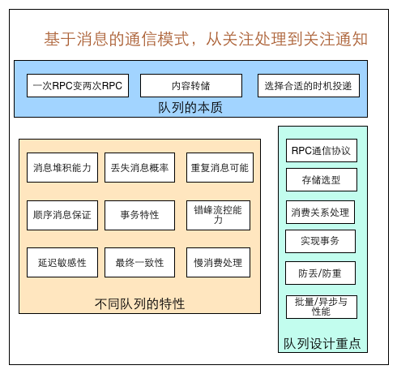
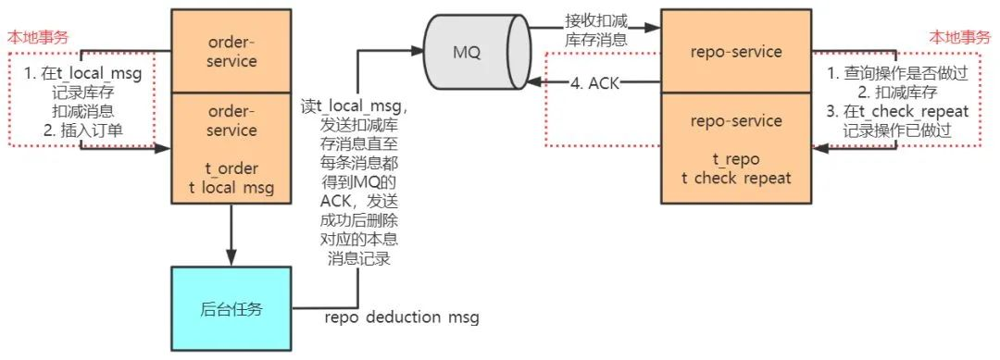

### 消息队列设计精要


 

### 消息队列总结

1. [消息队列设计精要](https://zhuanlan.zhihu.com/p/21649950) ——来自《美团技术团队》 
2. [消息队列梳理](https://www.cnblogs.com/qdhxhz/category/1221076.html) ——来自《博客园》 

### 场景分析

#### 1. 基于RocketMQ实现分布式事务

> 来源：https://www.cnblogs.com/qdhxhz/p/11191399.html

 

- 半消息一致未确认，消息回查（1. 先查看当前事务;  2. 再查看本地事务）
- 消费失败则重试，重试失败则可能是bug，需要人工干预

#### 2. 基于RabbitMQ 实现分布式事务

> 来源：https://blog.csdn.net/qq_41893274/article/details/105654507

 

**案例分析**：

利用消息中间件如 rabbitMQ 来实现分布式下单及库存扣减过程的最终一致性。对这幅图做以下说明：

**order-service 中，**

```java
在 t_order 表添加订单记录 &&
在 t_local_msg 添加对应的扣减库存消息
```

**这两个过程要在一个事务中完成，保证过程的原子性。同样，repo-service 中，**

```java
检查本次扣库存操作是否已经执行过 &&
 
执行扣减库存如果本次扣减操作没有执行过 &&
 
写判重表 &&
 
向 MQ sever 反馈消息消费完成 ACK
```

这四个过程也要在一个事务中完成，保证过程的原子性。

1. order-service 中有一个后台程序，源源不断地把消息表中的消息传送给消息中间件，成功后则删除消息表中对应的消息。如果失败了，也会不断尝试重传。由于存在网络 2 将军问题，即当 order-service 发送给消息中间件的消息网络超时时，这时候消息中间件可能收到了消息但响应 ACK 失败，也可能没收到，order-service 会再次发送该消息，直至消息中间件响应 ACK 成功，这样可能发生消息的重复发送，不过没关系，只要保证消息不丢失，不乱序就行，后面 repo-service 会做去重处理。
2. 消息中间件向 repo-service 推送 repo_deduction_msg，repo-service 成功处理完成后会向中间件响应 ACK，消息中间件收到这个 ACK 才认为 repo-service 成功处理了这条消息，否则会重复推送该消息。但是有这样的情形：repo-service 成功处理了消息，向中间件发送的 ACK 在网络传输中由于网络故障丢失了，导致中间件没有收到 ACK 重新推送了该消息。这也要靠 repo-service 的消息去重特性来避免消息重复消费。
3. 在 1）和 2）中提到了两种导致 repo-service 重复收到消息的原因，一是生产者重复生产，二是中间件重传。为了实现业务的幂等性，repo-service 中维护了一张判重表，这张表中记录了被成功处理的消息的 id。repo-service 每次接收到新的消息都先判断消息是否被成功处理过，若是的话不再重复处理。

通过这种设计，实现了消息在发送方不丢失，消息在接收方不被重复消费，联合起来就是消息不漏不重，严格实现了 order-service 和 repo-service 的两个数据库中数据的最终一致性。

基于消息中间件的最终一致性全局事务方案是互联网公司在高并发场景中探索出的一种创新型应用模式，利用 MQ 实现微服务之间的异步调用、解耦合和流量削峰，支持全局事务的高并发，并保证分布式数据记录的最终一致性。


