### ClickHouse

### 1. ClickHouse 初识

ClickHouse是一个用于联机分析(OLAP)的列式数据库管理系统(DBMS)

- 官方文档：https://clickhouse.tech/docs/zh/

#### 1.1 Clickhouse 环境构建

##### 1.1.1 docker构建clickhouse

docker环境搭建好之后，利用docker安装clickhouse比较简单，clickhouse官方提供了默认的镜像，直接使用即可。

- 官方文档参考：https://hub.docker.com/r/yandex/clickhouse-server/

**1.1.1 拉取clickhouse的docker镜像** 

```dockerfile
docker pull yandex/clickhouse-server
docker pull yandex/clickhouse-client
```

**1.1.2 启动 clickhouse-server**  

```dockerfile
# 方式一：启动服务（临时启动、获取配置文件）
docker run --rm -d --name clickhouse-server --ulimit nofile=262144:262144 -p 8123:8123 -p 9009:9009 -p 9000:9000 \
yandex/clickhouse-server:latest

# 方式二：如果想指定目录启动，这里以clickhouse-test-server命令为例，可以随意写
 mkdir -p /apps/clickhouse/clickhouse-test-db       ## 创建数据文件目录
# 使用以下路径启动，在外只能访问clickhouse提供的默认9000端口，只能通过clickhouse-client连接server
docker run -d --name clickhouse-test-server -p 8123:8123 -p 9009:9009 -p 9000:9000 --ulimit nofile=262144:262144 --volume=/spps/clickhouse/clickhouse-test-db:/var/lib/clickhouse yandex/clickhouse-server
```

**1.1.3 启动 client 并连接 clickhouse-client** 

>  docker启动clickhouse-client

```bash
## 第一次运行并启动
docker run -it --rm --link clickhouse-test-server:clickhouse-server yandex/clickhouse-client --host clickhouse-server
## 第二次启动容器使用以下命令即可
docker start [containerId]

## 第二次启动之后进入容器使用以下命令即可
# 如果退出了容器，如何继续玩耍？重新执行下面这个命令即可。
docker run -it --rm --link clickhouse-test-server:clickhouse-server yandex/clickhouse-client --host clickhouse-server 
```

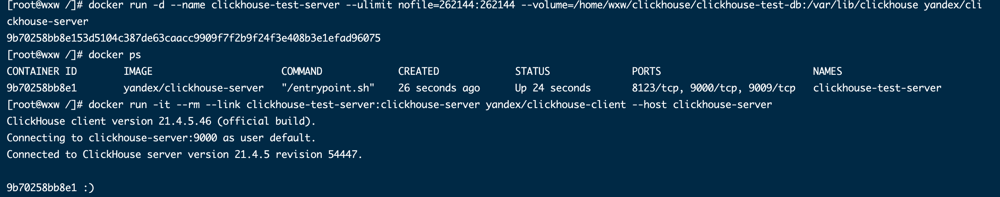

> 查询默认的表

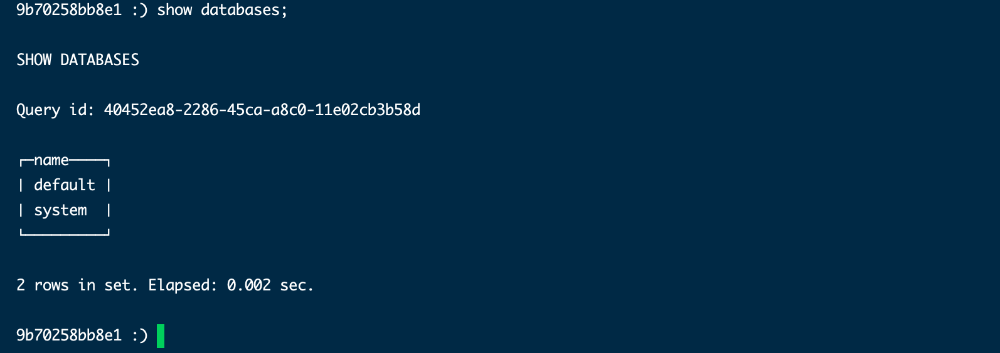 

**1.1.4 复制容器中的配置文件到宿主机** 

提前建好文件夹，不然会报错，/apps/clickhouse/config 是本机新建的目录，方便管理。该目录可以任意

```powershell
# 新建存储clickhouse配置的目录
mkdir -p /apps/clickhouse/config

# 复制配置并与宿主机关联
docker cp clickhouse-server:/etc/clickhouse-server/config.xml /apps/clickhouse/config/config.xml
docker cp clickhouse-server:/etc/clickhouse-server/users.xml /apps/clickhouse/config/users.xml
```

**1.1.5 停止ClickHouse 服务** 

```powershell
# 停止服务指令
docker stop 【容器ID/容器名称】

# example
docker stop 6a10d8d7bf36
# 或者 （格式：docker stop 容器名<第3步输入--name的值>)
docker stop clickhouse-server
```

##### 1.1.2 clickhouse 修改密码

- 配置文件位置(根据1.1.4 中复制指定的位置)

  ```powershell
  /apps/clickhouse/config/users.xml
  ```

- 修改前

  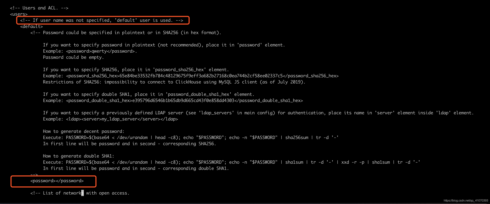

- 在password标签中加上密码123456，可以使用"加密密码",修改完成保存退出

##### 1.1.3 重启使服务生效

```powershell
## 启动方式一：指定目录启动 clickhouse-test-server
docker run -d --name=clickhouse-server -p 8123:8123 -p 9009:9009 -p 9000:9000 --ulimit nofile=262144:262144 \
--volume=/spps/clickhouse/clickhouse-test-db:/var/lib/clickhouse yandex/clickhouse-server

## 启动方式二：挂载（用此可能不当）数据、日志、配置文件到指定目录
docker run -d --name=clickhouse-server \
-p 8123:8123 -p 9009:9009 -p 9000:9000 \
--ulimit nofile=262144:262144 \
-v /Users/vick/data/programs/docker/clickhouse/data:/var/lib/clickhouse:rw \
-v /Users/vick/data/programs/docker/clickhouse/conf/config.xml:/etc/clickhouse-server/config.xml \
-v /Users/vick/data/programs/docker/clickhouse/conf/users.xml:/etc/clickhouse-server/users.xml \
-v /Users/vick/data/programs/docker/clickhouse/log:/var/log/clickhouse-server:rw \
yandex/clickhouse-server:latest
```

##### 1.1.4 启动clickhouse 客户端

```powershell
## 启动客户端
docker run -it --rm --link clickhouse-server:clickhouse-server yandex/clickhouse-client --host clickhouse-server --password=123456

# 启动客户端相关指令
clickhouse-client
    --host, -h     	：服务端host名称，默认 localhost
    --port         	：连接端口，默认9000
    --user, -u     	：用户名，默认 default
    --password     	：密码，默认空
    --query, -q    	：非交互模式下的查询语句
    --database, -d 	：默认当前操作的数据库，默认default
    --multiline, -m ：允许多行语句查询，在clickhouse中默认回车即为sql结束，可使用该参数多行输入
    --format, -f		：使用指定的默认格式输出结果      csv,以逗号分隔
    --time, -t			：非交互模式下会打印查询执行的时间
    --stacktrace		：出现异常会打印堆栈跟踪信息
    --config-file		：配置文件名称
```

#### 1.2 ClickHouse 使用指南

> 来源：https://clickhouse.tech/docs/zh/getting-started/tutorial/

##### **1.2.1 ClickHouse 单机使用**  

- 常用脚本

```sql
show database;    --- 查看所有数据库
use [数据库名称]    --- 使用某个数据库
show tables;      --- 查看该库下的所有表
desc [TableName]  --- 查看表结构
```

- 创建数据库

  ```sql
  CREATE DATABASE IF NOT EXISTS wxw
  ```

- 创建表

  ```sql
  CREATE TABLE wxw.user_info( \
      `user_id` UInt64,       \
      `user_name` String,     \
      `age` Int16,            \
      `birthday` DateTime,    \
      `create_date` Date)     \
  ENGINE = MergeTree()        \
  PARTITION BY toYYYYMM(create_date) \
  ORDER BY (create_date, birthday, intHash32(user_id)) \
  SAMPLE BY intHash32(user_id)
  ```

- 导入数据

  数据导入到ClickHouse是通过[INSERT INTO](https://clickhouse.tech/docs/zh/sql-reference/statements/insert-into/)方式完成的，查询类似许多SQL数据库。然而，数据通常是在一个提供[支持序列化格式](https://clickhouse.tech/docs/zh/interfaces/formats/)而不是`VALUES`子句（也支持）。

  ```sql
  INSERT INTO wxw.hits_v1 FORMAT TSV --max_insert_block_size=100000 < hits_v1.tsv
  INSERT INTO table VALUES < data.txt
  ```

- 统计表的数量

  ```sql
  SELECT COUNT(*) from wxw.user_info;
  ```

- 表的参数设置

  **数据导入时设置：**ClickHouse有很多[要调整的设置](https://clickhouse.tech/docs/zh/operations/settings/)在控制台客户端中指定它们的一种方法是通过参数，就像我们看到上面语句中的`--max_insert_block_size`。找出可用的设置、含义及其默认值的最简单方法是查询`system.settings` 表:

  ```sql
  SELECT name, value, changed, description FROM system.settings WHERE name LIKE '%max_insert_b%' FORMAT TSV
  ```

  **数据导入后的设置**：您也可以[OPTIMIZE](https://clickhouse.tech/docs/zh/sql-reference/statements/misc/#misc_operations-optimize)导入后的表。使用MergeTree-family引擎配置的表总是在后台合并数据部分以优化数据存储（或至少检查是否有意义）。 这些查询强制表引擎立即进行存储优化，而不是稍后一段时间执行:

  ```sql
  OPTIMIZE TABLE wxw.user_info FINAL
  ```

- 查看创建表的语句

  ```sql
   show create user_info;
  ```

  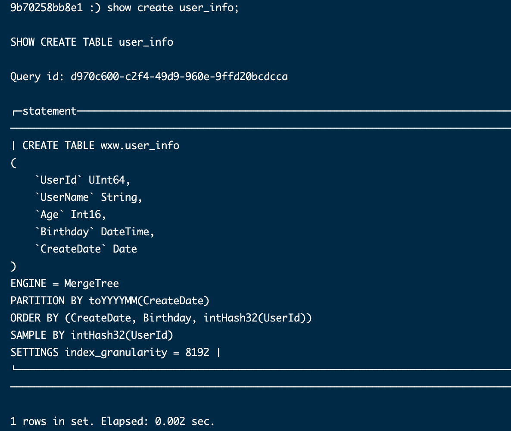 

##### **1.2.2 ClickHouse 更新和删除**  

- **更新方式一：** 直接使用sql 更新

按照官方的说明，update/delete 的使用场景是一次更新大量数据，也就是where条件筛选的结果应该是一大片数据。

```sql
-- 一次更新一天的数据。
alter table test update status=1 where status=0 and day='2020-04-01'，

-- 能否一次只更新一条数据呢？
alter table test update pv=110 where id=100
```

频繁的这种操作，可能会对服务造成压力。这很容易理解，如上文提到：

- 更新的单位是分区，如果只更新一条数据，那么需要重建一个分区；
- 如果更新100条数据，而这100条可能落在3个分区上，则需重建3个分区；

相对来说一次更新一批数据的整体效率远高于一次更新一行。

- **更新方式二：** 使用`ReplacingMergeTree`引擎来变相更新

这个更新的缺点是：

- 只会合并同一个分区的相同主键数据
- 写入新数据覆盖更新时，不会马上执行（需要在后台排队），需要强制进行分区合并后才可以看到更新后的结果

```sql
-- 在上述表中插入数据
insert into replac_merge_test values ('A000', 'code1', now()),('A000', 'code1', '2020-07-28 21:30:00'), ('A001', 'code1', now()), ('A001', 'code2', '2020-07-28 21:30:00'), ('A0002', 'code2', now());

-- 查询当前数据
select * from replac_merge_test;
┌─id────┬─code──┬─────────create_time─┐
│ A000  │ code1 │ 2020-07-28 21:23:48 │
│ A000  │ code1 │ 2020-07-28 21:30:00 │
│ A0002 │ code2 │ 2020-07-28 21:23:48 │
│ A001  │ code1 │ 2020-07-28 21:23:48 │
│ A001  │ code2 │ 2020-07-28 21:30:00 │
└───────┴───────┴─────────────────────┘

-- 强制进行分区合并
optimize table replac_merge_test FINAL;

-- 再次查询数据
select * from replac_merge_test;
┌─id────┬─code──┬─────────create_time─┐
│ A000  │ code1 │ 2020-07-28 21:30:00 │
│ A0002 │ code2 │ 2020-07-28 21:23:48 │
│ A001  │ code1 │ 2020-07-28 21:23:48 │
│ A001  │ code2 │ 2020-07-28 21:30:00 │
└───────┴───────┴─────────────────────┘
```

相关资料：

- https://blog.csdn.net/lcl_xiaowugui/article/details/107772580

#### 1.3 ClickHouse 特性

clickhouse是一个完全的分布式列式存储数据库

**引擎的作用：** 

- 决定数据存储的位置
- 决定数据组织结构
- 决定是否分块、是否索引、是否持久化、是否可以支持并发读写、是否支持副本、是否支持索引
- 是否支持分布式

##### 1.3.1 ReplacingMergeTree 引擎

**（1）ReplacingMergeTree的作用** 

ClickHouse中最常用也是最基础的表引擎为MergeTree，在它的功能基础上添加特定功能就构成了MergeTree系列引擎。MergeTree支持主键，但主键主要用来缩小查询范围，且不具备唯一性约束，可以正常写入相同主键的数据。但在一些情况下，可能需要表中没有主键重复的数据。ReplacingMergeTree就是在MergeTree的基础上加入了去重的功能，但它仅会在合并分区时，去删除重复的数据，写入相同数据时并不会引发异常。

该引擎在数据合并的时候会对主键进行去重，合并会在后台执行，执行时间未知，因此你无法预先做出计划，当然你也可以调用OPTIMIZE语句来发起合并计划，但是这种方式是不推荐的，因为OPTIMIZE语句会引发大量的读写请求。

（**2）案例演示** 

ReplacingMergeTree引擎创建规范为：`ENGINE = ReplacingMergeTree([ver])`

其中ver为选填参数，它需要指定一个UInt8/UInt16、Date或DateTime类型的字段，它决定了数据去重时所用的算法，

- 如果没有设置该参数，合并时保留分组内的最后一条数据；
- 如果指定了该参数，则保留ver字段取值最大的那一行。

> 不指定ver参数

```sql
-- 创建未指定ver参数ReplacintMergeTree引擎的表
CREATE TABLE replac_merge_test
(
    `id` String, 
    `code` String, 
    `create_time` DateTime
)
ENGINE = ReplacingMergeTree()
PARTITION BY toYYYYMM(create_time)
PRIMARY KEY id
ORDER BY (id, code)

-- ReplacingMergeTree会根据ORDER BY所声明的表达式去重

-- 在上述表中插入数据
insert into replac_merge_test values
('A000', 'code1', now()),
('A000', 'code1', '2020-07-28 21:30:00'), 
('A001', 'code1', now()),
('A001', 'code2', '2020-07-28 21:30:00'),
('A0002', 'code2', now());

-- 查询当前数据
select * from replac_merge_test;
┌─id────┬─code──┬─────────create_time─┐
│ A000  │ code1 │ 2020-07-28 21:23:48 │
│ A000  │ code1 │ 2020-07-28 21:30:00 │
│ A0002 │ code2 │ 2020-07-28 21:23:48 │
│ A001  │ code1 │ 2020-07-28 21:23:48 │
│ A001  │ code2 │ 2020-07-28 21:30:00 │
└───────┴───────┴─────────────────────┘

-- 强制进行分区合并
optimize table replac_merge_test FINAL;

-- 再次查询数据
select * from replac_merge_test;
┌─id────┬─code──┬─────────create_time─┐
│ A000  │ code1 │ 2020-07-28 21:30:00 │
│ A0002 │ code2 │ 2020-07-28 21:23:48 │
│ A001  │ code1 │ 2020-07-28 21:23:48 │
│ A001  │ code2 │ 2020-07-28 21:30:00 │
└───────┴───────┴─────────────────────┘

```

通过上面示例可以看到，id、code相同的字段’A000’,'code1’被去重剩余一条数据，由于创建表时没有设置ver参数，故保留分组内的最后一条数据(create_time字段)

```sql
-- 再次使用insert插入一条数据
insert into replac_merge_test values ('A001', 'code1', '2020-07-28 21:30:00');

-- 查询表中数据
select * from replac_merge_test;
┌─id────┬─code──┬─────────create_time─┐
│ A000  │ code1 │ 2020-07-28 21:30:00 │
│ A0002 │ code2 │ 2020-07-28 21:23:48 │
│ A001  │ code1 │ 2020-07-28 21:23:48 │
│ A001  │ code2 │ 2020-07-28 21:30:00 │
└───────┴───────┴─────────────────────┘
┌─id───┬─code──┬─────────create_time─┐
│ A001 │ code1 │ 2020-07-28 21:30:00 │
└──────┴───────┴─────────────────────┘
```

可以看到，再次插入重复数据时，查询仍然会存在重复。在ClickHouse中，默认一条insert插入的数据为同一个数据分区，不同insert插入的数据为不同的分区，所以ReplacingMergeTree是以分区为单位进行去重的，也就是说:

- 只有在相同的数据分区内，重复数据才可以被删除掉。
- 只有数据合并完成后，才可以使用引擎特性进行去重。

> 指定ver参数

```sql
-- 创建指定ver参数ReplacingMergeTree引擎的表
CREATE TABLE replac_merge_ver_test
(
    `id` String, 
    `code` String, 
    `create_time` DateTime
)
ENGINE = ReplacingMergeTree(create_time)
PARTITION BY toYYYYMM(create_time)
PRIMARY KEY id
ORDER BY (id, code)

-- 插入测试数据
insert into replac_merge_ver_test values('A000', 'code1', '2020-07-10 21:35:30'),('A000', 'code1', '2020-07-15 21:35:30'),('A000', 'code1', '2020-07-05 21:35:30'),('A000', 'code1', '2020-06-05 21:35:30');

-- 查询数据
select * from replac_merge_ver_test;
┌─id───┬─code──┬─────────create_time─┐
│ A000 │ code1 │ 2020-06-05 21:35:30 │
└──────┴───────┴─────────────────────┘
┌─id───┬─code──┬─────────create_time─┐
│ A000 │ code1 │ 2020-07-10 21:35:30 │
│ A000 │ code1 │ 2020-07-15 21:35:30 │
│ A000 │ code1 │ 2020-07-05 21:35:30 │
└──────┴───────┴─────────────────────┘

-- 强制进行分区合并
optimize table replac_merge_ver_test FINAL;

-- 查询数据
select * from replac_merge_ver_test;
┌─id───┬─code──┬─────────create_time─┐
│ A000 │ code1 │ 2020-07-15 21:35:30 │
└──────┴───────┴─────────────────────┘
┌─id───┬─code──┬─────────create_time─┐
│ A000 │ code1 │ 2020-06-05 21:35:30 │
└──────┴───────┴─────────────────────┘
```

由于上述创建表是以create_time的年月来进行分区的，可以看出不同的数据分区，ReplacingMergeTree并不会进行去重，并且在相同数据分区内，指定ver参数后，会保留同一组数据内create_time时间最大的那一行数据。

**（3）总结** 

- 使用ORDER BY排序键，作为判断数据是否重复的唯一键
- 只有在合并分区时，才会触发数据的去重逻辑
- 删除重复数据，是以数据分区为单位。同一个数据分区的重复数据才会被删除，不同数据分区的重复数据仍会保留
- 在进行数据去重时，由于已经基于ORDER BY排序，所以可以找到相邻的重复数据
- 数据去重策略为：
  - 若指定了ver参数，则会保留重复数据中，ver字段最大的那一行
  - 若未指定ver参数，则会保留重复数据中最末的那一行数据

相关文章

- https://blog.csdn.net/lcl_xiaowugui/article/details/107772580

### 2.ClickHouse SQL语法

> 来源：https://clickhouse.tech/docs/zh/sql-reference/syntax/

#### 2.1 SQL 数据类型

ClickHouse 支持整数、浮点数、字符型、日期、枚举值和数组等多种数据类型。

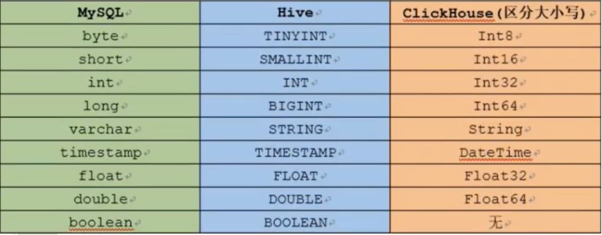 

类型列表

| 类别                 | 名称                                | 类型标识                                     | 数据范围或描述                                  |
| :------------------- | :---------------------------------- | :------------------------------------------- | :---------------------------------------------- |
| 整数                 | 单字节整数                          | Int8                                         | -128 - 127                                      |
| 双字节整数           | Int16                               | -32768 - 32767                               |                                                 |
| 四字节整数           | Int32                               | -2147483648 - 2147483647                     |                                                 |
| 八字节整数           | Int64                               | -9223372036854775808 - 9223372036854775807   |                                                 |
| 无符号单字节整数     | UInt8                               | 0 - 255                                      |                                                 |
| 无符号双字节整数     | UInt16                              | 0 - 65535                                    |                                                 |
| 无符号四字节整数     | UInt32                              | 0 - 4294967295                               |                                                 |
| 无符号八字节整数     | UInt64                              | 0 - 18446744073709551615                     |                                                 |
| 浮点数               | 单精度浮点数                        | Float32                                      | 浮点数有效数字6 - 7位                           |
| 双精度浮点数         | Float64                             | 浮点数有效数字15 - 16位                      |                                                 |
| 自定义浮点           | Decimal32(S)                        | 浮点数有效数字 S，S 取值范围1 - 9            |                                                 |
| Decimal64(S)         | 浮点数有效数字 S，S 取值范围10 - 18 |                                              |                                                 |
| Decimal128(S)        | 浮点数有效数字 S，S 取值范围19 - 38 |                                              |                                                 |
| 字符型               | 任意长度字符                        | String                                       | 不限定字符串长度                                |
| 固定长度字符         | FixedString(N)                      | 固定长度的字符串                             |                                                 |
| 唯一标识 UUID 类型   | UUID                                | 通过内置函数 generateUUIDv4 生成唯一的标志符 |                                                 |
| 时间类型             | 日期类型                            | Date                                         | 存储年月日时间，格式 yyyy-MM-dd                 |
| 时间戳类型（秒级）   | DateTime(timezone)                  | Unix 时间戳，精确到秒                        |                                                 |
| 时间戳类型（自定义） | DateTime(precision, timezone)       | 可以指定时间精度                             |                                                 |
| 枚举类型             | 单字节枚举                          | Enum8                                        | 提供-128 - 127共256个值                         |
| 双字节枚举           | Enum16                              | 提供-32768 - 32767 共65536个值               |                                                 |
| 数组类型             | 数组类型                            | Array(T)                                     | 表示由 T 类型组成的数组类型，不推荐使用嵌套数组 |

- 可以使用 UInt8 来存储布尔类型，将取值限制为0或1。[其他数据类型官方文档](https://clickhouse.tech/) 

##### 2.1.1 枚举类型应用

- 存储某站点用户的性别信息。

```sql
CREATE TABLE user (uid Int16, name String, gender Enum('male'=1, 'female'=2)) ENGINE=Memory;

INSERT INTO user VALUES (1, 'Gary', 'male'), (2,'Jaco', 'female');

# 查询数据
SELECT * FROM user;

┌─uid─┬─name─┬─gender─┐
│   1 │ Gary │ male   │
│   2 │ Jaco │ female │
└─────┴──────┴────────┘

# 使用CAST函数查询枚举整数值
SELECT uid, name, CAST(gender, 'Int8') FROM user;

┌─uid─┬─name─┬─CAST(gender, 'Int8')─┐
│   1 │ Gary │                    1 │
│   2 │ Jaco │                    2 │
└─────┴──────┴──────────────────────┘
```

##### 2.1.2 数组类型应用

- 某站点记录每天登录用户的 ID，用来分析活跃用户。

```sql
CREATE TABLE userloginlog (logindate Date, uids Array(String)) ENGINE=TinyLog;

INSERT INTO userloginlog VALUES ('2020-01-02', ['Gary', 'Jaco']), ('2020-02-03', ['Jaco', 'Sammie']);

# 查询结果
SELECT * FROM userloginlog;

┌──logindate─┬─uids──────────────┐
│ 2020-01-02 │ ['Gary','Jaco']   │
│ 2020-02-03 │ ['Jaco','Sammie'] │
└────────────┴───────────────────┘
```

#### 2.3 创建数据库或表

ClickHouse 使用 CREATE 语句来完成数据库或表的创建。

```sql
CREATE TABLE [IF NOT EXISTS] [db.]table_name [ON CLUSTER cluster]
(
    name1 [type1] [DEFAULT|MATERIALIZED|ALIAS expr1] [TTL expr1],
    name2 [type2] [DEFAULT|MATERIALIZED|ALIAS expr2] [TTL expr2],
    ...
    INDEX index_name1 expr1 TYPE type1(...) GRANULARITY value1,
    INDEX index_name2 expr2 TYPE type2(...) GRANULARITY value2
) ENGINE = MergeTree()
ORDER BY expr
[PARTITION BY expr]
[PRIMARY KEY expr]
[SAMPLE BY expr]
[TTL expr 
    [DELETE|TO DISK 'xxx'|TO VOLUME 'xxx' [, ...] ]
    [WHERE conditions] 
    [GROUP BY key_expr [SET v1 = aggr_func(v1) [, v2 = aggr_func(v2) ...]] ] ] 
[SETTINGS name=value, ...]
```

> 参数说明

- ENGINE:引擎名和参数。
  - ver:版本列，类型可以是UInt*,Date,或者DateTime，可选择的参数。 合并的时候ReplacingMergeTree从相同的主键中选择一行保留，如果ver列未指定，则选择最后一条，如果ver列已指定，则选择ver值最大的版本。
- PARTITION BY：分区键。要按月分区，可以使用表达式 toYYYYMM(date_column) ，这里的 date_column 是一个 Date 类型的列。这里该分区名格式会是 "YYYYMM" 这样。
- ORDER BY： 表的排序键。可以是一组列或任意的表达式。 例如: ORDER BY (CounterID, EventDate) 。
- SAMPLE BY ： 抽样的表达式。如果要用抽样表达式，主键中必须包含这个表达式。例如： SAMPLE BY intHash32(UserID) ORDER BY (CounterID, EventDate, intHash32(UserID)) 。
- SETTINGS ： 影响 MergeTree 性能的额外参数：
  - index_granularity 索引粒度。即索引中相邻『标记』间的数据行数。默认值，8192 。该列表中所有可用的参数可以从这里查看 MergeTreeSettings.h 。
  - use_minimalistic_part_header_in_zookeeper — 数据片段头在 ZooKeeper 中的存储方式。如果设置了 use_minimalistic_part_header_in_zookeeper=1，ZooKeeper 会存储更少的数据。
  - min_merge_bytes_to_use_direct_io 使用直接 I/O 来操作磁盘的合并操作时要求的最小数据量。合并数据片段时，ClickHouse 会计算要被合并的所有数据的总存储空间。如果大小超过了 min_merge_bytes_to_use_direct_io 设置的字节数，则 ClickHouse 将使用直接 I/O 接口（O_DIRECT 选项）对磁盘读写。如果设置 min_merge_bytes_to_use_direct_io = 0 ，则会禁用直接 I/O。默认值：10 * 1024 * 1024 * 1024 字节。

数据库和表都支持本地和分布式两种，分布式方式的创建有以下两种方法：

- 在每台 clickhouse-server 所在机器上都执行创建语句。
- 使用 ON CLUSTER 子句，配合 ZooKeeper 服务完成创建动作。

当使用 clickhouse-client 进行查询时，若在 A 机上查询 B 机的本地表则会报错“Table xxx doesn't exist..”。若希望集群内的所有机器都能查询某张表，推荐使用分布式表。

相关官方文档 [CREATE Queries](https://clickhouse.tech/docs/en/query_language/create/)。

##### 2.3.1 update/delete建表

```sql
## 创建库
create database test on cluster default_cluster;

## 创建表
CREATE TABLE test.datagen on cluster default_cluster(
  `id` Int32,
  `name` Nullable(String),
  `age` Nullable(Int32),
  `weight` Nullable(Float64),
  `Sign` Int8
) ENGINE = ReplicatedCollapsingMergeTree('/clickhouse/tables/{layer}-{shard}/test/datagen', '{replica}', Sign) 
  ORDER BY id SETTINGS replicated_deduplication_window = 0; //关闭去重
 
## 创建分布式表
CREATE TABLE test.datagen_all  ON CLUSTER default_cluster as test.datagen 
ENGINE = Distributed(default_cluster, test, datagen, id);
```

##### 2.3.2 仅含插入的建表

```sql
create database test on cluster default_cluster;

## 建表
CREATE TABLE test.datagen on cluster default_cluster (
  `id` Int32,
  `name` Nullable(String),
  `age` Nullable(Int32),
  `weight` Nullable(Float64) 
) ENGINE = ReplicatedMergeTree('/clickhouse/tables/{layer}-{shard}/test/datagen', '{replica}') 
 ORDER BY id SETTINGS  replicated_deduplication_window = 0;
 
## 分布式建表
CREATE TABLE test.datagen_all  ON CLUSTER default_cluster as test.datagen 
ENGINE = Distributed(default_cluster, test, datagen, id);
```

> 出自：https://cloud.tencent.com/document/product/849/53389

##### 2.3.3 建表注意事项

- 建索引的正确方式，开始字段不应该是区分度很高的字段，如果是唯一的，那么索引效果非常差，也不能找区分度特别差的，应该找区分度中等，这就涉及到你的setting的值，如果比较大，可以找区分度稍差的列，如果比较小，找区分度稍大的列作为索引

#### 2.4 查询

ClickHouse 使用 SELECT 语句来完成数据查询。

```sql
SELECT [DISTINCT] expr_list
[FROM [db.]table | (subquery) | table_function] [FINAL]
[SAMPLE sample_coeff]
[GLOBAL] [ANY|ALL] [INNER|LEFT|RIGHT|FULL|CROSS] [OUTER] JOIN (subquery)|table USING columns_list
[PREWHERE expr]
[WHERE expr]
[GROUP BY expr_list] [WITH TOTALS]
[HAVING expr]
[ORDER BY expr_list]
[LIMIT [offset_value, ]n BY columns]
[LIMIT [n, ]m]
[UNION ALL ...]
[INTO OUTFILE filename]
[FORMAT format]
```

相关官方文档 [SELECT Queries Syntax](https://clickhouse.tech/docs/en/query_language/select/)。

##### 2.4.1 show 语句

展现数据库、处理列表、表、字典等信息。

```sql
## 查看数据库列表
SHOW DATABASES [INTO OUTFILE filename] [FORMAT format]

## 查看处理器列表
SHOW PROCESSLIST [INTO OUTFILE filename] [FORMAT format]

## 查看表信息
SHOW [TEMPORARY] TABLES [{FROM | IN} <db>] [LIKE '<pattern>' | WHERE expr] [LIMIT <N>] [INTO OUTFILE <filename>] [FORMAT <format>]

## 查看表结构
SHOW DICTIONARIES [FROM <db>] [LIKE '<pattern>'] [LIMIT <N>] [INTO OUTFILE <filename>] [FORMAT <format>]
```

相关官方文档 [SHOW Queries](https://clickhouse.tech/docs/en/query_language/show/)。

##### 2.4.2 查看表的元数据信息

```sql
## 查看表元数据信息
DESC|DESCRIBE TABLE [db.]table [INTO OUTFILE filename] [FORMAT format]
```

##### 2.4.3  Array 语句

- 数组类型 ` Array(T)  ` 是强数据类型（只能放一种数据类型）

```sql
select array('a1','a2');
```


- 案例一 ：查看数据

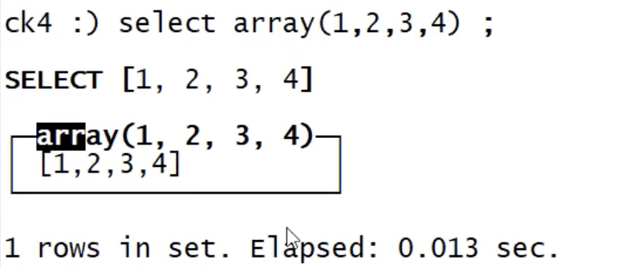 

-  案例二：查看array中的元素‘

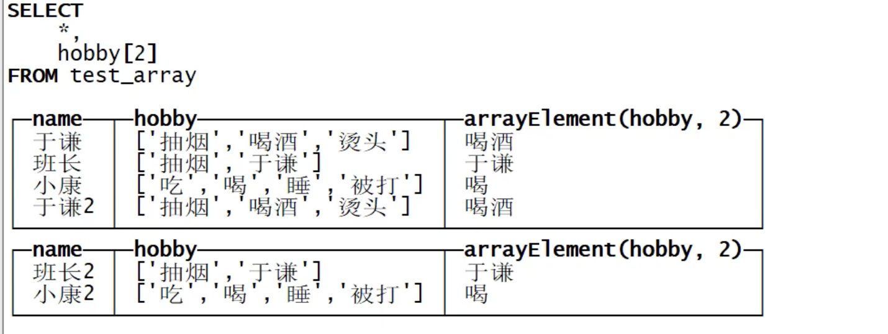 

- 案例三：数据拼接

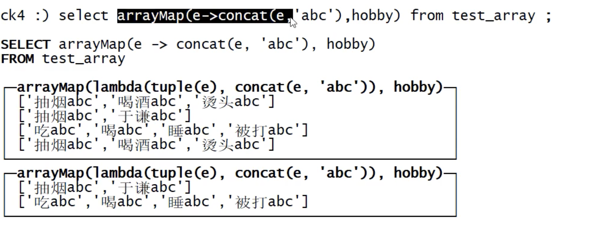 

相关官方文档 [array-join](https://clickhouse.tech/docs/zh/sql-reference/statements/select/array-join/) 

##### 2.4.4 聚合查询-groupby


相关资料

- [聚合查询-groupby](http://saoniuhuo.com/article/detail-87.html) 

#### 2.5 批量写入

ClickHouse 使用 INSERT INTO 语句来完成数据写入。

```sql
INSERT INTO [db.]table [(c1, c2, c3)] VALUES (v11, v12, v13), (v21, v22, v23), ...
INSERT INTO [db.]table [(c1, c2, c3)] SELECT ...
```

相关官方文档 [INSERT](https://clickhouse.tech/docs/en/query_language/insert_into/)。

#### 2.6 删除数据

ClickHouse 使用 DROP 或 TRUNCATE 语句来完成数据删除。

- DROP 删除元数据和数据，TRUNCATE 只删除数据。

```sql
## 删除数据库
DROP DATABASE [IF EXISTS] db [ON CLUSTER cluster]

## 删除表 同时删除元数据（）
DROP [TEMPORARY] TABLE [IF EXISTS] [db.]name [ON CLUSTER cluster]

## 删除表 只删除表数据
TRUNCATE TABLE [IF EXISTS] [db.]name [ON CLUSTER cluster]
```

#### 2.7 修改表数据

ClickHouse 使用 ALTER 语句来完成表结构修改。

```sql
# 对表的列操作
ALTER TABLE [db].name [ON CLUSTER cluster] ADD COLUMN [IF NOT EXISTS] name [type] [default_expr] [codec] [AFTER name_after]
ALTER TABLE [db].name [ON CLUSTER cluster] DROP COLUMN [IF EXISTS] name
ALTER TABLE [db].name [ON CLUSTER cluster] CLEAR COLUMN [IF EXISTS] name IN PARTITION partition_name
ALTER TABLE [db].name [ON CLUSTER cluster] COMMENT COLUMN [IF EXISTS] name 'comment'
ALTER TABLE [db].name [ON CLUSTER cluster] MODIFY COLUMN [IF EXISTS] name [type] [default_expr] [TTL]

# 对表的分区操作
ALTER TABLE table_name DETACH PARTITION partition_expr
ALTER TABLE table_name DROP PARTITION partition_expr
ALTER TABLE table_name CLEAR INDEX index_name IN PARTITION partition_expr

# 对表的属性操作
ALTER TABLE table-name MODIFY TTL ttl-expression
```

相关官方文档 [ALTER](https://clickhouse.tech/docs/en/query_language/alter/)。

##### 2.7.1 添加列

```sql
# 添加带聚合函数的列
alter table [db].name add column name [type] [default_expr] [codec] [AFTER name_after]
```


#### 2.8 函数

ClickHouse 函数有两种类型：常规函数和聚合函数，区别是常规函数可以通过一行数据产生结果，聚合函数则需要一组数据来产生结果。

##### 2.8.1 常规函数

- 算数函数：数据表中各字段参与数学计算函数。

  | 函数名称              | 用途               | 使用场景                             |
  | :-------------------- | :----------------- | :----------------------------------- |
  | plus(a, b), a + b     | 计算两个字段的和   | plus(table.field1, table.field2)     |
  | minus(a, b), a - b    | 计算两个字段的差   | minus(table.field1, table.field2)    |
  | multiply(a, b), a * b | 计算两个字段的积   | multiply(table.field1, table.field2) |
  | divide(a, b), a / b   | 计算两个字段的商   | divide(table.field1, table.field2)   |
  | modulo(a, b), a % b   | 计算两个字段的余数 | modulo(table.field1, table.field2)   |
  | abs(a)                | 取绝对值           | abs(table.field1)                    |
  | negate(a)             | 取相反数           | negate(table.field1)                 |

- 比较函数

  | 函数名称 | 用途             | 使用场景              |
  | :------- | :--------------- | :-------------------- |
  | =, ==    | 判断是否相等     | table.field1 = value  |
  | !=, <>   | 判断是否不相等   | table.field1 != value |
  | >        | 判断是否大于     | table.field1 > value  |
  | >=       | 判断是否大于等于 | table.field1 >= value |
  | <        | 判断是否小于     | table.field1 < value  |
  | <=       | 判断是否小于等于 | table.field1 <= value |

- 类型转换函数：转换函数可能会溢出，溢出后的数字与C语言中数据类型保持一致。

  | 函数名称                    | 用途                                     | 使用场景                       |
  | :-------------------------- | :--------------------------------------- | :----------------------------- |
  | toInt(8\|16\|32\|64)        | 将字符型转化为整数型                     | toInt8('128') 结果为-127       |
  | toUInt(8\|16\|32\|64)       | 将字符型转化为无符号整数型               | toUInt8('128') 结果为128       |
  | toInt(8\|16\|32\|64)OrZero  | 将整数字符型转化为整数型，异常时返回0    | toInt8OrZero('a') 结果为0      |
  | toUInt(8\|16\|32\|64)OrZero | 将整数字符型转化为整数型，异常时返回0    | toUInt8OrZero('a') 结果为0     |
  | toInt(8\|16\|32\|64)OrNull  | 将整数字符型转化为整数型，异常时返回NULL | toInt8OrNull('a') 结果为 NULL  |
  | toUInt(8\|16\|32\|64)OrNull | 将整数字符型转化为整数型，异常时返回NULL | toUInt8OrNull('a') 结果为 NULL |

- 浮点数类型或日期类型也有上述类似的函数。

  - 相关官方文档 [Type Conversion Functions](https://clickhouse.tech/docs/en/query_language/functions/type_conversion_functions/)。

- 日期函数
  - 相关官方文档 [Functions for working with dates and times](https://clickhouse.tech/docs/en/query_language/functions/date_time_functions/)。

- 字符串函数
  - 相关官方文档 [Functions for working with strings](https://clickhouse.tech/docs/en/query_language/functions/string_functions/)。
- JSON处理函数
  - 相关官方文档 [Functions for working with JSON](https://clickhouse.tech/docs/en/query_language/functions/json_functions/)。

##### 2.8.2 聚合函数

| 函数名称                                                     | 用途                                                         | 使用场景                                                     |
| :----------------------------------------------------------- | :----------------------------------------------------------- | :----------------------------------------------------------- |
| count                                                        | 统计行数或者非 NULL 值个数                                   | count(expr)、COUNT(DISTINCT expr)、count()、count(*)         |
| [any(x)](https://clickhouse.tech/docs/en/query_language/agg_functions/reference/#agg_function-any) | 返回第一个遇到的值，结果不确定                               | any(column)                                                  |
| [anyHeavy(x)](https://clickhouse.tech/docs/en/query_language/agg_functions/reference/#anyheavyx) | 基于 heavy hitters 算法，返回经常出现的值。通常结果不确定    | anyHeavy(column)                                             |
| [anyLast(x)](https://clickhouse.tech/docs/en/query_language/agg_functions/reference/#anylastx) | 返回最后一个遇到的值，结果不确定                             | anyLast(column)                                              |
| [groupBitAnd](https://clickhouse.tech/docs/en/query_language/agg_functions/reference/#groupbitand) | 按位与                                                       | groupBitAnd(expr)                                            |
| [groupBitOr](https://clickhouse.tech/docs/en/query_language/agg_functions/reference/#groupbitor) | 按位或                                                       | groupBitOr(expr)                                             |
| [groupBitXor](https://clickhouse.tech/docs/en/query_language/agg_functions/reference/#groupbitxor) | 按位异或                                                     | groupBitXor(expr)                                            |
| [groupBitmap](https://clickhouse.tech/docs/en/query_language/agg_functions/reference/#groupbitmap) | 求基数（cardinality）                                        | groupBitmap(expr)                                            |
| [min(x)](https://clickhouse.tech/docs/en/query_language/agg_functions/reference/#agg_function-min) | 求最小值                                                     | min(column)                                                  |
| [max(x)](https://clickhouse.tech/docs/en/query_language/agg_functions/reference/#agg_function-max) | 求最大值                                                     | max(x)                                                       |
| [argMin(arg, val)](https://clickhouse.tech/docs/en/query_language/agg_functions/reference/#agg-function-argmin) | 返回 val 最小值行的 arg 的值                                 | argMin(c1, c2)                                               |
| [argMax(arg, val)](https://clickhouse.tech/docs/en/query_language/agg_functions/reference/#agg-function-argmax) | 返回 val 最大值行的 arg 的值                                 | argMax(c1, c2)                                               |
| [sum(x)](https://clickhouse.tech/docs/en/query_language/agg_functions/reference/#agg_function-sum) | 求和                                                         | sum(x)                                                       |
| [sumWithOverflow(x)](https://clickhouse.tech/docs/en/query_language/agg_functions/reference/#sumwithoverflowx) | 求和，结果溢出则返回错误                                     | sumWithOverflow(x)                                           |
| [sumMap(key, value)](https://clickhouse.tech/docs/en/query_language/agg_functions/reference/#agg_functions-summap) | 用于数组类型，对相同 key 的 value 求和，返回两个数组的 tuple，第一个为排序后的 key，第二个为对应 key 的 value 之和 | -                                                            |
| [skewPop](https://clickhouse.tech/docs/en/query_language/agg_functions/reference/#skewpop) | 求 [偏度](https://en.wikipedia.org/wiki/Skewness)            | skewPop(expr)                                                |
| [skewSamp](https://clickhouse.tech/docs/en/query_language/agg_functions/reference/#skewsamp) | 求 [样本偏度](https://en.wikipedia.org/wiki/Skewness)        | skewSamp(expr)                                               |
| [kurtPop](https://clickhouse.tech/docs/en/query_language/agg_functions/reference/#kurtpop) | 求 [峰度](https://en.wikipedia.org/wiki/Kurtosis)            | kurtPop(expr)                                                |
| [kurtSamp](https://clickhouse.tech/docs/en/query_language/agg_functions/reference/#kurtsamp) | 求 [样本峰度](https://en.wikipedia.org/wiki/Kurtosis)        | kurtSamp(expr)                                               |
| [timeSeriesGroupSum(uid, timestamp, value)](https://clickhouse.tech/docs/en/query_language/agg_functions/reference/#agg-function-timeseriesgroupsum) | 对 uid 分组的时间序列对应时间点求和，求和前缺失的时间点线性插值 | -                                                            |
| [timeSeriesGroupRateSum(uid, ts, val)](https://clickhouse.tech/docs/en/query_language/agg_functions/reference/#agg-function-timeseriesgroupratesum) | 对 uid 分组的时间序列对应时间点的变化率求和                  | -                                                            |
| [avg(x)](https://clickhouse.tech/docs/en/query_language/agg_functions/reference/#agg_function-avg) | 求平均值                                                     | -                                                            |
| [uniq](https://clickhouse.tech/docs/en/query_language/agg_functions/reference/#agg_function-uniq) | 计算不同值的近似个数                                         | uniq(x[, ...])                                               |
| [uniqCombined](https://clickhouse.tech/docs/en/query_language/agg_functions/reference/#agg_function-uniqcombined) | 计算不同值的近似个数，相比uniq消耗的内存更少，精度更高，但是性能稍差 | uniqCombined(HLL_precision)(x[, ...])、uniqCombined(x[, ...]) |
| [uniqCombined64](https://clickhouse.tech/docs/en/query_language/agg_functions/reference/#agg_function-uniqcombined64) | uniqCombined 的 64bit 版本，结果溢出的可能性降低             | -                                                            |
| [uniqHLL12](https://clickhouse.tech/docs/en/query_language/agg_functions/reference/#agg_function-uniqhll12) | 计算不同值的近似个数，不建议使用。请用 uniq、uniqCombined    | -                                                            |
| [uniqExact](https://clickhouse.tech/docs/en/query_language/agg_functions/reference/#agg_function-uniqexact) | 计算不同值的精确个数                                         | uniqExact(x[, ...])                                          |
| [groupArray(x), groupArray(max_size)(x)](https://clickhouse.tech/docs/en/query_language/agg_functions/reference/#agg_function-grouparray) | 返回 x 取值的数组，数组大小可由 max_size 指定                | -                                                            |
| [groupArrayInsertAt(value, position)](https://clickhouse.tech/docs/en/query_language/agg_functions/reference/#grouparrayinsertatvalue-position) | 在数组的指定位置 position 插入值 value                       | -                                                            |
| [groupArrayMovingSum](https://clickhouse.tech/docs/en/query_language/agg_functions/reference/#agg_function-grouparraymovingsum) | -                                                            | -                                                            |
| [groupArrayMovingAvg](https://clickhouse.tech/docs/en/query_language/agg_functions/reference/#agg_function-grouparraymovingavg) | -                                                            | -                                                            |
| [groupUniqArray(x), groupUniqArray(max_size)(x)](https://clickhouse.tech/docs/en/query_language/agg_functions/reference/#groupuniqarrayx-groupuniqarraymax-sizex) | -                                                            | -                                                            |
| [quantile](https://clickhouse.tech/docs/en/query_language/agg_functions/reference/#quantile) | -                                                            | -                                                            |
| [quantileDeterministic](https://clickhouse.tech/docs/en/query_language/agg_functions/reference/#quantiledeterministic) | -                                                            | -                                                            |
| [quantileExact](https://clickhouse.tech/docs/en/query_language/agg_functions/reference/#quantileexact) | -                                                            | -                                                            |
| [quantileExactWeighted](https://clickhouse.tech/docs/en/query_language/agg_functions/reference/#quantileexactweighted) | -                                                            | -                                                            |
| [quantileTiming](https://clickhouse.tech/docs/en/query_language/agg_functions/reference/#quantiletiming) | -                                                            | -                                                            |
| [quantileTimingWeighted](https://clickhouse.tech/docs/en/query_language/agg_functions/reference/#quantiletimingweighted) | -                                                            | -                                                            |
| [quantileTDigest](https://clickhouse.tech/docs/en/query_language/agg_functions/reference/#quantiletdigest) | -                                                            | -                                                            |
| [quantileTDigestWeighted](https://clickhouse.tech/docs/en/query_language/agg_functions/reference/#quantiletdigestweighted) | -                                                            | -                                                            |
| [median](https://clickhouse.tech/docs/en/query_language/agg_functions/reference/#median) | -                                                            | -                                                            |
| [quantiles(level1, level2, …)(x)](https://clickhouse.tech/docs/en/query_language/agg_functions/reference/#quantiles) | -                                                            | -                                                            |
| [varSamp(x)](https://clickhouse.tech/docs/en/query_language/agg_functions/reference/#varsampx) | -                                                            | -                                                            |
| [varPop(x)](https://clickhouse.tech/docs/en/query_language/agg_functions/reference/#varpopx) | -                                                            | -                                                            |
| [stddevSamp(x)](https://clickhouse.tech/docs/en/query_language/agg_functions/reference/#stddevsampx) | -                                                            | -                                                            |
| [stddevPop(x)](https://clickhouse.tech/docs/en/query_language/agg_functions/reference/#stddevpopx) | -                                                            | -                                                            |
| [topK(N)(x)](https://clickhouse.tech/docs/en/query_language/agg_functions/reference/#topknx) | -                                                            | -                                                            |
| [topKWeighted](https://clickhouse.tech/docs/en/query_language/agg_functions/reference/#topkweighted) | -                                                            | -                                                            |
| [covarSamp(x, y)](https://clickhouse.tech/docs/en/query_language/agg_functions/reference/#covarsampx-y) | -                                                            | -                                                            |
| [covarPop(x, y)](https://clickhouse.tech/docs/en/query_language/agg_functions/reference/#covarpopx-y) | -                                                            | -                                                            |
| [corr(x, y)](https://clickhouse.tech/docs/en/query_language/agg_functions/reference/#corrx-y) | -                                                            | -                                                            |
| [categoricalInformationValue](https://clickhouse.tech/docs/en/query_language/agg_functions/reference/#categoricalinformationvalue) | -                                                            | -                                                            |
| [simpleLinearRegression](https://clickhouse.tech/docs/en/query_language/agg_functions/reference/#simplelinearregression) | -                                                            | -                                                            |
| [stochasticLinearRegression](https://clickhouse.tech/docs/en/query_language/agg_functions/reference/#agg_functions-stochasticlinearregression) | -                                                            | -                                                            |
| [stochasticLogisticRegression](https://clickhouse.tech/docs/en/query_language/agg_functions/reference/#agg_functions-stochasticlogisticregression) | -                                                            | -                                                            |
| [groupBitmapAnd](https://clickhouse.tech/docs/en/query_language/agg_functions/reference/#groupbitmapand) | -                                                            | -                                                            |
| [groupBitmapOr](https://clickhouse.tech/docs/en/query_language/agg_functions/reference/#groupbitmapor) | -                                                            | -                                                            |
| [groupBitmapXor](https://clickhouse.tech/docs/en/query_language/agg_functions/reference/#groupbitmapxor) | -                                                            | -                                                            |

 案例分析一：

```sql
1. 普通的分组:
Clickhouse> select database,table,count(1) from system.parts where database in ('datasets','system') group by database,table order by database ;
 
SELECT 
    database,
    table,
    count(1)
FROM system.parts
WHERE database IN ('datasets', 'system')
GROUP BY 
    database,
    table
ORDER BY database ASC
 
┌─database─┬─table────────────┬─count(1)─┐
│ datasets │ hits_v1          │        1 │
│ datasets │ visits_v1        │        1 │
│ system   │ query_thread_log │       28 │
│ system   │ trace_log_0      │        2 │
│ system   │ metric_log_0     │        5 │
│ system   │ part_log         │        7 │
│ system   │ metric_log       │       85 │
│ system   │ query_log        │       25 │
│ system   │ text_log         │      130 │
│ system   │ trace_log        │      133 │
└──────────┴──────────────────┴──────────┘
 
10 rows in set. Elapsed: 0.004 sec. 
 
在某些场合下可以借助于any，max，min等聚合函数查询聚合键之外的信息：
Clickhouse> select database,table,count(1),any(rows) from system.parts where database in ('datasets','system') group by database,table order by database ;
 
SELECT 
    database,
    table,
    count(1),
    any(rows)
FROM system.parts
WHERE database IN ('datasets', 'system')
GROUP BY 
    database,
    table
ORDER BY database ASC
 
┌─database─┬─table────────────┬─count(1)─┬─any(rows)─┐
│ datasets │ hits_v1          │        1 │   8873898 │
│ datasets │ visits_v1        │        1 │   1676861 │
│ system   │ query_thread_log │       23 │      1080 │
│ system   │ trace_log_0      │        2 │      1042 │
│ system   │ metric_log_0     │        5 │    172299 │
│ system   │ part_log         │        7 │        11 │
│ system   │ metric_log       │       79 │    112469 │
│ system   │ query_log        │       20 │      1039 │
│ system   │ text_log         │      134 │    490972 │
│ system   │ trace_log        │      135 │     25044 │
└──────────┴──────────────────┴──────────┴───────────┘
 
10 rows in set. Elapsed: 0.005 sec. 
 
当聚合查询内存在null值则会讲NULL算作一个特殊值处理：
Clickhouse> select arrayJoin([10,20,20,30,null,null,NULL]) as a group by a;
 
SELECT arrayJoin([10, 20, 20, 30, NULL, NULL, NULL]) AS a
GROUP BY a
 
┌────a─┐
│   10 │
│   20 │
│ ᴺᵁᴸᴸ │
│   30 │
└──────┘
 
4 rows in set. Elapsed: 0.002 sec. 
 
 
2.with rollup:
 
Clickhouse> select database,table,count(1) from system.parts where database in ('datasets','system') group by database,table with rollup order by database ;
 
SELECT 
    database,
    table,
    count(1)
FROM system.parts
WHERE database IN ('datasets', 'system')
GROUP BY 
    database,
    table
    WITH ROLLUP
ORDER BY database ASC
 
┌─database─┬─table────────────┬─count(1)─┐
│          │                  │      401 │
│ datasets │                  │        2 │
│ datasets │ hits_v1          │        1 │
│ datasets │ visits_v1        │        1 │
│ system   │                  │      399 │
│ system   │ query_thread_log │       20 │
│ system   │ trace_log_0      │        2 │
│ system   │ metric_log_0     │        5 │
│ system   │ part_log         │       10 │
│ system   │ metric_log       │       81 │
│ system   │ query_log        │       16 │
│ system   │ text_log         │      132 │
│ system   │ trace_log        │      133 │
└──────────┴──────────────────┴──────────┘
 
13 rows in set. Elapsed: 0.004 sec. 
 
 
3.with cube
Clickhouse> select database,table,count(1) from system.parts where database in ('datasets','system') group by database,table with cube order by database ;
 
SELECT 
    database,
    table,
    count(1)
FROM system.parts
WHERE database IN ('datasets', 'system')
GROUP BY 
    database,
    table
    WITH CUBE
ORDER BY database ASC
 
┌─database─┬─table────────────┬─count(1)─┐
│          │                  │      400 │
│          │ metric_log       │       82 │
│          │ trace_log        │      135 │
│          │ query_log        │       17 │
│          │ part_log         │       10 │
│          │ trace_log_0      │        2 │
│          │ text_log         │      132 │
│          │ visits_v1        │        1 │
│          │ query_thread_log │       15 │
│          │ metric_log_0     │        5 │
│          │ hits_v1          │        1 │
│ datasets │                  │        2 │
│ datasets │ hits_v1          │        1 │
│ datasets │ visits_v1        │        1 │
│ system   │                  │      398 │
│ system   │ query_thread_log │       15 │
│ system   │ trace_log_0      │        2 │
│ system   │ metric_log_0     │        5 │
│ system   │ part_log         │       10 │
│ system   │ metric_log       │       82 │
│ system   │ query_log        │       17 │
│ system   │ text_log         │      132 │
│ system   │ trace_log        │      135 │
└──────────┴──────────────────┴──────────┘
 
23 rows in set. Elapsed: 0.004 sec. 
 
 
4.with totals:
Clickhouse> select database,table,count(1) from system.parts where database in ('datasets','system') group by database,table with totals order by database ;
 
SELECT 
    database,
    table,
    count(1)
FROM system.parts
WHERE database IN ('datasets', 'system')
GROUP BY 
    database,
    table
    WITH TOTALS
ORDER BY database ASC
 
┌─database─┬─table────────────┬─count(1)─┐
│ datasets │ hits_v1          │        1 │
│ datasets │ visits_v1        │        1 │
│ system   │ query_thread_log │       10 │
│ system   │ trace_log_0      │        2 │
│ system   │ metric_log_0     │        5 │
│ system   │ part_log         │       10 │
│ system   │ metric_log       │       79 │
│ system   │ query_log        │       13 │
│ system   │ text_log         │      130 │
│ system   │ trace_log        │      135 │
└──────────┴──────────────────┴──────────┘
 
Totals:
┌─database─┬─table─┬─count(1)─┐
│          │       │      386 │
└──────────┴───────┴──────────┘
 
10 rows in set. Elapsed: 0.005 sec. 
 
 
5.having 
 
Clickhouse> select database,table,count(1) cnt from system.parts where database in ('datasets','system') group by database,table having cnt>6 order by database;
 
SELECT 
    database,
    table,
    count(1) AS cnt
FROM system.parts
WHERE database IN ('datasets', 'system')
GROUP BY 
    database,
    table
HAVING cnt > 6
ORDER BY database ASC
 
┌─database─┬─table────────────┬─cnt─┐
│ system   │ query_thread_log │   7 │
│ system   │ metric_log       │  82 │
│ system   │ text_log         │ 132 │
│ system   │ trace_log        │ 135 │
└──────────┴──────────────────┴─────┘
 
4 rows in set. Elapsed: 0.013 sec. 
 
5.order by 子句
order by 在适用时可以对多个字段进行排序，每个排序字段后可以定义升序 asc或者降序desc，默认为升序asc。
Clickhouse> select arrayJoin([10,20,30]) as a,arrayJoin(['A','B','C']) as b order by a,b;
 
SELECT 
    arrayJoin([10, 20, 30]) AS a,
    arrayJoin(['A', 'B', 'C']) AS b
ORDER BY 
    a ASC,
    b ASC
 
┌──a─┬─b─┐
│ 10 │ A │
│ 10 │ B │
│ 10 │ C │
│ 20 │ A │
│ 20 │ B │
│ 20 │ C │
│ 30 │ A │
│ 30 │ B │
│ 30 │ C │
└────┴───┘
 
9 rows in set. Elapsed: 0.002 sec. 
 
Clickhouse> select arrayJoin([10,20,30]) as a,arrayJoin(['A','B','C']) as b order by a desc,b desc;
 
SELECT 
    arrayJoin([10, 20, 30]) AS a,
    arrayJoin(['A', 'B', 'C']) AS b
ORDER BY 
    a DESC,
    b DESC
 
┌──a─┬─b─┐
│ 30 │ C │
│ 30 │ B │
│ 30 │ A │
│ 20 │ C │
│ 20 │ B │
│ 20 │ A │
│ 10 │ C │
│ 10 │ B │
│ 10 │ A │
└────┴───┘
 
9 rows in set. Elapsed: 0.002 sec. 
 
 
6.NULL值排序：
clickhouse提供null first 和null last两种排序：
6.1 NULLs first排序：null--Nan---其他数值
 
Clickhouse> select arrayJoin([2,4,0/0,null,1/0,-1/0]) as a order by a desc nulls last;
 
SELECT arrayJoin([2, 4, 0 / 0, NULL, 1 / 0, -1 / 0]) AS a
ORDER BY a DESC NULLS LAST
 
┌────a─┐
│  inf │
│    4 │
│    2 │
│ -inf │
│  nan │
│ ᴺᵁᴸᴸ │
└──────┘
 
6 rows in set. Elapsed: 0.013 sec. 
 
6.2 null last排序：其他值--Nan--null
 
Clickhouse> select arrayJoin([2,4,0/0,null,1/0,-1/0]) as a order by a desc nulls first;
 
SELECT arrayJoin([2, 4, 0 / 0, NULL, 1 / 0, -1 / 0]) AS a
ORDER BY a DESC NULLS FIRST
 
┌────a─┐
│ ᴺᵁᴸᴸ │
│  nan │
│  inf │
│    4 │
│    2 │
│ -inf │
└──────┘
 
6 rows in set. Elapsed: 0.002 sec. 
```

> 出自：https://blog.csdn.net/vkingnew/article/details/107220638 


#### 2.9 字典

一个字典是一个映射（key -> attributes），能够作为函数被用于查询，相比引用（reference）表`JOIN`的方式更简单和高效

数据字典有两种，一个是内置字典，另一个是外置字典。

- 内置字典：ClickHouse 支持一种 [内置字典](https://clickhouse.tech/docs/en/query_language/dicts/internal_dicts/) geobase，支持的函数可参考 [Functions for working with Yandex.Metrica dictionaries](https://clickhouse.tech/docs/en/query_language/functions/ym_dict_functions/)。
- 外置字典：ClickHouse 可以从多个数据源添加 [外置字典](https://clickhouse.tech/docs/en/query_language/dicts/external_dicts/)，支持的数据源可参考 [Sources Of External Dictionaries](https://clickhouse.tech/docs/en/query_language/dicts/external_dicts_dict_sources/)。

相关资料

1. [ClickHouse SQL 语法](https://cloud.tencent.com/document/product/589/43506)  [腾讯云] 


### 3. SpringBoot引入ClickHouse

#### 3.1 ClickHouse JDBC驱动

- Github地址：https://github.com/ClickHouse/clickhouse-jdbc

> ` pom.xml ` 依赖

```xml
<dependency>
    <groupId>ru.yandex.clickhouse</groupId>
    <artifactId>clickhouse-jdbc</artifactId>
    <version>0.3.0</version>
</dependency>
```

#### 3.2 接入Spring Boot 配置


### 4. clickhouse最佳实践

#### 4.1 在阿里广告实时圈人场景中最佳实践

> 来源：https://www.bilibili.com/video/BV1pX4y15758

 

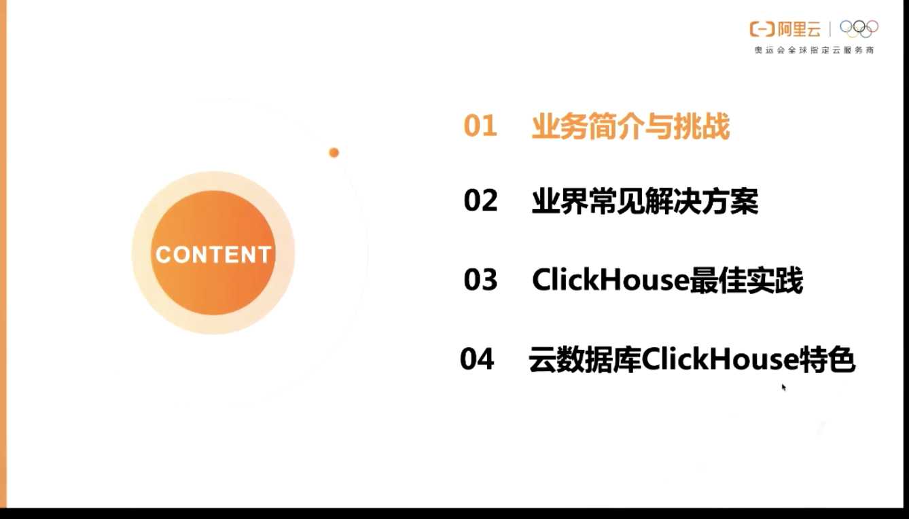 

 

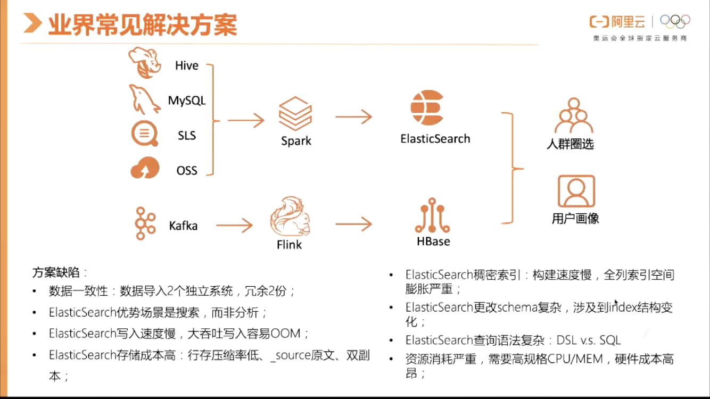 

 

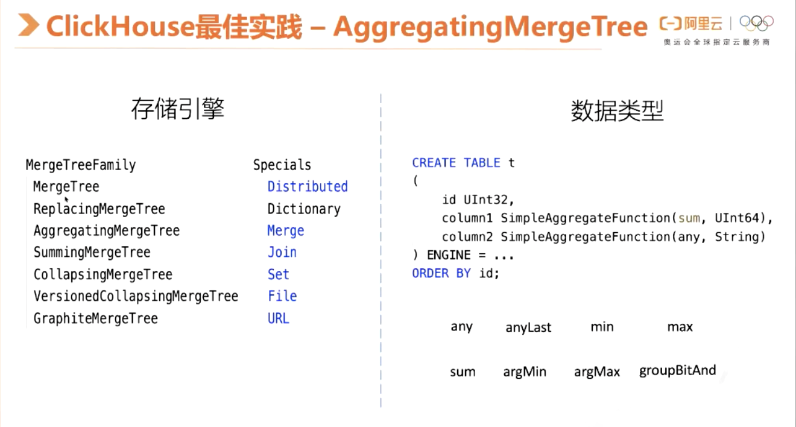 

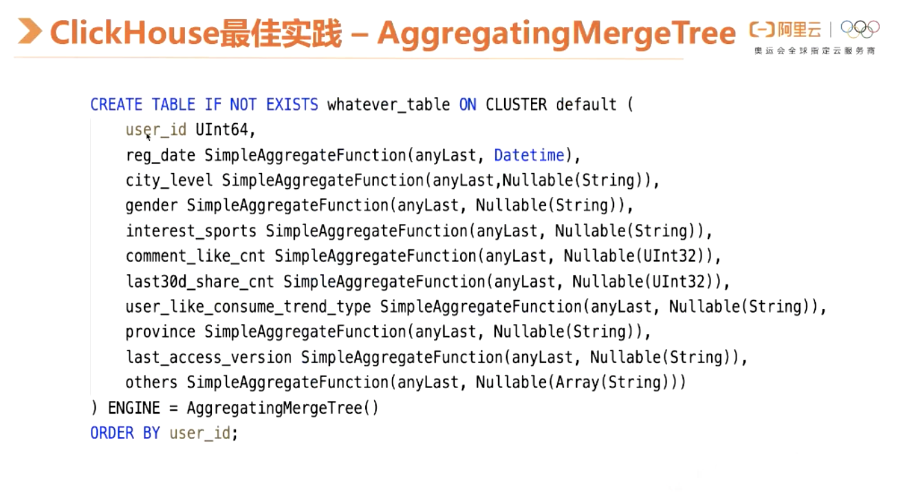 

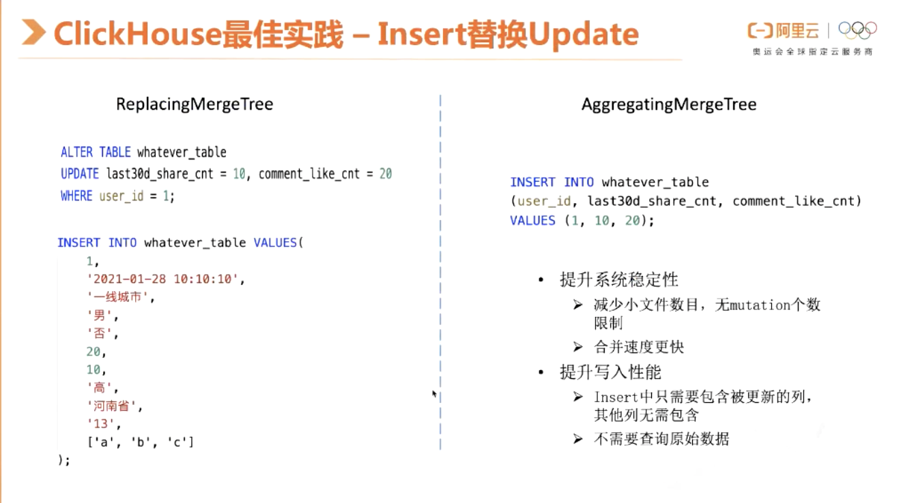 

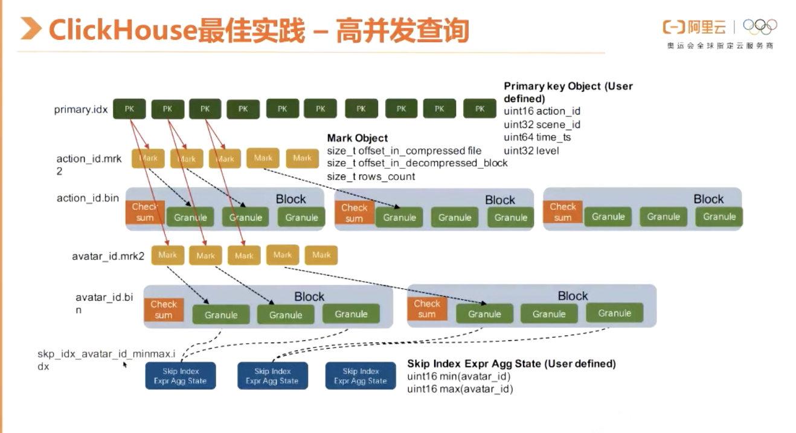 

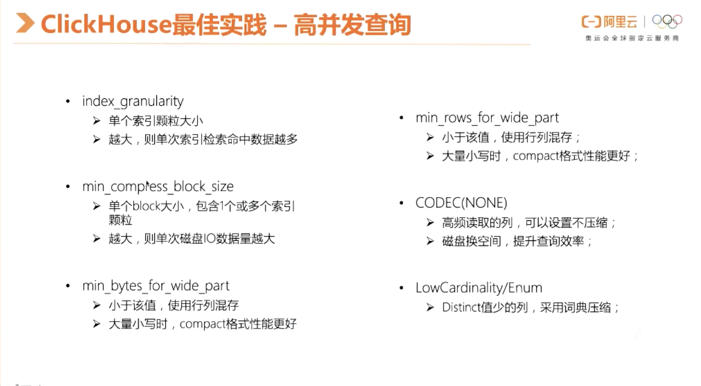 

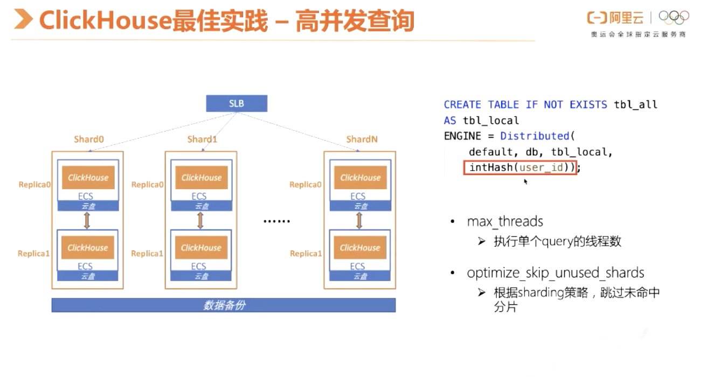 

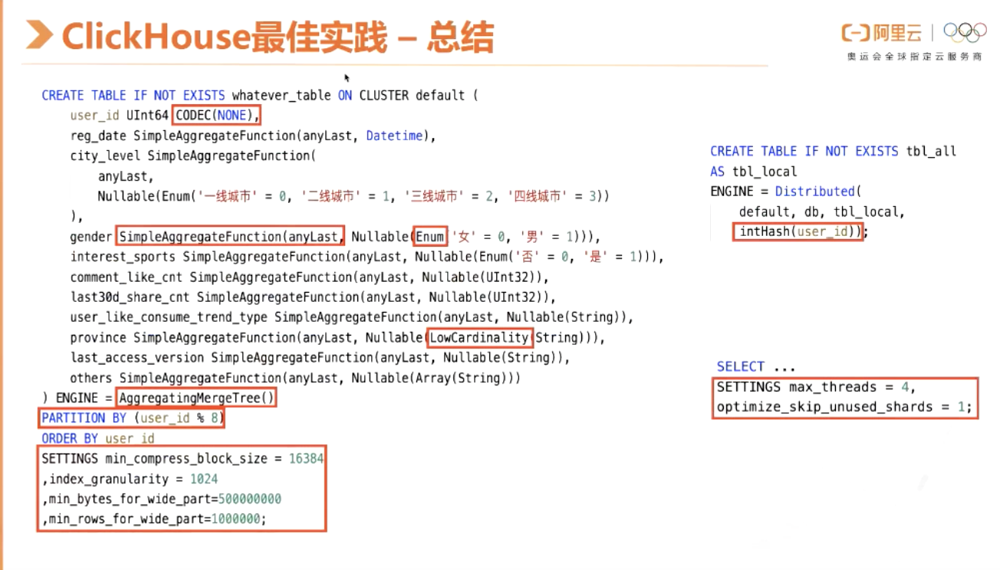 

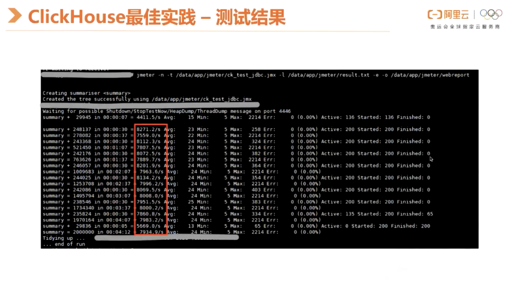 

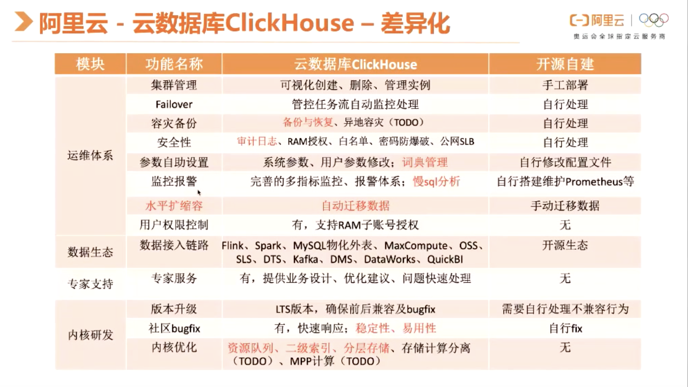 

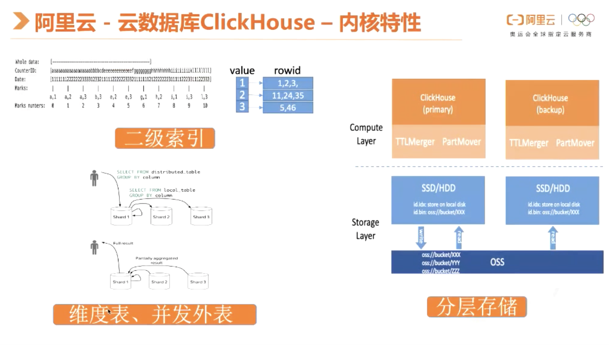 

#### 4.2 ClickHouse 实践验证正确性

##### 4.2.1 验证表引擎特性

- 聚合函数实现数据更新
- 主键生效时机
- 聚合函数实现数据去重

> 案例一：

- 建表

  ```sql
  # AggregatingMergeTree 表引擎支持同一个分区去重，但是必须手动强制分区合并
  create table user_test(
      log_id UInt64,
      reg_date SimpleAggregateFunction(anyLast,DateTime),
      remark SimpleAggregateFunction(anyLast,String)
  ) ENGINE = AggregatingMergeTree()
  PRIMARY KEY (log_id)
  partition by toYYYYMM(reg_date)
  order by (log_id,reg_date)
  
  # 手动强制分区合并
  optimize table user_test FINAL;
  ```

- 插入数据

  ```sql
  insert into kenan.user_test values (1,toDateTime('2034-12-29 15:40:47'),'测试数据')
  ```

  


### 5.生产环境

#### 5.1 上生产环境需要考虑的问题

- 目前公司数据量多大，未来增长会如何？ClickHouse生产部署，机器容量配置，多少分片多少副本。需考虑未来三年的数据增长
- 数据写入是写入本地表还是分布式表
- ClickHouse是否支持所有业务，需对现有业务整理统一分析
- 表引擎如何选择
- 数据库引擎如何选择
- 分区如何选择
- 表主键、索引如何选择
- 数据如何迁移
- ClickHouse不擅长行级删除，行级搜索，是否有业务需要，如何

#### 5.2 Click House索引

##### 5.2.1 主键索引

primary.idx是表的主键索引。ClickHouse对主键索引的定义和传统数据库的定义稍有不同，它的主键索引没用主键去重的含义，但仍然有快速查找主键行的能力。ClickHouse的主键索引存储的是每一个Granule中起始行的主键值，而MergeTree存储中的数据是按照主键严格排序的。所以当查询给定主键条件时，我们可以根据主键索引确定数据可能存在的 ，再结合上面介绍的Mark标识，我们可以进一步确定数据在列存文件中的位置区间。ClickHoue的主键索引是一种在索引构建成本和索引效率上相对平衡的粗糙索引。MergeTree的主键序列默认是和Order By序列保存一致的，但是用户可以把主键序列定义成Order By序列的部分前缀。

##### 5.2.2 分区键索引

minmax_time.idx、minmax_region_name.idx是表的分区键索引。MergeTree存储会把统计每个Data Part中分区键的最大值和最小值，当用户查询中包含分区键条件时，就可以直接排除掉不相关的Data Part，这是一种OLAP场景下常用的分区裁剪技术。

#### 5.3 clickhouse 慢SQL优化

> 思路

- 分区，原则是尽量把经常一起用到的数据放到相同区（也可以根据where条件来分区），如果一个区太大再放到多个区
- 主键（索引，即排序）order by字段选择： 就是把where 里面肯定有的字段加到里面，where 中一定有的字段放到第一位，注意字段的区分度适中即可 区分度太大太小都不好，因为ck的索引时稀疏索引，采用的是按照固定的粒度抽样作为实际的索引值，不是mysql的二叉树，所以不建议使用区分度特别高的字段。

**温馨提醒**  

- 索引结构是稀疏索引 不要拿mysql的二叉树来类比
- 建索引的正确方式，开始字段不应该是区分度很高的字段，如果是唯一的，那么索引效果非常差，也不能找区分度特别差的，应该找区分度中等，这就涉及到你的setting的值，如果比较大，可以找区分度稍差的列，如果比较小，找区分度稍大的列作为索引

**案例分析** 

- boss_info表大概是1500万条数据，20个G数据量

> 表一

```sql
CREATE TABLE bi.boss_info ( 
row_id String,  user_id Int32,  user_name String,  gender String,  title String,  is_hr String,  certification String,  user_status String,  user_extra_status String,  completion String,  lure_content String,  email String,  brand_id Int32,  company_name String,  com_id Int32,  company_full_name String,  website String,  address String,  brand_completion String,  brand_certify String,  industry String,  scale String,  stage String,  add_time String,  com_description String,  com_date8 String,  active_time String,  unactive_days Int32,  job_title String,  l1_name String,  l2_name String,  l3_name String,  city String,  low_salary Int32,  high_salary Int32,  degree String,  exp_description String,  work_years String,  job_address String,  job_province String,  job_city String,  job_area String,  job_status String,  job_num Int32,  online_props_buy String,  all_item_num Int32,  all_income String,  online_vip_buy String,  online_vip_time String,  online_super_vip_buy String,  online_super_vip_time String,  offline_props_distribute String,  offline_props_time String,  offline_vip_distribute String,  offline_vip_time String,  pay_now String,  data_dt Date)
ENGINE = MergeTree() 
PARTITION BY data_dt 
ORDER BY (industry, l1_name, l2_name, l3_name, job_city, job_area, row_id) SETTINGS index_granularity = 8192
```

> 表二

```sql
CREATE TABLE bi.boss_info2 ( row_id String,  user_id Int32,  user_name String,  gender String,  title String,  is_hr String,  certification String,  user_status String,  user_extra_status String,  completion String,  lure_content String,  email String,  brand_id Int32,  company_name String,  com_id Int32,  company_full_name String,  website String,  address String,  brand_completion String,  brand_certify String,  industry String,  scale String,  stage String,  add_time String,  com_description String,  com_date8 String,  active_time String,  unactive_days Int32,  job_title String,  l1_name String,  l2_name String,  l3_name String,  city String,  low_salary Int32,  high_salary Int32,  degree String,  exp_description String,  work_years String,  job_address String,  job_province String,  job_city String,  job_area String,  job_status String,  job_num Int32,  online_props_buy String,  all_item_num Int32,  all_income String,  online_vip_buy String,  online_vip_time String,  online_super_vip_buy String,  online_super_vip_time String,  offline_props_distribute String,  offline_props_time String,  offline_vip_distribute String,  offline_vip_time String,  pay_now String,  data_dt Date) 
ENGINE = MergeTree() 
PARTITION BY data_dt 
ORDER BY (industry, l1_name, l2_name, l3_name, job_city, job_area) SETTINGS index_granularity = 16384
```

**建表语句区别：boss_info和boss_info2的区别是去掉了索引中的row_id** 

- 现象一：

```sql
sql1：select row_id from boss_info order by row_id desc limit 3;   ----耗时较大
结果中第一条是：999997-1
3 rows in set. Elapsed: 0.342 sec. Processed 14.62 million rows, 279.07 MB (42.71 million rows/s., 815.10 MB/s.) 

sql2：select row_id from boss_info2 order by row_id desc limit 3;
3 rows in set. Elapsed: 0.061 sec. Processed 14.62 million rows, 279.07 MB (240.21 million rows/s., 4.58 GB/s.) 

sql3：select  * from boss_info where row_id ='999998-1';----耗时较大,时间不太稳定，再次测平均是4-6s
1 rows in set. Elapsed: 20.228 sec. Processed 13.16 million rows, 24.10 GB (650.83 thousand rows/s., 1.19 GB/s.) 

sql4：select  * from boss_info2 where row_id ='999997-1';
1 rows in set. Elapsed: 2.195 sec. Processed 14.62 million rows, 279.08 MB (6.66 million rows/s., 127.16 MB/s.) 

sql5：select row_id from boss_info order by row_id asc limit 3;
结果中第一条是：1000010-1
3 rows in set. Elapsed: 0.058 sec. Processed 14.62 million rows, 279.07 MB (251.10 million rows/s., 4.79 GB/s.) 

sql6：select row_id from boss_info2 order by row_id asc limit 3;
3 rows in set. Elapsed: 0.061 sec. Processed 14.62 million rows, 279.07 MB (240.11 million rows/s., 4.58 GB/s.) 

sql7：select  * from boss_info where row_id ='1000010-1';
1 rows in set. Elapsed: 4.003 sec. Processed 13.16 million rows, 24.10 GB (3.29 million rows/s., 6.02 GB/s.) 

sql8：select  * from boss_info2 where row_id ='1000010-1';
1 rows in set. Elapsed: 2.711 sec. Processed 14.62 million rows, 279.07 MB (5.39 million rows/s., 102.95 MB/s.) 

sql9：select count(*) from boss_info;  结果：14622978 

上面所有的sql都是进行了全表扫描.都是扫描了1500万的数据

sql10：select  * from boss_info where industry='咨询' and row_id ='999997-1';
1 rows in set. Elapsed: 0.172 sec. Processed 147.64 thousand rows, 24.10 65B (859.30 thousand rows/s., 1.54 GB/s.) 
这句sql没有进行全表扫描，仅仅扫描了15万左右

sql11：select * from boss_info where l1_name='技术' and row_id ='999997-1';
1 rows in set. Elapsed: 1.728 sec. Processed 4.76 million rows, 8.46 GB (2.75 million rows/s., 4.89 GB/s.) 

sql12：select  * from boss_info where l3_name='C++' and row_id ='999997-1';
1 rows in set. Elapsed: 3.073 sec. Processed 10.06 million rows, 18.03 GB (3.27 million rows/s., 5.87 GB/s.) 

select industry, l1_name, l2_name, l3_name, job_city, job_area, row_id from boss_info order by  row_id desc limit 3 ;
3 rows in set. Elapsed: 0.264 sec. Processed 14.62 million rows, 1.91 GB (55.45 million rows/s., 7.24 GB/s.) 

select * from boss_info order by  row_id desc limit 3 ;
3 rows in set. Elapsed: 3.299 sec. Processed 14.62 million rows, 25.51 GB (4.43 million rows/s., 7.73 GB/s.) 

select  * from boss_info where row_id ='999988-9';
```

先说ck的索引结构：

- 典型的**稀疏索引**，即ck中数据的存储会按照order by的字段顺序存储，同时会根据你设置的setting（即索引粒度）来抽样数据，数据内容就是order by字段对应的真实值；

**问题：** 

1. 为什么sql10索引生效，sql1和sql3中的row_id索引都没有生效，甚至拉慢了查询效率
   - 索引结构问题，ck是稀疏索引，sql10中industry刚好是索引的第一部分，所以索引生效直接定位范围区间；但是sql1和sql3中row_id是索引的最后一部分，定位到的返回就会是全表范围，所以真正取值时要进行全表扫描。
   - 拉慢查询效率原因：
     首先会扫描所有的索引来定位取值范围，但是定位到的取值范围就是全表，所以此步完全是多做的然后会进行全表扫描
2. sql3和sql4同是全表扫描，为什么sql3扫描数据量24GB，而sql4只有279M，导致sql3慢了10倍
   - 数据量近百倍差距--->row_id在索引中是一定加载了所有字段，不在索引中仅仅扫描了row_id字段
   - row_id是索引一部分的时候 因为用row_id定位的区间是全部（稀疏和在索引末尾部分导致），所以全部字段加载到内存，再找符合row_id条件的记录？没有索引的时候就先用row_id匹配，仅仅读取row_id列，然仅仅加载row_id所在的一个粒度区间所有内容
3. sql1和sql2相比，为何sql1用了索引反而慢了5倍，为何sql1比sql2的处理速度要快
   - 可以参考问题一，先走了索引，但实际白走

相关资料

1. [clickhouse 稀疏索引](https://my.oschina.net/u/2000675/blog/4655098) 
2. [clickhouse的索引结构和查询优化](https://blog.csdn.net/h2604396739/article/details/86172756) 


### 6. 总结问题

#### 6.1 clickhouse实际问题

##### 6.1.1 关于update

ClickHouse 并不完全支持 upsert 语义。

##### 6.1.2 deduplicated（重复）

对于 update 和 delete 操作，可使用 CollapsingMergeTree 来实现。在生产环境中，一般会使用 ReplicatedCollapsingMergeTree，而 `Replicated*MergeTree` 的 deduplicated 可能会使得写入到 clickhouse 的数据被判断为重复数据，而被去重。此时，可在建表（或者修改表）时，指定`replicated_deduplication_window=0`，以关闭 deduplicated。例如：

```sql
CREATE TABLE testdb.testtable on cluster default_cluster (
  `id` Int32,
  `name` Nullable(String),
  `age` Nullable(Int32),
  `weight` Nullable(Float64),`Sign` Int8
) ENGINE = ReplicatedCollapsingMergeTree('/clickhouse/tables/{layer}-{shard}/testdb/testtable', '{replica}', Sign) 
ORDER BY id SETTINGS  replicated_deduplication_window = 0;
```

deduplicated 更多详情可参见 [Data Replication](https://clickhouse.tech/docs/en/engines/table-engines/mergetree-family/replication/)。

##### 6.1.3 关于 null 数据

若写入 clickhouse 的数据中某些字段可能为空，则在 clickhouse 的 ddl 中，需要把字段声明改为 Nullable，否则会导致数据写入异常。

```mysql
CREATE TABLE testdb.testtable on cluster default_cluster (
  `id` Int32,
  `name` Nullable(String),
  `age` Nullable(Int32),
  `weight` Nullable(Float64),
  `Sign` Int8) ENGINE = ReplicatedCollapsingMergeTree('/clickhouse/tables/{layer}-{shard}/testdb/testtable', '{replica}', Sign) 
  ORDER BY id ;
```

#### 6.2 常见考点

##### 6.2.1 clickhouse为什么快

- C写的，可以基于C++可以利用硬件优势
- 摒弃了hadoop生态
- 数据底层以列式数据存储
- 列用单节点的多核并行处理
- 为数据建立一级、二级 稀疏索引
- 使用大量的算法处理数据
- 支持向量化处理 
- 预先设计运算模型，预先计算
- 分布式处理数据

#### 6.8 bug问题

**1.clickhouse入库操作时，报错SQLFeatureNotSupportedException,InvalidDataAccessApiUsageException** 

 clickhouse  有自增主键，导致我们插入数据时，无法指定主键进行插入数据，所以需要在mybatis中设置忽略主键插入。 [查看更多](https://blog.csdn.net/wllove99/article/details/116132016) 

```xml
在mapper中设置 <insert id="" useGeneratedKeys="false">
```


