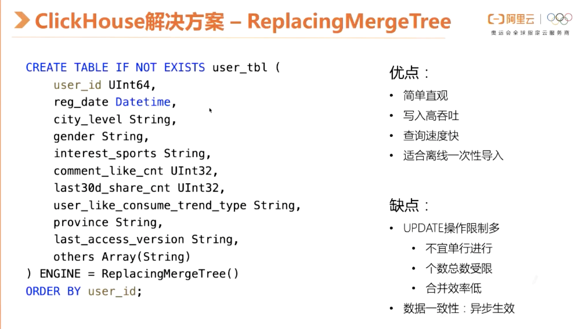

### ClickHouse

### 1. ClickHouse 初识

ClickHouse是一个用于联机分析(OLAP)的列式数据库管理系统(DBMS)

- 官方文档：https://clickhouse.tech/docs/zh/

#### 1.1 Clickhouse 环境构建

##### 1.1.1 docker构建clickhouse

docker环境搭建好之后，利用docker安装clickhouse比较简单，clickhouse官方提供了默认的镜像，直接使用即可。

- 官方文档参考：https://hub.docker.com/r/yandex/clickhouse-server/

**1.1.1 拉取clickhouse的docker镜像** 

```dockerfile
docker pull yandex/clickhouse-server
docker pull yandex/clickhouse-client
```

**1.1.2 启动 clickhouse-server**  

```dockerfile
# 方式一：启动服务（临时启动、获取配置文件）
docker run --rm -d --name clickhouse-server --ulimit nofile=262144:262144 -p 8123:8123 -p 9009:9009 -p 9000:9000 \
yandex/clickhouse-server:latest

# 方式二：如果想指定目录启动，这里以clickhouse-test-server命令为例，可以随意写
 mkdir -p /apps/clickhouse/clickhouse-test-db       ## 创建数据文件目录
# 使用以下路径启动，在外只能访问clickhouse提供的默认9000端口，只能通过clickhouse-client连接server
docker run -d --name clickhouse-test-server --ulimit nofile=262144:262144 --volume=/spps/clickhouse/clickhouse-test-db:/var/lib/clickhouse yandex/clickhouse-server
```

**1.1.3 启动 client 并连接 clickhouse-client** 

>  docker启动clickhouse-client

```bash
## 第一次运行并启动
docker run -it --rm --link clickhouse-test-server:clickhouse-server yandex/clickhouse-client --host clickhouse-server
## 第二次启动容器使用以下命令即可
docker start [containerId]

## 第二次启动之后进入容器使用以下命令即可
# 如果退出了容器，如何继续玩耍？重新执行下面这个命令即可。
docker run -it --rm --link clickhouse-test-server:clickhouse-server yandex/clickhouse-client --host clickhouse-server 
```


> 查询默认的表

 

**1.1.4 复制容器中的配置文件到宿主机** 

提前建好文件夹，不然会报错，/apps/clickhouse/config 是本机新建的目录，方便管理。该目录可以任意

```powershell
# 新建存储clickhouse配置的目录
mkdir -p /apps/clickhouse/config

# 复制配置并与宿主机关联
docker cp clickhouse-server:/etc/clickhouse-server/config.xml /apps/clickhouse/config/config.xml
docker cp clickhouse-server:/etc/clickhouse-server/users.xml /apps/clickhouse/config/users.xml
```

**1.1.5 停止ClickHouse 服务** 

```powershell
# 停止服务指令
docker stop 【容器ID/容器名称】

# example
docker stop 6a10d8d7bf36
# 或者 （格式：docker stop 容器名<第3步输入--name的值>)
docker stop clickhouse-server
```

##### 1.1.2 clickhouse 修改密码

- 配置文件位置(根据1.1.4 中复制指定的位置)

  ```powershell
  /apps/clickhouse/config/users.xml
  ```

- 修改前

  

- 在password标签中加上密码123456，可以使用"加密密码",修改完成保存退出

##### 1.1.3 重启使服务生效

```powershell
## 启动方式一：指定目录启动 clickhouse-test-server
docker run -d --name=clickhouse-server -p 8123:8123 -p 9009:9009 -p 9000:9000 --ulimit nofile=262144:262144 \
--volume=/spps/clickhouse/clickhouse-test-db:/var/lib/clickhouse yandex/clickhouse-server

## 启动方式二：挂载（用此可能不当）数据、日志、配置文件到指定目录
docker run -d --name=clickhouse-server \
-p 8123:8123 -p 9009:9009 -p 9000:9000 \
--ulimit nofile=262144:262144 \
-v /Users/vick/data/programs/docker/clickhouse/data:/var/lib/clickhouse:rw \
-v /Users/vick/data/programs/docker/clickhouse/conf/config.xml:/etc/clickhouse-server/config.xml \
-v /Users/vick/data/programs/docker/clickhouse/conf/users.xml:/etc/clickhouse-server/users.xml \
-v /Users/vick/data/programs/docker/clickhouse/log:/var/log/clickhouse-server:rw \
yandex/clickhouse-server:latest
```

##### 1.1.4 启动clickhouse 客户端

```powershell
## 启动客户端
docker run -it --rm --link clickhouse-server:clickhouse-server yandex/clickhouse-client --host clickhouse-server --password=123456

# 启动客户端相关指令
clickhouse-client
    --host, -h     	：服务端host名称，默认 localhost
    --port         	：连接端口，默认9000
    --user, -u     	：用户名，默认 default
    --password     	：密码，默认空
    --query, -q    	：非交互模式下的查询语句
    --database, -d 	：默认当前操作的数据库，默认default
    --multiline, -m ：允许多行语句查询，在clickhouse中默认回车即为sql结束，可使用该参数多行输入
    --format, -f		：使用指定的默认格式输出结果      csv,以逗号分隔
    --time, -t			：非交互模式下会打印查询执行的时间
    --stacktrace		：出现异常会打印堆栈跟踪信息
    --config-file		：配置文件名称
```

#### 1.2 ClickHouse 使用指南

> 来源：https://clickhouse.tech/docs/zh/getting-started/tutorial/

##### **1.2.1 ClickHouse 单机使用**  

- 常用脚本

```sql
show database;    --- 查看所有数据库
use [数据库名称]    --- 使用某个数据库
show tables;      --- 查看该库下的所有表
desc [TableName]  --- 查看表结构
```

- 创建数据库

  ```sql
  CREATE DATABASE IF NOT EXISTS wxw
  ```

- 创建表

  ```sql
  CREATE TABLE wxw.user_info( \
      `user_id` UInt64,       \
      `user_name` String,     \
      `age` Int16,            \
      `birthday` DateTime,    \
      `create_date` Date)     \
  ENGINE = MergeTree()        \
  PARTITION BY toYYYYMM(create_date) \
  ORDER BY (create_date, birthday, intHash32(user_id)) \
  SAMPLE BY intHash32(user_id)
  ```

- 导入数据

  数据导入到ClickHouse是通过[INSERT INTO](https://clickhouse.tech/docs/zh/sql-reference/statements/insert-into/)方式完成的，查询类似许多SQL数据库。然而，数据通常是在一个提供[支持序列化格式](https://clickhouse.tech/docs/zh/interfaces/formats/)而不是`VALUES`子句（也支持）。

  ```sql
  INSERT INTO wxw.hits_v1 FORMAT TSV --max_insert_block_size=100000 < hits_v1.tsv
  INSERT INTO table VALUES < data.txt
  ```

- 统计表的数量

  ```sql
  SELECT COUNT(*) from wxw.user_info;
  ```

- 表的参数设置

  **数据导入时设置：**ClickHouse有很多[要调整的设置](https://clickhouse.tech/docs/zh/operations/settings/)在控制台客户端中指定它们的一种方法是通过参数，就像我们看到上面语句中的`--max_insert_block_size`。找出可用的设置、含义及其默认值的最简单方法是查询`system.settings` 表:

  ```sql
  SELECT name, value, changed, description FROM system.settings WHERE name LIKE '%max_insert_b%' FORMAT TSV
  ```

  **数据导入后的设置**：您也可以[OPTIMIZE](https://clickhouse.tech/docs/zh/sql-reference/statements/misc/#misc_operations-optimize)导入后的表。使用MergeTree-family引擎配置的表总是在后台合并数据部分以优化数据存储（或至少检查是否有意义）。 这些查询强制表引擎立即进行存储优化，而不是稍后一段时间执行:

  ```sql
  OPTIMIZE TABLE wxw.user_info FINAL
  ```

- 查看创建表的语句

  ```sql
   show create user_info;
  ```

   

##### **1.2.2 ClickHouse 集群部署** 

ClickHouse集群是一个同质集群。 设置步骤:

1. 在群集的所有机器上安装ClickHouse服务端
2. 在配置文件中设置群集配置
3. 在每个实例上创建本地表
4. 创建一个[分布式表](https://clickhouse.tech/docs/zh/engines/table-engines/special/distributed/) 

[分布式表](https://clickhouse.tech/docs/zh/engines/table-engines/special/distributed/)实际上是一种`view`，映射到ClickHouse集群的本地表。 从分布式表中执行**SELECT**查询会使用集群所有分片的资源。 您可以为多个集群指定configs，并创建多个分布式表，为不同的集群提供视图。

具有三个分片，每个分片一个副本的集群的示例配置:

```xml
<remote_servers>
    <perftest_3shards_1replicas>
        <shard>
            <replica>
                <host>example-perftest01j.yandex.ru</host>
                <port>9000</port>
            </replica>
        </shard>
        <shard>
            <replica>
                <host>example-perftest02j.yandex.ru</host>
                <port>9000</port>
            </replica>
        </shard>
        <shard>
            <replica>
                <host>example-perftest03j.yandex.ru</host>
                <port>9000</port>
            </replica>
        </shard>
    </perftest_3shards_1replicas>
</remote_servers>
```

为了进一步演示，让我们使用和创建`hits_v1`表相同的`CREATE TABLE`语句创建一个新的本地表，但表名不同:

```sql
CREATE TABLE wxw.hits_local (...) ENGINE = MergeTree() ...
```

创建提供集群本地表视图的分布式表:

```sql
CREATE TABLE wxw.hits_all AS wxw.hits_local
ENGINE = Distributed(perftest_3shards_1replicas, wxw, hits_local, rand());
```

常见的做法是在集群的所有计算机上创建类似的分布式表。 它允许在群集的任何计算机上运行分布式查询。 还有一个替代选项可以使用以下方法为给定的SELECT查询创建临时分布式表[远程](https://clickhouse.tech/docs/zh/sql-reference/table-functions/remote/)表功能。

让我们运行[INSERT SELECT](https://clickhouse.tech/docs/zh/sql-reference/statements/insert-into/)将该表传播到多个服务器。

```sql
INSERT INTO wxw.hits_all SELECT * FROM wxw.hits_v1;
```

```
注意：这种方法不适合大型表的分片。 有一个单独的工具 clickhouse-copier 这可以重新分片任意大表。
```

正如您所期望的那样，如果计算量大的查询使用3台服务器而不是一个，则运行速度快N倍。

在这种情况下，我们使用了具有3个分片的集群，每个分片都包含一个副本。

为了在生产环境中提供弹性，我们建议每个分片应包含分布在多个可用区或数据中心（或至少机架）之间的2-3个副本。 请注意，ClickHouse支持无限数量的副本。

包含三个副本的一个分片集群的示例配置:

```xml
<remote_servers>
    ...
    <perftest_1shards_3replicas>
        <shard>
            <replica>
                <host>example-perftest01j.yandex.ru</host>
                <port>9000</port>
             </replica>
             <replica>
                <host>example-perftest02j.yandex.ru</host>
                <port>9000</port>
             </replica>
             <replica>
                <host>example-perftest03j.yandex.ru</host>
                <port>9000</port>
             </replica>
        </shard>
    </perftest_1shards_3replicas>
</remote_servers>
```

启用本机复制[Zookeeper](https://zookeeper.apache.org/)是必需的。 ClickHouse负责所有副本的数据一致性，并在失败后自动运行恢复过程。建议将ZooKeeper集群部署在单独的服务器上（其中没有其他进程，包括运行的ClickHouse）。

ZooKeeper位置在配置文件中指定:

```xml
<zookeeper>
    <node>
        <host>zoo01.yandex.ru</host>
        <port>2181</port>
    </node>
    <node>
        <host>zoo02.yandex.ru</host>
        <port>2181</port>
    </node>
    <node>
        <host>zoo03.yandex.ru</host>
        <port>2181</port>
    </node>
</zookeeper>
```

此外，我们需要设置宏来识别每个用于创建表的分片和副本:

```xml
<macros>
    <shard>01</shard>
    <replica>01</replica>
</macros>
```

如果在创建复制表时没有副本，则会实例化新的第一个副本。 如果已有实时副本，则新副本将克隆现有副本中的数据。 

- 您可以选择首先创建所有复制的表，然后向其中插入数据。 
- 另一种选择是创建一些副本，并在数据插入之后或期间添加其他副本。

```sql
CREATE TABLE wxw.hits_replica (...)
ENGINE = ReplcatedMergeTree(
    '/clickhouse_perftest/tables/{shard}/hits',
    '{replica}'
)
...
```

在这里，我们使用[ReplicatedMergeTree](https://clickhouse.tech/docs/zh/engines/table-engines/mergetree-family/replication/)表引擎。 在参数中，我们指定包含分片和副本标识符的ZooKeeper路径。

```sql
INSERT INTO wxw.hits_replica SELECT * FROM wxw.hits_local;
```

复制在多主机模式下运行。数据可以加载到任何副本中，然后系统自动将其与其他实例同步。复制是异步的，因此在给定时刻，并非所有副本都可能包含最近插入的数据。至少应该有一个副本允许数据摄入。另一些则会在重新激活后同步数据并修复一致性。请注意，这种方法允许最近插入的数据丢失的可能性很低。

### 2.ClickHouse SQL语法

> 来源：https://clickhouse.tech/docs/zh/sql-reference/syntax/

#### 2.1 SQL 数据类型

ClickHouse 支持整数、浮点数、字符型、日期、枚举值和数组等多种数据类型。

类型列表

| 类别                 | 名称                                | 类型标识                                     | 数据范围或描述                                  |
| :------------------- | :---------------------------------- | :------------------------------------------- | :---------------------------------------------- |
| 整数                 | 单字节整数                          | Int8                                         | -128 - 127                                      |
| 双字节整数           | Int16                               | -32768 - 32767                               |                                                 |
| 四字节整数           | Int32                               | -2147483648 - 2147483647                     |                                                 |
| 八字节整数           | Int64                               | -9223372036854775808 - 9223372036854775807   |                                                 |
| 无符号单字节整数     | UInt8                               | 0 - 255                                      |                                                 |
| 无符号双字节整数     | UInt16                              | 0 - 65535                                    |                                                 |
| 无符号四字节整数     | UInt32                              | 0 - 4294967295                               |                                                 |
| 无符号八字节整数     | UInt64                              | 0 - 18446744073709551615                     |                                                 |
| 浮点数               | 单精度浮点数                        | Float32                                      | 浮点数有效数字6 - 7位                           |
| 双精度浮点数         | Float64                             | 浮点数有效数字15 - 16位                      |                                                 |
| 自定义浮点           | Decimal32(S)                        | 浮点数有效数字 S，S 取值范围1 - 9            |                                                 |
| Decimal64(S)         | 浮点数有效数字 S，S 取值范围10 - 18 |                                              |                                                 |
| Decimal128(S)        | 浮点数有效数字 S，S 取值范围19 - 38 |                                              |                                                 |
| 字符型               | 任意长度字符                        | String                                       | 不限定字符串长度                                |
| 固定长度字符         | FixedString(N)                      | 固定长度的字符串                             |                                                 |
| 唯一标识 UUID 类型   | UUID                                | 通过内置函数 generateUUIDv4 生成唯一的标志符 |                                                 |
| 时间类型             | 日期类型                            | Date                                         | 存储年月日时间，格式 yyyy-MM-dd                 |
| 时间戳类型（秒级）   | DateTime(timezone)                  | Unix 时间戳，精确到秒                        |                                                 |
| 时间戳类型（自定义） | DateTime(precision, timezone)       | 可以指定时间精度                             |                                                 |
| 枚举类型             | 单字节枚举                          | Enum8                                        | 提供-128 - 127共256个值                         |
| 双字节枚举           | Enum16                              | 提供-32768 - 32767 共65536个值               |                                                 |
| 数组类型             | 数组类型                            | Array(T)                                     | 表示由 T 类型组成的数组类型，不推荐使用嵌套数组 |

- 可以使用 UInt8 来存储布尔类型，将取值限制为0或1。[其他数据类型官方文档](https://clickhouse.tech/) 

##### 2.1.1 枚举类型应用

- 存储某站点用户的性别信息。

```sql
CREATE TABLE user (uid Int16, name String, gender Enum('male'=1, 'female'=2)) ENGINE=Memory;

INSERT INTO user VALUES (1, 'Gary', 'male'), (2,'Jaco', 'female');

# 查询数据
SELECT * FROM user;

┌─uid─┬─name─┬─gender─┐
│   1 │ Gary │ male   │
│   2 │ Jaco │ female │
└─────┴──────┴────────┘

# 使用CAST函数查询枚举整数值
SELECT uid, name, CAST(gender, 'Int8') FROM user;

┌─uid─┬─name─┬─CAST(gender, 'Int8')─┐
│   1 │ Gary │                    1 │
│   2 │ Jaco │                    2 │
└─────┴──────┴──────────────────────┘
```

##### 2.1.2 数组类型应用

- 某站点记录每天登录用户的 ID，用来分析活跃用户。

```sql
CREATE TABLE userloginlog (logindate Date, uids Array(String)) ENGINE=TinyLog;

INSERT INTO userloginlog VALUES ('2020-01-02', ['Gary', 'Jaco']), ('2020-02-03', ['Jaco', 'Sammie']);

# 查询结果
SELECT * FROM userloginlog;

┌──logindate─┬─uids──────────────┐
│ 2020-01-02 │ ['Gary','Jaco']   │
│ 2020-02-03 │ ['Jaco','Sammie'] │
└────────────┴───────────────────┘
```

#### 2.3 创建数据库或表

ClickHouse 使用 CREATE 语句来完成数据库或表的创建。

```sql
CREATE DATABASE [IF NOT EXISTS] db_name [ON CLUSTER cluster] [ENGINE = engine(...)]

CREATE TABLE [IF NOT EXISTS] [db.]table_name [ON CLUSTER cluster]
(
   name1 [type1] [DEFAULT|MATERIALIZED|ALIAS expr1] [compression_codec] [TTL expr1],
   name2 [type2] [DEFAULT|MATERIALIZED|ALIAS expr2] [compression_codec] [TTL expr2],
   ...
) ENGINE = engine
```

数据库和表都支持本地和分布式两种，分布式方式的创建有以下两种方法：

- 在每台 clickhouse-server 所在机器上都执行创建语句。
- 使用 ON CLUSTER 子句，配合 ZooKeeper 服务完成创建动作。

当使用 clickhouse-client 进行查询时，若在 A 机上查询 B 机的本地表则会报错“Table xxx doesn't exist..”。若希望集群内的所有机器都能查询某张表，推荐使用分布式表。

相关官方文档 [CREATE Queries](https://clickhouse.tech/docs/en/query_language/create/)。

##### 2.3.1 update/delete建表

```sql
## 创建库
create database test on cluster default_cluster;

## 创建表
CREATE TABLE test.datagen on cluster default_cluster(
  `id` Int32,
  `name` Nullable(String),
  `age` Nullable(Int32),
  `weight` Nullable(Float64),
  `Sign` Int8
) ENGINE = ReplicatedCollapsingMergeTree('/clickhouse/tables/{layer}-{shard}/test/datagen', '{replica}', Sign) 
  ORDER BY id SETTINGS replicated_deduplication_window = 0; //关闭去重
 
## 创建分布式表
CREATE TABLE test.datagen_all  ON CLUSTER default_cluster as test.datagen 
ENGINE = Distributed(default_cluster, test, datagen, id);
```

##### 2.3.2 仅含插入的建表

```sql
create database test on cluster default_cluster;

## 建表
CREATE TABLE test.datagen on cluster default_cluster (
  `id` Int32,
  `name` Nullable(String),
  `age` Nullable(Int32),
  `weight` Nullable(Float64) 
) ENGINE = ReplicatedMergeTree('/clickhouse/tables/{layer}-{shard}/test/datagen', '{replica}') 
 ORDER BY id SETTINGS  replicated_deduplication_window = 0;
 
## 分布式建表
CREATE TABLE test.datagen_all  ON CLUSTER default_cluster as test.datagen 
ENGINE = Distributed(default_cluster, test, datagen, id);
```

> 出自：https://cloud.tencent.com/document/product/849/53389

#### 2.4 查询

ClickHouse 使用 SELECT 语句来完成数据查询。

```sql
SELECT [DISTINCT] expr_list
[FROM [db.]table | (subquery) | table_function] [FINAL]
[SAMPLE sample_coeff]
[GLOBAL] [ANY|ALL] [INNER|LEFT|RIGHT|FULL|CROSS] [OUTER] JOIN (subquery)|table USING columns_list
[PREWHERE expr]
[WHERE expr]
[GROUP BY expr_list] [WITH TOTALS]
[HAVING expr]
[ORDER BY expr_list]
[LIMIT [offset_value, ]n BY columns]
[LIMIT [n, ]m]
[UNION ALL ...]
[INTO OUTFILE filename]
[FORMAT format]
```

相关官方文档 [SELECT Queries Syntax](https://clickhouse.tech/docs/en/query_language/select/)。

##### 2.4.1 show 语句

展现数据库、处理列表、表、字典等信息。

```sql
## 查看数据库列表
SHOW DATABASES [INTO OUTFILE filename] [FORMAT format]

## 查看处理器列表
SHOW PROCESSLIST [INTO OUTFILE filename] [FORMAT format]

## 查看表信息
SHOW [TEMPORARY] TABLES [{FROM | IN} <db>] [LIKE '<pattern>' | WHERE expr] [LIMIT <N>] [INTO OUTFILE <filename>] [FORMAT <format>]

## 查看表结构
SHOW DICTIONARIES [FROM <db>] [LIKE '<pattern>'] [LIMIT <N>] [INTO OUTFILE <filename>] [FORMAT <format>]
```

相关官方文档 [SHOW Queries](https://clickhouse.tech/docs/en/query_language/show/)。

##### 2.4.1 查看表的元数据信息

```sql
## 查看表元数据信息
DESC|DESCRIBE TABLE [db.]table [INTO OUTFILE filename] [FORMAT format]
```

#### 2.5 批量写入

ClickHouse 使用 INSERT INTO 语句来完成数据写入。

```sql
INSERT INTO [db.]table [(c1, c2, c3)] VALUES (v11, v12, v13), (v21, v22, v23), ...
INSERT INTO [db.]table [(c1, c2, c3)] SELECT ...
```

相关官方文档 [INSERT](https://clickhouse.tech/docs/en/query_language/insert_into/)。

#### 2.6 删除数据

ClickHouse 使用 DROP 或 TRUNCATE 语句来完成数据删除。

- DROP 删除元数据和数据，TRUNCATE 只删除数据。

```sql
## 删除数据库
DROP DATABASE [IF EXISTS] db [ON CLUSTER cluster]

## 删除表 同时删除元数据（）
DROP [TEMPORARY] TABLE [IF EXISTS] [db.]name [ON CLUSTER cluster]

## 删除表 只删除表数据
TRUNCATE TABLE [IF EXISTS] [db.]name [ON CLUSTER cluster]
```

#### 2.7 修改表数据

ClickHouse 使用 ALTER 语句来完成表结构修改。

```sql
# 对表的列操作
ALTER TABLE [db].name [ON CLUSTER cluster] ADD COLUMN [IF NOT EXISTS] name [type] [default_expr] [codec] [AFTER name_after]
ALTER TABLE [db].name [ON CLUSTER cluster] DROP COLUMN [IF EXISTS] name
ALTER TABLE [db].name [ON CLUSTER cluster] CLEAR COLUMN [IF EXISTS] name IN PARTITION partition_name
ALTER TABLE [db].name [ON CLUSTER cluster] COMMENT COLUMN [IF EXISTS] name 'comment'
ALTER TABLE [db].name [ON CLUSTER cluster] MODIFY COLUMN [IF EXISTS] name [type] [default_expr] [TTL]

# 对表的分区操作
ALTER TABLE table_name DETACH PARTITION partition_expr
ALTER TABLE table_name DROP PARTITION partition_expr
ALTER TABLE table_name CLEAR INDEX index_name IN PARTITION partition_expr

# 对表的属性操作
ALTER TABLE table-name MODIFY TTL ttl-expression
```

相关官方文档 [ALTER](https://clickhouse.tech/docs/en/query_language/alter/)。

#### 2.8 函数

ClickHouse 函数有两种类型：常规函数和聚合函数，区别是常规函数可以通过一行数据产生结果，聚合函数则需要一组数据来产生结果。

##### 2.8.1 常规函数

- 算数函数：数据表中各字段参与数学计算函数。

  | 函数名称              | 用途               | 使用场景                             |
  | :-------------------- | :----------------- | :----------------------------------- |
  | plus(a, b), a + b     | 计算两个字段的和   | plus(table.field1, table.field2)     |
  | minus(a, b), a - b    | 计算两个字段的差   | minus(table.field1, table.field2)    |
  | multiply(a, b), a * b | 计算两个字段的积   | multiply(table.field1, table.field2) |
  | divide(a, b), a / b   | 计算两个字段的商   | divide(table.field1, table.field2)   |
  | modulo(a, b), a % b   | 计算两个字段的余数 | modulo(table.field1, table.field2)   |
  | abs(a)                | 取绝对值           | abs(table.field1)                    |
  | negate(a)             | 取相反数           | negate(table.field1)                 |

- 比较函数

  | 函数名称 | 用途             | 使用场景              |
  | :------- | :--------------- | :-------------------- |
  | =, ==    | 判断是否相等     | table.field1 = value  |
  | !=, <>   | 判断是否不相等   | table.field1 != value |
  | >        | 判断是否大于     | table.field1 > value  |
  | >=       | 判断是否大于等于 | table.field1 >= value |
  | <        | 判断是否小于     | table.field1 < value  |
  | <=       | 判断是否小于等于 | table.field1 <= value |

- 类型转换函数：转换函数可能会溢出，溢出后的数字与C语言中数据类型保持一致。

  | 函数名称                    | 用途                                     | 使用场景                       |
  | :-------------------------- | :--------------------------------------- | :----------------------------- |
  | toInt(8\|16\|32\|64)        | 将字符型转化为整数型                     | toInt8('128') 结果为-127       |
  | toUInt(8\|16\|32\|64)       | 将字符型转化为无符号整数型               | toUInt8('128') 结果为128       |
  | toInt(8\|16\|32\|64)OrZero  | 将整数字符型转化为整数型，异常时返回0    | toInt8OrZero('a') 结果为0      |
  | toUInt(8\|16\|32\|64)OrZero | 将整数字符型转化为整数型，异常时返回0    | toUInt8OrZero('a') 结果为0     |
  | toInt(8\|16\|32\|64)OrNull  | 将整数字符型转化为整数型，异常时返回NULL | toInt8OrNull('a') 结果为 NULL  |
  | toUInt(8\|16\|32\|64)OrNull | 将整数字符型转化为整数型，异常时返回NULL | toUInt8OrNull('a') 结果为 NULL |

- 浮点数类型或日期类型也有上述类似的函数。

  - 相关官方文档 [Type Conversion Functions](https://clickhouse.tech/docs/en/query_language/functions/type_conversion_functions/)。

- 日期函数
  - 相关官方文档 [Functions for working with dates and times](https://clickhouse.tech/docs/en/query_language/functions/date_time_functions/)。

- 字符串函数
  - 相关官方文档 [Functions for working with strings](https://clickhouse.tech/docs/en/query_language/functions/string_functions/)。
- JSON处理函数
  - 相关官方文档 [Functions for working with JSON](https://clickhouse.tech/docs/en/query_language/functions/json_functions/)。

##### 2.8.2 聚合函数

| 函数名称                                                     | 用途                                                         | 使用场景                                                     |
| :----------------------------------------------------------- | :----------------------------------------------------------- | :----------------------------------------------------------- |
| count                                                        | 统计行数或者非 NULL 值个数                                   | count(expr)、COUNT(DISTINCT expr)、count()、count(*)         |
| [any(x)](https://clickhouse.tech/docs/en/query_language/agg_functions/reference/#agg_function-any) | 返回第一个遇到的值，结果不确定                               | any(column)                                                  |
| [anyHeavy(x)](https://clickhouse.tech/docs/en/query_language/agg_functions/reference/#anyheavyx) | 基于 heavy hitters 算法，返回经常出现的值。通常结果不确定    | anyHeavy(column)                                             |
| [anyLast(x)](https://clickhouse.tech/docs/en/query_language/agg_functions/reference/#anylastx) | 返回最后一个遇到的值，结果不确定                             | anyLast(column)                                              |
| [groupBitAnd](https://clickhouse.tech/docs/en/query_language/agg_functions/reference/#groupbitand) | 按位与                                                       | groupBitAnd(expr)                                            |
| [groupBitOr](https://clickhouse.tech/docs/en/query_language/agg_functions/reference/#groupbitor) | 按位或                                                       | groupBitOr(expr)                                             |
| [groupBitXor](https://clickhouse.tech/docs/en/query_language/agg_functions/reference/#groupbitxor) | 按位异或                                                     | groupBitXor(expr)                                            |
| [groupBitmap](https://clickhouse.tech/docs/en/query_language/agg_functions/reference/#groupbitmap) | 求基数（cardinality）                                        | groupBitmap(expr)                                            |
| [min(x)](https://clickhouse.tech/docs/en/query_language/agg_functions/reference/#agg_function-min) | 求最小值                                                     | min(column)                                                  |
| [max(x)](https://clickhouse.tech/docs/en/query_language/agg_functions/reference/#agg_function-max) | 求最大值                                                     | max(x)                                                       |
| [argMin(arg, val)](https://clickhouse.tech/docs/en/query_language/agg_functions/reference/#agg-function-argmin) | 返回 val 最小值行的 arg 的值                                 | argMin(c1, c2)                                               |
| [argMax(arg, val)](https://clickhouse.tech/docs/en/query_language/agg_functions/reference/#agg-function-argmax) | 返回 val 最大值行的 arg 的值                                 | argMax(c1, c2)                                               |
| [sum(x)](https://clickhouse.tech/docs/en/query_language/agg_functions/reference/#agg_function-sum) | 求和                                                         | sum(x)                                                       |
| [sumWithOverflow(x)](https://clickhouse.tech/docs/en/query_language/agg_functions/reference/#sumwithoverflowx) | 求和，结果溢出则返回错误                                     | sumWithOverflow(x)                                           |
| [sumMap(key, value)](https://clickhouse.tech/docs/en/query_language/agg_functions/reference/#agg_functions-summap) | 用于数组类型，对相同 key 的 value 求和，返回两个数组的 tuple，第一个为排序后的 key，第二个为对应 key 的 value 之和 | -                                                            |
| [skewPop](https://clickhouse.tech/docs/en/query_language/agg_functions/reference/#skewpop) | 求 [偏度](https://en.wikipedia.org/wiki/Skewness)            | skewPop(expr)                                                |
| [skewSamp](https://clickhouse.tech/docs/en/query_language/agg_functions/reference/#skewsamp) | 求 [样本偏度](https://en.wikipedia.org/wiki/Skewness)        | skewSamp(expr)                                               |
| [kurtPop](https://clickhouse.tech/docs/en/query_language/agg_functions/reference/#kurtpop) | 求 [峰度](https://en.wikipedia.org/wiki/Kurtosis)            | kurtPop(expr)                                                |
| [kurtSamp](https://clickhouse.tech/docs/en/query_language/agg_functions/reference/#kurtsamp) | 求 [样本峰度](https://en.wikipedia.org/wiki/Kurtosis)        | kurtSamp(expr)                                               |
| [timeSeriesGroupSum(uid, timestamp, value)](https://clickhouse.tech/docs/en/query_language/agg_functions/reference/#agg-function-timeseriesgroupsum) | 对 uid 分组的时间序列对应时间点求和，求和前缺失的时间点线性插值 | -                                                            |
| [timeSeriesGroupRateSum(uid, ts, val)](https://clickhouse.tech/docs/en/query_language/agg_functions/reference/#agg-function-timeseriesgroupratesum) | 对 uid 分组的时间序列对应时间点的变化率求和                  | -                                                            |
| [avg(x)](https://clickhouse.tech/docs/en/query_language/agg_functions/reference/#agg_function-avg) | 求平均值                                                     | -                                                            |
| [uniq](https://clickhouse.tech/docs/en/query_language/agg_functions/reference/#agg_function-uniq) | 计算不同值的近似个数                                         | uniq(x[, ...])                                               |
| [uniqCombined](https://clickhouse.tech/docs/en/query_language/agg_functions/reference/#agg_function-uniqcombined) | 计算不同值的近似个数，相比uniq消耗的内存更少，精度更高，但是性能稍差 | uniqCombined(HLL_precision)(x[, ...])、uniqCombined(x[, ...]) |
| [uniqCombined64](https://clickhouse.tech/docs/en/query_language/agg_functions/reference/#agg_function-uniqcombined64) | uniqCombined 的 64bit 版本，结果溢出的可能性降低             | -                                                            |
| [uniqHLL12](https://clickhouse.tech/docs/en/query_language/agg_functions/reference/#agg_function-uniqhll12) | 计算不同值的近似个数，不建议使用。请用 uniq、uniqCombined    | -                                                            |
| [uniqExact](https://clickhouse.tech/docs/en/query_language/agg_functions/reference/#agg_function-uniqexact) | 计算不同值的精确个数                                         | uniqExact(x[, ...])                                          |
| [groupArray(x), groupArray(max_size)(x)](https://clickhouse.tech/docs/en/query_language/agg_functions/reference/#agg_function-grouparray) | 返回 x 取值的数组，数组大小可由 max_size 指定                | -                                                            |
| [groupArrayInsertAt(value, position)](https://clickhouse.tech/docs/en/query_language/agg_functions/reference/#grouparrayinsertatvalue-position) | 在数组的指定位置 position 插入值 value                       | -                                                            |
| [groupArrayMovingSum](https://clickhouse.tech/docs/en/query_language/agg_functions/reference/#agg_function-grouparraymovingsum) | -                                                            | -                                                            |
| [groupArrayMovingAvg](https://clickhouse.tech/docs/en/query_language/agg_functions/reference/#agg_function-grouparraymovingavg) | -                                                            | -                                                            |
| [groupUniqArray(x), groupUniqArray(max_size)(x)](https://clickhouse.tech/docs/en/query_language/agg_functions/reference/#groupuniqarrayx-groupuniqarraymax-sizex) | -                                                            | -                                                            |
| [quantile](https://clickhouse.tech/docs/en/query_language/agg_functions/reference/#quantile) | -                                                            | -                                                            |
| [quantileDeterministic](https://clickhouse.tech/docs/en/query_language/agg_functions/reference/#quantiledeterministic) | -                                                            | -                                                            |
| [quantileExact](https://clickhouse.tech/docs/en/query_language/agg_functions/reference/#quantileexact) | -                                                            | -                                                            |
| [quantileExactWeighted](https://clickhouse.tech/docs/en/query_language/agg_functions/reference/#quantileexactweighted) | -                                                            | -                                                            |
| [quantileTiming](https://clickhouse.tech/docs/en/query_language/agg_functions/reference/#quantiletiming) | -                                                            | -                                                            |
| [quantileTimingWeighted](https://clickhouse.tech/docs/en/query_language/agg_functions/reference/#quantiletimingweighted) | -                                                            | -                                                            |
| [quantileTDigest](https://clickhouse.tech/docs/en/query_language/agg_functions/reference/#quantiletdigest) | -                                                            | -                                                            |
| [quantileTDigestWeighted](https://clickhouse.tech/docs/en/query_language/agg_functions/reference/#quantiletdigestweighted) | -                                                            | -                                                            |
| [median](https://clickhouse.tech/docs/en/query_language/agg_functions/reference/#median) | -                                                            | -                                                            |
| [quantiles(level1, level2, …)(x)](https://clickhouse.tech/docs/en/query_language/agg_functions/reference/#quantiles) | -                                                            | -                                                            |
| [varSamp(x)](https://clickhouse.tech/docs/en/query_language/agg_functions/reference/#varsampx) | -                                                            | -                                                            |
| [varPop(x)](https://clickhouse.tech/docs/en/query_language/agg_functions/reference/#varpopx) | -                                                            | -                                                            |
| [stddevSamp(x)](https://clickhouse.tech/docs/en/query_language/agg_functions/reference/#stddevsampx) | -                                                            | -                                                            |
| [stddevPop(x)](https://clickhouse.tech/docs/en/query_language/agg_functions/reference/#stddevpopx) | -                                                            | -                                                            |
| [topK(N)(x)](https://clickhouse.tech/docs/en/query_language/agg_functions/reference/#topknx) | -                                                            | -                                                            |
| [topKWeighted](https://clickhouse.tech/docs/en/query_language/agg_functions/reference/#topkweighted) | -                                                            | -                                                            |
| [covarSamp(x, y)](https://clickhouse.tech/docs/en/query_language/agg_functions/reference/#covarsampx-y) | -                                                            | -                                                            |
| [covarPop(x, y)](https://clickhouse.tech/docs/en/query_language/agg_functions/reference/#covarpopx-y) | -                                                            | -                                                            |
| [corr(x, y)](https://clickhouse.tech/docs/en/query_language/agg_functions/reference/#corrx-y) | -                                                            | -                                                            |
| [categoricalInformationValue](https://clickhouse.tech/docs/en/query_language/agg_functions/reference/#categoricalinformationvalue) | -                                                            | -                                                            |
| [simpleLinearRegression](https://clickhouse.tech/docs/en/query_language/agg_functions/reference/#simplelinearregression) | -                                                            | -                                                            |
| [stochasticLinearRegression](https://clickhouse.tech/docs/en/query_language/agg_functions/reference/#agg_functions-stochasticlinearregression) | -                                                            | -                                                            |
| [stochasticLogisticRegression](https://clickhouse.tech/docs/en/query_language/agg_functions/reference/#agg_functions-stochasticlogisticregression) | -                                                            | -                                                            |
| [groupBitmapAnd](https://clickhouse.tech/docs/en/query_language/agg_functions/reference/#groupbitmapand) | -                                                            | -                                                            |
| [groupBitmapOr](https://clickhouse.tech/docs/en/query_language/agg_functions/reference/#groupbitmapor) | -                                                            | -                                                            |
| [groupBitmapXor](https://clickhouse.tech/docs/en/query_language/agg_functions/reference/#groupbitmapxor) | -                                                            | -                                                            |

#### 2.9 字典

一个字典是一个映射（key -> attributes），能够作为函数被用于查询，相比引用（reference）表`JOIN`的方式更简单和高效

数据字典有两种，一个是内置字典，另一个是外置字典。

- 内置字典：ClickHouse 支持一种 [内置字典](https://clickhouse.tech/docs/en/query_language/dicts/internal_dicts/) geobase，支持的函数可参考 [Functions for working with Yandex.Metrica dictionaries](https://clickhouse.tech/docs/en/query_language/functions/ym_dict_functions/)。
- 外置字典：ClickHouse 可以从多个数据源添加 [外置字典](https://clickhouse.tech/docs/en/query_language/dicts/external_dicts/)，支持的数据源可参考 [Sources Of External Dictionaries](https://clickhouse.tech/docs/en/query_language/dicts/external_dicts_dict_sources/)。

相关资料

1. [ClickHouse SQL 语法](https://cloud.tencent.com/document/product/589/43506)  [腾讯云] 

### 3. SpringBoot引入ClickHouse

#### 3.1 ClickHouse JDBC驱动

- Github地址：https://github.com/ClickHouse/clickhouse-jdbc

> ` pom.xml ` 依赖

```xml
<dependency>
    <groupId>ru.yandex.clickhouse</groupId>
    <artifactId>clickhouse-jdbc</artifactId>
    <version>0.3.0</version>
</dependency>
```

#### 3.2 接入Spring Boot 配置


### 4. clickhouse最佳实践

#### 4.1 在阿里广告实时圈人场景中最佳实践

> 来源：https://www.bilibili.com/video/BV1pX4y15758

 

 

 

 

 

 

 

 

 

 

 

 

 

 

 


### 5.生产环境

#### 5.1 上生产环境需要考虑的问题

- 目前公司数据量多大，未来增长会如何？ClickHouse生产部署，机器容量配置，多少分片多少副本。需考虑未来三年的数据增长
- 数据写入是写入本地表还是分布式表
- ClickHouse是否支持所有业务，需对现有业务整理统一分析
- 表引擎如何选择
- 数据库引擎如何选择
- 分区如何选择
- 表主键、索引如何选择
- 数据如何迁移
- ClickHouse不擅长行级删除，行级搜索，是否有业务需要，如何

### 6. 常见问题

#### 6.1 clickhouse特性

##### 6.1.1 关于update

ClickHouse 并不完全支持 upsert 语义。

##### 6.1.2 deduplicated（重复）

对于 update 和 delete 操作，可使用 CollapsingMergeTree 来实现。在生产环境中，一般会使用 ReplicatedCollapsingMergeTree，而 `Replicated*MergeTree` 的 deduplicated 可能会使得写入到 clickhouse 的数据被判断为重复数据，而被去重。此时，可在建表（或者修改表）时，指定`replicated_deduplication_window=0`，以关闭 deduplicated。例如：

```sql
CREATE TABLE testdb.testtable on cluster default_cluster (
  `id` Int32,
  `name` Nullable(String),
  `age` Nullable(Int32),
  `weight` Nullable(Float64),`Sign` Int8
) ENGINE = ReplicatedCollapsingMergeTree('/clickhouse/tables/{layer}-{shard}/testdb/testtable', '{replica}', Sign) 
ORDER BY id SETTINGS  replicated_deduplication_window = 0;
```

deduplicated 更多详情可参见 [Data Replication](https://clickhouse.tech/docs/en/engines/table-engines/mergetree-family/replication/)。

##### 6.1.3 关于 null 数据

若写入 clickhouse 的数据中某些字段可能为空，则在 clickhouse 的 ddl 中，需要把字段声明改为 Nullable，否则会导致数据写入异常。

```mysql
CREATE TABLE testdb.testtable on cluster default_cluster (
  `id` Int32,
  `name` Nullable(String),
  `age` Nullable(Int32),
  `weight` Nullable(Float64),
  `Sign` Int8) ENGINE = ReplicatedCollapsingMergeTree('/clickhouse/tables/{layer}-{shard}/testdb/testtable', '{replica}', Sign) 
  ORDER BY id ;
```


#### 6.8 bug问题

**1.clickhouse入库操作时，报错SQLFeatureNotSupportedException,InvalidDataAccessApiUsageException** 

 clickhouse  有自增主键，导致我们插入数据时，无法指定主键进行插入数据，所以需要在mybatis中设置忽略主键插入。 [查看更多](https://blog.csdn.net/wllove99/article/details/116132016) 

```xml
在mapper中设置 <insert id="" useGeneratedKeys="false">
```


