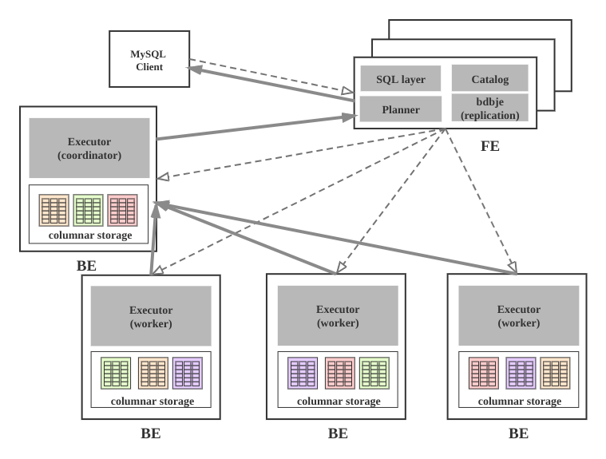
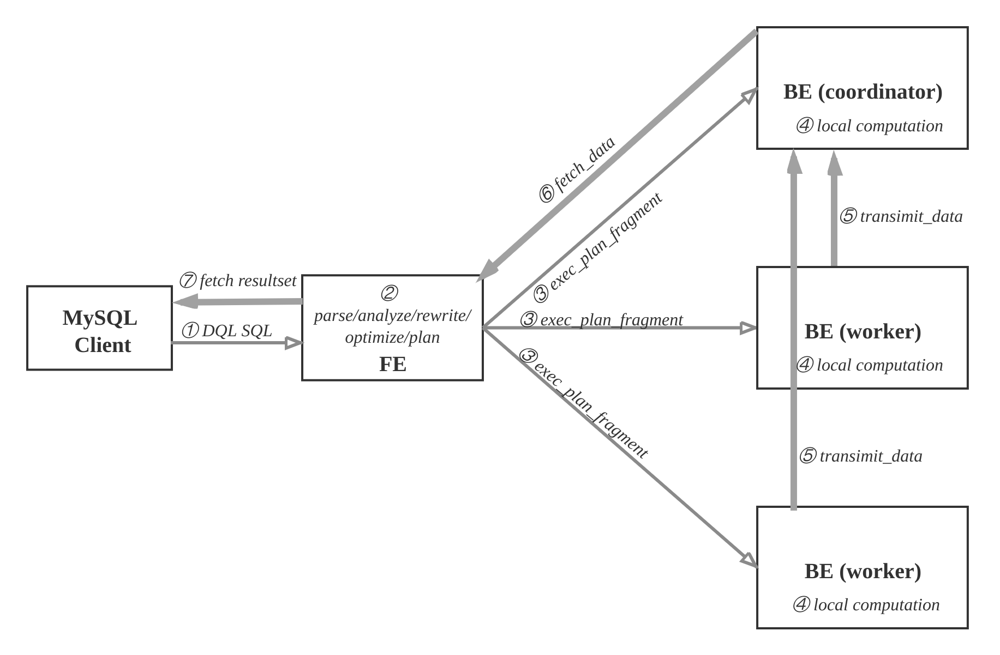
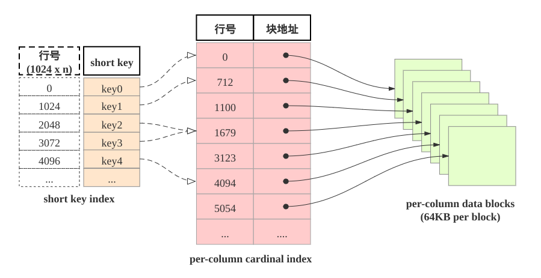

## Doris

## 基础

> 导读：http://doc.dorisdb.com

### 1.基本概念

- FE：FrontEnd DorisDB的前端节点，负责管理元数据，管理客户端连接，进行查询规划，查询调度等工作。
- BE：BackEnd DorisDB的后端节点，负责数据存储，计算执行，以及compaction，副本管理等工作。
- Broker：DorisDB中和外部HDFS/对象存储等外部数据对接的中转服务，辅助提供导入导出功能。
- DorisManager：DorisDB 管理工具，提供DorisDB集群管理、在线查询、故障查询、监控报警的可视化工具。
- Tablet：DorisDB 表的逻辑分片，也是DorisDB中副本管理的基本单位，每个表根据分区和分桶机制被划分成多个Tablet存储在不同BE节点上。

 

### 2.**组件介绍**

DorisDB集群由FE和BE构成, 可以使用MySQL客户端访问DorisDB集群。

**FE**

FE接收MySQL客户端的连接, 解析并执行SQL语句。

- 管理元数据, 执行SQL DDL命令, 用Catalog记录库, 表, 分区, tablet副本等信息。
- FE高可用部署, 使用复制协议选主和主从同步元数据, 所有的元数据修改操作, 由FE leader节点完成, FE follower节点可执行读操作。 元数据的读写满足顺序一致性。  FE的节点数目采用2n+1, 可容忍n个节点故障。  当FE leader故障时, 从现有的follower节点重新选主, 完成故障切换。
- FE的SQL layer对用户提交的SQL进行解析, 分析, 改写, 语义分析和关系代数优化, 生产逻辑执行计划。
- FE的Planner负责把逻辑计划转化为可分布式执行的物理计划, 分发给一组BE。
- FE监督BE, 管理BE的上下线, 根据BE的存活和健康状态, 维持tablet副本的数量。
- FE协调数据导入, 保证数据导入的一致性。

**BE**

- BE管理tablet副本, tablet是table经过分区分桶形成的子表, 采用列式存储。
- BE受FE指导, 创建或删除子表。
- BE接收FE分发的物理执行计划并指定BE coordinator节点, 在BE coordinator的调度下, 与其他BE worker共同协作完成执行。
- BE读本地的列存储引擎获取数据,并通过索引和谓词下沉快速过滤数据。
- BE后台执行compact任务, 减少查询时的读放大。
- 数据导入时, 由FE指定BE coordinator, 将数据以fanout的形式写入到tablet多副本所在的BE上。

### 3.数据流和控制流

**查询** 

用户可使用MySQL客户端连接FE，执行SQL查询， 获得结果。查询流程如下：

- ① MySQL客户端执行DQL SQL命令。
- ② FE解析, 分析, 改写, 优化和规划, 生成分布式执行计划。
- ③ 分布式执行计划由 若干个可在单台be上执行的plan fragment构成， FE执行exec_plan_fragment, 将plan fragment分发给BE，并指定其中一台BE为coordinator。
- ④ BE执行本地计算, 比如扫描数据。
- ⑤ 其他BE调用transimit_data将中间结果发送给BE coordinator节点汇总为最终结果。
- ⑥ FE调用fetch_data获取最终结果。
- ⑦ FE将最终结果发送给MySQL client。

 

### 4. 表设计

#### **4.1 列式存储**  

 

DorisDB的表和关系型数据相同, 由行和列构成. 每行数据对应用户一条记录, 每列数据有相同数据类型. 所有数据行的列数相同, 可以动态增删列.  DorisDB中, 一张表的列可以分为维度列(也成为key列)和指标列(value列), 维度列用于分组和排序, 指标列可通过聚合函数SUM, COUNT, MIN, MAX, REPLACE, HLL_UNION, BITMAP_UNION等累加起来. 因此, DorisDB的表也可以认为是多维的key到多维指标的映射.

在DorisDB中, 表中数据按列存储, 物理上, 一列数据会经过分块编码压缩等操作, 然后持久化于非易失设备, 但在逻辑上, 一列数据可以看成由相同类型的元素构成的数组.  一行数据的所有列在各自的列数组中保持对齐, 即拥有相同的数组下标, 该下标称之为序号或者行号. 该序号是隐式, 不需要存储的, 表中的所有行按照维度列, 做多重排序, 排序后的位置就是该行的行号.

查询时, 如果指定了维度列的等值条件或者范围条件, 并且这些条件中维度列可构成表维度列的前缀, 则可以利用数据的有序性, 使用range-scan快速锁定目标行. 

例如: 对于表table1: (event_day, siteid, citycode, username)➜(pv); 

- 当查询条件为event_day > 2020-09-18 and siteid = 2, 则可以使用范围查找; 
- 如果指定条件为citycode = 4 and username in ["Andy", "Boby", "Christian", "DorisDB"], 则无法使用范围查找.

#### 4.2 稀疏索引

当范围查找时, 如何快速地找到起始的目标行呢? 答案是shortkey index. 如下图所示: shortkey索引为稀疏索引,

 

表中数据组织有主要由三部分构成:

1. shortkey index表:  表中数据每1024行, 构成一个逻辑block. 每个逻辑block在shortkey index表中存储一项索引, 内容为表的维度列的前缀, 并且不超过36字节.  shortkey index为稀疏索引, 用数据行的维度列的前缀查找索引表, 可以确定该行数据所在逻辑块的起始行号.
2. Per-column data block: 表中每一列数据按64KB分块存储,  数据块作为一个单位单独编码压缩, 也作为IO单位, 整体写回设备或者读出.
3. Per-column cardinal index:  表中的每列数据有各自的行号索引表,  列的数据块和行号索引项一一对应, 索引项由数据块的起始行号和数据块的位置和长度信息构成, 用数据行的行号查找行号索引表, 可以获取包含该行号的数据块所在位置, 读取目标数据块后, 可以进一步查找数据.

由此可见, 查找维度列的前缀的查找过程为:  先查找shortkey index, 获得逻辑块的起始行号, 查找维度列的行号索引, 获得目标列的数据块, 读取数据块, 然后解压解码, 从数据块中找到维度列前缀对应的数据项.

#### 4.3 加速数据处理

1. 预先聚合:  DorisDB支持聚合模型, 维度列取值相同数据行可合并一行, 合并后数据行的维度列取值不变, 指标列的取值为这些数据行的聚合结果, 用户需要给指标列指定聚合函数.  通过预先聚合, 可以加速聚合操作.
2. 分区分桶:  事实上DorisDB的表被划分成tablet, 每个tablet多副本冗余存储在BE上, BE和tablet的数量可以根据计算资源和数据规模而弹性伸缩. 查询时, 多台BE可并行地查找tablet快速获取数据. 此外, tablet的副本可复制和迁移, 增强了数据的可靠性, 避免了数据倾斜. 总之, 分区分桶保证了数据访问的高效性和稳定性.
3. RollUp表索引: shortkey index可加速数据查找, 然后shortkey index依赖维度列排列次序. 如果使用非前缀的维度列构造查找谓词, 则无法使用shortkey index. 用户可以为数据表创建若干RollUp表索引, RollUp表索引的数据组织和存储和数据表相同, 但RollUp表拥有自身的shortkey index. 用户创建RollUp表索引时, 可选择聚合的粒度, 列的数量, 维度列的次序; 使频繁使用的查询条件能够命中相应的RollUp表索引.
4. 列级别的索引技术:  Bloomfilter可快速判断数据块中不含所查找值, ZoneMap通过数据范围快速过滤待查找值, Bitmap索引可快速计算出枚举类型的列满足一定条件的行.

#### 4.4. 数据分布

> 名词解释

- **数据分布**：数据分布是将数据划分为子集, 按一定规则, 均衡地分布在不同节点上，以期最大限度地利用集群的并发性能。
- **短查询**：short-scan query，指扫描数据量不大，单机就能完成扫描的查询。
- **长查询**：long-scan query，指扫描数据量大，多机并行扫描能显著提升性能的查询。

​               

- **Round-Robin** : 以轮转的方式把数据逐个放置在相邻节点上。
- **Range** : 按区间进行数据分布，图中区间[1-3]，[4-6]分别对应不同Range。
- **List** : 直接基于离散的各个取值做数据分布，性别、省份等数据就满足这种离散的特性。每个离散值会映射到一个节点上，不同的多个取值可能也会映射到相同节点上。
- **Hash** : 按哈希函数把数据映射到不同节点上。

为了更灵活地划分数据，现代分布式数据库除了单独采用上述四种数据分布方式之外，也会视情况采用组合数据分布。常见的组合方式有Hash-Hash、Range-Hash、Hash-List。

#### 4.5  分区列如何选择

#### 4.6  分桶列如何选择

#### 4.7  分桶数如何确定

相关文章：

1. http://doc.dorisdb.com/2142135

## 技术核心

### 1. 最佳实践

对于DorisDB而言，分区和分桶的选择是非常关键的。在建表时选择好的分区分桶列，可以有效提高集群整体性能。当然，在使用过程中，也需考虑业务情况，根据业务情况进行调整。

以下是针对特殊应用场景下，对分区和分桶选择的一些建议：

- **数据倾斜**：业务方如果确定数据有很大程度的倾斜，那么建议采用多列组合的方式进行数据分桶，而不是只单独采用倾斜度大的列做分桶。
- **高并发**：分区和分桶应该尽量覆盖查询语句所带的条件，这样可以有效减少扫描数据，提高并发。
- **高吞吐**：尽量把数据打散，让集群以更高的并发扫描数据，完成相应计算。

