## 大数据技术之Flink

## 1. Flink 初识

**Apache Flink® - 数据流上的有状态计算** 

> 资料来源

1. 官网文档：https://flink.apache.org/zh/
2. 专题笔记：http://www.54tianzhisheng.cn/2018/10/13/flink-introduction/

### 1.1 Flink 介绍

#### 1.1.1 前言

Apache Flink 是一个Flink 是一种流式计算框架和分布式处理引擎，用于在*无边界和有边界*数据流上进行有状态的计算。Flink 能在所有常见集群环境中运行，并能以内存速度和任意规模进行计算。为什么我会接触到 Flink 呢？

因为我目前负责的是日志采集并分析后辅助RD定位问题的部分，负责采集到的日志往kafka里塞，然后监控这边从 kafka topic 里面实时读取到日志数据，并将读取到的日志数据做一些 聚合/转换/计算 等操作，然后存入hbase,供后续筛选和过滤；

 
我们的目的无非就是希望我们能够尽早的发现问题，把问题存起来，这样开发和运维人员才能够及时的处理解决好线上的问题，以免给公司造成巨大的损失。


> 数据集类型有哪些呢：

- 无穷数据集：无穷的持续集成的数据集合
  - 用户与客户端的实时交互数据
  - 应用实时产生的日志
  - 金融市场的实时交易记录
- 有界数据集：有限不会改变的数据集合

> 数据运算模型有哪些呢：

- 流式：只要数据一直在产生，计算就持续地进行
- 批处理：在预先定义的时间内运行计算，当完成时释放计算机资源

Flink 它可以处理有界的数据集、也可以处理无界的数据集、它可以流式的处理数据、也可以批量的处理数据。

#### 1.1.2 什么是Flink?

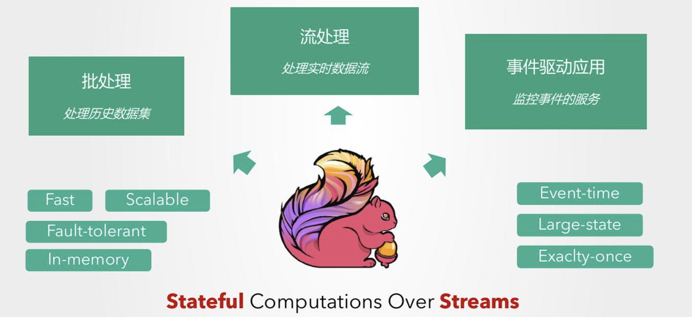 

> Flink 整体架构

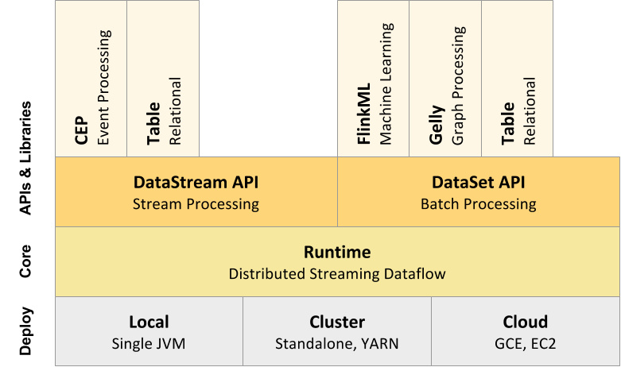 

从下至上：

1. 部署：Flink 支持本地运行、能在独立集群或者在被 YARN 或 Mesos 管理的集群上运行， 也能部署在云上。

2. 运行：Flink 的核心是分布式流式数据引擎，意味着数据以一次一个事件的形式被处理。

3. API：DataStream、DataSet、Table、SQL API。

4. 扩展库：Flink 还包括用于复杂事件处理，机器学习，图形处理和 Apache Storm 兼容性的专用代码库。

> Flink 数据流编程模型

Flink 提供了不同的抽象级别以开发流式或批处理应用。

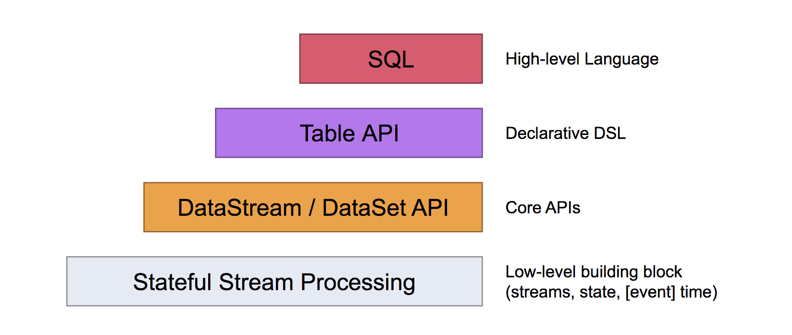 

- 最底层提供了有状态流。它将通过 过程函数（Process Function）嵌入到 DataStream API 中。它允许用户可以自由地处理来自一个或多个流数据的事件，并使用一致、容错的状态。除此之外，用户可以注册事件时间和处理事件回调，从而使程序可以实现复杂的计算。

- DataStream / DataSet API 是 Flink 提供的核心 API ，DataSet 处理有界的数据集，DataStream 处理有界或者无界的数据流。用户可以通过各种方法（map / flatmap / window / keyby / sum / max / min / avg / join 等）将数据进行转换 / 计算。

- **Table API** 是以 *表* 为中心的声明式 DSL，其中表可能会动态变化（在表达流数据时）。Table API 提供了例如 select、project、join、group-by、aggregate 等操作，使用起来却更加简洁（代码量更少）。

  你可以在表与 *DataStream*/*DataSet* 之间无缝切换，也允许程序将 *Table API* 与 *DataStream* 以及 *DataSet* 混合使用。

- Flink 提供的最高层级的抽象是 **SQL** 。这一层抽象在语法与表达能力上与 *Table API* 类似，但是是以 SQL查询表达式的形式表现程序。SQL 抽象与 Table API 交互密切，同时 SQL 查询可以直接在 Table API 定义的表上执行。

> Flink 程序与数据流结构

 

Flink 应用程序结构就是如上图所示：

- **Source: 数据源**，Flink 在流处理和批处理上的 source 大概有 4 类：基于本地集合的 source、基于文件的 source、基于网络套接字的 source、自定义的 source。自定义的 source 常见的有 Apache kafka、Amazon Kinesis Streams、RabbitMQ、Twitter Streaming API、Apache NiFi 等，当然你也可以定义自己的 source。
- **Transformation**：数据转换的各种操作，有 Map / FlatMap / Filter / KeyBy / Reduce / Fold / Aggregations / Window / WindowAll / Union / Window join / Split / Select / Project 等，操作很多，可以将数据转换计算成你想要的数据。
- **Sink**：接收器，Flink 将转换计算后的数据发送的地点 ，你可能需要存储下来，Flink 常见的 Sink 大概有如下几类：写入文件、打印出来、写入 socket 、自定义的 sink 。自定义的 sink 常见的有 Apache kafka、RabbitMQ、MySQL、ElasticSearch、Apache Cassandra、Hadoop FileSystem 等，同理你也可以定义自己的 sink。

#### 1.1.3 为什么选择flink?

> Flink 是一个开源的分布式流式处理框架：

- 提供准确的结果，甚至在出现无序或者延迟加载的数据的情况下。
- 它是状态化的容错的，同时在维护一次完整的的应用状态时，能无缝修复错误。
- 大规模运行，在上千个节点运行时有很好的吞吐量和低延迟。

更早的时候，我们讨论了数据集类型（有界 vs 无穷）和运算模型（批处理 vs 流式）的匹配。Flink 的流式计算模型启用了很多功能特性，如状态管理，处理无序数据，灵活的视窗，这些功能对于得出无穷数据集的精确结果是很重要的。

- Flink 保证状态化计算强一致性。”状态化“意味着应用可以维护随着时间推移已经产生的数据聚合或者，并且 Filnk 的检查点机制在一次失败的事件中一个应用状态的强一致性。

- Flink 支持流式计算和带有事件时间语义的视窗。事件时间机制使得那些事件无序到达甚至延迟到达的数据流能够计算出精确的结果。

  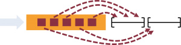 

- 除了提供数据驱动的视窗外，Flink 还支持基于时间，计数，session 等的灵活视窗。视窗能够用灵活的触发条件定制化从而达到对复杂的流传输模式的支持。Flink 的视窗使得模拟真实的创建数据的环境成为可能。

   

- Flink 的容错能力是轻量级的，允许系统保持高并发，同时在相同时间内提供强一致性保证。Flink 以零数据丢失的方式从故障中恢复，但没有考虑可靠性和延迟之间的折衷。

  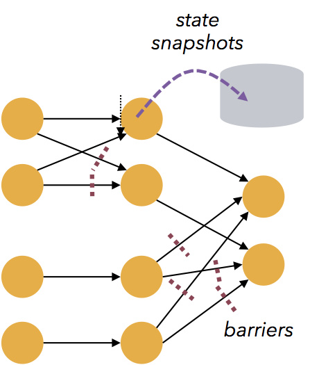 

- Flink 能满足高并发和低延迟（计算大量数据很快）。

- Flink 保存点提供了一个状态化的版本机制，使得能以无丢失状态和最短停机时间的方式更新应用或者回退历史数据。

  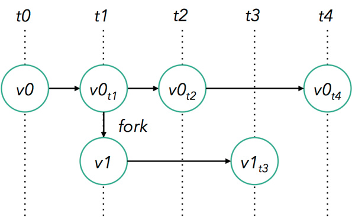 

- Flink 被设计成能用上千个点在大规模集群上运行。除了支持独立集群部署外，Flink 还支持 YARN 和Mesos 方式部署。

- Flink 的程序内在是并行和分布式的，数据流可以被分区成 **stream partitions**，operators 被划分为operator subtasks; 这些 subtasks 在不同的机器或容器中分不同的线程独立运行；operator subtasks 的数量在具体的 operator 就是并行计算数，程序不同的 operator 阶段可能有不同的并行数；如下图所示，source operator 的并行数为 2，但最后的 sink operator 为1；
  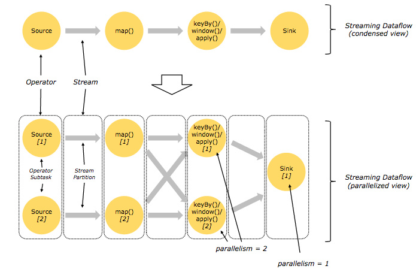 

- Flink 在 JVM 中提供了自己的内存管理，使其独立于 Java 的默认垃圾收集器。 它通过使用散列，索引，缓存和排序有效地进行内存管理。
- Flink 拥有丰富的库来进行机器学习，图形处理，关系数据处理等。 由于其架构，很容易执行复杂的事件处理和警报。

#### 1.1.4 分布式运行

> flink 作业提交架构流程

 

- **Program Code**：我们编写的 Flink 应用程序代码

- **Job Client**：Job Client 不是 Flink 程序执行的内部部分，但它是任务执行的起点。 Job Client 负责接受用户的程序代码，然后创建数据流，将数据流提交给 Job Manager 以便进一步执行。 执行完成后，Job Client 将结果返回给用户

  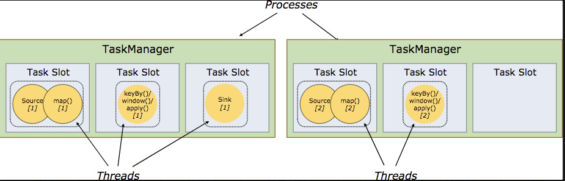 

- **Job Manager**：主进程（也称为作业管理器）协调和管理程序的执行。 它的主要职责包括安排任务，管理checkpoint ，故障恢复等。机器集群中至少要有一个 master，master 负责调度 task，协调 checkpoints 和容灾，高可用设置的话可以有多个 master，但要保证一个是 leader, 其他是 standby; Job Manager 包含 Actor system、Scheduler、Check pointing 三个重要的组件

- **Task Manager**：从 Job Manager 处接收需要部署的 Task。Task Manager 是在 JVM 中的一个或多个线程中执行任务的工作节点。 任务执行的并行性由每个 Task Manager 上可用的任务槽决定。 每个任务代表分配给任务槽的一组资源。 例如，如果 Task Manager 有四个插槽，那么它将为每个插槽分配 25％ 的内存。 可以在任务槽中运行一个或多个线程。 同一插槽中的线程共享相同的 JVM。 同一 JVM 中的任务共享 TCP 连接和心跳消息。Task Manager 的一个 Slot 代表一个可用线程，该线程具有固定的内存，注意 Slot 只对内存隔离，没有对 CPU 隔离。默认情况下，Flink 允许子任务共享 Slot，即使它们是不同 task 的 subtask，只要它们来自相同的 job。这种共享可以有更好的资源利用率。

  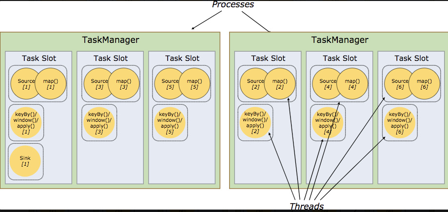 

- 

### 1.2 Flink 应用场景

> 常见的应用场景主要：

- 事件驱动应用
- 数据分析应用
- 数据管道应用

#### 1.2.1 事件驱动型应用

事件驱动型应用是一类具有状态的应用，它从一个或多个事件流提取数据，并根据到来的事件触发计算、状态更新或其他外部动作。事件驱动型应用是在计算存储分离的传统应用基础上进化而来。在传统架构中，应用需要读写远程事务型数据库。相反，事件驱动型应用是基于状态化流处理来完成。在该设计中，数据和计算不会分离，应用只需访问本地（内存或磁盘）即可获取数据。系统容错性的实现依赖于定期向远程持久化存储写入 checkpoint。下图描述了传统应用和事件驱动型应用架构的区别。

 

####  1.2.2 数据分析应用

数据分析任务需要从原始数据中提取有价值的信息和指标。传统的分析方式通常是利用批查询，或将事件记录下来并基于此有限数据集构建应用来完成。为了得到最新数据的分析结果，必须先将它们加入分析数据集并重新执行查询或运行应用，随后将结果写入存储系统或生成报告。

借助一些先进的流处理引擎，还可以实时地进行数据分析。和传统模式下读取有限数据集不同，流式查询或应用会接入实时事件流，并随着事件消费持续产生和更新结果。这些结果数据可能会写入外部数据库系统或以内部状态的形式维护。仪表展示应用可以相应地从外部数据库读取数据或直接查询应用的内部状态。

 

**流式数据分析的优势** 

和批量分析相比，由于流式分析省掉了周期性的数据导入和查询过程，因此从事件中获取指标的延迟更低。不仅如此，批量查询必须处理那些由定期导入和输入有界性导致的人工数据边界，而流式查询则无须考虑该问题。

另一方面，流式分析会简化应用抽象。批量查询的流水线通常由多个独立部件组成，需要周期性地调度提取数据和执行查询。如此复杂的流水线操作起来并不容易，一旦某个组件出错将会影响流水线的后续步骤。而流式分析应用整体运行在 Flink 之类的高端流处理系统之上，涵盖了从数据接入到连续结果计算的所有步骤，因此可以依赖底层引擎提供的故障恢复机制。

**Flink 如何支持数据分析类应用？** 

Flink 为持续流式分析和批量分析都提供了良好的支持。具体而言，它内置了一个符合 ANSI 标准的 SQL 接口，将批、流查询的语义统一起来。无论是在记录事件的静态数据集上还是实时事件流上，相同 SQL 查询都会得到一致的结果。同时 Flink 还支持丰富的用户自定义函数，允许在 SQL 中执行定制化代码。如果还需进一步定制逻辑，可以利用 Flink DataStream API 和 DataSet API 进行更低层次的控制。此外，Flink 的 Gelly 库为基于批量数据集的大规模高性能图分析提供了算法和构建模块支持。

#### 1.2.3 数据管道应用

**（1）什么是数据管道？** 

提取-转换-加载（ETL）是一种在存储系统之间进行数据转换和迁移的常用方法。ETL 作业通常会周期性地触发，将数据从事务型数据库拷贝到分析型数据库或数据仓库。

数据管道和 ETL 作业的用途相似，都可以转换、丰富数据，并将其从某个存储系统移动到另一个。但数据管道是以持续流模式运行，而非周期性触发。因此它支持从一个不断生成数据的源头读取记录，并将它们以低延迟移动到终点。例如：数据管道可以用来监控文件系统目录中的新文件，并将其数据写入事件日志；另一个应用可能会将事件流物化到数据库或增量构建和优化查询索引。

 

**（2）数据管道的优势？** 

和周期性 ETL 作业相比，持续数据管道可以明显降低将数据移动到目的端的延迟。此外，由于它能够持续消费和发送数据，因此用途更广，支持用例更多。

**（3）Flink 如何支持数据管道应用？** 

很多常见的数据转换和增强操作可以利用 Flink 的 SQL 接口（或 Table API）及用户自定义函数解决。如果数据管道有更高级的需求，可以选择更通用的 DataStream API 来实现。Flink 为多种数据存储系统（如：Kafka、Kinesis、Elasticsearch、JDBC数据库系统等）内置了连接器。同时它还提供了文件系统的连续型数据源及数据汇，可用来监控目录变化和以时间分区的方式写入文件。

### 1.3 搭建 Flink 环境

> 来源：https://ci.apache.org/projects/flink/flink-docs-release-1.12/zh/try-flink/local_installation.html

#### 1.3.1  Mac 上搭建 Flink 环境

> 准备工作

- 安装查看 Java 的版本号，推荐使用 Java 8。

**（1）安装 Flink** 

在 Mac OS X 上安装 Flink 是非常方便的。推荐通过 homebrew 来安装

```bash
brew install apache-flink
```

**（2）检查安装** 

```bash
flink --version

预计结果：
Version: 1.12.2, Commit ID: 4dedee0
```

**（3）启动Flink** 

```powershell
wxw@wxw  /usr/local/Cellar/apache-flink/1.12.2/libexec/bin  ./start-cluster.sh
Starting cluster.
Starting standalonesession daemon on host wxw.
Starting taskexecutor daemon on host wxw.

注意：没有权限时，需要切换到root账户启动
```

接着就可以进入 web 页面(http://localhost:8081/) 查看

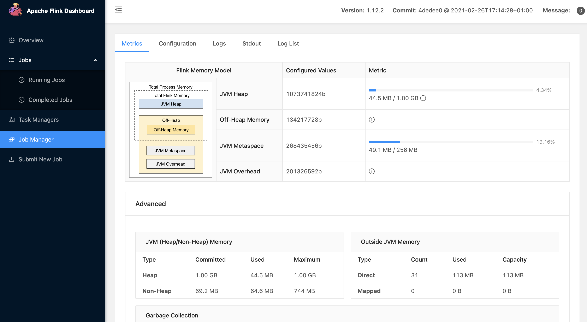 

**（4）提交作业（job）** 

Flink 的 Releases 附带了许多的示例作业。你可以任意选择一个，快速部署到已运行的集群上。

```powershell
$ ./bin/flink run examples/streaming/WordCount.jar
$ tail log/flink-*-taskexecutor-*.out
  (to,1)
  (be,1)
  (or,1)
  (not,1)
  (to,2)
  (be,2)
```

**（5）关闭Flink** 

```powershell
指定安装目录下 /usr/local/Cellar/apache-flink/1.12.2/libexec/bin
./stop-cluster.sh

预期结果：
Stopping taskexecutor daemon (pid: 5404) on host MacdeMacBook-Pro.local.
Stopping standalonesession daemon (pid: 5157) on host MacdeMacBook-Pro.local.
```

#### 1.3.2 Flink 详细配置

> 资料来源：https://ci.apache.org/projects/flink/flink-docs-release-1.12/deployment/config.html

> 安装目录下主要有 flink-conf.yaml 配置、日志的配置文件、zk 配置、Flink SQL Client 配置。

```bash
/usr/local/Cellar/apache-flink/1.12.2/libexec/conf
mac@MacdeMacBook-Pro conf % ls -l
total 120
-rw-r--r--  1 mac  admin  10343  2 23 04:42 flink-conf.yaml
-rw-r--r--  1 mac  admin   2761  2 23 04:42 log4j-cli.properties
-rw-r--r--  1 mac  admin   2967  2 23 04:42 log4j-console.properties
-rw-r--r--  1 mac  admin   1967  2 23 04:42 log4j-session.properties
-rw-r--r--  1 mac  admin   2620  2 23 04:42 log4j.properties
-rw-r--r--  1 mac  admin   2740  2 16 19:24 logback-console.xml
-rw-r--r--  1 mac  admin   1550  2 16 19:24 logback-session.xml
-rw-r--r--  1 mac  admin   2331  6 11  2020 logback.xml
-rw-r--r--  1 mac  admin     15  6 11  2020 masters
-rw-r--r--  1 mac  admin   5441  2 27 04:48 sql-client-defaults.yaml
-rw-r--r--  1 mac  admin     10  2 16 19:24 workers
-rw-r--r--  1 mac  admin   1434  6 11  2020 zoo.cfg
```

**（1）flink-conf.yaml** 

```bash
#==============================================================================
# Common 公共基础配置
#==============================================================================

# The external address of the host on which the JobManager runs and can be
# reached by the TaskManagers and any clients which want to connect. This setting
# is only used in Standalone mode and may be overwritten on the JobManager side
# by specifying the --host <hostname> parameter of the bin/jobmanager.sh executable.
# In high availability mode, if you use the bin/start-cluster.sh script and setup
# the conf/masters file, this will be taken care of automatically. Yarn/Mesos
# automatically configure the host name based on the hostname of the node where the
# JobManager runs.

# jobManager 的IP地址
jobmanager.rpc.address: localhost

# The RPC port where the JobManager is reachable.
# JobManager 的端口号
jobmanager.rpc.port: 6123


# The total process memory size for the JobManager.
# 
# Note this accounts for all memory usage within the JobManager process, including JVM metaspace and other overhead.

jobmanager.memory.process.size: 1600m


# The total process memory size for the TaskManager.
#
# Note this accounts for all memory usage within the TaskManager process, including JVM metaspace and other overhead.

taskmanager.memory.process.size: 1728m

# To exclude JVM metaspace and overhead, please, use total Flink memory size instead of 'taskmanager.memory.process.size'.
# It is not recommended to set both 'taskmanager.memory.process.size' and Flink memory.
#
# taskmanager.memory.flink.size: 1280m

# The number of task slots that each TaskManager offers. Each slot runs one parallel pipeline.
# 每个 TaskManager 提供的任务 slots 数量大小
taskmanager.numberOfTaskSlots: 1

# The parallelism used for programs that did not specify and other parallelism.
# 程序默认并行计算的个数
parallelism.default: 1

# The default file system scheme and authority.
#
# By default file paths without scheme are interpreted relative to the local
# root file system 'file:///'. Use this to override the default and interpret
# relative paths relative to a different file system,
# for example 'hdfs://mynamenode:12345'
# 文件系统来源
# fs.default-scheme

#==============================================================================
# High Availability 高可用配置
#==============================================================================

# The high-availability mode. Possible options are 'NONE' or 'zookeeper'.
# 可以选择 'NONE' 或者 'zookeeper'.
# high-availability: zookeeper

# The path where metadata for master recovery is persisted. While ZooKeeper stores
# the small ground truth for checkpoint and leader election, this location stores
# the larger objects, like persisted dataflow graphs.
#
# Must be a durable file system that is accessible from all nodes
# (like HDFS, S3, Ceph, nfs, ...)
# 文件系统路径，让 Flink 在高可用性设置中持久保存元数据
# high-availability.storageDir: hdfs:///flink/ha/

# The list of ZooKeeper quorum peers that coordinate the high-availability
# setup. This must be a list of the form:
# "host1:clientPort,host2:clientPort,..." (default clientPort: 2181)
# zookeeper 集群中仲裁者的机器 ip 和 port 端口号
# high-availability.zookeeper.quorum: localhost:2181


# ACL options are based on https://zookeeper.apache.org/doc/r3.1.2/zookeeperProgrammers.html#sc_BuiltinACLSchemes
# It can be either "creator" (ZOO_CREATE_ALL_ACL) or "open" (ZOO_OPEN_ACL_UNSAFE)
# The default value is "open" and it can be changed to "creator" if ZK security is enabled
# 默认是 open，如果 zookeeper security 启用了该值会更改成 creator
# high-availability.zookeeper.client.acl: open

#==============================================================================
# Fault tolerance and checkpointing 容错和检查点 配置
#==============================================================================

# The backend that will be used to store operator state checkpoints if
# checkpointing is enabled.
#
# Supported backends are 'jobmanager', 'filesystem', 'rocksdb', or the
# <class-name-of-factory>.
# 用于存储和检查点状态
# state.backend: filesystem

# Directory for checkpoints filesystem, when using any of the default bundled
# state backends.
# 存储检查点的数据文件和元数据的默认目录
# state.checkpoints.dir: hdfs://namenode-host:port/flink-checkpoints

# Default target directory for savepoints, optional.
# savepoints 的默认目标目录(可选)
# state.savepoints.dir: hdfs://namenode-host:port/flink-savepoints

# Flag to enable/disable incremental checkpoints for backends that
# support incremental checkpoints (like the RocksDB state backend).
# 用于启用/禁用增量 checkpoints 的标志
# state.backend.incremental: false

# The failover strategy, i.e., how the job computation recovers from task failures.
# Only restart tasks that may have been affected by the task failure, which typically includes
# downstream tasks and potentially upstream tasks if their produced data is no longer available for consumption.

jobmanager.execution.failover-strategy: region

#==============================================================================
# Rest & web frontend ｜｜ web 前端配置
#==============================================================================

# The port to which the REST client connects to. If rest.bind-port has
# not been specified, then the server will bind to this port as well.
# Web 的运行时监视器端口
#rest.port: 8081

# The address to which the REST client will connect to
# 基于 Web 的运行时监视器侦听的地址.
#rest.address: 0.0.0.0

# Port range for the REST and web server to bind to.
#
#rest.bind-port: 8080-8090

# The address that the REST & web server binds to
#
#rest.bind-address: 0.0.0.0

# Flag to specify whether job submission is enabled from the web-based
# runtime monitor. Uncomment to disable.
# 是否从基于 Web 的 jobmanager 启用作业提交
#web.submit.enable: false

#==============================================================================
# Advanced 高级配置
#==============================================================================

# Override the directories for temporary files. If not specified, the
# system-specific Java temporary directory (java.io.tmpdir property) is taken.
#
# For framework setups on Yarn or Mesos, Flink will automatically pick up the
# containers' temp directories without any need for configuration.
#
# Add a delimited list for multiple directories, using the system directory
# delimiter (colon ':' on unix) or a comma, e.g.:
#     /data1/tmp:/data2/tmp:/data3/tmp
#
# Note: Each directory entry is read from and written to by a different I/O
# thread. You can include the same directory multiple times in order to create
# multiple I/O threads against that directory. This is for example relevant for
# high-throughput RAIDs.
#
# io.tmp.dirs: /tmp

# The classloading resolve order. Possible values are 'child-first' (Flink's default)
# and 'parent-first' (Java's default).
#
# Child first classloading allows users to use different dependency/library
# versions in their application than those in the classpath. Switching back
# to 'parent-first' may help with debugging dependency issues.
# 类加载解析顺序，是先检查用户代码 jar（“child-first”）还是应用程序类路径（“parent-first”）。 
# 默认设置指示首先从用户代码 jar 加载类
# classloader.resolve-order: child-first

# The amount of memory going to the network stack. These numbers usually need
# no tuning. Adjusting them may be necessary in case of an "Insufficient number
# of network buffers" error. The default min is 64MB, the default max is 1GB.
# 用于网络缓冲区的 JVM 内存的分数。 这决定了 TaskManager 可以同时拥有多少流数据交换通道以及通道缓冲的程度。
# 如果作业被拒绝或者您收到系统没有足够缓冲区的警告，请增加此值或下面的最小/最大值。
# 另请注意，“taskmanager.network.memory.min”和“taskmanager.network.memory.max”可能会覆盖此分数

# taskmanager.memory.network.fraction: 0.1
# taskmanager.memory.network.min: 64mb
# taskmanager.memory.network.max: 1gb

#==============================================================================
# Flink Cluster Security Configuration Flink 集群安全配置
#==============================================================================

# Kerberos authentication for various components - Hadoop, ZooKeeper, and connectors -
# may be enabled in four steps:
# 1. configure the local krb5.conf file
# 2. provide Kerberos credentials (either a keytab or a ticket cache w/ kinit)
# 3. make the credentials available to various JAAS login contexts
# 4. configure the connector to use JAAS/SASL

# The below configure how Kerberos credentials are provided. A keytab will be used instead of
# a ticket cache if the keytab path and principal are set.
# 指示是否从 Kerberos ticket 缓存中读取
# security.kerberos.login.use-ticket-cache: true
# 包含用户凭据的 Kerberos 密钥表文件的绝对路径
# security.kerberos.login.keytab: /path/to/kerberos/keytab
# 与 keytab 关联的 Kerberos 主体名称
# security.kerberos.login.principal: flink-user

# The configuration below defines which JAAS login contexts
# 以逗号分隔的登录上下文列表，用于提供 Kerberos 凭据（例如，`Client，KafkaClient`
# 使用凭证进行 ZooKeeper 身份验证和 Kafka 身份验证）
# security.kerberos.login.contexts: Client,KafkaClient

#==============================================================================
# ZK Security Configuration Zookeeper 安全配置
#==============================================================================

# Below configurations are applicable if ZK ensemble is configured for security

# Override below configuration to provide custom ZK service name if configured
# 覆盖以下配置以提供自定义 ZK 服务名称
# zookeeper.sasl.service-name: zookeeper

# The configuration below must match one of the values set in "security.kerberos.login.contexts"
# 该配置必须匹配 "security.kerberos.login.contexts" 中的列表（含有一个）
# zookeeper.sasl.login-context-name: Client

#==============================================================================
# HistoryServer
#==============================================================================

# 你可以通过 bin/historyserver.sh (start|stop) 命令启动和关闭 HistoryServer
# The HistoryServer is started and stopped via bin/historyserver.sh (start|stop)

# Directory to upload completed jobs to. Add this directory to the list of
# monitored directories of the HistoryServer as well (see below).

# 将已完成的作业上传到的目录
#jobmanager.archive.fs.dir: hdfs:///completed-jobs/

# The address under which the web-based HistoryServer listens.
#  基于 Web 的 HistoryServer 的地址
#historyserver.web.address: 0.0.0.0

# The port under which the web-based HistoryServer listens.
# 基于 Web 的 HistoryServer 的端口号
#historyserver.web.port: 8082

# Comma separated list of directories to monitor for completed jobs.
# 以逗号分隔的目录列表，用于监视已完成的作业
#historyserver.archive.fs.dir: hdfs:///completed-jobs/

# Interval in milliseconds for refreshing the monitored directories.
#  刷新受监控目录的时间间隔（以毫秒为单位）
#historyserver.archive.fs.refresh-interval: 10000
```

**（2）zoo.cfg** 

```bash
# The number of milliseconds of each tick 每个 tick 的毫秒数
tickTime=2000

# The number of ticks that the initial  synchronization phase can take
# 初始同步阶段可以采用的 tick 数
initLimit=10

# The number of ticks that can pass between  sending a request and getting an acknowledgement
# 在发送请求和获取确认之间可以传递的 tick 数
syncLimit=5

# The directory where the snapshot is stored.
# 存储快照的目录
# dataDir=/tmp/zookeeper

# The port at which the clients will connect
# 客户端将连接的端口
clientPort=2181

# ZooKeeper quorum peers
server.1=localhost:2888:3888
# server.2=host:peer-port:leader-port
```

**（3）日志配置** 

Flink 在不同平台下运行的日志文件

```bash
log4j-cli.properties
log4j-console.properties
log4j-yarn-session.properties
log4j.properties
logback-console.xml
logback-yarn.xml
logback.xml
```

**（4）sql-client-defaults.yaml** 

```yaml
# This file defines the default environment for Flink's SQL Client.
# Defaults might be overwritten by a session specific environment.


# See the Table API & SQL documentation for details about supported properties.


#==============================================================================
# Tables
#==============================================================================

# Define tables here such as sources, sinks, views, or temporal tables.

tables: [] # empty list
# A typical table source definition looks like:
# - name: ...
#   type: source-table
#   connector: ...
#   format: ...
#   schema: ...

# A typical view definition looks like:
# - name: ...
#   type: view
#   query: "SELECT ..."

# A typical temporal table definition looks like:
# - name: ...
#   type: temporal-table
#   history-table: ...
#   time-attribute: ...
#   primary-key: ...


#==============================================================================
# User-defined functions
#==============================================================================

# Define scalar, aggregate, or table functions here.

functions: [] # empty list
# A typical function definition looks like:
# - name: ...
#   from: class
#   class: ...
#   constructor: ...


#==============================================================================
# Catalogs
#==============================================================================

# Define catalogs here.

catalogs: [] # empty list
# A typical catalog definition looks like:
#  - name: myhive
#    type: hive
#    hive-conf-dir: /opt/hive_conf/
#    default-database: ...

#==============================================================================
# Modules
#==============================================================================

# Define modules here.

#modules: # note the following modules will be of the order they are specified
#  - name: core
#    type: core

#==============================================================================
# Execution properties
#==============================================================================

# Properties that change the fundamental execution behavior of a table program.

execution:
  # select the implementation responsible for planning table programs
  # possible values are 'blink' (used by default) or 'old'
  planner: blink
  # 'batch' or 'streaming' execution
  type: streaming
  # allow 'event-time' or only 'processing-time' in sources
  time-characteristic: event-time
  # interval in ms for emitting periodic watermarks
  periodic-watermarks-interval: 200
  # 'changelog', 'table' or 'tableau' presentation of results
  result-mode: table
  # maximum number of maintained rows in 'table' presentation of results
  max-table-result-rows: 1000000
  # parallelism of the program
  # parallelism: 1
  # maximum parallelism
  max-parallelism: 128
  # minimum idle state retention in ms
  min-idle-state-retention: 0
  # maximum idle state retention in ms
  max-idle-state-retention: 0
  # current catalog ('default_catalog' by default)
  current-catalog: default_catalog
  # current database of the current catalog (default database of the catalog by default)
  current-database: default_database
  # controls how table programs are restarted in case of a failures
  # restart-strategy:
    # strategy type
    # possible values are "fixed-delay", "failure-rate", "none", or "fallback" (default)
    # type: fallback

#==============================================================================
# Configuration options
#==============================================================================

# Configuration options for adjusting and tuning table programs.

# A full list of options and their default values can be found
# on the dedicated "Configuration" web page.

# A configuration can look like:
# configuration:
#   table.exec.spill-compression.enabled: true
#   table.exec.spill-compression.block-size: 128kb
#   table.optimizer.join-reorder-enabled: true

#==============================================================================
# Deployment properties
#==============================================================================

# Properties that describe the cluster to which table programs are submitted to.

deployment:
  # general cluster communication timeout in ms
  response-timeout: 5000
  # (optional) address from cluster to gateway
  gateway-address: ""
  # (optional) port from cluster to gateway
  gateway-port: 0
```

说明：https://ci.apache.org/projects/flink/flink-docs-stable/dev/table/sqlClient.html

## 2  Flink 核心知识

### 2.1  Flink之 Data Source

> Data Sources 是什么呢？就字面意思其实就可以知道：数据来源。

Flink 做为一款流式计算框架，它可用来做批处理，即处理静态的数据集、历史的数据集；也可以用来做流处理，即实时的处理些实时数据流，实时的产生数据流结果，只要数据源源不断的过来，Flink 就能够一直计算下去，这个 Data Sources 就是数据的来源地。

Flink添加数据来源有两种方式：分别是针对 **流式处理** 和 **批处理** 任务

- **流式处理** 添加数据源环境：` StreamExecutionEnvironment env1 = StreamExecutionEnvironment.getExecutionEnvironment();  ` 
- **批处理** 添加数据源环境：` ExecutionEnvironment env2 = ExecutionEnvironment.getExecutionEnvironment();  ` 

Flink 已经提供了若干实现好了的 source functions，当然你也可以通过实现 SourceFunction 来自定义非并行的 source 或者实现 ParallelSourceFunction 接口或者扩展 RichParallelSourceFunction 来自定义并行的 source，

#### 2.1.1 数据源处理环境

> StreamExecutionEnvironment 中可以使用以下几个已实现的 stream sources：

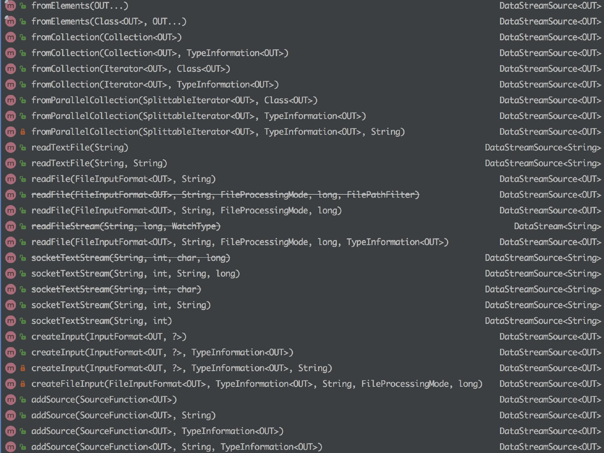 

总的来说可以分为下面几大类：

> 基于集合

- fromCollection(Collection) - 从 Java 的 Java.util.Collection 创建数据流。集合中的所有元素类型必须相同。
- fromCollection(Iterator, Class) - 从一个迭代器中创建数据流。Class 指定了该迭代器返回元素的类型。
- fromElements(T …) - 从给定的对象序列中创建数据流。所有对象类型必须相同。
- fromParallelCollection(SplittableIterator, Class) - 从一个迭代器中创建并行数据流。Class 指定了该迭代器返回元素的类型。
- generateSequence(from, to) - 创建一个生成指定区间范围内的数字序列的并行数据流。

> 基于文件

- readTextFile(path) - 读取文本文件，即符合 TextInputFormat 规范的文件，并将其作为字符串返回。
- readFile(fileInputFormat, path) - 根据指定的文件输入格式读取文件（一次）。
- readFile(fileInputFormat, path, watchType, interval, pathFilter, typeInfo) - 这是上面两个方法内部调用的方法。它根据给定的 fileInputFormat 和读取路径读取文件。根据提供的 watchType，这个 source 可以定期（每隔 interval 毫秒）监测给定路径的新数据（FileProcessingMode.PROCESS_CONTINUOUSLY），或者处理一次路径对应文件的数据并退出（FileProcessingMode.PROCESS_ONCE）。你可以通过 pathFilter 进一步排除掉需要处理的文件。

> 基于Socket

- socketTextStream(String hostname, int port) - 从 socket 读取。元素可以用分隔符切分。

总之：

1. 基于集合：有界数据集，更偏向于本地测试用
2. 基于文件：适合监听文件修改并读取其内容
3. 基于 Socket：监听主机的 host port，从 Socket 中获取数据
4. 自定义 addSource：大多数的场景数据都是无界的，会源源不断的过来。比如去消费 Kafka 某个 topic 上的数据，这时候就需要用到这个 addSource，可能因为用的比较多的原因吧，Flink 直接提供了 FlinkKafkaConsumer011 等类可供你直接使用。你可以去看看 FlinkKafkaConsumerBase 这个基础类，它是 Flink Kafka 消费的最根本的类。

#### 2.1.2 常见的数据源

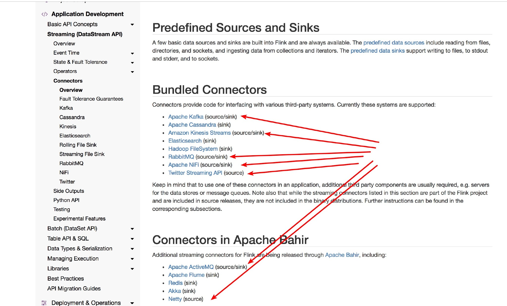 

#### 2.1.3  自定义 Source

如果你想自己自定义自己的 Source 呢？那么你就需要去了解一下 SourceFunction 接口了，它是所有 stream source 的根接口，它继承自一个标记接口（空接口）Function。

SourceFunction 定义了两个接口方法：

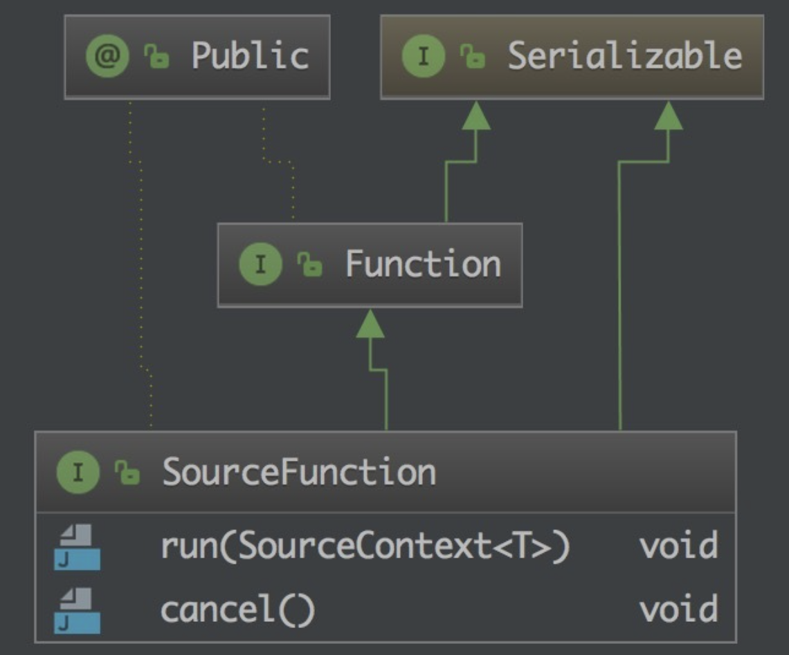 

1. **run** ： 启动一个 source，即对接一个外部数据源然后 emit 元素形成 stream（大部分情况下会通过在该方法里运行一个 while 循环的形式来产生 stream）。

2. **cancel** ： 取消一个 source，也即将 run 中的循环 emit 元素的行为终止。

正常情况下，一个 SourceFunction 实现这两个接口方法就可以了。其实这两个接口方法也固定了一种实现模板。

> 比如，实现一个 XXXSourceFunction，那么大致的模板是这样的：(直接拿 FLink 源码的实例给你看看)

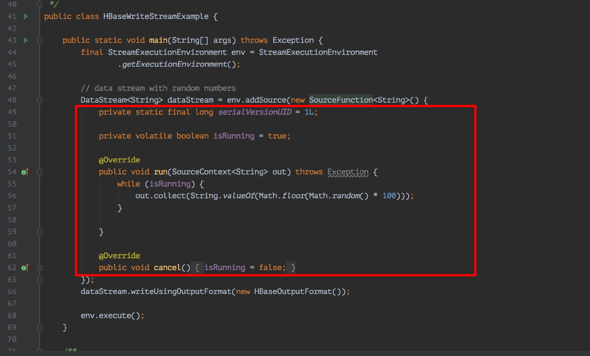 

> 自定义 MySQL 作为数据源，用Flink 接收并处理数据

```java
public class SourceFromMySQL extends RichSourceFunction<Student> {

    PreparedStatement ps;
    private Connection connection;

    /**
     * open() 方法中建立连接，这样不用每次 invoke 的时候都要建立连接和释放连接。
     *
     * @param parameters
     * @throws Exception
     */
    @Override
    public void open(Configuration parameters) throws Exception {
        super.open(parameters);
        connection = getConnection();
        String sql = "select * from Student;";
        ps = this.connection.prepareStatement(sql);
    }

    /**
     * 程序执行完毕就可以进行，关闭连接和释放资源的动作了
     *
     * @throws Exception
     */
    @Override
    public void close() throws Exception {
        super.close();
        if (connection != null) { //关闭连接和释放资源
            connection.close();
        }
        if (ps != null) {
            ps.close();
        }
    }

    /**
     * DataStream 调用一次 run() 方法用来获取数据
     *
     * @param ctx
     * @throws Exception
     */
    @Override
    public void run(SourceContext<Student> ctx) throws Exception {
        ResultSet resultSet = ps.executeQuery();
        while (resultSet.next()) {
            Student student = new Student(
                    resultSet.getInt("id"),
                    resultSet.getString("name").trim(),
                    resultSet.getString("password").trim(),
                    resultSet.getInt("age"));
            ctx.collect(student);
        }
    }

    @Override
    public void cancel() {
    }

    private static Connection getConnection() {
        Connection con = null;
        try {
            Class.forName("com.mysql.jdbc.Driver");
            con = DriverManager.getConnection(
              "jdbc:mysql://localhost:3306/test?useUnicode=true&characterEncoding=UTF-8", 
              "root", "root123456");
        } catch (Exception e) {
            System.out.println("-----------mysql get connection has exception , msg = "
                               + e.getMessage());
        }
        return con;
    }
}
```

具体案例：

自定义 Source，基于flink从 MySQL 中读取数据:

- https://github.com/GitHubWxw/wxw-bigdata/tree/dev-wxw/wxw-flink/wxw-flink-kafka

### 2.2 Flink之 Data Sink

> Sink 指水槽、下沉，Data sink 有点把数据存储下来（落库）的意思

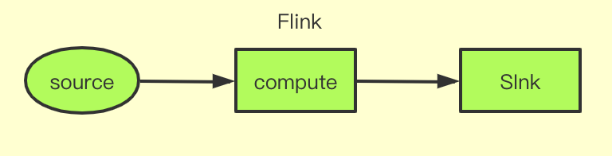 

如上图，Source 就是数据的来源，中间的 Compute 其实就是 Flink 干的事情，可以做一系列的操作，操作完后就把计算后的数据结果 Sink 到某个地方。（可以是 MySQL、ElasticSearch、Kafka、Cassandra 等）.

上面 `2.1 ` 介绍了DataSource有哪些，下面看看DataSink 有哪些。

#### 2.2.1 DataSink 是什么

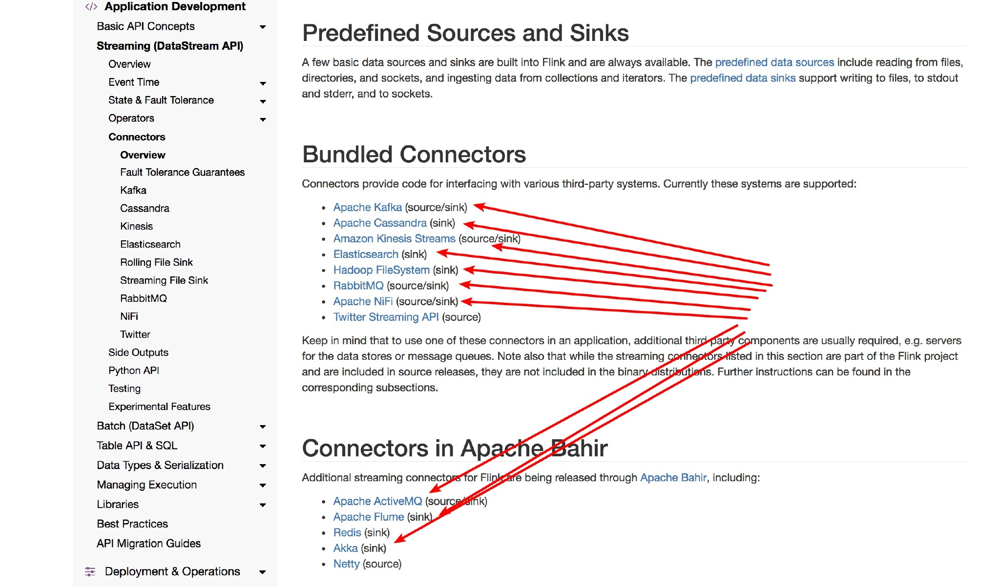 

> 图片来源：https://ci.apache.org/projects/flink/flink-docs-release-1.12/dev/connectors/

- 看下源码有哪些呢？

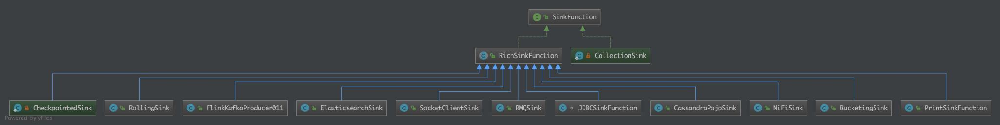 

可以看到有 Kafka、ElasticSearch、Socket、RabbitMQ、JDBC、Cassandra POJO、File、Print 等 Sink 的方式。

**（1）SinkFunction** 

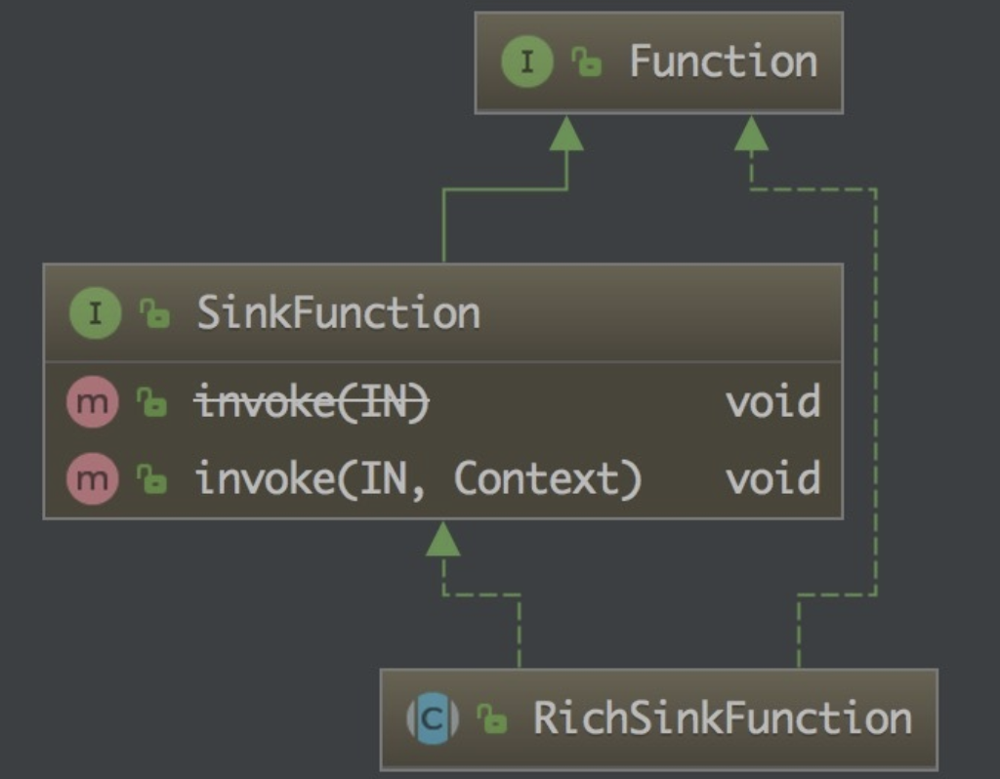 

从上图可以看到 SinkFunction 接口有 invoke 方法，它有一个 RichSinkFunction 抽象类。

上面的那些自带的 Sink 可以看到都是继承了 RichSinkFunction 抽象类，实现了其中的方法，那么我们要是自己定义自己的 Sink 的话其实也是要按照这个套路来做的。

> 这里就拿个较为简单的 PrintSinkFunction 源码来说明：

```java
@PublicEvolving
public class PrintSinkFunction<IN> extends RichSinkFunction<IN> {
    private static final long serialVersionUID = 1L;
    private final PrintSinkOutputWriter<IN> writer;

    public PrintSinkFunction() {
        this.writer = new PrintSinkOutputWriter(false);
    }

    public PrintSinkFunction(boolean stdErr) {
        this.writer = new PrintSinkOutputWriter(stdErr);
    }

    public PrintSinkFunction(String sinkIdentifier, boolean stdErr) {
        this.writer = new PrintSinkOutputWriter(sinkIdentifier, stdErr);
    }

    public void open(Configuration parameters) throws Exception {
        super.open(parameters);
        StreamingRuntimeContext context = (StreamingRuntimeContext)this.getRuntimeContext();
        this.writer.open(context.getIndexOfThisSubtask(), context.getNumberOfParallelSubtasks());
    }

    public void invoke(IN record) {
        this.writer.write(record);
    }

    public String toString() {
        return this.writer.toString();
    }
}
```

可以看到它就是实现了 RichSinkFunction 抽象类，然后实现了 invoke 方法，这里 invoke 方法就是把记录打印出来了就是，没做其他的额外操作。

#### 2.2.2 DataSInk 怎么用

```java
SingleOutputStreamOperator.addSink(new PrintSinkFunction<>();
```

这样就可以了，如果是其他的 Sink Function 的话需要换成对应的。使用这个 Function 其效果就是打印从 Source 过来的数据，和直接 Source.print() 效果一样。

 

> 图片来源：https://zhisheng-blog.oss-cn-hangzhou.aliyuncs.com/images/wK45iZ.jpg

#### 2.2.3 DataSink 自定义

```java
public class SinKToMySQL extends RichSinkFunction<Student> {
    PreparedStatement ps;
    private Connection connection;

    /**
     * open() 方法中建立连接，这样不用每次 invoke 的时候都要建立连接和释放连接
     *
     * @param parameters
     * @throws Exception
     */
    @Override
    public void open(Configuration parameters) throws Exception {
        super.open(parameters);
        connection = getConnection();
        String sql = "insert into Student(id, name, password, age) values(?, ?, ?, ?);";
        ps = this.connection.prepareStatement(sql);
    }

    @Override
    public void close() throws Exception {
        super.close();
        //关闭连接和释放资源
        if (connection != null) {
            connection.close();
        }
        if (ps != null) {
            ps.close();
        }
    }

    /**
     * 每条数据的插入都要调用一次 invoke() 方法
     *
     * @param value
     * @param context
     * @throws Exception
     */
    @Override
    public void invoke(Student value, Context context) throws Exception {
        //组装数据，执行插入操作
        ps.setInt(1, value.getId());
        ps.setString(2, value.getName());
        ps.setString(3, value.getPassword());
        ps.setInt(4, value.getAge());
        ps.executeUpdate();
    }

    private static Connection getConnection() {
        Connection con = null;
        try {
            Class.forName("com.mysql.jdbc.Driver");
            con = DriverManager.getConnection("jdbc:mysql://localhost:3306/test?useUnicode=true&characterEncoding=UTF-8", "root", "root123456");
        } catch (Exception e) {
            System.out.println("-----------mysql get connection has exception , msg = "+ e.getMessage());
        }
        return con;
    }
}
```

这里的 source 是从 kafka 读取数据的，然后 Flink 从 Kafka 读取到数据（JSON）后用阿里 fastjson 来解析成 student 对象，然后在 addSink 中使用我们创建的 SinkToMySQL，这样就可以把数据存储到 MySQL 了。

```java
public class Main3 {
    public static void main(String[] args) throws Exception {
        final StreamExecutionEnvironment env = StreamExecutionEnvironment.getExecutionEnvironment();

        Properties props = new Properties();
        props.put("bootstrap.servers", "localhost:9092");
        props.put("zookeeper.connect", "localhost:2181");
        props.put("group.id", "metric-group");
        props.put("key.deserializer", "org.apache.kafka.common.serialization.StringDeserializer");
        props.put("value.deserializer", "org.apache.kafka.common.serialization.StringDeserializer");
        props.put("auto.offset.reset", "latest");

        SingleOutputStreamOperator<Student> student = env.addSource(new FlinkKafkaConsumer011<>(
                "student",   //这个 kafka topic 需要和上面的工具类的 topic 一致
                new SimpleStringSchema(),
                props)).setParallelism(1)
                .map(string -> JSON.parseObject(string, Student.class)); //Fastjson 解析字符串成 student 对象

        student.addSink(new SinkToMySQL()); //数据 sink 到 mysql

        env.execute("Flink add sink");
    }
}
```

### 2.3 Flink之 Data Transformation

> Flink 程序的结构

 

Flink 应用程序结构就是如上图所示：

1. **Source: 数据源**，Flink 在流处理和批处理上的 source 大概有 4 类：基于本地集合的 source、基于文件的 source、基于网络套接字的 source、自定义的 source。自定义的 source 常见的有 Apache kafka、Amazon Kinesis Streams、RabbitMQ、Twitter Streaming API、Apache NiFi 等，当然你也可以定义自己的 source。
2. **Transformation**：数据转换的各种操作，有 Map / FlatMap / Filter / KeyBy / Reduce / Fold / Aggregations / Window / WindowAll / Union / Window join / Split / Select / Project 等，操作很多，可以将数据转换计算成你想要的数据。
3. **Sink：接收器**，Flink 将转换计算后的数据发送的地点 ，你可能需要存储下来，Flink 常见的 Sink 大概有如下几类：写入文件、打印出来、写入 socket 、自定义的 sink 。自定义的 sink 常见的有 Apache kafka、RabbitMQ、MySQL、ElasticSearch、Apache Cassandra、Hadoop FileSystem 等，同理你也可以定义自己的 Sink。

#### 2.3.1 Map

> 其中输入是一个数据流，输出的也是一个数据流：

```java
StreamExecutionEnvironment env = StreamExecutionEnvironment.getExecutionEnvironment();
Properties props = new Properties();
props.put("bootstrap.servers", "127.0.0.1:9092");
props.put("zookeeper.connect", "127.0.0.1:2181");
props.put("group.id", "metric-group");
props.put("key.deserializer", "org.apache.kafka.common.serialization.StringDeserializer");  //key 反序列化
props.put("value.deserializer", "org.apache.kafka.common.serialization.StringDeserializer");
props.put("auto.offset.reset", "latest"); //value 反序列化
SingleOutputStreamOperator<Student> student = env.addSource(new FlinkKafkaConsumer<>(
  "student",  //kafka topic
  new SimpleStringSchema(),  // String 序列化
  props)).setParallelism(1).map(str-> JSON.parseObject(str,Student.class));

SingleOutputStreamOperator<Student> map = student.map(new MapFunction<Student, Student>() {
  @Override
  public Student map(Student value) throws Exception {
    Student s1 = new Student();
    s1.id = value.id;
    s1.name = value.name;
    s1.password = value.password;
    s1.age = value.age + 5; // 将原来年龄+5岁，再传递下去
    return s1;
  }
});
map.print();
```

#### 2.3.2 FlatMap

> FlatMap 采用一条记录并输出零个，一个或多个记录。

```java
SingleOutputStreamOperator<Student> flatMap = student.flatMap(new FlatMapFunction<Student, Student>() {
  @Override
  public void flatMap(Student value, Collector<Student> out) throws Exception {
    if (value.id % 2 == 0) { // 将 id 为偶数的聚集出来。
      out.collect(value);
    }
  }
});
flatMap.print();
```

#### 2.3.3 Filter 

> Filter 函数根据条件判断出结果

```java
// 将 id 大于 95 的过滤出来，然后打印出来
SingleOutputStreamOperator<Student> filter = student.filter(new FilterFunction<Student>() {
  @Override
  public boolean filter(Student value) throws Exception {
    if (value.id > 95) {
      return true;
    }
    return false;
  }
});
filter.print();
```

#### 2.3.4 KeyBy

> KeyBy 在逻辑上是基于 key 对流进行分区。在内部，它使用 hash 函数对流进行分区。它返回 KeyedDataStream 数据流。

```java
KeyedStream<Student, Integer> keyBy = student.keyBy(new KeySelector<Student, Integer>() {
  @Override
  public Integer getKey(Student value) throws Exception {
    // 对 student 的 age 做 KeyBy 操作分区
    return value.age;
  }
});
keyBy.print();
```

#### 2.3.5  Reduce

> Reduce 返回单个的结果值，并且 reduce 操作每处理一个元素总是创建一个新值。常用的方法有 average, sum, min, max, count，使用 reduce 方法都可实现。

```java
SingleOutputStreamOperator<Student> reduce = student.keyBy(new KeySelector<Student, Integer>() {
    @Override
    public Integer getKey(Student value) throws Exception {
        return value.age;
    }
  // 将数据流进行 keyby 操作，因为执行 reduce 操作只能是 KeyedStream，然后将 student 对象的 age 做了一个求平均值的操作
}).reduce(new ReduceFunction<Student>() {
    @Override
    public Student reduce(Student value1, Student value2) throws Exception {
        Student student1 = new Student();
        student1.name = value1.name + value2.name;
        student1.id = (value1.id + value2.id) / 2;
        student1.password = value1.password + value2.password;
        student1.age = (value1.age + value2.age) / 2;
        return student1;
    }
});
reduce.print();
```

#### 2.3.6 Fold

> Fold 通过将最后一个文件夹流与当前记录组合来推出 KeyedStream。 它会发回数据流。

```java
KeyedStream.fold("1", new FoldFunction<Integer, String>() {
    @Override
    public String fold(String accumulator, Integer value) throws Exception {
        return accumulator + "=" + value;
    }
})
```

#### 2.3.7 Aggregations

> DataStream API 支持各种聚合，例如 min，max，sum 等。 这些函数可以应用于 KeyedStream 以获得 Aggregations 聚合。

```java
KeyedStream.sum(0) 
KeyedStream.sum("key") 
KeyedStream.min(0) 
KeyedStream.min("key") 
KeyedStream.max(0) 
KeyedStream.max("key") 
KeyedStream.minBy(0) 
KeyedStream.minBy("key") 
KeyedStream.maxBy(0) 
KeyedStream.maxBy("key")
```

- max 和 maxBy 之间的区别在于 max 返回流中的最大值，但 maxBy 返回具有最大值的键， min 和 minBy 同理。

#### 2.3.8 Window

> Window 函数允许按时间或其他条件对现有 KeyedStream 进行分组。 以下是以 10 秒的时间窗口聚合：

```java
inputStream.keyBy(0).window(Time.seconds(10));
```

Flink 定义数据片段以便（可能）处理无限数据流。 这些切片称为窗口。 此切片有助于通过应用转换处理数据块。 要对流进行窗口化，我们需要分配一个可以进行分发的键和一个描述要对窗口化流执行哪些转换的函数

要将流切片到窗口，我们可以使用 Flink 自带的窗口分配器。 我们有选项，如 tumbling windows, sliding windows, global 和 session windows。 Flink 还允许您通过扩展 WindowAssginer 类来编写自定义窗口分配器。

#### 2.3.9 WindowAll

> windowAll 函数允许对常规数据流进行分组。 通常，这是非并行数据转换，因为它在非分区数据流上运行。

与常规数据流功能类似，我们也有窗口数据流功能。 唯一的区别是它们处理窗口数据流。 所以窗口缩小就像 Reduce 函数一样，Window fold 就像 Fold 函数一样，并且还有聚合。

```java
inputStream.keyBy(0).windowAll(Time.seconds(10));
```

#### 1.3.10 Union

> Union 函数将两个或多个数据流结合在一起。 这样就可以并行地组合数据流。 如果我们将一个流与自身组合，那么它会输出每个记录两次。

```java
inputStream.union(inputStream1, inputStream2, ...);
```

#### 1.3.11 Window join

> 可以通过一些 key 将同一个 window 的两个数据流 join 起来。

```java
// 在 5 秒的窗口中连接两个流，其中第一个流的第一个属性的连接条件等于另一个流的第二个属性
inputStream.join(inputStream1)
           .where(0).equalTo(1)
           .window(Time.seconds(5))     
           .apply (new JoinFunction () {...});
```

#### 1.3.12 Split

> 根据条件将流拆分为两个或多个流。 当您获得混合流并且您可能希望单独处理每个数据流时，可以使用此方法

```java
SplitStream<Integer> split = inputStream.split(new OutputSelector<Integer>() {
    @Override
    public Iterable<String> select(Integer value) {
        List<String> output = new ArrayList<String>(); 
        if (value % 2 == 0) {
            output.add("even");
        }
        else {
            output.add("odd");
        }
        return output;
    }
});
```

#### 1.3.13 Select

> 允许您从拆分流中选择特定流

```java
SplitStream<Integer> split;
DataStream<Integer> even = split.select("even"); 
DataStream<Integer> odd = split.select("odd"); 
DataStream<Integer> all = split.select("even","odd");
```

#### 1.3.14 Project

> Project 函数允许您从事件流中选择属性子集，并仅将所选元素发送到下一个处理流。

```java
DataStream<Tuple4<Integer, Double, String, String>> in = // [...] 
DataStream<Tuple2<String, String>> out = in.project(3,2);
```

上述函数从给定记录中选择属性号 2 和 3。 以下是示例输入和输出记录：

```java
(1,10.0,A,B)=> (B,A)
(2,20.0,C,D)=> (D,C)
```

### 2.4 Flink之 Stream Windows

目前有许多数据分析的场景从批处理到流处理的演变， 虽然可以将批处理作为流处理的特殊情况来处理，但是分析无穷集的流数据通常需要思维方式的转变并且具有其自己的术语（例如，“windowing（窗口化）”、“at-least-once（至少一次）”、“exactly-once（只有一次）” ）。

对于刚刚接触流处理的人来说，这种转变和新术语可能会非常混乱。 Apache Flink 是一个为生产环境而生的流处理器，具有易于使用的 API，可以用于定义高级流分析程序。

Flink 的 API 在数据流上具有非常灵活的窗口定义，使其在其他开源流处理框架中脱颖而出。在这篇文章中，我们将讨论用于流处理的窗口的概念，介绍 Flink 的内置窗口，并解释它对自定义窗口语义的支持。

#### 2.4.1 什么是 Windows？

下面我们结合一个现实的例子来说明。

> 就拿交通传感器的示例：统计经过某红绿灯的汽车数量之和？

- 假设在一个红绿灯处，我们每隔 15 秒统计一次通过此红绿灯的汽车数量，如下图，可以把汽车的经过看成一个流，无穷的流，不断有汽车经过此红绿灯，因此无法统计总共的汽车数量。但是，我们可以换一种思路，每隔 15 秒，我们都将与上一次的结果进行 sum 操作（滑动聚合），如下：

   

  这个结果似乎还是无法回答我们的问题，根本原因在于流是无界的，我们不能限制流，但可以在有一个有界的范围内处理无界的流数据。

> 因此，我们需要换一个问题的提法：每分钟经过某红绿灯的汽车数量之和？

这个问题，就相当于一个定义了一个 Window（窗口），window 的界限是1分钟，且每分钟内的数据互不干扰，因此也可以称为翻滚（不重合）窗口，如下图：

 

第一分钟的数量为8，第二分钟是22，第三分钟是27。。。这样，1个小时内会有60个window。

> 再考虑一种情况，每30秒统计一次过去1分钟的汽车数量之和：

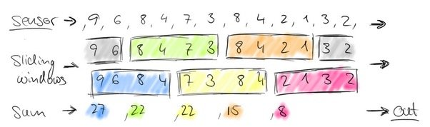 

此时，window 出现了重合。这样，1个小时内会有120个 window。

扩展一下，我们可以在某个地区，收集每一个红绿灯处汽车经过的数量，然后每个红绿灯处都做一次基于1分钟的window统计，即并行处理：

 

**（1）它有什么作用？** 

通常来讲，Window 就是用来对一个无限的流设置一个有限的集合，在有界的数据集上进行操作的一种机制。window 又可以分为基于时间（Time-based）的 window 以及基于数量（Count-based）的 window。

- **Flink 自带的 window** 

  Flink DataStream API 提供了 Time 和 Count 的 window，同时增加了基于 Session 的 window。同时，由于某些特殊的需要，DataStream API 也提供了定制化的 window 操作，供用户自定义 window。

> 下面，主要介绍 Time-Based window 以及 Count-Based window，以及自定义的 window 操作

**（2）Time Windows** 

正如命名那样，Time Windows 根据时间来聚合流数据。例如：一分钟的 tumbling time window 收集一分钟的元素，并在一分钟过后对窗口中的所有元素应用于一个函数。

在 Flink 中定义 tumbling time windows(翻滚时间窗口) 和 sliding time windows(滑动时间窗口) 非常简单：

- **tumbling time windows(翻滚时间窗口)**

  ```java
  data.keyBy(1)
  	.timeWindow(Time.minutes(1)) //tumbling time window 每分钟统计一次数量和
  	.sum(1);
  ```

- **sliding time windows(滑动时间窗口)** 

  ```java
  data.keyBy(1)
  	.timeWindow(Time.minutes(1), Time.seconds(30)) //sliding time window 每隔 30s 统计过去一分钟的数量和
  	.sum(1);
  ```

> 有一点我们还没有讨论，即“收集一分钟的元素”的确切含义，它可以归结为一个问题，“流处理器如何解释时间?”

Apache Flink 具有三个不同的时间概念，即 processing time, event time 和 ingestion time。

**（3）Count Windows** 

Apache Flink 还提供计数窗口功能。如果计数窗口设置的为 100 ，那么将会在窗口中收集 100 个事件，并在添加第 100 个元素时计算窗口的值。

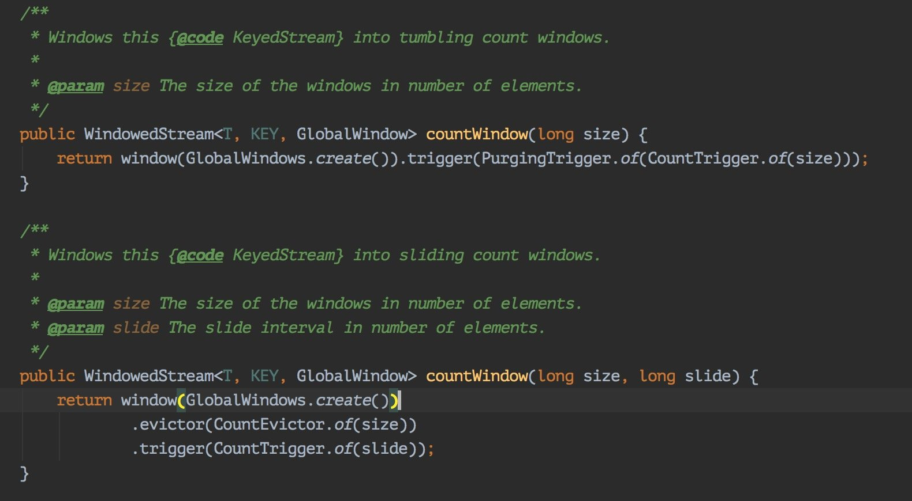 

在 Flink 的 DataStream API 中，tumbling count window 和 sliding count window 的定义如下:

- **tumbling count window** 

  ```java
  data.keyBy(1)
  	.countWindow(100) //统计每 100 个元素的数量之和
  	.sum(1);
  ```

- **sliding count window** 

  ```java
  data.keyBy(1) 
  	.countWindow(100, 10) //每 10 个元素统计过去 100 个元素的数量之和
  	.sum(1);
  ```

#### 2.4.2 解剖 Flink 的窗口机制

Flink 的内置 time window 和 count window 已经覆盖了大多数应用场景，但是有时候也需要定制窗口逻辑，此时 Flink 的内置的 window 无法解决这些问题。为了还支持自定义 window 实现不同的逻辑，DataStream API 为其窗口机制提供了接口。

下图描述了 Flink 的窗口机制，并介绍了所涉及的组件：

 

- 到达窗口操作符的元素被传递给 WindowAssigner。WindowAssigner 将元素分配给一个或多个窗口，可能会创建新的窗口。
  窗口本身只是元素列表的标识符，它可能提供一些可选的元信息，例如 TimeWindow 中的开始和结束时间。注意，元素可以被添加到多个窗口，这也意味着一个元素可以同时在多个窗口存在。

- 每个窗口都拥有一个 Trigger(触发器)，该 Trigger(触发器) 决定何时计算和清除窗口。当先前注册的计时器超时时，将为插入窗口的每个元素调用触发器。在每个事件上，触发器都可以决定触发(即、清除(删除窗口并丢弃其内容)，或者启动并清除窗口。一个窗口可以被求值多次，并且在被清除之前一直存在。注意，在清除窗口之前，窗口将一直消耗内存。

- 当 Trigger(触发器) 触发时，可以将窗口元素列表提供给可选的 Evictor，Evictor 可以遍历窗口元素列表，并可以决定从列表的开头删除首先进入窗口的一些元素。然后其余的元素被赋给一个计算函数，如果没有定义 Evictor，触发器直接将所有窗口元素交给计算函数。

- 计算函数接收 Evictor 过滤后的窗口元素，并计算窗口的一个或多个元素的结果。 DataStream API 接受不同类型的计算函数，包括预定义的聚合函数，如 sum（），min（），max（），以及 ReduceFunction，FoldFunction 或 WindowFunction。

这些是构成 Flink 窗口机制的组件。 接下来我们逐步演示如何使用 DataStream API 实现自定义窗口逻辑。 我们从 DataStream [IN] 类型的流开始，并使用 key 选择器函数对其分组，该函数将 key 相同类型的数据分组在一块。

```java
SingleOutputStreamOperator<xxx> data = env.addSource(...);
data.keyBy()
```

####  2.4.3 如何自定义 Window？

**（1）Window Assigner** 

它负责将元素分配到不同的 window。Window API 提供了自定义的 WindowAssigner 接口，我们可以实现 WindowAssigner 的方法，同时，对于基于 Count 的 window 而言，默认采用了 GlobalWindow 的 window assigner，例如：

```java
public abstract Collection<W> assignWindows(T element, long timestamp)

keyBy.window(GlobalWindows.create())
```

**（2）Trigger** 

Trigger 即触发器，定义何时或什么情况下移除 window，我们可以指定触发器来覆盖 WindowAssigner 提供的默认触发器。 请注意，指定的触发器不会添加其他触发条件，但会替换当前触发器。

**（3）Evictor（可选）** 

驱逐者，即保留上一 window 留下的某些元素

最终，通过 apply WindowFunction 来返回 DataStream 类型数据，利用 Flink 的内部窗口机制和 DataStream API 可以实现自定义的窗口逻辑，例如 session window。

> 结论

对于现代流处理器来说，支持连续数据流上的各种类型的窗口是必不可少的。 Apache Flink 是一个具有强大功能集的流处理器，包括一个非常灵活的机制，可以在连续数据流上构建窗口。 Flink 为常见场景提供内置的窗口运算符，以及允许用户自定义窗口逻辑。


## 3. Flink 原理


## 4 SpringBoot 整合Flink

>  前言

1. Flink 读取kafka数据到Hbase
2. Flink 读取kafka数据到MySQL
3. Flink 读取kafka数据到HDFS
4. Flink 读取kafka数据到Flume
5. Flink 读取kafka数据到RocketMQ


### 后记

> 相关文章

1. [Apache Flink 介绍](http://www.54tianzhisheng.cn/2018/10/13/flink-introduction/) 
2. [Mac 上搭建 Flink  环境并构建运行简单程序入门](http://www.54tianzhisheng.cn/2018/09/18/flink-install/) 
3. [Flink 配置文件详解](http://www.54tianzhisheng.cn/2018/10/27/flink-config/) 
4. [Data Source 介绍](http://www.54tianzhisheng.cn/2018/10/28/flink-sources/) 
5. [如何自定义 Data Source ？](http://www.54tianzhisheng.cn/2018/10/30/flink-create-source/) 
6. [Data Sink 介绍](http://www.54tianzhisheng.cn/2018/10/29/flink-sink/) 
7. [如何自定义 Data Sink ？](http://www.54tianzhisheng.cn/2018/10/31/flink-create-sink/) 
8. [Flink Data transformation(转换)](http://www.54tianzhisheng.cn/2018/11/04/Flink-Data-transformation/) 
9. [介绍 Flink 中的 Stream Windows](http://www.54tianzhisheng.cn/2018/12/08/Flink-Stream-Windows/) 

