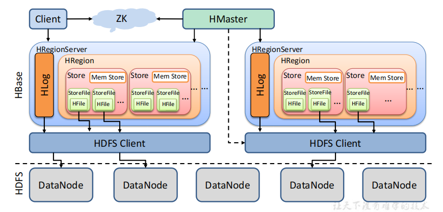

### 大数据技术之HBase

HBase 是一个分布式，可扩展，面向列的适合存储海量数据的NoSQL数据库，其最主要的功能是解决海量数据下的实时随机读写的问题。 HBase 依赖 **HDFS** 做为底层分布式文件系统。

### 1. 业务背景

#### 1.1 为什么要使用 HBase？

> 使用以下组件不行么？

- **MySQL**？MySQL数据库我们是算用得最多了的吧？但众所周知，MySQL是**单机**的。MySQL能存储多少数据，取决于那台服务器的硬盘大小。以现在互联网的数据量，很多时候MySQL是没法存储那么多数据的。比如我这边有个系统，一天就能产生1TB的数据，这数据是不可能存MySQL的。（如此大的量数据，我们现在的做法是先写到Kafka，然后落到Hive中）
- **Kafka**？Kafka我们主要用来处理消息的（解耦异步削峰）。数据到Kafka，Kafka会将数据持久化到硬盘中，并且Kafka是分布式的（很方便的扩展），理论上Kafka可以存储很大的数据。但是Kafka的数据我们**不会「单独」取出来**。持久化了的数据，最常见的用法就是重新设置offset，做「回溯」操作
- **Redis**？Redis是缓存数据库，所有的读写都在内存中，速度贼快。AOF/RDB存储的数据都会加载到内存中，Redis不适合存大量的数据（因为内存太贵了！）。
- **Elasticsearch**？Elasticsearch是一个分布式的搜索引擎，主要用于检索。理论上Elasticsearch也是可以存储海量的数据（毕竟分布式），我们也可以将数据用『索引』来取出来，似乎已经是非常完美的中间件了。但是如果我们的数据**没有经常「检索」的需求**，其实不必放到Elasticsearch，数据写入Elasticsearch需要分词，无疑会浪费资源。
- **HDFS**？显然HDFS是可以存储海量的数据的，它就是为海量数据而生的。它也有明显的缺点：不支持随机修改，查询效率低，对小文件支持不友好。

### 2. HBase 简介

#### 2.1 Hbase 特性

- 强读写一致，但是不是**最终一致性**的数据存储，这使得它非常适合高速的计算聚合
- 自动分片，通过Region分散在集群中，当行数增长的时候，Region也会自动的切分和再分配
- 自动的故障转移
- Hadoop/HDFS集成，和HDFS开箱即用
- 丰富、简洁、高效的API
- 块缓存，布隆过滤器，可以高效的列查询优化
- 操作管理，Hbase提供了内置的web界面来操作

#### 2.2 什么时候使用Hbase?

Hbase不适合解决所有的问题：

- 首先数据库量要足够多，如果有十亿及百亿行数据，那么Hbase是一个很好的选择，如果只有几百万行甚至不到的数据量，RDBMS是一个很好的选择。因为数据量小的话，真正能工作的机器量少，剩余的机器都处于空闲的状态。
- 其次，如果不需要辅助索引，静态类型的列，事务等特性，一个已经用RDBMS的系统想要切换到Hbase，则需要重新设计系统。
- 最后，保证硬件资源足够，每个HDFS集群在少于5个节点的时候，都不能表现的很好。因为HDFS默认的复制数量是3，再加上一个NameNode。

### 3. HBase 入门

HBase（Hadoop DataBase），是一种非关系型分布式数据库（NoSQL），支持海量数据存储（官方：单表支持百亿行百万列）。HBase 采用经典的主从架构，底层依赖于 HDFS，并借助 ZooKeeper 作为协同服务，其架构大致如下：

其中：

- **Master**：HBase 管理节点。管理 Region Server，分配 Region 到 Region Server，提供负载均衡能力；执行创建表等 DDL 操作。
- **Region Server**：HBase 数据节点。管理 Region，一个 Region Server 可包含多个 Region，Region 相当于表的分区。客户端可直接与 Region Server 通信，实现数据增删改查等 DML 操作。
- **ZooKeeper**：协调中心。负责 Master 选举，节点协调，存储 hbase:meta 等元数据。
- **HDFS**：底层存储系统。负责存储数据，Region 中的数据通过 HDFS 存储。

对 HBase 全局有了基本理解后，我认为有几个比较重要的点值得关注：HBase 数据模型、Region 的概念、数据路由。

#### 3.1 HBase 数据模型

> HBase 如何管理数据？（逻辑层）

HBase 的数据模型和 MySQL 等关系型数据库有比较大的区别，其是一种 ”Schema-Flexiable“ 的理念。

1. 在表的维度，其包含若干行，每一行以 RowKey 来区分。
2. 在行的维度，其包含若干列族，列族类似列的归类，但不只是逻辑概念，底层物理存储也是以列族来区分的（一个列族对应不同 Region 中的一个 Store）。
3. 在列族的维度，其包含若干列，列是动态的。与其说是列，不如说是一个个键值对，Key 是列名，Value 是列值。

 HBase 地表结构如下：

- RowKey（行键）：RowKey 是字典有序的，HBase 基于 RowKey 实现索引；
- Column Family（列族）：纵向切割，一行可有多个列族，一个列族可有任意个列；
- Key-Value（键值对）：每一列存储的是一个键值对，Key 是列名，Value 是列值；
- Byte（数据类型）：数据在 HBase 中以 Byte 存储，实际的数据类型交由用户转换；
- Version（多版本）：每一列都可配置相应的版本，获取指定版本的数据（默认返回最新版本）；
- 稀疏矩阵：行与行之间的列数可以不同，但只有实际的列才会占用存储空间。

####  3.2 Region

> HBase 如何管理数据？（物理层）

Region 是 HBase 中的概念，类似 RDBMS 中的分区。

1. Region 是表的横向切割，一个表由一个或多个 Region 组成，Region 被分配到各个 Region Server；
2. 一个 Region 根据列族分为多个 Store，每个 Store 由 MemStore 和 StoreFile 组成；数据写入 MemStore，MemStore 类似输入缓冲区，持久化后为 StoreFile；数据写入的同时会更新日志 WAL，WAL 用于发生故障后的恢复，保障数据读写安全；
3. 一个 StoreFile 对应一个 HFile，HFile 存储在 HDFS 。

下面是我梳理的大致模型：

- **Region 是一个 RowKey Range** 

每个 Region 实际上是一个 RowKey Range，比如 Region A 存放的 RowKey 区间为 [aaa,bbb)，Region B 存放的 RowKey 区间为 [bbb,ccc) ，以此类推。Region 在 Region Server 中存储也是有序的，Region A 必定在 Region B 前面。

**注**：这里将 RowKey 设计为 aaa，而不是 1001 这样的数字，是为了强调 RowKey 并非只能是数字，只要能进行字典排序的字符都是可以的，如：abc-123456 。

-  **数据被路由到各个 Region** 

表由一个或多个 Region 组成（逻辑），Region Server 包含一个或多个 Region（物理）。数据的路由首先要定位数据存储在哪张表的哪个 Region，表的定位直接根据表名，Region 的定位则根据 RowKey（因为每个 Region 都是一个 RowKey Range，因此根据 RowKey 很容易知道其对应的 Region）。

**注：** Master 默认采用 DefaultLoadBalancer 策略分配 Region 给 Region Server，类似轮询方式，可保证每个 Region Server 拥有相同数量的 Region（这里只是 Region 的数量相同，但还是有可能出现热点聚集在某个 Region，从而导致热点聚集在某个 Region Server 的情况）。

- **当一个表太大时，Region 将自动分裂** 

  - 自动分裂

    - 0.94 版本之前，Region 分裂策略为 ConstantSizeRegionSplitPolicy ，根据一个固定值触发分裂。
    - 0.94 版本之后，分裂策略默认为 IncreasingToUpperBoundRegionSplitPolicy，该策略会根据 Region 数量和 StoreFile 的最大值决策。当 Region 的数量小于 9 且 StoreFile 的最大值小于某个值时，分裂 Region；当Region数量大于9 时，采用 ConstantSizeRegionSplitPolicy 

  - 手动分裂

    - 在 ConstantSizeRegionSplitPolicy 下，通过设置 hbase.hregion.max.filesize 控制 Region 分裂

       

#### 3.3  数据路由 hbase:meta

> HBase 是分布式数据库，那数据怎么路由？

数据路由借助 hbase:meta 表完成，hbase:meta 记录的是所有 Region 的元数据信息，hbase:meta 的位置记录在 ZooKeeper 。

**注：** 一些比较老的文章可能会提到 .root 和 .meta 两个表。事实上， .root 和 .meta 两个表是 HBase 0.96 版本之前的设计。在 0.96 版本后，.root 表已经被移除，.meta 表更名为 hbase：meta。

hbase:meta 表的格式如下：

 

其中，

- table：表名；
- region start key：Region 中的第一个 RowKey，如果 region start key 为空，表示该 Region 是第一个 Region；
- region id：Region 的 ID，通常是 Region 创建时的 timestamp；
- regioninfo：该 Region 的 HRegionInfo 的序列化值；
- server：该 Region 所在的 Region Server 的地址；
- serverstartcode：该 Region 所在的 Region Server 的启动时间。

### 4. HBase 进阶

#### 4.1 HBase 架构原理

 

**zookeeper：**开源分布式协调服务框架，主要解决分布式系统中的一致性和数据管理问题。本质上是分布式文件系统，做 HMaster 选举，关键信息如 meta-region 地址，Replication 进度，Regionserver 地址与端口等存储。

**HMaster：** 是一个轻量级进程，负责所有 DDL 操作，负载均衡， region 信息管理，并在宕机恢复中起主导作用。

**HRegionServer：** 管理 HRegion，与客户端点对点通信，负责实时数据的读写（DML操作）。RegionServer要实时的向HMaster报告信息。HMaster知道全局的RegionServer运行情况，可以控制RegionServer的故障转移和Region的切分。

**HRegion：**Hbase表的分片，HBase表会根据RowKey值被切分成不同的Region存储在RegionServer中，在一个RegionServer中可以有多个不同的Region。

**Store：**一个Store对应HBase表中的一个列族(Column Family)。

**StoreFile** ：保存实际数据的物理文件，StoreFile 以 HFile 的形式存储在HDFS上。每个Store会有一个或多个StoreFile（HFIle）,数据在每个Store File z中都是有序的。

**MemStore： ** 写缓存，由于HFile 中的数据要求是有序的，所以数据是先存储在 MemStore 中，排好序后，等到达刷写时机才会刷写到HFile 中，每次刷写都会形成一个 HFile文件。

**HFile：**在磁盘上保存原始数据的实际的物理文件，是实际的存储文件。StoreFile是以Hfile的形式存储在HDFS的。

**HDFS：**Hbase运行的底层文件系统。

**Write-Ahead logs（WAL）：** 由于数据要经过MemStore 排序后才会刷写到HFile 中，但把数据保存在内存中会有很高的概率导致数据丢失，为了解决这个问题，数据为先写入一个叫Write-Ahead logs 的文件中，然后再写入 MemStore中，所以在系统出现故障的时候，数据可以根据这个日志文件重建。比如下面情况：

- HBase的修改记录，当对HBase读写数据的时候，数据不是直接写进磁盘，它会在内存中保留一段时间（时间以及数据量阈值可以设定）。但把数据保存在内存中可能有更高的概率引起数据丢失，

#### 4.2 HBase 数据写入流程

**相关文章** 

1. [Java 3y 我终于看懂 Hbase了](https://zhuanlan.zhihu.com/p/145551967)  
2. [HBase 技术详细笔记](https://cloud.tencent.com/developer/article/1006043) 
3. [Infoq-Hbase详解](https://xie.infoq.cn/article/a3e345a6dcb2a626cb8a40648) 
4. [HBase 初探：架构 + 原理 + 对比 + 实践](https://blog.csdn.net/m0_46757769/article/details/105797288) 