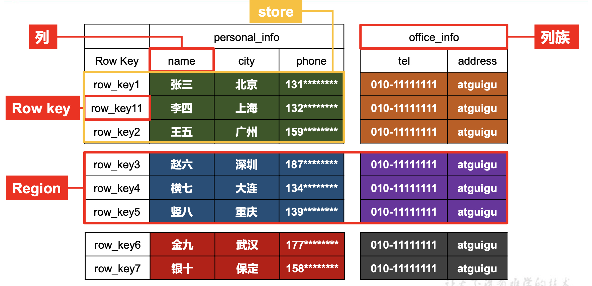
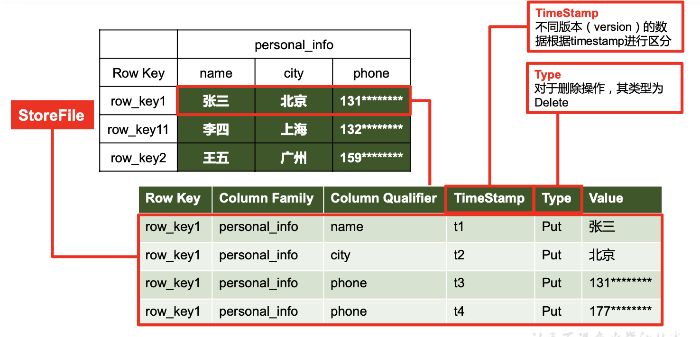
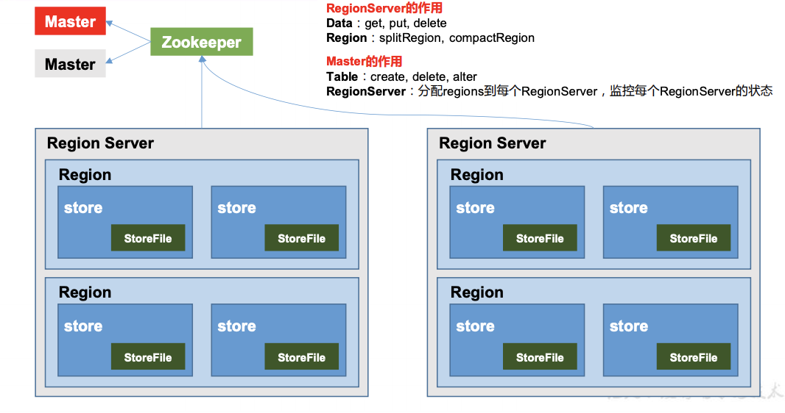
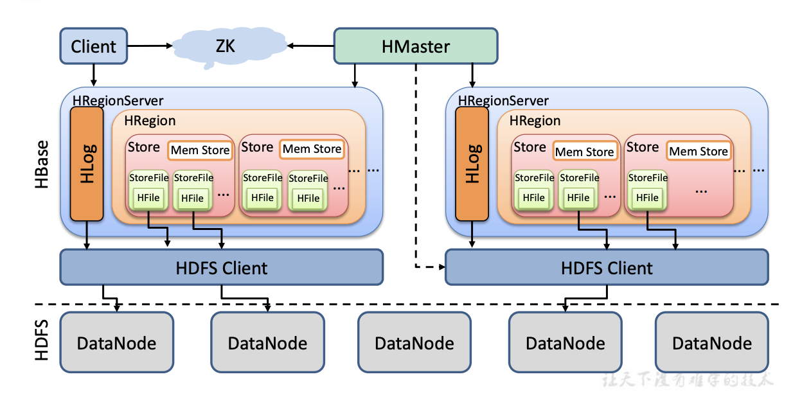
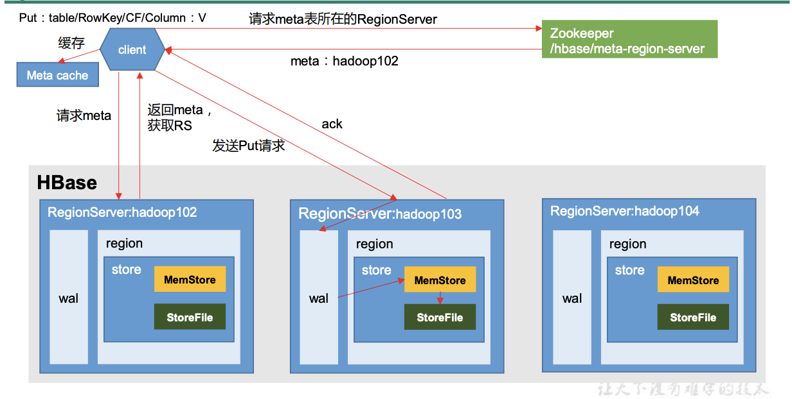
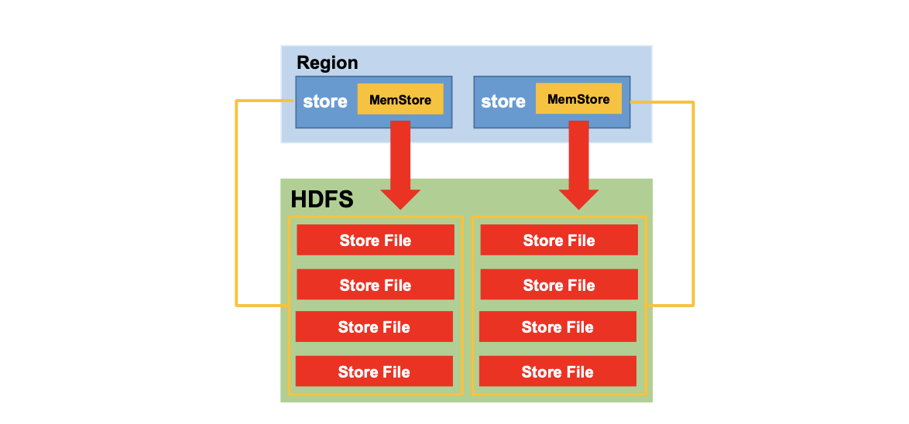
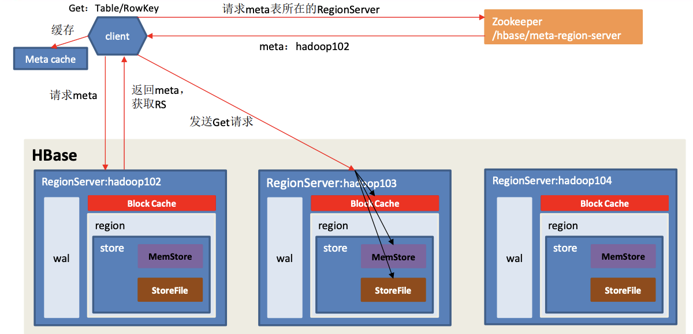
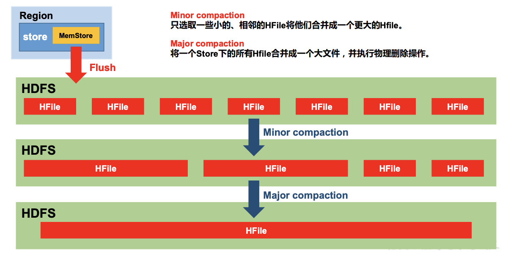
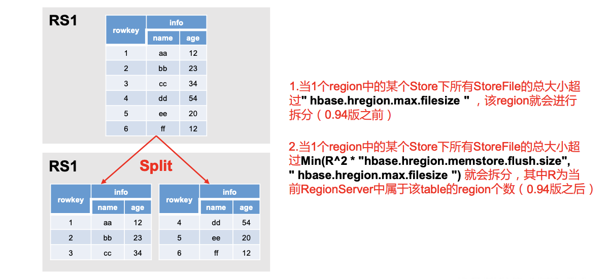

## wxw-hbase

如果这是您第一次涉足分布式计算的奇妙世界，那么您将迎来一段有趣的时光。首先，分布式系统很难。使分布式系统嗡嗡作响需要跨越系统（硬件和软件）和网络的不同技能组合。

> 导读

- 官网学习：http://hbase.apache.org/book.html

## Hbase 基础

### 1. hbase快速入门

#### 1.1 环境准备

##### 1.1.1 普通安装hbase

- 安装教程：http://hbase.apache.org/book.html
- 下载地址：https://mirrors.tuna.tsinghua.edu.cn/apache/hbase/

##### 1.1.2 Docker 安装hbase

- 下载安装hbase镜像

  ```bash
  ##  查找Hbase
  docker search hbase 
  
  ## 拉取制定版本的镜像
  docker pull harisekhon/hbase:1.3
  ```

  注意：不要安装最新版本的，不稳定 (我安装的是1.3)

- 运行Hbase(运行时指定主机名，端口映射等)

  ```bash
  # 大写p,主机随机分配端口与宿主机上的端口进行映射
  docker run -d --name wxw-hbase -P harisekhon/hbase:1.3
  
  ## 或,小写P指定主机的端口 16010映射到宿主机上(容器)的开放端口 16010（[服务器(宿主机)开放端口]:[docker服务端口]）
  docker run -d --name wxw-hbase -p 16010:16010 harisekhon/hbase:1.3
  
  ## 推荐使用这种 -d 后台运行 -h 守护进程连接的host 
  docker run -d -h wxw-hbase -p 2181:2181 -p 8085:8085 -p 9090:9090 -p 9095:9095 -p 16000:16000 -p 16010:16010 -p 16201:16201 -p 16301:16301 --name hbase harisekhon/hbase:1.3
  ```

  注意：hbase60010端口无法访问web页面，web端访问的接口变更为16010

- 修改虚拟机 `etc/hosts`  文件

  ```bash
  # 查看docker IP
  docker inspect [containerId]
  
  # 修改hosts
  sudo vi /etc/hosts
  
  # 添加 docker IP  hostname[wxw-hbase]  || 192.168.99.100 虚拟机主机IP
  即：192.168.99.100  wxw-hbase
  
  -------
  # 如果是wins系统,在本地的C:\Windows\System32\drivers\etc下修改hosts文件
  # 添加 192.168.99.100  启动hbase时设置的主机名
   即：192.168.99.100  wxw-hbase
  ```

- 浏览器查看Hbase的web界面：

  ```bash
  http://docker IP:宿主机上(容器)的开放端口 16010对应的指定主机的端口/master-status
  
  例：http://172.23.65.208:16010/master-status
  ```

    

- 进入到hbase容器

  ```bash
  ## 进入hbase容器
  docker exec -it  bash
  
  ## 然后执行连接到正在运行的 HBase 实例
  hbase shell 
  ```

   

#### 1.2 Hbase shell 操作

> *首次使用 HBase*

使用`hbase shell`位于HBase 安装的*bin/*目录中的命令连接到正在运行的 HBase 实例

```bash
## 键入help 并按 Enter，以显示 HBase Shell 的一些基本用法信息, 请注意，表名、行、列都必须用引号引起来。
hbase(main):001:0> help

COMMAND GROUPS:
  Group name: general
  Commands: status, table_help, version, whoami

  Group name: ddl
  Commands: alter, alter_async, alter_status, create, describe, disable, disable_all, drop, drop_all, enable, enable_all, exists, get_table, is_disabled, is_enabled, list, locate_region, show_filters

  Group name: namespace
  Commands: alter_namespace, create_namespace, describe_namespace, drop_namespace, list_namespace, list_namespace_tables

  Group name: dml
  Commands: append, count, delete, deleteall, get, get_counter, get_splits, incr, put, scan, truncate, truncate_preserve

  Group name: tools
  Commands: assign, balance_switch, balancer, balancer_enabled, catalogjanitor_enabled, catalogjanitor_run, catalogjanitor_switch, close_region, compact, compact_rs, flush, major_compact, merge_region, move, normalize, normalizer_enabled, normalizer_switch, split, splitormerge_enabled, splitormerge_switch, trace, unassign, wal_roll, zk_dump

  Group name: replication
  Commands: add_peer, append_peer_tableCFs, disable_peer, disable_table_replication, enable_peer, enable_table_replication, get_peer_config, list_peer_configs, list_peers, list_replicated_tables, remove_peer, remove_peer_tableCFs, set_peer_tableCFs, show_peer_tableCFs

  Group name: snapshots
  Commands: clone_snapshot, delete_all_snapshot, delete_snapshot, delete_table_snapshots, list_snapshots, list_table_snapshots, restore_snapshot, snapshot

  Group name: configuration
  Commands: update_all_config, update_config

  Group name: quotas
  Commands: list_quotas, set_quota

  Group name: security
  Commands: grant, list_security_capabilities, revoke, user_permission

  Group name: procedures
  Commands: abort_procedure, list_procedures

  Group name: visibility labels
  Commands: add_labels, clear_auths, get_auths, list_labels, set_auths, set_visibility

SHELL USAGE:
Quote all names in HBase Shell such as table and column names.  Commas delimit
command parameters.  Type <RETURN> after entering a command to run it.
Dictionaries of configuration used in the creation and alteration of tables are
Ruby Hashes. They look like this:

  {'key1' => 'value1', 'key2' => 'value2', ...}

and are opened and closed with curley-braces.  Key/values are delimited by the
'=>' character combination.  Usually keys are predefined constants such as
NAME, VERSIONS, COMPRESSION, etc.  Constants do not need to be quoted.  Type
'Object.constants' to see a (messy) list of all constants in the environment.

If you are using binary keys or values and need to enter them in the shell, use
double-quote'd hexadecimal representation. For example:

  hbase> get 't1', "key\x03\x3f\xcd"
  hbase> get 't1', "key\003\023\011"
  hbase> put 't1', "test\xef\xff", 'f1:', "\x01\x33\x40"

The HBase shell is the (J)Ruby IRB with the above HBase-specific commands added.
For more on the HBase Shell, see http://hbase.apache.org/book.html
```

##### 1.2.0 进入hbase客户端命令行

```bash
# hbase连接到hbase实例
hbase shell;
```

##### 1.2.1 创建一个表

使用该`create`命令创建一个新表。您必须指定表名称和 ColumnFamily 名称。

```bash
hbase(main):001:0> create 'test', 'cf'
0 row(s) in 0.4170 seconds

=> Hbase::Table - test
```

##### 1.2.2 查看创建的表

使用`list`命令确认你的表存在

```bash
hbase(main):002:0> list 'test'
TABLE
test
1 row(s) in 0.0180 seconds

=> ["test"]
```

##### 1.2.3 查看表的结构

使用`describe`命令查看详细信息，包括配置默认值

```bash
hbase(main):003:0> describe 'test'
```

##### 1.2.4 写入数据

要将数据放入表中，请使用该`put`命令。

```bash
hbase(main):003:0> put 'test', 'row1', 'cf:a', 'value1'
0 row(s) in 0.0850 seconds

hbase(main):004:0> put 'test', 'row2', 'cf:b', 'value2'
0 row(s) in 0.0110 seconds

hbase(main):005:0> put 'test', 'row3', 'cf:c', 'value3'
0 row(s) in 0.0100 seconds
```

在这里，我们插入三个值，一次一个。第一个插入是 at `row1`, column `cf:a`，值为`value1`。HBase 中的列由列族前缀组成，`cf`在本例中，后跟冒号，然后是列限定符后缀，`a`在本例中。

##### 1.2.5 查看表中所有数据

从 HBase 获取数据的方法之一是扫描。使用该`scan`命令扫描表中的数据。您可以限制扫描，但目前，所有数据都已获取。

```bash
hbase(main):006:0> scan 'test'
ROW                                      COLUMN+CELL
 row1                                    column=cf:a, timestamp=1421762485768, value=value1
 row2                                    column=cf:b, timestamp=1421762491785, value=value2
 row3                                    column=cf:c, timestamp=1421762496210, value=value3
3 row(s) in 0.0230 seconds
```

##### 1.2.6 查看表中单行数据

要一次获取一行数据，请使用该`get`命令。

```bash
hbase(main):007:0> get 'test','row1'

## 指定列族
hbase(main):007:0> get 'test','row1','cf:a' 
```

##### 1.2.7 禁用表

如果要删除表或更改其设置，以及在某些其他情况下，您需要先使用该`disable`命令禁用该表。您可以使用该`enable`命令重新启用它。

```bash
hbase(main):008:0> disable 'test'
0 row(s) in 1.1820 seconds

hbase(main):009:0> enable 'test'
0 row(s) in 0.1770 seconds
```

##### 1.2.8 删除表

要删除（删除）表，请使用该`drop`命令。

```bash
# 删除表
hbase(main):011:0> drop 'test'

# 清空表 
hbase(main):011:0> truncate 'test'
```

> 注意：清空表的操作顺序为先 disable，然后再 truncate。

##### 1.2.9 退出hbase shell

要退出 HBase Shell 并与集群断开连接，请使用该`quit`命令。HBase 仍在后台运行

#### 1.3 hbase伪分布式

在完成[快速入门](http://hbase.apache.org/book.html#quickstart)独立模式后，您可以重新配置 HBase 以在伪分布式模式下运行。伪分布式模式意味着 HBase 仍然完全运行在单个主机上，但每个 HBase 守护进程（HMaster、HRegionServer 和 ZooKeeper）作为一个单独的进程运行：在独立模式下，所有守护进程都在一个 jvm 进程/实例中运行。默认情况下，除非您`hbase.rootdir`按照[快速入门中的说明](http://hbase.apache.org/book.html#quickstart)配置该属性 ，否则您的数据仍存储在*/tmp/ 中*。

相关文章

1. 快速入门单机hbase：http://hbase.apache.org/book.html

### 2. 数据模型

逻辑上，HBase 的数据模型同关系型数据库很类似，数据存储在一张表中，有行有列。但从 HBase 的底层物理存储结构(K-V)来看，HBase 更像是一个 multi-dimensional map。

#### 2.1 hbase 逻辑结构

 

#### 2.2 物理存储结构

​     

#### 2.3 数据模型

- **Name Space** ：命名空间，类似于关系型数据库的 DatabBase 概念，每个命名空间下有多个表。HBase 有两个自带的命名空间，分别是 hbase 和 default，hbase 中存放的是 HBase 内置的表， default 表是用户默认使用的命名空间。
- **Region** ：类似于关系型数据库的表概念。不同的是，HBase 定义表时只需要声明列族即可，不需 要声明具体的列。这意味着，往 HBase 写入数据时，字段可以动态、按需指定。因此，和关 系型数据库相比，HBase 能够轻松应对字段变更的场景。
- **Row** ： HBase 表中的每行数据都由一个 **RowKey** 和多个 **Column**(列)组成，数据是按照 RowKey 的字典顺序存储的，并且查询数据时只能根据 **RowKey** 进行检索，所以 RowKey 的设计十分重 要。
- **Column**： HBase 中的每个列都由 **Column Family(列族**)和 **Column Qualifier(列限定符)**进行限 定，例如 info:name，info:age。建表时，只需指明列族，而列限定符无需预先定义。
- **Time Stamp**： 用于标识数据的不同版本(version)，每条数据写入时，如果不指定时间戳，系统会 自动为其加上该字段，其值为写入 HBase 的时间。

- **Cell** ：由{rowkey, column Family：column Qualifier, time Stamp} 唯一确定的单元。cell 中的数 据是没有类型的，全部是字节码形式存贮。

### 3.  Hbase API


## HBase 架构

> 不完整版本

  

> 架构角色

- **Region Server**  

  Region Server 为 Region 的管理者，其实现类为 HRegionServer，主要作用如下:

  -  对于数据的操作：get, put, delete；
  -  对于 Region 的操作：splitRegion、compactRegion。

- **Master**  

  Master 是所有 Region Server 的管理者，其实现类为 HMaster，主要作用如下：

  - 对于表的操作：create, delete, alter
  - 对于 RegionServer的操作：分配 regions到每个RegionServer，监控每个 RegionServer的状态，负载均衡和故障转移。

- **Zookeeper**  

  HBase 通过 Zookeeper 来做 Master 的高可用、RegionServer 的监控、元数据的入口以及 集群配置的维护等工作。

- **HDFS**  

  HDFS 为 HBase 提供最终的底层数据存储服务，同时为 HBase 提供高可用的支持。

### 1. 架构原理

 

- **StoreFile**  

  保存实际数据的物理文件，StoreFile 以 HFile 的形式存储在 HDFS 上。每个 Store 会有 一个或多个 StoreFile（HFile），数据在每个 StoreFile 中都是有序的。

- **MemStore**  

  写缓存，由于 HFile 中的数据要求是有序的，所以数据是先存储在 MemStore 中，排好序后，等到达刷写时机才会刷写到 HFile，每次刷写都会形成一个新的 HFile。 

- **WAL** 

  由于数据要经 MemStore 排序后才能刷写到 HFile，但把数据保存在内存中会有很高的 概率导致数据丢失，为了解决这个问题，数据会先写在一个叫做 Write-Ahead logfile（预写入日志）的文件 中，然后再写入 MemStore 中。所以在系统出现故障的时候，数据可以通过这个日志文件重 建。

### 2.  写入流程

 

> 写入数据流

1. Client 先访问 zookeeper，获取 hbase:meta 表位于哪个 Region Server。 
2. 访问对应的 Region Server，获取 hbase:meta 表，根据读请求的 namespace:table/rowkey， 查询出目标数据位于哪个 Region Server 中的哪个 Region 中。并将该 table 的 region 信息以 及 meta 表的位置信息缓存在客户端的 meta cache，方便下次访问。 
3. 与目标 Region Server 进行通讯； 
4. 将数据顺序写入（追加）到 WAL； 
5. 将数据写入对应的 MemStore，数据会在 MemStore 进行排序； 
6. 向客户端发送 ack； 
7. 等达到 MemStore 的刷写时机后，将数据刷写到 HFile。

### 3.  MemStore Flush

   


**MemStore 刷写时机：** 

1. 当某个 memstroe 的大小达到了 hbase.hregion.memstore.flush.size（默认值 128M）， 其所在 region 的所有 memstore 都会刷写，当 memstore 的大小达到了 hbase.hregion.memstore.flush.size（默认值 128M）， hbase.hregion.memstore.block.multiplier（默认值 4） 时，会阻止继续往该 memstore 写数据

2. .当 region server 中 memstore 的总大小达到

   ```bash
   java_heapsize
   hbase.regionserver.global.memstore.size（默认值 0.4）
   hbase.regionserver.global.memstore.size.lower.limit（默认值 0.95），
   ```

   region 会按照其所有 memstore 的大小顺序（由大到小）依次进行刷写。直到 region server 中所有 memstore 的总大小减小到上述值以下。

   当 region server 中 memstore 的总大小达到 java_heapsize hbase.regionserver.global.memstore.size（默认值 0.4） 时，会阻止继续往所有的 memstore 写数据。

3. 到达自动刷写的时间，也会触发 memstore flush。自动刷新的时间间隔由该属性进行 配置 hbase.regionserver.optionalcacheflushinterval（默认 1 小时）。

4. 当 WAL 文件的数量超过 hbase.regionserver.max.logs，region 会按照时间顺序依次进 行刷写，直到 WAL 文件数量减小到 hbase.regionserver.max.log 以下（该属性名已经废弃， 现无需手动设置，最大值为 32）。

### 4. 读取流程

- Hbase 读比写慢的组件

 

> 查询数据

1. Client 先访问 zookeeper，获取 hbase:meta 表位于哪个 Region Server。 
2. 访问对应的 Region Server，获取 hbase:meta 表，根据读请求的 namespace:table/rowkey， 查询出目标数据位于哪个 Region Server 中的哪个 Region 中。并将该 table 的 region 信息以 及 meta 表的位置信息缓存在客户端的 meta cache，方便下次访问。 
3. 与目标 Region Server 进行通讯； 
4. 分别在 Block Cache（读缓存），MemStore 和 Store File（HFile）中查询目标数据，并将 查到的所有数据进行合并。此处所有数据是指同一条数据的不同版本（time stamp）或者不 同的类型（Put/Delete）。 
5.  将从文件中查询到的数据块（Block，HFile 数据存储单元，默认大小为 64KB）缓存到 Block Cache。 
6. 将合并后的最终结果返回给客户端。

### 5. StoreFile Compaction

由于memstore每次刷写都会生成一个新的HFile，且同一个字段的不同版本（timestamp） 和不同类型（Put/Delete）有可能会分布在不同的 HFile 中，因此查询时需要遍历所有的 HFile。

为了减少 HFile 的个数，以及清理掉过期和删除的数据，会进行 StoreFile Compaction。

Compaction 分为两种，分别是 Minor Compaction 和 Major Compaction。

- Minor Compaction 会将临近的若干个较小的 HFile 合并成一个较大的 HFile，但不会清理过期和删除的数据。
-  Major Compaction 会将一个 Store 下的所有的 HFile 合并成一个大 HFile，并且会清理掉过期 和删除的数据。

 

### 6. Region Split

默认情况下，每个 Table 起初只有一个 Region，随着数据的不断写入，Region 会自动进 行拆分。刚拆分时，两个子 Region 都位于当前的 Region Server，但处于负载均衡的考虑， HMaster 有可能会将某个 Region 转移给其他的 Region Server。

 

Region Split 时机：

1. 当1个region中的某个Store下所有StoreFile的总大小超过hbase.hregion.max.filesize， 该 Region 就会进行拆分（0.94 版本之前）。
2. .当 1 个 region 中 的 某 个 Store 下所有 StoreFile 的 总 大 小 超 过 ` Min(R^2 * "hbase.hregion.memstore.flush.size",hbase.hregion.max.filesize") ` ，该 Region 就会进行拆分，其 中 R 为当前 Region Server 中属于该 Table 的个数（0.94 版本之后）

## Hbase优化

### 1. 高可用

在 HBase 中 HMaster 负责监控 HRegionServer 的生命周期，均衡 RegionServer 的负载， 如果 HMaster 挂掉了，那么整个 HBase 集群将陷入不健康的状态，并且此时的工作状态并 不会维持太久。所以 HBase 支持对 HMaster 的高可用配置。

```bash
# 关闭 HBase 集群（如果没有开启则跳过此步）
bin/stop-hbase.sh

# 在 conf 目录下创建 backup-masters 文件
touch conf/backup-masters
 
# 在 backup-masters 文件中配置高可用 HMaster 节点
echo hadoop103 > conf/backup-masters

# 将整个 conf 目录 scp 到其他节点
scp -r conf/
```

### 2. 预分区

每一个 region 维护着 StartRow 与 EndRow，如果加入的数据符合某个 Region 维护的 RowKey 范围，则该数据交给这个 Region 维护。那么依照这个原则，我们可以将数据所要 投放的分区提前大致的规划好，以提高 HBase 性能。

```bash
## 手动设定预分区
create 'staff1','info','partition1',SPLITS =>['1000','2000','3000','4000']

## 生成 16 进制序列预分区
create 'staff2','info','partition2',{NUMREGIONS => 15, SPLITALGO =>'HexStringSplit'}
```

- 按照文件中设置的规则预分区

  创建 splits.txt 文件内容如下：

  ```bash
  aaaa
  bbbb
  cccc
  dddd
  ```

```bash
## 分区
create 'staff3','partition3',SPLITS_FILE => 'splits.txt'
```

- 使用 JavaAPI 创建预分区

```java
//自定义算法，产生一系列 hash 散列值存储在二维数组中
byte[][] splitKeys = 某个散列值函数

//创建 HbaseAdmin 实例
HBaseAdmin hAdmin = new HBaseAdmin(HbaseConfiguration.create());

//创建 HTableDescriptor 实例
HTableDescriptor tableDesc = new HTableDescriptor(tableName);

//通过 HTableDescriptor 实例和散列值二维数组创建带有预分区的 Hbase 表
hAdmin.createTable(tableDesc, splitKeys);
```

### 3. RowKey 设计

一条数据的唯一标识就是 RowKey，那么这条数据存储于哪个分区，取决于 RowKey 处 于哪个一个预分区的区间内，设计 RowKey 的主要目的 ，就是让数据均匀的分布于所有的 region 中，在一定程度上防止数据倾斜。接下来我们就谈一谈 RowKey 常用的设计方案

#### 3.1 生成随机数、hash、散列值

```bash
比如：
原 本 rowKey 为 1001 的 ， SHA1 后 变 成 ：dd01903921ea24941c26a48f2cec24e0bb0e8cc7
原 本 rowKey 为 3001 的 ， SHA1 后 变 成 ：49042c54de64a1e9bf0b33e00245660ef92dc7bd
原 本 rowKey 为 5001 的 ， SHA1 后 变 成 ：7b61dec07e02c188790670af43e717f0f46e8913

在做此操作之前，一般我们会选择从数据集中抽取样本，来决定什么样的 rowKey 来 Hash 后作为每个分区的临界值。
```

#### 3.2 字符串反转

```bash
20170524000001 转成 10000042507102
20170524000002 转成 20000042507102

这样也可以在一定程度上散列逐步 put 进来的数据。
```

#### 3.3 字符串拼接

```bash
20170524000001_a12e
20170524000001_93i7
```

### 4. 内存优化

HBase 操作过程中需要大量的内存开销，毕竟 Table 是可以缓存在内存中的，一般会分 配整个可用内存的 70%给 HBase 的 Java 堆。但是不建议分配非常大的堆内存，因为 GC 过 程持续太久会导致 RegionServer 处于长期不可用状态，一般 16~48G 内存就可以了，如果因 为框架占用内存过高导致系统内存不足，框架一样会被系统服务拖死。

### 5. 基础优化

- 允许在 HDFS 的文件中追加内容：hdfs-site.xml、hbase-site.xml

  ```bash
  属性：dfs.support.append
  解释：开启 HDFS 追加同步，可以优秀的配合 HBase 的数据同步和持久化。默认值为 true。
  ```

- 优化 DataNode 允许的最大文件打开数,hdfs-site.xml

  ```bash
  属性：dfs.datanode.max.transfer.threads
  解释：HBase 一般都会同一时间操作大量的文件，根据集群的数量和规模以及数据动作，设置为 4096 或者更高。默认值：4096
  ```

- 优化延迟高的数据操作的等待时间，hdfs-site.xml

  ```bash
  属性：dfs.image.transfer.timeout
  解释：如果对于某一次数据操作来讲，延迟非常高，socket 需要等待更长的时间，建议把该值设置为更大的值（默认 60000 毫秒），以确保 socket 不会被 timeout 掉。
  ```

- 优化数据的写入效率,mapred-site.xml

  ```bash
  mapreduce.map.output.compress
  mapreduce.map.output.compress.codec
  解释：开启这两个数据可以大大提高文件的写入效率，减少写入时间。第一个属性值修改为true，第二个属性值修改为：org.apache.hadoop.io.compress.GzipCodec 或者其他压缩方式。
  ```

- 设置 RPC 监听数量 hbase-site.xml

  ```bash
  属性：Hbase.regionserver.handler.count
  解释：默认值为 30，用于指定 RPC 监听的数量，可以根据客户端的请求数进行调整，读写请求较多时，增加此值。
  ```

- 优化 HStore 文件大小 hbase-site.xml

  ```bash
  属性：hbase.hregion.max.filesize
  解释：默认值 10737418240（10GB），如果需要运行 HBase 的 MR 任务，可以减小此值，因为一个 region 对应一个 map 任务，如果单个 region 过大，会导致 map 任务执行时间过长。该值的意思就是，如果 HFile 的大小达到这个数值，则这个 region 会被切分为两个 Hfile。
  ```

- ．优化 HBase 客户端缓存 hbase-site.xml

  ```bash
  属性：hbase.client.write.buffer
  解释：用于指定 Hbase 客户端缓存，增大该值可以减少 RPC 调用次数，但是会消耗更多内存，反之则反之。一般我们需要设定一定的缓存大小，以达到减少 RPC 次数的目的。
  ```

- 指定 scan.next 扫描 HBase 所获取的行数 hbase-site.xml

  ```bash
  属性：hbase.client.scanner.caching
  解释：用于指定 scan.next 方法获取的默认行数，值越大，消耗内存越大。
  ```

- flush、compact、split 机制

  当 MemStore 达到阈值，将 Memstore 中的数据 Flush 进 Storefile；compact 机制则是把 flush 出来的小文件合并成大的 Storefile 文件。split 则是当 Region 达到阈值，会把过大的 Region 一分为二。

  涉及属性：即：128M 就是 Memstore 的默认阈值

  ```bash
  hbase.hregion.memstore.flush.size：134217728
  ```

  即：这个参数的作用是当单个 HRegion 内所有的 Memstore 大小总和超过指定值时，flush 该 HRegion 的所有 memstore。RegionServer 的 flush 是通过将请求添加一个队列，模拟生 产消费模型来异步处理的。那这里就有一个问题，当队列来不及消费，产生大量积压请求 时，可能会导致内存陡增，最坏的情况是触发 OOM。

  ```bash
  hbase.regionserver.global.memstore.upperLimit：0.4
  hbase.regionserver.global.memstore.lowerLimit：0.38
  ```

  即：当 MemStore 使用内存总量达到hbase.regionserver.global.memstore.upperLimit 指定值时，将会有多个 MemStores flush 到文件中，MemStore flush 顺序是按照大小降序执行的，直到 刷新到 MemStore 使用内存略小于 lowerLimit

  

## Hbase 扩展

### 1. 与Hive集成

#### 1.1 HBase 与 Hive 的对比

**Hive** 

- **数据仓库**： Hive 的本质其实就相当于将 HDFS 中已经存储的文件在 Mysql 中做了一个双射关系，以 方便使用 HQL 去管理查询。 
-  **用于数据分析、清洗** ：Hive 适用于离线的数据分析和清洗，延迟较高。 
-  **基于 HDFS、MapReduce： ** Hive 存储的数据依旧在 DataNode 上，编写的 HQL 语句终将是转换为 MapReduce 代码执 行。

**hbase** 

- **数据库**：是一种面向列族存储的非关系型数据库。
- **用于存储结构化和非结构化的数据** ：适用于单表非关系型数据的存储，不适合做关联查询，类似 JOIN 等操作。
- **基于 HDFS**：数据持久化存储的体现形式是 HFile，存放于 DataNode 中，被 ResionServer 以 region 的形 式进行管理。
-  **延迟较低，接入在线业务使用**：面对大量的企业数据，HBase 可以直线单表大量数据的存储，同时提供了高效的数据访问 速度。

#### 1.2  Hive 整合实践

### 2. 与phoenix 集成

HBase，一个NoSQL数据库，可存储大量非关系型数据。

HBase，可以用HBase shell进行操作，也可以用HBase Java api进行操作。HBase虽然是一个数据库，但是它的查询语句，很不太好用。要是能像使用Mysql等关系型数据库一样用sql语句操作HBase，那就很Perfect了。

**现有工具有很多Hive，Tez，Impala，Shark/Spark，Phoenix等。今天主要记录Phoenix。**

- phoenix，由saleforce.com开源的一个项目，后又捐给了Apache。它**相当于一个Java中间件，帮助开发者，像使用jdbc访问关系型数据库一些，访问NoSql数据库HBase。** 

- phoenix，操作的表及数据，存储在hbase上。phoenix只是需要和Hbase进行表关联起来。然后再用工具进行一些读或写操作。

其实，**可以把Phoenix只看成一种代替HBase的语法的一个工具。虽然可以用java可以用jdbc来连接phoenix，然后操作HBase，但是在生产环境中，不可以用在OLTP中。**在线事务处理的环境中，需要低延迟，而Phoenix在查询HBase时，虽然做了一些优化，但延迟还是不小。所以依然是用在OLAT中，再将结果返回存储下来。


 