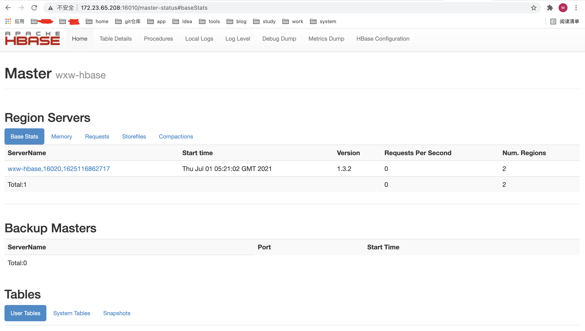
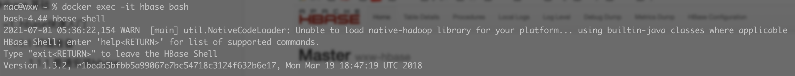

## wxw-hbase

如果这是您第一次涉足分布式计算的奇妙世界，那么您将迎来一段有趣的时光。首先，分布式系统很难。使分布式系统嗡嗡作响需要跨越系统（硬件和软件）和网络的不同技能组合。

> 导读

- 官网学习：http://hbase.apache.org/book.html

## Hbase 基础

### 1. hbase快速入门

#### 1.1 环境准备

##### 1.1.1 普通安装hbase

- 安装教程：http://hbase.apache.org/book.html
- 下载地址：https://mirrors.tuna.tsinghua.edu.cn/apache/hbase/

##### 1.1.2 Docker 安装hbase

- 下载安装hbase镜像

  ```bash
  ##  查找Hbase
  docker search hbase 
  
  ## 拉取制定版本的镜像
  docker pull harisekhon/hbase:1.3
  ```

  注意：不要安装最新版本的，不稳定 (我安装的是1.3)

- 运行Hbase(运行时指定主机名，端口映射等)

  ```bash
  # 大写p,主机随机分配端口与宿主机上的端口进行映射
  docker run -d --name wxw-hbase -P harisekhon/hbase:1.3
  
  ## 或,小写P指定主机的端口 16010映射到宿主机上(容器)的开放端口 16010（[服务器(宿主机)开放端口]:[docker服务端口]）
  docker run -d --name wxw-hbase -p 16010:16010 harisekhon/hbase:1.3
  
  ## 推荐使用这种 -d 后台运行 -h 守护进程连接的host 
  docker run -d -h wxw-hbase -p 2181:2181 -p 8085:8085 -p 9090:9090 -p 9095:9095 -p 16000:16000 -p 16010:16010 -p 16201:16201 -p 16301:16301 --name hbase harisekhon/hbase:1.3
  ```

  注意：hbase60010端口无法访问web页面，web端访问的接口变更为16010

- 修改虚拟机 `etc/hosts`  文件

  ```bash
  # 查看docker IP
  docker inspect [containerId]
  
  # 修改hosts
  sudo vi /etc/hosts
  
  # 添加 docker IP  hostname
  即：192.168.99.100  wxw-hbase
  
  -------
  # 如果是wins系统,在本地的C:\Windows\System32\drivers\etc下修改hosts文件
  # 添加 192.168.99.100  启动hbase时设置的主机名
   即：192.168.99.100  wxw-hbase
  ```

- 浏览器查看Hbase的web界面：

  ```bash
  http://docker IP:宿主机上(容器)的开放端口 16010对应的指定主机的端口/master-status
  
  例：http://172.23.65.208:16010/master-status
  ```

    

- 进入到hbase容器

  ```bash
  ## 进入hbase容器
  docker exec -it  bash
  
  ## 然后执行连接到正在运行的 HBase 实例
  hbase shell 
  ```

   

#### 1.2 单机Hbase 使用

> *首次使用 HBase*

使用`hbase shell`位于HBase 安装的*bin/*目录中的命令连接到正在运行的 HBase 实例

```bash
## 键入help 并按 Enter，以显示 HBase Shell 的一些基本用法信息, 请注意，表名、行、列都必须用引号引起来。
hbase(main):001:0> help
HBase Shell, version 1.3.2, r1bedb5bfbb5a99067e7bc54718c3124f632b6e17, Mon Mar 19 18:47:19 UTC 2018
Type 'help "COMMAND"', (e.g. 'help "get"' -- the quotes are necessary) for help on a specific command.
Commands are grouped. Type 'help "COMMAND_GROUP"', (e.g. 'help "general"') for help on a command group.

COMMAND GROUPS:
  Group name: general
  Commands: status, table_help, version, whoami

  Group name: ddl
  Commands: alter, alter_async, alter_status, create, describe, disable, disable_all, drop, drop_all, enable, enable_all, exists, get_table, is_disabled, is_enabled, list, locate_region, show_filters

  Group name: namespace
  Commands: alter_namespace, create_namespace, describe_namespace, drop_namespace, list_namespace, list_namespace_tables

  Group name: dml
  Commands: append, count, delete, deleteall, get, get_counter, get_splits, incr, put, scan, truncate, truncate_preserve

  Group name: tools
  Commands: assign, balance_switch, balancer, balancer_enabled, catalogjanitor_enabled, catalogjanitor_run, catalogjanitor_switch, close_region, compact, compact_rs, flush, major_compact, merge_region, move, normalize, normalizer_enabled, normalizer_switch, split, splitormerge_enabled, splitormerge_switch, trace, unassign, wal_roll, zk_dump

  Group name: replication
  Commands: add_peer, append_peer_tableCFs, disable_peer, disable_table_replication, enable_peer, enable_table_replication, get_peer_config, list_peer_configs, list_peers, list_replicated_tables, remove_peer, remove_peer_tableCFs, set_peer_tableCFs, show_peer_tableCFs

  Group name: snapshots
  Commands: clone_snapshot, delete_all_snapshot, delete_snapshot, delete_table_snapshots, list_snapshots, list_table_snapshots, restore_snapshot, snapshot

  Group name: configuration
  Commands: update_all_config, update_config

  Group name: quotas
  Commands: list_quotas, set_quota

  Group name: security
  Commands: grant, list_security_capabilities, revoke, user_permission

  Group name: procedures
  Commands: abort_procedure, list_procedures

  Group name: visibility labels
  Commands: add_labels, clear_auths, get_auths, list_labels, set_auths, set_visibility

SHELL USAGE:
Quote all names in HBase Shell such as table and column names.  Commas delimit
command parameters.  Type <RETURN> after entering a command to run it.
Dictionaries of configuration used in the creation and alteration of tables are
Ruby Hashes. They look like this:

  {'key1' => 'value1', 'key2' => 'value2', ...}

and are opened and closed with curley-braces.  Key/values are delimited by the
'=>' character combination.  Usually keys are predefined constants such as
NAME, VERSIONS, COMPRESSION, etc.  Constants do not need to be quoted.  Type
'Object.constants' to see a (messy) list of all constants in the environment.

If you are using binary keys or values and need to enter them in the shell, use
double-quote'd hexadecimal representation. For example:

  hbase> get 't1', "key\x03\x3f\xcd"
  hbase> get 't1', "key\003\023\011"
  hbase> put 't1', "test\xef\xff", 'f1:', "\x01\x33\x40"

The HBase shell is the (J)Ruby IRB with the above HBase-specific commands added.
For more on the HBase Shell, see http://hbase.apache.org/book.html
```

##### 1.2.0 hbase shell 和hbase实例连接

```bash
# hbase连接到hbase实例
hbase shell;
```

##### 1.2.1 创建一个表

使用该`create`命令创建一个新表。您必须指定表名称和 ColumnFamily 名称。

```bash
hbase(main):001:0> create 'wxw-hbase-table', 'cf'
0 row(s) in 0.4170 seconds

=> Hbase::Table - test
```

##### 1.2.2 查看创建的表

使用`list`命令确认你的表存在

```bash
hbase(main):002:0> list 'test'
TABLE
test
1 row(s) in 0.0180 seconds

=> ["test"]
```

##### 1.2.3 查看表的详细信息

使用`describe`命令查看详细信息，包括配置默认值

```bash
hbase(main):003:0> describe 'test'
Table test is ENABLED
test
COLUMN FAMILIES DESCRIPTION
{NAME => 'cf', VERSIONS => '1', EVICT_BLOCKS_ON_CLOSE => 'false', NEW_VERSION_BEHAVIOR => 'false', KEEP_DELETED_CELLS => 'FALSE', CACHE_DATA_ON_WRITE =>
'false', DATA_BLOCK_ENCODING => 'NONE', TTL => 'FOREVER', MIN_VERSIONS => '0', REPLICATION_SCOPE => '0', BLOOMFILTER => 'ROW', CACHE_INDEX_ON_WRITE => 'f
alse', IN_MEMORY => 'false', CACHE_BLOOMS_ON_WRITE => 'false', PREFETCH_BLOCKS_ON_OPEN => 'false', COMPRESSION => 'NONE', BLOCKCACHE => 'true', BLOCKSIZE
 => '65536'}
1 row(s)
Took 0.9998 seconds
```

##### 1.2.4 写入数据

要将数据放入表中，请使用该`put`命令。

```bash
hbase(main):003:0> put 'test', 'row1', 'cf:a', 'value1'
0 row(s) in 0.0850 seconds

hbase(main):004:0> put 'test', 'row2', 'cf:b', 'value2'
0 row(s) in 0.0110 seconds

hbase(main):005:0> put 'test', 'row3', 'cf:c', 'value3'
0 row(s) in 0.0100 seconds
```

在这里，我们插入三个值，一次一个。第一个插入是 at `row1`, column `cf:a`，值为`value1`。HBase 中的列由列族前缀组成，`cf`在本例中，后跟冒号，然后是列限定符后缀，`a`在本例中。

##### 1.2.5 查看表中所有数据

从 HBase 获取数据的方法之一是扫描。使用该`scan`命令扫描表中的数据。您可以限制扫描，但目前，所有数据都已获取。

```bash
hbase(main):006:0> scan 'test'
ROW                                      COLUMN+CELL
 row1                                    column=cf:a, timestamp=1421762485768, value=value1
 row2                                    column=cf:b, timestamp=1421762491785, value=value2
 row3                                    column=cf:c, timestamp=1421762496210, value=value3
3 row(s) in 0.0230 seconds
```

##### 1.2.6 查看表中单行数据

要一次获取一行数据，请使用该`get`命令。

```bash
hbase(main):007:0> get 'test', 'row1'
COLUMN                                   CELL
 cf:a                                    timestamp=1421762485768, value=value1
1 row(s) in 0.0350 seconds
```

##### 1.2.7 禁用表

如果要删除表或更改其设置，以及在某些其他情况下，您需要先使用该`disable`命令禁用该表。您可以使用该`enable`命令重新启用它。

```bash
hbase(main):008:0> disable 'test'
0 row(s) in 1.1820 seconds

hbase(main):009:0> enable 'test'
0 row(s) in 0.1770 seconds
```

##### 1.2.8 删除表

要删除（删除）表，请使用该`drop`命令。

```bash
hbase(main):011:0> drop 'test'
0 row(s) in 0.1370 seconds
```

##### 1.2.9 退出hbase shell

要退出 HBase Shell 并与集群断开连接，请使用该`quit`命令。HBase 仍在后台运行

#### 1.3 hbase伪分布式

在完成[快速入门](http://hbase.apache.org/book.html#quickstart)独立模式后，您可以重新配置 HBase 以在伪分布式模式下运行。伪分布式模式意味着 HBase 仍然完全运行在单个主机上，但每个 HBase 守护进程（HMaster、HRegionServer 和 ZooKeeper）作为一个单独的进程运行：在独立模式下，所有守护进程都在一个 jvm 进程/实例中运行。默认情况下，除非您`hbase.rootdir`按照[快速入门中的说明](http://hbase.apache.org/book.html#quickstart)配置该属性 ，否则您的数据仍存储在*/tmp/ 中*。

相关文章

1. 快速入门单机hbase：http://hbase.apache.org/book.html

#### 1.4 hbase运行模式

- 单机
- 分布式

##### 1.4.1 单机hbase

这是默认模式。独立模式是[快速入门](http://hbase.apache.org/book.html#quickstart)部分中描述的内容。在独立模式下，HBase 不使用 HDFS——而是使用本地文件系统——并且它在同一个 JVM 中运行所有 HBase 守护进程和本地 ZooKeeper。ZooKeeper 绑定到一个众所周知的端口，因此客户端可以与 HBase 通信。

- hdfs上独立的hbase

独立 hbase 的一个有时有用的变体让所有守护进程在一个 JVM 内运行，但不是持久化到本地文件系统，而是持久化到 HDFS 实例。

要配置此独立变体，请编辑*hbase-site.xml* 设置*hbase.rootdir* 以指向 HDFS 实例中的目录，然后将*hbase.cluster.distributed*设置 为*false*。例如：

```xml
<configuration>
  <property>
    <name>hbase.rootdir</name>
    <value>hdfs://namenode.example.org:8020/hbase</value>
  </property>
  <property>
    <name>hbase.cluster.distributed</name>
    <value>false</value>
  </property>
</configuration>
```

##### 1.4.2 分布式hbase

- 伪分布式模式只是在单个主机上运行的完全分布式模式，可以针对本地文件系统运行，也可以针对*Hadoop 分布式文件系统*(HDFS)的实例运行。
- 完全分布式模式只能在 HDFS 上运行

### 2. hbase 数据模型

> 导读

#### 2.1 概念视图

按照惯例，列名由其列族前缀和*限定符组成*。例如，列*contents:html*由列族`contents`和`html`限定符组成。冒号字符 ( `:`) 将列族与列族*限定符分隔开*。

> webtable

| 行键              | 时间戳 | 列族 `contents`         | 列族 `anchor`                | 列族 `people`         |
| :---------------- | :----- | :---------------------- | :--------------------------- | :-------------------- |
| “com.cnn.www”     | t9     |                         | 锚点：cnnsi.com = "CNN"      |                       |
| “com.cnn.www”     | t8     |                         | 主播：my.look.ca = "CNN.com" |                       |
| “com.cnn.www”     | t6     | 内容：html = "<html>… " |                              |                       |
| “com.cnn.www”     | t5     | 内容：html = "<html>… " |                              |                       |
| “com.cnn.www”     | t3     | 内容：html = "<html>… " |                              |                       |
| “com.example.www” | t5     | 内容：html = "<html>… " |                              | 人：作者 =“约翰·多伊” |

此表中看起来为空的单元格不占用空间，或者实际上存在于 HBase 中。这就是 HBase“稀疏”的原因。

- 表格视图不是查看 HBase 中数据的唯一可能方式，甚至不是最准确的方式。

以下表示与多维地图相同的信息。这只是用于说明目的的模型，可能并不完全准确。

```json
{
  "com.cnn.www": {
    contents: {
      t6: contents:html: "<html>..."
      t5: contents:html: "<html>..."
      t3: contents:html: "<html>..."
    }
    anchor: {
      t9: anchor:cnnsi.com = "CNN"
      t8: anchor:my.look.ca = "CNN.com"
    }
    people: {}
  }
  "com.example.www": {
    contents: {
      t5: contents:html: "<html>..."
    }
    anchor: {}
    people: {
      t5: people:author: "John Doe"
    }
  }
}
```

#### 2.2 物理视图

尽管在概念级别表可能被视为一组稀疏的行，但它们在物理上是按列族存储的。可以随时将新的列限定符 (column_family:column_qualifier) 添加到现有列族中。

> table anchor

| 行键          | 时间戳 | 列族 `anchor`                   |
| :------------ | :----- | :------------------------------ |
| “com.cnn.www” | t9     | `anchor:cnnsi.com = "CNN"`      |
| “com.cnn.www” | t8     | `anchor:my.look.ca = "CNN.com"` |

> table  contents

| 行键          | 时间戳 | 列族 `contents:`        |
| :------------ | :----- | :---------------------- |
| “com.cnn.www” | t6     | 内容：html = "<html>… " |
| “com.cnn.www” | t5     | 内容：html = "<html>… " |
| “com.cnn.www” | t3     | 内容：html = "<html>… " |

概念视图中显示的空单元格根本没有存储。因此，

- 对`contents:html`时间戳列的值的请求`t8`将不返回任何值。
- 对`anchor:my.look.ca`时间戳值的请求`t9`不会返回任何值。

但是，如果未提供时间戳，则将返回特定列的最新值。给定多个版本，最新的也是第一个找到的，因为时间戳是按降序存储的。

因此，`com.cnn.www`如果未指定时间戳，则对行中所有列的值的请求将是：

- `contents:html`from timestamp`t6`的值
- `anchor:cnnsi.com`from timestamp`t9`的值
- `anchor:my.look.ca`from timestamp的值`t8`。

#### 2.3 命名空间

命名空间是表的逻辑分组，类似于关系数据库系统中的数据库。这种抽象为即将到来的多租户相关功能奠定了基础：

##### 2.3.1 命名空间管理

可以创建、删除或更改命名空间。命名空间成员资格在表创建期间通过指定以下形式的完全限定表名来确定：

```xml
<table namespace>:<table qualifier>
```

```bash
#Create a namespace-创建命名空间
create_namespace 'my_ns'

#create my_table in my_ns namespace 在指定命名空间建表
create 'my_ns:my_table', 'fam'

#drop namespace-删除命名空间
drop_namespace 'my_ns'

#alter namespace - 修改命名空间
alter_namespace 'my_ns', {METHOD => 'set', 'PROPERTY_NAME' => 'PROPERTY_VALUE'}
```

- **预定义命名空间** 

有两个预定义的特殊命名空间：

- hbase - 系统命名空间，用于包含 HBase 内部表
- default - 没有明确指定命名空间的表将自动落入这个命名空间

```bash
#namespace=foo and table qualifier=bar
create 'foo:bar', 'fam'

#namespace=default and table qualifier=bar
create 'bar', 'fam'
```

#### 2.4 操作数据模型

The four primary data model operations are Get, Put, Scan, and Delete. Operations are applied via [Table](https://hbase.apache.org/apidocs/org/apache/hadoop/hbase/client/Table.html) instances.

##### 2.4.1 get

[Get](https://hbase.apache.org/apidocs/org/apache/hadoop/hbase/client/Get.html) returns attributes for a specified row. Gets are executed via [Table.get](https://hbase.apache.org/apidocs/org/apache/hadoop/hbase/client/Table.html#get-org.apache.hadoop.hbase.client.Get-) 

##### 2.4.2 put

[Put](https://hbase.apache.org/apidocs/org/apache/hadoop/hbase/client/Put.html) either adds new rows to a table (if the key is new) or can update existing rows (if the key already exists). Puts are executed via [Table.put](https://hbase.apache.org/apidocs/org/apache/hadoop/hbase/client/Table.html#put-org.apache.hadoop.hbase.client.Put-) (non-writeBuffer) or [Table.batch](https://hbase.apache.org/apidocs/org/apache/hadoop/hbase/client/Table.html#batch-java.util.List-java.lang.Object:A-) (non-writeBuffer) 

##### 2.4.3 scans

[Scan](https://hbase.apache.org/apidocs/org/apache/hadoop/hbase/client/Scan.html) allow iteration over multiple rows for specified attributes.

The following is an example of a Scan on a Table instance. Assume that a table is populated with rows with keys "row1", "row2", "row3", and then another set of rows with the keys "abc1", "abc2", and "abc3". 

The following example shows how to set a Scan instance to return the rows beginning with "row". 

```java
public static final byte[] CF = "cf".getBytes();
public static final byte[] ATTR = "attr".getBytes();
...

Table table = ...      // instantiate a Table instance

Scan scan = new Scan();
scan.addColumn(CF, ATTR);
scan.setRowPrefixFilter(Bytes.toBytes("row"));
ResultScanner rs = table.getScanner(scan);
try {
  for (Result r = rs.next(); r != null; r = rs.next()) {
    // process result...
  }
} finally {
  rs.close();  // always close the ResultScanner!
}
```

Note that generally the easiest way to specify a specific stop point for a scan is by using the [InclusiveStopFilter](https://hbase.apache.org/apidocs/org/apache/hadoop/hbase/filter/InclusiveStopFilter.html) class.

##### 2.4.4 delete

[Delete](https://hbase.apache.org/apidocs/org/apache/hadoop/hbase/client/Delete.html) removes a row from a table. Deletes are executed via [Table.delete](https://hbase.apache.org/apidocs/org/apache/hadoop/hbase/client/Table.html#delete-org.apache.hadoop.hbase.client.Delete-).

HBase does not modify data in place, and so deletes are handled by creating new markers called *tombstones*. These tombstones, along with the dead values, are cleaned up on major compactions.

See [version.delete](http://hbase.apache.org/book.html#version.delete) for more information on deleting versions of columns, and see [compaction](http://hbase.apache.org/book.html#compaction) for more information on compactions. 


