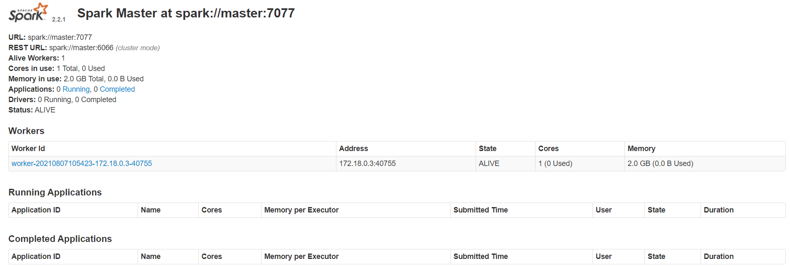
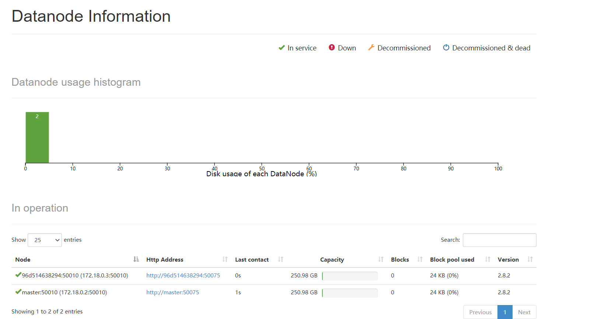

##  Spark 

Apache Spark 是用于大规模数据处理的统一分析引擎。它提供了 Java、Scala、Python 和 R 中的高级 API，以及支持通用执行图的优化引擎。它还支持一组丰富的更高级别的工具，包括[星火SQL](https://spark.apache.org/docs/latest/sql-programming-guide.html)用于SQL和结构化数据的处理，[MLlib](https://spark.apache.org/docs/latest/ml-guide.html)机器学习，[GraphX](https://spark.apache.org/docs/latest/graphx-programming-guide.html)用于图形处理，以及[结构化流](https://spark.apache.org/docs/latest/structured-streaming-programming-guide.html)的增量计算和数据流处理。

- 官方文档：https://spark.apache.org/docs/latest/

## Spark基础

### 1. Spark 环境

> 基于docker+docker-compose 安装单机的spark环境

```bash
$ docker -v
Docker version 20.10.7, build f0df350

$ docker-compose -v
docker-compose version 1.29.2, build 5becea4c
```

> spark环境准备

```bash
## 安装docker的spark镜像singularities/spark:2.2
docker pull singularities/spark

## 创建 docker-compose.yml
$ touch docker-compose.yml

## 编辑文件
$ vi docker-compose.yml

## 写入内容
version: "2"
 
services:
  master:
    image: singularities/spark
    command: start-spark master
    hostname: master
    ports:
      - "6066:6066"
      - "7070:7070"
      - "8080:8080"
      - "50070:50070"
  worker:
    image: singularities/spark
    command: start-spark worker master
    environment:
      SPARK_WORKER_CORES: 1
      SPARK_WORKER_MEMORY: 2g
    links:
      - master
```

在刚刚建立docker-compose.yml文件目录下面使用命令

```bash
 docker-compose up -d
 
 ## 查看运行的容器
 docker-compose ps
 
 ## 查看本机IP
 ipconfig
 
 ## 预览地址
 
 ## web页面
 ip:50070
 ## spark 平台
 ip:8080
 
 ## 停止容器
  docker-compose stop
  
 ## 删除容器
 docker-compose rm
```

> 预览页面

- spark master平台页面：http://localhost:8080/

   

- Spark 管理平台：http://localhost:50070/

   

### 2. 基础知识


## Spark 原理

本文档简要概述了 Spark 如何在集群上运行，以便更容易地理解所涉及的组件。通读[应用程序提交指南](https://spark.apache.org/docs/latest/submitting-applications.html) ，了解如何在集群上启动应用程序。

- 官网文档：https://spark.apache.org/docs/latest/cluster-overview.html

### 1. Spark 运行架构

Spark 框架的核心是一个计算引擎，整体来说，它采用了标准 master-slave 的结构。 如下图所示，它展示了一个 Spark 执行时的基本结构。

- Driver 表示 master， 负责管理整个集群中的作业任务调度。
- Executor 则是 slave，负责实际执行任务。


