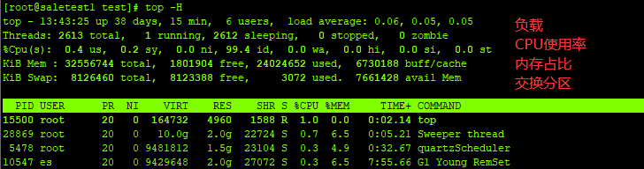
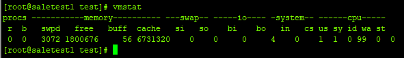
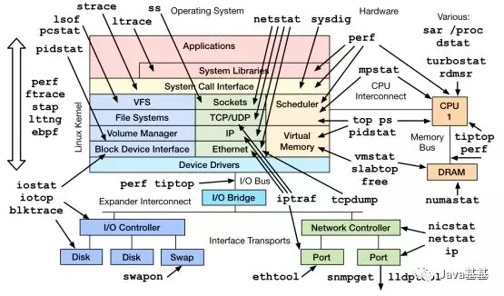
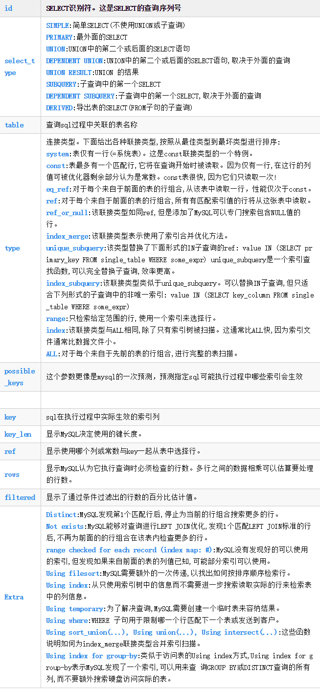

## 性能调优

## 前言

Java 应用性能优化是一个老生常谈的话题，典型的性能问题如页面响应慢、接口超时，服务器负载高、并发数低，数据库频繁死锁等。尤其是在“糙快猛”的互联网开发模式大行其道的今天，随着系统访问量的日益增加和代码的臃肿，各种性能问题开始纷至沓来。Java 应用性能的瓶颈点非常多，比如磁盘、内存、网络 I/O 等系统因素，Java 应用代码，JVM GC，数据库，缓存等。

笔者根据个人经验，将 Java 性能优化分为 4 个层级：应用层、数据库层、框架层、JVM 层

每层优化难度逐级增加，涉及的知识和解决的问题也会不同。

- 应用层：需要理解代码逻辑，通过 Java 线程栈定位有问题代码行等；
- 数据库层：需要分析 SQL、定位死锁等；
- 框架层：需要懂源代码，理解框架机制；
- JVM 层：需要对 GC 的类型和工作机制有深入了解，对各种 JVM 参数作用了然于胸。

围绕 Java 性能优化，有两种最基本的分析方法：现场分析法和事后分析法。

- **现场分析法**：通过保留现场，再采用诊断工具分析定位。现场分析对线上影响较大，部分场景（特别是涉及到用户关键的在线业务时）不太合适。
- **事后分析法** ：需要尽可能多收集现场数据，然后立即恢复服务，同时针对收集的现场数据进行事后分析和复现。

下面我们从性能诊断工具出发，分享搜狗商业平台在其中的一些案例与实践。

## 性能诊断工具

性能诊断一种是针对已经确定有性能问题的系统和代码进行诊断，还有一种是对预上线系统提前性能测试，确定性能是否符合上线要求。本文主要针对前者，后者可以用各种性能压测工具（例如 JMeter）进行测试，不在本文讨论范围内。针对 Java 应用，性能诊断工具主要分为两层：OS 层面和 Java 应用层面（包括应用代码诊断和 GC 诊断）。

### OS 诊断

OS 的诊断主要关注： CPU、Memory、I/O 三个方面。

### CPU 诊断

对于 CPU 主要关注：平均负载（Load Average），CPU 使用率，上下文切换次数（Context Switch）。

#### 常用命令

- top 命令  ` top -H [pid] `  查看系统平均负载和 CPU 使用率

   

  平均负载有三个数字：63.66，58.39，57.18，分别表示过去 1 分钟、5 分钟、15 分钟机器的负载。按照经验，

  - 若数值小于 0.7*CPU 个数，则系统工作正常；
  - 若超过这个值，甚至达到 CPU 核数的四五倍，则系统的负载就明显偏高。
  - 若图 中 15 分钟负载已经高达 57.18，1 分钟负载是 63.66（系统为 16 核），说明系统出现负载问题，且存在进一步升高趋势，需要定位具体原因了。

- vmstat 命令 查看 CPU 的上下文切换次数

   

  上下文切换次数发生的场景主要有如下几种：

  1. 时间片用完，CPU 正常调度下一个任务；
  2. 被其它优先级更高的任务抢占；
  3. 执行任务碰到 I/O 阻塞，挂起当前任务，切换到下一个任务；
  4. 用户代码主动挂起当前任务让出 CPU；
  5. 多任务抢占资源，由于没有抢到被挂起；
  6. 硬件中断。

  Java 线程上下文切换主要来自共享资源的竞争。一般单个对象加锁很少成为系统瓶颈，除非锁粒度过大。但在一个访问频度高，对多个对象连续加锁的代码块中就可能出现大量上下文切换，成为系统瓶颈。比如在我们系统中就曾出现 log4j 1.x 在较大并发下大量打印日志，出现频繁上下文切换，大量线程阻塞，导致系统吞吐量大降的情况，其相关代码如清单 1 所示，升级到 log4j 2.x 才解决这个问题。

### **Memory** 

从操作系统角度，内存关注应用进程是否足够，可以使用 free –m 命令查看内存的使用情况。通过 top 命令可以查看进程使用的虚拟内存 VIRT 和物理内存 RES，根据公式 VIRT = SWAP + RES 可以推算出具体应用使用的交换分区（Swap）情况，使用交换分区过大会影响 Java 应用性能，可以将 swappiness 值调到尽可能小。因为对于 Java 应用来说，占用太多交换分区可能会影响性能，毕竟磁盘性能比内存慢太多。

-  free –m 命令查看内存的使用情况
-  top 命令可以查看进程使用的虚拟内存

### I/O

I/O 包括磁盘 I/O 和网络 I/O，一般情况下磁盘更容易出现 I/O 瓶颈。通过 iostat 可以查看磁盘的读写情况，通过 CPU 的 I/O wait 可以看出磁盘 I/O 是否正常。如果磁盘 I/O 一直处于很高的状态，说明磁盘太慢或故障，成为了性能瓶颈，需要进行应用优化或者磁盘更换。

- iostat 可以查看磁盘的读写情况

除了常用的 top、 ps、vmstat、iostat 等命令，还有其他 Linux 工具可以诊断系统问题，如 mpstat、tcpdump、netstat、pidstat、sar 等。Brendan 总结列出了 Linux 不同设备类型的性能诊断工具，如图 4 所示，可供参考。

 

## Java 应用诊断工具

### 应用代码诊断

应用代码性能问题是相对好解决的一类性能问题。通过一些应用层面监控报警，如果确定有问题的功能和代码，直接通过代码就可以定位；或者通过 top+jstack，找出有问题的线程栈，定位到问题线程的代码上，也可以发现问题。对于更复杂，逻辑更多的代码段，通过 Stopwatch 打印性能日志往往也可以定位大多数应用代码性能问题。

常用的 Java 应用诊断包括线程、堆栈、GC 等方面的诊断。

#### 1. jstack 导出线程栈

jstack 命令通常配合 top 使用

1. 通过 top -H -p pid 定位 Java 进程和线程
2. 再利用 jstack -l pid 导出线程栈。

由于线程栈是瞬态的，因此需要多次 dump，一般 3 次 dump，一般每次隔 5s 就行。将 top 定位的 Java 线程 pid 转成 16 进制，得到 Java 线程栈中的 nid，可以找到对应的问题线程栈。

#### 2. **JProfiler** 对代码耗时采样统计

 JProfiler 可对 CPU、堆、内存进行分析，功能强大，如图 7 所示。同时结合压测工具，可以对代码耗时采样统计。

### GC 诊断

Java GC 解决了程序员管理内存的风险，但 GC 引起的应用暂停成了另一个需要解决的问题。JDK 提供了一系列工具来定位 GC 问题，比较常用的有 jstat、jmap，还有第三方工具 MAT 等。

#### 1. jstat 打印 GC 详细信息

jstat 命令可打印 GC 详细信息，Young GC 和 Full GC 次数，堆信息等。其命令格式为 `  jstat –gcxxx -t pid`  ，如图 8 所示。

#### 2. **jmap** Java 进程堆信息

jmap 打印 Java 进程堆信息  jmap –heap pid。通过 jmap –dump:file=xxx pid 可 dump 堆到文件，然后通过其它工具进一步分析其堆使用情况

在分布式环境中，分布式跟踪系统等基础设施也对应用性能诊断提供了有力支持。

## 性能优化实践

> 以HashMap 并发环境扩容产生死循环举例

以下是我们总结的一些坏代码可能的一些特征，供大家参考：

（1）代码可读性差，无基本编程规范；

（2）对象生成过多或生成大对象，内存泄露等；

（3）IO 流操作过多，或者忘记关闭；

（4）数据库操作过多，事务过长;

（5）同步使用的场景错误;

（6）循环迭代耗时操作等。

## 数据库层调优

通常来说，对于数据库层的调优我们基本上会从以下几个方面出发：

（1）在 SQL 语句层面进行优化：慢 SQL 分析、索引分析和调优、事务拆分等；

（2）在数据库配置层面进行优化：比如字段设计、调整缓存大小、磁盘 I/O 等数据库参数优化、数据碎片整理等；

（3）从数据库结构层面进行优化：考虑数据库的垂直拆分和水平拆分等；

（4）选择合适的数据库引擎或者类型适应不同场景，比如考虑引入 NoSQL 等。

### 1. MySQL性能瓶颈

通常我们在分析sql查询方面都容易出现一个误区，就是上来直接进行explian分析，但是却忽略了系统的运作上下文环境。

> 场景一

假设有一张t_user表，已经存储了几千万的数据，并且也对用户的id进行了索引建立，但是sql执行速度依旧是超过1s时长，这个时候就需要换一种思路进行分析了。

- 例如从表的拆分方面进行思考，是否该对表进行横向拆分，拆解为t_user_01,t_user_02......

以下是总结的一些对于数据库层面可能出现性能瓶颈的几点：

#### 1.1 锁

排查是否会存在锁表的情况导致数据库响应缓慢。

#### 1.2 **sql查询还有优化空间，有待完善**

通常我们对于sql的执行分析都会使用explain命令进行查看：这里我贴出了一张关于explain的常用参数含义表供大家参考：

  

#### 1.3 查出的数据量过大

例如说一条sql直接查询了全表的数据信息量，直接占满了网络带宽，因此访问时候出现了网络拥塞。

#### 1.4 硬件设备不足

例如在面对一些高qps的查询时候，数据库本身的机器硬件配置较低，自然处理速度会比较慢。

#### 1.5 **自适应hash出现锁冲突** 

AHI是innodb存储引擎特有的属性，innodb存储引擎会针对索引数据的查询结果做自适应的优化，当某些特定的索引查询频率特别高的时候会自动为其建立hash索引，从而提升查询的效率。相比于B+Tree索引来说，hash索引能够大大减少对于io的访问次数，“一击命中” 查询数据，具备更加高效的性能，而且hash索引是由mysql内部自动适配的，无需dba在外部做过多的干预。

早期版本的hash索引是采用了单锁模式来防范并发访问问题，这对于程序自身的一个运作高效性有一定的”折扣“，后期通过对hash索引进行了分区，不同页的数据用不同的hashtable，每个分区有对应的锁来做并发访问的预防。

如果某天你发现了有很多线程都被堵塞在了RW-latches的时候，有可能就是因为hash索引的并发访问负载过高导致的堵塞，这个时候可以通过增大hash索引的分区参数，或者关闭自适应hash索引特性来进行处理。

**相关文章** 

1. [MySQL技术内幕InnoDB存储引擎 - 关键特性 - 自适应哈希索引（AHI）](https://www.cnblogs.com/hbbbs/articles/12253334.html) 

## 总结与建议

性能调优同样遵循 2-8 原则，80%的性能问题是由 20%的代码产生的，因此优化关键代码事半功倍。同时，对性能的优化要做到按需优化，过度优化可能引入更多问题。对于 Java 性能优化，不仅要理解系统架构、应用代码，同样需要关注 JVM 层甚至操作系统底层。总结起来主要可以从以下几点进行考虑：

1）基础性能的调优

这里的基础性能指的是硬件层级或者操作系统层级的升级优化，比如网络调优，操作系统版本升级，硬件设备优化等。比如 F5 的使用和 SDD 硬盘的引入，包括新版本 Linux 在 NIO 方面的升级，都可以极大的促进应用的性能提升；

2）数据库性能优化

包括常见的事务拆分，索引调优，SQL 优化，NoSQL 引入等，比如在事务拆分时引入异步化处理，最终达到一致性等做法的引入，包括在针对具体场景引入的各类 NoSQL 数据库，都可以大大缓解传统数据库在高并发下的不足；

3）应用架构优化

引入一些新的计算或者存储框架，利用新特性解决原有集群计算性能瓶颈等；或者引入分布式策略，在计算和存储进行水平化，包括提前计算预处理等，利用典型的空间换时间的做法等；都可以在一定程度上降低系统负载；

4）业务层面的优化

技术并不是提升系统性能的唯一手段，在很多出现性能问题的场景中，其实可以看到很大一部分都是因为特殊的业务场景引起的，如果能在业务上进行规避或者调整，其实往往是最有效的。

## 常用工具

- [**htop** Linux进程浏览器](https://www.oschina.net/p/htop) 

- [阿里开源的 arathas](https://arthas.aliyun.com/doc/)  

**相关文章** 

1. [平常你是怎么对 Java 服务进行调优的](https://mp.weixin.qq.com/s?__biz=MzUxOTc4NjEyMw==&mid=2247485281&idx=1&sn=2995a0a05cfeab5df223ed6c297079ca&chksm=f9f51c85ce8295937bfa9a9f11f4e1465ce2902662e6cf854e856e53c19960186aa7c257bc59&mpshare=1&scene=23&srcid=&sharer_sharetime=1574574577499&sharer_shareid=cfcd208495d565ef66e7dff9f98764da#rd) 
2. [系统的性能瓶颈，排查该从哪些方面入手，如何定位？](https://mp.weixin.qq.com/s/Mo56vuzeh69-wyc7wkSk8A) 

