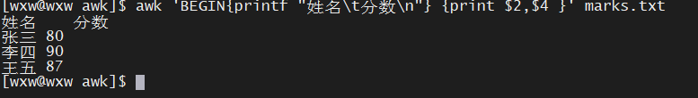
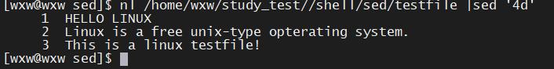

### Shell 编程

---


### 0. 基础知识

- Linux **cut**命令用于显示每行从开头算起 num1 到 num2 的文字
- Linux **who**命令用于显示系统中有哪些使用者正在上面，显示的资料包含了使用者 ID、使用的终端机、从哪边连上来的、上线时间、呆滞时间、CPU 使用量、动作等等。

| Linux 命令大全                                               |                                                              |                                                              |                                                              |
| ------------------------------------------------------------ | ------------------------------------------------------------ | ------------------------------------------------------------ | ------------------------------------------------------------ |
| **1、文件管理**                                              |                                                              |                                                              |                                                              |
| [cat](https://www.runoob.com/linux/linux-comm-cat.html)      | [chattr](https://www.runoob.com/linux/linux-comm-chattr.html) | [chgrp](https://www.runoob.com/linux/linux-comm-chgrp.html)  | [chmod](https://www.runoob.com/linux/linux-comm-chmod.html)  |
| [chown](https://www.runoob.com/linux/linux-comm-chown.html)  | [cksum](https://www.runoob.com/linux/linux-comm-cksum.html)  | [cmp](https://www.runoob.com/linux/linux-comm-cmp.html)      | [diff](https://www.runoob.com/linux/linux-comm-diff.html)    |
| [diffstat](https://www.runoob.com/linux/linux-comm-diffstat.html) | [file](https://www.runoob.com/linux/linux-comm-file.html)    | [find](https://www.runoob.com/linux/linux-comm-find.html)    | [git](https://www.runoob.com/linux/linux-comm-git.html)      |
| [gitview](https://www.runoob.com/linux/linux-comm-gitview.html) | [indent](https://www.runoob.com/linux/linux-comm-indent.html) | [cut](https://www.runoob.com/linux/linux-comm-cut.html)      | [ln](https://www.runoob.com/linux/linux-comm-ln.html)        |
| [less](https://www.runoob.com/linux/linux-comm-less.html)    | [locate](https://www.runoob.com/linux/linux-comm-locate.html) | [lsattr](https://www.runoob.com/linux/linux-comm-lsattr.html) | [mattrib](https://www.runoob.com/linux/linux-comm-mattrib.html) |
| [mc](https://www.runoob.com/linux/linux-comm-mc.html)        | [mdel](https://www.runoob.com/linux/linux-comm-mdel.html)    | [mdir](https://www.runoob.com/linux/linux-comm-mdir.html)    | [mktemp](https://www.runoob.com/linux/linux-comm-mktemp.html) |
| [more](https://www.runoob.com/linux/linux-comm-more.html)    | [mmove](https://www.runoob.com/linux/linux-comm-mmove.html)  | [mread](https://www.runoob.com/linux/linux-comm-mread.html)  | [mren](https://www.runoob.com/linux/linux-comm-mren.html)    |
| [mtools](https://www.runoob.com/linux/linux-comm-mtools.html) | [mtoolstest](https://www.runoob.com/linux/linux-comm-mtoolstest.html) | [mv](https://www.runoob.com/linux/linux-comm-mv.html)        | [od](https://www.runoob.com/linux/linux-comm-od.html)        |
| [paste](https://www.runoob.com/linux/linux-comm-paste.html)  | [patch](https://www.runoob.com/linux/linux-comm-patch.html)  | [rcp](https://www.runoob.com/linux/linux-comm-rcp.html)      | [rm](https://www.runoob.com/linux/linux-comm-rm.html)        |
| [slocate](https://www.runoob.com/linux/linux-comm-slocate.html) | [split](https://www.runoob.com/linux/linux-comm-split.html)  | [tee](https://www.runoob.com/linux/linux-comm-tee.html)      | [tmpwatch](https://www.runoob.com/linux/linux-comm-tmpwatch.html) |
| [touch](https://www.runoob.com/linux/linux-comm-touch.html)  | [umask](https://www.runoob.com/linux/linux-comm-umask.html)  | [which](https://www.runoob.com/linux/linux-comm-which.html)  | [cp](https://www.runoob.com/linux/linux-comm-cp.html)        |
| [whereis](https://www.runoob.com/linux/linux-comm-whereis.html) | [mcopy](https://www.runoob.com/linux/linux-comm-mcopy.html)  | [mshowfat](https://www.runoob.com/linux/linux-comm-mshowfat.html) | [rhmask](https://www.runoob.com/linux/linux-comm-rhmask.html) |
| [scp](https://www.runoob.com/linux/linux-comm-scp.html)      | [awk](https://www.runoob.com/linux/linux-comm-awk.html)      | [read](https://www.runoob.com/linux/linux-comm-read.html)    | [updatedb](https://www.runoob.com/linux/linux-comm-updatedb.html) |
| **2、文档编辑**                                              |                                                              |                                                              |                                                              |
| [col](https://www.runoob.com/linux/linux-comm-col.html)      | [colrm](https://www.runoob.com/linux/linux-comm-colrm.html)  | [comm](https://www.runoob.com/linux/linux-comm-comm.html)    | [csplit](https://www.runoob.com/linux/linux-comm-csplit.html) |
| [ed](https://www.runoob.com/linux/linux-comm-ed.html)        | [egrep](https://www.runoob.com/linux/linux-comm-egrep.html)  | [ex](https://www.runoob.com/linux/linux-comm-ex.html)        | [fgrep](https://www.runoob.com/linux/linux-comm-fgrep.html)  |
| [fmt](https://www.runoob.com/linux/linux-comm-fmt.html)      | [fold](https://www.runoob.com/linux/linux-comm-fold.html)    | [grep](https://www.runoob.com/linux/linux-comm-grep.html)    | [ispell](https://www.runoob.com/linux/linux-comm-ispell.html) |
| [jed](https://www.runoob.com/linux/linux-comm-jed.html)      | [joe](https://www.runoob.com/linux/linux-comm-joe.html)      | [join](https://www.runoob.com/linux/linux-comm-join.html)    | [look](https://www.runoob.com/linux/linux-comm-look.html)    |
| [mtype](https://www.runoob.com/linux/linux-comm-mtype.html)  | [pico](https://www.runoob.com/linux/linux-comm-pico.html)    | [rgrep](https://www.runoob.com/linux/linux-comm-rgrep.html)  | [sed](https://www.runoob.com/linux/linux-comm-sed.html)      |
| [sort](https://www.runoob.com/linux/linux-comm-sort.html)    | [spell](https://www.runoob.com/linux/linux-comm-spell.html)  | [tr](https://www.runoob.com/linux/linux-comm-tr.html)        | [expr](https://www.runoob.com/linux/linux-comm-expr.html)    |
| [uniq](https://www.runoob.com/linux/linux-comm-uniq.html)    | [wc](https://www.runoob.com/linux/linux-comm-wc.html)        | [let](https://www.runoob.com/linux/linux-comm-let.html)      |                                                              |
| **3、文件传输**                                              |                                                              |                                                              |                                                              |
| [lprm](https://www.runoob.com/linux/linux-comm-lprm.html)    | [lpr](https://www.runoob.com/linux/linux-comm-lpr.html)      | [lpq](https://www.runoob.com/linux/linux-comm-lpq.html)      | [lpd](https://www.runoob.com/linux/linux-comm-lpd.html)      |
| [bye](https://www.runoob.com/linux/linux-comm-bye.html)      | [ftp](https://www.runoob.com/linux/linux-comm-ftp.html)      | [uuto](https://www.runoob.com/linux/linux-comm-uuto.html)    | [uupick](https://www.runoob.com/linux/linux-comm-uupick.html) |
| [uucp](https://www.runoob.com/linux/linux-comm-uucp.html)    | [uucico](https://www.runoob.com/linux/linux-comm-uucico.html) | [tftp](https://www.runoob.com/linux/linux-comm-tftp.html)    | [ncftp](https://www.runoob.com/linux/linux-comm-ncftp.html)  |
| [ftpshut](https://www.runoob.com/linux/linux-comm-ftpshut.html) | [ftpwho](https://www.runoob.com/linux/linux-comm-ftpwho.html) | [ftpcount](https://www.runoob.com/linux/linux-comm-ftpcount.html) |                                                              |
| **4、磁盘管理**                                              |                                                              |                                                              |                                                              |
| [cd](https://www.runoob.com/linux/linux-comm-cd.html)        | [df](https://www.runoob.com/linux/linux-comm-df.html)        | [dirs](https://www.runoob.com/linux/linux-comm-dirs.html)    | [du](https://www.runoob.com/linux/linux-comm-du.html)        |
| [edquota](https://www.runoob.com/linux/linux-comm-edquota.html) | [eject](https://www.runoob.com/linux/linux-comm-eject.html)  | [mcd](https://www.runoob.com/linux/linux-comm-mcd.html)      | [mdeltree](https://www.runoob.com/linux/linux-comm-mdeltree.html) |
| [mdu](https://www.runoob.com/linux/linux-comm-mdu.html)      | [mkdir](https://www.runoob.com/linux/linux-comm-mkdir.html)  | [mlabel](https://www.runoob.com/linux/linux-comm-mlabel.html) | [mmd](https://www.runoob.com/linux/linux-comm-mmd.html)      |
| [mrd](https://www.runoob.com/linux/linux-comm-mrd.html)      | [mzip](https://www.runoob.com/linux/linux-comm-mzip.html)    | [pwd](https://www.runoob.com/linux/linux-comm-pwd.html)      | [quota](https://www.runoob.com/linux/linux-comm-quota.html)  |
| [mount](https://www.runoob.com/linux/linux-comm-mount.html)  | [mmount](https://www.runoob.com/linux/linux-comm-mmount.html) | [rmdir](https://www.runoob.com/linux/linux-comm-rmdir.html)  | [rmt](https://www.runoob.com/linux/linux-comm-rmt.html)      |
| [stat](https://www.runoob.com/linux/linux-comm-stat.html)    | [tree](https://www.runoob.com/linux/linux-comm-tree.html)    | [umount](https://www.runoob.com/linux/linux-comm-umount.html) | [ls](https://www.runoob.com/linux/linux-comm-ls.html)        |
| [quotacheck](https://www.runoob.com/linux/linux-comm-quotacheck.html) | [quotaoff](https://www.runoob.com/linux/linux-comm-quotaoff.html) | [lndir](https://www.runoob.com/linux/linux-comm-lndir.html)  | [repquota](https://www.runoob.com/linux/linux-comm-repquota.html) |
| [quotaon](https://www.runoob.com/linux/linux-comm-quotaon.html) |                                                              |                                                              |                                                              |
| **5、磁盘维护**                                              |                                                              |                                                              |                                                              |
| [badblocks](https://www.runoob.com/linux/linux-comm-badblocks.html) | [cfdisk](https://www.runoob.com/linux/linux-comm-cfdisk.html) | [dd](https://www.runoob.com/linux/linux-comm-dd.html)        | [e2fsck](https://www.runoob.com/linux/linux-comm-e2fsck.html) |
| [ext2ed](https://www.runoob.com/linux/linux-comm-ext2ed.html) | [fsck](https://www.runoob.com/linux/linux-comm-fsck.html)    | [fsck.minix](https://www.runoob.com/linux/linux-comm-fsck-minix.html) | [fsconf](https://www.runoob.com/linux/linux-comm-fsconf.html) |
| [fdformat](https://www.runoob.com/linux/linux-comm-fdformat.html) | [hdparm](https://www.runoob.com/linux/linux-comm-hdparm.html) | [mformat](https://www.runoob.com/linux/linux-comm-mformat.html) | [mkbootdisk](https://www.runoob.com/linux/linux-comm-mkbootdisk.html) |
| [mkdosfs](https://www.runoob.com/linux/linux-comm-mkdosfs.html) | [mke2fs](https://www.runoob.com/linux/linux-comm-mke2fs.html) | [mkfs.ext2](https://www.runoob.com/linux/linux-comm-mkfs-ext2.html) | [mkfs.msdos](https://www.runoob.com/linux/linux-comm-mkfs-msdos.html) |
| [mkinitrd](https://www.runoob.com/linux/linux-comm-mkinitrd.html) | [mkisofs](https://www.runoob.com/linux/linux-comm-mkisofs.html) | [mkswap](https://www.runoob.com/linux/linux-comm-mkswap.html) | [mpartition](https://www.runoob.com/linux/linux-comm-mpartition.html) |
| [swapon](https://www.runoob.com/linux/linux-comm-swapon.html) | [symlinks](https://www.runoob.com/linux/linux-comm-symlinks.html) | [sync](https://www.runoob.com/linux/linux-comm-sync.html)    | [mbadblocks](https://www.runoob.com/linux/linux-comm-mbadblocks.html) |
| [mkfs.minix](https://www.runoob.com/linux/linux-comm-mkfs-minix.html) | [fsck.ext2](https://www.runoob.com/linux/linux-comm-fsck-ext2.html) | [fdisk](https://www.runoob.com/linux/linux-comm-fdisk.html)  | [losetup](https://www.runoob.com/linux/linux-comm-losetup.html) |
| [mkfs](https://www.runoob.com/linux/linux-comm-mkfs.html)    | [sfdisk](https://www.runoob.com/linux/linux-comm-sfdisk.html) | [swapoff](https://www.runoob.com/linux/linux-comm-swapoff.html) |                                                              |
| **6、网络通讯**                                              |                                                              |                                                              |                                                              |
| [apachectl](https://www.runoob.com/linux/linux-comm-apachectl.html) | [arpwatch](https://www.runoob.com/linux/linux-comm-arpwatch.html) | [dip](https://www.runoob.com/linux/linux-comm-dip.html)      | [getty](https://www.runoob.com/linux/linux-comm-getty.html)  |
| [mingetty](https://www.runoob.com/linux/linux-comm-mingetty.html) | [uux](https://www.runoob.com/linux/linux-comm-uux.html)      | [telnet](https://www.runoob.com/linux/linux-comm-telnet.html) | [uulog](https://www.runoob.com/linux/linux-comm-uulog.html)  |
| [uustat](https://www.runoob.com/linux/linux-comm-uustat.html) | [ppp-off](https://www.runoob.com/linux/linux-comm-ppp-off.html) | [netconfig](https://www.runoob.com/linux/linux-comm-netconfig.html) | [nc](https://www.runoob.com/linux/linux-comm-nc.html)        |
| [httpd](https://www.runoob.com/linux/linux-comm-httpd.html)  | [ifconfig](https://www.runoob.com/linux/linux-comm-ifconfig.html) | [minicom](https://www.runoob.com/linux/linux-comm-minicom.html) | [mesg](https://www.runoob.com/linux/linux-comm-mesg.html)    |
| [dnsconf](https://www.runoob.com/linux/linux-comm-dnsconf.html) | [wall](https://www.runoob.com/linux/linux-comm-wall.html)    | [netstat](https://www.runoob.com/linux/linux-comm-netstat.html) | [ping](https://www.runoob.com/linux/linux-comm-ping.html)    |
| [pppstats](https://www.runoob.com/linux/linux-comm-pppstats.html) | [samba](https://www.runoob.com/linux/linux-comm-samba.html)  | [setserial](https://www.runoob.com/linux/linux-comm-setserial.html) | [talk](https://www.runoob.com/linux/linux-comm-talk.html)    |
| [traceroute](https://www.runoob.com/linux/linux-comm-traceroute.html) | [tty](https://www.runoob.com/linux/linux-comm-tty.html)      | [newaliases](https://www.runoob.com/linux/linux-comm-newaliases.html) | [uuname](https://www.runoob.com/linux/linux-comm-uuname.html) |
| [netconf](https://www.runoob.com/linux/linux-comm-netconf.html) | [write](https://www.runoob.com/linux/linux-comm-write.html)  | [statserial](https://www.runoob.com/linux/linux-comm-statserial.html) | [efax](https://www.runoob.com/linux/linux-comm-efax.html)    |
| [pppsetup](https://www.runoob.com/linux/linux-comm-pppsetup.html) | [tcpdump](https://www.runoob.com/linux/linux-comm-tcpdump.html) | [ytalk](https://www.runoob.com/linux/linux-comm-ytalk.html)  | [cu](https://www.runoob.com/linux/linux-comm-cu.html)        |
| [smbd](https://www.runoob.com/linux/linux-comm-smbd.html)    | [testparm](https://www.runoob.com/linux/linux-comm-testparm.html) | [smbclient](https://www.runoob.com/linux/linux-comm-smbclient.html) | [shapecfg](https://www.runoob.com/linux/linux-comm-shapecfg.html) |
| **7、系统管理**                                              |                                                              |                                                              |                                                              |
| [adduser](https://www.runoob.com/linux/linux-comm-adduser.html) | [chfn](https://www.runoob.com/linux/linux-comm-chfn.html)    | [useradd](https://www.runoob.com/linux/linux-comm-useradd.html) | [date](https://www.runoob.com/linux/linux-comm-date.html)    |
| [exit](https://www.runoob.com/linux/linux-comm-exit.html)    | [finger](https://www.runoob.com/linux/linux-comm-finger.html) | [fwhios](https://www.runoob.com/linux/linux-comm-fwhios.html) | [sleep](https://www.runoob.com/linux/linux-comm-sleep.html)  |
| [suspend](https://www.runoob.com/linux/linux-comm-suspend.html) | [groupdel](https://www.runoob.com/linux/linux-comm-groupdel.html) | [groupmod](https://www.runoob.com/linux/linux-comm-groupmod.html) | [halt](https://www.runoob.com/linux/linux-comm-halt.html)    |
| [kill](https://www.runoob.com/linux/linux-comm-kill.html)    | [last](https://www.runoob.com/linux/linux-comm-last.html)    | [lastb](https://www.runoob.com/linux/linux-comm-lastb.html)  | [login](https://www.runoob.com/linux/linux-comm-login.html)  |
| [logname](https://www.runoob.com/linux/linux-comm-logname.html) | [logout](https://www.runoob.com/linux/linux-comm-logout.html) | [ps](https://www.runoob.com/linux/linux-comm-ps.html)        | [nice](https://www.runoob.com/linux/linux-comm-nice.html)    |
| [procinfo](https://www.runoob.com/linux/linux-comm-procinfo.html) | [top](https://www.runoob.com/linux/linux-comm-top.html)      | [pstree](https://www.runoob.com/linux/linux-comm-pstree.html) | [reboot](https://www.runoob.com/linux/linux-comm-reboot.html) |
| [rlogin](https://www.runoob.com/linux/linux-comm-rlogin.html) | [rsh](https://www.runoob.com/linux/linux-comm-rsh.html)      | [sliplogin](https://www.runoob.com/linux/linux-comm-sliplogin.html) | [screen](https://www.runoob.com/linux/linux-comm-screen.html) |
| [shutdown](https://www.runoob.com/linux/linux-comm-shutdown.html) | [rwho](https://www.runoob.com/linux/linux-comm-rwho.html)    | [sudo](https://www.runoob.com/linux/linux-comm-sudo.html)    | [gitps](https://www.runoob.com/linux/linux-comm-gitps.html)  |
| [swatch](https://www.runoob.com/linux/linux-comm-swatch.html) | [tload](https://www.runoob.com/linux/linux-comm-tload.html)  | [logrotate](https://www.runoob.com/linux/linux-comm-logrotate.html) | [uname](https://www.runoob.com/linux/linux-comm-uname.html)  |
| [chsh](https://www.runoob.com/linux/linux-comm-chsh.html)    | [userconf](https://www.runoob.com/linux/linux-comm-userconf.html) | [userdel](https://www.runoob.com/linux/linux-comm-userdel.html) | [usermod](https://www.runoob.com/linux/linux-comm-usermod.html) |
| [vlock](https://www.runoob.com/linux/linux-comm-vlock.html)  | [who](https://www.runoob.com/linux/linux-comm-who.html)      | [whoami](https://www.runoob.com/linux/linux-comm-whoami.html) | [whois](https://www.runoob.com/linux/linux-comm-whois.html)  |
| [newgrp](https://www.runoob.com/linux/linux-comm-newgrp.html) | [renice](https://www.runoob.com/linux/linux-comm-renice.html) | [su](https://www.runoob.com/linux/linux-comm-su.html)        | [skill](https://www.runoob.com/linux/linux-comm-skill.html)  |
| [w](https://www.runoob.com/linux/linux-comm-w.html)          | [id](https://www.runoob.com/linux/linux-comm-id.html)        | [groupadd](https://www.runoob.com/linux/linux-comm-groupadd.html) | [free](https://www.runoob.com/linux/linux-comm-free.html)    |
| **8、系统设置**                                              |                                                              |                                                              |                                                              |
| [reset](https://www.runoob.com/linux/linux-comm-reset.html)  | [clear](https://www.runoob.com/linux/linux-comm-clear.html)  | [alias](https://www.runoob.com/linux/linux-comm-alias.html)  | [dircolors](https://www.runoob.com/linux/linux-comm-dircolors.html) |
| [aumix](https://www.runoob.com/linux/linux-comm-aumix.html)  | [bind](https://www.runoob.com/linux/linux-comm-bind.html)    | [chroot](https://www.runoob.com/linux/linux-comm-chroot.html) | [clock](https://www.runoob.com/linux/linux-comm-clock.html)  |
| [crontab](https://www.runoob.com/linux/linux-comm-crontab.html) | [declare](https://www.runoob.com/linux/linux-comm-declare.html) | [depmod](https://www.runoob.com/linux/linux-comm-depmod.html) | [dmesg](https://www.runoob.com/linux/linux-comm-dmesg.html)  |
| [enable](https://www.runoob.com/linux/linux-comm-enable.html) | [eval](https://www.runoob.com/linux/linux-comm-eval.html)    | [export](https://www.runoob.com/linux/linux-comm-export.html) | [pwunconv](https://www.runoob.com/linux/linux-comm-pwunconv.html) |
| [grpconv](https://www.runoob.com/linux/linux-comm-grpconv.html) | [rpm](https://www.runoob.com/linux/linux-comm-rpm.html)      | [insmod](https://www.runoob.com/linux/linux-comm-insmod.html) | [kbdconfig](https://www.runoob.com/linux/linux-comm-kbdconfig.html) |
| [lilo](https://www.runoob.com/linux/linux-comm-lilo.html)    | [liloconfig](https://www.runoob.com/linux/linux-comm-liloconfig.html) | [lsmod](https://www.runoob.com/linux/linux-comm-lsmod.html)  | [minfo](https://www.runoob.com/linux/linux-comm-minfo.html)  |
| [set](https://www.runoob.com/linux/linux-comm-set.html)      | [modprobe](https://www.runoob.com/linux/linux-comm-modprobe.html) | [ntsysv](https://www.runoob.com/linux/linux-comm-ntsysv.html) | [mouseconfig](https://www.runoob.com/linux/linux-comm-mouseconfig.html) |
| [passwd](https://www.runoob.com/linux/linux-comm-passwd.html) | [pwconv](https://www.runoob.com/linux/linux-comm-pwconv.html) | [rdate](https://www.runoob.com/linux/linux-comm-rdate.html)  | [resize](https://www.runoob.com/linux/linux-comm-resize.html) |
| [rmmod](https://www.runoob.com/linux/linux-comm-rmmod.html)  | [grpunconv](https://www.runoob.com/linux/linux-comm-grpunconv.html) | [modinfo](https://www.runoob.com/linux/linux-comm-modinfo.html) | [time](https://www.runoob.com/linux/linux-comm-time.html)    |
| [setup](https://www.runoob.com/linux/linux-comm-setup.html)  | [sndconfig](https://www.runoob.com/linux/linux-comm-sndconfig.html) | [setenv](https://www.runoob.com/linux/linux-comm-setenv.html) | [setconsole](https://www.runoob.com/linux/linux-comm-setconsole.html) |
| [timeconfig](https://www.runoob.com/linux/linux-comm-timeconfig.html) | [ulimit](https://www.runoob.com/linux/linux-comm-ulimit.html) | [unset](https://www.runoob.com/linux/linux-comm-unset.html)  | [chkconfig](https://www.runoob.com/linux/linux-comm-chkconfig.html) |
| [apmd](https://www.runoob.com/linux/linux-comm-apmd.html)    | [hwclock](https://www.runoob.com/linux/linux-comm-hwclock.html) | [mkkickstart](https://www.runoob.com/linux/linux-comm-mkkickstart.html) | [fbset](https://www.runoob.com/linux/linux-comm-fbset.html)  |
| [unalias](https://www.runoob.com/linux/linux-comm-unalias.html) | [SVGATextMode](https://www.runoob.com/linux/linux-comm-svgatextmode.html) | [gpasswd](https://www.runoob.com/linux/linux-comm-gpasswd.html) |                                                              |
| **9、备份压缩**                                              |                                                              |                                                              |                                                              |
| [ar](https://www.runoob.com/linux/linux-comm-ar.html)        | [bunzip2](https://www.runoob.com/linux/linux-comm-bunzip2.html) | [bzip2](https://www.runoob.com/linux/linux-comm-bzip2.html)  | [bzip2recover](https://www.runoob.com/linux/linux-comm-bzip2recover.html) |
| [gunzip](https://www.runoob.com/linux/linux-comm-gunzip.html) | [unarj](https://www.runoob.com/linux/linux-comm-unarj.html)  | [compress](https://www.runoob.com/linux/linux-comm-compress.html) | [cpio](https://www.runoob.com/linux/linux-comm-cpio.html)    |
| [dump](https://www.runoob.com/linux/linux-comm-dump.html)    | [uuencode](https://www.runoob.com/linux/linux-comm-uuencode.html) | [gzexe](https://www.runoob.com/linux/linux-comm-gzexe.html)  | [gzip](https://www.runoob.com/linux/linux-comm-gzip.html)    |
| [lha](https://www.runoob.com/linux/linux-comm-lha.html)      | [restore](https://www.runoob.com/linux/linux-comm-restore.html) | [tar](https://www.runoob.com/linux/linux-comm-tar.html)      | [uudecode](https://www.runoob.com/linux/linux-comm-uudecode.html) |
| [unzip](https://www.runoob.com/linux/linux-comm-unzip.html)  | [zip](https://www.runoob.com/linux/linux-comm-zip.html)      | [zipinfo](https://www.runoob.com/linux/linux-comm-zipinfo.html) |                                                              |
| **10、设备管理**                                             |                                                              |                                                              |                                                              |
| [setleds](https://www.runoob.com/linux/linux-comm-setleds.html) | [loadkeys](https://www.runoob.com/linux/linux-comm-loadkeys.html) | [rdev](https://www.runoob.com/linux/linux-comm-rdev.html)    | [dumpkeys](https://www.runoob.com/linux/linux-comm-dumpkeys.html) |
| [MAKEDEV](https://www.runoob.com/linux/linux-comm-makedev.html) | [poweroff](https://www.runoob.com/linux/linux-comm-poweroff.html) |                                                              |                                                              |

------

#### 0.1 其他命令

- [Linux bc 命令](https://www.runoob.com/linux/linux-comm-bc.html)
- [Linux tail 命令](https://www.runoob.com/linux/linux-comm-tail.html)
- [Linux head 命令](https://www.runoob.com/linux/linux-comm-head.html)
- [Linux xargs 命令](https://www.runoob.com/linux/linux-comm-xargs.html)
- [Linux ip 命令](https://www.runoob.com/linux/linux-comm-ip.html)
- [Linux nohup 命令](https://www.runoob.com/linux/linux-comm-nohup.html)
- [Linux killall 命令](https://www.runoob.com/linux/linux-comm-killall.html)
- [Linux pkill 命令](https://www.runoob.com/linux/linux-comm-pkill.html)

#### 0.2 扩展文章

- [Linux 常用命令全拼](https://www.runoob.com/w3cnote/linux-command-full-fight.html) 

#### 0.3 变量

##### （1）定义变量

> 定义变量 赋值号`=`的周围不能有空格，这可能和你熟悉的大部分编程语言都不一样

**变量的定义规则** 

1. 变量名区分大小写
2. 变量名不能有特殊符号
3. 变量名不能以数字开头
4. 等号两边不能有任何空格
5. 变量名尽量做到见名知意

**特别说明**：对于有空格的字符串给变量赋值时，要用引号引起来

```bash
[root@MissHou ~]# A=hello           定义变量A
[root@MissHou ~]# echo $A           调用变量A，要给钱的，不是人民币是美元"$"
hello
[root@MissHou ~]# echo ${A}         还可以这样调用，不管你的姿势多优雅，总之要给钱
hello
[root@MissHou ~]# A=world           因为是变量所以可以变，移情别恋是常事
[root@MissHou ~]# echo $A           不管你是谁，只要调用就要给钱
world
[root@MissHou ~]# unset A           不跟你玩了，取消变量
[root@MissHou ~]# echo $A           从此，我单身了，你可以给我介绍任何人
```

**举例分析** 

- 直接赋值给一个变量

  ```bash
  [root@MissHou ~]# A=1234567
  [root@MissHou ~]# echo $A
  1234567
  [root@MissHou ~]# echo ${A:2:4}     表示从A变量中第3个字符开始截取，截取4个字符
  3456

  说明：
  $变量名 和 ${变量名}的异同
  相同点：都可以调用变量
  不同点：${变量名}可以只截取变量的一部分，而$变量名不可以
  ```

- 命令执行结果赋值给变量

  ```bash
  [root@MissHou ~]# B=`date +%F`
  [root@MissHou ~]# echo $B
  2019-04-16
  [root@MissHou ~]# C=$(uname -r)
  [root@MissHou ~]# echo $C
  2.6.32-696.el6.x86_64
  ```

- 交互式定义变量

  让用户自己给变量赋值，比较灵活。

  ```bash
  语法：`read [选项] 变量名` 

  参数说明：
       -p 定义提示用户的信息
       -n定义字符数（限制变量值的长度）
       -s不显示（不显示用户输入的内容）
       -t定义超时时间，默认单位为秒（限制用户输入变量值的超时时间）`
  ```

  - 举例说明：

  - 用法1：用户自己定义变量值

    ```bash
    用法1：用户自己定义变量值
    [root@MissHou ~]# read name
    harry
    [root@MissHou ~]# echo $name
    harry
    [root@MissHou ~]# read -p "Input your name:" name
    Input your name:tom
    [root@MissHou ~]# echo $name
    tom
    ```

  - 变量值来自文件

    ```bash
    [root@MissHou ~]# cat 1.txt 
    10.1.1.1 255.255.255.0

    [root@MissHou ~]# read ip mask < 1.txt 
    [root@MissHou ~]# echo $ip
    10.1.1.1
    [root@MissHou ~]# echo $mask
    255.255.255.0
    ```

- **定义有类型的变量**(declare)

  给变量做一些限制，固定变量的类型，比如：整型、只读

  ```bash
  用法：`declare 选项 变量名=变量值`
  ```

  **常用选项：**

  | 选项 | 释义                       | 举例                                         |
  | ---- | -------------------------- | -------------------------------------------- |
  | -i   | 将变量看成整数             | declare -i A=123                             |
  | -r   | 定义只读变量               | declare -r B=hello                           |
  | -a   | 定义普通数组；查看普通数组 |                                              |
  | -A   | 定义关联数组；查看关联数组 |                                              |
  | -x   | 将变量通过环境导出         | declare -x AAA=123456 等于 export AAA=123456 |

##### （2）变量的分类

1. **本地变量** 

   当前用户自定义的变量。当前进程中有效，其他进程及当前进程的子进程无效

2. 环境变量

   > 当前进程有效，并且能够被**子进程**调用。

   - `env`查看当前用户的环境变量
   - `set`查询当前用户的所有变量(临时变量与环境变量)
   - `export 变量名=变量值`    或者  `变量名=变量值；export 变量名` 

   ```bash
   [root@MissHou ~]# export A=hello		临时将一个本地变量（临时变量）变成环境变量
   [root@MissHou ~]# env|grep ^A
   A=hello

   永久生效：
   vim /etc/profile 或者 ~/.bashrc
   export A=hello
   或者
   A=hello
   export A

   说明：系统中有一个变量PATH，环境变量
   export PATH=/usr/local/mysql/bin:$PATH
   ```

3. 全局变量

   全局所有的用户和程序都能调用，且继承，新建的用户也默认能调用.

- **解读相关配置文件**

| 文件名               | 说明                               | 备注                                                       |
| -------------------- | ---------------------------------- | ---------------------------------------------------------- |
| $HOME/.bashrc        | 当前用户的bash信息,用户登录时读取  | 定义别名、umask、函数等                                    |
| $HOME/.bash_profile  | 当前用户的环境变量，用户登录时读取 |                                                            |
| $HOME/.bash_logout   | 当前用户退出当前shell时最后读取    | 定义用户退出时执行的程序等                                 |
| /etc/bashrc          | 全局的bash信息，所有用户都生效     |                                                            |
| /etc/profile         | 全局环境变量信息                   | 系统和所有用户都生效                                       |
| \$HOME/.bash_history | 用户的历史命令                     | history -w   保存历史记录         history -c  清空历史记录 |

**说明：**以上文件修改后，都需要重新source让其生效或者退出重新登录。

- **用户登录**系统**读取**相关  文件的顺序
  1. `/etc/profile`
  2. `$HOME/.bash_profile`
  3. `$HOME/.bashrc`
  4. `/etc/bashrc`
  5. `$HOME/.bash_logout` 

4. 系统变量

   | 内置变量     | 含义                                                         |
   | ------------ | ------------------------------------------------------------ |
   | $?           | 上一条命令执行后返回的状态；状态值为0表示执行正常，**非0**表示执行异常或错误 |
   | $0           | 当前执行的程序或脚本名                                       |
   | $#           | 脚本后面接的参数的**个数**                                   |
   | $*           | 脚本后面**所有参数**，参数当成一个整体输出，每一个变量参数之间以空格隔开 |
   | $@           | 脚本后面**所有参数**，参数是独立的，也是全部输出             |
   | \$1\~$9      | 脚本后面的**位置参数**，$1表示第1个位置参数，依次类推        |
   | \${10}\~${n} | 扩展位置参数,第10个位置变量必须用{}大括号括起来(2位数字以上扩起来) |
   | $$           | 当前所在进程的进程号，如`echo $$`                            |
   | $！          | 后台运行的最后一个进程号 (当前终端）                         |
   | !$           | 调用最后一条命令历史中的参数                                 |

#### 0.4 四则运算

##### （1）四则运算符号

| 表达式  | 举例                            |
| ------- | ------------------------------- |
| $((  )) | echo $((1+1))                   |
| $[ ]    | echo $[10-5]                    |
| expr    | expr 10 / 5                     |
| let     | n=1;let n+=1  等价于  let n=n+1 |

#### 0.5 数组

> [shell 数组](https://www.runoob.com/linux/linux-shell-array.html) 


### 1. 文件管理

**awk、sed、grep更适合的方向：** 

- grep 更适合单纯的查找或匹配文本
- sed 更适合编辑匹配到的文本
- awk 更适合格式化文本

#### 1.1 awk 

##### 基础知识

- awk是一种编程语言，主要用于在linux/unix下对文本和数据进行处理，是linux/unix下的一个工具。数据可以来自标准输入、一个或多个文件，或其它命令的输出

- awk的处理文本和数据的方式：**逐行扫描文件**，默认从第一行到最后一行，寻找匹配的特定模式的行，并在这些行上进行你想要的操作

- 工作流程

  - 读输入文件之前执行的代码段（由BEGIN关键字标识）。
  - 主循环执行输入文件的代码段。
  - 读输入文件之后的代码段（由END关键字标识）

- 命令结构

  - Begin{}    初始化代码块，在对每一行进行处理之前，初始化代码，主要是引用全局变量，设置FS分隔符
  - //            匹配代码块，可以是字符串或正则表达式
  - {}            命令代码块，包含一条或多条命令,多条命令用 ;  隔开
  - END{}      结尾代码块，在对每一行进行处理之后再执行的代码块，主要是进行最终计算或输出结尾摘要信息

  ```powershell
  awk [参数] 'BEGIN{ commands } pattern{ commands } END{ commands }' [文件名]

  特别说明：引用shell变量需用双引号引起

  参数：
    -F   指定分隔符
    -f   调用脚本
    -v   定义变量  
  ```

  例如：`  awk  'BEGIN{X=0}/root/{X+=1}END{print "I find",X,"root lines"}'   /etc/passwd`      统计 /etc/passwd 文件中包含root行的总数

  

  下面的流程图描述出了 AWK 的工作流程：


> awk 字符含义

```scss
$0           表示整个当前行
$1           每行第一个字段
NF           字段数量变量
NR           每行的记录号，多文件记录递增
FNR          与NR类似，不过多文件记录不递增，每个文件都从1开始
\t           制表符
\n           换行符
FS           BEGIN时定义分隔符
RS           输入的记录分隔符， 默认为换行符(即文本是按一行一行输入)
~            包含
!~           不包含
==           等于，必须全部相等，精确比较
!=           不等于，精确比较
&&           逻辑与
||           逻辑或
+            匹配时表示1个或1个以上
/[0-9][0-9]+/     两个或两个以上数字
/[0-9][0-9]*/     一个或一个以上数字
OFS          输出字段分隔符， 默认也是空格，可以改为其他的
ORS          输出的记录分隔符，默认为换行符,即处理结果也是一行一行输出到屏幕
-F  [:#/]    定义了三个分隔符
```

> print打印

```scss
print                                                 是 awk打印指定内容的主要命令，也可以用 printf
awk '{print}'  /etc/passwd   ==   awk '{print $0}'  /etc/passwd  
awk '{print " "}'  /etc/passwd                        不输出passwd的内容，而是输出相同个数的空行，进一步解释了awk是一行一行处理文本
awk '{print "a"}'   /etc/passwd                       输出相同个数的a行，一行只有一个a字母
awk -F:  '{print $1}'  /etc/passwd  ==   awk  -F  ":"  '{print $1}'  /etc/passwd
awk -F: '{print $1 $2}'                                  输入字段1,2，中间不分隔
awk -F: '{print $1,$3,$6}' OFS="\t" /etc/passwd          输出字段1,3,6， 以制表符作为分隔符
awk -F: '{print $1; print $2}'   /etc/passwd             输入字段1,2，分行输出
awk -F: '{print $1 "**" print $2}'   /etc/passwd         输入字段1,2，中间以**分隔
awk -F: '{print "name:"$1"\tid:"$3}' /etc/passwd         自定义格式输出字段1,2
awk -F: '{print NF}' /etc/passwd                         显示每行有多少字段
awk -F: 'NF>2{print }' /etc/passwd                       将每行字段数大于2的打印出来
awk -F: 'NR==5{print}' /etc/passwd                       打印出/etc/passwd文件中的第5行
awk -F: 'NR==5|NR==6{print}' /etc/passwd                 打印出/etc/passwd文件中的第5行和第6行
awk -F: 'NR!=1{print}'  /etc/passwd                      不显示第一行
awk -F: '{print > "1.txt"}'  /etc/passwd                 输出到文件中
awk -F: '{print}' /etc/passwd > 2.txt                    使用重定向输出到文件中               
```

> 字符匹配

```scss
awk  -F: '/root/{print }'  /etc/passwd                         打印出文件中含有root的行
awk  -F: '/'$A'/{print }'  /etc/passwd                         打印出文件中含有变量 $A的行
awk -F: '!/root/{print}' /etc/passwd                           打印出文件中不含有root的行
awk -F:  '/root|tom/{print}'  /etc/passwd                    打印出文件中含有root或者tom的行
awk -F: '/mail/,mysql/{print}'  test                            打印出文件中含有 mail*mysql 的行，*代表有0个或任意多个字符
awk -F: '/^[2][7][7]*/{print}'  test                              打印出文件中以27开头的行，如27,277,27gff 等等
awk -F: '$1~/root/{print}' /etc/passwd                     打印出文件中第一个字段是root的行
awk -F: '($1=="root"){print}' /etc/passwd               打印出文件中第一个字段是root的行，与上面的等效
awk -F: '$1!~/root/{print}' /etc/passwd                   打印出文件中第一个字段不是root的行
awk -F: '($1!="root"){print}' /etc/passwd                打印出文件中第一个字段不是root的行，与上面的等效
awk -F: '$1~/root|ftp/{print}' /etc/passwd               打印出文件中第一个字段是root或ftp的行
awk -F: '($1=="root"||$1=="ftp"){print}' /etc/passwd   打印出文件中第一个字段是root或ftp的行，与上面的等效
awk -F: '$1!~/root|ftp/{print}' /etc/passwd              打印出文件中第一个字段不是root或不是ftp的行
awk -F: '($1!="root"||$1!="ftp"){print}' /etc/passwd    打印出文件中第一个字段不是root或不是ftp的行，与上面等效
awk -F: '{if($1~/mail/) {print $1} else {print $2}}'  /etc/passwd   如果第一个字段是mail，则打印第一个字段，否则打印第2个字段
```

> 格式化输出

```powershell
awk  '{printf  "%-5s %.2d",$1,$2}'  test
```

- printf 表示格式输出
- %格式化输出分隔符
- -8表示长度为8个字符
- s表示字符串类型，d表示小数

##### 使用实例

> 先创建一个名为 marks.txt 的文件。其中包括序列号、学生名字、课程名称与所得分数。

```txt
1)    张三    语文    80
2)    李四    数学    90
3)    王五    英语    87
```

（1）使用 AWK 脚本来显示输出文件中的内容，同时输出表头信息

```powershell
awk 'BEGIN{printf "序号\t名字\t课程\t分数\n"} {print}' marks.txt
```


程序开始执行时，AWK 在开始块中输出表头信息。在主体块中，AWK 每读入一行就将读入的内容输出至标准输出流中，一直到整个文件被全部读入为止

（2）输出marks.txt文本中姓名和分数

```powershell
# 每行按空格或TAB分割，输出文本中的2、4项
awk 'BEGIN{printf "姓名\t分数\n"} {print $2,$4 }' marks.txt
```



###### 基本用法

log.txt文本内容如下：

```txt
2 this is a test
3 Are you like awk
This's a test
10 There are orange,apple,mongo
```

用法一：单行匹配

```powershell
awk '{[pattern] action}' {filenames}   # 行匹配语句 awk '' 只能用单引号
```

实例：

```powershell
# 每行按空格或TAB分割，输出文本中的1、4项
 $ awk '{print $1,$4}' log.txt
 ---------------------------------------------
 2 a
 3 like
 This's
 10 orange,apple,mongo
 
 # 格式化输出
 $ awk '{printf "%-8s %-10s\n",$1,$4}' log.txt
 ---------------------------------------------
 2        a
 3        like
 This's
 10       orange,apple,mongo
```

用法二：分割字符

```
awk -F  #-F相当于内置变量FS, 指定分割字符
```

实例：字符分割

```powershell
# 使用","分割
 $  awk -F, '{print $1,$2}'   log.txt
 ---------------------------------------------
 2 this is a test
 3 Are you like awk
 This's a test
 10 There are orange apple
 
 # 或者使用内建变量
 $ awk 'BEGIN{FS=","} {print $1,$2}'     log.txt
 ---------------------------------------------
 2 this is a test
 3 Are you like awk
 This's a test
 10 There are orange apple
 
 # 使用多个分隔符.先使用空格分割，然后对分割结果再使用","分割
 $ awk -F '[ ,]'  '{print $1,$2,$5}'   log.txt
 ---------------------------------------------
 2 this test
 3 Are awk
 This's a
 10 There apple
```

用法三：设置变量

```powershell
awk -v  # 设置变量
```

实例：

```powershell
 $ awk -va=1 '{print $1,$1+a}' log.txt
 ---------------------------------------------
 2 3
 3 4
 This's 1
 10 11
 $ awk -va=1 -vb=s '{print $1,$1+a,$1b}' log.txt
 ---------------------------------------------
 2 3 2s
 3 4 3s
 This's 1 This'ss
 10 11 10s
```

用法四：awk脚本

```
awk -f {awk脚本} {文件名}
```

实例：

```
 $ awk -f cal.awk log.txt
```

常用的命令：

- **~ 表示模式开始。// 中是模式。** 

```powershell
awk '$1>2' log.txt                                  #命令 过滤第一列大于2的行
awk '$1==2 {print $1,$3}' log.txt                   #命令 过滤第一列等于2的行
awk '$1>2 && $2=="Are" {print $1,$2,$3}' log.txt    #命令 过滤第一列大于2并且第二列等于'Are'的行
awk '$2 ~ /th/ {print $2,$4}' log.txt               # 输出第二列包含 "th"，并打印第二列与第四列
awk '/re/ ' log.txt                                 # 输出包含 "re" 的行
awk 'BEGIN{IGNORECASE=1} /this/' log.txt            # 忽略大小写
awk '$2 !~ /th/ {print $2,$4}' log.txt              # 模式取反
```

###### 常用场景示例

```txt
1) Amit    Physics        80
2) Rahul    Maths        90
3) Shyam    Biology        87
4) Kedar    English        85
5) Hari    History        89
```

**打印某列或者字段** 

```powershell
awk '{print $3 "\t" $4}' marks.txt   #打印某列或者字段

Physics    80
Maths    90
Biology    87
English    85
History    89

# $3 和 $4 代表了输入记录中的第三和第四个字段。
```

**打印所有的行** 

默认情况下，AWK 会打印出所有匹配模式的行

```bash
$ awk '/a/ {print $0}' marks.txt
2)  Rahul   Maths    90
3)  Shyam   Biology  87
4)  Kedar   English  85
5)  Hari    History  89
```

上述命令会判断每一行中是否包含 a，如果包含则打印该行，如果 BODY 部分缺失则默认会执行打印，因此，上述命令和下面这个是等价的

```bash
$ awk '/a/' marks.txt
```

**打印匹配模式的列** 

当模式匹配成功时，默认情况下 AWK 会打印该行，但是也可以让它只打印指定的字段。例如，下面的例子中，只会打印出匹配模式的第三和第四个字段。

```bash
$ awk '/a/ {print $3 "\t" $4}' marks.txt
Maths    90
Biology    87
English    85
History    89
```

**任意顺序打印列**

```bash
$ awk '/a/ {print $4 "\t" $3}' marks.txt
90    Maths
87    Biology
85    English
89    History
```

**统计匹配模式的行数** 

```bash
$ awk '/a/{++cnt} END {print "Count = ", cnt}' marks.txt
Count =  4
```

**打印超过 18 个字符的行** 

```bash
$ awk 'length($0) > 18' marks.txt
3) Shyam   Biology   87
4) Kedar   English   85
```

**查找 history 历史中，最常用的 10 个命令** 

```bash
history | awk '{a[$2]++}END{for(i in a){print a[i] " " i}}' | sort -rn | head
```

**过滤文件中重复行** 

```bash
awk '!x[$0]++' <file> 
```

**将一行长度超过 72 字符的行打印** 

```bash
awk 'length>72' file
```

**查看最近哪些用户使用系统** 

```bash
last | grep -v "^$" | awk '{ print $1 }' | sort -nr | uniq -c
```

**计算文本中的数值的和** 

```bash
awk '{s+=$1} ENG {printf "%.0f", s}' /path/to/file
```

[awk过滤统计不重复的行](https://www.cnblogs.com/beautiful-code/p/5783517.html) 

- awk以‘\t’为分隔符区分列

  ```bash
  cat logs | grep IconsendRedirect | grep 1752 | awk -F'\t' '{print $8}'| wc -l
  ```

**awk过滤统计不重复的行数** 

```bash
 cat hello.txt | awk '!a[$0]++' | wc -l
```

 

**awk文件中统计不同IP出现的次数,以及对应的IP**

> 来源：[awk命令之通过在awk中使用数组及for循环来统计不同IP出现的次数](https://www.imzcy.cn/2387.html) 

准备文件：

```java
[root@imzcy ~]# cat ips.txt
192.168.1.3
192.168.1.3
192.168.1.2
192.168.1.6
192.168.1.2
192.168.1.3
192.168.1.6
192.168.1.3
192.168.1.6
192.168.1.2
192.168.1.2
192.168.1.2
192.168.1.2
192.168.1.2
192.168.1.2
192.168.1.2
192.168.1.6
192.168.1.6
192.168.1.6
192.168.1.6
[root@imzcy ~]#
```

统计不同IP个数的指令：

```java
awk '{a[$1]+=1;} END{for(i in a){print a[i]" " i;}}' ips.txt
或者
cat ips.txt |awk '{a[$1]+=1;} END {for(i in a){print a[i]" "i;}}'
```

 

使用背景：

最近没事通过阿里云手机app查看本站CDN使用状态，发现CDN统计信息中返回码4xx的占比一直持续很多，基本30%左右，有时候还飙到100%了快。通过查看nginx日志，发现有很多IP在刷站点上根本不存在的地址，所以有大量404出现。于是想统计下看哪些IP访问404页面比较多，将其加到黑名单，限制访问本站点。既然要统计不同IP出现次数了，肯定要用awk来比较方便了。记得之前有用awk来统计linux下不同状态连接数。但是真用起来突然发现不知道怎么用了。。。时间真是把杀猪刀⊙﹏⊙||| 又查了半天资料才给搞好，，于是想着还是记录下笔记吧！

  为了方便讲解，这里就不拿nginx日志来做演示了，只给出一个包含不同IP的文件(效果都是一样的，处理nginx日志只是提前将状态码404的行都筛选出来，然后再统计IP那一列出现次数而已，例如：**awk '/\<404\>/{print $1}') 是用来筛选出包含 状态码为404 的 行** 

相关文章：

1. [Linux awk 命令](https://www.runoob.com/linux/linux-comm-awk.html) 

#### 1.2 sed 

**sed**是一种流编辑器，它是文本处理中非常好的工具，能够完美的配合正则表达式使用，功能不同凡响。处理时，把当前处理的行存储在临时缓冲区中，称为“模式空间”（pattern space），接着用sed[命令](https://www.linuxcool.com/)处理缓冲区中的内容，处理完成后，把缓冲区的内容送往屏幕。接着处理下一行，这样不断重复，直到文件末尾。文件内容并没有改变，除非你使用重定向存储输出。Sed主要用来自动编辑一个或多个文件，可以将数据行进行替换、删除、新增、选取等特定工作，简化对文件的反复操作，编写转换程序等。

 **命令格式** 

```bash
sed的命令格式：sed [options] 'command' file(s);

sed的脚本格式：sed [options] -f scriptfile file(s);

动作说明：
a ：新增， a 的后面可以接字串，而这些字串会在新的一行出现(目前的下一行)～
c ：取代， c 的后面可以接字串，这些字串可以取代 n1,n2 之间的行！
d ：删除，因为是删除啊，所以 d 后面通常不接任何咚咚；
i ：插入， i 的后面可以接字串，而这些字串会在新的一行出现(目前的上一行)；
p ：打印，亦即将某个选择的数据印出。通常 p 会与参数 sed -n 一起运行～
s ：取代，可以直接进行取代的工作哩！通常这个 s 的动作可以搭配正规表示法！例如 1,20s/old/new/g 就是啦！
```

选项

- -e ：直接在命令行模式上进行sed动作编辑，此为默认选项;
- -f ：将sed的动作写在一个文件内，用–f filename 执行filename内的sed动作;
- -i ：直接修改文件内容;
- -n ：只打印模式匹配的行；
- -r ：支持扩展表达式;
- -h或--help：显示帮助；
- -V或--version：显示版本信息。

##### 使用实例

准备testfile文件

```txt
HELLO LINUX!  
Linux is a free unix-type opterating system.  
This is a linux testfile!  
Linux test 
```

**使用sed 在第四行后添加新字符串，并将结果输出到标准输出**

```bash
sed -e 4a\newLine testfile 
sed -e '4 a newline\nnewline2\n' testfile  # 4 行之后追加 3 行(2 行文字和 1 行空行)
```

输出结果：

 

**以行为单位的新增/删除** 

将 /home/wxw/study_test/shell/sed 目录下内容列出并且列印行号，同时，请将第 4 行删除！

```bash
nl /home/wxw/study_test//shell/sed/testfile |sed '4d' #删除第4行
nl /home/wxw/study_test//shell/sed/testfile |sed '4,$d' #删除第4行到最后一行
```

输出结果

 

**在第二行后(亦即是加在第三行)加上『drink tea?』字样！** 

```bash
nl /home/wxw/study_test//shell/sed/testfile | sed '2a drink tea'
nl /home/wxw/study_test//shell/sed/testfile | sed '2i drink tea'  # 第二行前加一行

# 如果是要增加两行以上，在第二行后面加入两行字，例如 Drink tea or ..... 与 drink beer?
nl /home/wxw/study_test//shell/sed/testfile | sed '2a Drink tea or ...... \ drink beer ?'
```

> 每一行之间都必须要以反斜杠『 \ 』来进行新行的添加喔！所以，上面的例子中，我们可以发现在第一行的最后面就有 \ 存在

**以行为单位的替换与显示** 

```bash
nl /etc/passwd | sed '2,5c No 2-5 number'  # 将第2-5行的内容取代成为『No 2-5 number』
nl /etc/passwd | sed -n '5,7p'             # 仅列出 /etc/passwd 文件内的第 5-7 行
```

可以透过这个 sed 的以行为单位的显示功能， 就能够将某一个文件内的某些行号选择出来显示

**数据的搜寻并显示**

```bash
nl /etc/passwd | sed '/root/p'           # 搜索 /etc/passwd有root关键字的行
nl /etc/passwd | sed -n '/root/p'        # 使用-n的时候将只打印包含模板的行
```

**数据的搜寻并删除** 

```bash
nl /etc/passwd | sed  '/root/d' #删除/etc/passwd所有包含root的行，其他行输出
```

**数据的搜寻并执行命令**

搜索/etc/passwd,找到root对应的行，执行后面花括号中的一组命令，每个命令之间用分号分隔，这里把bash替换为blueshell，再输出这行：

```bash
nl /etc/passwd | sed -n '/root/{s/bash/blueshell/;p;q}'    
```

**数据的搜寻并替换** 

除了整行的处理模式之外， sed 还可以用行为单位进行部分数据的搜寻并取代。基本上 sed 的搜寻与替代的与 vi 相当的类似！他有点像这样：

```bash
sed 's/要被取代的字串/新的字串/g'
```

先观察原始信息，利用 /sbin/ifconfig 查询 IP

```txt
[root@www ~]# /sbin/ifconfig eth0
eth0 Link encap:Ethernet HWaddr 00:90:CC:A6:34:84
inet addr:192.168.1.100 Bcast:192.168.1.255 Mask:255.255.255.0
inet6 addr: fe80::290:ccff:fea6:3484/64 Scope:Link
UP BROADCAST RUNNING MULTICAST MTU:1500 Metric:1
```

本机的ip是192.168.1.100。

将 IP 前面的部分予以删除

```bash
[root@www ~]# /sbin/ifconfig eth0 | grep 'inet addr' | sed 's/^.*addr://g'
192.168.1.100 Bcast:192.168.1.255 Mask:255.255.255.0
```

**多点编** 

一条sed命令，删除/etc/passwd第三行到末尾的数据，并把bash替换为blueshell

```bash
nl /etc/passwd | sed -e '3,$d' -e 's/bash/blueshell/'
```

-e表示多点编辑，第一个编辑命令删除/etc/passwd第三行到末尾的数据，第二条命令搜索bash替换为blueshell。

**相关文章** 

- [sed命令编辑](https://www.runoob.com/linux/linux-comm-sed.html)  


### 2. 实战案例

> 编写shell 过程中注意事项

1. 开头加解释器：#!/bin/bash 语法缩进，使用四个空格；多加注释说明。
2. 命名建议规则：变量名大写、局部变量小写，函数名小写，名字体现出实际作用。
3. 默认变量是全局的，在函数中变量local指定为局部变量，避免污染其他作用域。
4. 有两个命令能帮助我调试脚本：set -e 遇到执行非0时退出脚本，set-x 打印执行过程。 写脚本一定先测试再到生产上。

#### 2.1 基本实例

##### （1）获取随机字符串或数字

- 获取随机8位字符串：

```bash
方法1：
# echo $RANDOM |md5sum |cut -c 1-8
471b94f2
方法2：
# openssl rand -base64 4
vg3BEg==
方法3：
# cat /proc/sys/kernel/random/uuid |cut -c 1-8
ed9e032c
```

- 获取随机8位数字：

```bash
方法1：
# echo $RANDOM |cksum |cut -c 1-8
23648321
方法2：
# openssl rand -base64 4 |cksum |cut -c 1-8
38571131
方法3：
# date +%N |cut -c 1-8
69024815
```

cksum：打印CRC效验和统计字节

##### （2）**检查主机存活状态** 

```bash
方法1：将错误IP放到数组里面判断是否ping失败三次
#!/bin/bash
for IP in $IP_LIST; do
    NUM=1
    while [ $NUM -le 3 ]; do
        if ping -c 1 $IP &> /dev/null; then
            echo "$IP Ping is successful."
            break
        else
            FAIL_COUNT[$NUM]=$IP
            let NUM++
        fi
    done
    if [ ${#FAIL_COUNT[*]} -eq 3 ]; then
        echo "${FAIL_COUNT[1]} Ping is failure!"
        unset FAIL_COUNT[*]
    fi
done

   方法2：将错误次数放到FAIL_COUNT变量里面判断是否ping失败三次
#!/bin/bash
for IP in $IP_LIST; do
    FAIL_COUNT=0
    for (( i=1;i<=3;i++)); do
        if ping -c 1 $IP &>/dev/null; then
            echo "$IP Ping is successful."
            break
        else
            let FAIL_COUNT++
        fi
    done
    if [ $FAIL_COUNT -eq 3 ]; then
        echo "$IP Ping is failure!"
    fi
done

方法3：利用for循环将ping通就跳出循环继续，如果不跳出就会走到打印ping失败
#!/bin/bash
ping_success_status() {
    if ping -c 1 $IP &>/dev/null; then
        echo "$IP Ping is successful."
        continue
    fi
}

for IP in $IP_LIST; do
    ping_success_status
    ping_success_status
    ping_success_status
    echo "$IP Ping is failure!"
done
```

##### （3）**监控CPU、内存和硬盘利用率**

```bash
#!/bin/bash

DATE=$(date +%F" "%H:%M)
IP=$(ifconfig eth0 |awk '/netmask/ {print $2}')
if ! which vmstat &> /dev/null; then
    echo "vmstat command no found, Please install procps package."
    exit 1
fi

## CPU
US=$(vmstat |awk 'NR==3 {print $13}')
SY=$(vmstat |awk 'NR==3 {print $14}')
IDLE=$(vmstat |awk 'NR==3 {print $15}')
WAIT=$(vmstat |awk 'NR==3 {print $15}')
USE=$(($US+$SY))
if [ $USE -ge 50 ];then
    echo "
    Date: $DATE
    Host: $IP
    Problem: CPU utilization $USE"
fi

## Mem
TOTAL=$(free -m |awk '/Mem/ {print $2}')
USE=$(free -m |awk '/Mem/ {print $3}')
FREE=$(free -m |awk '/Mem/ {print $4+$6}')

if [ $FREE -lt 1024 ]; then
    echo "
    Date: $DATE
    Host: $IP
    Problem: Total=$TOTAL,Use=$USE,Free=$FREE"
fi

#disk
PART_USE=$(df -h |awk -F'[% ]+' 'BEGIN{OFS="="} /^\/dev/ {print $1,$2,$5,$6}')
for i in $PART_USE; do
    PART=$(echo $i |cut -d"=" -f1)
    TOTAL=$(echo $i |cut -d "=" -f2)
    USE=$(echo $i |cut -d"=" -f3)
    MOUNT=$(echo $i |cut -d"=" -f4)
    if [ $USE -gt 80 ]; then
        echo "
        Date: $DATE
        Host: $IP
        Total: $TOTAL
        Problem: $PART=$USE($MOUNT)"
    fi
done
```

##### （4）**批量主机磁盘利用率监控**

前提监控端和被监控端SSH免交互登录或者密钥登录。 写一个配置文件保存被监控主机SSH连接信息，文件内容格式：IP User Port

```bash
#!/bin/bash
HOST_INFO=host.info
for IP in $(awk '/^[^#]/ {print $1}' $HOST_INFO); do
    USER=$(awk -v ip=$IP 'ip==$1 {print $2}' $HOST_INFO)
    PORT=$(awk -v ip=$IP 'ip==$1 {print $3}' $HOST_INFO)
    TMP_FILE=/tmp/disk.tmp
    ssh -p $PORT $USER@$IP df -h > $TMP_FILE
    USE_RATE_LIST=$(awk 'BEGIN{OFS="="} /^\/dev/ {print $NF,int($5)}' $TMP_FILE)

    for USE_RATE in $USE_RATE_LIST; do
        PART_NAME=${USE_RATE%=*} ##从右到左，非贪婪匹配，匹配到的删除
        USE_RATE=${USE_RATE#*=} ##从左到右，非贪婪匹配，匹配到的删除
        if [ $USE_RATE -ge 10 ];then
        echo "Warning: $IP $PART_NAME Partition usage $USE_RATE%!"
        fi
    done
done
```

##### （5）**检查网站可用性** 

```bash
#!/bin/bash

#--------------------
#1）检查URL可用性
#方法1：
check_url() {
    HTTP_CODE=$(curl -o /dev/null --connect-timeout 3 -s -w "%{http_code}" $1)
    if [ $HTTP_CODE -ne 200 ]; then
        echo "Warning: $1 Access failure!"
    fi
}
#方法2：
check_url_2() {
    if ! wget -T 10 --tries=1 --spider $1 &>/dev/null; then
#-T超时时间，--tries尝试1次，--spider爬虫模式
        echo "Warning: $1 Access failure!"
    fi
}

#check_url www.baidu.com
#check_url_2 www.aaaa.com

#2）判断三次URL可用性
#思路与上面检查主机存活状态一样。

#---------------------------------

URL_LIST="www.baidu.com www.agasgf.com"

#------
#方法1：利用循环技巧，如果成功就跳出当前循环，否则执行到最后一行
check_url_3() {
    HTTP_CODE=$(curl -o /dev/null --connect-timeout 3 -s -w "%{http_code}" $1)
    if [ $HTTP_CODE -eq 200 ]; then
        continue
    fi
}

for URL in $URL_LIST; do
    check_url_3 $URL
    check_url_3 $URL
    check_url_3 $URL
    echo "Warning: $URL Access failure!"
done

#------
#方法2：错误次数保存到变量

for URL in $URL_LIST; do
    FAIL_COUNT=0
    for ((i=1;i<=3;i++)); do
        HTTP_CODE=$(curl -o /dev/null --connect-timeout 3 -s -w "%{http_code}" $URL)
        if [ $HTTP_CODE -ne 200 ]; then
            let FAIL_COUNT++
        else
            break
        fi
    done
    if [ $FAIL_COUNT -eq 3 ]; then
        echo "Warning: $URL Access failure!"
    fi
done

#------
#方法3：错误次数保存到数组
for URL in $URL_LIST;do
    NUM=1
    unset FAIL_COUNT
    while [ $NUM -le 3 ]; do
        HTTP_CODE=$(curl -o /dev/null --connect-timeout 3 -s -w "%{http_code}" $URL)
        if [ $HTTP_CODE -ne 200 ]; then
            FAIL_COUNT[$NUM]=$URL
            let NUM++
        else
            break
        fi
    done
    if [ ${#FAIL_COUNT[@]} -eq 3 ];then
        echo "Warning: $URL Access failure!"
    fi
done
```

（6）**检查MySQL主从同步状态** 

```bash
#!/bin/bash  
USER=bak
PASSWD=123456
# #gsub去除冒号后面的空格
IO_SQL_STATUS=$(mysql -u$USER -p$PASSWD -e  show slave statusG  |awk -F:  /Slave_.*_Running/{gsub(": ",":");print $0} )
for i in $IO_SQL_STATUS; do
    THREAD_STATUS_NAME=${i%:*}
    THREAD_STATUS=${i#*:}
    if [ "$THREAD_STATUS" != "Yes" ]; then
        echo "Error: MySQL Master-Slave $THREAD_STATUS_NAME status is $THREAD_STATUS!"
    fi
done
```


**相关文章** 

1. [30个Linux Shell脚本经典案例（上）](https://zhuanlan.zhihu.com/p/161356277) 


### 3.Shell 脚本编程

#### 3.1 必会基础

（1）**命令：set -e 或者 set +e** 

```bash
- set -e表示从当前位置开始，如果出现任何错误都将触发exit。
- set +e表示不管出现任何错误继续执行脚本。
```

（2）shell脚本调试

- 检查是否有语法错误-n：

  ```powershell
  bash -n script_name.sh
  ```

- 执行并调试 Shell 脚本-x：

  ```powershell
  bash -x script_name.sh
  ```

**相关文章**

1. [shell基础](https://zhuanlan.zhihu.com/p/264346586) 


