!> GIt 版本控制


### 前言

- GitHub下克隆加速地址：将` github.com` 替换为`  github.com.cnpmjs.org`  

  

### 常用命令

#### 1.1 git reset

它有三种模式，soft,mixed,hard，具体的使用方法下面这张图，展示的很全面了.

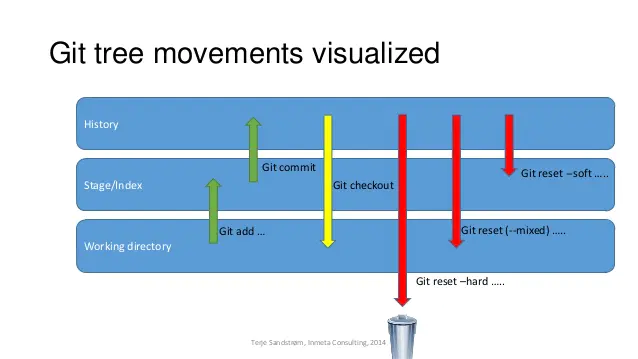 

- **reset --hard** 会在重置 **HEAD** 和**branch**的同时，重置stage区和工作目录里的内容
- **reset --soft** 会在重置 **HEAD** 和 **branch** 时，保留工作目录和暂存区中的内容，并把重置 **HEAD** 所带来的新的差异放进暂存区。

#### 1.2 git config

（1）**配置git信息** 

```bash
git config --global user.name "bryan sun"
git config --global user.email "hitsjt@gmail.com"
```

（2）查看git配置信息

```bash
git config -l
```


### 集中式与分布式

Git 属于分布式版本控制系统，而 SVN 属于集中式。

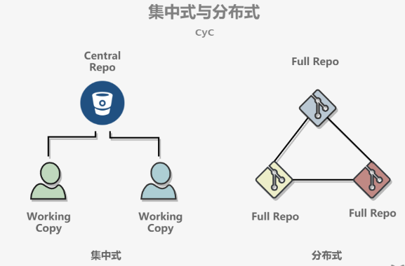 

-  集中式版本控制只有中心服务器拥有一份代码，而分布式版本控制每个人的电脑上就有一份完整的代码。
- 集中式版本控制有安全性问题，当中心服务器挂了所有人都没办法工作了
- 集中式版本控制需要连网才能工作，如果网速过慢，那么提交一个文件会慢的无法让人忍受。而分布式版本控制不需要连网就能工作。

- 分布式版本控制新建分支、合并分支操作速度非常快，而集中式版本控制新建一个分支相当于复制一份完整代码。

### 中心服务器

中心服务器用来交换每个用户的修改，没有中心服务器也能工作，但是中心服务器能够 24 小时保持开机状态，这样就能更方便的交换修改。

Github 就是一个中心服务器。

### 工作流

新建一个仓库之后，当前目录就成为了工作区，工作区下有一个隐藏目录 .git，它属于 Git 的版本库。

Git 的版本库有一个称为 Stage 的暂存区以及最后的 History 版本库，History 存储所有分支信息，使用一个 HEAD 指针指向当前分支。

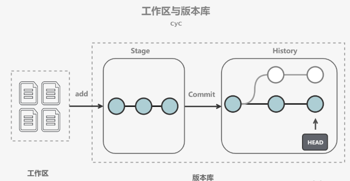 

- git add files 把文件的修改添加到暂存区
- git commit 把暂存区的修改提交到当前分支，提交之后暂存区就被清空了
- git reset -- files 使用当前分支上的修改覆盖暂存区，用来撤销最后一次 git add files
- git checkout -- files 使用暂存区的修改覆盖工作目录，用来撤销本地修改

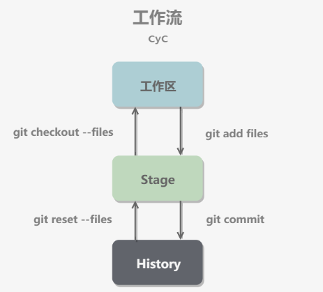 

可以跳过暂存区域直接从分支中取出修改，或者直接提交修改到分支中。

- git commit -a 直接把所有文件的修改添加到暂存区然后执行提交
- git checkout HEAD -- files 取出最后一次修改，可以用来进行回滚操作

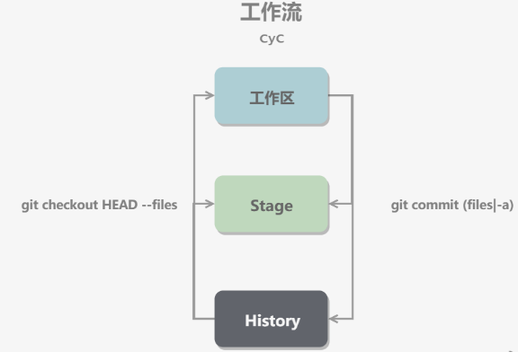 

### 分支实现

使用指针将每个提交连接成一条时间线，HEAD 指针指向当前分支指针。

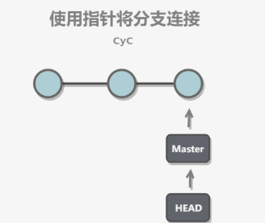 

新建分支是新建一个指针指向时间线的最后一个节点，并让 HEAD 指针指向新分支，表示新分支成为当前分支。

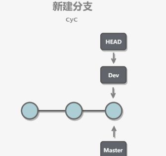 

每次提交只会让当前分支指针向前移动，而其它分支指针不会移动。

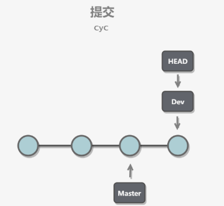 

合并分支也只需要改变指针即可。

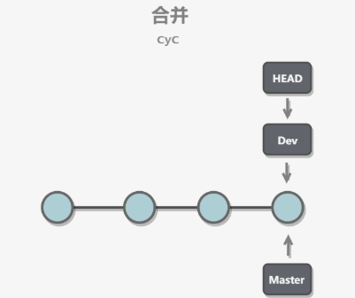 

#### 4.1 分支管理指令

```bash
# 查看当前分支
git branch

# 创建新分支dev   dev:新分支名称  -b:创建并切换到dev
git checkout -b dev

# 在dev分支上进行开发,master分支不变
git add readme.txt 
git commit -m "branch test"

# 切回到master分支,不会看到dev分支上的修改内容
git checkout master

# 切回master分支,再进行合并dev到当前master分支
git merge dev

# 切回master分支,删除dev分支
git branch -d dev
```


### 解决冲突 

当两个分支都对同一个文件的同一行进行了修改，在分支合并时就会产生冲突。

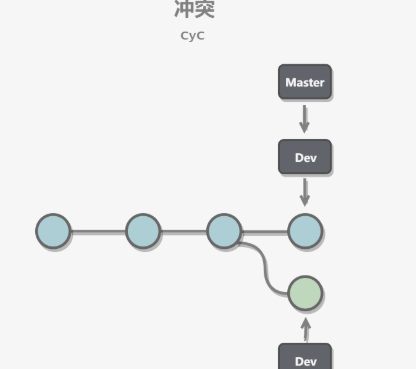 

Git 会使用 <<<<<<< ，======= ，>>>>>>> 标记出不同分支的内容，只需要把不同分支中冲突部分修改成一样就能解决冲突。

```xml
<<<<<<< HEAD
Creating a new branch is quick & simple.
=======
Creating a new branch is quick AND simple.
>>>>>>> feature1
```

#### 5.1 解决方案

1. 尽量避免不同人修改同一个文件
2. 如果修改相同文件,应该先更新再修改
3. 如果重复发生,相关人员在发生冲突方协商解决
4. 冲突解决完成后,标记已解决,提交代码,双方都更新最新代码

### Fast forward (快进式合并)

"快进式合并"（fast-farward merge），会直接将 master 分支指向合并的分支，这种模式下进行分支合并会丢失分支信息，也就不能在分支历史上看出分支信息。

可以在合并时加上 --no-ff 参数来禁用 Fast forward 模式，并且加上 -m 参数让合并时产生一个新的 commit。

```bash
$ git merge --no-ff -m "merge with no-ff" dev
```

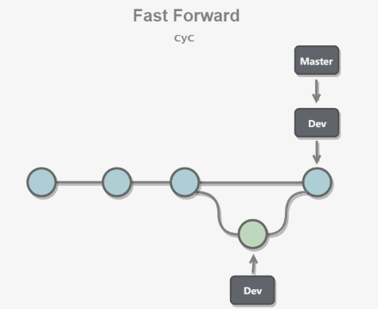 

### 储藏（Stashing）

在一个分支上操作之后，如果还没有将修改提交到分支上，此时进行切换分支，那么另一个分支上也能看到新的修改。这是因为所有分支都共用一个工作区的缘故。

可以使用 git stash 将当前分支的修改储藏起来，此时当前工作区的所有修改都会被存到栈中，也就是说当前工作区是干净的，没有任何未提交的修改。此时就可以安全的切换到其它分支上了。

```bash
$ git stash
Saved working directory and index state \ "WIP on master: 049d078 added the index file"
HEAD is now at 049d078 added the index file (To restore them type "git stash apply")
```

该功能可以用于 bug 分支的实现。如果当前正在 dev 分支上进行开发，但是此时 master 上有个 bug 需要修复，但是 dev 分支上的开发还未完成，不想立即提交。在新建 bug 分支并切换到 bug 分支之前就需要使用 git stash 将 dev 分支的未提交修改储藏起来。

#### 7.1 常用命令

- **git stash** save "save message"  : 执行存储时，添加备注，方便查找，只有git stash 也要可以的，但查找时不方便识别。
- **git stash list**  ：查看stash了哪些存储
- **git stash show** ：显示做了哪些改动，默认show第一个存储,如果要显示其他存贮，后面加stash@{$num}，比如第二个 git stash show stash@{1}
- **git stash show -p** : 显示第一个存储的改动，如果想显示其他存存储，命令：git stash show  stash@{$num}  -p ，比如第二个：git stash show  stash@{1}  -p
- **git stash apply** :应用某个存储,但不会把存储从存储列表中删除，默认使用第一个存储,即stash@{0}，如果要使用其他个，git stash apply stash@{$num} ， 比如第二个：git stash apply stash@{1} 
- **git stash pop** ：命令恢复之前缓存的工作目录，将缓存堆栈中的对应stash删除，并将对应修改应用到当前的工作目录下,默认为第一个stash,即stash@{0}，如果要应用并删除其他stash，命令：git stash pop stash@{$num} ，比如应用并删除第二个：git stash pop stash@{1}
- **git stash drop** stash@{$num} ：丢弃stash@{$num}存储，从列表中删除这个存储
- `git stash clear ：`删除所有缓存的stash

**说明:新增的文件，直接执行stash是不会被存储的，只存储改动的文件，也就是没有在git 版本控制中的文件，是不能被git stash 存起来的**    

所以如果想stash新增的文件，可以先 ` git add .` 然后就可以stash 成功了

**如果要应用这些stash，直接使用git stash apply或者git stash pop就可以再次导出来了** 

**总结下**：

（1）git add 只是把文件加到git 版本控制里，并不等于就被stash起来了，git add和git stash 没有必然的关系，但是执行git stash 能正确存储的前提是文件必须在git 版本控制中才行。

（2）常规 git stash 的一个限制是它会一下暂存所有的文件。有时，只备份某些文件更为方便，让另外一些与代码库保持一致。一个非常有用的技巧，用来备份部分文件：

1. add 那些你不想备份的文件（例如： git add file1.js, file2.js）
2. 调用 git stash –keep-index。只会备份那些没有被add的文件。
3. 调用 git reset 取消已经add的文件的备份，继续自己的工作。

### SSH 传输设置

Git 仓库和 Github 中心仓库之间的传输是通过 SSH 加密。

如果工作区下没有 .ssh 目录，或者该目录下没有 id_rsa 和 id_rsa.pub 这两个文件，可以通过以下命令来创建 SSH Key：

```bash
$ ssh-keygen -t rsa -C "youremail@example.com"
```

然后把公钥 id_rsa.pub 的内容复制到 Github "Account settings" 的 SSH Keys 中。

### .gitignore 文件

忽略以下文件：

- 操作系统自动生成的文件，比如缩略图；
- 编译生成的中间文件，比如 Java 编译产生的 .class 文件；
- 自己的敏感信息，比如存放口令的配置文件。

不需要全部自己编写，可以到 [https://github.com/github/gitignore (opens new window)](https://github.com/github/gitignore)中进行查询。

### Git 命令一览

 

比较详细的地址：http://www.cheat-sheets.org/saved-copy/git-cheat-sheet.pdf

**相关文章** 

- [Git - 简明指南(opens new window)](http://rogerdudler.github.io/git-guide/index.zh.html)
- [图解 Git(opens new window)](http://marklodato.github.io/visual-git-guide/index-zh-cn.html)
- [廖雪峰 : Git 教程(opens new window)](https://www.liaoxuefeng.com/wiki/0013739516305929606dd18361248578c67b8067c8c017b000)
- [Learn Git Branching](https://learngitbranching.js.org/)


