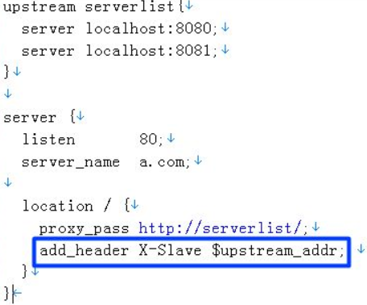
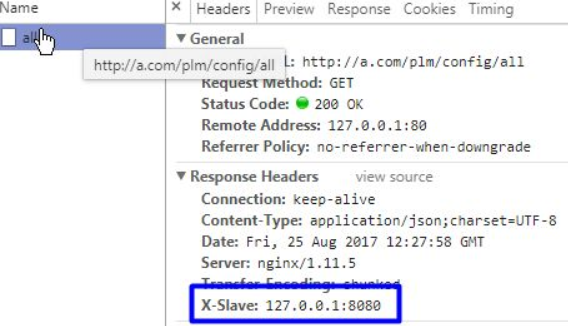
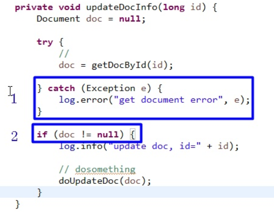

!> 编码规范


### 前言

- 总是在灾难发生后，才想起容灾的重要性；
- 总是在吃过亏后，才记得曾经有人提醒过。

​       对于我个人来说，编码还是一个相对轻松的活（我是负责公司it系统的，没有太多技术含量，数据量大，但并发量不大）。从工作到现在，我加班编码的时间还是比较少的，我到现在为止每天还会编码，很少因为编码工作加班。

​         大家写的东西都是一些crud的业务逻辑代码，为什么大家这么累，加班加点天天都是奋斗者？从项目观察中发现，大部分人的大部分时间都是在

 **定位问题 + 改代码**，真正开发的时间并不多。

- **定位问题：**包括开发转测试的时候发现问题和上线后发现问题
- **改代码：**的包括改bug和因为需求变动修改代码（后面专门开一贴说如何应对需求改动）

所以说，simple is not easy。很多人就是因为觉得简单，所以功能完成自己测试ok了就算了，没有思考有没有更加好的方式。归根到底是因为编码习惯太糟糕，写的代码太烂，导致无法定位频繁修改频繁出问题。

其实，**对于个人来说，技术很重要，但是对于工作来说，编码的习惯比技术更加主要**。工作中你面试的大部分技术都不需要用到的。工作中，因为你的编码习惯不好，写的代码质量差，代码冗余重复多，很多无关的代码和业务代码搅在一起，导致了你疲于奔命应付各种问题。

所以我们不管接手任何项目，第一步就是有代码框架，有项目组的开发规范，把代码量减下去。事实上证明，这一步之后，大家的代码量能下去最少1/3，后台的问题数下降比较明显，大家的加班会比之前少。

给大家一个直观的例子。下面是controller的一个删除数据的接口，我来之前大家写的这个样子的（其实一开始比这个还差很多），功能很简单，输入一个对象id执行删除返回是否删除成功。大家有没有觉得有什么问题？

```java
@PostMapping("/delete")
public Map<String, Object> delete(long id, String lang) {
  Map<String, Object> data = new HashMap<String, Object>();

  boolean result = false;
  try {
    // 语言（中英文提示不同）
    Locale local = "zh".equalsIgnoreCase(lang) ? Locale.CHINESE : Locale.ENGLISH;

    result = configService.delete(id, local);

    data.put("code", 0);

  } catch (CheckException e) {
    // 参数等校验出错，这类异常属于已知异常，不需要打印堆栈，返回码为-1
    data.put("code", -1);
    data.put("msg", e.getMessage());
  } catch (Exception e) {
    // 其他未知异常，需要打印堆栈分析用，返回码为99
    log.error(e);

    data.put("code", 99);
    data.put("msg", e.toString());
  }

  data.put("result", result);

  return data;
}
```

其实上面的代码也没有大问题。 但是用自己的代码框架，最后制定代码框架交付的代码如下（这是controller的部分）:

```java
@PostMapping("/delete")
public ResultBean<Boolean> delete(long id) {
  return new ResultBean<Boolean>(configService.delete(id));
}
```

所以说**技术无所谓高低，看你怎么用**。技术是重要，但编码习惯（或者说编码风格）更不能忽视！

### Java 编码规范

- [Twitter Java Style Guide(opens new window)](https://github.com/twitter/commons/blob/master/src/java/com/twitter/common/styleguide.md) 
- [Google Java Style Guide(opens new window)](http://google.github.io/styleguide/javaguide.html) 
- [阿里巴巴Java开发手册](https://github.com/alibaba/p3c) 


#### :one: Controller 规范

-  统一返回ResultBean对象


- 所有函数返回统一的ResultBean/PageResultBean格式
- ResultBean不允许往后传，往其他地方传之后，可读性立马下降，和传map，json好不了多少。
- Controller做参数格式的转换，不允许把json，map这类对象传到services去，也不允许services返回json、map。
- 参数不允许出现Request，Response 这些对象，和json/map一样，主要是可读性差的问题
- 日志在AOP里面会打印，而且我的建议是大部分日志在Services这层打印

#### :two:Aop定义ResultBean

我们需要在AOP里面统一处理异常，包装成相同的对象ResultBean给前台。

##### 2.1 ResultBean 定义

ResultBean定义带泛型，使用了**lombok**

```java
@Data
public class ResultBean<T> implements Serializable {

  private static final long serialVersionUID = 1L;

  public static final int NO_LOGIN = -1;

  public static final int SUCCESS = 0;

  public static final int FAIL = 1;

  public static final int NO_PERMISSION = 2;

  private String msg = "success";

  private int code = SUCCESS;

  private T data;

  public ResultBean() {
    super();
  }

  public ResultBean(T data) {
    super();
    this.data = data;
  }

  public ResultBean(Throwable e) {
    super();
    this.msg = e.toString();
    this.code = FAIL;
  }
}
```

##### 2.2 aop 实现监控

AOP代码，主要就是打印日志和捕获异常，**异常要区分已知异常和未知异常**，其中未知的异常是我们重点关注的，可以做一些邮件通知啥的，已知异常可以再细分一下，可以**不同的异常返回不同的返回码**：

```java
/**
 * 处理和包装异常
 */
public class ControllerAOP {
  private static final Logger logger = LoggerFactory.getLogger(ControllerAOP.class);

  public Object handlerControllerMethod(ProceedingJoinPoint pjp) {
    long startTime = System.currentTimeMillis();
    ResultBean<?> result;
    try {
      result = (ResultBean<?>) pjp.proceed();
      logger.info(pjp.getSignature() + "use time:" + (System.currentTimeMillis() - startTime));
    } catch (Throwable e) {
      result = handlerException(pjp, e);
    }
    return result;
  }
  
  /**
    * 封装异常信息，注意区分已知异常（自己抛出的）和未知异常
    */
  private ResultBean<?> handlerException(ProceedingJoinPoint pjp, Throwable e) {
    ResultBean<?> result = new ResultBean();
    // 已知异常
    if (e instanceof CheckException) {
      result.setMsg(e.getLocalizedMessage());
      result.setCode(ResultBean.FAIL);
    } else if (e instanceof UnloginException) {
      result.setMsg("Unlogin");
      result.setCode(ResultBean.NO_LOGIN);
    } else {
      logger.error(pjp.getSignature() + " error ", e);
      //TODO 未知的异常，应该格外注意，可以发送邮件通知等
      result.setMsg(e.toString());
      result.setCode(ResultBean.FAIL);
    }
    return result;
  }
}
```

对于未知异常，给相关责任人发送邮件通知，第一时间知道异常，实际工作中非常有意义。

> 为什么不用 ControllerAdvice + ExceptionHandler 来处理异常？

首先，这2这都是AOP，本质上没有啥区别。而最重要的是ExceptionHandler只能处理异常，而我们的AOP除了处理异常，还有一个很重要的作用是打印日志，统计每一个controller方法的耗时，这在实际工作中也非常重要和有用的特性！

#### :three:  日志打印

开发中日志这个问题，每个公司都强调，也制定了一大堆规范，但根据实际情况看，效果不是很明显，主要是这个东西不好测试和考核，没有日志功能一样跑啊。

但编程活久见，开发久了，总会遇到“这个问题生产环境上能重现，但是没有日志，业务很复杂，不知道哪一步出错了？” 这个时候，怎么办？ 还能怎么办，发个版本，就是把所有地方加上日志，没有任何新功能，然后在让用户重现一遍，拿下日志来看，哦，原来是这个问题。

有没有很熟悉的感觉？

还有一种情况，我们系统有3*5=15个节点，出了问题找日志真是痛苦，一个一个机器翻，N分钟后终于找到了，找到了后发现好多相似日志，一个一个排查；日志有了，发现逻辑很复杂，不知道走到那个分支，只能根据逻辑分析，半天过去了，终于找到了原因。。。一个问题定位就过去了2个小时，变更时间过去了一半。。。

##### 3.1 日志要求

所以我对日志的最少有以下2点要求：

1. 能找到那个机器
2. 能找到用户做了什么
3. 修改（包括新增）操作必须打印日志，大部分问题都是修改导致的。数据修改必须有据可查。
4. 条件分支必须打印条件值，重要参数必须打印，尤其是分支条件的参数，打印后就不用分析和猜测走那个分支了，很重要！
5. 数据量大的时候需要打印数据量
6. 前后打印日志和最后的数据量，主要用于分析性能，能从日志中知道查询了多少数据用了多久。

> 一般建议

- **不要依赖debug，多依赖日志** 

别人面对对象编程，你面对debug编程。有些人无论什么语言，最后都变成了面对debug编程。哈哈。这个习惯非常非常不好！debug会让你写代码的时候偷懒不打日志，而且很浪费时间。改掉这个恶习。

- **代码开发测试完成之后不要急着提交，先跑一遍看看日志是否看得懂** 

日志是给人看的，只要热爱编程的人才能成为合格程序员，不要匆匆忙忙写完功能测试ok就提交代码，日志也是功能的一部分。要有精益求精的工匠精神！

##### 3.2 Nginx 配置

**针对第一点**，我修改了一下nginx的配置文件，让返回头里面返回是那个机器处理的。

nginx的基本配置，大家查阅一下资料就知道。简单配置如下（生产环境比这个完善）

 

效果如图，返回了处理的节点：

 

##### 3.3 日志 MDC

第二点，要知道用户做了什么。用户信息是很重要的一个信息，能帮助海量日志里面能快速找到目标日志。一开始要求开发人员打印的时候带上用户，但是发现这个落地不容易，开发人员打印日志都经常忘记，更加不用说日志上加上用户信息，我也不可能天天看代码。所以找了一下log4j的配置，果然log4j有个叫MDC(Mapped Diagnostic Context)的类（技术上使用了ThreadLocal实现，重点技术）。具体使用方法请自行查询。具体使用如下：

> UserFilter 

filter中得到用户信息，并放入MDC，记住filter后要清理掉（因为tomcat线程池线程重用的原因）。

```java
/**
 * 用户信息相关的filter
 */
public class UserFilter implements Filter {

  @Override
  public void init(FilterConfig filterConfig) throws ServletException {

  }

  @Override
  public void doFilter(ServletRequest request, ServletResponse response,
      FilterChain chain) throws IOException, ServletException {

    // 得到用户个人相关的信息（登陆的用户，用户的语言）
    fillUserInfo((HttpServletRequest) request);

    try {
      chain.doFilter(request, response);
    } finally {
      // 由于tomcat线程重用，记得清空
      clearAllUserInfo();
    }
  }

  private void clearAllUserInfo() {
    UserUtil.clearAllUserInfo();
  }

  private void fillUserInfo(HttpServletRequest request) {
    // 用户信息
    String user = getUserFromSession(request);

    if (user != null) {
      UserUtil.setUser(user);
    }

    // 语言信息
    String locale = getLocaleFromCookies(request);

    // 放入到threadlocal，同一个线程任何地方都可以拿出来
    if (locale != null) {
      UserUtil.setLocale(locale);
    }
  }

  private String getLocaleFromCookies(HttpServletRequest request) {
    Cookie[] cookies = request.getCookies();

    if (cookies == null) {
      return null;
    }

    for (int i = 0; i < cookies.length; i++) {
      if (UserUtil.KEY_LANG.equals(cookies[i].getName())) {
        return cookies[i].getValue();
      }
    }

    return null;
  }

  private String getUserFromSession(HttpServletRequest request) {
    HttpSession session = request.getSession(false);

    if (session == null) {
      return null;
    }

    // 从session中获取用户信息放到工具类中
    return (String) session.getAttribute(UserUtil.KEY_USER);
  }

  @Override
  public void destroy() {
  }

}
```

> 用户信息放入MDC

```java
/**
 * 用户工具类
 */
public class UserUtil {

  private final static ThreadLocal<String> tlUser = new ThreadLocal<String>();

  private final static ThreadLocal<Locale> tlLocale = new ThreadLocal<Locale>() {
    protected Locale initialValue() {
      // 语言的默认值
      return Locale.CHINESE;
    };
  };

  public static final String KEY_LANG = "lang";

  public static final String KEY_USER = "user";

  public static void setUser(String userid) {
    tlUser.set(userid);

    // 把用户信息放到log4j
    MDC.put(KEY_USER, userid);
  }

  /**
   * 如果没有登录，返回null
   * 
   * @return
   */
  public static String getUserIfLogin() {
    return tlUser.get();
  }

  /**
   * 如果没有登录会抛出异常
   * 
   * @return
   */
  public static String getUser() {
    String user = tlUser.get();

    if (user == null) {
      throw new UnloginException();
    }

    return user;
  }

  public static void setLocale(String locale) {
    setLocale(new Locale(locale));
  }

  public static void setLocale(Locale locale) {
    tlLocale.set(locale);
  }

  public static Locale getLocale() {
    return tlLocale.get();
  }

  public static void clearAllUserInfo() {
    tlUser.remove();
    tlLocale.remove();

    MDC.remove(KEY_USER);
  }
}
```

> log4j 配置 

增加用户信息变量，%X{user} 

```xml
<!-- Appenders -->
<appender name="console" class="org.apache.log4j.ConsoleAppender">
  <param name="Target" value="System.out" />
  <layout class="org.apache.log4j.PatternLayout">
    <param name="ConversionPattern"
      value="[%t]%-d{MM-dd HH:mm:ss,SSS} %-5p:%X{user} - %c - %m%n" />
  </layout>
</appender>
```

#### :four: 异常处理

对于大型IT系统，最怕的事情第一是系统出现了异常我不知道，等问题闹大了用户投诉了才知道出问题了。第二就是出了问题之后无法找到出错原因。

> 案例场景

如果系统出异常了我不知道，等问题闹大了用户投诉了才知道。这个问题出现非常多，而且非常严重。我不知道其他公司有没有这种场景，对我们公司而言，经常会出现用户反馈、投诉过来说某个功能不可用，开发人员定位分析之后，才发现之前的某一步出错了。公司业务流程非常复杂，和周边系统一堆集成，一堆的后台队列任务，任何一部都可能出问题。

> 错误范例

大家觉得这段代码有没有问题？

 

在我看来，这段代码**很多时候**问题特别大！

- 丢掉了异常

异常就算打印了堆栈，也不会有人去看的！除非用户告诉你出问题了，你才会去找日志！所以，看着好像很严谨的代码，其实作用并不大。

- 空判断隐藏了错误

异常处理再加上框框2处的空判断，天衣无缝的避开了所有正确答案。本来需要更新文档，结果什么错误没有报，什么也没有做。你后台就算打了日志堆栈又怎么样？

所以，我对开发人员的要求就是，**绝大部分场景，不允许捕获异常，不要乱加空判断**。只有明显不需要关心的异常，如关闭资源的时候的io异常，可以捕获然后什么都不干，其他时候，不允许捕获异常，都抛出去，到controller处理。空判断大部分时候不需要，你如果写了空判断，你就必须测试为空和不为空二种场景，要么就不要写空判断。

**新手最容易犯的错误，到处捕获异常，到处加空判断，自以为写出了“健壮”的代码，实际上完全相反**。导致的问题，

1. 第一代码可读性很差，你如果工作了看到一半代码是try-catch和空判断你会同意我的观点的，
2. 第二更加重要的掩盖了很多错误，如上面图片的例子！日志是不会有人看的，我们的目的是尽早让错误抛出来，还有，你加了空判断，那你测试过为空的场景吗？

web请求上的异常，不允许开发人员捕获，直接抛到前台，会有controller处理！见之前的Controller规范

所以上面的代码，我来写的话是这样的，清晰明了。

- 异常不要继承Exception，而是继承RuntimeException，否则到时候从头改到尾就为了加个异常声明你就觉得很无聊。

##### 4.1 异常处理要求

- 异常继承RuntimeException
- 不允许开发人员捕获异常，最好统一处理
- 少加空判断，加了空判断就要测试为空的场景！

#### :five: 参数校验和国际化

参数校验和国际化，**这些代码没有什么技术含量，却大量充斥在业务代码上**，很可能业务代码只有几行，参数校验代码却有十几行，非常影响代码阅读，所以很有必要把这块的代码量减下去。

##### 5.1 案例分析

> 代码修改前

- service代码

```java
/**
 * ！！！错误示范
 * 
 * 出现和业务无关的参数local
 */
public boolean delete(long id, Locale locale) {
  // 参数校验
  if (id <= 0L) {
    if (locale.equals(Locale.CHINESE)) {
      throw new CheckException("非法的ID：" + id);
    } else {
      throw new CheckException("Illegal ID:" + id);
    }
  }

  boolean result = dao.delete(id);

  // 修改操作需要打印操作结果
  logger.info("delete config success, id:" + id + ", result:" + result);

  return dao.delete(id);
}
```

> 修改后

```java
public boolean delete(long id) {
  // 参数校验
  check(id > 0L, "id.error", id);

  boolean result = dao.delete(id);

  // 修改操作需要打印操作结果
  logger.info("delete config success, id: {}, result: {}", id, result);

  return result;
}
```

##### 5.2 校验工具类CheckUtil

这里需要调用用户工具类得到用户的语言。还有就是提示信息里面，需要支持传入变量。

```java
package plm.common.utils;

import org.springframework.context.MessageSource;

import plm.common.exceptions.CheckException;

public class CheckUtil {
  private static MessageSource resources;

  public static void setResources(MessageSource resources) {
    CheckUtil.resources = resources;
  }

  public static void check(boolean condition, String msgKey, Object... args) {
    if (!condition) {
      fail(msgKey, args);
    }
  }

  public static void notEmpty(String str, String msgKey, Object... args) {
    if (str == null || str.isEmpty()) {
      fail(msgKey, args);
    }
  }

  public static void notNull(Object obj, String msgKey, Object... args) {
    if (obj == null) {
      fail(msgKey, args);
    }
  }

  private static void fail(String msgKey, Object... args) {
    throw new CheckException(resources.getMessage(msgKey, args, UserUtil.getLocale()));
  }
}
```

记住，代码最主要的不是性能，而是可读性，有了可读性才有才维护性。而去掉无关的代码后的代码，和之前的代码对比一下，自己看吧。

#### :six: 工具类编写

一个项目不可能没有工具类，工具类的初衷是良好的，代码重用，但到了后面工具类越来越乱，有些项目工具类有几十个，看的眼花缭乱，还有不少重复。如何编写出好的工具类，我有几点建议：

##### 6.1 隐藏实现

就是要**定义自己的工具类，尽量不要在业务代码里面直接调用第三方的工具类**。这也是**解耦**的一种体现。

如果我们不定义自己的工具类而是直接使用第三方的工具类有2个不好的地方：

- 不同的人会使用不同的第三方工具库，会比较乱。
- 将来万一要修改工具类的实现逻辑会很痛苦。

> 以最简单的字符串判空为例

很多工具库都有 `StringUtils`工具类，如果我们使用 `commons` 的工具类，一开始我们直接使用 `StringUtils.isEmpty` ，字符串为空或者空串的时候会返回为true，后面业务改动，需要改成如果全部是空格的时候也会返回true，怎么办？

我们可以改成使用 `StringUtils.isBlank` 。看上去很简单，对吧？ 如果你有几十个文件都调用了，那我们要改几十个文件，是不是有点恶心？

再后面发现，不只是英文空格，如果是全角的空格，也要返回为true，怎么办？StringUtils上的方法已经不能满足我们的需求了，真不好改了。。。

所以我的建议是，一开始就自己定义一个自己项目的 `StringUtil`，里面如果不想自己写实现，可以直接调用 `commons` 的方法，如下：

```java
public static boolean isEmpty(String str) {
  return org.apache.commons.lang3.StringUtils.isEmpty(str);
}
```

后面全部空格也返回true的时候，我们只需要把isEmpty改成isBlank；再后面全部全角空格的时候也返回true的话，我们增加自己的逻辑即可。我们只需要改动和测试一个地方。

> 复制对象的属性方法

一开始，如果我们自己不定义工具类方法，那么我们可以使用 `org.springframework.beans.BeanUtils.copyProperties(source, dest)` 这个工具类来实现，就一行代码，和调用自己的工具类没有什么区别。看上去很OK，对吧？

随着业务发展，我们发现这个方式的性能或者某些特性不符合我们要求，我们需要修改改成 `commons-beanutils`包里面的方法，`org.apache.commons.beanutils.BeanUtils.copyProperties(dest,source)`，这个时候问题来了，**第一个问题**，它的方法的参数顺序和之前spring的工具类是相反的，改起来非常容易出错！**第二个问题**，这个方法有异常抛出，必须声明，这个改起来可要命了！结果你发现，一个看上去很小的改动，改了几十个文件，每个改动还得测试一次，风险不是那么得小。有一点小崩溃了，是不是？

等你改完之后测试完了，突然有一天需要改成，复制参数的时候，有些特殊字段需要保留（如对象id）或者需要过滤掉（如密码）不复制，怎么办？这个时候我估计你要崩溃了吧？不要觉得我是凭空想象，编程活久见，你总会遇到的一天！

所以，我们需要定义自己的工具类函数，一开始我定义成这样子。

```java
public static void copyAttribute(Object source, Object dest) {
  org.springframework.beans.BeanUtils.copyProperties(source, dest);
}
```

后面需要修改为 `commons-beanutis` 的时候，我们改成这样即可，把参数顺序掉过来，然后处理了一下异常，我使用的是 `Lombok` 的 `@SneakyThrows` 来保证异常，你也可以捕获掉抛出运行时异常，个人喜好。

```java
@SneakyThrows
public static void copyAttribute(Object source, Object dest) {
  org.apache.commons.beanutils.BeanUtils.copyProperties(dest, source);
}
```

再后面，复制属性的时候需要保留某些字段或者过滤掉某些字段，我们自己参考其他库实现一次即可，**只改动和测试一个文件一个方法，风险非常可控**。

##### 6.2 使用父类/ 接口

上面那点隐藏实现，说到底是封装/解耦的思想，而现在说的这点是**抽象**的思想，做好了这点，我们就能编写出看上去很专业的工具类。这点很好理解也很容易做到，但是我们容易忽略。

举例，假设我们写了一个判断arraylist是否为空的函数，一开始是这样的。

```java
public static boolean isEmpty(ArrayList<?> list) {
  return list == null || list.size() == 0;
}
```

这个时候，我们需要思考一下参数的类型能不能使用父类。我们看到我们只用了size方法，我们可以知道size方法再list接口上有，于是我们修改成这样。

```java
public static boolean isEmpty(List<?> list) {
  return list == null || list.size() == 0;
}
```

后面发现，size方法再list的父类/接口Collection上也有，那么我们可以修改为最终这样。

```java
public static boolean isEmpty(Collection<?> list) {
  return list == null || list.size() == 0;
}
```

到了这部，Collection没有父类/接口有size方法了，修改就结束了。最后我们需要把参数名字改一下，不要再使用list。改完后，所有实现了Collection都对象都可以用，最终版本如下：

```java
public static boolean isEmpty(Collection<?> collection) {
  return collection == null || collection.size() == 0;
}
```

是不是看上去通用多了 ，看上去也专业多了？上面的string相关的工具类方法，使用相同的思路，我们最终修改一下，把参数类类型由String修改为CharSequence，参数名str修改为cs。如下：

```java
public static boolean isEmpty(CharSequence cs) {
  return org.apache.commons.lang3.StringUtils.isEmpty(cs);
}
```

思路和方法很简单，但效果很好，写出来的工具类也显得很专业！总结一下，思路是**抽象**的思想，主要是**修改参数类型**，方法就是往上找父类/接口，一直找到顶为止，记得修改参数名。

##### 6.2 使用重载编写衍生函数数组

开发过的兄弟都知道，有一些工具库，有一堆的重载函数，调用起来非常方便，经常能直接调用，不需要做参数转换。这些是怎么样编写出来的呢？我们举例说明。

现在需要编写一个方法，输入是一个utf-8格式的文件的文件名，把里面内容输出到一个list< String>。我们刚刚开始编写的时候，是这个样子的

```java
public static List<String> readFile2List(String filename) throws IOException {
  List<String> list = new ArrayList<String>();

  File file = new File(filename);

  FileInputStream fileInputStream = new FileInputStream(file);

  BufferedReader br = new BufferedReader(new InputStreamReader(fileInputStream, 
     "UTF-8"));

  // XXX操作

  return list;
}
```

我们先实现，实现完之后我们做第一个修改，很明显，utf-8格式是很可能要改的，所以我们先把它做为参数提取出去，方法一拆为二，就变成这样。

```java
public static List<String> readFile2List(String filename) throws IOException {
  return readFile2List(filename, "UTF-8");
}

public static List<String> readFile2List(String filename, String charset) 
  throws IOException {
  List<String> list = new ArrayList<String>();

  File file = new File(filename);
  FileInputStream fileInputStream = new FileInputStream(file);

  BufferedReader br = new BufferedReader(new InputStreamReader(fileInputStream,
    charset));

  // XXX操作

  return list;
}
```

多了一个方法，直接调用之前的方法主体，主要的代码还是只有一份，之前的调用地方不需要做任何修改！可以放心修改。

然后我们在看里面的实现，下面这2行代码里面，String类型的filename会变化为File类型，然后在变化为FileInputStream 类型之后才使用。

```java
File file = new File(filename);
FileInputStream fileInputStream = new FileInputStream(file);
```

这里我们就应该想到，用户可能直接传如File类型，也可能直接传入FileInputStream类型，我们应该都需要支持，而不需要用户自己做类型的处理！在结合上一点的使用父类，把FileInputStream改成父类InputStream，我们最终的方法组如下：

```java
/**
 * 工具类编写范例，使用重载编写不同参数类型的函数组
 */
public class FileUtil {

  private static final String DEFAULT_CHARSET = "UTF-8";

  public static List<String> readFile2List(String filename) throws IOException {
    return readFile2List(filename, DEFAULT_CHARSET);
  }

  public static List<String> readFile2List(String filename, String charset)
    throws IOException {
    FileInputStream fileInputStream = new FileInputStream(filename);
    return readFile2List(fileInputStream, charset);
  }

  public static List<String> readFile2List(File file) throws IOException {
    return readFile2List(file, DEFAULT_CHARSET);
  }

  public static List<String> readFile2List(File file, String charset)
    throws IOException {
    FileInputStream fileInputStream = new FileInputStream(file);
    return readFile2List(fileInputStream, charset);
  }

  public static List<String> readFile2List(InputStream fileInputStream)
    throws IOException {
    return readFile2List(fileInputStream, DEFAULT_CHARSET);
  }

  public static List<String> readFile2List(InputStream inputStream, String charset)
    throws IOException {
    List<String> list = new ArrayList<String>();

    BufferedReader br = null;
    try {
      br = new BufferedReader(new InputStreamReader(inputStream, charset));

      String s = null;
      while ((s = br.readLine()) != null) {
        list.add(s);
      }
    } finally {
      IOUtils.closeQuietly(br);
    }

    return list;
  }
}
```

怎么样？6个方法，实际上代码主体只有一份，但提供各种类型的入参，调用起来很方便。开发组长编写的时候，多费一点点时间，就能写来看上去很专业调用起来很方便的代码。如果开发组长不写好，开发人员发现现有的方法只能传String，她要传的是InputStream，她又不敢改原来的代码，就会copy一份然后修改一下，就多了一份重复代码。代码就是这样烂下去了。。。

**多想一步，根据参数变化编写各种类型的入参函数，需要保证函数主要代码只有一份。**

#### :seven: 配置规范

工作中少不了要制定各种各样的配置文件，这里和大家分享一下工作中我是如何制定配置文件的，这是个人习惯，结合强大的spring，效果很不错。

#### :eight: 如何应对需求变更

我个人观点是加班原因是编码质量占了大部分因素，但是不少同学都不认为是代码质量导致的加班，都认为是不断的需求改动导致的加班。这位同学，说的好像别人的需求就不会变动似的！谁的需求不改动啊？不改动的能叫需求吗？哈哈。

先看个程序员的段子娱乐一下

```java
客户被绑，蒙眼，惊问：“想干什么?”
对方不语，鞭笞之，客户求饶：“别打，要钱?”
又一鞭，“十万够不?”
又一鞭，“一百万?”
又一鞭。客户崩溃：“你们TMD到底要啥?”
“要什么?我帮你做项目，写代码的时候也很想知道你TMD到底想要啥!”
```

有没有可能存在明确的、不再改动的需求呢？其实很难的。以前我们公司是瀑布开发模式，需求阶段时间较长，需要输出完整的需求规范，还要评审几次然后才进入开发，这个时候，需求变更就比较少，但还是有；后来公司赶时髦改成了敏捷开发模式，文档大量简化，于是需求没有考虑清楚就开始开发，需求是边开发边变动。**敏捷开发模式间接变成了加班开发模式**。

关于需求变动，**不同的角色定义很不一样**。BA觉得这个改动很正常，开发人员觉得就是个需求变更，两边各执一词，这种矛盾长期存在。

我列举几种场景，大家觉得算不算需求变更？

1. 删除对象功能

一开始只能创建者删除，后面变更为管理员也可以删除，再后面变更了某个角色也可以删除。

1. 配置功能

一开始使用xml配置，后面修改为json格式，又或者修改为使用数据库配置。

1. 导出功能

一开始导出为excel格式，后面变更为导出json格式或者pdf格式。或者一开始导出20个字段，后面变更为导出30个字段。

这些当然都是变更了，但这些真的就是我们加班加点的原因吗？！我们就没有办法只能任人宰割吗？！而我的观点刚好是，**正是因为需求变更不可避免，所以我们才更应该把代码写简单，以对付各种各样的需求变化**。有以下几点心得建议：

- 把代码写到最简单
- 把可能变化的部分封装成函数
- 先做确定的需求
- 解耦

就是要**主动思考，多走一步，不要被动接受看到的需求，要对需求的将来变化做好心中有数**。

### Redis 21军规

`Redis`作为高性能的内存数据库，在大数据量的情况下也会遇到性能瓶颈，日常开发中只有时刻谨记优化铁则，才能使得Redis性能发挥到极致。

本文将会介绍十三条性能优化军规，开发过程中只要按照执行，性能必能质的飞跃。

#### :one: 基础规范

##### 2.1 **必须配置访问密码** 

裸奔的Redis除了方便**被外部盗取数据外**，内部管理上也极易出现误操作风险，如误操作造成其它环境数据被覆盖、丢失！

##### 2.2 **必须以非root用户启动** 

Redis的设计过于灵活，这直接让攻击者可以远程通过root运行的redis服务获取到操作系统root权限！

##### 2.3 **禁止将Redis当做持久化存储使用**

Redis虽然支持AOF、RDB持久化模式，但是 并不会记录每条操作的详细时间戳（对比MySQL的binlog会详细记录执行时间），出现误操作时无法进行精确回滚！

#####  2.4 禁止不同业务混合部署使用同一套Redis

1. Redis为单线程模型，不同业务的数据存储在一起，除了管理上混乱， 单线程模型下只要有一个请求命令变慢，就会影响所有存储在同Redis中的所有请求！
2. 虽然redis支持多个db，但是请求并不会被隔离，比如请求0号库的一个慢操作，也一样样会阻塞其它1、2、3、4库的连接和请求！

#####  2.5 选择相对较新的版本，强烈建议5.0以上版本

除了5.0版本引入了更多新特性及bug修复外， 5.0对Redis的内存碎片管理效率带来了极大的提升，而碎片绝对是Redis的一大性能杀手，但早期的2.x、3.x、4.x版本都没有很好的解决这一问题！

#### :two: 键值设计 

##### 2.6 建议以业务名为前缀，以冒号分割来构造一定规则的key名称

 好的Key名称可以提高可读性和可管理性，比如：userid:pageview 表示某个用户页面访问次数

##### 2.7 Key名称禁止包含特殊字符，比如空格、换行、单双引号及其他转义字符等

带有特殊符号的Key，在读取或管理时会带来想不到的各种异常和不便

##### 2.8 控制key名称长度，建议64字符以内，避免Key过多带来较大的内存开销

解读： 内存是昂贵的，几千万或者上亿个的Key时，额外的内存开销不容忽视

#####  2.9 控制Value大小，如果超过512字节必须进行压缩存储，最大不能超过1K

1.  **Redis的所有数据都存储在内存中！内存中！内存中！！**【不管Redis开不开启持久化，所有数据都是存储在内存中】，而内存的成本是非常高的。
2. 除了成本外，这种大容量的数据存储在Redis中，在访问的QPS稍微高一些时，网卡的压力会非常大，大概率会发生网卡流量打满情况【瞬时吞吐量=QPS*单个请求对象大小】。这种情况建议走独立的图片存储服务、应用程序缓存或CDN等方式，对于过长的字符串【512个字节以上】建议进行序列化或压缩后再存储！
3. 较大的Value，写入速度也会受影响，整体影响写入的吞吐量

#### :three:操作命令

##### 2.10 **禁止使用keys命令进行正则匹配** 

Keys的正则匹配是阻塞式、全量扫描过滤的，对于单线程服务的Redis来说是致命的，几十万个Key的匹配查询在高并发访问下就有可能将Redis打崩溃！建议使用scan代替keys！

**（1）keys 查找所有符合给定模式( pattern)的 key ,但是，缺点就是阻塞式，不利于在生产环境使用**  

命令格式：` keys [pattern]` 

```bash
keys str*
keys *
keys *str 
```

（2）Redis Scan 命令用于迭代数据库中的数据库键

- [SSCAN](https://www.runoob.com/redis/sets-sscan.html) 命令用于迭代集合键中的元素。
- [HSCAN](https://www.runoob.com/redis/hashes-hscan.html) 命令用于迭代哈希键中的键值对。
- [ZSCAN](https://www.runoob.com/redis/sorted-sets-zscan.html) 命令用于迭代有序集合中的元素（包括元素成员和元素分值）。 

**语法：** ` SCAN cursor [MATCH pattern] [COUNT count]`  返回数组列表

- cursor - 游标。
- pattern - 匹配的模式。
- count - 指定从数据集里返回多少元素，默认值为 10 。

```bash
redis 127.0.0.1:6379> scan 0   # 使用 0 作为游标，开始新的迭代
1) "17"                        # 第一次迭代时返回的游标
.....
.....
redis 127.0.0.1:6379> scan 17  # 使用的是第一次迭代时返回的游标 17 开始新的迭代
1) "0"
```

##### 2.11 **慎用复杂度O(N)的命令** 

例如hgetall、smembers、lrange、zrange等并非不能使用，但是需要明确N的值。项目刚上线之初hash、set或者list存储的成员个数较少，但是随着业务发展成员数量极有可能会膨胀的非常大，如果仍然采用上述命令不加控制，会极大拖累整个Redis服务的响应时间.

**建议**有遍历的需求可以使用hscan、sscan、zscan代替

##### 2.12 **合理使用批处理命令提高效率** 

1. 原生命令如mget、mset，非原生命令如pipeline，但要注意控制一次批量操作的元素个数(例如500以内，具体和元素大小有关)。
2. Redis由于处理效率非常高效，基本上都是微秒级别，超过1毫秒就应该算是慢操作，使用批量处理命令核心优化点就是减少网络IO开销，特别是对于一些php短连接效果尤其明显。但是注意每次操作不易过多，否则会阻塞其它请求命令！

##### 2.13 **避免大批量Key集中过期** 

集中大批量Key过期会短时间抢占大量的CPU资源，并有可能阻塞主线程响应。Key集中过期常见在大数据计算结果使用了同样的过期命令，建议分批写入设置不同的过期时间！

#### :four:内存优化

##### 2.14 **Redis节点内存上限不能超过20G** 

1. 4.0版本之前的Redis主从架构下master主节点发生故障，切换到新主节点后，其它从节点挂载到新主需要进行一次全量数据重传，
   如果Slave节点提供只读服务，则构建完成前会一直处于阻塞状态，而过大的内存数据会极大延长新集群的构建时长。大容量内存使用建议使用RedisCluster，通过多分片来降低单节点的内存使用量。
2. Redis新版本通过记录同步点位一定程度上缓解了新主切换时的全量复制重传问题，
   但实际也要依赖业务写入情况和主从复制预留buffer大小，按照经验高吞吐情况下大概率仍会发生全量复制重传情况，所以强烈建议单节点尽量控制内存使用上限在20G以内。

##### 2.15 **合理设计Key过期时间，满足业务情况下越小越好** 

内存是昂贵的！根据业务合理设置Key的过期时间，满足业务需求就好，严禁不设置或者设置过久的过期时间策略！注意expire和expireat（Unix时间戳）使用区别！

##### 2.16 **不要将所有数据全部都放到Redis中** 

内存是昂贵的！只存储高频访问的数据，严禁将流水日志等只访问一次的数据存入Redis中！

##### 2.17 **必须设置内存最大值，且必须可用内存不小于10%** 

1. 服务器内存是有限的，不设限的内存使用会造成服务器内存失控。
2. 保持Redis服务有充足的可用内存 

**虽然数据使用内存达到最大上限后会触发自动清理，但是这种清理有严重的滞后性，在高频写入时已经严重影响新的请求写入了！** 

#### :five:集群架构

##### 2.18 **禁止私自将线下节点挂载到线上集群** 

redis的权限管理较弱，仅仅通过地址和密码即可连接到线上集群，但这种操作会对线上服务的稳定性带来极大隐患，比如高可用的选主切换，给运维人员带来极大的干扰！

##### 2.19 **禁止线上业务使用级联复制架构** 

级联复制架构在网络不稳定的环境下，如果上游复制节点出现问题，会造成下游Slave节点的数据全量复制重传，对下游的服务请求带来很大的安全隐患 

##### 2.20 **读写分离集群架构，Redis版本必须在3.2以上** 

由于Redis过期Key的清理采用惰性删除策略，即主节点的Key过期后不是立马被清理，而是逐批扫描清理或者被访问时主动清理，且从节点Key的清理只能依赖主节点的同步删除，Slave自己是不能主动发起清理的。这种模式下如果Slave提供读请求，在清理不及时时就可能读到脏数据。3.2之后的版本解决了这种问题，不再给请求返回数据。

##### 2.21 **主从集群架构下，如果需要持久化下建议主库关闭从库开启** 

1. 之前有人认为Redis的持久化都是追加写，SAS的磁盘就可以。但是实际上在Redis高并发写入情况下，SAS盘的吞吐是远远跟不上的，特别在单机部署多套Redis服务的情况下，强烈建议使用SSD，磁盘的刷新如果过慢，会直接阻塞Redis主线程写入。
2. 在主从集群模式下，建议主节点关闭持久化，从节点开启，当然如果数据只是用作临时缓存也可以都关闭持久化，具体取决于你的业务场景对缓存的依赖程度。

**相关文章**

1. [Redis 性能优化13种手段](https://xcbeyond.blog.csdn.net/article/details/105085608) 
2. [Redis 21 条军规](http://blog.itpub.net/13361035/viewspace-2692714/) 