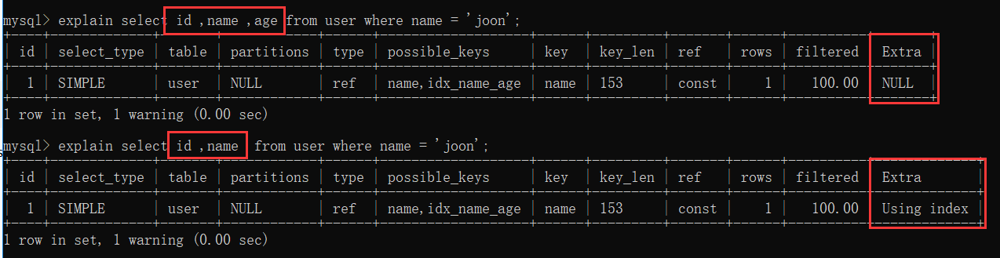
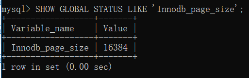

## MySQL 数据库


### 基础知识

#### 1. union 和 union all 的区别

- union all：对两个结果集直接进行并集操作，记录可能有重复，不会进行排序。

- union：对两个结果集进行并集操作，会进行去重，记录不会重复，按字段的默认规则排序。

因此，从效率上说，UNION ALL 要比 UNION 更快。


### 锁

#### 1.  说说共享锁和排他锁？

**共享锁**又称为读锁，简称S锁，顾名思义，共享锁就是多个事务对于同一数据可以共享一把锁，都能访问到数据，但是只能读不能修改。

**排他锁**又称为写锁，简称X锁，顾名思义，排他锁就是不能与其他锁并存，如一个事务获取了一个数据行的排他锁，其他事务就不能再获取该行的其他锁，包括共享锁和排他锁，但是获取排他锁的事务可以对数据就行读取和修改。

常见的几种 SQL 语句的加锁情况如下：

```mysql
select * from table：不加锁
update/insert/delete：排他锁

select * from table where id = 1 for update：id为索引，加排他锁
select * from table where id = 1 lock in share mode：id为索引，加共享锁
```

#### 2. 说说数据库的行锁和表锁？

**行锁**：操作时只锁某一（些）行，不对其它行有影响。开销大，加锁慢；会出现死锁；锁定粒度小，发生锁冲突的概率低，并发度高。

**表锁**：即使操作一条记录也会锁住整个表。开销小，加锁快；不会出现死锁；锁定粒度大，发生锁冲突概率高，并发度最低。

**页锁**：操作时锁住一页数据（16kb）。开销和加锁速度介于表锁和行锁之间；会出现死锁；锁定粒度介于表锁和行锁之间，并发度一般。

InnoDB 有行锁和表锁，MyIsam 只有表锁。

#### 3. InnoDB 的行锁是怎么实现的？

**InnoDB 行锁** 是通过索引上的索引项来实现的。意味者：只有通过索引条件检索数据，InnoDB 才会使用行级锁，否则，InnoDB将使用表锁！

- 对于主键索引：直接 锁住 主键索引即可。

- 对于普通索引：先锁住普通索引，接着锁住主键索引，这是因为一张表的索引可能存在多个，通过主键索引才能确保锁是唯一的，不然如果同时有2个事务对同1条数据的不同索引分别加锁，那就可能存在2个事务同时操作一条数据了。

#### 4. InnoDB 锁的算法有哪几种？

- Record lock：记录锁，单条索引记录上加锁，锁住的永远是索引，而非记录本身。

- Gap lock：间隙锁，在索引记录之间的间隙中加锁，或者是在某一条索引记录之前或者之后加锁，并不包括该索引记录本身。

- Next-key lock：Record lock 和 Gap lock 的结合，即除了锁住记录本身，也锁住索引之间的间隙。\

#### 5. MySQL 如何实现悲观锁和乐观锁？

乐观锁：更新时带上版本号（cas更新）

悲观锁：使用共享锁和排它锁，select...lock in share mode，select…for update。

#### 6. InnoDB 和 MyISAM 的区别？

| 对比项                     | InnoDB                   | MyIsam                                             |
| -------------------------- | ------------------------ | -------------------------------------------------- |
| 事务                       | 支持                     | 不支持                                             |
| 锁类型                     | 行锁、表锁               | 表锁                                               |
| 缓存                       | 缓存索引和数据           | 只缓存索引                                         |
| 主键                       | 必须有，用于实现聚簇索引 | 可以没有                                           |
| 索引                       | B+树，主键是聚簇索引     | B+树，非聚簇索引                                   |
| select count(*) from table | 较慢，扫描全表           | 贼快，用一个变量保存了表的行数，只需读出该变量即可 |
| hash索引                   | 支持                     | 不支持                                             |
| 记录存储顺序               | 按主键大小有序插入       | 按记录插入顺序保存                                 |
| 外键                       | 支持                     | 不支持                                             |
| 全文索引                   | 5.7 支持                 | 支持                                               |
| 关注点                     | 事务                     | 性能                                               |

#### 7. 存储引擎的选择？

没有特殊情况，使用 InnoDB 即可。如果表中绝大多数都只是读查询，可以考虑 MyISAM。

### 索引

#### 1. 什么是索引？

索引（Index）是帮助 MySQL 高效获取数据的排好序的数据结构

#### 2. 索引类型有哪些？

常见的索引类型有：hash、b树、b+树。

- hash：底层就是 hash 表。进行查找时，根据 key 调用hash 函数获得对应的 hashcode，根据 hashcode 找到对应的数据行地址，根据地址拿到对应的数据。
- B树：B树是一种多路搜索树，n 路搜索树代表每个节点最多有 n 个子节点。每个节点存储 key + 指向下一层节点的指针+ 指向 key 数据记录的地址。查找时，从根结点向下进行查找，直到找到对应的key。
- B+树：B+树是b树的变种，主要区别在于：B+树的非叶子节点只存储 key + 指向下一层节点的指针。另外，B+树的叶子节点之间通过指针来连接，构成一个有序链表，因此对整棵树的遍历只需要一次线性遍历叶子结点即可。

#### 3. 为什么MySQL用B+树索引？而不用红黑树、Hash、B树？

**红黑树**：如果在内存中，红黑树的查找效率比B树更高，但是涉及到磁盘操作，B树就更优了。因为红黑树是二叉树，数据量大时树的层数很高，从树的根结点向下寻找的过程，每读1个节点，都相当于一次IO操作，因此红黑树的I/O操作会比B树多的多。

**hash 索引**：如果只查询单个值的话，hash 索引的效率非常高。但是 hash 索引有几个问题：

- 不支持范围查询；
- 不支持索引值的排序操作；
- 不支持联合索引的最左匹配规则。

**B树索引**：B树索相比于B+树，在进行范围查询时，需要做局部的中序遍历，可能要跨层访问，跨层访问代表着要进行额外的磁盘I/O操作；另外，B树的非叶子节点存放了数据记录的地址，会导致存放的节点更少，树的层数变高。

#### 4. MySQL 中索引叶子节点存放的是什么？

MyISAM和InnoDB都是采用的B+树作为索引结构，但是叶子节点的存储上有些不同。

**MyISAM**：主键索引和辅助索引（普通索引）的叶子节点都是存放 key 和 key 对应数据行的地址。在MyISAM 中，主键索引和辅助索引没有任何区别。

**InnoDB**：

- **主键索引**：存放的是 key 和 key 对应的数据行。
- **辅助索引**：存放的是 key 和 key 对应的主键值。

因此在使用辅助索引时，通常需要检索两次索引，首先检索辅助索引获得主键值，然后用主键值到主键索引中检索获得记录。

#### 5. 什么是聚簇索引（聚集索引）？

**聚簇索引**：并不是一种单独的索引类型，而是一种数据存储方式。聚簇索引将索引和数据行放到了一块，找到索引也就找到了数据。因为无需进行回表操作，所以效率很高。

InnoDB 中必然会有，且只会有一个聚簇索引。通常是主键，如果没有主键，则优先选择非空的唯一索引，如果唯一索引也没有，则会创建一个隐藏的row_id 作为聚簇索引。至于为啥会只有一个聚簇索引，其实很简单，因为我们的数据只会存储一份。

**非聚簇索引**：则将数据存储和索引分开，找到索引后，需要通过对应的地址找到对应的数据行。MyISAM 的索引方式就是非聚簇索引。

#### 6. 什么是回表查询？

InnoDB 中，对于主键索引，只需要走一遍主键索引的查询就能在叶子节点拿到数据。

而对于普通索引，叶子节点存储的是 key + 主键值，因此需要再走一次主键索引，通过主键索引找到行记录，这就是所谓的回表查询，先定位主键值，再定位行记录。

#### 7. 走普通索引，一定会出现回表查询吗？

不一定，如果查询语句所要求的字段全部命中了索引，那么就不必再进行回表查询。

很容易理解，有一个 user 表，主键为 id，name 为普通索引，则再执行：select id, name from user where name = 'joonwhee' 时，通过name 的索引就能拿到 id 和 name了，因此无需再回表去查数据行了。

#### 8. 什么是覆盖索引（索引覆盖）吗？

覆盖索引是 SQL-Server 中的一种说法，上面讲的例子其实就实现了覆盖索引。具体的：当索引上包含了查询语句中的所有列时，我们无需进行回表查询就能拿到所有的请求数据，因此速度会很快。

当explain的输出结果Extra字段为Using index时，则代表触发覆盖索引。以上面的例子为例：

 

#### 9. 联合索引（复合索引）的底层实现？最佳左前缀原则？

联合索引底层还是使用B+树索引，并且还是只有一棵树，只是此时的排序会：首先按照第一个索引排序，在第一个索引相同的情况下，再按第二个索引排序，依次类推。

这也是为什么有“最佳左前缀原则”的原因，因为（在叶子节点上）右边（后面）的索引都是在左边（前面）的索引排序的基础上进行排序的，如果没有左边的索引，单独看右边的索引，其实是无序的。

#### 10. B+树中一个节点到底多大合适？

1页或页的倍数最为合适。因为如果一个节点的大小小于1页，那么读取这个节点的时候其实也会读出1页，造成资源的浪费。所以为了不造成浪费，所以最后把一个节点的大小控制在1页、2页、3页等倍数页大小最为合适。

这里说的“页”是 MySQL 自定义的单位（和操作系统类似），MySQL 的 Innodb 引擎中1页的默认大小是16k，可以使用命令 查看。

```mysql
SHOW GLOBAL STATUS LIKE 'Innodb_page_size'
```

 

#### 11. MySQL 中B+树的一个节点大小为多大呢？

在 MySQL 中 B+ 树的一个节点大小为“1页”，也就是16k。

#### 12. 为什么MySQL一个节点为1页就够了？

Innodb中，B+树中的一个节点存储的内容是：

- 非叶子节点：key + 指针（指向子节点）
- 叶子节点：数据行（key 通常是数据的主键）

**对于叶子节点**：我们假设1行数据大小为1k（对于普通业务绝对够了），那么1页能存16条数据。

**对于非叶子节点**：key 使用 bigint 则为8字节，指针在 MySQL 中为6字节，一共是14字节，则16k能存放 16 * 1024 / 14 = 1170个指针。那么一颗高度为3的B+树能存储的数据为：1170 * 1170 * 16 = 21902400（千万级）。

所以在 InnoDB 中B+树高度一般为3层时，就能满足千万级的数据存储。在查找数据时一次页的查找代表一次IO，所以通过主键索引查询通常只需要1-3次 IO 操作即可查找到数据。千万级别对于一般的业务来说已经足够了，所以一个节点为1页，也就是16k是比较合理的。

### 事务

#### 1. MySQL 的事务隔离级别有哪些？分别用于解决什么问题？

 主要用于解决脏读、不可重复读、幻读。

- 脏读：一个事务读取到另一个事务还未提交的数据。
- 不可重复读：在一个事务中多次读取同一个数据时，结果出现不一致。
- 幻读：在一个事务中使用相同的 SQL 两次读取，第二次读取到了其他事务新插入的行。

不可重复读注重于数据的修改，而幻读注重于数据的插入

#### 2. MySQL 的可重复读怎么实现的？

使用 MVCC 实现的，即 Mutil-Version Concurrency Control，多版本并发控制。关于 MVCC，比较常见的说法如下，包括《高性能 MySQL》也是这么介绍的。

InnoDB 会在每行记录后面增加三个隐藏字段：

- DB_ROW_ID：行ID，随着插入新行而单调递增，如果有主键，则不会包含该列。

- DB_TRX_ID：记录插入或更新该行的事务的事务ID。

- DB_ROLL_PTR：回滚指针，指向 undo log 记录。每次对某条记录进行改动时，该列会存一个指针，可以通过这个指针找到该记录修改前的信息,当某条记录被多次修改时，该行记录会存在多个版本，通过DB_ROLL_PTR 链接形成一个类似版本链的概念。

 

接下来进入正题，以 RR 级别为例：每开启一个事务时，系统会给该事务会分配一个事务 Id，在该事务执行第一个 select 语句的时候，会生成一个当前时间点的事务快照 ReadView，主要包含以下几个属性：

- trx_ids：生成 ReadView 时当前系统中活跃的事务 Id 列表，就是还未执行事务提交的。
- up_limit_id：低水位，取 trx_ids 中最小的那个，trx_id 小于该值都能看到。
- low_limit_id：高水位，生成 ReadView 时系统将要分配给下一个事务的id值，trx_id 大于等于该值都不能看到。
- creator_trx_id：生成该 ReadView 的事务的事务 Id。

有了这个ReadView，这样在访问某条记录时，只需要按照下边的步骤判断记录的某个版本是否可见:

1. 如果被访问版本的trx_id与ReadView中的creator_trx_id值相同，意味着当前事务在访问它自己修改过的记录，所以该版本可以被当前事务访问。

2. 如果被访问版本的trx_id小于ReadView中的up_limit_id值，表明生成该版本的事务在当前事务生成ReadView前已经提交，所以该版本可以被当前事务访问。

3. 如果被访问版本的trx_id大于ReadView中的low_limit_id值，表明生成该版本的事务在当前事务生成ReadView后才开启，所以该版本不可以被当前事务访问。

4. 如果被访问版本的trx_id属性值在ReadView的up_limit_id和low_limit_id之间，那就需要判断一下trx_id属性值是不是在trx_ids列表中。如果在，说明创建ReadView时生成该版本的事务还是活跃的，该版本不可以被访问；如果不在，说明创建ReadView时生成该版本的事务已经被提交，该版本可以被访问

在进行判断时，首先会拿记录的最新版本来比较，如果该版本无法被当前事务看到，则通过记录的 DB_ROLL_PTR 找到上一个版本，重新进行比较，直到找到一个能被当前事务看到的版本。

**对于删除**，其实就是一种特殊的更新，InnoDB 用一个额外的标记位 delete_bit 标识是否删除。当我们在进行判断时，会检查下 delete_bit 是否被标记，如果是，则跳过该版本，通过 DB_ROLL_PTR 拿到下一个版本进行判断。

以上内容是对于 RR 级别来说，而对于 RC 级别，其实整个过程几乎一样，唯一不同的是生成 ReadView 的时机，

- RR 级别只在事务开始时生成一次，之后一直使用该 ReadView。而
- RC 级别则在每次 select 时，都会生成一个 ReadView。

#### 3. MVCC解决唤读了吗？

- 幻读：在一个事务中使用相同的 SQL 两次读取，第二次读取到了其他事务新插入的行，则称为发生了幻读。

> 例如下面这种情况：

1. 事务1第一次查询：select * from user where id < 10 时查到了 id = 1 的数据

2. 事务2插入了 id = 2 的数据

3. 事务1使用同样的语句第二次查询时，查到了 id = 1、id = 2 的数据，出现了幻读。

谈到幻读，首先我们要引入“当前读”和“快照读”的概念，聪明的你一定通过名字猜出来了：

**快照读**：生成一个事务快照（ReadView），之后都从这个快照获取数据。普通 select 语句就是快照读。

**当前读**：读取数据的最新版本。常见的 update/insert/delete、还有 select ... for update、select ... lock in share mode 都是当前读。

- 对于快照读，MVCC 因为因为从 ReadView 读取，所以必然不会看到新插入的行，所以天然就解决了幻读的问题。

- 对于**当前读的幻读，MVCC 是无法解决的**。需要使用 Gap Lock 或 Next-Key Lock（Gap Lock + Record Lock）来解决。

其实原理也很简单，用上面的例子稍微修改下以触发当前读：select * from user where id < 10 for update，当使用了 Gap Lock 时，Gap 锁会锁住 id < 10 的整个范围，因此其他事务无法插入 id < 10 的数据，从而防止了幻读。

#### 4. 经常有人说 Repeatable Read 解决了幻读是什么情况

SQL 标准中规定的 RR 并不能消除幻读，但是 MySQL 的 RR 可以，靠的就是 Gap 锁。

- 在 RR 级别下，Gap 锁是默认开启的，
- 而在 RC 级别下，Gap 锁是关闭的。

### 存储引擎

#### 1. 什么是 Buffer Pool？

Buffer Pool 是 InnoDB 维护的一个缓存区域，用来缓存数据和索引在内存中，主要用来加速数据的读写，如果 Buffer Pool 越大，那么 MySQL 就越像一个内存数据库，默认大小为 128M。

InnoDB 会将那些热点数据和一些 InnoDB 认为即将访问到的数据存在 Buffer Pool 中，以提升数据的读取性能

InnoDB 在修改数据时，如果数据的页在 Buffer Pool 中，则会直接修改 Buffer Pool，此时我们称这个页为脏页，InnoDB 会以一定的频率将脏页刷新到磁盘，这样可以尽量减少磁盘I/O，提升性能。

#### 2. InnoDB 四大特性知道吗？

（1）**插入缓冲（insert buffer）：** 

索引是存储在磁盘上的，所以对于索引的操作需要涉及磁盘操作。如果我们使用自增主键，那么在插入主键索引（聚簇索引）时，只需不断追加即可，不需要磁盘的随机 I/O。但是如果我们使用的是普通索引，大概率是无序的，此时就涉及到磁盘的随机 I/O，而随机I/O的性能是比较差的（Kafka 官方数据：磁盘顺序I/O的性能是磁盘随机I/O的4000~5000倍）。

因此，InnoDB 存储引擎设计了 Insert Buffer ，对于非聚集索引的插入或更新操作，不是每一次直接插入到索引页中，而是先判断插入的非聚集索引页是否在缓冲池（Buffer pool）中，若在，则直接插入；若不在，则先放入到一个 Insert Buffer 对象中，然后再以一定的频率和情况进行 Insert Buffer 和辅助索引页子节点的 merge（合并）操作，这时通常能将多个插入合并到一个操作中（因为在一个索引页中），这就大大提高了对于非聚集索引插入的性能。

插入缓冲的使用需要满足以下两个条件：1）索引是辅助索引；2）索引不是唯一的。

因为在插入缓冲时，数据库不会去查找索引页来判断插入的记录的唯一性。如果去查找肯定又会有随机读取的情况发生，从而导致 Insert Buffer 失去了意义。

（2）**二次写（double write）** 

脏页刷盘风险：InnoDB 的 page size一般是16KB，操作系统写文件是以4KB作为单位，那么每写一个 InnoDB 的 page 到磁盘上，操作系统需要写4个块。于是可能出现16K的数据，写入4K 时，发生了系统断电或系统崩溃，只有一部分写是成功的，这就是 partial page write（部分页写入）问题。这时会出现数据不完整的问题。

这时是无法通过 redo log 恢复的，因为 redo log 记录的是对页的物理修改，如果页本身已经损坏，重做日志也无能为力。

doublewrite 就是用来解决该问题的。doublewrite 由两部分组成，一部分为内存中的 doublewrite buffer，其大小为2MB，另一部分是磁盘上共享表空间中连续的128个页，即2个区(extent)，大小也是2M。

为了解决 partial page write 问题，当 MySQL 将脏数据刷新到磁盘的时候，会进行以下操作：

1）先将脏数据复制到内存中的 doublewrite buffer

2）之后通过 doublewrite buffer 再分2次，每次1MB写入到共享表空间的磁盘上（顺序写，性能很高）

3）完成第二步之后，马上调用 fsync 函数，将doublewrite buffer中的脏页数据写入实际的各个表空间文件（离散写）。

如果操作系统在将页写入磁盘的过程中发生崩溃，InnoDB 再次启动后，发现了一个 page 数据已经损坏，InnoDB 存储引擎可以从共享表空间的 doublewrite 中找到该页的一个最近的副本，用于进行数据恢复了。

（3）**自适应哈希索引(adaptive hash index）：** 

哈希（hash）是一种非常快的查找方法，一般情况下查找的时间复杂度为 O(1)。但是由于不支持范围查询等条件的限制，InnoDB 并没有采用 hash 索引，但是如果能在一些特殊场景下使用 hash 索引，则可能是一个不错的补充，而 InnoDB 正是这么做的。 

具体的，InnoDB 会监控对表上索引的查找，如果观察到某些索引被频繁访问，索引成为热数据，建立哈希索引可以带来速度的提升，则建立哈希索引，所以称之为自适应（adaptive）的。自适应哈希索引通过缓冲池的 B+ 树构造而来，因此建立的速度很快。而且不需要将整个表都建哈希索引，InnoDB 会自动根据访问的频率和模式来为某些页建立哈希索引。

（4）**预读（read ahead）：** 

InnoDB 在 I/O 的优化上有个比较重要的特性为预读，当 InnoDB 预计某些 page 可能很快就会需要用到时，它会异步地将这些 page 提前读取到缓冲池（buffer pool）中，这其实有点像空间局部性的概念。

空间局部性（spatial locality）：如果一个数据项被访问，那么与他地址相邻的数据项也可能很快被访问。 

InnoDB使用两种预读算法来提高I/O性能：线性预读（linear read-ahead）和随机预读（randomread-ahead）。

其中，线性预读以 extent（块，1个 extent 等于64个 page）为单位，而随机预读放到以 extent 中的 page 为单位。线性预读着眼于将下一个extent 提前读取到 buffer pool 中，而随机预读着眼于将当前 extent 中的剩余的 page 提前读取到 buffer pool 中

- **线性预读（Linear read-ahead）**：线性预读方式有一个很重要的变量 innodb_read_ahead_threshold，可以控制 Innodb 执行预读操作的触发阈值。如果一个 extent 中的被顺序读取的 page 超过或者等于该参数变量时，Innodb将会异步的将下一个 extent 读取到 buffer pool中，innodb_read_ahead_threshold 可以设置为0-64（一个 extend 上限就是64页）的任何值，默认值为56，值越高，访问模式检查越严格。 

- **随机预读（Random read-ahead）**: 随机预读方式则是表示当同一个 extent 中的一些 page 在 buffer pool 中发现时，Innodb 会将该 extent 中的剩余 page 一并读到 buffer pool中，由于随机预读方式给 Innodb code 带来了一些不必要的复杂性，同时在性能也存在不稳定性，在5.5中已经将这种预读方式废弃。要启用此功能，请将配置变量设置 innodb_random_read_ahead 为ON。

### MySQL 优化

#### 1. explain 用过吗，有哪些字段分别是啥意思？

explain 字段有：

- id：标识符
- select_type：查询的类型
- table：输出结果集的表
- partitions：匹配的分区
- type：表的连接类型
- possible_keys：查询时，可能使用的索引
- key：实际使用的索引
- key_len：使用的索引字段的长度
- ref：列与索引的比较
- rows：估计要检查的行数
- filtered：按表条件过滤的行百分比
- Extra：附加信息

#### 2. type 中有哪些常见的值？

按类型排序，从好到坏，常见的有：const > eq_ref > ref > range > index > ALL。

- const：通过主键或唯一键查询，并且结果只有1行（也就是用等号查询）。因为仅有一行，所以优化器的其余部分可以将这一行中的列值视为常量。
- eq_ref：通常出现于两表关联查询时，使用主键或者非空唯一键关联，并且查询条件不是主键或唯一键的等号查询。
- ref：通过普通索引查询，并且使用的等号查询。
- range：索引的范围查找（>=、<、in 等）。
- index：全索引扫描。
- All：全表扫描

#### 3. explain 主要关注哪些字段？

主要关注 type、key、row、extra 等字段。主要是看是否使用了索引，是否扫描了过多的行数，是否出现 Using temporary、Using filesort 等一些影响性能的主要指标。


**相关文章** 

1. [MySQL 常见题目](https://joonwhee.blog.csdn.net/article/details/106893197) ——程序员囧辉