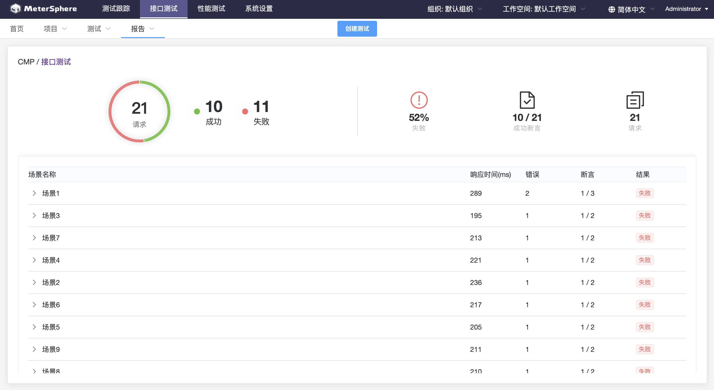

## 开发常用工具


### API测试工具

#### 1.1 PostMan

- 官网地址：https://www.postman.com/

- 本地客户端测试

- 预览：

   

#### 1.2 MeterSphere

An open source continuous testing platform. MeterSphere 是一站式的开源企业级持续测试平台，涵盖测试跟踪、接口测试、性能测试、团队协作等功能，全面兼容 JMeter、Postman 等开源、主流标准。项目采用 SpringBoot 2.x + MyBatis + Vue.js + Element + Docker + Kafka + MySQL等开发。

- GitHub仓库：https://github.com/metersphere/metersphere

- 官网文档：https://metersphere.io/docs/

- 部署后浏览器测试，在线体验地址：https://demo.metersphere.com/

  ```scss
  用户名：demo
  密码：P@ssw0rd123..
  ```

- 预览：

   